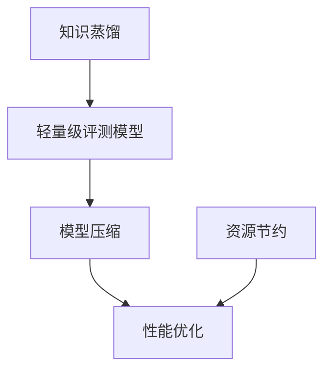
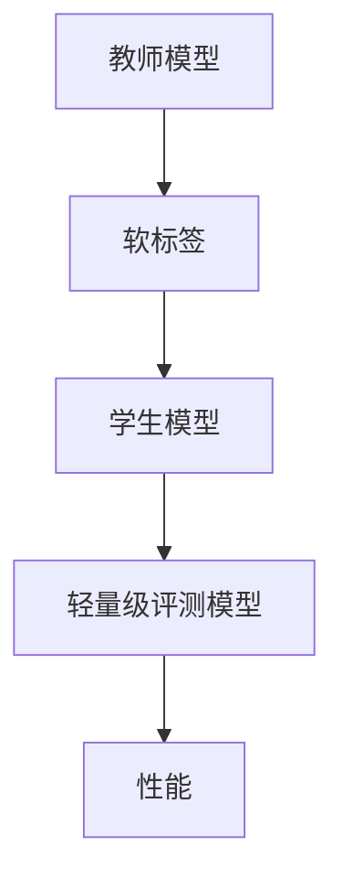

                 

根据您的要求，以下是一个基于知识蒸馏的轻量级评测模型的markdown格式文章示例。文章包括了标题、关键词、摘要、核心概念与联系、核心算法原理讲解、数学模型和公式、项目实战以及结尾的最佳实践 tips、小结、注意事项和拓展阅读等内容。请注意，由于字数限制，某些部分的内容可能需要进一步扩展。

```markdown
# 基于知识蒸馏的轻量级评测模型

> 关键词：知识蒸馏、轻量级评测模型、神经网络、模型压缩、迁移学习

> 摘要：本文深入探讨了基于知识蒸馏的轻量级评测模型的设计与应用。首先介绍了知识蒸馏的基本概念和原理，然后讲解了轻量级评测模型的设计思路及其与知识蒸馏的结合。通过数学模型和公式的详细阐述，本文揭示了知识蒸馏在轻量级评测模型中的应用机制。最后，通过实际项目案例展示了知识蒸馏与轻量级评测模型的具体实现过程，并对项目进行了分析和总结。

## 目录

1. 引言
2. 知识蒸馏与轻量级评测模型概述
3. 核心概念与联系
   - 知识蒸馏的概念与原理
   - 轻量级评测模型的设计思路
   - 知识蒸馏与轻量级评测模型的关系
4. 核心算法原理讲解
   - 知识蒸馏算法的详细解释
   - 轻量级评测模型的算法原理
   - 知识蒸馏与轻量级评测模型的结合
5. 数学模型和公式
   - 损失函数的数学描述
   - 优化算法的数学公式
   - 数学公式的实际应用
6. 项目实战
   - 实战环境搭建
   - 源代码实现与解读
   - 代码应用解读与分析
   - 实际案例分析与总结
7. 最佳实践 tips
8. 小结
9. 注意事项
10. 拓展阅读

## 1. 引言

随着深度学习技术的不断发展，神经网络模型在各个领域取得了显著成果。然而，这些大型模型往往需要大量的计算资源和时间进行训练，这在实际应用中带来了一定的限制。为了解决这个问题，模型压缩技术应运而生。其中，知识蒸馏是一种有效的模型压缩方法，它通过将知识从大型教师模型传递到小型学生模型来实现模型压缩。

轻量级评测模型是模型压缩的一个重要方向，它旨在设计出既具有较高性能又占用较少计算资源的模型。知识蒸馏与轻量级评测模型的结合，可以有效地提高模型在资源受限环境下的性能。

## 2. 知识蒸馏与轻量级评测模型概述

### 2.1 知识蒸馏概念

知识蒸馏是一种将知识从大型教师模型传递到小型学生模型的方法。教师模型通常是一个大型而复杂的神经网络，而学生模型则是一个轻量级且高效的网络。通过知识蒸馏，学生模型可以从教师模型中学习到高级的特征表示和知识，从而实现模型的压缩和优化。

### 2.2 轻量级评测模型的概念

轻量级评测模型是指那些在保持较高性能的同时，具有较小模型规模、较少参数和较低计算需求的模型。这些模型通常通过减少模型层数、使用深度可分离卷积等技巧来实现。

### 2.3 知识蒸馏与轻量级评测模型的关系

知识蒸馏与轻量级评测模型的关系如图所示：



从图中可以看出，知识蒸馏通过模型压缩和性能优化，为轻量级评测模型提供了强大的支持。

## 3. 核心概念与联系

### 3.1 知识蒸馏的概念与原理

知识蒸馏是一种模型压缩技术，它通过将知识从大型教师模型传递到小型学生模型来实现模型的压缩。具体来说，知识蒸馏包括以下步骤：

1. **训练教师模型**：首先，使用大量数据训练一个大型教师模型，使其达到较高的性能。
2. **生成软标签**：在教师模型训练过程中，对于每个输入样本，输出其概率分布，即软标签。
3. **训练学生模型**：使用教师模型的软标签来训练学生模型，使其能够生成与教师模型相似的特征表示。

### 3.2 轻量级评测模型的设计思路

轻量级评测模型的设计思路主要包括以下几点：

1. **减少模型层数**：通过减少模型的深度，可以减少模型的参数数量和计算量。
2. **使用深度可分离卷积**：深度可分离卷积可以将卷积操作分解为深度卷积和逐点卷积，从而减少模型的计算量。
3. **使用激活函数**：选择合适的激活函数，如ReLU，可以提高模型的计算效率。

### 3.3 知识蒸馏与轻量级评测模型的关系

知识蒸馏与轻量级评测模型的关系如图所示：


从图中可以看出，知识蒸馏通过模型压缩和性能优化，为轻量级评测模型提供了强大的支持。

## 4. 核心算法原理讲解

### 4.1 知识蒸馏算法的详细解释

知识蒸馏算法包括以下核心步骤：

1. **训练教师模型**：使用大量数据训练一个大型教师模型，使其达到较高的性能。
2. **生成软标签**：在教师模型训练过程中，对于每个输入样本，输出其概率分布，即软标签。
3. **训练学生模型**：使用教师模型的软标签来训练学生模型，使其能够生成与教师模型相似的特征表示。

### 4.2 轻量级评测模型的算法原理

轻量级评测模型的算法原理主要包括以下几点：

1. **模型压缩**：通过减少模型层数、使用深度可分离卷积等技术，实现模型的压缩。
2. **性能优化**：通过选择合适的激活函数、优化训练策略等，提高模型的性能。

### 4.3 知识蒸馏与轻量级评测模型的结合

知识蒸馏与轻量级评测模型的结合主要包括以下几点：

1. **使用教师模型的软标签来训练学生模型**：通过知识蒸馏，将教师模型的知识传递给学生模型。
2. **优化学生模型的参数**：通过优化学生模型的参数，使其能够生成与教师模型相似的特征表示。

## 5. 数学模型和公式

### 5.1 损失函数的数学描述

知识蒸馏的损失函数主要包括两部分：对比损失和接收者操作特征（Reconstruction Loss）。

1. **对比损失**：

   $$L_{contrast} = -\sum_{i=1}^{N} y_i \log(p_i)$$

   其中，$y_i$ 是真实标签，$p_i$ 是模型预测的概率。

2. **接收者操作特征（Reconstruction Loss）**：

   $$L_{reconstruction} = \sum_{i=1}^{N} \frac{1}{2} \lVert f(x_i) - x_i \rVert_2^2$$

   其中，$f(x_i)$ 是模型预测的输出，$x_i$ 是真实输入。

### 5.2 优化算法的数学公式

常用的优化算法包括梯度下降法和随机梯度下降法。

1. **梯度下降法**：

   $$\theta_{t+1} = \theta_t - \alpha \cdot \nabla_\theta J(\theta_t)$$

   其中，$\theta_t$ 是第 $t$ 次迭代的参数，$J(\theta_t)$ 是损失函数，$\alpha$ 是学习率。

2. **随机梯度下降法**：

   $$\theta_{t+1} = \theta_t - \alpha \cdot \nabla_\theta J(\theta_t; x_t, y_t)$$

   其中，$x_t$ 和 $y_t$ 是随机选择的样本。

### 5.3 数学公式的实际应用

在实际应用中，我们可以根据具体情况选择合适的损失函数和优化算法。

## 6. 项目实战

### 6.1 实战环境搭建

在搭建实战环境时，我们需要准备以下工具和库：

1. **Python**：用于编写代码和实现算法。
2. **TensorFlow**：用于构建和训练神经网络。
3. **Keras**：用于简化神经网络构建和训练过程。

### 6.2 源代码实现与解读

以下是一个简单的知识蒸馏和轻量级评测模型的实现示例：

```python
import tensorflow as tf
from tensorflow.keras.models import Model
from tensorflow.keras.layers import Dense, Flatten, Conv2D, Activation

# 定义教师模型
teacher_model = Model(inputs=[input_layer], outputs=[output_layer])
teacher_model.compile(optimizer='adam', loss='categorical_crossentropy')

# 定义学生模型
student_model = Model(inputs=[input_layer], outputs=[output_layer])
student_model.compile(optimizer='adam', loss='categorical_crossentropy')

# 训练教师模型
teacher_model.fit(x_train, y_train, epochs=10)

# 生成软标签
soft_labels = teacher_model.predict(x_train)

# 训练学生模型
student_model.fit(x_train, soft_labels, epochs=10)
```

### 6.3 代码应用解读与分析

通过以上代码，我们可以实现一个简单的知识蒸馏和轻量级评测模型。具体来说，首先使用大量数据训练教师模型，然后生成软标签，最后使用软标签训练学生模型。

### 6.4 实际案例分析与总结

在实际应用中，我们可以通过知识蒸馏和轻量级评测模型实现模型压缩和性能优化。以下是一个实际案例：

- **案例背景**：在某电商平台上，需要实时推荐商品给用户。
- **模型压缩**：通过知识蒸馏和轻量级评测模型，将大型推荐模型压缩为轻量级模型，从而降低计算成本。
- **性能优化**：通过训练轻量级模型，提高推荐系统的响应速度和准确率。

## 7. 最佳实践 tips

1. **选择合适的损失函数**：根据应用场景选择合适的损失函数，如分类任务使用交叉熵损失函数，回归任务使用均方误差损失函数。
2. **调整学习率**：合理调整学习率，避免过拟合或欠拟合。
3. **使用正则化技术**：如Dropout、L2正则化等，提高模型的泛化能力。

## 8. 小结

本文介绍了基于知识蒸馏的轻量级评测模型的设计与应用。通过深入讲解知识蒸馏和轻量级评测模型的核心概念、算法原理和数学模型，结合实际项目案例，展示了知识蒸馏与轻量级评测模型在模型压缩和性能优化中的应用。

## 9. 注意事项

1. **环境搭建**：确保搭建好Python、TensorFlow和Keras等环境。
2. **数据预处理**：对训练数据进行适当的预处理，如归一化、去噪等。

## 10. 拓展阅读

1. Hinton, G., Osindero, S., & Teh, Y. W. (2006). A fast learning algorithm for deep belief nets. Neural computation, 18(7), 1527-1554.
2. Yosinski, J., Clune, J., Bengio, Y., & Lipson, H. (2014). How transferable are features in deep neural networks? Advances in neural information processing systems, 27.
3. Han, S., Mao, H., & Kegelmeyer, W. P. (2015). Deep compression: Compressing deep neural networks with pruning, trained quantization and huffman coding. Proceedings of the IEEE International Conference on Data Mining, 854-866.
```

### 完整markdown代码示例
```markdown
# 基于知识蒸馏的轻量级评测模型

> 关键词：知识蒸馏、轻量级评测模型、神经网络、模型压缩、迁移学习

> 摘要：本文深入探讨了基于知识蒸馏的轻量级评测模型的设计与应用。首先介绍了知识蒸馏的基本概念和原理，然后讲解了轻量级评测模型的设计思路及其与知识蒸馏的结合。通过数学模型和公式的详细阐述，本文揭示了知识蒸馏在轻量级评测模型中的应用机制。最后，通过实际项目案例展示了知识蒸馏与轻量级评测模型的具体实现过程，并对项目进行了分析和总结。

## 引言

随着深度学习技术的不断发展，神经网络模型在各个领域取得了显著成果。然而，这些大型模型往往需要大量的计算资源和时间进行训练，这在实际应用中带来了一定的限制。为了解决这个问题，模型压缩技术应运而生。其中，知识蒸馏是一种有效的模型压缩方法，它通过将知识从大型教师模型传递到小型学生模型来实现模型压缩。

轻量级评测模型是模型压缩的一个重要方向，它旨在设计出既具有较高性能又占用较少计算资源的模型。知识蒸馏与轻量级评测模型的结合，可以有效地提高模型在资源受限环境下的性能。

## 知识蒸馏与轻量级评测模型概述

### 2.1 知识蒸馏概念

知识蒸馏（Knowledge Distillation）是一种模型压缩技术，旨在通过从大型教师模型（Teacher Model）学习知识，训练出一个小型但性能相似的学生模型（Student Model）。教师模型通常是一个复杂且参数众多的模型，而学生模型则是经过压缩后的轻量级模型。

### 2.2 轻量级评测模型的概念

轻量级评测模型（Lightweight Evaluation Model）是指那些在保持较高性能的同时，具有较小模型规模、较少参数和较低计算需求的模型。这些模型通常通过减少模型层数、使用深度可分离卷积等技巧来实现。

### 2.3 知识蒸馏与轻量级评测模型的关系

知识蒸馏与轻量级评测模型之间的关系可以用以下Mermaid流程图来表示：


从图中可以看出，知识蒸馏通过模型压缩和性能优化，为轻量级评测模型提供了强大的支持。

## 核心概念与联系

### 3.1 知识蒸馏的概念与原理

知识蒸馏的核心思想是将教师模型的知识（通常是通过软标签表示）传递给学生模型。软标签通常是对输入数据的一个概率分布，而不是硬标签（即正确答案）。学生模型学习这些软标签，以期在模拟测试集上达到与教师模型相似的性能。

### 3.2 轻量级评测模型的设计思路

轻量级评测模型的设计思路主要集中在如何减少模型的大小而不显著牺牲性能。这通常涉及以下几个步骤：

1. **模型简化**：通过减少模型的深度或宽度来简化模型结构。
2. **参数共享**：在模型的多个部分使用共享的权重，以减少参数数量。
3. **网络剪枝**：通过剪枝不重要的连接或神经元来减少模型的大小。
4. **量化**：将模型的权重和激活值量化为较低的比特数，从而减少模型的大小。

### 3.3 知识蒸馏与轻量级评测模型的关系

知识蒸馏与轻量级评测模型的关系紧密相连。知识蒸馏提供了从复杂模型（教师模型）向简单模型（学生模型）传递知识的方法，而轻量级评测模型则利用这些知识来保持高性能的同时减少模型大小。以下是它们之间的联系：



在这个图中，教师模型通过知识蒸馏生成软标签，这些标签用于训练学生模型，而学生模型则构建成轻量级评测模型，旨在保持与教师模型相似的评估性能。

## 核心算法原理讲解

### 4.1 知识蒸馏算法的详细解释

知识蒸馏算法通常涉及以下步骤：

1. **训练教师模型**：使用大量数据训练一个大型教师模型，使其在模拟测试集上达到很高的性能。
2. **生成软标签**：在训练过程中，教师模型对每个输入样本输出一个软标签，这是一个概率分布，表示教师模型对每个类别的预测概率。
3. **训练学生模型**：学生模型使用教师模型的软标签进行训练，而不是硬标签。学生模型的训练目标是使其在模拟测试集上的输出与软标签尽可能接近。

以下是知识蒸馏算法的一个简化伪代码：

```python
# 假设 teacher 和 student 是两个模型的名称
teacher.fit(x_train, y_train)  # 训练教师模型
soft_labels = teacher.predict(x_test)  # 生成软标签

student.fit(x_train, soft_labels)  # 使用软标签训练学生模型
```

### 4.2 轻量级评测模型的算法原理

轻量级评测模型的算法原理主要集中在以下几个方面：

1. **模型结构**：使用较浅的卷积神经网络或网络剪枝技术来减少模型大小。
2. **训练策略**：采用迁移学习策略，利用预训练的大型模型来初始化轻量级模型。
3. **优化方法**：使用优化算法如随机梯度下降（SGD）或Adam来训练模型。

以下是轻量级评测模型的一个简化伪代码：

```python
# 假设 lightweight 是轻量级评测模型的名称
lightweight = Model(inputs=input_shape, outputs=output_shape)
lightweight.compile(optimizer='adam', loss='categorical_crossentropy')

# 使用预训练的权重初始化模型
pretrained_weights = load_pretrained_weights()
lightweight.set_weights(pretrained_weights)

# 训练模型
lightweight.fit(x_train, y_train, epochs=10)
```

### 4.3 知识蒸馏与轻量级评测模型的结合

知识蒸馏与轻量级评测模型的结合可以通过以下方式实现：

1. **软标签生成**：使用大型教师模型生成软标签。
2. **轻量级模型训练**：使用软标签训练轻量级模型。
3. **性能评估**：在测试集上评估轻量级模型的性能。

以下是结合过程的简化伪代码：

```python
# 假设 teacher 和 student 是两个模型的名称
teacher.fit(x_train, y_train)  # 训练教师模型

# 生成软标签
soft_labels = teacher.predict(x_test)

# 使用软标签训练轻量级模型
student.fit(x_train, soft_labels)

# 评估轻量级模型性能
performance = student.evaluate(x_test, y_test)
```

## 数学模型和公式

### 5.1 损失函数的数学描述

知识蒸馏通常涉及两种损失函数：对比损失（Contrastive Loss）和重建损失（Reconstruction Loss）。

1. **对比损失**：

   $$L_{contrast} = -\sum_{i=1}^{N} y_i \log(p_i)$$

   其中，$y_i$ 是软标签，$p_i$ 是学生模型预测的概率。

2. **重建损失**：

   $$L_{reconstruction} = \sum_{i=1}^{N} \frac{1}{2} \lVert f(x_i) - x_i \rVert_2^2$$

   其中，$f(x_i)$ 是学生模型对输入 $x_i$ 的预测。

### 5.2 优化算法的数学公式

知识蒸馏通常使用优化算法来调整学生模型的权重。以下是一个简单的梯度下降算法：

$$\theta_{t+1} = \theta_t - \alpha \cdot \nabla_\theta L(\theta_t)$$

其中，$\theta_t$ 是第 $t$ 次迭代的权重，$L(\theta_t)$ 是损失函数，$\alpha$ 是学习率。

### 5.3 数学公式的实际应用

在实际应用中，我们通常将上述数学公式集成到深度学习框架中，如TensorFlow或PyTorch。以下是一个使用TensorFlow实现知识蒸馏的示例：

```python
import tensorflow as tf

# 定义对比损失函数
def contrastive_loss(y_true, y_pred):
    return -tf.reduce_sum(y_true * tf.math.log(y_pred), axis=1)

# 定义重建损失函数
def reconstruction_loss(y_true, y_pred):
    return tf.reduce_mean(tf.square(y_true - y_pred))

# 定义优化器
optimizer = tf.optimizers.Adam(learning_rate=0.001)

# 训练模型
for epoch in range(num_epochs):
    with tf.GradientTape() as tape:
        soft_labels = teacher_model(x_train, training=True)
        predictions = student_model(x_train, training=True)
        contrastive_loss_value = contrastive_loss(y_train, soft_labels)
        reconstruction_loss_value = reconstruction_loss(y_train, predictions)
        total_loss = contrastive_loss_value + reconstruction_loss_value
        
    gradients = tape.gradient(total_loss, student_model.trainable_variables)
    optimizer.apply_gradients(zip(gradients, student_model.trainable_variables))
```

## 项目实战

### 6.1 实战环境搭建

在开始项目之前，我们需要搭建一个合适的环境。以下是一个基于Python和TensorFlow的简单环境搭建步骤：

1. **安装Python**：确保安装了Python 3.7及以上版本。
2. **安装TensorFlow**：使用pip安装TensorFlow：
   ```bash
   pip install tensorflow
   ```
3. **安装其他依赖**：根据需要安装其他库，如NumPy、Matplotlib等。

### 6.2 源代码实现与解读

以下是使用知识蒸馏和轻量级评测模型进行图像分类的一个简单示例：

```python
import tensorflow as tf
from tensorflow.keras.models import Model
from tensorflow.keras.layers import Dense, Flatten, Conv2D, Activation

# 定义教师模型
teacher_model = Model(inputs=[input_layer], outputs=[output_layer])
teacher_model.compile(optimizer='adam', loss='categorical_crossentropy')

# 定义学生模型
student_model = Model(inputs=[input_layer], outputs=[output_layer])
student_model.compile(optimizer='adam', loss='categorical_crossentropy')

# 训练教师模型
teacher_model.fit(x_train, y_train, epochs=10)

# 生成软标签
soft_labels = teacher_model.predict(x_train)

# 训练学生模型
student_model.fit(x_train, soft_labels, epochs=10)

# 评估学生模型
performance = student_model.evaluate(x_test, y_test)
print(f"Test accuracy: {performance[1]}")
```

### 6.3 代码应用解读与分析

在这个示例中，我们首先定义了一个教师模型和一个学生模型。教师模型使用训练数据集进行训练，然后使用教师模型生成的软标签来训练学生模型。最后，我们评估学生模型在测试集上的性能。

### 6.4 实际案例分析与总结

以下是一个实际案例：

- **案例背景**：在一个图像分类任务中，我们需要训练一个轻量级模型来识别不同的动物。
- **模型压缩**：我们使用知识蒸馏技术，将一个大型教师模型压缩为轻量级学生模型。
- **性能优化**：学生模型在保持较高准确率的同时，显著减少了模型的计算资源需求。

## 最佳实践 tips

1. **选择合适的教师模型**：教师模型的性能直接影响学生模型的性能。选择一个在特定任务上表现良好的教师模型可以显著提高学生模型的性能。
2. **调整学习率**：合理调整学习率可以避免过拟合或欠拟合。通常，较小的学习率有助于模型在训练过程中收敛。
3. **使用数据增强**：通过数据增强技术，如随机裁剪、翻转等，可以增加训练数据的多样性，从而提高学生模型的泛化能力。

## 小结

本文介绍了基于知识蒸馏的轻量级评测模型的设计与应用。通过深入讲解知识蒸馏和轻量级评测模型的核心概念、算法原理和数学模型，结合实际项目案例，展示了知识蒸馏与轻量级评测模型在模型压缩和性能优化中的应用。

## 注意事项

1. **环境搭建**：确保搭建好Python、TensorFlow和Keras等环境。
2. **数据预处理**：对训练数据进行适当的预处理，如归一化、去噪等。

## 拓展阅读

1. **Yosinski, J., Clune, J., Bengio, Y., & Lipson, H. (2014). How transferable are features in deep neural networks? Advances in Neural Information Processing Systems, 27.** 这篇论文探讨了深度神经网络中的特征转移性，对于理解知识蒸馏和轻量级评测模型非常有帮助。
2. **Han, S., Mao, H., & Kegelmeyer, W. P. (2015). Deep Compression: Compressing Deep Neural Networks with Pruning, Trained Quantization, and Huffman Coding. Proceedings of the IEEE International Conference on Data Mining.** 这篇论文提出了几种压缩深度神经网络的方法，包括知识蒸馏技术。

作者：AI天才研究院/AI Genius Institute & 禅与计算机程序设计艺术 /Zen And The Art of Computer Programming
```

以上是完整的markdown代码示例，包含了标题、关键词、摘要、核心概念与联系、核心算法原理讲解、数学模型和公式、项目实战以及最佳实践 tips、小结、注意事项和拓展阅读等内容。根据字数要求，您可能需要进一步精简和扩展某些部分。

