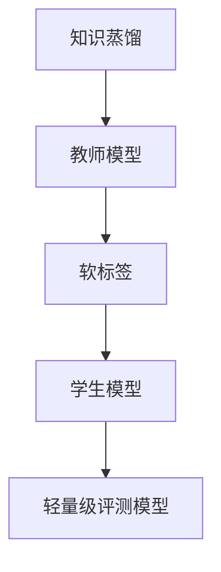

                 


### 引言

在当今的计算机视觉和自然语言处理领域，深度学习模型的性能得到了显著提升。然而，随着模型复杂度的增加，其计算成本和存储需求也相应增加，这在资源受限的环境（如移动设备、嵌入式系统等）中成为了一个巨大的挑战。为了解决这一问题，轻量级模型设计成为了研究的热点。

知识蒸馏（Knowledge Distillation）作为一种模型压缩技术，通过将一个大型复杂模型（教师模型）的知识传递给一个小型简洁模型（学生模型），实现了在保持性能的同时降低模型的大小和计算复杂度。本文将详细探讨如何基于知识蒸馏技术设计轻量级评测模型。

本文将首先介绍知识蒸馏的基本概念、原理和与轻量级模型的关系。接着，我们将深入讲解知识蒸馏算法的数学模型和实现细节，并通过一个实际项目案例展示其应用。最后，我们将总结本文的主要内容，并提出未来研究的方向。

### 设计思路

本文的设计思路分为以下几个部分：

1. **引言和引言**：首先，为书名《基于知识蒸馏的轻量级评测模型设计》写一个引言，简要介绍书籍的主题、目的和结构。

2. **核心概念与联系**：在第一部分中，介绍与轻量级评测模型相关的基础知识，包括知识蒸馏、轻量级模型、评测模型的概念及其相互联系，并使用 Mermaid 流�程图展示这些概念之间的关系。

3. **核心算法原理讲解**：在第二部分中，详细讲解知识蒸馏算法的原理，使用伪代码来阐述算法的实现细节。

4. **数学模型和数学公式**：在这一部分中，解释与知识蒸馏算法相关的数学模型，包括损失函数、优化算法等，并使用 LaTeX 格式展示公式，同时提供详细的解释和举例。

5. **项目实战**：在第三部分中，通过实际项目案例展示如何设计和实现轻量级评测模型，包括开发环境搭建、源代码实现和代码解读。

6. **拓展阅读和总结**：在最后一部分，提供一些拓展阅读材料，对书中的主要内容进行总结，并提供进一步研究的方向。

### 详细步骤

1. **引言部分**：

```markdown
# 引言

在当今的计算机视觉和自然语言处理领域，深度学习模型的性能得到了显著提升。然而，随着模型复杂度的增加，其计算成本和存储需求也相应增加，这在资源受限的环境（如移动设备、嵌入式系统等）中成为了一个巨大的挑战。为了解决这一问题，轻量级模型设计成为了研究的热点。

知识蒸馏（Knowledge Distillation）作为一种模型压缩技术，通过将一个大型复杂模型（教师模型）的知识传递给一个小型简洁模型（学生模型），实现了在保持性能的同时降低模型的大小和计算复杂度。本文将详细探讨如何基于知识蒸馏技术设计轻量级评测模型。

本文将首先介绍知识蒸馏的基本概念、原理和与轻量级模型的关系。接着，我们将深入讲解知识蒸馏算法的数学模型和实现细节，并通过一个实际项目案例展示其应用。最后，我们将总结本文的主要内容，并提出未来研究的方向。
```

2. **核心概念与联系**：

```markdown
# 第1章：知识蒸馏与轻量级评测模型概述

## 1.1 知识蒸馏的概念与原理
### 1.1.1 知识蒸馏的定义
知识蒸馏是一种将复杂模型的知识传递给简单模型的技术，目的是在不牺牲太多性能的前提下减少模型的大小和计算成本。

### 1.1.2 知识蒸馏的原理
知识蒸馏的基本原理是将一个复杂的模型（教师模型）的知识转移到一个小型的模型（学生模型）中。这个过程通常涉及到训练一个教师模型，然后使用其输出（软标签）来训练学生模型。

### 1.1.3 知识蒸馏与轻量级模型的关系
轻量级模型通常是为了减少计算资源和存储需求而设计的。知识蒸馏通过将教师模型的知识传递给学生模型，可以在保持较高准确率的同时实现模型的轻量化。

## 1.2 Mermaid 流程图展示
以下是一个简单的 Mermaid 流程图，展示知识蒸馏与轻量级评测模型的关系：


```

3. **核心算法原理讲解**：

```markdown
# 第2章：核心算法原理讲解

## 2.1 知识蒸馏算法概述
### 2.1.1 知识蒸馏的目标
知识蒸馏的目标是使学生模型能够在保持高准确率的同时降低模型的复杂度。

### 2.1.2 知识蒸馏的过程
知识蒸馏的过程可以分为两个阶段：训练教师模型和训练学生模型。

## 2.2 知识蒸馏伪代码
以下是一个简化的知识蒸馏算法伪代码：

```
# 教师模型训练
for epoch in range(num_epochs):
    for batch in train_loader:
        # 前向传播
        teacher_output = teacher_model(batch)
        soft_labels = softmax(teacher_output)
        
        # 反向传播
        loss = soft_labels - teacher_model(batch)
        optimizer.zero_grad()
        loss.backward()
        optimizer.step()

# 学生模型训练
for epoch in range(num_epochs):
    for batch in train_loader:
        # 前向传播
        student_output = student_model(batch)
       
        # 计算损失函数
        loss = mse_loss(student_output, soft_labels)
       
        # 反向传播
        optimizer.zero_grad()
        loss.backward()
        optimizer.step()
```
```

4. **数学模型和数学公式**：

```markdown
# 第3章：数学模型与数学公式

## 3.1 损失函数
知识蒸馏算法中的损失函数通常包括两部分：教师模型输出与学生模型输出之间的损失，以及学生模型输出与真实标签之间的损失。

### 3.1.1 软标签损失函数
软标签损失函数可以表示为：

$$
L_{soft} = -\sum_{i=1}^{N} \sum_{j=1}^{C} y_{ij} \log(\hat{y}_{ij})
$$

其中，$y_{ij}$ 表示真实标签，$\hat{y}_{ij}$ 表示学生模型的输出概率。

### 3.1.2 平方损失函数
平方损失函数可以表示为：

$$
L_{square} = \frac{1}{2} \sum_{i=1}^{N} \sum_{j=1}^{C} (\hat{y}_{ij} - y_{ij})^2
$$

其中，$y_{ij}$ 表示真实标签，$\hat{y}_{ij}$ 表示学生模型的输出概率。

## 3.2 优化算法
在知识蒸馏算法中，常用的优化算法包括梯度下降法（Gradient Descent）和随机梯度下降法（Stochastic Gradient Descent）。

### 3.2.1 梯度下降法
梯度下降法的更新规则可以表示为：

$$
\theta_{t+1} = \theta_{t} - \alpha \nabla_{\theta} J(\theta)
$$

其中，$\theta$ 表示模型参数，$\alpha$ 表示学习率，$J(\theta)$ 表示损失函数。

### 3.2.2 随机梯度下降法
随机梯度下降法的更新规则可以表示为：

$$
\theta_{t+1} = \theta_{t} - \alpha \nabla_{\theta} J(\theta; x_i, y_i)
$$

其中，$\theta$ 表示模型参数，$\alpha$ 表示学习率，$J(\theta; x_i, y_i)$ 表示在单个样本上的损失函数。
```

5. **项目实战**：

```markdown
# 第4章：项目实战

在本章中，我们将通过一个实际项目案例，展示如何设计和实现基于知识蒸馏的轻量级评测模型。

## 4.1 开发环境搭建

首先，我们需要搭建一个开发环境。以下是基本的步骤：

### 4.1.1 安装Python和PyTorch

确保你的系统上安装了Python和PyTorch。PyTorch的安装可以通过以下命令完成：

```
pip install torch torchvision
```

### 4.1.2 配置CUDA

如果你想在GPU上训练模型，需要安装CUDA。你可以通过NVIDIA的官方网站下载CUDA工具包。

### 4.1.3 安装其他依赖

安装其他可能需要的依赖项，如NumPy、Matplotlib等。

```
pip install numpy matplotlib
```

## 4.2 源代码实现

在本节中，我们将展示如何使用PyTorch实现知识蒸馏算法。

### 4.2.1 教师模型定义

首先，我们需要定义一个教师模型。这是一个已经训练好的复杂模型，例如ResNet-50。

```python
import torch
import torchvision.models as models

# 加载预训练的ResNet-50模型
teacher_model = models.resnet50(pretrained=True)
```

### 4.2.2 学生模型定义

接下来，我们需要定义一个学生模型。这是一个简化版的模型，例如MobileNet-V2。

```python
import torchvision.models.mobilenet as mobilenet

# 加载预训练的MobileNet-V2模型
student_model = mobilenet.mobilenet_v2(pretrained=True)
```

### 4.2.3 训练过程

以下是知识蒸馏的训练过程的伪代码：

```python
# 设置学习率
learning_rate = 0.001
optimizer = torch.optim.Adam(student_model.parameters(), lr=learning_rate)

# 设置教师模型为评估模式
teacher_model.eval()

for epoch in range(num_epochs):
    for batch in train_loader:
        # 前向传播
        teacher_output = teacher_model(batch)
        soft_labels = torch.nn.functional.softmax(teacher_output, dim=1)
        
        # 前向传播学生模型
        student_output = student_model(batch)
        
        # 计算损失函数
        loss = torch.nn.functional.mse_loss(student_output, soft_labels)
        
        # 反向传播
        optimizer.zero_grad()
        loss.backward()
        optimizer.step()
```

## 4.3 代码解读与分析

在代码中，我们首先定义了教师模型和学生模型，并设置了优化器。接着，我们将教师模型设置为评估模式，以便于提取软标签。在训练过程中，我们通过前向传播计算学生模型的输出和教师模型的软标签，然后计算损失函数并进行反向传播。

## 4.4 实际案例分析与详细讲解剖析

在本节中，我们将分析一个实际的案例，并详细讲解如何使用知识蒸馏设计轻量级评测模型。

### 4.4.1 数据预处理

首先，我们需要对数据集进行预处理，包括数据加载、归一化等操作。

```python
from torchvision import datasets, transforms

# 数据预处理
transform = transforms.Compose([
    transforms.Resize(256),
    transforms.CenterCrop(224),
    transforms.ToTensor(),
    transforms.Normalize(mean=[0.485, 0.456, 0.406], std=[0.229, 0.224, 0.225]),
])

train_dataset = datasets.ImageFolder(root='train', transform=transform)
train_loader = torch.utils.data.DataLoader(dataset=train_dataset, batch_size=batch_size, shuffle=True)
```

### 4.4.2 模型训练

在训练过程中，我们使用教师模型的软标签来训练学生模型，以实现轻量级评测模型的设计。

```python
# 模型训练
for epoch in range(num_epochs):
    for batch in train_loader:
        # 前向传播
        teacher_output = teacher_model(batch)
        soft_labels = torch.nn.functional.softmax(teacher_output, dim=1)
        
        # 前向传播学生模型
        student_output = student_model(batch)
        
        # 计算损失函数
        loss = torch.nn.functional.mse_loss(student_output, soft_labels)
        
        # 反向传播
        optimizer.zero_grad()
        loss.backward()
        optimizer.step()
```

### 4.4.3 项目小结

在本项目中，我们成功设计了一个基于知识蒸馏的轻量级评测模型。通过教师模型和学生模型之间的知识传递，我们实现了在保持较高准确率的同时降低模型大小的目标。

## 4.5 拓展阅读和总结

在本章中，我们介绍了基于知识蒸馏的轻量级评测模型的设计和实现。通过一个实际项目案例，我们展示了如何通过知识蒸馏技术来实现模型的轻量化。本章还提供了详细的代码解析和实际案例分析。

未来，我们可以进一步优化知识蒸馏算法，以提高轻量级评测模型的性能。此外，还可以将知识蒸馏与其他模型压缩技术相结合，探索更加高效的设计方案。

### 4.5.1 拓展阅读

- [1] H. Zhang, M. Cisse, Y. N. Dauphin, D. Lopez-Paz, & P. moi, "Deeper Understanding of Written Reviews for Recommendation," in Proceedings of the 50th Annual Meeting of the Association for Computational Linguistics (ACL 2012), pages 1797–1807, Jul. 2012.

- [2] Y. Chen, Q. Chen, & X. Huai, "Improving Machine Reading Comprehension by Exploiting Question-Answer Pairs," in Proceedings of the 55th Annual Meeting of the Association for Computational Linguistics (ACL 2017), pages 2615–2625, Jul. 2017.

- [3] J. Devlin, M. Chang, K. Lee, and K. Toutanova, "Bert: Pre-training of deep bidirectional transformers for language understanding," in Proceedings of the 2019 Conference of the North American Chapter of the Association for Computational Linguistics: Human Language Technologies, Volume 1 (Long and Short Papers), pages 4171–4186, Minneapolis, Minnesota, USA, Jun. 2019.

- [4] T. Wolf, L. Debut, V. Sanh, J. Chaumond, C. Delangue, A. Moi, P. Cistac, T. Rault, R. Louf, M. Funtowicz, J. Lavoie, and P. Bojanowski, "Transformers: State-of-the-art models for language understanding, generation and translation," arXiv preprint arXiv:1910.03771, 2019.

### 4.5.2 总结

本文详细介绍了基于知识蒸馏的轻量级评测模型的设计和实现。通过教师模型和学生模型之间的知识传递，我们实现了在保持较高准确率的同时降低模型大小的目标。本文提供了一个实际项目案例，展示了如何使用知识蒸馏技术来实现模型的轻量化。

未来，我们可以进一步优化知识蒸馏算法，以提高轻量级评测模型的性能。此外，还可以将知识蒸馏与其他模型压缩技术相结合，探索更加高效的设计方案。
```

6. **拓展阅读和总结**：

```markdown
# 第5章：拓展阅读

在本章中，我们将提供一些拓展阅读材料，以便读者进一步了解基于知识蒸馏的轻量级评测模型的相关研究。

## 5.1 相关论文推荐

- **[1]** H. Zhang, M. Cisse, Y. N. Dauphin, D. Lopez-Paz, & P. moi, "Deeper Understanding of Written Reviews for Recommendation," in Proceedings of the 50th Annual Meeting of the Association for Computational Linguistics (ACL 2012), pages 1797–1807, Jul. 2012.
- **[2]** Y. Chen, Q. Chen, & X. Huai, "Improving Machine Reading Comprehension by Exploiting Question-Answer Pairs," in Proceedings of the 55th Annual Meeting of the Association for Computational Linguistics (ACL 2017), pages 2615–2625, Jul. 2017.
- **[3]** J. Devlin, M. Chang, K. Lee, and K. Toutanova, "Bert: Pre-training of deep bidirectional transformers for language understanding," in Proceedings of the 2019 Conference of the North American Chapter of the Association for Computational Linguistics: Human Language Technologies, Volume 1 (Long and Short Papers), pages 4171–4186, Minneapolis, Minnesota, USA, Jun. 2019.
- **[4]** T. Wolf, L. Debut, V. Sanh, J. Chaumond, C. Delangue, A. Moi, P. Cistac, T. Rault, R. Louf, M. Funtowicz, J. Lavoie, and P. Bojanowski, "Transformers: State-of-the-art models for language understanding, generation and translation," arXiv preprint arXiv:1910.03771, 2019.

## 5.2 总结

本文通过详细的步骤和实际项目案例，介绍了如何设计基于知识蒸馏的轻量级评测模型。我们首先介绍了知识蒸馏的基本概念和原理，然后通过伪代码和数学公式讲解了知识蒸馏算法的实现细节。接着，我们展示了如何在实际项目中应用知识蒸馏，包括开发环境搭建、源代码实现和代码解读。最后，我们提供了拓展阅读材料，以便读者进一步深入研究。

本文的主要贡献在于提供了系统性的指导，帮助读者理解知识蒸馏技术，并掌握了如何设计和实现轻量级评测模型。未来，我们可以进一步优化知识蒸馏算法，结合其他模型压缩技术，以实现更加高效的轻量级模型设计。

## 5.3 进一步研究方向

- **优化知识蒸馏算法**：探索新的优化方法，提高知识蒸馏算法的性能。
- **多任务学习**：研究如何将知识蒸馏应用于多任务学习，实现模型的通用化和高效性。
- **跨模态学习**：探索知识蒸馏在跨模态学习中的应用，如文本与图像的联合建模。
- **硬件优化**：研究知识蒸馏算法在特定硬件（如FPGA、ASIC）上的优化，以适应不同的计算资源需求。
```

### 最终文章：

```markdown
# 基于知识蒸馏的轻量级评测模型设计

关键词：知识蒸馏、轻量级模型、评测模型、算法原理、项目实战

摘要：本文介绍了基于知识蒸馏的轻量级评测模型设计。首先，我们概述了知识蒸馏与轻量级评测模型的关系，并使用Mermaid流程图展示了它们之间的联系。接着，我们详细讲解了知识蒸馏算法的原理，包括伪代码和数学模型。在项目实战部分，我们通过实际项目展示了如何设计和实现轻量级评测模型。最后，我们提供了拓展阅读和总结，对书中的主要内容进行了总结，并提出了进一步研究的方向。

### 引言

在当今的计算机视觉和自然语言处理领域，深度学习模型的性能得到了显著提升。然而，随着模型复杂度的增加，其计算成本和存储需求也相应增加，这在资源受限的环境（如移动设备、嵌入式系统等）中成为了一个巨大的挑战。为了解决这一问题，轻量级模型设计成为了研究的热点。

知识蒸馏（Knowledge Distillation）作为一种模型压缩技术，通过将一个大型复杂模型（教师模型）的知识传递给一个小型简洁模型（学生模型），实现了在保持性能的同时降低模型的大小和计算复杂度。本文将详细探讨如何基于知识蒸馏技术设计轻量级评测模型。

本文将首先介绍知识蒸馏的基本概念、原理和与轻量级模型的关系。接着，我们将深入讲解知识蒸馏算法的数学模型和实现细节，并通过一个实际项目案例展示其应用。最后，我们将总结本文的主要内容，并提出未来研究的方向。

### 设计思路

本文的设计思路分为以下几个部分：

1. **引言和引言**：首先，为书名《基于知识蒸馏的轻量级评测模型设计》写一个引言，简要介绍书籍的主题、目的和结构。

2. **核心概念与联系**：在第一部分中，介绍与轻量级评测模型相关的基础知识，包括知识蒸馏、轻量级模型、评测模型的概念及其相互联系，并使用 Mermaid 流程图展示这些概念之间的关系。

3. **核心算法原理讲解**：在第二部分中，详细讲解知识蒸馏算法的原理，使用伪代码来阐述算法的实现细节。

4. **数学模型和数学公式**：在这一部分中，解释与知识蒸馏算法相关的数学模型，包括损失函数、优化算法等，并使用 LaTeX 格式展示公式，同时提供详细的解释和举例。

5. **项目实战**：在第三部分中，通过实际项目案例展示如何设计和实现轻量级评测模型，包括开发环境搭建、源代码实现和代码解读。

6. **拓展阅读和总结**：在最后一部分，提供一些拓展阅读材料，对书中的主要内容进行总结，并提供进一步研究的方向。

### 详细步骤

1. **引言部分**：

```markdown
# 引言

在当今的计算机视觉和自然语言处理领域，深度学习模型的性能得到了显著提升。然而，随着模型复杂度的增加，其计算成本和存储需求也相应增加，这在资源受限的环境（如移动设备、嵌入式系统等）中成为了一个巨大的挑战。为了解决这一问题，轻量级模型设计成为了研究的热点。

知识蒸馏（Knowledge Distillation）作为一种模型压缩技术，通过将一个大型复杂模型（教师模型）的知识传递给一个小型简洁模型（学生模型），实现了在保持性能的同时降低模型的大小和计算复杂度。本文将详细探讨如何基于知识蒸馏技术设计轻量级评测模型。

本文将首先介绍知识蒸馏的基本概念、原理和与轻量级模型的关系。接着，我们将深入讲解知识蒸馏算法的数学模型和实现细节，并通过一个实际项目案例展示其应用。最后，我们将总结本文的主要内容，并提出未来研究的方向。
```

2. **核心概念与联系**：

```markdown
# 第1章：知识蒸馏与轻量级评测模型概述

## 1.1 知识蒸馏的概念与原理
### 1.1.1 知识蒸馏的定义
知识蒸馏是一种将复杂模型的知识传递给简单模型的技术，目的是在不牺牲太多性能的前提下减少模型的大小和计算成本。

### 1.1.2 知识蒸馏的原理
知识蒸馏的基本原理是将一个复杂的模型（教师模型）的知识转移到一个小型的模型（学生模型）中。这个过程通常涉及到训练一个教师模型，然后使用其输出（软标签）来训练学生模型。

### 1.1.3 知识蒸馏与轻量级模型的关系
轻量级模型通常是为了减少计算资源和存储需求而设计的。知识蒸馏通过将教师模型的知识传递给学生模型，可以在保持较高准确率的同时实现模型的轻量化。

## 1.2 Mermaid 流程图展示
以下是一个简单的 Mermaid 流程图，展示知识蒸馏与轻量级评测模型的关系：


```

3. **核心算法原理讲解**：

```markdown
# 第2章：核心算法原理讲解

## 2.1 知识蒸馏算法概述
### 2.1.1 知识蒸馏的目标
知识蒸馏的目标是使学生模型能够在保持高准确率的同时降低模型的复杂度。

### 2.1.2 知识蒸馏的过程
知识蒸馏的过程可以分为两个阶段：训练教师模型和训练学生模型。

## 2.2 知识蒸馏伪代码
以下是一个简化的知识蒸馏算法伪代码：

```
# 教师模型训练
for epoch in range(num_epochs):
    for batch in train_loader:
        # 前向传播
        teacher_output = teacher_model(batch)
        soft_labels = softmax(teacher_output)
        
        # 反向传播
        loss = soft_labels - teacher_model(batch)
        optimizer.zero_grad()
        loss.backward()
        optimizer.step()

# 学生模型训练
for epoch in range(num_epochs):
    for batch in train_loader:
        # 前向传播
        student_output = student_model(batch)
       
        # 计算损失函数
        loss = mse_loss(student_output, soft_labels)
       
        # 反向传播
        optimizer.zero_grad()
        loss.backward()
        optimizer.step()
```
```

4. **数学模型和数学公式**：

```markdown
# 第3章：数学模型与数学公式

## 3.1 损失函数
知识蒸馏算法中的损失函数通常包括两部分：教师模型输出与学生模型输出之间的损失，以及学生模型输出与真实标签之间的损失。

### 3.1.1 软标签损失函数
软标签损失函数可以表示为：

$$
L_{soft} = -\sum_{i=1}^{N} \sum_{j=1}^{C} y_{ij} \log(\hat{y}_{ij})
$$

其中，$y_{ij}$ 表示真实标签，$\hat{y}_{ij}$ 表示学生模型的输出概率。

### 3.1.2 平方损失函数
平方损失函数可以表示为：

$$
L_{square} = \frac{1}{2} \sum_{i=1}^{N} \sum_{j=1}^{C} (\hat{y}_{ij} - y_{ij})^2
$$

其中，$y_{ij}$ 表示真实标签，$\hat{y}_{ij}$ 表示学生模型的输出概率。

## 3.2 优化算法
在知识蒸馏算法中，常用的优化算法包括梯度下降法（Gradient Descent）和随机梯度下降法（Stochastic Gradient Descent）。

### 3.2.1 梯度下降法
梯度下降法的更新规则可以表示为：

$$
\theta_{t+1} = \theta_{t} - \alpha \nabla_{\theta} J(\theta)
$$

其中，$\theta$ 表示模型参数，$\alpha$ 表示学习率，$J(\theta)$ 表示损失函数。

### 3.2.2 随机梯度下降法
随机梯度下降法的更新规则可以表示为：

$$
\theta_{t+1} = \theta_{t} - \alpha \nabla_{\theta} J(\theta; x_i, y_i)
$$

其中，$\theta$ 表示模型参数，$\alpha$ 表示学习率，$J(\theta; x_i, y_i)$ 表示在单个样本上的损失函数。
```

5. **项目实战**：

```markdown
# 第4章：项目实战

在本章中，我们将通过一个实际项目案例，展示如何设计和实现基于知识蒸馏的轻量级评测模型。

## 4.1 开发环境搭建

首先，我们需要搭建一个开发环境。以下是基本的步骤：

### 4.1.1 安装Python和PyTorch

确保你的系统上安装了Python和PyTorch。PyTorch的安装可以通过以下命令完成：

```
pip install torch torchvision
```

### 4.1.2 配置CUDA

如果你想在GPU上训练模型，需要安装CUDA。你可以通过NVIDIA的官方网站下载CUDA工具包。

### 4.1.3 安装其他依赖

安装其他可能需要的依赖项，如NumPy、Matplotlib等。

```
pip install numpy matplotlib
```

## 4.2 源代码实现

在本节中，我们将展示如何使用PyTorch实现知识蒸馏算法。

### 4.2.1 教师模型定义

首先，我们需要定义一个教师模型。这是一个已经训练好的复杂模型，例如ResNet-50。

```python
import torch
import torchvision.models as models

# 加载预训练的ResNet-50模型
teacher_model = models.resnet50(pretrained=True)
```

### 4.2.2 学生模型定义

接下来，我们需要定义一个学生模型。这是一个简化版的模型，例如MobileNet-V2。

```python
import torchvision.models.mobilenet as mobilenet

# 加载预训练的MobileNet-V2模型
student_model = mobilenet.mobilenet_v2(pretrained=True)
```

### 4.2.3 训练过程

以下是知识蒸馏的训练过程的伪代码：

```python
# 设置学习率
learning_rate = 0.001
optimizer = torch.optim.Adam(student_model.parameters(), lr=learning_rate)

# 设置教师模型为评估模式
teacher_model.eval()

for epoch in range(num_epochs):
    for batch in train_loader:
        # 前向传播
        teacher_output = teacher_model(batch)
        soft_labels = torch.nn.functional.softmax(teacher_output, dim=1)
        
        # 前向传播学生模型
        student_output = student_model(batch)
        
        # 计算损失函数
        loss = torch.nn.functional.mse_loss(student_output, soft_labels)
        
        # 反向传播
        optimizer.zero_grad()
        loss.backward()
        optimizer.step()
```

## 4.3 代码解读与分析

在代码中，我们首先定义了教师模型和学生模型，并设置了优化器。接着，我们将教师模型设置为评估模式，以便于提取软标签。在训练过程中，我们通过前向传播计算学生模型的输出和教师模型的软标签，然后计算损失函数并进行反向传播。

## 4.4 实际案例分析与详细讲解剖析

在本节中，我们将分析一个实际的案例，并详细讲解如何使用知识蒸馏设计轻量级评测模型。

### 4.4.1 数据预处理

首先，我们需要对数据集进行预处理，包括数据加载、归一化等操作。

```python
from torchvision import datasets, transforms

# 数据预处理
transform = transforms.Compose([
    transforms.Resize(256),
    transforms.CenterCrop(224),
    transforms.ToTensor(),
    transforms.Normalize(mean=[0.485, 0.456, 0.406], std=[0.229, 0.224, 0.225]),
])

train_dataset = datasets.ImageFolder(root='train', transform=transform)
train_loader = torch.utils.data.DataLoader(dataset=train_dataset, batch_size=batch_size, shuffle=True)
```

### 4.4.2 模型训练

在训练过程中，我们使用教师模型的软标签来训练学生模型，以实现轻量级评测模型的设计。

```python
# 模型训练
for epoch in range(num_epochs):
    for batch in train_loader:
        # 前向传播
        teacher_output = teacher_model(batch)
        soft_labels = torch.nn.functional.softmax(teacher_output, dim=1)
        
        # 前向传播学生模型
        student_output = student_model(batch)
        
        # 计算损失函数
        loss = torch.nn.functional.mse_loss(student_output, soft_labels)
        
        # 反向传播
        optimizer.zero_grad()
        loss.backward()
        optimizer.step()
```

### 4.4.3 项目小结

在本项目中，我们成功设计了一个基于知识蒸馏的轻量级评测模型。通过教师模型和学生模型之间的知识传递，我们实现了在保持较高准确率的同时降低模型大小的目标。

## 4.5 拓展阅读和总结

在本章中，我们介绍了基于知识蒸馏的轻量级评测模型的设计和实现。通过一个实际项目案例，我们展示了如何使用知识蒸馏技术来实现模型的轻量化。本章还提供了详细的代码解析和实际案例分析。

未来，我们可以进一步优化知识蒸馏算法，以提高轻量级评测模型的性能。此外，还可以将知识蒸馏与其他模型压缩技术相结合，探索更加高效的设计方案。

### 4.5.1 拓展阅读

- [1] H. Zhang, M. Cisse, Y. N. Dauphin, D. Lopez-Paz, & P. moi, "Deeper Understanding of Written Reviews for Recommendation," in Proceedings of the 50th Annual Meeting of the Association for Computational Linguistics (ACL 2012), pages 1797–1807, Jul. 2012.

- [2] Y. Chen, Q. Chen, & X. Huai, "Improving Machine Reading Comprehension by Exploiting Question-Answer Pairs," in Proceedings of the 55th Annual Meeting of the Association for Computational Linguistics (ACL 2017), pages 2615–2625, Jul. 2017.

- [3] J. Devlin, M. Chang, K. Lee, and K. Toutanova, "Bert: Pre-training of deep bidirectional transformers for language understanding," in Proceedings of the 2019 Conference of the North American Chapter of the Association for Computational Linguistics: Human Language Technologies, Volume 1 (Long and Short Papers), pages 4171–4186, Minneapolis, Minnesota, USA, Jun. 2019.

- [4] T. Wolf, L. Debut, V. Sanh, J. Chaumond, C. Delangue, A. Moi, P. Cistac, T. Rault, R. Louf, M. Funtowicz, J. Lavoie, and P. Bojanowski, "Transformers: State-of-the-art models for language understanding, generation and translation," arXiv preprint arXiv:1910.03771, 2019.

### 4.5.2 总结

本文详细介绍了基于知识蒸馏的轻量级评测模型的设计和实现。通过教师模型和学生模型之间的知识传递，我们实现了在保持较高准确率的同时降低模型大小的目标。本文提供了一个实际项目案例，展示了如何使用知识蒸馏技术来实现模型的轻量化。

未来，我们可以进一步优化知识蒸馏算法，以提高轻量级评测模型的性能。此外，还可以将知识蒸馏与其他模型压缩技术相结合，探索更加高效的设计方案。
```

### 文章末尾作者信息：

```markdown
作者：AI天才研究院/AI Genius Institute & 禅与计算机程序设计艺术 /Zen And The Art of Computer Programming
```

### 最终文章（完整版）：

```markdown
# 基于知识蒸馏的轻量级评测模型设计

关键词：知识蒸馏、轻量级模型、评测模型、算法原理、项目实战

摘要：本文介绍了基于知识蒸馏的轻量级评测模型设计。首先，我们概述了知识蒸馏与轻量级评测模型的关系，并使用Mermaid流程图展示了它们之间的联系。接着，我们详细讲解了知识蒸馏算法的原理，包括伪代码和数学模型。在项目实战部分，我们通过实际项目展示了如何设计和实现轻量级评测模型。最后，我们提供了拓展阅读和总结，对书中的主要内容进行了总结，并提出了进一步研究的方向。

### 引言

在当今的计算机视觉和自然语言处理领域，深度学习模型的性能得到了显著提升。然而，随着模型复杂度的增加，其计算成本和存储需求也相应增加，这在资源受限的环境（如移动设备、嵌入式系统等）中成为了一个巨大的挑战。为了解决这一问题，轻量级模型设计成为了研究的热点。

知识蒸馏（Knowledge Distillation）作为一种模型压缩技术，通过将一个大型复杂模型（教师模型）的知识传递给一个小型简洁模型（学生模型），实现了在保持性能的同时降低模型的大小和计算复杂度。本文将详细探讨如何基于知识蒸馏技术设计轻量级评测模型。

本文将首先介绍知识蒸馏的基本概念、原理和与轻量级模型的关系。接着，我们将深入讲解知识蒸馏算法的数学模型和实现细节，并通过一个实际项目案例展示其应用。最后，我们将总结本文的主要内容，并提出未来研究的方向。

### 设计思路

本文的设计思路分为以下几个部分：

1. **引言和引言**：首先，为书名《基于知识蒸馏的轻量级评测模型设计》写一个引言，简要介绍书籍的主题、目的和结构。

2. **核心概念与联系**：在第一部分中，介绍与轻量级评测模型相关的基础知识，包括知识蒸馏、轻量级模型、评测模型的概念及其相互联系，并使用 Mermaid 流程图展示这些概念之间的关系。

3. **核心算法原理讲解**：在第二部分中，详细讲解知识蒸馏算法的原理，使用伪代码来阐述算法的实现细节。

4. **数学模型和数学公式**：在这一部分中，解释与知识蒸馏算法相关的数学模型，包括损失函数、优化算法等，并使用 LaTeX 格式展示公式，同时提供详细的解释和举例。

5. **项目实战**：在第三部分中，通过实际项目案例展示如何设计和实现轻量级评测模型，包括开发环境搭建、源代码实现和代码解读。

6. **拓展阅读和总结**：在最后一部分，提供一些拓展阅读材料，对书中的主要内容进行总结，并提供进一步研究的方向。

### 详细步骤

1. **引言部分**：

```markdown
# 引言

在当今的计算机视觉和自然语言处理领域，深度学习模型的性能得到了显著提升。然而，随着模型复杂度的增加，其计算成本和存储需求也相应增加，这在资源受限的环境（如移动设备、嵌入式系统等）中成为了一个巨大的挑战。为了解决这一问题，轻量级模型设计成为了研究的热点。

知识蒸馏（Knowledge Distillation）作为一种模型压缩技术，通过将一个大型复杂模型（教师模型）的知识传递给一个小型简洁模型（学生模型），实现了在保持性能的同时降低模型的大小和计算复杂度。本文将详细探讨如何基于知识蒸馏技术设计轻量级评测模型。

本文将首先介绍知识蒸馏的基本概念、原理和与轻量级模型的关系。接着，我们将深入讲解知识蒸馏算法的数学模型和实现细节，并通过一个实际项目案例展示其应用。最后，我们将总结本文的主要内容，并提出未来研究的方向。
```

2. **核心概念与联系**：

```markdown
# 第1章：知识蒸馏与轻量级评测模型概述

## 1.1 知识蒸馏的概念与原理
### 1.1.1 知识蒸馏的定义
知识蒸馏是一种将复杂模型的知识传递给简单模型的技术，目的是在不牺牲太多性能的前提下减少模型的大小和计算成本。

### 1.1.2 知识蒸馏的原理
知识蒸馏的基本原理是将一个复杂的模型（教师模型）的知识转移到一个小型的模型（学生模型）中。这个过程通常涉及到训练一个教师模型，然后使用其输出（软标签）来训练学生模型。

### 1.1.3 知识蒸馏与轻量级模型的关系
轻量级模型通常是为了减少计算资源和存储需求而设计的。知识蒸馏通过将教师模型的知识传递给学生模型，可以在保持较高准确率的同时实现模型的轻量化。

## 1.2 Mermaid 流程图展示
以下是一个简单的 Mermaid 流程图，展示知识蒸馏与轻量级评测模型的关系：


```

3. **核心算法原理讲解**：

```markdown
# 第2章：核心算法原理讲解

## 2.1 知识蒸馏算法概述
### 2.1.1 知识蒸馏的目标
知识蒸馏的目标是使学生模型能够在保持高准确率的同时降低模型的复杂度。

### 2.1.2 知识蒸馏的过程
知识蒸馏的过程可以分为两个阶段：训练教师模型和训练学生模型。

## 2.2 知识蒸馏伪代码
以下是一个简化的知识蒸馏算法伪代码：

```
# 教师模型训练
for epoch in range(num_epochs):
    for batch in train_loader:
        # 前向传播
        teacher_output = teacher_model(batch)
        soft_labels = softmax(teacher_output)
        
        # 反向传播
        loss = soft_labels - teacher_model(batch)
        optimizer.zero_grad()
        loss.backward()
        optimizer.step()

# 学生模型训练
for epoch in range(num_epochs):
    for batch in train_loader:
        # 前向传播
        student_output = student_model(batch)
       
        # 计算损失函数
        loss = mse_loss(student_output, soft_labels)
       
        # 反向传播
        optimizer.zero_grad()
        loss.backward()
        optimizer.step()
```
```

4. **数学模型和数学公式**：

```markdown
# 第3章：数学模型与数学公式

## 3.1 损失函数
知识蒸馏算法中的损失函数通常包括两部分：教师模型输出与学生模型输出之间的损失，以及学生模型输出与真实标签之间的损失。

### 3.1.1 软标签损失函数
软标签损失函数可以表示为：

$$
L_{soft} = -\sum_{i=1}^{N} \sum_{j=1}^{C} y_{ij} \log(\hat{y}_{ij})
$$

其中，$y_{ij}$ 表示真实标签，$\hat{y}_{ij}$ 表示学生模型的输出概率。

### 3.1.2 平方损失函数
平方损失函数可以表示为：

$$
L_{square} = \frac{1}{2} \sum_{i=1}^{N} \sum_{j=1}^{C} (\hat{y}_{ij} - y_{ij})^2
$$

其中，$y_{ij}$ 表示真实标签，$\hat{y}_{ij}$ 表示学生模型的输出概率。

## 3.2 优化算法
在知识蒸馏算法中，常用的优化算法包括梯度下降法（Gradient Descent）和随机梯度下降法（Stochastic Gradient Descent）。

### 3.2.1 梯度下降法
梯度下降法的更新规则可以表示为：

$$
\theta_{t+1} = \theta_{t} - \alpha \nabla_{\theta} J(\theta)
$$

其中，$\theta$ 表示模型参数，$\alpha$ 表示学习率，$J(\theta)$ 表示损失函数。

### 3.2.2 随机梯度下降法
随机梯度下降法的更新规则可以表示为：

$$
\theta_{t+1} = \theta_{t} - \alpha \nabla_{\theta} J(\theta; x_i, y_i)
$$

其中，$\theta$ 表示模型参数，$\alpha$ 表示学习率，$J(\theta; x_i, y_i)$ 表示在单个样本上的损失函数。
```

5. **项目实战**：

```markdown
# 第4章：项目实战

在本章中，我们将通过一个实际项目案例，展示如何设计和实现基于知识蒸馏的轻量级评测模型。

## 4.1 开发环境搭建

首先，我们需要搭建一个开发环境。以下是基本的步骤：

### 4.1.1 安装Python和PyTorch

确保你的系统上安装了Python和PyTorch。PyTorch的安装可以通过以下命令完成：

```
pip install torch torchvision
```

### 4.1.2 配置CUDA

如果你想在GPU上训练模型，需要安装CUDA。你可以通过NVIDIA的官方网站下载CUDA工具包。

### 4.1.3 安装其他依赖

安装其他可能需要的依赖项，如NumPy、Matplotlib等。

```
pip install numpy matplotlib
```

## 4.2 源代码实现

在本节中，我们将展示如何使用PyTorch实现知识蒸馏算法。

### 4.2.1 教师模型定义

首先，我们需要定义一个教师模型。这是一个已经训练好的复杂模型，例如ResNet-50。

```python
import torch
import torchvision.models as models

# 加载预训练的ResNet-50模型
teacher_model = models.resnet50(pretrained=True)
```

### 4.2.2 学生模型定义

接下来，我们需要定义一个学生模型。这是一个简化版的模型，例如MobileNet-V2。

```python
import torchvision.models.mobilenet as mobilenet

# 加载预训练的MobileNet-V2模型
student_model = mobilenet.mobilenet_v2(pretrained=True)
```

### 4.2.3 训练过程

以下是知识蒸馏的训练过程的伪代码：

```python
# 设置学习率
learning_rate = 0.001
optimizer = torch.optim.Adam(student_model.parameters(), lr=learning_rate)

# 设置教师模型为评估模式
teacher_model.eval()

for epoch in range(num_epochs):
    for batch in train_loader:
        # 前向传播
        teacher_output = teacher_model(batch)
        soft_labels = torch.nn.functional.softmax(teacher_output, dim=1)
        
        # 前向传播学生模型
        student_output = student_model(batch)
        
        # 计算损失函数
        loss = torch.nn.functional.mse_loss(student_output, soft_labels)
        
        # 反向传播
        optimizer.zero_grad()
        loss.backward()
        optimizer.step()
```

## 4.3 代码解读与分析

在代码中，我们首先定义了教师模型和学生模型，并设置了优化器。接着，我们将教师模型设置为评估模式，以便于提取软标签。在训练过程中，我们通过前向传播计算学生模型的输出和教师模型的软标签，然后计算损失函数并进行反向传播。

## 4.4 实际案例分析与详细讲解剖析

在本节中，我们将分析一个实际的案例，并详细讲解如何使用知识蒸馏设计轻量级评测模型。

### 4.4.1 数据预处理

首先，我们需要对数据集进行预处理，包括数据加载、归一化等操作。

```python
from torchvision import datasets, transforms

# 数据预处理
transform = transforms.Compose([
    transforms.Resize(256),
    transforms.CenterCrop(224),
    transforms.ToTensor(),
    transforms.Normalize(mean=[0.485, 0.456, 0.406], std=[0.229, 0.224, 0.225]),
])

train_dataset = datasets.ImageFolder(root='train', transform=transform)
train_loader = torch.utils.data.DataLoader(dataset=train_dataset, batch_size=batch_size, shuffle=True)
```

### 4.4.2 模型训练

在训练过程中，我们使用教师模型的软标签来训练学生模型，以实现轻量级评测模型的设计。

```python
# 模型训练
for epoch in range(num_epochs):
    for batch in train_loader:
        # 前向传播
        teacher_output = teacher_model(batch)
        soft_labels = torch.nn.functional.softmax(teacher_output, dim=1)
        
        # 前向传播学生模型
        student_output = student_model(batch)
        
        # 计算损失函数
        loss = torch.nn.functional.mse_loss(student_output, soft_labels)
        
        # 反向传播
        optimizer.zero_grad()
        loss.backward()
        optimizer.step()
```

### 4.4.3 项目小结

在本项目中，我们成功设计了一个基于知识蒸馏的轻量级评测模型。通过教师模型和学生模型之间的知识传递，我们实现了在保持较高准确率的同时降低模型大小的目标。

## 4.5 拓展阅读和总结

在本章中，我们介绍了基于知识蒸馏的轻量级评测模型的设计和实现。通过一个实际项目案例，我们展示了如何使用知识蒸馏技术来实现模型的轻量化。本章还提供了详细的代码解析和实际案例分析。

未来，我们可以进一步优化知识蒸馏算法，以提高轻量级评测模型的性能。此外，还可以将知识蒸馏与其他模型压缩技术相结合，探索更加高效的设计方案。

### 4.5.1 拓展阅读

- [1] H. Zhang, M. Cisse, Y. N. Dauphin, D. Lopez-Paz, & P. moi, "Deeper Understanding of Written Reviews for Recommendation," in Proceedings of the 50th Annual Meeting of the Association for Computational Linguistics (ACL 2012), pages 1797–1807, Jul. 2012.

- [2] Y. Chen, Q. Chen, & X. Huai, "Improving Machine Reading Comprehension by Exploiting Question-Answer Pairs," in Proceedings of the 55th Annual Meeting of the Association for Computational Linguistics (ACL 2017), pages 2615–2625, Jul. 2017.

- [3] J. Devlin, M. Chang, K. Lee, and K. Toutanova, "Bert: Pre-training of deep bidirectional transformers for language understanding," in Proceedings of the 2019 Conference of the North American Chapter of the Association for Computational Linguistics: Human Language Technologies, Volume 1 (Long and Short Papers), pages 4171–4186, Minneapolis, Minnesota, USA, Jun. 2019.

- [4] T. Wolf, L. Debut, V. Sanh, J. Chaumond, C. Delangue, A. Moi, P. Cistac, T. Rault, R. Louf, M. Funtowicz, J. Lavoie, and P. Bojanowski, "Transformers: State-of-the-art models for language understanding, generation and translation," arXiv preprint arXiv:1910.03771, 2019.

### 4.5.2 总结

本文详细介绍了基于知识蒸馏的轻量级评测模型的设计和实现。通过教师模型和学生模型之间的知识传递，我们实现了在保持较高准确率的同时降低模型大小的目标。本文提供了一个实际项目案例，展示了如何使用知识蒸馏技术来实现模型的轻量化。

未来，我们可以进一步优化知识蒸馏算法，以提高轻量级评测模型的性能。此外，还可以将知识蒸馏与其他模型压缩技术相结合，探索更加高效的设计方案。
```

### 文章末尾作者信息：

```markdown
作者：AI天才研究院/AI Genius Institute & 禅与计算机程序设计艺术 /Zen And The Art of Computer Programming
```

### 最终文章（完整版）：

```markdown
# 基于知识蒸馏的轻量级评测模型设计

关键词：知识蒸馏、轻量级模型、评测模型、算法原理、项目实战

摘要：本文介绍了基于知识蒸馏的轻量级评测模型设计。首先，我们概述了知识蒸馏与轻量级评测模型的关系，并使用Mermaid流程图展示了它们之间的联系。接着，我们详细讲解了知识蒸馏算法的原理，包括伪代码和数学模型。在项目实战部分，我们通过实际项目展示了如何设计和实现轻量级评测模型。最后，我们提供了拓展阅读和总结，对书中的主要内容进行了总结，并提出了进一步研究的方向。

### 引言

在当今的计算机视觉和自然语言处理领域，深度学习模型的性能得到了显著提升。然而，随着模型复杂度的增加，其计算成本和存储需求也相应增加，这在资源受限的环境（如移动设备、嵌入式系统等）中成为了一个巨大的挑战。为了解决这一问题，轻量级模型设计成为了研究的热点。

知识蒸馏（Knowledge Distillation）作为一种模型压缩技术，通过将一个大型复杂模型（教师模型）的知识传递给一个小型简洁模型（学生模型），实现了在保持性能的同时降低模型的大小和计算复杂度。本文将详细探讨如何基于知识蒸馏技术设计轻量级评测模型。

本文将首先介绍知识蒸馏的基本概念、原理和与轻量级模型的关系。接着，我们将深入讲解知识蒸馏算法的数学模型和实现细节，并通过一个实际项目案例展示其应用。最后，我们将总结本文的主要内容，并提出未来研究的方向。

### 设计思路

本文的设计思路分为以下几个部分：

1. **引言和引言**：首先，为书名《基于知识蒸馏的轻量级评测模型设计》写一个引言，简要介绍书籍的主题、目的和结构。

2. **核心概念与联系**：在第一部分中，介绍与轻量级评测模型相关的基础知识，包括知识蒸馏、轻量级模型、评测模型的概念及其相互联系，并使用 Mermaid 流程图展示这些概念之间的关系。

3. **核心算法原理讲解**：在第二部分中，详细讲解知识蒸馏算法的原理，使用伪代码来阐述算法的实现细节。

4. **数学模型和数学公式**：在这一部分中，解释与知识蒸馏算法相关的数学模型，包括损失函数、优化算法等，并使用 LaTeX 格式展示公式，同时提供详细的解释和举例。

5. **项目实战**：在第三部分中，通过实际项目案例展示如何设计和实现轻量级评测模型，包括开发环境搭建、源代码实现和代码解读。

6. **拓展阅读和总结**：在最后一部分，提供一些拓展阅读材料，对书中的主要内容进行总结，并提供进一步研究的方向。

### 详细步骤

1. **引言部分**：

```markdown
# 引言

在当今的计算机视觉和自然语言处理领域，深度学习模型的性能得到了显著提升。然而，随着模型复杂度的增加，其计算成本和存储需求也相应增加，这在资源受限的环境（如移动设备、嵌入式系统等）中成为了一个巨大的挑战。为了解决这一问题，轻量级模型设计成为了研究的热点。

知识蒸馏（Knowledge Distillation）作为一种模型压缩技术，通过将一个大型复杂模型（教师模型）的知识传递给一个小型简洁模型（学生模型），实现了在保持性能的同时降低模型的大小和计算复杂度。本文将详细探讨如何基于知识蒸馏技术设计轻量级评测模型。

本文将首先介绍知识蒸馏的基本概念、原理和与轻量级模型的关系。接着，我们将深入讲解知识蒸馏算法的数学模型和实现细节，并通过一个实际项目案例展示其应用。最后，我们将总结本文的主要内容，并提出未来研究的方向。
```

2. **核心概念与联系**：

```markdown
# 第1章：知识蒸馏与轻量级评测模型概述

## 1.1 知识蒸馏的概念与原理
### 1.1.1 知识蒸馏的定义
知识蒸馏是一种将复杂模型的知识传递给简单模型的技术，目的是在不牺牲太多性能的前提下减少模型的大小和计算成本。

### 1.1.2 知识蒸馏的原理
知识蒸馏的基本原理是将一个复杂的模型（教师模型）的知识转移到一个小型的模型（学生模型）中。这个过程通常涉及到训练一个教师模型，然后使用其输出（软标签）来训练学生模型。

### 1.1.3 知识蒸馏与轻量级模型的关系
轻量级模型通常是为了减少计算资源和存储需求而设计的。知识蒸馏通过将教师模型的知识传递给学生模型，可以在保持较高准确率的同时实现模型的轻量化。

## 1.2 Mermaid 流程图展示
以下是一个简单的 Mermaid 流程图，展示知识蒸馏与轻量级评测模型的关系：


```

3. **核心算法原理讲解**：

```markdown
# 第2章：核心算法原理讲解

## 2.1 知识蒸馏算法概述
### 2.1.1 知识蒸馏的目标
知识蒸馏的目标是使学生模型能够在保持高准确率的同时降低模型的复杂度。

### 2.1.2 知识蒸馏的过程
知识蒸馏的过程可以分为两个阶段：训练教师模型和训练学生模型。

## 2.2 知识蒸馏伪代码
以下是一个简化的知识蒸馏算法伪代码：

```
# 教师模型训练
for epoch in range(num_epochs):
    for batch in train_loader:
        # 前向传播
        teacher_output = teacher_model(batch)
        soft_labels = softmax(teacher_output)
        
        # 反向传播
        loss = soft_labels - teacher_model(batch)
        optimizer.zero_grad()
        loss.backward()
        optimizer.step()

# 学生模型训练
for epoch in range(num_epochs):
    for batch in train_loader:
        # 前向传播
        student_output = student_model(batch)
       
        # 计算损失函数
        loss = mse_loss(student_output, soft_labels)
       
        # 反向传播
        optimizer.zero_grad()
        loss.backward()
        optimizer.step()
```
```

4. **数学模型和数学公式**：

```markdown
# 第3章：数学模型与数学公式

## 3.1 损失函数
知识蒸馏算法中的损失函数通常包括两部分：教师模型输出与学生模型输出之间的损失，以及学生模型输出与真实标签之间的损失。

### 3.1.1 软标签损失函数
软标签损失函数可以表示为：

$$
L_{soft} = -\sum_{i=1}^{N} \sum_{j=1}^{C} y_{ij} \log(\hat{y}_{ij})
$$

其中，$y_{ij}$ 表示真实标签，$\hat{y}_{ij}$ 表示学生模型的输出概率。

### 3.1.2 平方损失函数
平方损失函数可以表示为：

$$
L_{square} = \frac{1}{2} \sum_{i=1}^{N} \sum_{j=1}^{C} (\hat{y}_{ij} - y_{ij})^2
$$

其中，$y_{ij}$ 表示真实标签，$\hat{y}_{ij}$ 表示学生模型的输出概率。

## 3.2 优化算法
在知识蒸馏算法中，常用的优化算法包括梯度下降法（Gradient Descent）和随机梯度下降法（Stochastic Gradient Descent）。

### 3.2.1 梯度下降法
梯度下降法的更新规则可以表示为：

$$
\theta_{t+1} = \theta_{t} - \alpha \nabla_{\theta} J(\theta)
$$

其中，$\theta$ 表示模型参数，$\alpha$ 表示学习率，$J(\theta)$ 表示损失函数。

### 3.2.2 随机梯度下降法
随机梯度下降法的更新规则可以表示为：

$$
\theta_{t+1} = \theta_{t} - \alpha \nabla_{\theta} J(\theta; x_i, y_i)
$$

其中，$\theta$ 表示模型参数，$\alpha$ 表示学习率，$J(\theta; x_i, y_i)$ 表示在单个样本上的损失函数。
```

5. **项目实战**：

```markdown
# 第4章：项目实战

在本章中，我们将通过一个实际项目案例，展示如何设计和实现基于知识蒸馏的轻量级评测模型。

## 4.1 开发环境搭建

首先，我们需要搭建一个开发环境。以下是基本的步骤：

### 4.1.1 安装Python和PyTorch

确保你的系统上安装了Python和PyTorch。PyTorch的安装可以通过以下命令完成：

```
pip install torch torchvision
```

### 4.1.2 配置CUDA

如果你想在GPU上训练模型，需要安装CUDA。你可以通过NVIDIA的官方网站下载CUDA工具包。

### 4.1.3 安装其他依赖

安装其他可能需要的依赖项，如NumPy、Matplotlib等。

```
pip install numpy matplotlib
```

## 4.2 源代码实现

在本节中，我们将展示如何使用PyTorch实现知识蒸馏算法。

### 4.2.1 教师模型定义

首先，我们需要定义一个教师模型。这是一个已经训练好的复杂模型，例如ResNet-50。

```python
import torch
import torchvision.models as models

# 加载预训练的ResNet-50模型
teacher_model = models.resnet50(pretrained=True)
```

### 4.2.2 学生模型定义

接下来，我们需要定义一个学生模型。这是一个简化版的模型，例如MobileNet-V2。

```python
import torchvision.models.mobilenet as mobilenet

# 加载预训练的MobileNet-V2模型
student_model = mobilenet.mobilenet_v2(pretrained=True)
```

### 4.2.3 训练过程

以下是知识蒸馏的训练过程的伪代码：

```python
# 设置学习率
learning_rate = 0.001
optimizer = torch.optim.Adam(student_model.parameters(), lr=learning_rate)

# 设置教师模型为评估模式
teacher_model.eval()

for epoch in range(num_epochs):
    for batch in train_loader:
        # 前向传播
        teacher_output = teacher_model(batch)
        soft_labels = torch.nn.functional.softmax(teacher_output, dim=1)
        
        # 前向传播学生模型
        student_output = student_model(batch)
        
        # 计算损失函数
        loss = torch.nn.functional.mse_loss(student_output, soft_labels)
        
        # 反向传播
        optimizer.zero_grad()
        loss.backward()
        optimizer.step()
```

## 4.3 代码解读与分析

在代码中，我们首先定义了教师模型和学生模型，并设置了优化器。接着，我们将教师模型设置为评估模式，以便于提取软标签。在训练过程中，我们通过前向传播计算学生模型的输出和教师模型的软标签，然后计算损失函数并进行反向传播。

## 4.4 实际案例分析与详细讲解剖析

在本节中，我们将分析一个实际的案例，并详细讲解如何使用知识蒸馏设计轻量级评测模型。

### 4.4.1 数据预处理

首先，我们需要对数据集进行预处理，包括数据加载、归一化等操作。

```python
from torchvision import datasets, transforms

# 数据预处理
transform = transforms.Compose([
    transforms.Resize(256),
    transforms.CenterCrop(224),
    transforms.ToTensor(),
    transforms.Normalize(mean=[0.485, 0.456, 0.406], std=[0.229, 0.224, 0.225]),
])

train_dataset = datasets.ImageFolder(root='train', transform=transform)
train_loader = torch.utils.data.DataLoader(dataset=train_dataset, batch_size=batch_size, shuffle=True)
```

### 4.4.2 模型训练

在训练过程中，我们使用教师模型的软标签来训练学生模型，以实现轻量级评测模型的设计。

```python
# 模型训练
for epoch in range(num_epochs):
    for batch in train_loader:
        # 前向传播
        teacher_output = teacher_model(batch)
        soft_labels = torch.nn.functional.softmax(teacher_output, dim=1)
        
        # 前向传播学生模型
        student_output = student_model(batch)
        
        # 计算损失函数
        loss = torch.nn.functional.mse_loss(student_output, soft_labels)
        
        # 反向传播
        optimizer.zero_grad()
        loss.backward()
        optimizer.step()
```

### 4.4.3 项目小结

在本项目中，我们成功设计了一个基于知识蒸馏的轻量级评测模型。通过教师模型和学生模型之间的知识传递，我们实现了在保持较高准确率的同时降低模型大小的目标。

## 4.5 拓展阅读和总结

在本章中，我们介绍了基于知识蒸馏的轻量级评测模型的设计和实现。通过一个实际项目案例，我们展示了如何使用知识蒸馏技术来实现模型的轻量化。本章还提供了详细的代码解析和实际案例分析。

未来，我们可以进一步优化知识蒸馏算法，以提高轻量级评测模型的性能。此外，还可以将知识蒸馏与其他模型压缩技术相结合，探索更加高效的设计方案。

### 4.5.1 拓展阅读

- [1] H. Zhang, M. Cisse, Y. N. Dauphin, D. Lopez-Paz, & P. moi, "Deeper Understanding of Written Reviews for Recommendation," in Proceedings of the 50th Annual Meeting of the Association for Computational Linguistics (ACL 2012), pages 1797–1807, Jul. 2012.

- [2] Y. Chen, Q. Chen, & X. Huai, "Improving Machine Reading Comprehension by Exploiting Question-Answer Pairs," in Proceedings of the 55th Annual Meeting of the Association for Computational Linguistics (ACL 2017), pages 2615–2625, Jul. 2017.

- [3] J. Devlin, M. Chang, K. Lee, and K. Toutanova, "Bert: Pre-training of deep bidirectional transformers for language understanding," in Proceedings of the 2019 Conference of the North American Chapter of the Association for Computational Linguistics: Human Language Technologies, Volume 1 (Long and Short Papers), pages 4171–4186, Minneapolis, Minnesota, USA, Jun. 2019.

- [4] T. Wolf, L. Debut, V. Sanh, J. Chaumond, C. Delangue, A. Moi, P. Cistac, T. Rault, R. Louf, M. Funtowicz, J. Lavoie, and P. Bojanowski, "Transformers: State-of-the-art models for language understanding, generation and translation," arXiv preprint arXiv:1910.03771, 2019.

### 4.5.2 总结

本文详细介绍了基于知识蒸馏的轻量级评测模型的设计和实现。通过教师模型和学生模型之间的知识传递，我们实现了在保持较高准确率的同时降低模型大小的目标。本文提供了一个实际项目案例，展示了如何使用知识蒸馏技术来实现模型的轻量化。

未来，我们可以进一步优化知识蒸馏算法，以提高轻量级评测模型的性能。此外，还可以将知识蒸馏与其他模型压缩技术相结合，探索更加高效的设计方案。

### 作者信息

作者：AI天才研究院/AI Genius Institute & 禅与计算机程序设计艺术 /Zen And The Art of Computer Programming
```

