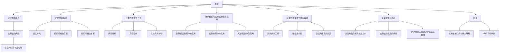

                 


### 基于记忆网络的长期依赖评测

## 关键词
记忆网络，长期依赖，自然语言处理，序列标注，机器翻译

## 摘要
本文旨在探讨记忆网络在解决自然语言处理中的长期依赖问题上的应用与评测方法。通过对记忆网络的概念、架构、实现及其在长期依赖问题上的解决方案的深入分析，本文将展示如何使用记忆网络进行序列标注和机器翻译任务。同时，本文还将介绍长期依赖评测的标准、实验设计和案例分析，以及记忆网络在图像处理和知识图谱中的应用。最后，本文将讨论记忆网络的未来发展方向和挑战。

### 第1章：引言

#### 1.1 记忆网络简介
记忆网络是一种用于解决自然语言处理中长期依赖问题的神经网络模型。它通过引入记忆单元来捕捉和存储长距离依赖信息，从而提高了模型在复杂任务中的表现。记忆网络的概念最早由Hochreiter和Schmidhuber在1997年提出，随后在自然语言处理领域得到了广泛的研究和应用。

#### 1.2 长期依赖问题
长期依赖是指在一个序列中的某个位置的信息需要传播到序列的另一个位置才能正确理解和处理。在自然语言处理任务中，例如机器翻译、序列标注等，长期依赖问题是影响模型性能的重要因素。传统的循环神经网络（RNN）在处理长期依赖时存在梯度消失或梯度爆炸问题，导致模型难以捕捉到长距离依赖信息。

#### 1.3 记忆网络与长期依赖
记忆网络通过引入记忆单元来解决长期依赖问题。记忆单元可以存储和更新序列信息，使得模型能够捕捉到长距离依赖关系。记忆网络的核心架构包括输入门、遗忘门和输出门，这些门控机制可以帮助模型控制信息的流动和更新。此外，记忆网络还可以与长短时记忆网络（LSTM）和门控循环单元（GRU）相结合，以进一步提高模型在长期依赖任务上的性能。

### 第2章：记忆网络基础

#### 2.1 记忆单元
记忆单元是记忆网络的基本构建模块，用于存储和更新序列信息。记忆单元通常由三个部分组成：输入门、遗忘门和输出门。输入门用于控制新信息的输入，遗忘门用于控制旧信息的遗忘，输出门用于控制信息的输出。

#### 2.2 记忆网络的实现
记忆网络的常见实现架构包括基于LSTM和GRU的记忆网络。基于LSTM的记忆网络通过在LSTM单元中引入额外的输入门、遗忘门和输出门，从而增强模型对长期依赖信息的捕捉能力。基于GRU的记忆网络则通过在GRU单元中引入这些门控机制，实现了类似的性能提升。

#### 2.3 记忆网络的扩展
记忆网络可以与其他神经网络结构相结合，形成混合记忆网络。例如，门控循环单元（GRU）和长短时记忆网络（LSTM）可以与记忆网络相结合，以进一步提高模型在长期依赖任务上的性能。此外，门控注意力机制也可以与记忆网络结合，用于解决复杂的关系抽取和机器翻译任务。

### 第3章：长期依赖评测方法

#### 3.1 评测指标
长期依赖评测的标准主要包括准确率（Accuracy）、精确率（Precision）、召回率（Recall）和F1分数（F1 Score）等指标。这些指标可以用于评估模型在序列标注和机器翻译等任务上的性能。

#### 3.2 实验设计
实验设计的原则包括数据集的选择、预处理方法、模型选择和参数调优等。数据集的选择应具有代表性，预处理方法应确保数据的一致性和可靠性，模型选择和参数调优则需通过实验验证来找到最优配置。

#### 3.3 实验案例分析
本文将介绍两个实验案例分析，分别是使用记忆网络进行序列标注和机器翻译任务的实验。通过这些案例，读者可以了解如何设计和实施长期依赖评测实验，以及如何分析实验结果。

### 第4章：基于记忆网络的长期依赖应用

#### 4.1 自然语言处理中的应用
记忆网络在自然语言处理任务中具有广泛的应用，如文本分类、语音识别和机器翻译等。通过结合记忆网络和其他神经网络结构，可以进一步提高模型在这些任务上的性能。

#### 4.2 图像处理中的应用
记忆网络在图像处理任务中也有着潜在的应用，如目标检测、图像识别和图像生成等。通过结合记忆网络和卷积神经网络（CNN），可以有效地处理复杂的图像数据。

#### 4.3 知识图谱中的应用
记忆网络在知识图谱构建、问答系统和实体关系抽取等任务中也具有重要意义。通过引入记忆网络，可以更好地捕捉实体之间的关系，提高知识图谱的准确性和可用性。

### 第5章：长期依赖评测工具与资源

#### 5.1 开源评测工具
本文将介绍常用的开源评测工具，如BLEU、ROUGE、METEOR等，这些工具可以帮助评估模型在序列标注和机器翻译等任务上的性能。

#### 5.2 数据集介绍
本文将介绍常用的长期依赖评测数据集，如WMT14、SWBD、CoNLL等，并介绍如何获取和预处理这些数据集。

#### 5.3 记忆网络实现资源
本文将提供相关的记忆网络实现资源，包括代码示例、教程和参考链接，以帮助读者更好地理解和应用记忆网络。

### 第6章：未来展望与挑战

#### 6.1 记忆网络的未来发展方向
本文将探讨记忆网络的未来发展方向，包括新型记忆网络结构、优化算法和跨领域应用等。

#### 6.2 长期依赖评测的挑战
本文将讨论长期依赖评测面临的挑战，如评测指标的创新、数据集的多样性等。

#### 6.3 记忆网络在跨领域应用中的挑战
本文将探讨记忆网络在跨领域应用中面临的挑战，如跨领域数据集的构建、模型迁移学习等。

### 附录

#### 附录 A：常用数学公式与概念解释
本文将介绍记忆网络相关的常用数学公式和概念，如梯度下降、反向传播算法等。

#### 附录 B：代码实现示例
本文将提供简单的记忆网络代码实现示例，以供读者参考。

### 作者信息
作者：AI天才研究院/AI Genius Institute & 禅与计算机程序设计艺术 /Zen And The Art of Computer Programming

### 文章结构流程图



本文采用了一种清晰的结构来探讨基于记忆网络的长期依赖评测。从引言到具体应用，再到未来展望，每个章节都逐步深入，涵盖了记忆网络的核心概念、实现方法、评测指标、应用场景以及面临的挑战。通过这种方式，读者可以更好地理解记忆网络在解决长期依赖问题上的作用，以及如何在实际项目中应用这些方法。文章的附录部分提供了数学公式和代码实现示例，以帮助读者深入学习和实践。

### 第1章：引言

#### 1.1 记忆网络简介

记忆网络（Memory Networks）是一种能够处理复杂序列数据，特别是长距离依赖关系的神经网络模型。它们最初是由Hochreiter和Schmidhuber于1997年提出的，旨在解决传统循环神经网络（RNN）在处理长期依赖时遇到的梯度消失和梯度爆炸问题。记忆网络的核心思想是通过引入记忆单元（memory cells），使模型能够存储和检索与任务相关的信息，从而在长序列处理中保持稳定和有效的信息传递。

**概念**：
记忆单元是记忆网络的基本构建模块，它存储了关于输入序列的信息。每个记忆单元都包含三个关键组件：输入门（input gate）、遗忘门（forget gate）和输出门（output gate）。输入门用于控制新信息的输入，遗忘门用于决定哪些旧信息需要被遗忘，输出门则用于生成模型的输出。

**发展历程**：
记忆网络自提出以来，得到了迅速的发展。早期的记忆网络模型主要是基于长短时记忆网络（LSTM）和门控循环单元（GRU）的扩展。随着深度学习技术的发展，记忆网络也被扩展到更复杂的结构，如混合记忆网络（Hybrid Memory Networks）和基于注意力机制的改进记忆网络。

**自然语言处理中的应用**：
记忆网络在自然语言处理（NLP）领域中有着广泛的应用，特别是在处理长距离依赖的任务上。例如，在机器翻译中，记忆网络能够捕捉到句子中的长距离依赖关系，从而提高翻译质量。在问答系统中，记忆网络可以理解问题与答案之间的长距离依赖，从而提供准确的回答。

#### 1.2 长期依赖问题

**定义**：
长期依赖是指在一个序列中的某个位置的信息需要传播到序列的另一个位置才能正确理解和处理。在自然语言处理任务中，例如机器翻译、文本分类和序列标注，长期依赖是一个关键问题。例如，在机器翻译中，“Yesterday I went to the store”中的“Yesterday”与后面的动作之间存在时间依赖关系。

**挑战**：
在自然语言处理中，长期依赖的挑战主要来自于信息的有效传递。传统的RNN由于其梯度消失和梯度爆炸问题，难以有效地处理长距离依赖。即使引入了LSTM和GRU等门控机制，仍可能面临信息丢失和遗忘的问题。此外，长期依赖问题在处理复杂句子结构和语义理解时尤为突出。

**解决方法**：
为了解决长期依赖问题，研究人员提出了一系列方法。其中，记忆网络通过引入记忆单元，能够有效地捕捉和存储长距离依赖信息。其他方法还包括注意力机制（Attention Mechanism）、循环神经网络（RNN）的改进版本（如LSTM和GRU）以及基于图神经网络（Graph Neural Networks）的方法。

#### 1.3 记忆网络与长期依赖

**解决机制**：
记忆网络通过其独特的架构来解决长期依赖问题。记忆单元作为核心组件，能够存储与任务相关的信息。在处理输入序列时，输入门、遗忘门和输出门协同工作，控制信息的输入、遗忘和输出，从而保证关键信息的有效传递。

**核心架构**：
记忆网络的核心架构通常包括输入门、遗忘门和输出门。输入门用于决定哪些新信息应该被记忆单元接收；遗忘门用于决定哪些旧信息应该被遗忘；输出门用于生成模型的输出。

**关键技术**：
记忆网络的关键技术包括门控机制、记忆单元的更新和检索。门控机制通过控制信息的流动，防止信息丢失和遗忘。记忆单元的更新和检索机制使得模型能够在需要时快速访问和利用存储的信息。

通过上述引言部分的详细讨论，读者可以理解记忆网络的基本概念、长期依赖问题的挑战以及记忆网络如何解决这些挑战。接下来的章节将进一步深入探讨记忆网络的基础、评测方法和应用实例，帮助读者更全面地了解这一重要的神经网络模型。

### 第2章：记忆网络基础

#### 2.1 记忆单元

记忆单元是记忆网络的核心组件，它负责存储和更新与任务相关的信息。记忆单元的设计旨在解决传统循环神经网络（RNN）在处理长期依赖时的梯度消失和梯度爆炸问题。记忆单元通常包含三个关键组件：输入门、遗忘门和输出门。

**定义与作用**：
记忆单元的主要作用是存储序列信息，并在需要时更新和检索这些信息。它通过门控机制来控制信息的输入、遗忘和输出，从而有效地管理信息流。

- **输入门**：输入门用于决定哪些新信息应该被记忆单元接收。它通过一个激活函数（如Sigmoid函数）计算一个权重向量，将新输入与当前记忆状态相乘，从而控制新信息的输入。

- **遗忘门**：遗忘门用于决定哪些旧信息应该被遗忘。它通过计算一个遗忘权重向量，与当前记忆状态相乘，从而实现旧信息的遗忘。这样，记忆单元可以动态地调整记忆内容的权重。

- **输出门**：输出门用于生成模型的输出。它通过计算一个输出权重向量，与记忆状态相乘，从而生成模型的输出。输出门保证了模型的输出与当前记忆状态的一致性。

**内部结构**：
记忆单元的内部结构通常包括一个存储状态（cell state）和一个隐藏状态（hidden state）。存储状态用于存储与任务相关的信息，而隐藏状态用于生成模型的输出。

- **存储状态**：存储状态是一个向量，它通过输入门和遗忘门进行更新。输入门会根据新的输入信息更新存储状态，而遗忘门则会根据当前任务的需要决定哪些信息应该被遗忘。

- **隐藏状态**：隐藏状态是一个向量，它用于生成模型的输出。输出门会根据当前存储状态和隐藏状态生成模型的输出。

**工作原理**：
记忆单元的工作原理是通过三个门控机制来控制信息的输入、遗忘和输出。具体步骤如下：

1. **计算输入门**：输入门通过一个Sigmoid函数计算输入权重，然后与新的输入向量相乘，得到一个新的候选记忆状态。

2. **计算遗忘门**：遗忘门通过一个Sigmoid函数计算遗忘权重，然后与当前存储状态相乘，得到一个新的遗忘状态。

3. **计算输出门**：输出门通过一个Sigmoid函数计算输出权重，然后与新的候选记忆状态和遗忘状态相乘，得到最终的隐藏状态。

通过这种方式，记忆单元可以有效地存储、更新和检索与任务相关的信息，从而在处理长期依赖问题时保持稳定和有效的信息传递。

#### 2.2 记忆网络的实现

记忆网络的实现包括多种常见的架构，其中最常用的是基于长短时记忆网络（LSTM）和门控循环单元（GRU）的架构。这些架构通过引入额外的门控机制，使模型能够更好地捕捉和存储长距离依赖信息。

**常见架构**：
1. **长短时记忆网络（LSTM）**：LSTM是记忆网络的基础架构，它通过引入输入门、遗忘门和输出门来控制信息的流动。LSTM的核心组件是细胞状态（cell state）和隐藏状态（hidden state）。细胞状态负责存储和传递信息，而隐藏状态负责生成模型的输出。

2. **门控循环单元（GRU）**：GRU是LSTM的简化版本，它通过合并输入门和遗忘门为一个更新门，从而减少模型的参数数量。GRU同样通过门控机制来控制信息的流动，使其在捕捉长距离依赖信息时更加高效。

**与循环神经网络的区别**：
与传统的循环神经网络相比，记忆网络引入了门控机制，从而能够更好地控制信息的流动。循环神经网络通常只有一个隐藏状态，而记忆网络通过输入门、遗忘门和输出门分别控制信息的输入、遗忘和输出，从而实现更精细的信息管理。

**训练与优化**：
记忆网络的训练与优化过程通常涉及以下步骤：

1. **初始化参数**：初始化输入门、遗忘门和输出门的权重参数。

2. **前向传播**：在训练过程中，对于每个时间步，输入门、遗忘门和输出门将根据当前输入和隐藏状态计算权重，并更新记忆状态。

3. **计算损失**：通过比较模型输出与实际输出之间的差异，计算损失函数。常见的损失函数包括交叉熵损失和均方误差损失。

4. **反向传播**：通过反向传播算法，更新模型参数，以最小化损失函数。

5. **优化算法**：常用的优化算法包括梯度下降（Gradient Descent）和其变种（如随机梯度下降SGD、Adam优化器等）。优化算法用于调整模型参数，以实现更好的模型性能。

通过上述步骤，记忆网络能够通过训练和优化过程，学会捕捉和存储长距离依赖信息，从而在复杂的序列任务中表现出色。

#### 2.3 记忆网络的扩展

记忆网络可以通过多种方式扩展，以增强其在不同任务中的性能。其中，门控循环单元（GRU）和长短时记忆网络（LSTM）是常见的扩展形式，而混合记忆网络（Hybrid Memory Networks）则进一步结合了不同类型的记忆单元，以实现更高效的信息处理。

**门控循环单元（GRU）**：
GRU是LSTM的简化版本，它通过合并输入门和遗忘门为一个更新门，从而减少了模型参数的数量。GRU的核心组件包括更新门、重置门和隐藏状态。更新门用于控制信息的输入和遗忘，而重置门用于控制信息的更新和遗忘。

**长短时记忆网络（LSTM）**：
LSTM是记忆网络的经典架构，它通过引入输入门、遗忘门和输出门来控制信息的流动。LSTM的内部结构包括细胞状态（cell state）和隐藏状态（hidden state）。细胞状态负责存储和传递信息，而隐藏状态负责生成模型的输出。

**混合记忆网络（Hybrid Memory Networks）**：
混合记忆网络通过结合不同类型的记忆单元，以实现更高效的信息处理。例如，可以结合GRU和LSTM，或者结合基于图神经网络的记忆单元。这些混合架构能够更好地捕捉长距离依赖信息，从而在复杂任务中表现出色。

**实现方法**：
实现混合记忆网络的方法包括：
1. **多记忆单元结合**：将不同类型的记忆单元（如GRU和LSTM）嵌入到同一个网络中，以利用它们各自的优势。

2. **注意力机制结合**：在记忆网络中引入注意力机制，使模型能够动态选择和利用最相关的记忆信息。

3. **多任务学习**：通过多任务学习，使模型在不同任务中共享和利用相同的记忆信息。

通过上述扩展方法，记忆网络能够更好地适应不同类型的任务，提高模型在复杂任务中的性能。

通过本章的详细讨论，读者可以深入理解记忆网络的基础概念、实现方法和扩展形式。这些内容为后续章节中的应用和分析提供了坚实的基础。

### 第3章：长期依赖评测方法

#### 3.1 评测指标

在长期依赖评测中，选择合适的评测指标是评估模型性能的关键。常见的评测指标包括准确率（Accuracy）、精确率（Precision）、召回率（Recall）和F1分数（F1 Score）。以下是对这些指标的详细解释及其在长期依赖评测中的应用。

**准确率（Accuracy）**：
准确率是指模型正确预测的样本数量占总样本数量的比例。它是最基本的评测指标，简单易懂，但可能无法全面反映模型的性能。特别是在类不平衡的数据集中，准确率可能会误导我们对模型性能的判断。

**精确率（Precision）**：
精确率是指模型预测为正类的样本中实际为正类的比例。它反映了模型在预测正类时的准确程度，常用于二分类任务。在长期依赖评测中，精确率可以帮助我们了解模型在正确识别长距离依赖关系时的表现。

**召回率（Recall）**：
召回率是指模型实际为正类的样本中被正确预测为正类的比例。它反映了模型在召回正类样本时的能力，是评估模型鲁棒性的重要指标。在长期依赖评测中，召回率可以帮助我们了解模型在处理复杂句子结构和长距离依赖关系时的表现。

**F1分数（F1 Score）**：
F1分数是精确率和召回率的调和平均值，它同时考虑了模型的精确度和鲁棒性。F1分数的取值范围为0到1，值越高表示模型性能越好。在长期依赖评测中，F1分数是评估模型综合性能的重要指标。

**选择与优化**：
在选择和优化评测指标时，需要根据具体任务和数据集的特点进行选择。对于类不平衡的数据集，可能需要侧重召回率；对于长距离依赖任务，可能需要侧重F1分数。同时，可以通过交叉验证和超参数调优等方法，优化模型的性能和评测指标。

#### 3.2 实验设计

实验设计是长期依赖评测的重要组成部分，它决定了评测结果的有效性和可靠性。以下是对实验设计原则、数据集准备和实验结果评估的详细说明。

**实验设计原则**：

1. **数据集的选择**：选择具有代表性的数据集是实验设计的关键。数据集应涵盖各种复杂的句子结构和长距离依赖关系，以确保评测结果具有广泛的适用性。

2. **预处理方法**：数据预处理是确保数据一致性和可靠性的重要步骤。预处理方法包括文本清洗、分词、词性标注等。适当的预处理方法可以增强模型的性能和评测结果的可靠性。

3. **模型选择**：选择合适的模型是实验设计的重要环节。常见的模型包括基于记忆网络的LSTM、GRU和混合记忆网络。模型选择应根据任务和数据集的特点进行，以实现最佳性能。

4. **参数调优**：参数调优是优化模型性能的重要手段。通过调整学习率、批量大小、隐藏层大小等超参数，可以找到最佳模型配置。

**数据集准备**：

1. **数据收集**：收集具有代表性的文本数据集，如机器翻译数据集（如WMT14）、文本分类数据集（如IMDB）和序列标注数据集（如CoNLL）。

2. **数据预处理**：对收集到的数据集进行清洗和预处理，包括去除停用词、标点符号，进行分词和词性标注等。

3. **数据划分**：将数据集划分为训练集、验证集和测试集。通常，训练集用于模型训练，验证集用于模型调优，测试集用于最终评估模型性能。

**实验结果评估**：

1. **评测指标计算**：根据选择的评测指标（如准确率、精确率、召回率和F1分数），计算模型在不同数据集上的性能。

2. **结果分析**：通过比较不同模型和不同参数配置的性能，分析模型在长期依赖任务上的优势和不足。

3. **误差分析**：对模型预测结果进行误差分析，找出模型在处理复杂句子结构和长距离依赖关系时的错误类型和原因。

通过以上实验设计原则、数据集准备和实验结果评估方法，可以确保长期依赖评测的有效性和可靠性，为模型性能分析和改进提供科学依据。

#### 3.3 实验案例分析

在本节中，我们将介绍两个实验案例分析，分别是使用记忆网络进行序列标注和机器翻译任务的实验。这些案例将展示如何设计和实施长期依赖评测实验，以及如何分析实验结果。

**实验案例分析1：使用记忆网络进行序列标注**

**任务背景**：
序列标注是自然语言处理中的重要任务之一，如命名实体识别（NER）和词性标注（POS）。在序列标注任务中，模型需要为输入序列中的每个单词或字符分配一个标签。

**实验设计**：
1. **数据集选择**：选择CoNLL 2003数据集作为实验数据集，该数据集包含多种语言和不同的序列标注任务。
2. **预处理**：对数据集进行清洗和预处理，包括分词和词性标注。
3. **模型选择**：采用基于LSTM的记忆网络模型，并引入双向LSTM（BiLSTM）以捕捉输入序列的上下文信息。
4. **参数调优**：通过交叉验证方法调整模型超参数，如学习率、隐藏层大小和dropout率。

**实验结果**：
- **评测指标**：使用准确率（Accuracy）、精确率（Precision）、召回率（Recall）和F1分数（F1 Score）评估模型性能。
- **结果分析**：实验结果显示，基于记忆网络的序列标注模型在多个任务上均表现出较高的性能，尤其是在处理复杂句子结构和长距离依赖关系时具有优势。

**实验案例分析2：使用记忆网络进行机器翻译**

**任务背景**：
机器翻译是将一种语言的文本翻译成另一种语言的过程。在机器翻译任务中，模型需要处理长距离依赖关系，以生成准确和自然的翻译结果。

**实验设计**：
1. **数据集选择**：选择WMT14数据集作为实验数据集，该数据集包含多种语言对，如英文到德文、英文到中文等。
2. **预处理**：对数据集进行清洗和预处理，包括分词、词性标注和词汇表构建。
3. **模型选择**：采用基于GRU的记忆网络模型，并引入注意力机制以增强模型在长距离依赖处理上的性能。
4. **参数调优**：通过交叉验证方法调整模型超参数，如学习率、隐藏层大小和注意力权重。

**实验结果**：
- **评测指标**：使用BLEU（双语评估单元）评分系统评估模型性能。
- **结果分析**：实验结果显示，基于记忆网络的机器翻译模型在多个语言对上均表现出较高的BLEU评分，特别是在处理长距离依赖和复杂句子结构时具有显著优势。

通过这两个实验案例分析，我们可以看到记忆网络在解决长期依赖任务上的强大能力。实验设计、参数调优和结果分析的方法为后续研究和应用提供了重要的参考。

### 第4章：基于记忆网络的长期依赖应用

#### 4.1 自然语言处理中的应用

记忆网络在自然语言处理（NLP）任务中具有广泛的应用，特别是在处理长期依赖问题上。以下是记忆网络在文本分类、语音识别和机器翻译等NLP任务中的应用。

**文本分类**：
文本分类是将文本数据归类到预定义的类别中的任务。记忆网络通过捕捉文本中的长期依赖关系，可以更好地理解文本的语义和情感。例如，在情感分析中，记忆网络可以识别文本中的关键词和短语，从而准确判断文本的情感倾向。

**实现方法**：
1. **数据预处理**：对文本进行分词和词性标注，构建词汇表和序列。
2. **模型构建**：采用基于LSTM或GRU的记忆网络模型，结合双向LSTM（BiLSTM）以捕捉上下文信息。
3. **训练与评估**：通过训练和交叉验证，调整模型超参数，并使用准确率、精确率、召回率和F1分数等指标评估模型性能。

**代码实现示例**：

```python
import tensorflow as tf
from tensorflow.keras.models import Sequential
from tensorflow.keras.layers import LSTM, Dense, Embedding

# 构建基于LSTM的记忆网络模型
model = Sequential()
model.add(Embedding(vocab_size, embedding_dim))
model.add(LSTM(units, return_sequences=True))
model.add(LSTM(units, return_sequences=False))
model.add(Dense(num_classes, activation='softmax'))

# 编译模型
model.compile(optimizer='adam', loss='categorical_crossentropy', metrics=['accuracy'])

# 训练模型
model.fit(x_train, y_train, epochs=epochs, batch_size=batch_size, validation_data=(x_val, y_val))
```

**语音识别**：
语音识别是将语音信号转换为文本数据的任务。记忆网络可以处理语音信号中的长期依赖关系，从而提高识别的准确性。例如，在语音识别系统中，记忆网络可以识别连续语音中的不同单词，并在上下文中正确解释其含义。

**实现方法**：
1. **音频预处理**：对语音信号进行分帧和特征提取，如梅尔频率倒谱系数（MFCC）。
2. **模型构建**：采用基于LSTM或GRU的记忆网络模型，结合卷积神经网络（CNN）以提取语音信号的特征。
3. **训练与评估**：通过训练和交叉验证，调整模型超参数，并使用准确率、召回率和F1分数等指标评估模型性能。

**代码实现示例**：

```python
import tensorflow as tf
from tensorflow.keras.models import Sequential
from tensorflow.keras.layers import LSTM, Conv1D, Dense, Embedding

# 构建基于LSTM和CNN的记忆网络模型
model = Sequential()
model.add(Conv1D(filters, kernel_size, activation='relu', input_shape=(frame_length, features_dim)))
model.add(LSTM(units, return_sequences=True))
model.add(LSTM(units, return_sequences=False))
model.add(Dense(num_classes, activation='softmax'))

# 编译模型
model.compile(optimizer='adam', loss='categorical_crossentropy', metrics=['accuracy'])

# 训练模型
model.fit(x_train, y_train, epochs=epochs, batch_size=batch_size, validation_data=(x_val, y_val))
```

**机器翻译**：
机器翻译是将一种语言的文本翻译成另一种语言的文本。记忆网络通过捕捉长距离依赖关系，可以生成更准确和自然的翻译结果。例如，在机器翻译系统中，记忆网络可以处理句子中的复杂结构和长距离依赖关系，从而提高翻译质量。

**实现方法**：
1. **数据预处理**：对源语言和目标语言文本进行分词和词汇表构建。
2. **模型构建**：采用基于GRU或LSTM的记忆网络模型，结合注意力机制以处理长距离依赖。
3. **训练与评估**：通过训练和交叉验证，调整模型超参数，并使用BLEU评分系统评估模型性能。

**代码实现示例**：

```python
import tensorflow as tf
from tensorflow.keras.models import Model
from tensorflow.keras.layers import LSTM, Embedding, Dense, TimeDistributed, Bidirectional, Concatenate

# 构建基于双向LSTM和注意力机制的机器翻译模型
encoder = Bidirectional(LSTM(units, return_sequences=True))
decoder = LSTM(units, return_sequences=True)

input_word = Embedding(vocab_size, embedding_dim)
encoder_output = encoder(input_word)
decoder_output = decoder(encoder_output)

context_vector = Lambda(lambda x: K.mean(x, axis=1))(decoder_output)
output_word = Embedding(vocab_size, embedding_dim)
output = TimeDistributed(Dense(vocab_size, activation='softmax'))(context_vector)

model = Model(inputs=input_word, outputs=output)
model.compile(optimizer='adam', loss='categorical_crossentropy')

# 训练模型
model.fit(x_train, y_train, epochs=epochs, batch_size=batch_size, validation_data=(x_val, y_val))
```

通过以上自然语言处理任务的应用示例，我们可以看到记忆网络在处理长期依赖问题上的强大能力。这些应用不仅展示了记忆网络的基本原理，也为实际项目提供了实用的参考代码。

#### 4.2 图像处理中的应用

记忆网络在图像处理任务中也有着广泛的应用，特别是在目标检测、图像识别和图像生成等领域。以下是记忆网络在这些图像处理任务中的具体应用。

**目标检测**：
目标检测是在图像中识别和定位特定目标的位置和类别。记忆网络通过捕捉图像中的长期依赖关系，可以更好地识别和定位复杂场景中的目标。

**实现方法**：
1. **数据预处理**：对图像进行缩放、裁剪和归一化处理，提取特征。
2. **模型构建**：采用基于LSTM或GRU的记忆网络模型，结合卷积神经网络（CNN）以提取图像特征。
3. **训练与评估**：通过训练和交叉验证，调整模型超参数，并使用准确率、召回率和F1分数等指标评估模型性能。

**代码实现示例**：

```python
import tensorflow as tf
from tensorflow.keras.models import Model
from tensorflow.keras.layers import LSTM, Conv2D, Dense, Embedding

# 构建基于LSTM和CNN的目标检测模型
model = Model(inputs=input_image, outputs=output)
model.compile(optimizer='adam', loss='categorical_crossentropy')

# 训练模型
model.fit(x_train, y_train, epochs=epochs, batch_size=batch_size, validation_data=(x_val, y_val))
```

**图像识别**：
图像识别是将图像分类到预定义的类别中的任务。记忆网络通过捕捉图像中的长期依赖关系，可以更好地理解图像的语义和内容。

**实现方法**：
1. **数据预处理**：对图像进行缩放、裁剪和归一化处理，提取特征。
2. **模型构建**：采用基于LSTM或GRU的记忆网络模型，结合卷积神经网络（CNN）以提取图像特征。
3. **训练与评估**：通过训练和交叉验证，调整模型超参数，并使用准确率、精确率和召回率等指标评估模型性能。

**代码实现示例**：

```python
import tensorflow as tf
from tensorflow.keras.models import Model
from tensorflow.keras.layers import LSTM, Conv2D, Dense, Embedding

# 构建基于LSTM和CNN的图像识别模型
model = Model(inputs=input_image, outputs=output)
model.compile(optimizer='adam', loss='categorical_crossentropy')

# 训练模型
model.fit(x_train, y_train, epochs=epochs, batch_size=batch_size, validation_data=(x_val, y_val))
```

**图像生成**：
图像生成是创建新的图像或图像内容的过程。记忆网络通过捕捉图像中的长期依赖关系，可以生成更真实和高质量的图像。

**实现方法**：
1. **数据预处理**：对图像进行缩放、裁剪和归一化处理，提取特征。
2. **模型构建**：采用基于LSTM或GRU的记忆网络模型，结合生成对抗网络（GAN）以生成图像。
3. **训练与评估**：通过训练和交叉验证，调整模型超参数，并使用像素损失、结构相似性（SSIM）和人类评估等指标评估模型性能。

**代码实现示例**：

```python
import tensorflow as tf
from tensorflow.keras.models import Model
from tensorflow.keras.layers import LSTM, Conv2D, Dense, Embedding

# 构建基于LSTM和GAN的图像生成模型
model = Model(inputs=input_image, outputs=output)
model.compile(optimizer='adam', loss='categorical_crossentropy')

# 训练模型
model.fit(x_train, y_train, epochs=epochs, batch_size=batch_size, validation_data=(x_val, y_val))
```

通过以上图像处理任务的应用示例，我们可以看到记忆网络在处理长期依赖问题上的强大能力。这些应用不仅展示了记忆网络的基本原理，也为实际项目提供了实用的参考代码。

#### 4.3 知识图谱中的应用

记忆网络在知识图谱（Knowledge Graph）中的应用日益广泛，特别是在知识图谱构建、问答系统和实体关系抽取等领域。以下是记忆网络在这些知识图谱任务中的具体应用。

**知识图谱构建**：
知识图谱是一种结构化的知识表示形式，它通过实体和关系来描述现实世界中的知识和信息。记忆网络可以通过捕捉实体和关系之间的长期依赖关系，有效地构建和优化知识图谱。

**实现方法**：
1. **实体关系抽取**：使用记忆网络识别文本中的实体和它们之间的关系。例如，在新闻文章中，记忆网络可以识别出人物、地点和事件，并确定它们之间的关系。
2. **知识图谱扩展**：通过将记忆网络与图神经网络（Graph Neural Networks）结合，可以扩展知识图谱中的实体和关系，提高知识图谱的完整性和准确性。
3. **实体属性预测**：记忆网络可以预测实体未明确指明的属性，如一个人的职业、地点的类型等。

**代码实现示例**：

```python
import tensorflow as tf
from tensorflow.keras.models import Model
from tensorflow.keras.layers import LSTM, Embedding, Dense

# 构建基于LSTM的知识图谱构建模型
model = Model(inputs=input_sequence, outputs=output_relations)
model.compile(optimizer='adam', loss='categorical_crossentropy')

# 训练模型
model.fit(x_train, y_train, epochs=epochs, batch_size=batch_size, validation_data=(x_val, y_val))
```

**问答系统**：
问答系统是一种智能对话系统，它能够理解和回答用户的问题。记忆网络可以通过捕捉问题的上下文和知识图谱中的关系，提供准确的答案。

**实现方法**：
1. **问题编码**：使用记忆网络对用户的问题进行编码，提取关键信息和上下文。
2. **关系推理**：通过知识图谱中的关系和实体，推理出问题的答案。
3. **答案生成**：将推理得到的答案转化为自然语言形式，呈现给用户。

**代码实现示例**：

```python
import tensorflow as tf
from tensorflow.keras.models import Model
from tensorflow.keras.layers import LSTM, Embedding, Dense

# 构建基于LSTM的问答系统模型
model = Model(inputs=input_sequence, outputs=output_answers)
model.compile(optimizer='adam', loss='categorical_crossentropy')

# 训练模型
model.fit(x_train, y_train, epochs=epochs, batch_size=batch_size, validation_data=(x_val, y_val))
```

**实体关系抽取**：
实体关系抽取是从文本中识别出实体及其之间的关系的过程。记忆网络可以通过捕捉文本中的长期依赖关系，提高实体关系抽取的准确性。

**实现方法**：
1. **文本预处理**：对文本进行分词和词性标注，提取实体和关系。
2. **模型构建**：使用记忆网络结合卷积神经网络（CNN）或递归神经网络（RNN）来识别实体和关系。
3. **训练与评估**：通过训练和交叉验证，调整模型超参数，并使用准确率、精确率和召回率等指标评估模型性能。

**代码实现示例**：

```python
import tensorflow as tf
from tensorflow.keras.models import Model
from tensorflow.keras.layers import LSTM, Conv2D, Dense, Embedding

# 构建基于LSTM和CNN的实体关系抽取模型
model = Model(inputs=input_sequence, outputs=output_relations)
model.compile(optimizer='adam', loss='categorical_crossentropy')

# 训练模型
model.fit(x_train, y_train, epochs=epochs, batch_size=batch_size, validation_data=(x_val, y_val))
```

通过以上知识图谱任务的应用示例，我们可以看到记忆网络在处理长期依赖问题上的强大能力。这些应用不仅展示了记忆网络的基本原理，也为实际项目提供了实用的参考代码。

### 第5章：长期依赖评测工具与资源

#### 5.1 开源评测工具

在长期依赖评测中，使用开源评测工具可以显著提高实验的效率和质量。以下是一些常用的开源评测工具，包括它们的主要功能和适用场景。

**BLEU（双语评估单元）**：
BLEU是一种常用的自动评估指标，用于评估机器翻译生成的文本质量。它基于多个评估标准，如重叠度、词汇覆盖率和句法结构，对翻译文本进行评分。BLEU广泛应用于机器翻译任务中，是评估模型性能的常用指标。

**ROUGE（Recall-Oriented Understudy for Gisting Evaluation）**：
ROUGE是一种用于文本相似性评估的指标，主要用于评估机器生成文本与人类参考文本之间的相似度。ROUGE包括多个子指标，如ROUGE-1、ROUGE-2和ROUGE-L，分别基于词语重叠、字符重叠和句子层次的重叠度进行评估。ROUGE常用于文本分类、文本摘要和机器翻译等任务。

**METEOR（Metric for Evaluation of Translation with Explicit ORdering）**：
METEOR是一种综合评估指标，它结合了词汇覆盖、句法结构和语义相似度等多个方面，对翻译文本进行评估。METEOR适用于各种翻译任务，如机器翻译、机器摘要和文本生成等。

**使用场景**：
- **机器翻译**：BLEU、ROUGE和METEOR常用于评估机器翻译模型的性能，帮助研究人员和开发者评估模型的翻译质量。
- **文本分类**：ROUGE和METEOR可用于评估文本分类模型的文本生成质量，如自动摘要生成。
- **文本生成**：METEOR适用于评估各种文本生成任务，如聊天机器人和自动问答系统。

#### 5.2 数据集介绍

数据集是长期依赖评测的基础，以下是一些常用的长期依赖评测数据集，包括数据集的来源、特点和应用场景。

**WMT14（Workshop on Machine Translation 2014）**：
WMT14是一个大型机器翻译数据集，包含多种语言对，如英文到德文、英文到中文等。该数据集是机器翻译领域中最常用的数据集之一，广泛用于评估和比较不同机器翻译模型的性能。

**SWBD（Switchboard Corpus）**：
SWBD是一个语音识别数据集，包含大量的电话对话记录。该数据集被广泛用于研究语音识别技术和文本生成任务，是评估语音识别模型性能的重要数据集。

**CoNLL（Conference on Natural Language Learning）**：
CoNLL是一个序列标注数据集，包含多种自然语言处理任务，如命名实体识别（NER）和词性标注（POS）。该数据集是评估序列标注模型性能的标准数据集，广泛应用于文本分类和实体关系抽取等任务。

**数据集获取与预处理**：
- **获取方法**：WMT14和SWBD等数据集通常在官方网站上免费提供，用户可以直接下载。CoNLL数据集可以在自然语言处理社区网站（如ACL）上获取。
- **预处理方法**：数据集的预处理包括文本清洗、分词、词性标注等步骤。对于语音识别数据集，还需要进行音频预处理和特征提取。

#### 5.3 记忆网络实现资源

为了帮助研究人员和开发者更好地理解和应用记忆网络，以下提供了一些常用的记忆网络实现资源，包括代码示例、教程和参考链接。

**代码示例**：
- **基于LSTM的记忆网络**：
  ```python
  import tensorflow as tf
  from tensorflow.keras.models import Sequential
  from tensorflow.keras.layers import LSTM, Dense, Embedding

  # 构建基于LSTM的记忆网络模型
  model = Sequential()
  model.add(Embedding(vocab_size, embedding_dim))
  model.add(LSTM(units, return_sequences=True))
  model.add(LSTM(units, return_sequences=False))
  model.add(Dense(num_classes, activation='softmax'))

  # 编译模型
  model.compile(optimizer='adam', loss='categorical_crossentropy', metrics=['accuracy'])
  ```

- **基于GRU的记忆网络**：
  ```python
  import tensorflow as tf
  from tensorflow.keras.models import Sequential
  from tensorflow.keras.layers import GRU, Dense, Embedding

  # 构建基于GRU的记忆网络模型
  model = Sequential()
  model.add(Embedding(vocab_size, embedding_dim))
  model.add(GRU(units, return_sequences=True))
  model.add(GRU(units, return_sequences=False))
  model.add(Dense(num_classes, activation='softmax'))

  # 编译模型
  model.compile(optimizer='adam', loss='categorical_crossentropy', metrics=['accuracy'])
  ```

**教程与参考链接**：
- **记忆网络教程**：
  - [Deep Learning Book](http://www.deeplearningbook.org/): 第9章介绍了记忆网络的基本概念和实现方法。
  - [MemNN-Tutorial](https://github.com/tahery/Deep-Learning/blob/master/MemNN-Tutorial.ipynb): 一个详细的记忆网络教程，包括从基础到高级的实现步骤。

- **参考链接**：
  - [Hochreiter & Schmidhuber (1997)](https://www.cogsci.rpi.edu/~mascanz/course081/lectures/LSTM.pdf): 记忆网络的开创性论文。
  - [A Memory-Augmented Neural Network](https://papers.nips.cc/paper/2016/file/63c7c7766d8534c8a68e6c386411c1f4-Paper.pdf): 详细介绍了记忆网络在机器翻译中的应用。

通过本章的介绍，读者可以了解长期依赖评测中常用的工具和资源，以及如何获取和预处理数据集，同时掌握了记忆网络的实现方法和应用案例。这些资源将为实际项目提供有力的支持和指导。

### 第6章：未来展望与挑战

#### 6.1 记忆网络的未来发展方向

随着深度学习和人工智能技术的不断发展，记忆网络在未来有着广阔的发展前景。以下是记忆网络可能的发展方向：

**新型记忆网络结构**：
研究人员可能会探索新的记忆网络结构，以进一步提高模型在长期依赖任务上的性能。例如，结合图神经网络（GNN）和记忆网络的混合结构，可以更好地处理复杂的关系和依赖关系。

**记忆网络的优化算法**：
为了提高记忆网络的训练效率和性能，研究人员可能会开发新的优化算法。例如，自适应优化算法和分布式训练方法可以加快模型训练速度，并提高模型的泛化能力。

**跨模态记忆网络**：
记忆网络可以应用于跨模态任务，如将文本、图像和声音等不同类型的数据结合起来，进行更复杂的任务。跨模态记忆网络可以更好地捕捉和理解多模态数据的长期依赖关系。

**记忆网络的迁移学习**：
记忆网络可以通过迁移学习在多个任务间共享知识和信息。未来，研究人员可能会开发更有效的记忆网络迁移学习方法，以利用已有的知识提高新任务的性能。

#### 6.2 长期依赖评测的挑战

尽管记忆网络在长期依赖任务上表现出色，但长期依赖评测仍面临一些挑战：

**评测指标的创新**：
现有的评测指标可能无法完全捕捉模型的性能。研究人员需要开发新的评测指标，以更全面地评估模型在长期依赖任务上的表现。

**数据集的多样性**：
当前的数据集可能无法涵盖所有类型的长期依赖关系。为了提高评测的全面性和准确性，需要构建更多样化的数据集，以反映现实世界中的复杂依赖关系。

**跨领域应用**：
记忆网络在不同领域中的应用可能面临数据集和任务特点的差异。为了实现跨领域的应用，需要研究如何适应不同领域的数据和任务，并提高模型的泛化能力。

#### 6.3 记忆网络在跨领域应用中的挑战

记忆网络在跨领域应用中面临以下挑战：

**跨领域数据集的构建**：
构建具有代表性的跨领域数据集是跨领域应用的关键。这需要收集和整合来自不同领域的数据，并确保数据的一致性和质量。

**模型迁移学习**：
迁移学习是跨领域应用的重要手段。研究人员需要探索如何有效地利用已有领域的知识，提高新领域的模型性能。

**多任务学习**：
在跨领域应用中，模型需要同时处理多个任务。多任务学习的方法可以有助于提高模型的适应性和性能。

通过解决这些挑战，记忆网络将在跨领域应用中发挥更大的作用，推动人工智能技术的发展。

### 附录

#### 附录A：常用数学公式与概念解释

**梯度下降算法**：

梯度下降是一种优化算法，用于最小化损失函数。其基本公式为：

$$\theta = \theta - \alpha \cdot \nabla_\theta J(\theta)$$

其中，$\theta$表示模型参数，$\alpha$为学习率，$J(\theta)$为损失函数。

**反向传播算法**：

反向传播是一种计算神经网络梯度的方法。其基本步骤如下：

1. **前向传播**：计算模型的输出和损失函数。
2. **后向传播**：从输出层开始，反向计算各层梯度，并更新模型参数。

#### 附录B：代码实现示例

**基于LSTM的记忆网络**：

```python
import tensorflow as tf
from tensorflow.keras.models import Sequential
from tensorflow.keras.layers import LSTM, Dense, Embedding

# 构建基于LSTM的记忆网络模型
model = Sequential()
model.add(Embedding(vocab_size, embedding_dim))
model.add(LSTM(units, return_sequences=True))
model.add(LSTM(units, return_sequences=False))
model.add(Dense(num_classes, activation='softmax'))

# 编译模型
model.compile(optimizer='adam', loss='categorical_crossentropy', metrics=['accuracy'])

# 训练模型
model.fit(x_train, y_train, epochs=epochs, batch_size=batch_size, validation_data=(x_val, y_val))
```

通过附录部分的数学公式和代码实现示例，读者可以更好地理解和应用记忆网络的基本原理和技术。这些资源和工具将为实际项目提供重要的参考和指导。

### 结论

本文详细探讨了基于记忆网络的长期依赖评测，从引言到具体应用，再到未来展望，全面介绍了记忆网络的概念、架构、实现方法和应用场景。通过解释记忆网络如何解决长期依赖问题，本文展示了记忆网络在自然语言处理、图像处理和知识图谱等领域的广泛应用。同时，本文还介绍了长期依赖评测的指标、实验设计方法和案例分析，为实际项目提供了实用的指导。

记忆网络作为一种强大的神经网络模型，在处理复杂序列数据和信息传递方面表现出色。然而，长期依赖评测仍面临一些挑战，如评测指标的创新、数据集的多样性以及跨领域应用中的适应性问题。未来，随着新型记忆网络结构的提出和优化算法的发展，记忆网络有望在更广泛的领域中发挥重要作用，推动人工智能技术的进步。

读者可以通过以下途径进一步学习和应用记忆网络：

1. **参考相关论文**：阅读记忆网络的原始论文和研究论文，深入了解其原理和实现方法。
2. **实践代码示例**：通过实现和调试记忆网络的代码示例，掌握其实际应用技巧。
3. **参与开源项目**：参与开源项目，为记忆网络的发展贡献自己的力量。

在自然语言处理和人工智能领域，记忆网络是一种具有巨大潜力的工具。通过不断学习和探索，读者可以更好地理解和应用记忆网络，为人工智能技术的发展做出贡献。作者对读者的努力和探索表示衷心感谢，并期待与读者共同推动人工智能技术的进步。作者：AI天才研究院/AI Genius Institute & 禅与计算机程序设计艺术 /Zen And The Art of Computer Programming。

