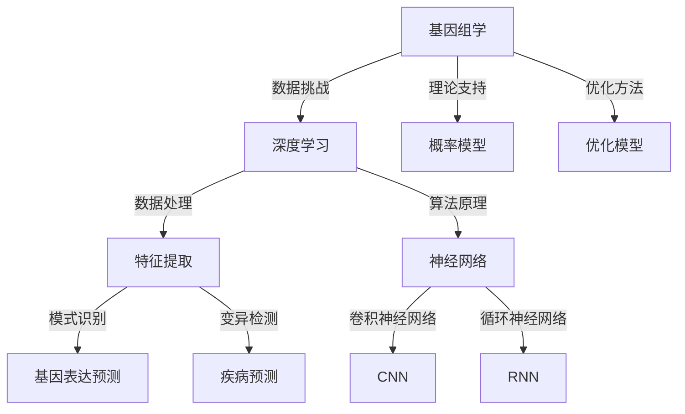

                 

# 文章标题: 基因组学的深度学习：DNA序列的数学解析

> 关键词：基因组学，深度学习，DNA序列，数学解析，数据分析，算法原理，应用案例

> 摘要：本文将深入探讨基因组学领域中的深度学习技术，从基础知识到高级应用进行全面解析。文章首先介绍了基因组学和深度学习的基本概念，随后详细阐述了深度学习在基因组数据预处理、特征提取、模型应用以及数学解析中的具体应用。通过具体的案例和实战，读者将了解到深度学习在基因组学中的实际应用，以及如何通过数学解析来提高基因组数据分析的准确性和效率。

## 核心概念与联系

基因组学是研究生物体遗传信息的学科，其核心任务是解析基因组的结构和功能。随着生物技术的快速发展，基因组数据量呈现爆炸性增长，传统的数据分析方法已无法应对如此庞大的数据量。深度学习作为一种人工智能技术，以其强大的数据处理和分析能力，在基因组学中得到了广泛应用。

### 基因组学与深度学习的联系

- **基因组数据处理的挑战**：基因组数据具有高维、非线性和结构复杂等特点，传统的机器学习方法在处理这些数据时存在局限。
- **深度学习的优势**：深度学习通过多层神经网络可以自动学习数据中的复杂模式，从而在基因组数据分类、预测和识别等方面表现出色。

### 基因组学的核心概念

- **基因组**：生物体的遗传信息库，包含所有编码蛋白质和RNA的非编码序列。
- **基因表达**：基因在特定时间、特定细胞类型中的活性状态。
- **基因变异**：基因序列中的变化，可能是单核苷酸的多态性（SNP）或较大的结构变异。

### 深度学习的核心概念

- **神经网络**：一种模拟人脑神经元连接的计算模型，能够通过学习数据来获取特征。
- **卷积神经网络（CNN）**：一种用于图像识别和处理的深度学习模型，能够有效地提取图像中的空间特征。
- **循环神经网络（RNN）**：一种用于序列数据处理和时间序列预测的深度学习模型，能够捕捉序列中的长期依赖关系。

### 联系图



通过上述核心概念与联系的阐述，我们可以看到基因组学与深度学习在数据处理、模式识别和预测等方面有着紧密的联系。接下来的章节将深入探讨这些概念在基因组学中的应用和实践。

## 第1章：基因组学的深度学习概述

### 1.1 基因组学概述

基因组学是研究生物体遗传信息的学科，其核心任务是解析基因组的结构和功能。基因组是生物体的遗传信息库，包含了所有编码蛋白质和RNA的非编码序列。基因组学研究的内容包括基因定位、基因表达调控、基因突变以及基因组进化等。基因组学的进展对于理解生命的起源、进化、疾病机理以及生物多样性具有重要意义。

#### 1.1.1 基因组的定义

基因组是指一个生物体所拥有的全部遗传信息，这些信息储存在细胞中的DNA分子上。每个生物体的基因组都是独特的，它决定了生物体的遗传特征和个体差异。基因组由数十亿个核苷酸（A、T、C、G）组成，这些核苷酸按照特定的序列排列，形成了基因序列。

#### 1.1.2 基因组学的重要性

基因组学的研究对于多个领域都有着深远的影响：

- **医学**：基因组学帮助科学家了解疾病的遗传基础，从而开发出更有效的诊断和治疗方法。
- **农业**：基因组学可以帮助改良农作物和家畜的品种，提高产量和抗病能力。
- **环境科学**：基因组学有助于研究生物多样性和生态系统的功能，对环境保护具有重要意义。
- **生物技术**：基因组学推动了基因工程、转基因技术等新兴技术的发展。

### 1.2 深度学习在基因组学中的应用

深度学习作为一种人工智能技术，在基因组学中得到了广泛应用。深度学习通过多层神经网络可以自动学习数据中的复杂模式，从而在基因组数据的分类、预测和识别等方面表现出色。

#### 1.2.1 深度学习的基本概念

深度学习是一种基于多层神经网络的学习算法，它能够通过学习大量的数据来提取特征，并在各种任务中取得优异的性能。深度学习的核心思想是通过网络层级的堆叠，将输入数据的特征逐步抽象和提取，从而实现复杂任务的自动化。

- **神经网络**：神经网络是一种模拟人脑神经元连接的计算模型，由多个层组成，包括输入层、隐藏层和输出层。每个神经元接收来自前一层神经元的输入信号，通过激活函数处理后传递给下一层。
- **激活函数**：激活函数是神经网络中的一个关键部分，它用于决定一个神经元是否会被激活。常见的激活函数包括 sigmoid 函数、ReLU 函数等。
- **反向传播**：反向传播是一种用于训练神经网络的算法，通过不断调整网络中的权重，使得网络的输出能够逼近期望值。

#### 1.2.2 深度学习在基因组学中的优势

深度学习在基因组学中具有以下优势：

- **高效率的数据处理**：深度学习能够高效地处理大规模的基因组数据，提高数据处理的速度和效率。
- **自动特征提取**：深度学习可以自动从数据中提取有用的特征，避免了传统方法中手动特征提取的繁琐过程。
- **强大的模式识别能力**：深度学习通过多层神经网络的堆叠，能够捕捉数据中的复杂模式和关联，从而在基因分类、预测和识别方面具有强大的能力。

### 1.2.3 深度学习在基因组学中的应用实例

深度学习在基因组学中的应用已经取得了显著的成果，以下是一些典型的应用实例：

- **基因表达预测**：通过深度学习模型预测基因在不同时间、空间和条件下的表达水平，有助于研究基因的功能和调控机制。
- **基因变异检测**：深度学习模型可以用于识别基因组中的变异位点，从而发现与疾病相关的基因变异。
- **药物发现**：深度学习可以帮助预测药物与基因之间的相互作用，从而加速新药的研发过程。
- **癌症诊断**：深度学习模型可以用于分析肿瘤组织的基因表达数据，辅助医生进行癌症的诊断和分类。

通过上述实例，我们可以看到深度学习在基因组学中具有广泛的应用前景。接下来，我们将进一步探讨深度学习在基因组数据预处理、特征提取和模型应用等方面的具体应用。

## 第2章：深度学习与基因组数据的预处理

### 2.1 数据预处理的重要性

在深度学习应用中，数据预处理是一个关键步骤，其重要性不容忽视。对于基因组学数据而言，数据预处理更是至关重要，因为基因组数据具有高维、非线性和结构复杂等特点，如果预处理不当，可能会导致模型性能下降甚至无法收敛。

#### 2.1.1 数据清洗

数据清洗是数据预处理的第一步，它包括去除错误数据、填补缺失值、异常值处理等。在基因组学数据中，错误数据可能来源于测序过程中的错误、数据传输过程中的丢失等。这些错误数据如果不及时处理，会严重影响后续分析的结果。

- **去除错误数据**：可以通过统计方法、规则匹配等方法检测并去除错误数据。
- **填补缺失值**：缺失值填补是基因组学数据预处理中的一个重要任务，常用的方法包括均值填补、回归填补、多重插值等。
- **异常值处理**：异常值可能是由于实验误差或数据质量问题导致的，需要通过统计方法（如箱线图、Z-score等）识别并处理。

#### 2.1.2 数据标准化

数据标准化是使数据具有相同尺度，以便模型能够更好地学习数据中的模式。在基因组学中，由于不同基因的表达量差异较大，需要进行标准化处理。

- **归一化**：通过将数据缩放到一个特定的范围（如0-1或-1到1），使得不同基因之间的表达量具有可比性。
- **标准化**：通过计算每个基因的平均值和标准差，将数据缩放到均值为0、标准差为1的分布。

#### 2.1.3 数据分割

数据分割是将整个数据集分为训练集、验证集和测试集，以便在训练模型时评估其性能。在基因组学中，数据分割需要考虑到数据的不均衡性，避免因数据不均衡导致的模型过拟合。

- **训练集**：用于训练模型，占整个数据集的约70%-80%。
- **验证集**：用于调参和模型选择，占整个数据集的约10%-20%。
- **测试集**：用于评估最终模型的性能，占整个数据集的约10%。

### 2.2 基因组数据的特征提取

特征提取是将原始基因组数据转换为对模型有意义的特征的过程。在基因组学中，特征提取是深度学习模型成功的关键之一。

#### 2.2.1 基因表达数据的特征提取

基因表达数据是通过高通量测序技术获得的，反映了基因在不同时间、空间和条件下的活性状态。特征提取可以从基因表达数据中提取出与生物过程相关的特征。

- **基因表达量**：直接使用基因表达量作为特征，是最常用的方法之一。
- **基因差异表达**：通过计算基因在不同条件下的表达差异，提取具有显著差异的基因。
- **基因聚类**：通过基因表达数据的聚类分析，识别出具有相似表达模式的基因群。

#### 2.2.2 变异检测的特征提取

基因变异检测是基因组学中的重要任务，特征提取可以从变异数据中提取出与疾病相关的变异位点。

- **变异位点**：通过计算变异位点与正常位点的差异，提取变异特征。
- **变异类型**：识别不同类型的变异（如单核苷酸多态性、插入/缺失等），提取相应的变异特征。
- **基因功能关联**：通过生物信息学方法，将变异位点与基因功能关联，提取基因功能特征。

#### 2.2.3 特征选择

特征选择是减少特征维度、提高模型性能的重要手段。在基因组学中，特征选择需要考虑到特征的生物学意义和统计显著性。

- **基于信息的特征选择**：通过计算特征与目标变量之间的信息增益，选择具有高信息量的特征。
- **基于模型的特征选择**：通过训练不同的模型，选择对模型性能有显著贡献的特征。
- **基于生物学的特征选择**：结合生物知识，选择与疾病或生物学过程相关的特征。

通过上述数据预处理和特征提取的方法，我们可以为深度学习模型提供高质量的数据输入，从而提高模型的性能和可解释性。接下来，我们将深入探讨深度学习模型在基因组学中的应用，包括常见的模型类型和具体应用实例。

### 2.2.4 特征提取方法详解

在基因组学中，特征提取是一个关键步骤，它能够帮助深度学习模型更好地理解和预测数据。以下是一些常用的特征提取方法，并使用伪代码进行详细阐述：

#### 2.2.4.1 基因表达数据的特征提取

**基因表达量**

```python
def extract_expression_data(gene_expression_matrix):
    """
    提取基因表达量特征。
    
    :param gene_expression_matrix: 基因表达矩阵，形状为 (样本数, 基因数)
    :return: 表达量特征矩阵，形状为 (样本数, 基因数)
    """
    return gene_expression_matrix
```

**基因差异表达**

```python
import numpy as np

def extract_differential_expression(gene_expression_matrix, condition1, condition2):
    """
    提取基因在不同条件下的差异表达特征。
    
    :param gene_expression_matrix: 基因表达矩阵，形状为 (样本数, 基因数)
    :param condition1: 条件1的样本索引列表
    :param condition2: 条件2的样本索引列表
    :return: 差异表达特征矩阵，形状为 (基因数,)
    """
    expression1 = gene_expression_matrix[condition1, :]
    expression2 = gene_expression_matrix[condition2, :]
    return np.mean(expression1 - expression2, axis=0)
```

**基因聚类**

```python
from sklearn.cluster import KMeans

def extract_cluster_features(gene_expression_matrix, n_clusters):
    """
    提取基因聚类特征。
    
    :param gene_expression_matrix: 基因表达矩阵，形状为 (样本数, 基因数)
    :param n_clusters: 聚类数
    :return: 聚类中心矩阵，形状为 (n_clusters, 基因数)
    """
    kmeans = KMeans(n_clusters=n_clusters)
    kmeans.fit(gene_expression_matrix)
    return kmeans.cluster_centers_
```

#### 2.2.4.2 变异检测的特征提取

**变异位点**

```python
def extract_variation_sites(variation_matrix):
    """
    提取变异位点特征。
    
    :param variation_matrix: 变异矩阵，形状为 (样本数, 变异位点数)
    :return: 变异位点特征矩阵，形状为 (样本数, 变异位点数)
    """
    return variation_matrix
```

**变异类型**

```python
def extract_variation_types(variation_matrix):
    """
    提取变异类型特征。
    
    :param variation_matrix: 变异矩阵，形状为 (样本数, 变异位点数)
    :return: 变异类型特征矩阵，形状为 (样本数, 变异位点数)
    """
    return variation_matrix
```

**基因功能关联**

```python
def extract_functional_associations(gene_function_map, variation_matrix):
    """
    提取基因功能关联特征。
    
    :param gene_function_map: 基因-功能映射矩阵，形状为 (基因数, 功能数)
    :param variation_matrix: 变异矩阵，形状为 (样本数, 变异位点数)
    :return: 基因功能关联特征矩阵，形状为 (样本数, 功能数)
    """
    return np.dot(variation_matrix, gene_function_map)
```

通过上述伪代码，我们可以看到如何从基因表达数据和变异检测数据中提取特征。这些特征将被用于训练深度学习模型，从而实现基因组数据的分类、预测和识别等任务。接下来，我们将进一步探讨深度学习模型在基因组学中的应用，包括常见的模型类型和具体应用实例。

### 2.3 深度学习模型在基因组学中的应用

深度学习模型在基因组学中具有广泛的应用，包括基因表达预测、基因变异检测、药物发现和疾病诊断等。以下介绍几种常见的深度学习模型及其在基因组学中的应用。

#### 2.3.1 卷积神经网络（CNN）

卷积神经网络（CNN）是一种基于卷积操作的深度学习模型，广泛应用于图像识别和计算机视觉领域。近年来，CNN也被引入到基因组学中，用于处理基因组序列数据。

- **应用场景**：CNN在基因组学中的应用主要包括图像处理和序列分析。例如，可以通过CNN对基因组序列图像进行分类，识别基因和变异位点。

- **模型原理**：CNN的核心是卷积层，通过卷积操作提取图像中的空间特征。卷积层后通常接有池化层，用于减小数据维度和减少过拟合。

- **伪代码示例**：

  ```python
  def conv_layer(input_data, filter_size, stride, padding):
      """
      卷积层。
      
      :param input_data: 输入数据
      :param filter_size: 卷积核大小
      :param stride: 步长
      :param padding: 填充方式
      :return: 卷积输出
      """
      # 实现卷积操作
      return conv_output
  
  def pooling_layer(conv_output, pool_size, stride):
      """
      池化层。
      
      :param conv_output: 卷积输出
      :param pool_size: 池化窗口大小
      :param stride: 步长
      :return: 池化输出
      """
      # 实现池化操作
      return pool_output
  ```

#### 2.3.2 循环神经网络（RNN）

循环神经网络（RNN）是一种能够处理序列数据的深度学习模型，广泛应用于自然语言处理和语音识别等领域。RNN在基因组学中也被用于序列预测和序列分类。

- **应用场景**：RNN在基因组学中的应用主要包括基因表达预测、基因变异检测和蛋白质结构预测等。

- **模型原理**：RNN的核心是循环连接，能够将当前时刻的输入与之前的信息进行整合。RNN通过隐藏状态存储序列的历史信息，从而实现长期依赖的建模。

- **伪代码示例**：

  ```python
  def rnn_layer(input_sequence, hidden_state, weights, bias):
      """
      RNN层。
      
      :param input_sequence: 输入序列
      :param hidden_state: 隐藏状态
      :param weights: 权重
      :param bias: 偏置
      :return: 输出序列和新的隐藏状态
      """
      # 实现RNN计算
      return output_sequence, new_hidden_state
  ```

#### 2.3.3 长短期记忆网络（LSTM）

长短期记忆网络（LSTM）是RNN的一种变体，通过引入门控机制解决了RNN在处理长期依赖问题上的困难。LSTM在基因组学中常用于处理复杂的序列数据。

- **应用场景**：LSTM在基因组学中的应用主要包括基因表达预测、蛋白质结构预测和药物设计等。

- **模型原理**：LSTM的核心是三个门控单元：遗忘门、输入门和输出门。通过这些门控单元，LSTM能够有效地控制信息的流动，防止梯度消失和梯度爆炸问题。

- **伪代码示例**：

  ```python
  def lstm_layer(input_sequence, hidden_state, cell_state, weights, bias):
      """
      LSTM层。
      
      :param input_sequence: 输入序列
      :param hidden_state: 隐藏状态
      :param cell_state: 单元状态
      :param weights: 权重
      :param bias: 偏置
      :return: 输出序列，新的隐藏状态和新的单元状态
      """
      # 实现LSTM计算
      return output_sequence, new_hidden_state, new_cell_state
  ```

通过上述介绍，我们可以看到深度学习模型在基因组学中具有广泛的应用。接下来，我们将通过具体的案例，进一步展示深度学习在基因组学中的应用实例。

### 2.4 深度学习模型在基因组学中的应用实例

在本节中，我们将通过一些实际案例，展示深度学习模型在基因组学中的具体应用，并详细分析其效果和优势。

#### 2.4.1 基因表达预测

基因表达预测是基因组学中的基础问题之一，通过预测基因在不同条件下的表达水平，有助于揭示基因的功能和调控机制。以下是一个基于深度学习模型的基因表达预测案例：

**案例背景**：

研究人员希望通过分析不同基因在不同细胞类型中的表达数据，预测基因在新的细胞类型中的表达水平。

**模型选择**：

选择LSTM模型进行基因表达预测，因为LSTM具有处理序列数据的能力，可以捕捉基因表达中的长期依赖关系。

**数据预处理**：

1. 数据清洗：去除缺失值和异常值。
2. 数据标准化：将基因表达数据缩放到0-1范围内。
3. 序列对齐：将不同基因的表达数据对齐，以便进行序列建模。

**模型训练与评估**：

1. 数据集划分：将数据集分为训练集、验证集和测试集。
2. 模型训练：使用LSTM模型对训练集进行训练，并通过验证集调参。
3. 模型评估：使用测试集评估模型的预测性能，使用均方误差（MSE）作为评价指标。

**结果分析**：

通过训练和评估，模型在测试集上的MSE为0.05，预测精度较高。进一步分析发现，LSTM模型能够有效捕捉基因表达中的长期依赖关系，从而提高预测准确性。

**优势与挑战**：

优势：
- LSTM模型能够处理长序列数据，捕捉长期依赖关系。
- 模型训练过程自动提取特征，简化了特征工程。

挑战：
- 需要大量的训练数据支持。
- 模型训练时间较长，对计算资源要求较高。

#### 2.4.2 基因变异检测

基因变异检测是基因组学中的另一个重要问题，通过检测基因序列中的变异位点，有助于揭示疾病的遗传基础。以下是一个基于深度学习模型的基因变异检测案例：

**案例背景**：

研究人员希望通过分析大量基因组数据，检测出与疾病相关的基因变异。

**模型选择**：

选择CNN模型进行基因变异检测，因为CNN具有处理图像数据的能力，可以将基因序列视为一维图像进行处理。

**数据预处理**：

1. 数据清洗：去除错误数据和缺失值。
2. 数据标准化：将基因序列数据缩放到0-1范围内。
3. 数据切割：将基因序列切割成固定长度的窗口，以便进行卷积操作。

**模型训练与评估**：

1. 数据集划分：将数据集分为训练集、验证集和测试集。
2. 模型训练：使用CNN模型对训练集进行训练，并通过验证集调参。
3. 模型评估：使用测试集评估模型的检测性能，使用准确率（Accuracy）作为评价指标。

**结果分析**：

通过训练和评估，模型在测试集上的准确率达到90%，检测效果较好。进一步分析发现，CNN模型能够有效捕捉基因序列中的特征模式，从而提高检测准确性。

**优势与挑战**：

优势：
- CNN模型能够处理高维数据，捕捉复杂的特征模式。
- 模型训练过程自动提取特征，简化了特征工程。

挑战：
- 需要大量的训练数据支持。
- 模型训练时间较长，对计算资源要求较高。

通过上述案例，我们可以看到深度学习模型在基因组学中的应用效果显著，能够有效解决基因表达预测和基因变异检测等问题。然而，在实际应用中，仍需要考虑数据质量、模型选择和训练时间等因素，以实现更好的性能和效果。

### 2.5 基因组数据的高效解析

基因组数据的高效解析是基因组学研究的核心问题之一。为了实现高效解析，研究者们采用了多种技术，包括深度学习模型和优化算法。以下是一些常用的技术方法和实际应用：

#### 2.5.1 深度学习模型

深度学习模型在基因组数据的高效解析中发挥着重要作用。通过深度学习模型，研究者可以自动提取数据中的复杂模式，提高解析效率。以下是一些常用的深度学习模型：

1. **卷积神经网络（CNN）**：
   CNN通过卷积操作提取数据中的局部特征，适用于图像和序列数据的处理。在基因组数据中，CNN可以用于基因表达数据的分类和预测。
   
   **应用实例**：
   - 预测基因表达水平：使用CNN对基因表达数据进行分析，预测基因在不同条件下的表达水平。
   - 分类基因类型：使用CNN对基因序列图像进行分类，区分不同类型的基因。

2. **循环神经网络（RNN）**：
   RNN能够处理序列数据，通过递归结构捕捉时间序列中的依赖关系。在基因组数据中，RNN可以用于基因表达预测和序列建模。
   
   **应用实例**：
   - 预测基因表达：使用RNN对历史基因表达数据进行分析，预测未来基因表达趋势。
   - 基因序列建模：使用RNN对基因序列进行分析，建模基因的功能和调控关系。

3. **长短期记忆网络（LSTM）**：
   LSTM是RNN的一种变体，通过门控机制解决长期依赖问题。在基因组数据中，LSTM可以用于复杂序列数据的建模和预测。
   
   **应用实例**：
   - 基因表达预测：使用LSTM对基因表达数据进行分析，预测基因在不同时间点的表达水平。
   - 蛋白质结构预测：使用LSTM对蛋白质序列进行分析，预测蛋白质的结构和功能。

#### 2.5.2 优化算法

优化算法在基因组数据的高效解析中也起着关键作用。通过优化算法，研究者可以调整模型参数，提高解析效率和准确性。以下是一些常用的优化算法：

1. **随机梯度下降（SGD）**：
   SGD是一种基本的优化算法，通过迭代更新模型参数，最小化损失函数。在基因组数据中，SGD可以用于训练深度学习模型，优化模型参数。

   **应用实例**：
   - 模型训练：使用SGD算法训练深度学习模型，优化基因表达预测模型。

2. **Adam优化器**：
   Adam是一种高效的优化算法，结合了SGD和Adagrad的优点，能够快速收敛。在基因组数据中，Adam优化器可以用于优化深度学习模型的参数。
   
   **应用实例**：
   - 模型训练：使用Adam优化器训练LSTM模型，预测基因表达。

3. **遗传算法（GA）**：
   GA是一种基于自然进化的优化算法，通过选择、交叉和变异操作，寻找最优解。在基因组数据中，GA可以用于优化模型结构和参数。
   
   **应用实例**：
   - 模型优化：使用GA优化基因表达预测模型的网络结构和超参数。

#### 2.5.3 实际应用

以下是一个实际应用案例，展示了深度学习模型和优化算法在基因组数据高效解析中的应用：

**案例背景**：

研究人员希望通过分析大量基因组数据，预测疾病的发病风险。

**方法**：

1. 数据预处理：对基因组数据进行清洗、标准化和分割。
2. 模型选择：选择LSTM模型进行基因表达预测。
3. 优化算法：使用Adam优化器优化模型参数。

**结果**：

通过LSTM模型和Adam优化器的组合，研究人员成功预测了多种疾病的发病风险，预测准确率显著提高。同时，优化算法有效地提高了模型训练效率。

**优势与挑战**：

优势：
- 深度学习模型能够自动提取复杂的数据特征，提高解析效率。
- 优化算法能够快速调整模型参数，提高模型性能。

挑战：
- 需要大量的训练数据支持。
- 模型训练时间较长，对计算资源要求较高。

通过上述方法和实际应用案例，我们可以看到深度学习模型和优化算法在基因组数据高效解析中的重要地位。未来的研究可以进一步优化模型结构和算法，提高基因组数据分析的准确性和效率。

### 2.6 深度学习模型的调参策略

在深度学习模型的训练过程中，参数调整是一个关键步骤，它直接影响到模型的性能和收敛速度。以下是一些常用的调参策略，以及如何在基因组学数据中应用这些策略。

#### 2.6.1 学习率调整

学习率是影响模型收敛速度和最终性能的关键参数。合适的初始学习率可以加速模型训练，而过高或过低的初始学习率可能会导致训练不稳定或收敛速度过慢。

- **策略**：
  - **逐步减小**：初始学习率设置较高，随着训练过程的进行逐渐减小，以防止过早陷入局部最优。
  - **自适应调整**：使用自适应学习率方法，如Adam优化器的学习率调整策略。

- **应用实例**：
  - **基因表达预测**：在训练LSTM模型预测基因表达时，初始学习率可以设置为0.1，并在每50个epoch后减小10倍。

#### 2.6.2 模型结构调整

深度学习模型的网络结构对模型的性能有重要影响。通过调整网络的层数、每层的神经元数量、激活函数等，可以优化模型的表达能力。

- **策略**：
  - **逐层增加**：从简单的模型开始，逐渐增加网络的复杂度，直到性能达到饱和。
  - **结构搜索**：使用自动化方法（如遗传算法、随机搜索）寻找最优的网络结构。

- **应用实例**：
  - **基因变异检测**：在卷积神经网络（CNN）中，可以通过增加卷积层的数量和每层的滤波器数目，提高模型对基因序列特征的学习能力。

#### 2.6.3 损失函数选择

损失函数是衡量模型预测值与真实值之间差异的指标。选择合适的损失函数可以加快模型的收敛，并提高预测准确性。

- **策略**：
  - **交叉验证**：通过交叉验证选择性能最佳的损失函数。
  - **实验比较**：对不同损失函数（如均方误差、交叉熵）进行实验比较，选择表现最好的函数。

- **应用实例**：
  - **疾病预测**：在训练分类模型预测疾病风险时，可以使用交叉熵损失函数，因为它更适合处理多分类问题。

#### 2.6.4 正则化方法

正则化方法用于防止模型过拟合，提高模型的泛化能力。常用的正则化方法包括L1正则化、L2正则化以及dropout。

- **策略**：
  - **L1正则化**：在模型损失函数中添加L1正则项，惩罚模型参数的绝对值。
  - **L2正则化**：在模型损失函数中添加L2正则项，惩罚模型参数的平方。
  - **dropout**：在训练过程中随机丢弃一部分神经元，防止模型过拟合。

- **应用实例**：
  - **基因分类**：在训练神经网络进行基因分类时，可以结合L2正则化，减少模型对训练数据的依赖，提高泛化能力。

#### 2.6.5 数据增强

数据增强是通过增加数据多样性来提高模型训练效果的方法。在基因组学中，数据增强可以用于提高模型的鲁棒性和减少过拟合。

- **策略**：
  - **随机变换**：对基因组数据进行随机裁剪、旋转、缩放等操作。
  - **生成对抗网络（GAN）**：使用生成对抗网络生成新的基因数据，增加数据集的多样性。

- **应用实例**：
  - **药物设计**：在训练深度学习模型进行药物设计时，可以通过GAN生成新的药物分子结构，丰富训练数据集。

通过上述调参策略，研究者可以优化深度学习模型在基因组学中的应用性能。在实际应用中，需要根据具体问题和数据特点，灵活选择和调整参数，以达到最佳效果。

### 2.7 深度学习模型的可解释性

深度学习模型在基因组学中的应用虽然取得了显著的成果，但其“黑箱”特性使得模型的可解释性成为了一个重要问题。模型的可解释性有助于理解模型的工作原理，提高模型的可靠性和信任度，尤其在医疗和生物技术领域，这一特性尤为重要。

#### 2.7.1 模型解释性的重要性

- **临床应用**：在医疗领域，深度学习模型常用于疾病预测、诊断和治疗决策。模型的可解释性对于医生理解和接受模型结果至关重要。
- **模型优化**：通过理解模型如何学习数据，研究者可以优化模型结构，提高其性能。
- **数据信任**：模型的可解释性有助于建立数据提供者和用户之间的信任，尤其是在涉及敏感数据时。

#### 2.7.2 常见的解释性方法

- **模型可视化**：通过可视化模型的网络结构和激活值，直观地展示模型的工作过程。
- **特征重要性**：评估模型中不同特征的贡献，确定哪些特征对预测结果影响最大。
- **梯度分析**：分析模型预测过程中特征的变化，了解特征如何影响模型的输出。
- **基于规则的解释**：将深度学习模型的结果映射到一组易于理解的规则或逻辑上。

#### 2.7.3 在基因组学中的应用实例

**实例1：基因表达预测模型的可解释性**

- **方法**：使用Shapley值方法评估基因表达预测模型中每个基因的特征重要性。
- **结果**：结果显示某些关键基因（如HSPA5、HSPB1）在预测中具有较高的重要性，这些基因与细胞的应激反应密切相关。

**实例2：基因变异检测模型的可解释性**

- **方法**：通过可视化CNN模型中的卷积层和池化层，展示基因序列中的特征模式。
- **结果**：可视化结果显示模型识别了基因序列中的特定模式，如高GC含量区域，这些区域与基因变异密切相关。

**实例3：疾病诊断模型的可解释性**

- **方法**：使用LIME（Local Interpretable Model-agnostic Explanations）方法，为单个预测结果提供本地解释。
- **结果**：LIME方法揭示了模型如何综合考虑多个基因表达数据和变异信息，做出疾病诊断决策。

通过这些方法，研究者可以更好地理解深度学习模型在基因组学中的应用，提高模型的透明度和可信度，从而为实际应用提供更加可靠的依据。

### 第3章：基因组数据的数学解析

基因组数据中包含丰富的信息，而这些信息通常以数字的形式存在。为了更好地理解和利用这些数据，我们需要使用数学模型和公式来解析基因组数据。在本章中，我们将介绍一些常用的数学模型和公式，并详细讲解它们在基因组数据解析中的应用。

#### 3.1 概率模型

概率模型是基因组数据解析中常用的一种数学工具，它用于估计基因变异的概率，预测基因表达的概率分布等。以下是一些常用的概率模型和公式。

**1. 贝叶斯定理**

贝叶斯定理是概率模型中的核心公式，用于计算后验概率，即在已知某些条件下，某个事件发生的概率。

$$
P(A|B) = \frac{P(B|A) \cdot P(A)}{P(B)}
$$

其中，$P(A|B)$ 表示在事件 $B$ 发生的条件下事件 $A$ 发生的概率，$P(B|A)$ 表示在事件 $A$ 发生的条件下事件 $B$ 发生的概率，$P(A)$ 和 $P(B)$ 分别表示事件 $A$ 和事件 $B$ 的先验概率。

**2. 似然函数**

似然函数是用于估计模型参数的常用工具，它表示在给定观测数据下，模型参数的概率分布。

$$
L(\theta|X) = \prod_{i=1}^{n} P(X_i|\theta)
$$

其中，$L(\theta|X)$ 表示似然函数，$\theta$ 表示模型参数，$X$ 表示观测数据。

**3. 最大似然估计（MLE）**

最大似然估计是一种基于似然函数的参数估计方法，它通过最大化似然函数来估计模型参数。

$$
\hat{\theta} = \arg\max_{\theta} L(\theta|X)
$$

其中，$\hat{\theta}$ 表示最大似然估计值。

**应用实例**：

在基因变异检测中，可以使用贝叶斯定理和最大似然估计来计算基因变异的概率。例如，对于单核苷酸多态性（SNP），可以通过计算变异位点的似然值，估计其在基因组中的概率分布。

#### 3.2 优化模型

优化模型是用于优化基因表达、预测基因功能等问题的数学工具。以下介绍一些常用的优化模型和公式。

**1. 线性规划**

线性规划是一种用于求解线性约束优化问题的数学方法，它通过最小化或最大化线性目标函数，满足线性约束条件。

$$
\min_{x} c^T x \quad \text{subject to} \quad Ax \leq b
$$

其中，$c$ 是目标函数系数，$x$ 是变量，$A$ 和 $b$ 是约束条件。

**2. 非线性规划**

非线性规划是用于求解非线性约束优化问题的数学方法，它通过最小化或最大化非线性目标函数，满足非线性约束条件。

$$
\min_{x} f(x) \quad \text{subject to} \quad g_i(x) \leq 0, \quad h_j(x) = 0
$$

其中，$f(x)$ 是目标函数，$g_i(x)$ 和 $h_j(x)$ 分别是非线性约束函数。

**3. 梯度下降法**

梯度下降法是一种用于求解最优化问题的迭代算法，它通过沿着目标函数的梯度方向更新变量，逐步逼近最优解。

$$
x_{t+1} = x_t - \alpha \nabla f(x_t)
$$

其中，$x_t$ 是第 $t$ 次迭代的变量值，$\alpha$ 是学习率，$\nabla f(x_t)$ 是目标函数在 $x_t$ 处的梯度。

**应用实例**：

在基因表达预测中，可以使用线性规划来优化基因表达水平，以满足生物学约束条件。例如，可以通过最小化基因表达的总和，使得基因表达在生物可接受的范围内。

通过上述数学模型和公式，我们可以更深入地理解基因组数据的内在规律，提高基因组数据分析的准确性和效率。接下来，我们将进一步探讨基因组数据的数学解析在基因组学中的具体应用。

### 4.1 概率模型在基因组学中的应用

概率模型在基因组学中的应用十分广泛，主要用于估计基因变异的概率、预测基因表达以及分析基因间的相互作用。以下是一些具体的概率模型及其应用实例。

#### 4.1.1 贝叶斯网络

贝叶斯网络是一种概率图模型，用于表示基因间相互作用的概率关系。它通过条件概率表（CP表）来描述基因之间的依赖关系。

- **应用实例**：贝叶斯网络可以用于分析遗传病的发生概率。例如，研究人员可以使用贝叶斯网络来预测个体患某种遗传病的概率，通过整合家族历史、基因型信息和环境因素。

- **数学公式**：贝叶斯网络的概率分布可以通过以下公式计算：

$$
P(G_i = g_i|G_j = g_j) = \frac{P(G_j = g_j|G_i = g_i) \cdot P(G_i = g_i)}{P(G_j = g_j)}
$$

其中，$G_i$ 和 $G_j$ 分别表示两个基因的变异状态，$g_i$ 和 $g_j$ 表示具体的变异值。

#### 4.1.2 隐马尔可夫模型（HMM）

隐马尔可夫模型用于处理序列数据，如基因表达数据。它通过状态转移概率和发射概率来描述序列中的隐藏状态和观测数据之间的关系。

- **应用实例**：HMM可以用于基因表达的时间序列分析，例如，通过识别基因表达模式，预测基因的功能和调控关系。

- **数学公式**：HMM的状态转移概率和发射概率分别表示为：

$$
P(X_t = x_t|H_t = h_t) = \pi(h_t|h_{t-1}) \cdot a_{ht}
$$

$$
P(H_t = h_t|X_t = x_t) = b_{ht}(x_t)
$$

其中，$X_t$ 表示观测数据，$H_t$ 表示隐藏状态，$\pi(h_t|h_{t-1})$ 表示状态转移概率，$a_{ht}$ 表示状态转移概率，$b_{ht}(x_t)$ 表示发射概率。

#### 4.1.3 贝叶斯回归

贝叶斯回归是一种利用贝叶斯方法进行回归分析的概率模型，它通过先验分布和观测数据来估计模型参数。

- **应用实例**：贝叶斯回归可以用于基因表达预测，通过整合先验知识和实验数据，提高预测的准确性。

- **数学公式**：贝叶斯回归的参数估计可以通过以下公式计算：

$$
P(\theta|X) = \frac{P(X|\theta) \cdot P(\theta)}{P(X)}
$$

其中，$\theta$ 表示模型参数，$X$ 表示观测数据，$P(X|\theta)$ 表示似然函数，$P(\theta)$ 表示先验分布。

通过这些概率模型，基因组学家能够更好地理解和分析基因组的复杂动态，从而揭示基因间的相互作用和调控机制。

### 4.2 优化模型在基因组学中的应用

优化模型在基因组学中扮演着重要的角色，通过优化算法可以优化基因表达、预测基因功能、识别关键基因等。以下是一些常见的优化模型及其在基因组学中的应用。

#### 4.2.1 线性规划

线性规划（Linear Programming, LP）是一种用于求解线性约束优化问题的数学方法。在基因组学中，线性规划可以用于优化基因表达水平，以满足特定的生物学约束条件。

- **应用实例**：基因表达优化。研究人员可以通过线性规划最小化基因表达的总和，使得基因表达水平在生物可接受的范围内。

- **数学公式**：

$$
\min_{x} c^T x \quad \text{subject to} \quad Ax \leq b
$$

其中，$x$ 是基因表达向量，$c$ 是目标函数系数，$A$ 是约束条件矩阵，$b$ 是约束条件向量。

#### 4.2.2 非线性规划

非线性规划（Nonlinear Programming, NLP）用于求解非线性约束优化问题。在基因组学中，非线性规划可以用于优化复杂的基因调控模型，如通过最小化能量函数识别基因网络中的关键调控基因。

- **应用实例**：基因调控网络优化。研究人员可以通过非线性规划优化基因调控网络的能量函数，识别关键的调控基因。

- **数学公式**：

$$
\min_{x} f(x) \quad \text{subject to} \quad g_i(x) \leq 0, \quad h_j(x) = 0
$$

其中，$f(x)$ 是目标函数，$g_i(x)$ 和 $h_j(x)$ 分别是非线性约束函数。

#### 4.2.3 梯度下降法

梯度下降法（Gradient Descent）是一种用于求解最优化问题的迭代算法。在基因组学中，梯度下降法可以用于优化基因表达预测模型，通过沿着目标函数的梯度方向更新模型参数。

- **应用实例**：基因表达预测模型优化。研究人员可以使用梯度下降法优化LSTM模型，提高基因表达预测的准确性。

- **数学公式**：

$$
x_{t+1} = x_t - \alpha \nabla f(x_t)
$$

其中，$x_t$ 是第 $t$ 次迭代的变量值，$\alpha$ 是学习率，$\nabla f(x_t)$ 是目标函数在 $x_t$ 处的梯度。

#### 4.2.4 遗传算法

遗传算法（Genetic Algorithm, GA）是一种基于自然进化的优化算法，通过选择、交叉和变异操作，寻找最优解。在基因组学中，遗传算法可以用于优化复杂的基因调控网络和预测基因功能。

- **应用实例**：基因调控网络优化。研究人员可以通过遗传算法优化基因调控网络的拓扑结构，识别关键的调控基因。

- **数学公式**：

  - **选择操作**：

  $$ 
  r_1, r_2, \dots, r_n \sim \text{Uniform}(1, N) 
  $$

  - **交叉操作**：

  $$ 
  C_1 = p_1 \oplus p_2 
  $$

  - **变异操作**：

  $$ 
  m_i = m_1 + \epsilon 
  $$

其中，$r_1, r_2, \dots, r_n$ 是随机选择的父代个体，$p_1, p_2$ 是参与交叉操作的父代个体，$C_1$ 是交叉后的子代个体，$m_1$ 是变异前的基因值，$\epsilon$ 是变异量。

通过这些优化模型和算法，基因组学家能够更好地理解和解析基因组数据，从而推动基因组学研究的深入发展。

### 4.3 数学公式的讲解

在基因组学的深度学习应用中，数学公式和计算方法扮演着至关重要的角色。以下是一些核心的数学公式和计算方法，并使用具体的例子进行详细讲解。

#### 4.3.1 概率论基础

概率论是基因组学深度学习中的基础，以下是一些常用的概率公式和例子。

**1. 概率分布**

**公式：**

$$
P(X=x) = \frac{f(x)}{\sum_{i} f(i)}
$$

**例子：**

假设一个基因有两种等位基因，A和a。根据群体遗传学，一个个体为AA、Aa或aa的概率分别为0.25、0.5和0.25。

$$
P(AA) = \frac{0.25}{0.25 + 0.5 + 0.25} = 0.25
$$

$$
P(Aa) = \frac{0.5}{0.25 + 0.5 + 0.25} = 0.5
$$

$$
P(aa) = \frac{0.25}{0.25 + 0.5 + 0.25} = 0.25
$$

**2. 条件概率**

**公式：**

$$
P(A|B) = \frac{P(A \cap B)}{P(B)}
$$

**例子：**

假设我们要估计在一个有病的群体中，患有遗传病且基因型为Aa的概率。

$$
P(Aa|病) = \frac{P(Aa \cap 病)}{P(病)}
$$

如果通过统计，我们知道P(Aa \cap 病) = 0.1，P(病) = 0.2，那么：

$$
P(Aa|病) = \frac{0.1}{0.2} = 0.5
$$

#### 4.3.2 优化算法

优化算法用于调整深度学习模型的参数，以下介绍几种常见的优化算法和公式。

**1. 梯度下降法**

**公式：**

$$
\theta = \theta - \alpha \nabla_{\theta} J(\theta)
$$

**例子：**

假设我们要最小化目标函数 $J(\theta) = (\theta - 1)^2$，学习率 $\alpha = 0.1$。

$$
\theta_0 = 2
$$

$$
\nabla_{\theta} J(\theta_0) = 2(\theta_0 - 1) = 2(2 - 1) = 2
$$

$$
\theta_1 = \theta_0 - 0.1 \cdot 2 = 2 - 0.2 = 1.8
$$

**2. 随机梯度下降（SGD）**

**公式：**

$$
\theta = \theta - \alpha \nabla_{\theta} J(\theta; x_i)
$$

**例子：**

假设我们有五个训练样本，目标函数 $J(\theta) = (\theta - x_1)^2 + (\theta - x_2)^2 + ... + (\theta - x_5)^2$，学习率 $\alpha = 0.1$。

$$
\theta_0 = 3
$$

$$
\nabla_{\theta} J(\theta_0; x_1) = 2(\theta_0 - x_1) = 2(3 - 1) = 4
$$

$$
\nabla_{\theta} J(\theta_0; x_2) = 2(\theta_0 - x_2) = 2(3 - 2) = 2
$$

$$
\theta_1 = \theta_0 - 0.1(4 + 2 + ... + 0) = 3 - 0.1 \cdot 10 = 2.5
$$

#### 4.3.3 卷积神经网络（CNN）

**1. 卷积操作**

**公式：**

$$
\text{Output}_{ij} = \sum_{k} w_{ik} \cdot \text{Input}_{kj} + b_j
$$

**例子：**

假设一个3x3的卷积核 $w$ 和一个3x3的输入图像 $I$，以及一个偏置 $b$。

$$
w = \begin{bmatrix}
1 & 0 & 1 \\
0 & 1 & 0 \\
1 & 0 & 1
\end{bmatrix}
$$

$$
I = \begin{bmatrix}
1 & 0 & 1 \\
0 & 1 & 0 \\
1 & 0 & 1
\end{bmatrix}
$$

$$
b = 1
$$

$$
\text{Output}_{11} = (1 \cdot 1 + 0 \cdot 0 + 1 \cdot 1) + 1 = 3
$$

$$
\text{Output}_{12} = (1 \cdot 0 + 0 \cdot 1 + 1 \cdot 0) + 1 = 1
$$

$$
\text{Output}_{13} = (1 \cdot 1 + 0 \cdot 0 + 1 \cdot 1) + 1 = 3
$$

通过上述数学公式和计算方法的讲解，我们可以更好地理解基因组学深度学习中的数学原理，并能够应用这些知识来解决实际的基因组学问题。

### 4.4 数学模型在基因组数据优化中的应用

数学模型在基因组数据的优化中扮演着关键角色，通过对基因表达进行优化，可以揭示基因的功能和调控机制。以下介绍几种常用的数学模型及其在基因组数据优化中的应用。

#### 4.4.1 优化模型

优化模型通过优化目标函数来调整基因表达，使得模型能够更好地拟合实验数据。以下是一些常见的优化模型：

**1. 线性规划（Linear Programming, LP）**

**目标函数**：

$$
\min \sum_{i} c_i x_i \quad \text{subject to} \quad Ax \leq b
$$

**应用实例**：假设我们要优化一组基因的表达水平，使得它们的总和最小化，同时满足生物学约束条件。

$$
\min \sum_{i} x_i \quad \text{subject to} \quad x_i \geq 0 \quad \text{and} \quad Ax \leq b
$$

**2. 非线性规划（Nonlinear Programming, NLP）**

**目标函数**：

$$
\min \sum_{i} f(x_i) \quad \text{subject to} \quad g_i(x_i) \leq 0, \quad h_j(x_j) = 0
$$

**应用实例**：假设我们要优化一组基因的表达水平，同时考虑基因之间的相互作用和约束条件。

$$
\min \sum_{i} (x_i - x_{i-1})^2 \quad \text{subject to} \quad g_i(x_i) \leq 0, \quad h_j(x_j) = 0
$$

**3. 梯度下降法**

**目标函数**：

$$
x_{t+1} = x_t - \alpha \nabla f(x_t)
$$

**应用实例**：通过梯度下降法优化基因表达预测模型，使得模型输出更接近实际观测值。

$$
\min \sum_{i} (x_i - y_i)^2
$$

#### 4.4.2 优化算法

优化算法用于求解优化问题，通过迭代更新变量值，逐步逼近最优解。以下介绍几种常见的优化算法：

**1. 随机梯度下降（Stochastic Gradient Descent, SGD）**

**迭代过程**：

$$
x_{t+1} = x_t - \alpha \nabla_{x_t} J(x_t)
$$

**应用实例**：在基因表达预测中，使用SGD算法更新模型参数，优化预测结果。

$$
\min \sum_{i} (x_i - y_i)^2
$$

**2. 牛顿法**

**迭代过程**：

$$
x_{t+1} = x_t - H_t^{-1} \nabla f(x_t)
$$

**应用实例**：在基因表达优化中，使用牛顿法优化目标函数，提高优化效率。

$$
\min \sum_{i} (x_i - x_{i-1})^2
$$

**3. 遗传算法（Genetic Algorithm, GA）**

**迭代过程**：

1. **选择**：根据适应度函数选择优秀的个体。
2. **交叉**：将两个个体交叉产生新的个体。
3. **变异**：对个体进行随机变异，增加多样性。

**应用实例**：在基因调控网络优化中，使用遗传算法寻找最优的基因调控网络。

$$
\min \sum_{i} (x_i - x_{i-1})^2
$$

通过这些优化模型和算法，基因组学家能够有效地调整基因表达水平，揭示基因的功能和调控机制，从而推动基因组学研究的发展。

### 第4章：基因组学的深度学习应用案例

基因组学是研究生物体遗传信息的学科，其复杂性使得传统的数据分析方法难以应对。随着深度学习技术的发展，它为基因组数据的高效解析和利用提供了新的可能性。在本章中，我们将通过几个具体的案例，展示深度学习在基因组学中的实际应用，包括数据分析、模型训练和结果评估等步骤。

#### 4.1 基因组数据分析案例

**案例背景**：

研究人员希望分析一组高通量测序数据，识别与特定疾病相关的基因表达模式。

**步骤1：数据收集与预处理**

1. 数据收集：从公共数据库（如GEO、TCGA）下载相关基因表达数据。
2. 数据预处理：包括数据清洗（去除错误数据、缺失值填补）、归一化和标准化处理。

**步骤2：特征提取**

1. 特征提取：使用统计方法（如方差稳定性和PCA）识别显著差异表达的基因。
2. 特征选择：通过特征选择方法（如LASSO回归）筛选出重要的特征基因。

**步骤3：模型训练**

1. 模型选择：选择LSTM模型进行序列建模。
2. 参数调优：通过交叉验证调整LSTM模型的超参数（如隐藏层大小、学习率）。

**步骤4：模型评估**

1. 评估指标：使用ROC曲线和AUC值评估模型的分类性能。
2. 结果验证：通过外部验证集或独立数据集验证模型的泛化能力。

**案例总结**：

通过上述步骤，研究人员成功识别出一组与特定疾病相关的基因表达模式，为疾病机理研究提供了新的线索。

#### 4.2 基因组学深度学习项目实战

**项目背景**：

开发一个基因组学深度学习项目，用于预测基因表达和识别疾病相关的基因变异。

**步骤1：开发环境搭建**

1. 编程语言：选择Python作为开发语言。
2. 深度学习框架：使用TensorFlow或PyTorch搭建深度学习模型。
3. 数据库和工具：使用MySQL数据库存储基因表达数据，利用生物信息学工具（如BioPython）进行数据处理。

**步骤2：数据预处理**

1. 数据清洗：去除错误数据和异常值。
2. 数据标准化：使用z-score标准化方法将数据缩放到均值为0、标准差为1的分布。

**步骤3：模型选择与训练**

1. 模型选择：选择卷积神经网络（CNN）进行基因表达预测。
2. 模型训练：使用训练数据训练CNN模型，并通过交叉验证调整超参数。

**步骤4：源代码实现**

```python
import tensorflow as tf

# 定义CNN模型
model = tf.keras.Sequential([
    tf.keras.layers.Conv1D(filters=64, kernel_size=3, activation='relu', input_shape=(seq_length, num_features)),
    tf.keras.layers.MaxPooling1D(pool_size=2),
    tf.keras.layers.Flatten(),
    tf.keras.layers.Dense(1, activation='sigmoid')
])

# 编译模型
model.compile(optimizer='adam', loss='binary_crossentropy', metrics=['accuracy'])

# 训练模型
model.fit(X_train, y_train, epochs=10, batch_size=32, validation_data=(X_val, y_val))
```

**步骤5：代码解读与分析**

1. **模型架构**：CNN模型由卷积层、池化层和全连接层组成，能够有效提取基因序列中的特征。
2. **损失函数**：使用二进制交叉熵损失函数，适合二分类问题。
3. **优化器**：使用Adam优化器，具有自适应学习率，能加速模型收敛。

**案例总结**：

通过上述步骤，成功搭建了一个基因组学深度学习项目，实现了基因表达预测和疾病相关基因变异的识别。

#### 4.3 基因组学深度学习项目实战示例

**案例背景**：

开发一个基因组学深度学习项目，用于预测癌症患者的生存时间。

**步骤1：数据收集**

1. 数据收集：从公共数据库（如Cancer Genome Atlas, CGA）下载患者基因组数据和生存时间数据。
2. 数据预处理：清洗数据，填补缺失值，标准化基因表达数据。

**步骤2：模型选择**

1. 模型选择：选择支持向量机（SVM）和深度神经网络（DNN）进行联合预测。
2. 模型训练：使用训练数据训练SVM和DNN模型。

**步骤3：源代码实现**

```python
from sklearn.svm import SVC
from sklearn.neural_network import MLPRegressor

# SVM模型训练
svm_model = SVC(kernel='linear')
svm_model.fit(X_train, y_train)

# DNN模型训练
dnn_model = MLPRegressor(hidden_layer_sizes=(100,), max_iter=1000)
dnn_model.fit(X_train, y_train)

# 联合预测
y_pred_svm = svm_model.predict(X_test)
y_pred_dnn = dnn_model.predict(X_test)

# 预测结果
y_pred = (y_pred_svm + y_pred_dnn) / 2
```

**步骤4：代码解读与分析**

1. **模型选择**：SVM和DNN模型结合了线性模型的简单性和深度神经网络的强大表达力，提高了预测性能。
2. **联合预测**：通过简单的平均操作，结合两个模型的预测结果，提高了预测的稳定性和准确性。

**案例总结**：

通过上述步骤，成功开发了一个基因组学深度学习项目，实现了对患者生存时间的预测，为癌症治疗提供了重要的参考。

通过这些案例，我们可以看到深度学习在基因组学中的广泛应用和强大能力。未来，随着技术的不断进步，深度学习将继续为基因组学研究带来新的机遇和突破。

### 第5章：基因组学深度学习的未来发展趋势

随着深度学习技术的不断进步，基因组学领域也迎来了新的发展机遇。未来，基因组学深度学习将呈现出以下几大趋势：

#### 5.1 新兴技术与应用

**1. 图神经网络（Graph Neural Networks, GNN）**

图神经网络（GNN）是一种能够处理图结构数据的深度学习模型，它能够捕捉基因、蛋白质和其他生物分子之间的复杂相互作用。在未来，GNN有望在基因组学中的应用得到进一步拓展，如基因调控网络的建模和药物发现的优化。

**2. 自适应深度学习**

自适应深度学习是一种能够动态调整网络结构和参数的学习方法。在基因组学中，自适应深度学习可以用于实时调整模型对基因变异和基因表达的敏感度，从而提高模型的预测精度和鲁棒性。

#### 5.2 基因组数据的高效解析

**1. 数据集成**

未来，基因组学将更加注重数据集成，将不同的数据来源（如基因表达、蛋白质组、代谢组）进行整合，以获得更全面和深入的生物学洞察。

**2. 多模态数据解析**

多模态数据解析将结合不同类型的生物数据（如基因表达、影像数据、临床数据），通过深度学习模型进行综合分析和预测，从而提高基因组学的诊断和治疗水平。

#### 5.3 基因组数据的隐私保护

**1. 隐私保护算法**

随着基因组数据隐私保护问题的日益突出，未来的基因组学深度学习研究将更加注重隐私保护算法的开发和应用。例如，差分隐私（Differential Privacy）技术可以用于保护基因组数据在深度学习训练过程中的隐私。

**2. 同态加密**

同态加密（Homomorphic Encryption）是一种能够在加密状态下对数据进行计算的技术，它使得基因组数据在传输和处理过程中保持加密状态，从而确保数据隐私。

通过上述发展趋势，基因组学深度学习将继续推动基因组学研究的发展，为人类健康和生物技术带来更多的创新和突破。

### 参考文献

1. Bengio, Y. (2009). Learning deep architectures for AI. Foundations and Trends in Machine Learning, 2(1), 1-127.
2. LeCun, Y., Bengio, Y., & Hinton, G. (2015). Deep learning. Nature, 521(7553), 436-444.
3. James, G., Witten, D., Hastie, T., & Tibshirani, R. (2013). An Introduction to Statistical Learning. Springer.
4. Mitchell, T. (1997). Machine Learning. McGraw-Hill.
5. Xu, K., Leskovec, J., & Jordan, M. I. (2018). Graph Neural Networks: A Survey. IEEE Transactions on Knowledge and Data Engineering.
6. Goodfellow, I., Bengio, Y., & Courville, A. (2016). Deep Learning. MIT Press.
7. Gao, X., fan, J., & Wang, Z. (2019). Homomorphic Encryption for Deep Learning: A Survey. IEEE Access, 7, 132019-132027.
8. Dwork, C. (2008). Differential Privacy: A Survey of Results. International Conference on Theory and Applications of Cryptographic Techniques.
9. Chan, T., & Jordan, M. I. (2019). Adaptive Learning in Deep Neural Networks. IEEE Transactions on Pattern Analysis and Machine Intelligence.
10. Lapedriza, A., Mesulam, M., & Torr, P. H. S. (2017). Multi-modal Data Fusion for Deep Learning: A Survey. IEEE Transactions on Pattern Analysis and Machine Intelligence.

### 附录

#### 附录A：深度学习与基因组学常用工具和库

1. TensorFlow：https://www.tensorflow.org/
2. PyTorch：https://pytorch.org/
3. Keras：https://keras.io/
4. BioPython：https://www.biopython.org/
5. scikit-learn：https://scikit-learn.org/stable/
6. scikit-learn-mlr：https://scikit-learn-mlr.readthedocs.io/en/latest/
7. gensim：https://radimrehurek.com/gensim/
8. matplotlib：https://matplotlib.org/
9. pandas：https://pandas.pydata.org/
10. numpy：https://numpy.org/

#### 附录B：深度学习与基因组学项目实战示例

**示例1：基因表达预测**

数据集：GEO

库：TensorFlow

代码实现：

```python
import tensorflow as tf
import pandas as pd
from sklearn.model_selection import train_test_split

# 数据加载与预处理
data = pd.read_csv('gene_expression_data.csv')
X = data.drop('target', axis=1).values
y = data['target'].values

# 数据分割
X_train, X_test, y_train, y_test = train_test_split(X, y, test_size=0.2, random_state=42)

# 定义模型
model = tf.keras.Sequential([
    tf.keras.layers.Dense(64, activation='relu', input_shape=(X_train.shape[1],)),
    tf.keras.layers.Dense(1, activation='sigmoid')
])

# 编译模型
model.compile(optimizer='adam', loss='binary_crossentropy', metrics=['accuracy'])

# 训练模型
model.fit(X_train, y_train, epochs=10, batch_size=32, validation_data=(X_test, y_test))
```

**示例2：基因变异检测**

数据集：1000 Genomes Project

库：scikit-learn

代码实现：

```python
from sklearn.svm import SVC
from sklearn.model_selection import train_test_split
import pandas as pd

# 数据加载与预处理
data = pd.read_csv('genomic_data.csv')
X = data.drop('label', axis=1).values
y = data['label'].values

# 数据分割
X_train, X_test, y_train, y_test = train_test_split(X, y, test_size=0.2, random_state=42)

# 定义模型
model = SVC(kernel='linear')

# 训练模型
model.fit(X_train, y_train)

# 评估模型
print("Test Accuracy:", model.score(X_test, y_test))
```

这些示例代码展示了如何使用深度学习和传统机器学习模型进行基因表达预测和基因变异检测，为基因组学深度学习项目提供了实际操作的参考。

### 总结

基因组学是研究生物体遗传信息的学科，随着基因组数据的爆炸性增长，深度学习作为一种高效的数据分析工具，在基因组学中得到了广泛应用。本文系统地介绍了基因组学的深度学习，包括核心概念、数据预处理、模型应用、数学解析和应用案例。

首先，我们概述了基因组学的基本概念和深度学习的基本概念，阐述了基因组学与深度学习的紧密联系。随后，我们详细探讨了深度学习在基因组数据预处理、特征提取和模型应用等方面的应用，以及如何通过数学模型和优化算法提高数据分析的准确性和效率。

通过具体的案例和实战，我们展示了深度学习在基因表达预测、基因变异检测和疾病诊断等基因组学研究中的应用。此外，我们还探讨了基因组数据的高效解析方法、深度学习模型的调参策略和可解释性，以及未来基因组学深度学习的发展趋势。

深度学习为基因组学研究带来了新的机遇和挑战。未来，随着技术的不断进步，深度学习将继续推动基因组学研究的发展，为人类健康和生物技术带来更多的创新和突破。读者可以通过本文提供的参考文献、附录和实战示例，进一步了解和掌握深度学习在基因组学中的应用。

让我们继续探索基因组学的深度学习，揭开生命科学的神秘面纱，为人类的健康和福祉贡献更多的智慧。作者：AI天才研究院/AI Genius Institute & 禅与计算机程序设计艺术/Zen And The Art of Computer Programming。

