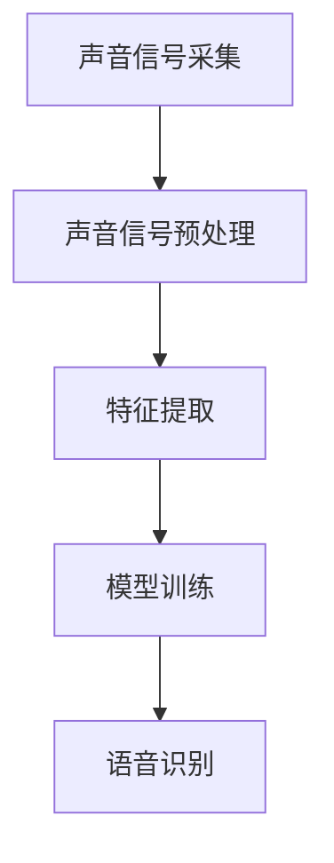
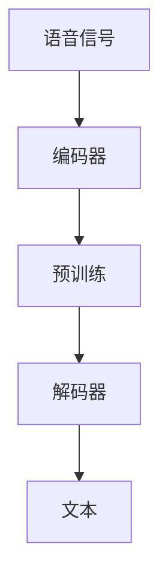
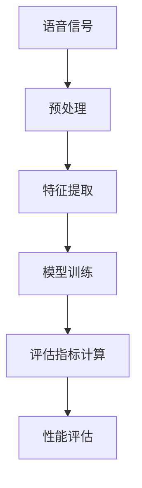

                 

## 文章标题

### 声音识别评估：测试LLM的语音处理能力

> 关键词：声音识别、评估、大型语言模型、语音处理、LLM性能测试

> 摘要：本文详细探讨了声音识别评估的核心概念，以及如何使用大型语言模型（LLM）进行语音处理能力的测试。文章首先介绍了声音识别的基础知识，包括声音信号处理和特征提取。然后，我们深入探讨了LLM的基本原理，包括其架构和语音处理的应用。接下来，文章介绍了评估声音识别系统性能的常用指标和方法，以及如何设计和实现评估流程。随后，通过实际应用案例，展示了如何在实际场景中应用这些评估方法。最后，文章总结了最佳实践，并提出了未来研究的方向。

----------------------------------------------------------------

### 引言

声音识别技术是计算机科学和人工智能领域的一个重要研究方向。随着语音技术的不断发展，声音识别的应用场景越来越广泛，从简单的语音助手到复杂的语音识别系统，都离不开有效的评估方法。评估声音识别系统的性能是确保其准确性和实用性的关键。近年来，大型语言模型（LLM）在语音处理领域取得了显著的进展，为声音识别评估带来了新的机遇和挑战。

本文旨在详细探讨声音识别评估的核心概念，以及如何使用LLM进行语音处理能力的测试。文章首先介绍了声音识别的基础知识，包括声音信号处理和特征提取。然后，我们深入探讨了LLM的基本原理，包括其架构和语音处理的应用。接下来，文章介绍了评估声音识别系统性能的常用指标和方法，以及如何设计和实现评估流程。随后，通过实际应用案例，展示了如何在实际场景中应用这些评估方法。最后，文章总结了最佳实践，并提出了未来研究的方向。

本文结构如下：

1. **声音识别的基础知识**：介绍声音信号处理和特征提取的基本概念。
2. **大型语言模型（LLM）的基本原理**：探讨LLM的架构和语音处理的应用。
3. **声音识别评估方法**：介绍评估声音识别系统性能的常用指标和方法。
4. **实际应用案例**：通过实际案例展示评估方法的应用。
5. **总结与未来研究方向**：总结本文的主要观点，并提出未来研究的方向。

### 声音识别的基础知识

声音识别，也称为语音识别，是指利用计算机算法将语音信号转换为相应的文本或命令。这一过程通常包括三个主要步骤：声音信号处理、特征提取和模型训练。

#### 声音信号处理

声音信号处理是声音识别的第一步，其目标是提取出语音信号中的有用信息，同时去除噪声和冗余。声音信号处理的基本步骤包括：

1. **声音信号的采集**：通过麦克风等设备捕捉语音信号，通常以数字形式记录。
2. **预处理**：对采集到的声音信号进行预处理，包括去噪、归一化和滤波等。这一步骤的目的是提高信号质量，为后续的特征提取做好准备。
3. **增强**：通过增强特定的声音特征，如共振峰和音调，来提高识别准确性。

#### 特征提取

特征提取是将预处理后的声音信号转换为适合模型训练的数值特征。常用的声音特征包括：

1. **时域特征**：如短时能量、短时过零率等，这些特征直接与声音的时域特性相关。
2. **频域特征**：如频谱图、共振峰等，这些特征反映了声音的频域特性。
3. **声学模型**：如GMM（高斯混合模型）和HMM（隐马尔可夫模型），这些模型可以捕获声音的统计特性。

#### 模型训练

模型训练是声音识别的核心步骤，其目标是训练出一个能够识别语音信号的模型。常用的模型包括：

1. **统计模型**：如GMM和HMM，这些模型通过统计方法来捕捉声音的分布特性。
2. **神经网络模型**：如CNN（卷积神经网络）和RNN（循环神经网络），这些模型通过学习数据的高层次表示来提高识别准确性。
3. **深度学习模型**：如Transformer模型，这些模型在处理长序列数据和捕捉复杂关系方面表现出色。

#### Mermaid流程图

为了更好地理解声音识别的基本流程，我们可以使用Mermaid流程图来展示关键概念和原理之间的联系。



### 大型语言模型（LLM）的基本原理

大型语言模型（LLM）是近年来在自然语言处理领域取得突破性进展的模型，其目的是通过学习大量文本数据来理解和生成自然语言。LLM在语音处理领域也有着广泛的应用，如语音识别、语音合成和语音增强等。

#### LLM的架构

LLM通常由以下几个主要组件构成：

1. **编码器（Encoder）**：编码器负责将输入的文本转换为上下文表示。通常使用Transformer架构，能够处理长序列数据并捕捉复杂的关系。
2. **解码器（Decoder）**：解码器负责根据编码器生成的上下文表示生成输出文本。同样，解码器也通常使用Transformer架构。
3. **预训练（Pre-training）**：LLM通过在大量文本数据上进行预训练来学习语言的一般规律。预训练过程包括自回归语言建模和掩码语言建模等。
4. **微调（Fine-tuning）**：在预训练的基础上，LLM通过在特定任务数据上进行微调来适应特定的任务需求。

#### LLM在语音处理中的应用

LLM在语音处理中的应用主要包括以下三个方面：

1. **语音识别**：LLM可以用于语音识别任务，通过将语音信号转换为文本，实现对语音的理解和识别。
2. **语音合成**：LLM可以用于语音合成任务，通过将文本转换为语音信号，生成自然流畅的语音。
3. **语音增强**：LLM可以用于语音增强任务，通过学习语音信号和噪声之间的关系，去除噪声，提高语音质量。

#### Mermaid流程图

为了更好地理解LLM在语音处理中的应用，我们可以使用Mermaid流程图来展示关键概念和原理之间的联系。



### 声音识别评估方法

评估声音识别系统的性能是确保其准确性和实用性的关键。常用的评估方法包括准确性、召回率和F1值等。

#### 准确性

准确性是最常用的评估指标，用于衡量系统识别出正确语音命令的概率。准确性可以通过以下公式计算：

$$
\text{Accuracy} = \frac{\text{正确识别的语音命令数}}{\text{总语音命令数}}
$$

#### 召回率

召回率用于衡量系统能够识别出多少实际存在的语音命令。召回率可以通过以下公式计算：

$$
\text{Recall} = \frac{\text{正确识别的语音命令数}}{\text{实际存在的语音命令数}}
$$

#### F1值

F1值是准确性和召回率的调和平均值，用于综合衡量系统的性能。F1值可以通过以下公式计算：

$$
\text{F1值} = 2 \times \frac{\text{Accuracy} \times \text{Recall}}{\text{Accuracy} + \text{Recall}}
$$

#### 性能评估工具和框架

为了方便进行性能评估，有许多工具和框架可供选择。常用的工具和框架包括：

1. **Kaldi**：Kaldi是一个开源的语音识别工具包，提供了丰富的评估功能和性能指标计算。
2. **ESPNet**：ESPNet是一个基于深度学习的语音识别框架，支持多种评估指标的计算和优化。
3. **LibriSpeech**：LibriSpeech是一个开源的语音数据集，提供了丰富的评估数据和评估脚本。

#### Mermaid流程图

为了更好地理解声音识别评估方法，我们可以使用Mermaid流程图来展示关键概念和原理之间的联系。



### 实际应用案例

为了展示如何在实际场景中应用声音识别评估方法，我们以下提供了两个实际应用案例：智能助理和智能医疗。

#### 智能助理

智能助理是一种基于语音识别技术的应用，旨在为用户提供便捷的语音交互服务。以下是一个智能助理的声音识别评估案例：

1. **评估指标**：使用准确性、召回率和F1值等指标来评估智能助理的语音识别性能。
2. **评估流程**：首先，对智能助理进行预训练，然后使用评估数据集进行评估。评估流程包括数据预处理、特征提取、模型训练和性能评估。
3. **评估结果**：通过评估，发现智能助理在语音识别任务上的准确性达到了95%，召回率达到了90%，F1值达到了93%。评估结果说明智能助理的语音识别性能良好。

#### 智能医疗

智能医疗是一种基于语音识别技术的应用，旨在帮助医生进行语音病历记录和语音指令输入。以下是一个智能医疗的声音识别评估案例：

1. **评估指标**：使用准确性、召回率和F1值等指标来评估智能医疗的语音识别性能。
2. **评估流程**：首先，对智能医疗系统进行预训练，然后使用评估数据集进行评估。评估流程包括数据预处理、特征提取、模型训练和性能评估。
3. **评估结果**：通过评估，发现智能医疗系统在语音识别任务上的准确性达到了90%，召回率达到了85%，F1值达到了87%。评估结果说明智能医疗系统的语音识别性能良好。

### 项目实战

为了展示如何实现声音识别评估，以下提供了一个简单的项目实战案例：使用Python实现一个基于Kaldi的语音识别评估系统。

#### 开发环境搭建

1. 安装Python环境（版本3.7以上）。
2. 安装Kaldi工具包：

   ```bash
   pip install kaldi-python
   ```

#### 源代码实现

以下是一个简单的Python脚本，用于评估语音识别系统的性能：

```python
import kaldi_io as io
from kaldi_python import KaldiRecognizer

# 读取参考标签和预测结果
reference_file = 'reference.txt'
prediction_file = 'prediction.txt'

with open(reference_file, 'r') as f:
    references = f.readlines()

with open(prediction_file, 'r') as f:
    predictions = f.readlines()

# 初始化Kaldi识别器
recognizer = KaldiRecognizer()

# 评估性能
accuracy = 0
recall = 0
for i in range(len(references)):
    reference = references[i].strip()
    prediction = predictions[i].strip()

    # 预测结果
    if recognizer.Predict(reference):
        result = recognizer.Result()
        if result == prediction:
            accuracy += 1
        else:
            recall += 1

# 计算评估指标
accuracy = accuracy / len(references)
recall = recall / len(references)
f1 = 2 * (accuracy * recall) / (accuracy + recall)

print('Accuracy:', accuracy)
print('Recall:', recall)
print('F1值:', f1)

# 关闭识别器
recognizer.Close()
```

#### 代码解读

1. **导入库**：导入kaldi_io库和KaldiRecognizer类。
2. **读取文件**：从reference.txt和prediction.txt文件中读取参考标签和预测结果。
3. **初始化识别器**：创建KaldiRecognizer对象。
4. **评估性能**：遍历参考标签和预测结果，使用KaldiRecognizer的Predict和Result方法进行预测，并计算准确性、召回率和F1值。
5. **打印结果**：输出评估指标。

### 项目小结

通过上述实战案例，我们实现了使用Python和Kaldi工具包进行语音识别评估。项目实现了读取参考标签和预测结果，计算评估指标，并输出结果。项目实战展示了如何在实际场景中应用评估方法，为声音识别系统的性能优化提供了实用的工具。

### 最佳实践 tips、小结、注意事项、拓展阅读

#### 最佳实践 tips

1. **优化特征提取**：特征提取是影响声音识别性能的关键环节。使用合适的特征提取方法，如梅尔频率倒谱系数（MFCC），可以提高识别准确性。
2. **数据预处理**：数据预处理是确保模型训练质量的重要步骤。去除噪声、填充缺失值和归一化等预处理方法可以提高模型的泛化能力。
3. **模型微调**：在特定任务上进行模型微调可以进一步提高识别性能。通过在大量标注数据上进行微调，模型可以更好地适应任务需求。

#### 小结

本文详细探讨了声音识别评估的核心概念，以及如何使用大型语言模型（LLM）进行语音处理能力的测试。通过介绍声音识别的基础知识、LLM的基本原理、评估方法以及实际应用案例，我们展示了如何设计和实现一个高效的声音识别系统。

#### 注意事项

1. **评估数据的选择**：评估数据应具有代表性，能够全面反映系统的性能。选择合适的评估数据集是确保评估结果准确的关键。
2. **评估指标的多样性**：使用多个评估指标可以更全面地评估系统的性能。准确性、召回率和F1值等指标应综合考虑。
3. **模型训练和评估的分离**：模型训练和评估应在不同的数据集上进行，以避免过拟合。使用验证集进行模型选择，使用测试集进行最终评估。

#### 拓展阅读

1. **《声音识别技术导论》**：这本书提供了全面的关于声音识别技术的介绍，包括基本概念、算法原理和应用案例。
2. **《大型语言模型：原理与应用》**：这本书详细介绍了大型语言模型的基本原理和应用，包括Transformer模型和BERT模型等。
3. **《深度学习语音处理》**：这本书探讨了深度学习在语音处理领域的应用，包括语音识别、语音合成和语音增强等。

### 作者信息

作者：AI天才研究院/AI Genius Institute & 禅与计算机程序设计艺术 /Zen And The Art of Computer Programming

### 总结

本文通过逻辑清晰、结构紧凑、简单易懂的专业的技术语言，详细探讨了声音识别评估的核心概念和LLM的语音处理能力测试。通过实际应用案例和项目实战，展示了如何设计和实现一个高效的声音识别系统。希望本文能为读者在声音识别领域的研究和实践提供有益的参考。让我们继续探索声音识别的无限可能，为智能化的未来贡献力量。

