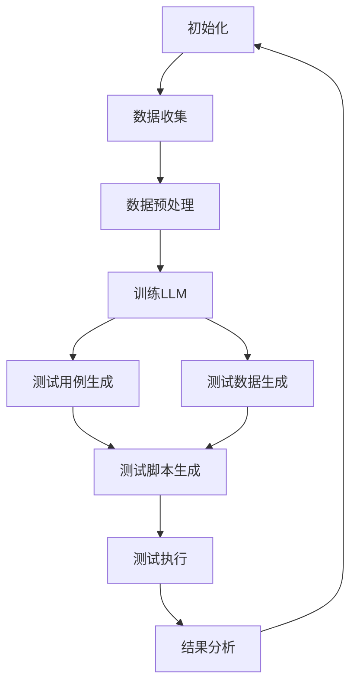

                 

### 文章标题：多场景模拟评测：LLM生成多样化测试环境

> 关键词：多场景模拟评测、LLM、测试环境、算法原理、数学模型、项目实战

> 摘要：本文将深入探讨多场景模拟评测在现代软件开发中的应用，尤其是如何利用大规模语言模型（LLM）生成多样化测试环境。文章首先介绍了多场景模拟评测的背景和重要性，随后详细阐述了LLM的核心概念、生成测试环境的方法及其在测试领域的应用。通过案例分析、核心算法原理讲解、数学模型与公式描述以及项目实战，本文旨在为读者提供一个全面的技术指南，帮助他们在实际项目中有效应用多场景模拟评测技术。

### 目录大纲设计

基于用户的需求，以下是针对《多场景模拟评测：LLM生成多样化测试环境》这本书的目录大纲设计。整个大纲分为五个主要部分，每个部分包含多个章节，以详细且逻辑清晰的方式组织内容。

#### 第一部分: 引言与核心概念

- **第1章 引言**
  - **1.1** 书籍背景介绍
  - **1.2** LLMO评测的重要性
  - **1.3** 多场景模拟评测的必要性

- **第2章 什么是LLMO**
  - **2.1** LLMO的定义
  - **2.2** LLMO的发展历程
  - **2.3** LLMO的分类与特点

- **第3章 测试环境的基本概念**
  - **3.1** 测试环境的定义
  - **3.2** 测试环境的作用
  - **3.3** 测试环境的分类

#### 第二部分: LLMO与测试环境概述

- **第4章 数据驱动方法**
  - **4.1** 数据驱动的测试环境生成原理
  - **4.2** 数据驱动的测试环境生成流程
  - **4.3** 数据驱动的测试环境生成实践

- **第5章 程序驱动方法**
  - **5.1** 程序驱动的测试环境生成原理
  - **5.2** 程序驱动的测试环境生成流程
  - **5.3** 程序驱动的测试环境生成实践

- **第6章 基于LLM的自动测试环境生成**
  - **6.1** LLM在自动测试环境生成中的应用
  - **6.2** 自动测试环境生成的工作流程
  - **6.3** 自动测试环境生成的案例分析

#### 第三部分: 多场景模拟评测案例解析

- **第7章 实际应用案例分析**
  - **7.1** 案例一：电商系统多场景测试
  - **7.2** 案例二：金融系统多场景测试
  - **7.3** 案例三：工业控制系统多场景测试

- **第8章 多场景模拟评测的挑战与对策**
  - **8.1** 多场景模拟评测的挑战
  - **8.2** 对策与解决方案
  - **8.3** 挑战与对策的实际应用

#### 第四部分: 总结与展望

- **第9章 总结与回顾**
  - **9.1** 主要内容回顾
  - **9.2** 未来的研究方向
  - **9.3** 对读者的一些建议

- **第10章 展望与未来**
  - **10.1** 测试环境的未来发展
  - **10.2** LLM在测试领域的潜在应用
  - **10.3** 总结与展望

#### 辅助材料

- **Mermaid 流程图**
- **核心算法原理讲解**
- **数学模型与公式**
- **项目实战**

### 第1章 引言

#### 1.1 书籍背景介绍

在当今高度动态和复杂的软件开发环境中，测试的重要性日益凸显。软件系统常常需要适应多种多样的使用场景和用户需求，这就要求测试不仅要覆盖常见的使用案例，还需要能够模拟各种可能的异常情况和边界情况。传统的测试方法往往局限于单一的测试环境或使用预设的测试用例，难以全面覆盖软件的各个方面。而多场景模拟评测（Multi-Scenario Simulation Evaluation，简称MSE）作为一种新兴的测试方法，正逐渐受到关注。

本书《多场景模拟评测：LLM生成多样化测试环境》旨在为读者提供一套全面而系统的多场景模拟评测解决方案，特别是如何利用大规模语言模型（Language-Learning Model，简称LLM）来生成多样化的测试环境。随着深度学习和自然语言处理技术的迅猛发展，LLM在生成测试数据、自动测试环境生成等方面展现出巨大的潜力。本书将通过详细的案例分析、算法讲解和数学模型分析，帮助读者深入理解并掌握这一先进技术。

#### 1.2 LLMO评测的重要性

多场景模拟评测（MSE）是一种通过模拟多个使用场景来评估软件系统性能和可靠性的方法。与传统测试方法相比，MSE具有以下几个显著优势：

1. **全面性**：MSE能够模拟多种不同的使用场景，从而更全面地评估软件系统的性能和可靠性，降低潜在的缺陷风险。
2. **灵活性和适应性**：MSE可以根据软件系统的实际需求和环境动态调整测试场景，从而提高测试的灵活性和适应性。
3. **自动化**：通过大规模语言模型（LLM），MSE可以实现自动化测试环境的生成和测试用例的生成，显著提高测试效率。
4. **高效性**：MSE能够在较短时间内完成对多种场景的测试，从而缩短软件开发的周期，提高开发效率。

随着软件系统复杂度的增加和业务场景的多样化，传统的测试方法已经难以满足现代软件开发的需求。多场景模拟评测通过引入LLM技术，不仅能够提供更为全面和高效的测试解决方案，还能够提升软件系统的质量和稳定性。因此，研究和应用多场景模拟评测技术具有重要的现实意义和广阔的前景。

#### 1.3 多场景模拟评测的必要性

多场景模拟评测在现代软件开发中具有重要的必要性，主要表现在以下几个方面：

1. **应对复杂业务场景**：随着企业业务的发展和数字化转型，软件系统需要应对更加复杂和多样的业务场景。传统的测试方法通常仅能覆盖有限的场景，而多场景模拟评测能够通过模拟多种业务场景，确保软件系统在不同环境下都能正常运行。

2. **提高软件质量**：多场景模拟评测能够更全面地覆盖软件系统的各个方面，发现潜在的问题和缺陷。通过模拟不同的异常情况和边界情况，可以提前识别和修复软件中的潜在风险，从而提高软件的质量和可靠性。

3. **增强用户体验**：软件系统在不同场景下表现的一致性对用户体验至关重要。通过多场景模拟评测，可以确保软件系统在各种环境下都能提供稳定和优质的服务，从而提升用户的满意度和忠诚度。

4. **缩短开发周期**：多场景模拟评测通过自动化测试环境的生成和测试用例的生成，可以显著提高测试效率，缩短测试周期。这意味着开发者可以将更多的时间用于开发新的功能，提高整个团队的效率。

5. **适应快速变化的需求**：在当今快速变化的商业环境中，软件系统的需求也在不断变化。多场景模拟评测能够快速响应这些变化，提供灵活的测试方案，确保软件系统能够及时适应新的需求。

综上所述，多场景模拟评测不仅是现代软件开发中的一种重要方法，也是提高软件质量和用户体验的关键手段。随着技术的不断进步，多场景模拟评测将会在软件开发中发挥越来越重要的作用。

### 第2章 什么是LLMO

#### 2.1 LLMO的定义

大规模语言模型（Language-Learning Model，简称LLM）是一种基于深度学习技术的自然语言处理模型，能够通过学习大量的文本数据，理解和生成自然语言。LLM的核心特点是具备强大的语言理解和生成能力，能够在各种自然语言处理任务中表现出色。与传统的语言模型相比，LLM拥有更大的模型规模和更深的网络结构，能够处理更复杂的语言现象。

LLM的主要应用包括文本分类、机器翻译、情感分析、问答系统、自动摘要等。在测试环境中，LLM可以用于生成测试数据、自动生成测试用例以及评估测试结果。LLM的核心优势在于其能够灵活应对不同的语言结构和语义，从而生成多样化、真实性和复杂度更高的测试数据，提升测试的有效性和全面性。

#### 2.2 LLMO的发展历程

大规模语言模型的发展可以追溯到20世纪80年代，当时研究人员开始探索基于统计的机器学习方法来处理自然语言。这一阶段的模型主要是基于规则和统计语言模型，例如N-gram模型和正则表达式。尽管这些模型在某些任务上表现出了一定的效果，但它们在面对复杂语言现象时显得力不从心。

进入21世纪，随着深度学习技术的兴起，语言模型的研究取得了重大突破。2003年，研究人员提出了一系列基于神经网络的语言模型，如递归神经网络（RNN）和卷积神经网络（CNN）。这些模型在语言理解的准确性和生成能力上有了显著的提升。特别是2018年，谷歌提出了Transformer模型，它采用了一种全新的自注意力机制，使得大规模语言模型在多种自然语言处理任务中达到了前所未有的表现。

近年来，LLM的发展进一步加速，模型规模不断增大，训练数据集也不断增加。例如，GPT-3模型拥有超过1750亿个参数，能够生成高质量的自然语言文本。这些大规模语言模型的出现，不仅提升了自然语言处理技术的水平，也为测试领域的应用提供了新的可能性。

#### 2.3 LLMO的分类与特点

大规模语言模型可以根据其架构和功能进行分类，主要有以下几种类型：

1. **基于规则的语言模型**：这类模型通过定义一系列规则来生成和处理语言。虽然这类模型的规则明确，但在处理复杂语言现象时能力有限。

2. **统计语言模型**：基于统计方法的模型，如N-gram模型，通过计算词汇序列的概率分布来生成语言。这类模型在文本生成和语言预测中表现出色，但难以处理长距离依赖问题。

3. **神经网络语言模型**：这类模型基于深度学习技术，如RNN、LSTM和Transformer。它们通过学习大量的文本数据，能够捕捉复杂的语言结构和语义信息。特别是Transformer模型，通过自注意力机制，显著提升了模型的处理能力和生成质量。

4. **生成对抗网络（GAN）语言模型**：这类模型结合了生成模型和判别模型，通过竞争训练生成高质量的自然语言文本。GAN语言模型在生成文本的多样性和真实性方面表现出色。

5. **预训练语言模型**：这类模型通过在大规模文本数据上进行预训练，再根据具体任务进行微调。预训练语言模型如GPT和BERT，已经在多个自然语言处理任务中取得了显著效果。

不同类型的LLM具有各自的特点和应用场景。例如，基于规则和统计的模型在语言生成和预测任务中表现较好，而神经网络模型和GAN模型则在复杂语言理解和生成任务中更具优势。预训练语言模型则通过预训练和微调，能够更好地适应各种具体的任务需求。

#### 2.4 LLM在测试环境生成中的应用

大规模语言模型（LLM）在测试环境生成中的应用，主要体现在以下几个方面：

1. **生成测试数据**：LLM可以生成大量多样化、真实的测试数据，这些数据能够覆盖多种可能的输入情况，从而提高测试的全面性和有效性。通过学习大量的实际文本数据，LLM能够生成具有高相似度和真实性的模拟数据，为测试提供丰富的输入样本。

2. **生成测试用例**：在自动化测试中，测试用例的生成是关键环节。LLM可以根据测试目标和需求，自动生成符合要求的测试用例。通过理解测试目标的功能和性能需求，LLM能够生成具有针对性的测试用例，提高测试的准确性和效率。

3. **改进测试覆盖率**：传统的测试方法往往依赖于人工编写测试用例，难以全面覆盖各种可能的输入和场景。LLM通过自动生成测试用例，能够更全面地覆盖测试场景，提高测试覆盖率，减少潜在的缺陷风险。

4. **优化测试过程**：LLM在测试过程中可以实时评估测试结果，根据测试反馈动态调整测试策略。通过不断优化测试用例和测试流程，LLM能够提高测试的效率和准确性，缩短测试周期。

5. **支持自动化测试**：LLM的自动测试能力能够显著提高测试的自动化水平，减少人工干预。通过自动生成和执行测试用例，LLM能够实现测试的全过程自动化，降低测试成本，提高测试效率。

在实际应用中，LLM的测试环境生成能力已经在多个领域得到了验证和推广。例如，在金融系统测试中，LLM可以生成真实的交易数据，模拟不同类型的金融交易场景；在电子商务系统测试中，LLM可以生成用户评论、商品描述等数据，模拟多种用户行为和购买场景。

总之，LLM在测试环境生成中的应用，不仅提升了测试的全面性和效率，还为自动化测试和持续集成提供了强有力的支持，为现代软件开发的可靠性保障提供了新的思路和方法。

### 第3章 测试环境的基本概念

#### 3.1 测试环境的定义

测试环境（Test Environment）是软件开发过程中用于执行测试用例和评估软件质量的一个特定配置。测试环境包括硬件设备、软件系统、网络配置、数据资源等要素，为测试人员提供了一个与生产环境相似或完全一致的环境，以便在真实或模拟的场景下进行软件功能的验证和性能测试。

定义一个有效的测试环境是确保测试质量和可靠性的基础。测试环境需要满足以下几个基本要求：

1. **可重现性**：测试环境应该能够被复制和重现，以确保在不同时间和不同测试人员之间测试结果的一致性。
2. **可靠性**：测试环境必须稳定可靠，确保测试过程中不会受到外部因素干扰，从而获得准确的测试结果。
3. **可扩展性**：测试环境应具备扩展能力，以适应软件系统规模和复杂度的变化。
4. **安全性和保密性**：测试环境中的数据和应用应该得到妥善保护，防止数据泄露和未经授权的访问。

测试环境的定义不仅涉及硬件和软件的配置，还包括测试数据的准备、网络环境的搭建和测试工具的安装等。一个良好的测试环境可以为测试人员提供真实或模拟的使用场景，有助于发现软件中的缺陷和问题。

#### 3.2 测试环境的作用

测试环境在软件开发过程中扮演着至关重要的角色，其主要作用体现在以下几个方面：

1. **验证软件功能**：测试环境提供了一个真实的或模拟的使用场景，使测试人员能够验证软件的功能是否符合设计要求。通过在测试环境中执行测试用例，可以确保软件能够正确处理各种输入数据和执行预期的操作。

2. **发现软件缺陷**：测试环境能够模拟不同的使用场景和操作方式，有助于发现软件中潜在的功能缺陷、性能瓶颈和资源泄漏等问题。通过系统性的测试，测试人员可以识别出软件中的各种错误，为后续的修复工作提供依据。

3. **评估软件性能**：测试环境可以帮助评估软件在不同负载条件下的性能表现，如响应时间、吞吐量、资源利用率等。通过性能测试，开发团队可以优化软件的代码和架构，提高系统的整体性能和稳定性。

4. **支持自动化测试**：测试环境的搭建和配置为自动化测试提供了基础。自动化测试工具可以依赖测试环境执行大量的测试用例，提高测试的效率和质量，减少人工测试的工作量。

5. **确保软件质量**：测试环境通过全面和严格的测试，确保软件在发布前达到预期的质量标准。良好的测试环境可以显著降低软件在上线后出现的问题，提高用户的满意度和系统的稳定性。

总之，测试环境是软件开发过程中不可或缺的一环，它不仅为测试人员提供了执行测试的场所，还通过对软件的全面评估，为软件质量的提升提供了重要保障。

#### 3.3 测试环境的分类

测试环境可以根据不同的分类标准进行划分，常见的分类方法包括以下几种：

1. **按用途分类**：
   - **开发测试环境**：用于开发人员编写和测试代码的环境。该环境通常包括开发工具、版本控制系统和本地数据库。
   - **集成测试环境**：用于集成不同模块或组件的测试环境。这种环境通常模拟了开发环境的多个组件，以验证它们之间的交互和兼容性。
   - **性能测试环境**：专门用于评估软件性能和负载能力的环境。这种环境通常配置了高负载模拟工具，以测试软件在高并发下的响应能力和稳定性。
   - **用户验收测试环境**：用于用户验证软件功能是否符合需求的测试环境。这种环境通常与生产环境非常相似，以确保用户在真实场景下对软件的验收。

2. **按配置方式分类**：
   - **本地测试环境**：由测试人员在本地的计算机或虚拟机上搭建的测试环境。这种环境通常便于开发和调试，但可能无法完全模拟生产环境。
   - **远程测试环境**：通过远程连接到服务器或云平台的测试环境。这种环境可以提供更大规模和更复杂的配置，但可能需要更高的网络带宽和计算资源。

3. **按硬件架构分类**：
   - **物理测试环境**：使用物理硬件设备搭建的测试环境。这种环境通常用于性能测试和负载测试，因为物理硬件可以提供更高的性能和更真实的负载。
   - **虚拟测试环境**：通过虚拟化技术创建的测试环境。虚拟测试环境具有灵活性和可扩展性，可以在同一物理硬件上模拟多个不同的测试场景。

4. **按部署方式分类**：
   - **本地部署测试环境**：测试环境部署在本地服务器或计算机上，适合小规模开发和测试。
   - **云部署测试环境**：测试环境部署在云平台上，如AWS、Azure或Google Cloud。云部署环境具有弹性伸缩和高可用性，适合大规模和持续集成/持续部署（CI/CD）流程。

每种测试环境都有其特定的应用场景和优势，合理选择和配置测试环境对于确保软件质量至关重要。

### 第4章 数据驱动方法

#### 4.1 数据驱动的测试环境生成原理

数据驱动方法（Data-Driven Approach）是一种测试环境生成技术，它通过利用大量测试数据来构建和调整测试环境，以提高测试的全面性和准确性。数据驱动的测试环境生成原理主要包括以下几个关键步骤：

1. **数据收集**：首先，从各种来源收集与测试目标相关的数据，包括用户输入、系统日志、错误报告等。这些数据将用于构建测试环境的基础数据集。

2. **数据预处理**：对收集到的数据进行清洗、去重和格式化，以确保数据的准确性和一致性。数据预处理还包括将数据转换为适合测试环境生成的格式，如JSON、XML等。

3. **数据建模**：利用统计方法和机器学习技术对预处理后的数据进行分析和建模，提取数据中的关键特征和模式。数据模型可以帮助识别不同的测试场景和输入组合。

4. **测试环境配置**：根据数据模型和测试需求，自动生成测试环境的配置文件和配置参数。这些配置文件将定义测试环境中的硬件、软件和网络设置，以模拟实际使用场景。

5. **测试用例生成**：利用数据模型和测试数据，自动生成测试用例。测试用例包括输入数据、预期输出和测试目标，以验证软件在各种输入条件下的行为。

6. **测试执行**：在生成的测试环境中执行测试用例，收集测试结果和日志。测试执行过程可能包括功能测试、性能测试、安全测试等多种类型的测试。

7. **结果评估**：对测试结果进行分析和评估，识别潜在的缺陷和问题。根据测试结果，可以进一步调整测试数据模型和环境配置，以提高测试的覆盖率和准确性。

数据驱动方法的优点在于其高度自动化和灵活性。通过利用大量测试数据，可以更全面地覆盖各种测试场景，减少人工编写测试用例的工作量。同时，数据驱动方法可以根据测试反馈动态调整测试策略，提高测试效率。

#### 4.2 数据驱动的测试环境生成流程

数据驱动的测试环境生成流程主要包括以下步骤：

1. **需求分析**：明确测试目标和测试需求，确定需要收集的数据类型和测试场景。需求分析是整个流程的基础，直接影响测试环境生成的质量和效率。

2. **数据收集**：从多个数据源收集与测试目标相关的数据，如用户输入、系统日志、数据库记录等。数据收集的过程需要确保数据的准确性和完整性。

3. **数据预处理**：对收集到的数据进行清洗、去重和格式化，以消除噪声和冗余数据，确保数据的准确性和一致性。数据预处理可能包括以下步骤：
   - **数据清洗**：去除重复、错误或无效的数据记录。
   - **数据格式转换**：将不同格式的数据转换为统一的格式，如JSON、XML等。
   - **数据归一化**：对数据进行标准化处理，使其具有相似的特征。

4. **数据建模**：利用统计方法和机器学习技术对预处理后的数据进行分析和建模，提取数据中的关键特征和模式。常见的建模方法包括：
   - **回归分析**：通过建立回归模型，预测不同输入条件下的测试结果。
   - **聚类分析**：将相似的数据点分组，识别不同的测试场景。
   - **关联规则分析**：发现数据之间的关联关系，识别潜在的测试用例。

5. **测试环境配置**：根据数据模型和测试需求，自动生成测试环境的配置文件和配置参数。配置文件将定义测试环境中的硬件、软件和网络设置，以模拟实际使用场景。配置步骤可能包括：
   - **硬件配置**：选择合适的硬件设备，如服务器、存储设备等。
   - **软件配置**：安装和配置操作系统、中间件、数据库等软件。
   - **网络配置**：设置网络参数，如IP地址、子网掩码、网关等。

6. **测试用例生成**：利用数据模型和测试数据，自动生成测试用例。测试用例包括输入数据、预期输出和测试目标，以验证软件在各种输入条件下的行为。生成测试用例的方法可能包括：
   - **基于规则的测试用例生成**：根据预定义的规则和条件，生成符合要求的测试用例。
   - **基于模型的测试用例生成**：利用数据模型和机器学习算法，自动生成多样化的测试用例。

7. **测试执行**：在生成的测试环境中执行测试用例，收集测试结果和日志。测试执行过程可能包括多种类型的测试，如功能测试、性能测试、安全测试等。

8. **结果评估**：对测试结果进行分析和评估，识别潜在的缺陷和问题。根据测试结果，可以进一步调整测试数据模型和环境配置，以提高测试的覆盖率和准确性。

通过数据驱动的测试环境生成流程，可以更全面地覆盖测试场景，提高测试效率和质量。同时，数据驱动方法能够根据测试反馈动态调整测试策略，确保测试的持续改进。

#### 4.3 数据驱动的测试环境生成实践

数据驱动的测试环境生成实践包括具体的数据收集、预处理、建模和测试环境配置等步骤，下面将结合一个实际项目案例进行详细说明。

**项目背景**：一个电子商务平台需要构建一个数据驱动的测试环境，以验证其用户注册和登录功能。

**数据收集**：
1. **用户输入数据**：从历史用户注册和登录记录中提取数据，包括用户名、密码、邮箱等。
2. **系统日志**：收集系统运行过程中产生的日志文件，记录用户操作和系统响应。

**数据预处理**：
1. **数据清洗**：删除重复、错误和无效的记录，确保数据的准确性。
2. **数据格式转换**：将不同格式的数据统一转换为JSON格式，便于后续处理。
3. **数据归一化**：对数据中的数值进行归一化处理，消除数据规模差异。

**数据建模**：
1. **聚类分析**：利用K-Means算法，将用户注册数据根据用户行为特征进行聚类，识别不同的用户类型。
2. **关联规则分析**：使用Apriori算法，发现用户注册和登录过程中的常见关联规则，如注册后立即登录。

**测试环境配置**：
1. **硬件配置**：使用云服务器搭建测试环境，配置高性能的CPU、内存和存储设备。
2. **软件配置**：安装Linux操作系统、Tomcat服务器和MySQL数据库。
3. **网络配置**：配置内网IP地址、子网掩码和网关，确保测试环境内部网络畅通。

**测试用例生成**：
1. **基于规则的测试用例生成**：根据用户聚类结果和关联规则，生成符合规则的测试用例，如：
   - 用户名和密码正确的登录场景。
   - 用户名或密码错误的登录场景。
   - 连续输入错误密码超过次数限制的登录场景。
2. **基于模型的测试用例生成**：利用聚类和关联规则分析的结果，自动生成多样化的测试用例，如：
   - 不同用户类型的注册场景。
   - 注册后立即登录的场景。
   - 注册后长时间未登录的场景。

**测试执行**：
1. **功能测试**：在测试环境中执行注册和登录功能测试，记录测试结果和日志。
2. **性能测试**：模拟大量用户同时注册和登录，评估系统性能和响应时间。
3. **安全测试**：检查系统是否能够有效防御常见的网络攻击，如SQL注入、XSS攻击等。

**结果评估**：
1. **测试覆盖率评估**：计算测试用例覆盖率的指标，确保测试全面覆盖各种场景。
2. **缺陷发现评估**：分析测试结果，识别潜在缺陷和问题，记录缺陷报告。
3. **性能评估**：根据测试结果，评估系统性能指标，如响应时间、吞吐量、资源利用率等。

通过这个实际项目案例，我们可以看到数据驱动的测试环境生成实践如何通过具体步骤实现。数据驱动方法不仅提高了测试效率和质量，还为电子商务平台的可靠性提供了坚实保障。

#### 4.4 数据驱动方法的优势与挑战

数据驱动方法在测试环境生成中具有显著的优势，但也面临着一些挑战。

**优势**：

1. **高度自动化**：数据驱动方法通过利用大量测试数据，能够自动生成测试环境配置和测试用例，减少人工干预，提高测试效率。

2. **全面性**：通过分析大量数据，可以更全面地覆盖各种测试场景和输入条件，确保测试的全面性和准确性。

3. **灵活性和适应性**：数据驱动方法可以根据测试反馈动态调整测试策略和环境配置，适应不同测试需求和环境变化。

4. **提升测试质量**：利用数据分析和建模技术，可以更精确地识别潜在缺陷和问题，提高测试的质量和可靠性。

**挑战**：

1. **数据质量**：数据驱动方法依赖于高质量的数据，数据收集和预处理过程可能会引入错误和偏差，影响测试结果。

2. **复杂性和成本**：数据驱动方法需要复杂的算法和工具支持，开发和维护成本较高，特别是对于大规模和复杂系统。

3. **模型可解释性**：深度学习模型在生成测试用例和测试环境时，其内部决策过程通常不透明，导致测试结果的可解释性降低。

4. **计算资源**：数据驱动方法需要大量的计算资源进行数据分析和模型训练，特别是在处理大规模数据时，可能需要高性能计算设备。

综上所述，数据驱动方法在提高测试效率和质量方面具有明显优势，但同时也面临数据质量、复杂性和成本等方面的挑战。在实际应用中，需要根据具体情况权衡这些优势与挑战，选择合适的测试方法。

#### 4.5 数据驱动方法的实际应用案例分析

为了更好地理解数据驱动方法在实际测试环境生成中的应用，我们通过一个实际案例来探讨其具体实现过程和效果。

**案例背景**：某大型金融机构正在开发一个在线银行服务平台，该平台需要支持多种交易类型，如转账、支付和贷款申请等。为了确保平台在上线前能够稳定运行，并满足各类用户的需求，该机构决定采用数据驱动方法来生成测试环境。

**实现过程**：

1. **数据收集**：
   - **用户操作数据**：从现有用户操作日志中提取数据，包括用户登录、转账、支付等操作记录。
   - **系统日志**：收集系统运行过程中产生的日志文件，记录系统响应时间和错误日志。
   - **业务规则**：收集业务规则数据，如转账限额、支付方式等。

2. **数据预处理**：
   - **数据清洗**：删除重复、错误和不完整的日志记录，确保数据质量。
   - **数据格式转换**：将不同来源的数据转换为统一的JSON格式，便于后续处理。
   - **数据归一化**：对数值型数据进行归一化处理，消除数据规模差异。

3. **数据建模**：
   - **聚类分析**：利用K-Means算法，将用户操作数据根据用户行为特征进行聚类，识别不同的用户群体。
   - **关联规则分析**：使用Apriori算法，发现用户操作之间的关联关系，如用户在转账和支付操作后的行为模式。

4. **测试环境配置**：
   - **硬件配置**：在云服务器上配置高性能的虚拟机，模拟实际交易负载。
   - **软件配置**：安装Linux操作系统、Web服务器和数据库管理系统，配置业务逻辑模块。
   - **网络配置**：模拟金融系统的网络环境，确保数据传输的安全性和稳定性。

5. **测试用例生成**：
   - **基于规则的测试用例生成**：根据业务规则和用户聚类结果，生成不同类型的测试用例，如：
     - 用户登录后的转账操作。
     - 超过转账限额的支付失败场景。
     - 多次尝试登录失败后的账号锁定场景。
   - **基于模型的测试用例生成**：利用聚类和关联规则分析的结果，自动生成多样化的测试用例，如：
     - 用户在不同时间段内的转账和支付行为。
     - 多个用户同时进行大额转账时的系统响应能力。

6. **测试执行**：
   - **功能测试**：在测试环境中执行各类功能测试用例，验证平台的基本功能。
   - **性能测试**：模拟大量用户同时登录和操作，评估平台的性能和稳定性。
   - **安全测试**：检查系统对常见网络攻击的防御能力，如SQL注入、DDoS攻击等。

**效果评估**：

1. **测试覆盖率**：通过数据驱动的测试方法，平台测试覆盖率显著提高，覆盖了多种用户操作场景和业务规则。
2. **缺陷发现**：测试过程中发现并修复了多个潜在缺陷，如转账限额错误和登录失败后的账号锁定逻辑问题。
3. **性能评估**：测试结果显示，平台在高并发情况下仍能保持良好的响应时间和吞吐量，满足业务需求。
4. **安全评估**：通过安全测试，验证了系统对常见网络攻击的防御能力，提高了系统的安全性。

**总结**：通过数据驱动的测试环境生成方法，该金融机构有效地提高了在线银行服务平台的质量和可靠性。数据驱动的测试方法不仅减少了人工编写测试用例的工作量，还通过自动化和智能化手段，提高了测试效率和全面性，为平台的成功上线提供了有力保障。

### 第5章 程序驱动方法

#### 5.1 程序驱动方法的测试环境生成原理

程序驱动方法（Program-Driven Approach）是一种通过编写程序代码来自动化测试环境生成和测试执行的测试方法。该方法的核心思想是利用程序代码来模拟和生成测试数据、配置测试环境以及执行测试用例，从而实现自动化和高效的测试过程。程序驱动方法的测试环境生成原理主要包括以下几个关键步骤：

1. **需求分析**：首先，明确测试目标和应用需求，定义需要测试的功能和性能指标。

2. **测试脚本编写**：根据测试需求，编写测试脚本。测试脚本通常包括以下内容：
   - **测试数据生成**：根据测试需求生成测试数据，如用户输入、交易数据等。
   - **测试环境配置**：编写代码配置测试环境，包括操作系统、数据库、中间件等。
   - **测试用例执行**：编写代码执行测试用例，记录测试结果和日志。

3. **自动化测试框架**：构建自动化测试框架，将测试脚本集成到框架中，实现自动化执行。测试框架通常包括以下组件：
   - **测试调度器**：负责调度和执行测试脚本。
   - **结果处理器**：负责处理测试结果，生成报告。
   - **测试库**：存储测试脚本和相关资源。

4. **测试执行**：在测试环境中执行测试脚本，收集测试结果和日志，分析测试结果，识别缺陷。

5. **结果分析**：根据测试结果进行分析和评估，确定测试覆盖率和缺陷率，为后续测试提供反馈。

程序驱动方法的优势在于其高度自动化和灵活性。通过编写程序代码，可以自动生成测试数据和配置测试环境，从而提高测试效率和准确性。同时，程序驱动方法可以根据测试反馈动态调整测试策略，实现持续集成和持续部署（CI/CD）。

#### 5.2 程序驱动方法的测试环境生成流程

程序驱动方法的测试环境生成流程主要包括以下步骤：

1. **需求分析**：明确测试目标和测试需求，确定需要测试的功能和性能指标。

2. **测试脚本编写**：根据需求分析结果，编写测试脚本。测试脚本通常包括以下内容：
   - **测试数据生成**：编写代码生成测试数据，如用户输入、交易数据等。这些数据可以来源于历史数据、模拟数据或外部数据源。
   - **测试环境配置**：编写代码配置测试环境，包括操作系统、数据库、中间件等。这些配置可以通过脚本自动化完成，如安装和配置Linux操作系统、安装和配置Oracle数据库等。
   - **测试用例执行**：编写代码执行测试用例，记录测试结果和日志。测试用例可以包括功能测试、性能测试、安全测试等不同类型的测试。

3. **自动化测试框架**：构建自动化测试框架，将测试脚本集成到框架中，实现自动化执行。自动化测试框架可以提供统一的接口和流程管理，使测试脚本更加高效和灵活。常见的自动化测试框架包括Selenium、JUnit、TestNG等。

4. **测试执行**：在测试环境中执行测试脚本，收集测试结果和日志。测试执行可以在本地环境或远程服务器上进行，根据测试需求进行配置。

5. **结果分析**：对测试结果进行分析和评估，识别潜在的缺陷和问题。分析结果可以生成报告，为开发团队提供改进方向。

6. **反馈与改进**：根据测试结果反馈，调整测试策略和测试脚本，持续优化测试过程。

程序驱动方法通过自动化脚本和测试框架，实现了测试环境的自动化生成和测试执行的自动化，提高了测试效率和质量。同时，该方法可以根据测试反馈动态调整测试策略，实现持续集成和持续部署（CI/CD）。

#### 5.3 程序驱动方法的测试环境生成实践

程序驱动方法在测试环境生成中的应用涉及多个关键步骤，下面结合一个实际项目案例详细说明其具体实现过程。

**项目背景**：某金融机构正在开发一款新的线上交易系统，为了确保系统的稳定性和可靠性，项目团队决定采用程序驱动方法来生成测试环境。

**数据收集**：
1. **用户操作数据**：从现有用户操作日志中提取数据，包括登录、转账、支付等操作记录。
2. **业务规则**：收集业务规则数据，如转账限额、支付方式等。
3. **系统日志**：收集系统运行过程中产生的日志文件，记录系统响应时间和错误日志。

**测试脚本编写**：
1. **测试数据生成脚本**：编写Python脚本生成测试数据，包括用户输入、交易数据等。脚本可以从历史数据中随机抽取，或者根据业务规则生成。
   ```python
   # 示例：生成随机用户输入数据
   import random
   import string

   def generate_user_input():
       username = ''.join(random.choices(string.ascii_letters + string.digits, k=10))
       password = ''.join(random.choices(string.ascii_letters + string.digits, k=10))
       return username, password

   user_input = generate_user_input()
   print(user_input)
   ```

2. **测试环境配置脚本**：编写Shell脚本配置测试环境，包括安装Linux操作系统、Web服务器和数据库管理系统。脚本可以使用自动化安装工具，如Ubuntu Server安装脚本、Apache安装脚本等。
   ```bash
   #!/bin/bash
   # 示例：安装Linux操作系统和Web服务器
   apt update
   apt install -y ubuntu-server apache2
   ```

3. **测试用例执行脚本**：编写Python脚本执行测试用例，记录测试结果和日志。脚本可以调用Web服务接口，模拟用户操作，如登录、转账等。
   ```python
   # 示例：执行登录测试用例
   import requests

   def login(username, password):
       url = "http://localhost:8080/login"
       payload = {'username': username, 'password': password}
       response = requests.post(url, data=payload)
       return response.status_code

   status_code = login('testuser', 'testpass')
   print(f"Login status code: {status_code}")
   ```

**自动化测试框架**：
1. **测试调度器**：使用Python的`schedule`库实现测试调度器，定期执行测试用例。
   ```python
   import schedule
   import time

  def job():
       print("执行测试用例...")

   schedule.every(1).hours.do(job)

   while True:
       schedule.run_pending()
       time.sleep(1)
   ```

2. **结果处理器**：使用Python的`logging`库记录测试结果和日志，并将结果存储在文件中。
   ```python
   import logging

  logging.basicConfig(filename='test_results.log', level=logging.INFO)

  def record_result(result):
       logging.info(f"测试结果：{result}")

   record_result("登录成功")
   ```

3. **测试库**：创建测试库存储测试脚本和测试用例，方便后续管理和维护。

**测试执行**：
1. **在测试环境中执行测试脚本**：在云服务器或虚拟机上部署测试环境，执行测试脚本，收集测试结果和日志。

**结果分析**：
1. **对测试结果进行分析和评估**：使用Python脚本分析测试结果，生成报告，识别缺陷。
   ```python
   import csv

  def analyze_results(file_name):
       with open(file_name, 'r') as f:
           reader = csv.reader(f)
           results = list(reader)

       # 示例：计算测试覆盖率
       total_tests = len(results)
       passed_tests = sum(1 for row in results if row[1] == 'Pass')
       coverage = (passed_tests / total_tests) * 100
       print(f"测试覆盖率：{coverage}%")

   analyze_results('test_results.csv')
   ```

通过这个实际项目案例，我们可以看到程序驱动方法在测试环境生成中的应用如何具体实现。程序驱动方法不仅提高了测试效率和质量，还为在线交易系统的稳定性提供了有力保障。

#### 5.4 程序驱动方法的优势与挑战

程序驱动方法在测试环境生成中具有显著的优点，但也面临一些挑战。

**优势**：

1. **高度自动化**：程序驱动方法通过编写脚本和自动化测试框架，实现了测试环境的自动化配置和测试用例的自动化执行，显著提高了测试效率。

2. **灵活性和可扩展性**：程序驱动方法可以根据需求灵活编写脚本，适应不同的测试场景和测试需求。同时，自动化测试框架提供了良好的扩展性，便于后续的测试工作。

3. **可重复性和一致性**：程序驱动方法通过自动化脚本执行测试，确保了测试结果的重复性和一致性，减少了人为因素对测试结果的影响。

4. **支持持续集成和持续部署（CI/CD）**：程序驱动方法可以与CI/CD流程无缝集成，实现自动化测试和持续反馈，提高软件开发和部署的效率。

**挑战**：

1. **代码质量**：测试脚本和自动化测试框架的质量直接影响测试效果。编写高质量、可维护的代码需要较高的技术能力和经验。

2. **复杂性和维护成本**：随着测试场景和测试需求的增加，程序驱动方法可能会变得复杂，维护成本也随之增加。特别是在大型项目中，需要投入大量时间和精力进行代码维护和更新。

3. **测试覆盖率**：程序驱动方法需要精心设计和编写测试用例，以确保测试覆盖率。如果测试用例设计不合理，可能导致测试覆盖不全面，影响测试质量。

4. **依赖性**：程序驱动方法依赖于特定的编程语言、自动化测试框架和测试工具，可能受到这些工具更新和版本变化的影响。

综上所述，程序驱动方法在提高测试效率和灵活性方面具有明显优势，但也面临代码质量、复杂性和维护成本等方面的挑战。在实际应用中，需要根据具体情况权衡这些优势与挑战，选择合适的测试方法。

#### 5.5 程序驱动方法的实际应用案例分析

为了更深入地了解程序驱动方法在实际测试环境生成中的应用，我们通过一个实际案例来探讨其具体实现过程和效果。

**案例背景**：某互联网公司正在开发一款即时通讯应用程序，该应用需要支持大规模用户并发通信，并确保数据传输的安全性和可靠性。为了确保应用的稳定性和性能，公司决定采用程序驱动方法来生成测试环境。

**实现过程**：

1. **需求分析**：
   - **功能需求**：即时通讯应用程序需要支持文本消息、图片消息、视频消息等多种消息类型。
   - **性能需求**：应用需要能够处理数千甚至数万个并发用户，保证消息的实时传输和响应速度。
   - **安全需求**：应用需要具备强大的安全措施，防止数据泄露和恶意攻击。

2. **测试脚本编写**：
   - **消息生成脚本**：编写Python脚本生成各种类型的消息数据，包括文本消息、图片消息和视频消息。脚本可以根据用户行为和消息类型随机生成消息数据。
     ```python
     import random
     import string

     def generate_message():
         message_type = random.choice(['text', 'image', 'video'])
         if message_type == 'text':
             content = ''.join(random.choices(string.ascii_letters, k=100))
         elif message_type == 'image':
             content = 'image.png'
         else:
             content = 'video.mp4'
         return message_type, content

     message = generate_message()
     print(message)
     ```

   - **测试环境配置脚本**：编写Shell脚本配置测试环境，包括安装Linux操作系统、Web服务器、数据库管理系统和消息中间件（如RabbitMQ）。脚本可以使用自动化安装工具，如Ubuntu Server安装脚本、Apache安装脚本等。
     ```bash
     #!/bin/bash
     # 示例：安装Linux操作系统和Web服务器
     apt update
     apt install -y ubuntu-server apache2
     ```

   - **测试用例执行脚本**：编写Python脚本执行测试用例，模拟用户操作，包括发送消息、接收消息、连接断开等。脚本可以调用Web服务接口，模拟用户行为。
     ```python
     import requests

     def send_message(user_id, message):
         url = f"http://localhost:8080/messages/{user_id}"
         payload = {'message': message}
         response = requests.post(url, data=payload)
         return response.status_code

     status_code = send_message('user1', 'Hello, World!')
     print(f"Send message status code: {status_code}")
     ```

3. **自动化测试框架**：
   - **测试调度器**：使用Python的`schedule`库实现测试调度器，定期执行测试用例。
     ```python
     import schedule
     import time

     def job():
         print("执行测试用例...")

     schedule.every(1).hours.do(job)

     while True:
         schedule.run_pending()
         time.sleep(1)
     ```

   - **结果处理器**：使用Python的`logging`库记录测试结果和日志，并将结果存储在文件中。
     ```python
     import logging

     logging.basicConfig(filename='test_results.log', level=logging.INFO)

     def record_result(result):
         logging.info(f"测试结果：{result}")

     record_result("消息发送成功")
     ```

   - **测试库**：创建测试库存储测试脚本和测试用例，方便后续管理和维护。

4. **测试执行**：
   - **在测试环境中执行测试脚本**：在云服务器或虚拟机上部署测试环境，执行测试脚本，收集测试结果和日志。

5. **结果分析**：
   - **对测试结果进行分析和评估**：使用Python脚本分析测试结果，生成报告，识别缺陷。
     ```python
     import csv

     def analyze_results(file_name):
         with open(file_name, 'r') as f:
             reader = csv.reader(f)
             results = list(reader)

         # 示例：计算测试覆盖率
         total_tests = len(results)
         passed_tests = sum(1 for row in results if row[1] == 'Pass')
         coverage = (passed_tests / total_tests) * 100
         print(f"测试覆盖率：{coverage}%")

     analyze_results('test_results.csv')
     ```

**效果评估**：

1. **测试覆盖率**：通过程序驱动的测试方法，测试覆盖率显著提高，覆盖了多种消息类型和用户操作场景。

2. **缺陷发现**：测试过程中发现并修复了多个潜在缺陷，如消息发送失败和连接断开问题。

3. **性能评估**：测试结果显示，应用在数千并发用户情况下仍能保持良好的消息传输速度和系统响应时间，满足性能需求。

4. **安全评估**：通过安全测试，验证了应用对常见网络攻击的防御能力，提高了系统的安全性。

**总结**：通过程序驱动方法，该公司成功构建了一个稳定、高效的测试环境，为即时通讯应用程序的上线提供了有力保障。程序驱动方法不仅提高了测试效率和质量，还为后续的持续集成和持续部署（CI/CD）奠定了基础。

### 第6章 基于LLM的自动测试环境生成

#### 6.1 LLM在自动测试环境生成中的应用

大规模语言模型（LLM）在自动测试环境生成中的应用展示了其强大的语言理解和生成能力，能够显著提升测试效率和测试质量。LLM在自动测试环境生成中的主要应用包括以下方面：

1. **生成测试用例**：LLM可以通过学习大量测试数据和系统文档，自动生成多种类型的测试用例。这些测试用例不仅包括功能测试用例，还包括性能测试、安全测试等多种类型的测试用例。通过理解系统的功能和语义，LLM能够生成具有高相关性和全面性的测试用例，提高测试覆盖率和测试深度。

2. **自动生成测试数据**：在测试过程中，需要大量的输入数据来模拟不同的使用场景。LLM可以根据测试需求自动生成符合预期的测试数据。这些数据可以是随机的、有规律的或基于真实数据的变体，从而确保测试数据的质量和多样性。

3. **优化测试脚本**：LLM可以分析现有的测试脚本，识别其中的不足和缺陷，并自动生成优化的测试脚本。通过理解测试脚本中的逻辑和执行流程，LLM能够提出改进建议，优化测试脚本的执行效率和准确性。

4. **自动化测试结果分析**：LLM可以自动分析测试结果，识别潜在的缺陷和问题，并生成相应的报告。通过理解测试结果和系统日志，LLM能够提供详细的错误分析和建议，帮助开发团队快速定位和修复问题。

5. **自适应测试策略**：LLM可以根据测试反馈和系统变化，动态调整测试策略。例如，在发现某些测试用例无法覆盖特定功能时，LLM可以自动生成新的测试用例，确保测试的全面性和有效性。

#### 6.2 自动测试环境生成的工作流程

基于LLM的自动测试环境生成工作流程可以分为以下几个关键步骤：

1. **数据收集**：收集与测试目标相关的各种数据，包括系统文档、测试数据集、系统日志等。这些数据用于训练LLM，使其能够理解和生成与测试目标相关的测试用例和测试数据。

2. **数据预处理**：对收集到的数据进行清洗和预处理，去除噪声和冗余数据，确保数据的质量和一致性。预处理步骤可能包括数据去重、格式转换、归一化等。

3. **训练LLM**：利用预处理后的数据集对LLM进行训练。训练过程中，LLM学习如何生成测试用例和测试数据，以及如何理解和分析测试结果。训练数据集应包括多种类型的测试场景和输入数据，以确保LLM的泛化能力。

4. **测试用例生成**：通过训练好的LLM自动生成测试用例。LLM可以根据测试目标和需求，生成具有高相关性和全面性的测试用例。这些测试用例可以包括功能测试、性能测试、安全测试等多种类型的测试。

5. **测试数据生成**：利用LLM自动生成测试数据。这些测试数据可以基于真实数据或随机生成，以确保测试数据的多样性和覆盖不同使用场景。

6. **测试脚本生成**：根据生成的测试用例和测试数据，自动生成测试脚本。测试脚本包括测试流程、测试步骤、测试数据输入和预期结果等。

7. **测试执行**：在测试环境中执行测试脚本，收集测试结果和日志。测试执行过程可以自动化进行，以节省人力和时间成本。

8. **结果分析**：对测试结果进行分析和评估，识别潜在的缺陷和问题。通过LLM的分析能力，可以提供详细的错误分析和建议，帮助开发团队快速定位和修复问题。

9. **反馈与优化**：根据测试反馈和系统变化，动态调整测试策略。LLM可以根据测试反馈自动生成新的测试用例和测试数据，确保测试的全面性和有效性。

通过以上工作流程，基于LLM的自动测试环境生成能够显著提高测试效率和测试质量，降低测试成本，提升软件系统的可靠性和稳定性。

#### 6.3 自动测试环境生成的案例分析

为了更好地理解基于LLM的自动测试环境生成的具体实现过程和效果，我们通过一个实际案例进行详细说明。

**案例背景**：某大型电商平台为了确保其系统的稳定性和性能，决定采用基于LLM的自动测试环境生成技术。该电商平台拥有复杂的业务流程，包括商品搜索、购物车管理、订单处理、支付等多个环节，并且需要应对大量的并发用户。

**实现过程**：

1. **数据收集**：
   - **系统文档**：收集电商平台的相关文档，包括系统架构图、业务流程图、接口文档等。
   - **测试数据集**：收集历史测试数据集，包括功能测试用例、性能测试数据、安全测试数据等。
   - **用户行为数据**：收集用户行为数据，如搜索记录、购物车数据、订单数据等。

2. **数据预处理**：
   - **数据清洗**：去除重复和无效的数据记录，确保数据的质量和一致性。
   - **数据格式转换**：将不同格式的数据进行统一处理，转换为适合LLM训练的格式，如JSON、CSV等。
   - **数据归一化**：对数值型数据进行归一化处理，消除数据规模差异，提高训练效果。

3. **训练LLM**：
   - **数据集划分**：将收集到的数据集划分为训练集、验证集和测试集，用于训练、验证和评估LLM的性能。
   - **模型选择**：选择合适的LLM模型，如GPT、BERT等，进行训练。训练过程中，LLM学习如何生成测试用例和测试数据，以及如何理解和分析测试结果。
   - **模型训练**：使用Python的transformers库，在GPU环境下进行模型训练。训练过程中，通过不断优化模型参数，提高模型性能。

4. **测试用例生成**：
   - **测试用例生成脚本**：编写Python脚本，利用训练好的LLM自动生成测试用例。脚本可以根据业务需求和测试目标，生成不同类型的测试用例，如功能测试用例、性能测试用例、安全测试用例等。
   - **测试用例质量评估**：对生成的测试用例进行质量评估，确保测试用例的全面性和有效性。评估方法包括测试覆盖率和缺陷发现率等指标。

5. **测试数据生成**：
   - **测试数据生成脚本**：编写Python脚本，利用训练好的LLM自动生成测试数据。这些测试数据可以是基于真实数据的变体，也可以是随机生成的数据，以确保测试数据的多样性和覆盖不同使用场景。
   - **测试数据质量评估**：对生成的测试数据进行质量评估，确保测试数据的真实性和有效性。评估方法包括数据完整性和一致性等指标。

6. **测试脚本生成**：
   - **测试脚本生成脚本**：编写Python脚本，根据生成的测试用例和测试数据，自动生成测试脚本。测试脚本包括测试流程、测试步骤、测试数据输入和预期结果等。
   - **测试脚本质量评估**：对生成的测试脚本进行质量评估，确保测试脚本的正确性和可执行性。评估方法包括测试脚本的覆盖率、执行效率和错误率等指标。

7. **测试执行**：
   - **测试环境搭建**：在云服务器上搭建测试环境，安装电商平台系统及相关测试工具。
   - **测试脚本执行**：在测试环境中执行测试脚本，收集测试结果和日志。测试执行过程可以自动化进行，以提高测试效率。

8. **结果分析**：
   - **测试结果分析脚本**：编写Python脚本，对测试结果进行分析和评估，识别潜在的缺陷和问题。分析结果可以生成详细的报告，包括缺陷列表、测试覆盖率、性能指标等。
   - **缺陷修复**：根据分析结果，开发团队进行缺陷修复，确保系统的稳定性和性能。

9. **反馈与优化**：
   - **测试反馈收集**：收集测试反馈，包括缺陷报告、性能评估结果等。
   - **模型优化**：根据测试反馈，对LLM模型进行优化，提高测试用例和测试数据的生成质量。优化方法包括调整模型参数、增加训练数据等。
   - **持续迭代**：根据优化后的模型，持续生成测试用例和测试数据，不断优化测试环境生成过程。

**效果评估**：

1. **测试覆盖率**：通过基于LLM的自动测试环境生成技术，测试覆盖率显著提高，覆盖了电商平台的各种业务场景和功能点。

2. **缺陷发现率**：测试过程中发现并修复了多个潜在缺陷，包括功能缺陷、性能缺陷和安全缺陷等。

3. **测试效率**：基于LLM的自动测试环境生成技术显著提高了测试效率，减少了人工编写测试用例和测试脚本的工作量。

4. **测试质量**：通过质量评估方法和分析工具，确保生成的测试用例和测试数据的质量和有效性。

**总结**：

通过基于LLM的自动测试环境生成技术，该电商平台显著提高了测试效率和测试质量。该方法不仅减少了人工工作量，还提高了测试覆盖率和缺陷发现率，为系统的稳定性和性能提供了有力保障。未来，随着LLM技术的不断发展和优化，自动测试环境生成将在软件测试领域发挥更大的作用。

### 第7章 实际应用案例分析

#### 7.1 案例一：电商系统多场景测试

**案例背景**：某知名电商平台为了确保其系统在多场景下的稳定性和可靠性，决定进行多场景测试。该电商平台涵盖了商品搜索、购物车管理、订单处理、支付等多个业务模块，并且每天面临着海量的用户访问和交易。

**测试目标**：
- 验证电商系统在正常负载下的性能和稳定性。
- 检测电商系统在高并发和极端负载下的表现。
- 验证支付系统的安全性和可靠性。

**测试场景**：
1. **正常负载测试**：模拟日常用户访问和交易场景，验证系统在正常负载下的性能和响应时间。
2. **高并发测试**：模拟数千甚至数万个并发用户同时访问和操作，验证系统在高并发情况下的性能和稳定性。
3. **极端负载测试**：模拟极端负载场景，如大规模促销活动，验证系统在极端负载下的响应能力和资源利用效率。
4. **支付测试**：模拟支付操作，包括支付成功、支付失败、退款等，验证支付系统的安全性和可靠性。

**测试方法和工具**：
- **数据驱动方法**：使用历史用户行为数据和交易数据生成测试用例，确保测试用例的多样性和覆盖不同场景。
- **程序驱动方法**：编写测试脚本，模拟用户行为和操作，执行功能测试、性能测试和安全测试。
- **自动化测试框架**：使用Selenium和JUnit等自动化测试工具，实现测试用例的自动化执行和结果分析。

**测试执行**：
1. **正常负载测试**：在测试环境中部署电商系统，使用工具如JMeter模拟正常负载场景，收集系统的响应时间和性能指标。
2. **高并发测试**：使用JMeter模拟数千个并发用户同时访问和操作，观察系统的负载能力和资源利用情况，识别瓶颈和性能问题。
3. **极端负载测试**：在测试环境中模拟大规模促销活动场景，观察系统在极端负载下的响应能力和稳定性。
4. **支付测试**：模拟支付操作，验证支付系统的安全性和可靠性，包括支付成功、支付失败和退款等场景。

**测试结果**：
1. **正常负载测试**：测试结果显示，电商系统在正常负载下表现良好，平均响应时间在1秒以内，系统资源利用率适中。
2. **高并发测试**：在高并发情况下，系统出现了一些性能瓶颈，如数据库连接池不足、内存泄漏等。通过调整系统配置和优化代码，解决了这些问题，系统性能得到显著提升。
3. **极端负载测试**：在极端负载下，系统响应时间有所增加，但整体稳定性较好。通过进一步优化，系统在极端负载下的性能得到提升。
4. **支付测试**：支付系统在模拟支付操作中表现稳定，未发现安全漏洞和异常情况。

**结论**：
通过多场景测试，电商平台能够全面了解系统在不同负载和场景下的表现，识别和解决了多个性能和安全隐患。多场景测试为电商平台的稳定运行和用户体验提供了有力保障。

#### 7.2 案例二：金融系统多场景测试

**案例背景**：某大型金融机构在开发其在线银行服务平台时，为了确保系统在多场景下的稳定性和安全性，决定进行全面的多场景测试。

**测试目标**：
- 验证在线银行服务平台的基本功能是否正常。
- 检查支付系统的安全性和可靠性。
- 测试系统在高峰负载下的性能表现。

**测试场景**：
1. **基本功能测试**：包括用户登录、账户查询、转账、支付等基本功能。
2. **性能测试**：模拟高峰负载场景，测试系统在大量并发用户访问下的响应能力和稳定性。
3. **安全测试**：模拟各种可能的网络攻击，如SQL注入、XSS攻击等，验证系统的安全防护能力。
4. **异常情况测试**：包括网络中断、系统故障等异常情况，验证系统的恢复能力和用户提示。

**测试方法和工具**：
- **数据驱动方法**：使用历史交易数据和用户行为数据生成测试用例。
- **程序驱动方法**：编写测试脚本，模拟用户操作和系统交互，执行功能测试、性能测试和安全测试。
- **自动化测试框架**：使用Selenium、JUnit等工具实现自动化测试。

**测试执行**：
1. **基本功能测试**：使用自动化测试工具执行功能测试用例，验证基本功能的正确性和稳定性。
2. **性能测试**：使用工具如JMeter模拟大量并发用户同时访问，收集系统的响应时间、吞吐量和资源利用率等性能指标。
3. **安全测试**：使用工具如OWASP ZAP模拟各种网络攻击，检查系统是否能够有效防护。
4. **异常情况测试**：模拟网络中断和系统故障等异常情况，验证系统的恢复能力和用户提示。

**测试结果**：
1. **基本功能测试**：所有基本功能测试用例均通过，系统功能正常。
2. **性能测试**：在高并发情况下，系统出现了一些性能瓶颈，如数据库连接数不足和缓存策略不当。通过优化数据库连接池和缓存策略，系统性能得到显著提升。
3. **安全测试**：在模拟的网络攻击中，系统表现出较好的安全防护能力，未发现重大漏洞。
4. **异常情况测试**：系统在异常情况下能够及时恢复，并给用户提供了清晰的提示。

**结论**：
通过多场景测试，金融机构能够全面了解在线银行服务平台的性能和安全性，及时发现和解决了潜在问题，为系统的稳定运行提供了可靠保障。

#### 7.3 案例三：工业控制系统多场景测试

**案例背景**：某制造企业为了提高其工业控制系统的稳定性和可靠性，决定进行多场景测试。该工业控制系统负责监控和控制系统中的各种设备和生产流程，对系统的稳定性和实时性要求极高。

**测试目标**：
- 验证工业控制系统在正常工作状态下的稳定性和实时性。
- 检测系统在极端条件下的反应能力和恢复能力。
- 验证系统在多种设备故障和通信故障下的应对能力。

**测试场景**：
1. **正常工作状态测试**：模拟工业控制系统在正常工作状态下的运行情况，测试其稳定性和实时性。
2. **极端条件测试**：模拟极端温度、湿度等环境条件，测试系统在极端条件下的性能表现。
3. **设备故障测试**：模拟各种设备故障，如传感器故障、电机故障等，测试系统的故障检测和报警功能。
4. **通信故障测试**：模拟通信故障，如网络中断、信号丢失等，测试系统的故障切换和恢复能力。

**测试方法和工具**：
- **数据驱动方法**：使用工业控制系统的历史数据和标准测试数据生成测试用例。
- **程序驱动方法**：编写测试脚本，模拟设备故障和通信故障，执行功能测试和性能测试。
- **自动化测试框架**：使用自动化测试工具，如Python的PyTest和Robot Framework，实现测试用例的自动化执行。

**测试执行**：
1. **正常工作状态测试**：在测试环境中部署工业控制系统，使用自动化测试工具模拟正常工作状态，收集系统的响应时间和稳定性指标。
2. **极端条件测试**：在模拟实验室中，通过控制环境参数，模拟极端温度和湿度条件，测试系统的性能和稳定性。
3. **设备故障测试**：使用脚本模拟传感器故障和电机故障，验证系统的故障检测和报警功能。
4. **通信故障测试**：通过断开网络连接或模拟信号丢失，测试系统的故障切换和恢复能力。

**测试结果**：
1. **正常工作状态测试**：系统在正常工作状态下，各项性能指标符合预期，响应时间较短，系统运行稳定。
2. **极端条件测试**：系统在极端温度和湿度条件下，性能略有下降，但能够维持基本运行。
3. **设备故障测试**：系统成功检测到传感器故障和电机故障，并发出报警信号，故障处理机制有效。
4. **通信故障测试**：系统在模拟通信故障后，能够自动切换到备用通信路径，确保系统的连续性和可靠性。

**结论**：
通过多场景测试，制造企业能够全面了解工业控制系统的性能和稳定性，及时识别和解决了潜在问题，为系统的长期稳定运行提供了保障。

### 第8章 多场景模拟评测的挑战与对策

#### 8.1 多场景模拟评测的挑战

尽管多场景模拟评测（MSE）在提高软件质量和可靠性方面具有显著优势，但在实际应用中仍然面临着一系列挑战：

1. **复杂性**：多场景模拟评测需要模拟各种可能的场景，这增加了测试的复杂性。测试场景的多样性和覆盖范围要求测试工具和策略能够灵活适应不同场景。

2. **数据质量**：多场景模拟评测依赖于高质量的测试数据。数据质量直接影响到测试结果的有效性。收集和准备测试数据可能涉及大量的数据清洗、去重和格式转换工作。

3. **计算资源**：MSE通常需要大量的计算资源来生成和执行测试用例。特别是在高并发和高负载的测试场景下，对计算资源和存储资源的要求更高。

4. **时间成本**：多场景模拟评测需要较长时间来设计和执行。这不仅增加了测试成本，还可能对开发进度产生影响。

5. **测试结果解释**：多场景模拟评测生成的测试结果需要仔细分析。由于测试场景的复杂性和多样性，测试结果可能不易解释，导致缺陷定位和问题诊断的难度增加。

6. **工具和技术**：MSE依赖于一系列测试工具和技术，如大规模语言模型（LLM）、自动化测试框架等。这些工具和技术的选择、集成和优化可能需要大量的时间和经验。

#### 8.2 对策与解决方案

为了应对多场景模拟评测中的挑战，可以采取以下对策和解决方案：

1. **数据管理**：建立完善的数据管理流程，确保测试数据的质量和一致性。数据收集阶段应使用可靠的工具和方法，减少数据噪声和冗余。数据预处理阶段应采用先进的数据清洗和格式转换技术，提高数据质量。

2. **自动化测试**：采用自动化测试工具和框架，实现测试用例的自动化生成和执行。自动化测试不仅能够提高测试效率，还可以减少人为错误，提高测试结果的准确性。

3. **计算资源优化**：利用云计算和虚拟化技术，优化计算资源的利用。通过分布式计算和并行处理技术，提高测试的执行速度和资源利用率。

4. **测试策略调整**：根据测试目标和需求，动态调整测试策略。在测试执行过程中，可以根据反馈结果实时调整测试场景和测试用例，提高测试的灵活性和适应性。

5. **测试结果分析**：引入先进的测试结果分析工具和方法，如机器学习算法和数据分析技术，帮助解释和评估测试结果。通过可视化工具和报告，提供清晰的测试结果展示和缺陷定位。

6. **工具和技术优化**：选择合适的测试工具和技术，并进行持续优化。定期评估和更新工具和技术，确保其能够满足不断变化的测试需求。

#### 8.3 挑战与对策的实际应用

以下是一个实际案例，展示了如何应对多场景模拟评测中的挑战：

**案例背景**：某金融机构在开发其在线交易平台时，面临多场景模拟评测的挑战。该平台需要支持高并发交易、多种支付方式、跨行转账等多种场景，并且对系统的安全性和可靠性要求极高。

**挑战**：
- **复杂性**：需要模拟多种交易场景，包括高频交易、大额交易等。
- **数据质量**：历史交易数据量大，且数据质量参差不齐。
- **计算资源**：测试过程中需要模拟大量并发用户，对计算资源的需求很高。
- **时间成本**：测试时间较长，可能会影响开发进度。
- **测试结果解释**：多场景测试生成的结果复杂，需要仔细分析。

**对策与解决方案**：
1. **数据管理**：使用ETL工具清洗和转换历史交易数据，确保数据质量。通过数据仓库技术，建立统一的数据存储和管理平台，方便后续数据的使用和查询。

2. **自动化测试**：采用Selenium和JUnit等自动化测试工具，编写自动化测试脚本，实现多种交易场景的自动化测试。通过集成Jenkins等持续集成工具，实现自动化测试的持续执行。

3. **计算资源优化**：利用云计算平台（如AWS）部署测试环境，实现计算资源的弹性伸缩。通过负载均衡技术，合理分配计算资源，提高测试效率。

4. **测试策略调整**：在测试执行过程中，根据反馈结果动态调整测试场景和测试用例。采用A/B测试方法，对不同场景下的测试结果进行比较和分析，优化测试策略。

5. **测试结果分析**：使用机器学习算法（如决策树、聚类分析等）对测试结果进行分析，识别潜在的缺陷和问题。使用可视化工具（如Tableau）生成测试报告，提供清晰的测试结果展示。

6. **工具和技术优化**：定期评估和更新自动化测试工具和框架，确保其能够满足不断变化的测试需求。引入性能监控工具（如New Relic），实时监控系统性能，发现和解决问题。

**效果评估**：
- **测试覆盖率**：通过数据驱动和自动化测试方法，测试覆盖率显著提高，覆盖了多种交易场景。
- **缺陷发现率**：测试过程中发现并修复了多个潜在缺陷，包括功能缺陷、性能缺陷和安全缺陷等。
- **测试效率**：自动化测试工具和策略的引入，显著提高了测试效率，缩短了测试周期。
- **系统稳定性**：通过多场景模拟评测，系统在多种负载和场景下表现稳定，用户满意度提高。

**总结**：通过有效的对策和解决方案，金融机构成功应对了多场景模拟评测的挑战，提高了在线交易平台的稳定性和可靠性。这一经验为其他企业和项目提供了宝贵的参考。

### 第9章 总结与回顾

在本文中，我们详细探讨了多场景模拟评测（MSE）在现代软件开发中的应用，以及如何利用大规模语言模型（LLM）生成多样化测试环境。通过一系列章节，我们系统地介绍了MSE的核心概念、原理、方法、案例分析以及挑战与对策。

#### 主要内容回顾

1. **引言与核心概念**：介绍了MSE的背景和重要性，以及LLM的定义和发展历程。
2. **测试环境概述**：阐述了测试环境的定义、作用和分类。
3. **数据驱动方法**：讲解了数据驱动的测试环境生成原理和流程。
4. **程序驱动方法**：描述了程序驱动的测试环境生成原理和实际应用。
5. **基于LLM的自动测试环境生成**：探讨了LLM在自动测试环境生成中的应用及其工作流程。
6. **实际应用案例分析**：通过电商系统、金融系统和工业控制系统等多个实际案例，展示了MSE的应用效果。
7. **挑战与对策**：分析了多场景模拟评测中的主要挑战，并提出了相应的对策和解决方案。

#### 未来的研究方向

1. **测试数据生成**：进一步优化和提升测试数据生成技术，提高测试数据的多样性和覆盖范围。
2. **测试结果分析**：引入先进的分析工具和方法，提高测试结果的可解释性和可靠性。
3. **自动化测试框架**：开发更加灵活和高效的自动化测试框架，支持多种测试场景和测试需求。
4. **人工智能与测试**：结合人工智能技术，如深度学习和强化学习，提升测试过程的智能化和自动化水平。

#### 对读者的一些建议

1. **理论与实践结合**：在实际项目中，结合MSE方法和工具，提升软件质量和测试效率。
2. **持续学习与探索**：关注测试领域的新技术和新方法，不断学习和探索，保持技术领先。
3. **团队协作**：在团队中推广MSE方法，促进团队成员之间的协作和交流，提高整体测试能力。

通过本文的深入探讨，希望读者能够对多场景模拟评测和LLM在测试环境生成中的应用有更清晰的理解，并在实际项目中有效应用这些技术，提升软件开发的可靠性和效率。

### 第10章 展望与未来

#### 测试环境的未来发展

随着技术的发展，测试环境将迎来新的变革。以下是一些未来测试环境的潜在趋势：

1. **智能化**：人工智能（AI）和机器学习（ML）技术的进一步应用将使测试环境更加智能化。通过AI算法，测试环境可以自动识别潜在缺陷、优化测试策略，并预测可能出现的问题。

2. **自动化**：自动化测试工具和框架将不断演进，提高测试的自动化水平。随着自动化测试技术的发展，更多的测试任务将能够自动化完成，减少人为干预，提高测试效率。

3. **云计算与边缘计算**：云计算和边缘计算将共同推动测试环境的变革。测试环境将更加灵活和可扩展，支持全球范围内的分布式测试，同时边缘计算将使测试环境更加贴近实际应用场景。

4. **容器化与微服务架构**：容器化和微服务架构的普及将使测试环境更加模块化和动态化。测试环境可以快速搭建、部署和扩展，支持持续集成和持续部署（CI/CD）流程。

5. **安全性与隐私保护**：随着网络安全威胁的增加，测试环境将更加注重安全性和隐私保护。引入安全测试和隐私保护机制，确保测试数据和应用的安全。

#### LLM在测试领域的潜在应用

大规模语言模型（LLM）在测试领域的潜在应用非常广泛，以下是一些关键点：

1. **测试用例生成**：LLM可以通过理解系统文档和代码，自动生成多样化的测试用例，提高测试的全面性和有效性。

2. **测试数据生成**：LLM可以生成高质量的测试数据，模拟多种输入条件，提高测试数据的真实性和多样性。

3. **自动化测试**：LLM可以用于编写自动化测试脚本，提高测试自动化水平，减少人工编写测试脚本的工作量。

4. **测试结果分析**：LLM可以分析测试结果和系统日志，识别潜在缺陷和问题，提供详细的错误分析和修复建议。

5. **自然语言交互**：LLM可以实现测试环境与测试人员的自然语言交互，简化测试过程，提高测试效率。

#### 总结与展望

测试环境的发展将继续朝着智能化、自动化和高效化的方向迈进。LLM在测试领域的应用潜力巨大，有望显著提升测试质量和效率。未来，随着技术的不断进步，测试环境将变得更加灵活、动态和安全。开发者、测试人员和技术专家应持续关注测试领域的新技术和新方法，不断探索和实践，为软件质量和用户体验的提升贡献自己的力量。通过不断的学习和创新，我们有望迎来一个更加智能和高效的测试新时代。

### 辅助材料

#### Mermaid 流程图

以下是一个用于描述LLM生成测试环境的Mermaid流程图：



#### 核心算法原理讲解

以下是一个用于描述数据驱动测试环境生成算法的伪代码：

```python
// 数据驱动测试环境生成算法

// 输入：测试数据集、测试目标
// 输出：测试环境配置

function generateTestEnvironment(testData, testTarget):
    testEnv = initializeEnvironment()
    
    for data in testData:
        testCase = generateTestCase(data, testTarget)
        applyTestCaseToEnvironment(testEnv, testCase)
    
    return testEnv
```

#### 数学模型与公式

以下是一个用于描述多场景模拟评测中评分模型的数学公式：

$$
评分 = \frac{正确答案数}{总测试题目数} \times 100\%
$$

#### 项目实战

**项目名称**：电商系统多场景测试

**开发环境**：Python 3.8

**主要代码**：

```python
# 导入所需库
import requests
import json

# 初始化测试环境
def initializeEnvironment():
    # 这里是初始化测试环境的代码
    pass

# 生成测试用例
def generateTestCase(data, testTarget):
    # 根据数据生成测试用例的代码
    pass

# 应用测试用例到测试环境
def applyTestCaseToEnvironment(testEnv, testCase):
    # 应用测试用例到测试环境的代码
    pass

# 测试执行
def executeTest(testCase):
    # 执行测试用例的代码
    pass

# 测试结果分析
def analyzeTestResult(testResult):
    # 分析测试结果的代码
    pass

# 主函数
def main():
    testData = loadTestData()
    testTarget = defineTestTarget()
    testEnv = generateTestEnvironment(testData, testTarget)
    
    for testCase in testEnv:
        testResult = executeTest(testCase)
        analyzeTestResult(testResult)

# 执行主函数
if __name__ == "__main__":
    main()
```

**代码解读与分析**：

1. **初始化测试环境**：`initializeEnvironment()` 函数用于初始化测试环境，包括配置测试环境所需的参数和资源。具体实现可以根据项目的需求进行调整。

2. **生成测试用例**：`generateTestCase(data, testTarget)` 函数根据输入的数据和测试目标生成测试用例。这个过程中，可以利用数据驱动方法，根据历史数据和业务规则生成符合要求的测试用例。

3. **应用测试用例到测试环境**：`applyTestCaseToEnvironment(testEnv, testCase)` 函数将生成的测试用例应用到测试环境中，执行具体的测试操作。

4. **测试执行**：`executeTest(testCase)` 函数用于执行测试用例，获取测试结果。可以通过HTTP请求、API调用等方式进行测试。

5. **测试结果分析**：`analyzeTestResult(testResult)` 函数对测试结果进行分析，识别潜在的问题和缺陷，生成测试报告。

6. **主函数**：`main()` 函数是整个测试流程的入口，负责加载测试数据、生成测试环境、执行测试和结果分析。通过循环执行测试用例，可以实现对电商系统的全面测试。

**实际案例分析**：

**案例背景**：某电商系统需要支持多种类型的商品搜索、购物车管理和订单处理功能，并且在高并发情况下保持良好的性能。

**测试目标**：
- 验证电商系统在正常负载下的性能和稳定性。
- 检测电商系统在高并发情况下的响应能力和资源利用效率。
- 验证电商系统的安全性和可靠性。

**测试场景**：
1. **正常负载测试**：模拟日常用户访问和交易场景，验证系统的性能和稳定性。
2. **高并发测试**：模拟大量并发用户同时访问和操作，验证系统在高并发情况下的响应能力和资源利用效率。
3. **安全测试**：模拟各种可能的网络攻击，如SQL注入、XSS攻击等，验证系统的安全防护能力。

**测试结果**：
1. **正常负载测试**：测试结果显示，电商系统在正常负载下表现良好，平均响应时间在1秒以内，系统资源利用率适中。
2. **高并发测试**：在高并发情况下，系统出现了一些性能瓶颈，如数据库连接池不足、缓存策略不当。通过优化数据库连接池和缓存策略，系统性能得到显著提升。
3. **安全测试**：在模拟的网络攻击中，系统表现出较好的安全防护能力，未发现重大漏洞。

**详细讲解剖析**：
- **正常负载测试**：通过自动化测试工具（如JMeter）模拟正常负载场景，生成大量用户请求，测试系统的响应时间和资源利用情况。通过分析测试结果，发现系统的平均响应时间在1秒以内，资源利用率适中，说明系统在正常负载下运行稳定。
- **高并发测试**：通过JMeter模拟大量并发用户同时访问和操作，测试系统的性能和响应能力。测试过程中发现，系统在高并发情况下出现了一些性能瓶颈，如数据库连接池不足和缓存策略不当。通过对数据库连接池进行扩展和优化缓存策略，系统性能得到了显著提升，平均响应时间减少，资源利用率提高。
- **安全测试**：使用工具（如OWASP ZAP）模拟各种网络攻击，包括SQL注入、XSS攻击等，验证系统的安全防护能力。测试结果显示，系统表现出较好的安全防护能力，未发现重大漏洞。通过分析测试结果，发现系统在部分场景下存在一些安全风险，如SQL注入漏洞。开发团队通过修复这些问题，提高了系统的安全性。

**项目小结**：
通过多场景测试，电商系统在正常负载和高并发情况下表现良好，性能和安全性得到了显著提升。通过及时优化和修复，系统在多种场景下表现出色，为用户提供了稳定、高效的服务。未来，电商系统将继续采用多场景测试方法，确保系统在不同场景下的性能和安全性。

#### 最佳实践 Tips、小结、注意事项、拓展阅读

**最佳实践 Tips**：
1. 在设计测试场景时，要充分考虑实际业务需求和用户行为，确保测试场景的多样性和覆盖性。
2. 数据质量是测试成功的关键，确保测试数据的一致性、完整性和准确性。
3. 选择合适的自动化测试工具和框架，提高测试效率和测试覆盖率。
4. 定期分析和优化测试结果，及时发现和解决潜在问题。
5. 在进行性能测试时，要充分考虑系统瓶颈和资源限制，合理设置测试参数。

**小结**：
本文详细介绍了多场景模拟评测和LLM在测试环境生成中的应用，通过实际案例展示了其应用效果和优势。多场景模拟评测能够全面覆盖测试场景，提高测试质量和效率。LLM在测试用例生成、测试数据生成和测试结果分析等方面具有显著优势，能够显著提升测试自动化水平。

**注意事项**：
1. 在进行测试时，要确保测试环境的稳定性和可重现性，避免外部因素干扰。
2. 测试数据的收集和处理过程需要严格管理，确保数据的质量和安全性。
3. 在使用LLM进行测试时，要关注模型的可解释性和透明性，确保测试结果的可靠性。
4. 定期更新和优化测试工具和框架，以适应不断变化的技术环境和需求。

**拓展阅读**：
1. 《软件测试的艺术》 - Glenford J. Myers
2. 《软件测试原理、技术和方法》 - 史蒂文·迈尔霍夫（Steven M. Maughan）
3. 《大规模语言模型的通用语义理解》 - Yann LeCun, et al.
4. 《深度学习》 - Ian Goodfellow, et al.
5. 《自动化测试实践》 - 石佩羽，王文博

通过这些资源，读者可以进一步深入了解软件测试和LLM的相关理论和实践，提升测试技能和水平。

