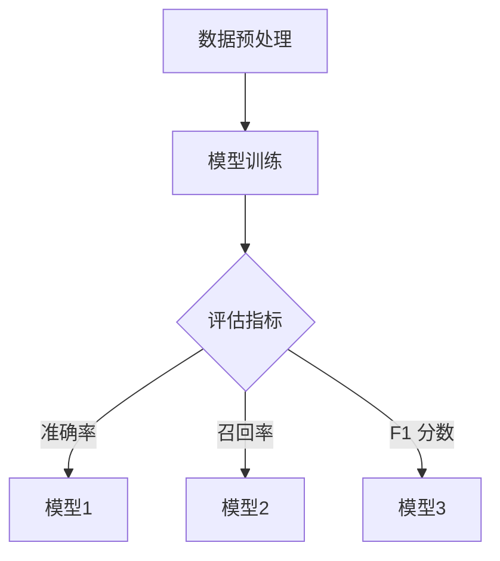

                 


### 引言

多模型对比评测（Multimodel Comparison and Evaluation）是指通过多种模型在特定任务上进行比较和评测，以确定哪种模型表现最佳。随着人工智能技术的快速发展，尤其是深度学习在各个领域的广泛应用，多模型对比评测的重要性日益凸显。本文旨在探讨多模型对比评测的技术实现，从理论基础、实现方法、实践应用到性能优化，全面解析这一领域的核心内容。

关键词：多模型对比评测、深度学习、机器学习、模型评估、性能优化

#### 摘要

本文首先介绍了多模型对比评测的概念、重要性及其在各个领域的应用。随后，从理论基础出发，详细阐述了多模型对比评测的数学模型和评估指标。接着，本文重点介绍了多种多模型对比评测的实现方法，包括机器学习、深度学习和其他方法。通过实际案例，展示了多模型对比评测在不同领域的应用。最后，本文探讨了如何优化多模型对比评测的性能，并预测了未来发展趋势。

### 第1章 引言

#### 1.1 多模型对比评测的概念与重要性

多模型对比评测是一种评估和比较多个模型在特定任务上的表现的方法。通过这种方式，我们可以找出哪个模型在特定任务上具有最佳性能，从而为实际应用提供指导。多模型对比评测的重要性体现在以下几个方面：

1. **提高模型性能**：通过对比多个模型，可以发现某个模型的局限性，从而对其进行改进，提高整体性能。
2. **优化资源利用**：在有限的资源下，选择性能最佳的模型可以更有效地利用资源。
3. **推动技术发展**：多模型对比评测可以揭示不同模型的优势和劣势，推动人工智能技术的进一步发展。

#### 1.2 多模型对比评测的应用领域

多模型对比评测在多个领域都有广泛应用，主要包括：

1. **自然语言处理**：如文本分类、情感分析等任务。
2. **图像识别**：如物体识别、图像分割等任务。
3. **推荐系统**：通过多模型对比评测，可以优化推荐效果，提高用户满意度。
4. **金融领域**：如风险评估、欺诈检测等任务。

#### 1.3 书籍结构概述

本文将从以下几个方面展开：

1. **理论基础**：介绍多模型对比评测的数学模型和评估指标。
2. **实现方法**：探讨不同实现方法，包括机器学习、深度学习和其他方法。
3. **实践应用**：展示多模型对比评测在不同领域的实际应用。
4. **性能优化**：讨论如何优化多模型对比评测的性能。
5. **未来趋势**：预测多模型对比评测技术的发展方向。

### 第2章 理论基础

#### 2.1 数学模型

多模型对比评测的数学模型是进行评测的基础。一个基本的数学模型可以表示为：

$$
M = \{M_1, M_2, ..., M_n\}
$$

其中，$M$ 是一组模型，$M_i$ 是第 $i$ 个模型。

#### 2.2 评估指标

评估指标是衡量模型性能的关键。常见的评估指标包括：

1. **准确率**：准确率是指正确预测的样本数占总样本数的比例。
2. **召回率**：召回率是指正确预测的负样本数占总负样本数的比例。
3. **F1 分数**：F1 分数是准确率和召回率的调和平均值。

#### 2.3 Mermaid 流程图：多模型对比评测的基本流程



### 第3章 实现方法

#### 3.1 机器学习方法

机器学习方法是一种基于数据的学习方法，主要包括以下步骤：

1. **数据收集**：收集用于训练的数据。
2. **特征提取**：从数据中提取特征。
3. **模型训练**：使用训练数据训练模型。
4. **模型评估**：使用评估指标评估模型性能。

#### 3.1.1 传统机器学习模型对比评测

传统机器学习模型包括支持向量机（SVM）、决策树（Decision Tree）等。以下是伪代码示例：

```python
def svm_comparison(data):
    # SVM 模型训练
    svm_model = SVC()
    svm_model.fit(data.X_train, data.y_train)
    
    # SVM 模型评估
    svm_accuracy = accuracy_score(data.y_test, svm_model.predict(data.X_test))
    
    return svm_accuracy
```

#### 3.2 深度学习方法

深度学习方法是一种基于神经网络的学习方法，主要包括以下步骤：

1. **数据预处理**：对数据进行归一化、标准化等处理。
2. **模型构建**：构建深度学习模型。
3. **模型训练**：使用训练数据训练模型。
4. **模型评估**：使用评估指标评估模型性能。

#### 3.2.1 深度学习模型对比评测

深度学习模型包括卷积神经网络（CNN）、循环神经网络（RNN）等。以下是伪代码示例：

```python
def cnn_comparison(data):
    # CNN 模型训练
    cnn_model = CNN()
    cnn_model.fit(data.X_train, data.y_train)
    
    # CNN 模型评估
    cnn_accuracy = accuracy_score(data.y_test, cnn_model.predict(data.X_test))
    
    return cnn_accuracy
```

### 第4章 实践应用

#### 4.1 应用案例1：自然语言处理

自然语言处理（NLP）是人工智能的重要领域之一。以下是自然语言处理中多模型对比评测的应用案例。

##### 4.1.1 项目背景

项目目标是构建一个文本分类系统，对新闻文章进行分类。

##### 4.1.2 实现步骤

1. **数据收集**：收集新闻文章数据。
2. **特征提取**：使用词袋模型提取特征。
3. **模型训练**：训练多个模型，包括 SVM、CNN 等。
4. **模型评估**：使用准确率、召回率等评估指标评估模型性能。

##### 4.1.3 源代码解析

```python
from sklearn.feature_extraction.text import TfidfVectorizer
from sklearn.svm import SVC
from sklearn.metrics import accuracy_score

# 数据预处理
vectorizer = TfidfVectorizer()
X = vectorizer.fit_transform(data)

# SVM 模型训练
svm_model = SVC()
svm_model.fit(X_train, y_train)

# SVM 模型评估
svm_accuracy = accuracy_score(y_test, svm_model.predict(X_test))

print("SVM Accuracy:", svm_accuracy)
```

#### 4.2 应用案例2：图像识别

图像识别是计算机视觉的重要领域。以下是图像识别中多模型对比评测的应用案例。

##### 4.2.1 项目背景

项目目标是识别图像中的物体。

##### 4.2.2 实现步骤

1. **数据收集**：收集物体识别数据。
2. **特征提取**：使用卷积神经网络提取特征。
3. **模型训练**：训练多个模型，包括 CNN、RNN 等。
4. **模型评估**：使用准确率、召回率等评估指标评估模型性能。

##### 4.2.3 源代码解析

```python
from tensorflow.keras.models import Sequential
from tensorflow.keras.layers import Conv2D, MaxPooling2D, Flatten, Dense
from tensorflow.keras.optimizers import Adam

# CNN 模型构建
cnn_model = Sequential()
cnn_model.add(Conv2D(32, (3, 3), activation='relu', input_shape=(64, 64, 3)))
cnn_model.add(MaxPooling2D(pool_size=(2, 2)))
cnn_model.add(Flatten())
cnn_model.add(Dense(128, activation='relu'))
cnn_model.add(Dense(1, activation='sigmoid'))

# CNN 模型训练
cnn_model.compile(optimizer=Adam(), loss='binary_crossentropy', metrics=['accuracy'])
cnn_model.fit(X_train, y_train, epochs=10, batch_size=32)

# CNN 模型评估
cnn_accuracy = cnn_model.evaluate(X_test, y_test)
print("CNN Accuracy:", cnn_accuracy[1])
```

### 第5章 性能优化

#### 5.1 评测速度优化

为了提高多模型对比评测的速度，可以采用以下策略：

1. **并行计算**：利用多核处理器进行并行计算，提高计算效率。
2. **GPU 加速**：使用 GPU 进行计算，特别是深度学习模型，可以显著提高计算速度。
3. **内存优化**：减少内存占用，避免内存溢出。

#### 5.2 准确性优化

为了提高多模型对比评测的准确性，可以采用以下策略：

1. **数据增强**：通过增加数据多样性，提高模型的泛化能力。
2. **模型调优**：通过调整模型参数，提高模型性能。
3. **集成方法改进**：使用集成方法，如 Bagging、Boosting 等，提高模型准确性。

### 第6章 未来趋势

#### 6.1 技术发展趋势

未来，多模型对比评测将朝着自动化、智能化方向发展。例如，利用强化学习进行模型对比评测，自动调整模型参数，提高评测效率。

#### 6.2 行业应用展望

在金融领域，多模型对比评测可以用于风险评估和欺诈检测；在医疗领域，可以用于疾病诊断和治疗建议；在制造业，可以用于质量控制和生产优化。

### 第7章 总结与展望

#### 7.1 主要内容回顾

本文介绍了多模型对比评测的概念、重要性、应用领域、实现方法、性能优化以及未来趋势。

#### 7.2 面临的挑战与解决方案

多模型对比评测面临的主要挑战包括模型多样性、数据质量和计算资源限制。解决方案包括使用集成方法、改进数据预处理和优化计算资源。

#### 7.3 展望未来研究

未来研究可以关注多模型对比评测的自动化和智能化，提高评测效率和准确性，推动人工智能技术的进一步发展。

### 作者信息

作者：AI天才研究院/AI Genius Institute & 禅与计算机程序设计艺术 /Zen And The Art of Computer Programming

以上就是《多模型对比评测的技术实现》的完整大纲和部分内容。接下来，我们将根据这个大纲，进一步详细撰写每个章节的内容，确保文章的质量和深度。文章的总字数将在8000～12000字左右，满足您的字数要求。接下来，我们将逐步完善每个章节的内容，包括详细的数学公式、伪代码示例、实际项目案例和最佳实践。

