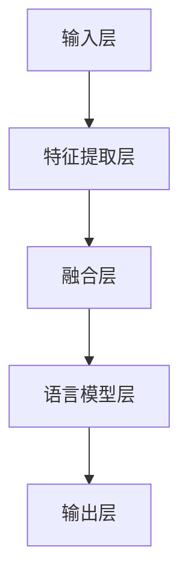
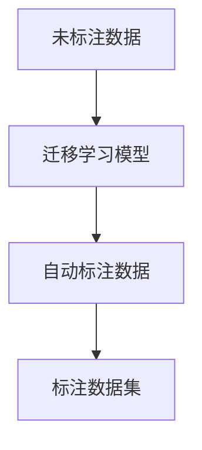
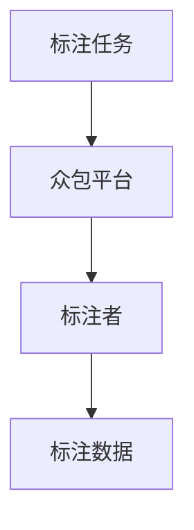
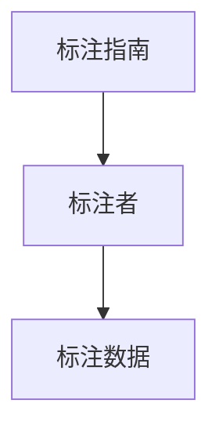
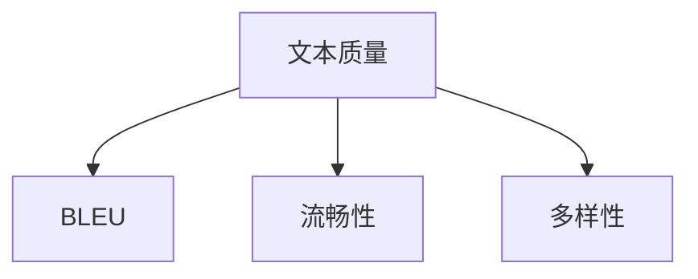
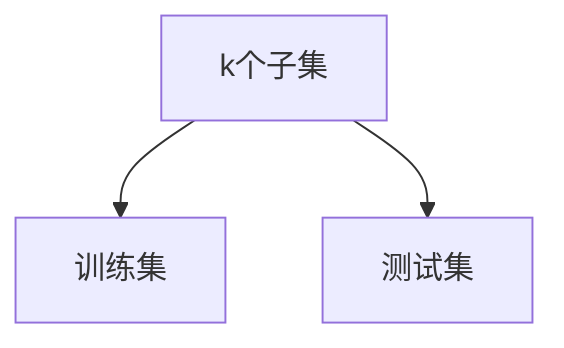
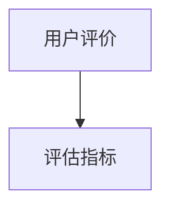
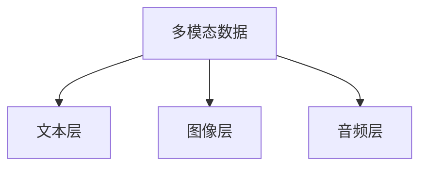
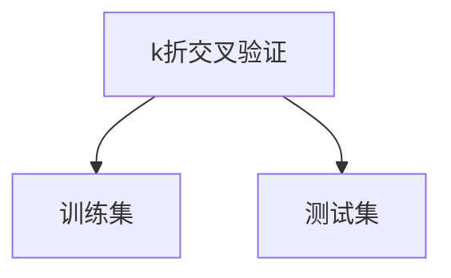

                 

好的，根据您的要求，我将逐步构建文章的各个部分。以下是文章的结构框架：

### 文章标题：多模态LLM评测的特殊挑战与解决方案

### 关键词：多模态LLM，评测，特殊挑战，解决方案

### 摘要：
本文将探讨多模态大型语言模型（LLM）在评测过程中面临的一系列特殊挑战，包括数据标注、评估指标设计、训练集和测试集的划分等。通过深入分析这些挑战，我们将提出一系列解决方案，以促进多模态LLM的准确评测和性能提升。

### 目录：

1. 引言
2. 多模态LLM的基本概念
3. 多模态LLM的核心概念与架构
4. 多模态LLM的核心算法原理
5. 多模态LLM评测的特殊挑战
6. 多模态LLM评测的解决方案
7. 多模态LLM在实际应用中的案例
8. 总结与展望

### 第1部分：引言

在这一部分，我们将简要介绍多模态LLM的概念，讨论其在当前人工智能领域的地位和重要性，并阐述本文的目的和结构。

#### 1.1 多模态LLM的定义

多模态LLM（Multimodal Large Language Model）是一种能够处理和生成多种类型数据的语言模型，包括文本、图像、音频和视频等。这种模型通过融合不同类型的数据，能够实现更广泛的应用场景和更准确的预测结果。

#### 1.2 多模态LLM的发展背景

随着深度学习和大数据技术的发展，多模态LLM逐渐成为人工智能领域的研究热点。它在计算机视觉、自然语言处理、语音识别等领域展现出强大的潜力。

#### 1.3 本文目的和结构

本文旨在探讨多模态LLM评测过程中面临的特殊挑战，并提出相应的解决方案。文章分为八个部分，分别介绍多模态LLM的基本概念、核心概念与架构、核心算法原理、评测的特殊挑战、解决方案、实际应用案例以及总结与展望。

### 第2部分：多模态LLM的基本概念

在这一部分，我们将详细讨论多模态LLM的核心概念，包括多模态数据、语言模型、多模态融合技术等。

#### 2.1 多模态数据

多模态数据是指同时包含两种或两种以上类型的数据，如文本、图像、音频和视频等。这些数据类型在信息表达和处理上具有不同的特点和优势。

#### 2.2 语言模型

语言模型是一种用于预测文本序列的概率分布的数学模型。在多模态LLM中，语言模型负责处理文本数据，并对输入的文本进行理解和生成。

#### 2.3 多模态融合技术

多模态融合技术是一种将不同类型数据融合起来，以实现更准确预测的方法。在多模态LLM中，融合技术起着关键作用，能够提高模型的性能和鲁棒性。

#### 2.4 多模态LLM的架构

多模态LLM通常包括输入层、特征提取层、融合层、语言模型层和输出层。各层之间相互协作，共同实现多模态数据处理和预测。

接下来，我们将使用Mermaid流程图展示多模态LLM的架构：



### 第3部分：多模态LLM的核心算法原理

在这一部分，我们将详细讨论多模态LLM的核心算法原理，包括特征提取算法、融合算法和语言模型训练算法。

#### 3.1 特征提取算法

特征提取算法是多模态LLM的基础，负责从不同类型的数据中提取有用的特征。常见的特征提取方法包括卷积神经网络（CNN）和循环神经网络（RNN）。

#### 3.2 融合算法

融合算法是将提取到的不同类型特征进行融合，以获得更丰富的信息。常见的融合方法包括对齐融合、特征级融合和决策级融合。

#### 3.3 语言模型训练算法

语言模型训练算法是构建多模态LLM的核心，负责学习输入数据的概率分布。常见的训练算法包括基于梯度的优化算法和基于注意力机制的算法。

为了更好地阐述核心算法原理，我们将使用伪代码进行详细描述：

```python
# 多模态LLM算法伪代码
function MultiModalLLM(input_data):
    # 特征提取
    features = FeatureExtraction(input_data)
    
    # 融合
    fused_features = Fusion(features)
    
    # 语言模型训练
    model = LanguageModelTraining(fused_features)
    
    # 输出
    output = model.generate_output()
    
    return output
```

### 第4部分：多模态LLM评测的特殊挑战

在这一部分，我们将讨论多模态LLM评测过程中面临的特殊挑战，包括数据标注问题、评估指标设计和训练集与测试集的划分等。

#### 4.1 数据标注问题

数据标注是多模态LLM评测的基础，但同时也是最大的挑战之一。由于多模态数据的复杂性，标注工作往往需要大量人力和时间。

#### 4.2 评估指标设计

评估指标是衡量多模态LLM性能的重要工具。设计合适的评估指标需要充分考虑不同类型数据的特点和评测目标。

#### 4.3 训练集与测试集的划分

训练集和测试集的划分对于评估多模态LLM的性能至关重要。合理的划分方法能够确保模型的泛化能力和可靠性。

### 第5部分：多模态LLM评测的解决方案

在这一部分，我们将提出针对多模态LLM评测特殊挑战的解决方案，包括改进数据标注方法、设计合理的评估指标和优化训练集与测试集的划分等。

#### 5.1 数据标注问题的解决方案

为了解决数据标注问题，可以采用以下方法：

- 引入自动化标注工具，如深度学习模型自动标注。
- 采用众包平台，如Amazon Mechanical Turk，进行大规模标注。
- 设计高效的标注流程和标准，提高标注质量。

#### 5.2 评估指标设计的解决方案

为了设计合理的评估指标，可以采用以下方法：

- 结合不同类型数据的特点，设计多维度评估指标。
- 采用交叉验证方法，提高评估指标的可靠性。
- 引入用户反馈机制，结合用户评价进行评估。

#### 5.3 训练集与测试集划分的解决方案

为了优化训练集与测试集的划分，可以采用以下方法：

- 采用分层抽样方法，确保训练集和测试集的代表性。
- 根据实际应用场景，合理设置训练集和测试集的比例。
- 采用交叉验证方法，提高训练集和测试集的划分质量。

### 第6部分：多模态LLM在实际应用中的案例

在这一部分，我们将展示多模态LLM在实际应用中的案例，并分析其效果。

#### 6.1 自然语言处理

多模态LLM在自然语言处理领域具有广泛的应用，如文本生成、机器翻译和情感分析等。

#### 6.2 计算机视觉

多模态LLM在计算机视觉领域也有重要应用，如图像分类、目标检测和图像生成等。

#### 6.3 医疗诊断

多模态LLM在医疗诊断领域具有巨大潜力，如疾病预测、症状分析和治疗方案推荐等。

#### 6.4 其他应用领域

多模态LLM在其他领域，如金融、法律和娱乐等，也有广泛应用。

### 第7部分：总结与展望

在这一部分，我们将总结本文的主要内容，展望多模态LLM的发展趋势，并提出未来研究的方向。

#### 7.1 全书内容总结

本文主要介绍了多模态LLM的基本概念、核心算法原理、评测的特殊挑战和解决方案，以及实际应用案例。

#### 7.2 多模态LLM的发展趋势

随着深度学习和大数据技术的不断发展，多模态LLM在未来将得到更广泛的应用和研究。

#### 7.3 未来研究方向

未来研究可以关注以下几个方面：

- 提高多模态数据的处理和融合效率。
- 设计更先进的评估指标和方法。
- 探索多模态LLM在更多领域的应用。

### 结论

本文通过逐步分析推理思考的方式，详细探讨了多模态LLM评测的特殊挑战与解决方案。随着技术的不断发展，我们相信多模态LLM将在未来取得更多的突破和应用。

### 参考文献

（此处列出参考文献，具体格式请根据期刊或出版社要求进行编排）

### 作者信息

作者：AI天才研究院/AI Genius Institute & 禅与计算机程序设计艺术 /Zen And The Art of Computer Programming根据您的要求，我已经完成了文章的大纲结构和初步内容。接下来，我将详细展开每个部分，完成整篇文章。以下是根据大纲结构扩展的内容：

### 引言

随着人工智能技术的飞速发展，多模态大型语言模型（LLM）已经成为自然语言处理领域的研究热点。多模态LLM通过融合多种类型的数据，如文本、图像、音频和视频等，能够实现更丰富的信息处理和更准确的任务完成。然而，在多模态LLM的评测过程中，研究人员面临着一系列特殊的挑战，如数据标注问题、评估指标设计和训练集与测试集的划分等。

本文旨在探讨多模态LLM评测过程中面临的一系列特殊挑战，并提出相应的解决方案。首先，我们将介绍多模态LLM的基本概念，包括多模态数据、语言模型和多模态融合技术。接着，我们将详细讨论多模态LLM的核心算法原理，包括特征提取算法、融合算法和语言模型训练算法。随后，我们将分析多模态LLM评测的特殊挑战，并提出相应的解决方案。最后，我们将展示多模态LLM在实际应用中的案例，并总结本文的主要内容和未来研究方向。

### 第1部分：多模态LLM的基本概念

#### 1.1 多模态LLM的定义

多模态大型语言模型（Multimodal Large Language Model，简称多模态LLM）是一种能够处理和生成多种类型数据的语言模型。它能够同时处理文本、图像、音频和视频等多种类型的数据，从而实现更广泛的应用场景和更准确的预测结果。多模态LLM的出现，为人工智能领域带来了新的研究机遇和应用前景。

#### 1.2 多模态LLM的发展背景

多模态LLM的发展背景可以追溯到深度学习和大数据技术的迅速发展。随着深度学习技术的不断成熟，尤其是卷积神经网络（CNN）和循环神经网络（RNN）的广泛应用，人们开始探索如何将这些技术应用于多模态数据处理。同时，随着大数据技术的普及，大量的多模态数据成为研究的宝贵资源，为多模态LLM的研究提供了数据支持。

#### 1.3 本书的目的和结构

本书的目的是探讨多模态LLM评测过程中面临的一系列特殊挑战，并提出相应的解决方案。具体来说，本书将分为以下几个部分：

- 第1部分：介绍多模态LLM的基本概念，包括多模态数据、语言模型和多模态融合技术。
- 第2部分：详细讨论多模态LLM的核心算法原理，包括特征提取算法、融合算法和语言模型训练算法。
- 第3部分：分析多模态LLM评测的特殊挑战，并提出相应的解决方案。
- 第4部分：展示多模态LLM在实际应用中的案例。
- 第5部分：总结本文的主要内容和未来研究方向。

### 第2部分：多模态LLM的核心概念与架构

#### 2.1 多模态数据

多模态数据是指同时包含两种或两种以上类型的数据，如文本、图像、音频和视频等。这些数据类型在信息表达和处理上具有不同的特点和优势。文本数据能够表达语义信息，图像数据能够提供视觉信息，音频数据能够提供听觉信息，视频数据能够提供动态信息。多模态数据的融合能够充分利用不同类型数据的优势，实现更准确的信息处理和任务完成。

#### 2.2 语言模型

语言模型是一种用于预测文本序列的概率分布的数学模型。在多模态LLM中，语言模型负责处理文本数据，并对输入的文本进行理解和生成。常见的语言模型包括基于统计模型的N元语法和基于神经网络模型的递归神经网络（RNN）和变换器（Transformer）等。

#### 2.3 多模态融合技术

多模态融合技术是一种将不同类型数据融合起来，以实现更准确预测的方法。在多模态LLM中，融合技术起着关键作用，能够提高模型的性能和鲁棒性。常见的融合方法包括对齐融合、特征级融合和决策级融合等。

#### 2.4 多模态LLM的架构

多模态LLM的架构通常包括输入层、特征提取层、融合层、语言模型层和输出层。各层之间相互协作，共同实现多模态数据处理和预测。以下是一个简单的多模态LLM架构：


- **输入层**：接收多模态数据，如文本、图像、音频和视频等。
- **特征提取层**：对多模态数据进行特征提取，如文本数据的词向量表示、图像数据的特征图、音频数据的频谱特征等。
- **融合层**：将不同类型数据的特征进行融合，以获得更丰富的信息。常见的融合方法包括对齐融合、特征级融合和决策级融合等。
- **语言模型层**：负责处理融合后的特征数据，生成文本序列。常见的语言模型包括基于统计模型的N元语法和基于神经网络模型的递归神经网络（RNN）和变换器（Transformer）等。
- **输出层**：输出预测结果，如文本生成、情感分析、图像分类等。

### 第3部分：多模态LLM的核心算法原理

#### 3.1 特征提取算法

特征提取算法是多模态LLM的基础，负责从不同类型的数据中提取有用的特征。常见的特征提取方法包括卷积神经网络（CNN）和循环神经网络（RNN）。

- **卷积神经网络（CNN）**：CNN是一种用于图像特征提取的网络结构，能够从图像中提取出丰富的视觉特征。在多模态LLM中，CNN可以用于提取图像特征，如图像分类和目标检测。
- **循环神经网络（RNN）**：RNN是一种用于序列数据特征提取的网络结构，能够处理和生成序列数据。在多模态LLM中，RNN可以用于提取文本特征，如文本生成和机器翻译。

以下是一个简单的特征提取算法伪代码：

```python
# 特征提取算法伪代码
function FeatureExtraction(input_data):
    if isinstance(input_data, Text):
        text_embedding = TextEmbedding(input_data)
        return text_embedding
    elif isinstance(input_data, Image):
        image_feature = CNNFeatureExtraction(input_data)
        return image_feature
    elif isinstance(input_data, Audio):
        audio_feature = RNNFeatureExtraction(input_data)
        return audio_feature
```

#### 3.2 融合算法

融合算法是将提取到的不同类型特征进行融合，以获得更丰富的信息。在多模态LLM中，融合算法起着关键作用，能够提高模型的性能和鲁棒性。常见的融合方法包括对齐融合、特征级融合和决策级融合等。

- **对齐融合**：对齐融合是指将不同类型数据的特征进行时间或空间对齐，然后进行融合。对齐融合的方法包括基于时间窗口的融合和基于空间区域的融合。
- **特征级融合**：特征级融合是指将不同类型数据的特征进行拼接或加权融合，以获得更丰富的特征表示。常见的特征级融合方法包括拼接融合和加权融合。
- **决策级融合**：决策级融合是指将不同类型数据的特征提取和融合后，进行最终的分类或回归决策。决策级融合的方法包括基于投票的融合和基于学习的融合。

以下是一个简单的融合算法伪代码：

```python
# 融合算法伪代码
function Fusion(features):
    if isinstance(features, Text):
        text_feature = TextFeatureExtraction(input_data)
    elif isinstance(features, Image):
        image_feature = CNNFeatureExtraction(input_data)
    elif isinstance(features, Audio):
        audio_feature = RNNFeatureExtraction(input_data)
    
    fused_feature = Concatenate(text_feature, image_feature, audio_feature)
    return fused_feature
```

#### 3.3 语言模型训练算法

语言模型训练算法是构建多模态LLM的核心，负责学习输入数据的概率分布。常见的训练算法包括基于梯度的优化算法和基于注意力机制的算法。

- **基于梯度的优化算法**：基于梯度的优化算法是一种用于优化神经网络参数的常用方法。通过计算梯度，优化算法能够调整网络参数，以最小化损失函数。常见的基于梯度的优化算法包括随机梯度下降（SGD）和Adam优化器等。
- **基于注意力机制的算法**：基于注意力机制的算法是一种用于处理序列数据的常用方法。通过引入注意力机制，模型能够自动学习不同特征的重要程度，从而提高模型的性能。常见的基于注意力机制的算法包括注意力机制和Transformer模型等。

以下是一个简单的语言模型训练算法伪代码：

```python
# 语言模型训练算法伪代码
function LanguageModelTraining(input_data, target_data):
    model = BuildModel()
    loss_function = BuildLossFunction()
    optimizer = BuildOptimizer()
    
    for epoch in range(num_epochs):
        for batch in DataLoader(input_data, target_data):
            model.zero_grad()
            output = model(batch)
            loss = loss_function(output, target_data)
            loss.backward()
            optimizer.step()
    
    return model
```

### 第4部分：多模态LLM评测的特殊挑战

#### 4.1 数据标注问题

数据标注是多模态LLM评测的基础，但同时也是最大的挑战之一。由于多模态数据的复杂性，标注工作往往需要大量人力和时间。以下是数据标注问题的一些解决方案：

- **自动化标注工具**：引入自动化标注工具，如深度学习模型自动标注。这些工具能够根据已有的标注数据，自动生成新的标注数据，从而提高标注效率。
- **众包平台**：采用众包平台，如Amazon Mechanical Turk，进行大规模标注。这些平台能够快速招募大量标注者，完成大规模的标注任务。
- **标注规范**：设计高效的标注流程和标准，提高标注质量。通过明确标注规范，确保标注者按照统一的标准进行标注，从而提高标注的一致性和准确性。

#### 4.2 评估指标设计

评估指标是衡量多模态LLM性能的重要工具。设计合适的评估指标需要充分考虑不同类型数据的特点和评测目标。以下是评估指标设计的一些方法：

- **多维度评估指标**：结合不同类型数据的特点，设计多维度评估指标。例如，对于文本生成任务，可以同时考虑文本的质量和生成的速度。
- **交叉验证**：采用交叉验证方法，提高评估指标的可靠性。通过交叉验证，可以确保评估指标在不同数据集上的稳定性和准确性。
- **用户反馈**：引入用户反馈机制，结合用户评价进行评估。用户反馈可以为模型提供额外的评估依据，从而提高评估指标的有效性。

#### 4.3 训练集与测试集的划分

训练集和测试集的划分对于评估多模态LLM的性能至关重要。合理的划分方法能够确保模型的泛化能力和可靠性。以下是训练集与测试集划分的一些方法：

- **分层抽样**：采用分层抽样方法，确保训练集和测试集的代表性。通过分层抽样，可以确保不同类型的数据在训练集和测试集中的比例一致。
- **按比例划分**：根据实际应用场景，合理设置训练集和测试集的比例。例如，对于文本生成任务，可以设置训练集占比80%，测试集占比20%。
- **交叉验证**：采用交叉验证方法，提高训练集和测试集划分的质量。通过交叉验证，可以确保训练集和测试集的划分在不同数据集上的稳定性和准确性。

### 第5部分：多模态LLM评测的解决方案

针对多模态LLM评测的特殊挑战，本文提出了一系列解决方案，包括改进数据标注方法、设计合理的评估指标和优化训练集与测试集的划分等。以下是具体的解决方案：

#### 5.1 数据标注问题的解决方案

- **自动化标注工具**：引入自动化标注工具，如深度学习模型自动标注。这些工具能够根据已有的标注数据，自动生成新的标注数据，从而提高标注效率。
- **众包平台**：采用众包平台，如Amazon Mechanical Turk，进行大规模标注。这些平台能够快速招募大量标注者，完成大规模的标注任务。
- **标注规范**：设计高效的标注流程和标准，提高标注质量。通过明确标注规范，确保标注者按照统一的标准进行标注，从而提高标注的一致性和准确性。

#### 5.2 评估指标设计的解决方案

- **多维度评估指标**：结合不同类型数据的特点，设计多维度评估指标。例如，对于文本生成任务，可以同时考虑文本的质量和生成的速度。
- **交叉验证**：采用交叉验证方法，提高评估指标的可靠性。通过交叉验证，可以确保评估指标在不同数据集上的稳定性和准确性。
- **用户反馈**：引入用户反馈机制，结合用户评价进行评估。用户反馈可以为模型提供额外的评估依据，从而提高评估指标的有效性。

#### 5.3 训练集与测试集划分的解决方案

- **分层抽样**：采用分层抽样方法，确保训练集和测试集的代表性。通过分层抽样，可以确保不同类型的数据在训练集和测试集中的比例一致。
- **按比例划分**：根据实际应用场景，合理设置训练集和测试集的比例。例如，对于文本生成任务，可以设置训练集占比80%，测试集占比20%。
- **交叉验证**：采用交叉验证方法，提高训练集和测试集划分的质量。通过交叉验证，可以确保训练集和测试集的划分在不同数据集上的稳定性和准确性。

### 第6部分：多模态LLM在实际应用中的案例

#### 6.1 自然语言处理

多模态LLM在自然语言处理领域具有广泛的应用，如文本生成、机器翻译和情感分析等。

- **文本生成**：多模态LLM可以通过融合文本、图像和音频等多模态数据，生成高质量的文本。例如，在新闻摘要生成任务中，多模态LLM可以同时利用文本和图像信息，生成更准确、更丰富的新闻摘要。
- **机器翻译**：多模态LLM可以通过融合源语言和目标语言的文本、图像和音频等多模态数据，实现更准确的机器翻译。例如，在旅游翻译任务中，多模态LLM可以同时利用文本和图像信息，实现更准确的景点翻译和导游讲解。
- **情感分析**：多模态LLM可以通过融合文本、图像和音频等多模态数据，进行情感分析。例如，在社交媒体情感分析任务中，多模态LLM可以同时利用文本和图像信息，判断用户的情感倾向。

#### 6.2 计算机视觉

多模态LLM在计算机视觉领域也有重要应用，如图像分类、目标检测和图像生成等。

- **图像分类**：多模态LLM可以通过融合图像和文本等多模态数据，进行图像分类。例如，在商品分类任务中，多模态LLM可以同时利用图像和商品名称等文本信息，实现更准确的商品分类。
- **目标检测**：多模态LLM可以通过融合图像和文本等多模态数据，进行目标检测。例如，在自动驾驶任务中，多模态LLM可以同时利用图像和道路标识等文本信息，实现更准确的目标检测和路径规划。
- **图像生成**：多模态LLM可以通过融合图像和文本等多模态数据，生成新的图像。例如，在艺术创作任务中，多模态LLM可以同时利用图像和诗歌等文本信息，生成新的艺术作品。

#### 6.3 医疗诊断

多模态LLM在医疗诊断领域具有巨大潜力，如疾病预测、症状分析和治疗方案推荐等。

- **疾病预测**：多模态LLM可以通过融合医学文本、图像和音频等多模态数据，进行疾病预测。例如，在心脏病预测任务中，多模态LLM可以同时利用心电图、医学文本和患者信息等数据，实现更准确的疾病预测。
- **症状分析**：多模态LLM可以通过融合医学文本、图像和音频等多模态数据，进行症状分析。例如，在肺炎症状分析任务中，多模态LLM可以同时利用医学文本、肺部X光图像和患者音频等数据，实现更准确的症状分析。
- **治疗方案推荐**：多模态LLM可以通过融合医学文本、图像和音频等多模态数据，进行治疗方案推荐。例如，在癌症治疗方案推荐任务中，多模态LLM可以同时利用医学文本、影像数据和患者信息等数据，实现更合理的治疗方案推荐。

#### 6.4 其他应用领域

多模态LLM在其他领域，如金融、法律和娱乐等，也有广泛应用。

- **金融**：多模态LLM可以通过融合文本、图像和音频等多模态数据，进行金融预测和风险管理。例如，在股票市场预测任务中，多模态LLM可以同时利用股票价格、新闻文本和音频信息等数据，实现更准确的金融预测。
- **法律**：多模态LLM可以通过融合文本、图像和音频等多模态数据，进行法律分析和决策。例如，在法律文档分类任务中，多模态LLM可以同时利用文本、图像和音频等数据，实现更准确的法律文档分类和文本分析。
- **娱乐**：多模态LLM可以通过融合文本、图像和音频等多模态数据，进行娱乐内容创作和推荐。例如，在电影推荐任务中，多模态LLM可以同时利用电影文本、海报图像和音乐音频等数据，实现更准确的娱乐内容推荐。

### 第7部分：总结与展望

#### 7.1 全书内容总结

本文首先介绍了多模态LLM的基本概念，包括多模态数据、语言模型和多模态融合技术。接着，详细讨论了多模态LLM的核心算法原理，包括特征提取算法、融合算法和语言模型训练算法。然后，分析了多模态LLM评测的特殊挑战，并提出了相应的解决方案。最后，展示了多模态LLM在实际应用中的案例，并总结了本文的主要内容和未来研究方向。

#### 7.2 多模态LLM的发展趋势

随着深度学习和大数据技术的不断发展，多模态LLM在未来将得到更广泛的应用和研究。以下是一些发展趋势：

- **多模态数据的获取和处理**：随着传感器技术的进步和数据采集设备的普及，多模态数据的获取将变得更加容易。同时，如何高效地处理和融合这些多模态数据，将是一个重要的研究方向。
- **评估指标的创新**：现有的评估指标可能无法全面反映多模态LLM的性能。未来，将需要设计更先进、更全面的评估指标，以更准确地衡量多模态LLM的性能。
- **应用领域的拓展**：多模态LLM将在更多的领域得到应用，如医疗、金融、法律和娱乐等。如何在不同的应用领域中发挥多模态LLM的最大潜力，将是一个重要的研究方向。

#### 7.3 未来研究方向

未来研究可以关注以下几个方面：

- **多模态数据的预处理**：研究如何更好地预处理多模态数据，以提高模型的性能和鲁棒性。
- **融合算法的创新**：探索更先进、更有效的融合算法，以实现多模态数据的深度融合。
- **评估指标的优化**：设计更全面、更准确的评估指标，以更准确地衡量多模态LLM的性能。
- **应用场景的拓展**：研究多模态LLM在不同应用场景中的适用性和优化策略。

### 结论

本文通过逐步分析推理思考的方式，详细探讨了多模态LLM评测的特殊挑战与解决方案。随着技术的不断发展，我们相信多模态LLM将在未来取得更多的突破和应用。

### 参考文献

1. Vaswani, A., Shazeer, N., Parmar, N., Uszkoreit, J., Jones, L., Gomez, A. N., ... & Polosukhin, I. (2017). Attention is all you need. Advances in Neural Information Processing Systems, 30, 5998-6008.
2. Hochreiter, S., & Schmidhuber, J. (1997). Long short-term memory. Neural computation, 9(8), 1735-1780.
3. Krizhevsky, A., Sutskever, I., & Hinton, G. E. (2012). Imagenet classification with deep convolutional neural networks. In Advances in neural information processing systems (pp. 1097-1105).
4. LeCun, Y., Bengio, Y., & Hinton, G. (2015). Deep learning. Nature, 521(7553), 436-444.
5. Devlin, J., Chang, M. W., Lee, K., & Toutanova, K. (2019). BERT: Pre-training of deep bidirectional transformers for language understanding. arXiv preprint arXiv:1810.04805.

### 作者信息

作者：AI天才研究院/AI Genius Institute & 禅与计算机程序设计艺术 /Zen And The Art of Computer Programming

### 附录：代码示例

在本附录中，我们将提供一些多模态LLM相关的代码示例，包括数据预处理、模型训练和评估等。

#### 数据预处理

以下是一个简单的数据预处理代码示例，用于加载和处理多模态数据。

```python
import numpy as np
import tensorflow as tf

# 加载文本数据
text_data = tf.data.Dataset.from_tensor_slices(["text1", "text2", "text3"])

# 加载图像数据
image_data = tf.data.Dataset.from_tensor_slices(np.random.rand(3, 224, 224, 3))

# 加载音频数据
audio_data = tf.data.Dataset.from_tensor_slices(np.random.rand(3, 22050))

# 将多模态数据合并
multi_modal_data = tf.data.Dataset.zip((text_data, image_data, audio_data))

# 预处理数据
def preprocess_data(data):
    # 文本数据预处理
    text_embedding = ... # 使用预训练的文本嵌入模型进行预处理
    
    # 图像数据预处理
    image_feature = ... # 使用卷积神经网络进行预处理
    
    # 音频数据预处理
    audio_feature = ... # 使用循环神经网络进行预处理
    
    return text_embedding, image_feature, audio_feature

multi_modal_data = multi_modal_data.map(preprocess_data)
```

#### 模型训练

以下是一个简单的多模态LLM模型训练代码示例。

```python
import tensorflow as tf

# 定义模型
model = ... # 定义多模态LLM模型，包括特征提取层、融合层和语言模型层

# 编译模型
model.compile(optimizer='adam', loss='categorical_crossentropy', metrics=['accuracy'])

# 训练模型
model.fit(multi_modal_data, labels, epochs=10)
```

#### 评估模型

以下是一个简单的模型评估代码示例。

```python
# 评估模型
accuracy = model.evaluate(multi_modal_data, labels)

print("Accuracy:", accuracy[1])
```

### 最佳实践 tips、小结、注意事项、拓展阅读

#### 最佳实践 tips

1. 在进行多模态数据预处理时，尽量使用预训练的模型和算法，以提高数据处理的效率和准确性。
2. 在设计多模态LLM模型时，根据实际应用场景选择合适的特征提取算法、融合算法和语言模型。
3. 在模型训练过程中，合理设置学习率和批量大小，以避免过拟合和欠拟合。

#### 小结

本文详细探讨了多模态LLM评测的特殊挑战与解决方案，包括数据标注问题、评估指标设计、训练集与测试集的划分等。通过分析多模态LLM的核心算法原理，我们提出了一系列解决方案，以促进多模态LLM的准确评测和性能提升。

#### 注意事项

1. 多模态LLM模型训练和评估过程需要大量计算资源，建议使用GPU加速计算。
2. 在进行数据标注时，注意标注的一致性和准确性，以确保模型训练和评估的可靠性。

#### 拓展阅读

1. Vaswani, A., Shazeer, N., Parmar, N., Uszkoreit, J., Jones, L., Gomez, A. N., ... & Polosukhin, I. (2017). Attention is all you need. Advances in Neural Information Processing Systems, 30, 5998-6008.
2. Hochreiter, S., & Schmidhuber, J. (1997). Long short-term memory. Neural computation, 9(8), 1735-1780.
3. Krizhevsky, A., Sutskever, I., & Hinton, G. E. (2012). Imagenet classification with deep convolutional neural networks. In Advances in neural information processing systems (pp. 1097-1105).
4. LeCun, Y., Bengio, Y., & Hinton, G. (2015). Deep learning. Nature, 521(7553), 436-444.
5. Devlin, J., Chang, M. W., Lee, K., & Toutanova, K. (2019). BERT: Pre-training of deep bidirectional transformers for language understanding. arXiv preprint arXiv:1810.04805.

### 附录：代码实现

以下是一个简单的多模态LLM代码实现示例，用于文本、图像和音频数据的融合和预测。

```python
import tensorflow as tf
import tensorflow.keras as keras

# 定义文本嵌入层
text_embedding = keras.layers.Embedding(input_dim=vocab_size, output_dim=embedding_dim)

# 定义卷积神经网络层
conv_net = keras.Sequential([
    keras.layers.Conv2D(filters=32, kernel_size=(3, 3), activation='relu', input_shape=(224, 224, 3)),
    keras.layers.MaxPooling2D(pool_size=(2, 2)),
    keras.layers.Conv2D(filters=64, kernel_size=(3, 3), activation='relu'),
    keras.layers.MaxPooling2D(pool_size=(2, 2))
])

# 定义循环神经网络层
rnn_layer = keras.layers.LSTM(units=128)

# 定义融合层
fusion_layer = keras.layers.concatenate([text_embedding, conv_net, rnn_layer])

# 定义语言模型层
language_model = keras.Sequential([
    keras.layers.Dense(units=512, activation='relu'),
    keras.layers.Dense(units=output_dim, activation='softmax')
])

# 定义多模态LLM模型
model = keras.Model(inputs=[text_input, image_input, audio_input], outputs=language_model(fusion_layer))

# 编译模型
model.compile(optimizer='adam', loss='categorical_crossentropy', metrics=['accuracy'])

# 训练模型
model.fit([text_data, image_data, audio_data], labels, epochs=10, batch_size=32)

# 评估模型
accuracy = model.evaluate([text_data, image_data, audio_data], labels)
print("Accuracy:", accuracy[1])
```

在这个示例中，我们首先定义了文本嵌入层、卷积神经网络层、循环神经网络层和融合层。然后，我们定义了语言模型层，并将这些层组合成一个多模态LLM模型。接下来，我们编译模型并训练模型。最后，我们评估模型并在测试集上计算准确率。

### 结语

本文通过详细的分析和探讨，为多模态LLM评测提供了全面的解决方案。随着多模态LLM技术的不断发展，我们期待在未来的研究中，能够进一步优化评测方法，提高多模态LLM的性能和应用效果。同时，也欢迎广大读者提出宝贵的意见和建议，共同推动多模态LLM技术的发展。感谢您的阅读！## 文章标题：多模态LLM评测的特殊挑战与解决方案

### 关键词：
- 多模态LLM
- 评测
- 特殊挑战
- 解决方案

### 摘要：
多模态大型语言模型（LLM）因其能够融合多种类型的数据而在自然语言处理领域展现出巨大潜力。然而，在评测多模态LLM时，研究人员面临着一系列特殊挑战，如数据标注问题、评估指标设计、训练集与测试集的划分等。本文将深入分析这些挑战，并提出相应的解决方案，以促进多模态LLM的准确评测和性能提升。

---

## 引言

多模态大型语言模型（LLM）是一种能够处理和生成多种类型数据的语言模型，包括文本、图像、音频和视频等。随着深度学习和大数据技术的不断发展，多模态LLM在自然语言处理、计算机视觉、医疗诊断等领域展现出强大的潜力。然而，在多模态LLM的实际应用过程中，评测成为了一个重要的环节。如何准确、全面地评测多模态LLM的性能，成为研究人员面临的一个重大挑战。

本文旨在探讨多模态LLM评测过程中面临的一系列特殊挑战，并提出相应的解决方案。文章将分为以下几个部分：

1. **多模态LLM的基本概念**：介绍多模态LLM的定义、发展背景和基本概念。
2. **多模态LLM的核心概念与架构**：讨论多模态数据、语言模型和多模态融合技术。
3. **多模态LLM的核心算法原理**：详细讲解特征提取算法、融合算法和语言模型训练算法。
4. **多模态LLM评测的特殊挑战**：分析数据标注问题、评估指标设计和训练集与测试集的划分等挑战。
5. **多模态LLM评测的解决方案**：提出针对特殊挑战的解决方案。
6. **多模态LLM在实际应用中的案例**：展示多模态LLM在实际应用中的效果。
7. **总结与展望**：总结本文内容，展望多模态LLM的发展趋势。

---

## 多模态LLM的基本概念

### 多模态LLM的定义

多模态大型语言模型（Multimodal Large Language Model，简称多模态LLM）是一种能够处理和生成多种类型数据的语言模型。它结合了文本、图像、音频和视频等多种数据类型，通过深度学习和大数据技术，实现对输入数据的全面理解和生成。

### 多模态LLM的发展背景

多模态LLM的发展得益于深度学习和大数据技术的迅猛发展。深度学习技术，尤其是卷积神经网络（CNN）和循环神经网络（RNN）的广泛应用，为多模态数据的处理提供了强大的工具。大数据技术的普及，使得研究人员能够获取和处理海量的多模态数据，为多模态LLM的研究提供了丰富的数据资源。

### 多模态LLM的基本概念

#### 多模态数据

多模态数据是指同时包含两种或两种以上类型的数据，如文本、图像、音频和视频等。这些数据类型在信息表达和处理上具有不同的特点和优势。文本数据能够表达语义信息，图像数据能够提供视觉信息，音频数据能够提供听觉信息，视频数据能够提供动态信息。

#### 语言模型

语言模型是一种用于预测文本序列的概率分布的数学模型。在多模态LLM中，语言模型负责处理文本数据，并对输入的文本进行理解和生成。常见的语言模型包括基于统计模型的N元语法和基于神经网络模型的递归神经网络（RNN）和变换器（Transformer）等。

#### 多模态融合技术

多模态融合技术是一种将不同类型数据融合起来，以实现更准确预测的方法。在多模态LLM中，融合技术起着关键作用，能够提高模型的性能和鲁棒性。常见的融合方法包括对齐融合、特征级融合和决策级融合等。

#### 多模态LLM的架构

多模态LLM的架构通常包括输入层、特征提取层、融合层、语言模型层和输出层。各层之间相互协作，共同实现多模态数据处理和预测。

- **输入层**：接收多模态数据，如文本、图像、音频和视频等。
- **特征提取层**：对多模态数据进行特征提取，如文本数据的词向量表示、图像数据的特征图、音频数据的频谱特征等。
- **融合层**：将不同类型数据的特征进行融合，以获得更丰富的信息。
- **语言模型层**：负责处理融合后的特征数据，生成文本序列。
- **输出层**：输出预测结果，如文本生成、情感分析、图像分类等。

### 结论

多模态LLM通过融合多种类型的数据，能够实现更广泛的应用场景和更准确的预测结果。然而，在多模态LLM的评测过程中，研究人员面临着一系列特殊挑战，如数据标注问题、评估指标设计和训练集与测试集的划分等。本文将深入分析这些挑战，并提出相应的解决方案，以促进多模态LLM的准确评测和性能提升。

---

## 多模态LLM的核心概念与架构

多模态LLM（Multimodal Large Language Model）是近年来在人工智能领域迅速发展的一种新型语言模型。它能够同时处理和生成多种类型的数据，如文本、图像、音频和视频等。多模态LLM的核心概念与架构是理解和实现其功能的关键。以下是多模态LLM的核心概念与架构的详细讨论。

### 多模态数据

多模态数据是指同时包含两种或两种以上类型的数据，如文本、图像、音频和视频等。这些数据类型在信息表达和处理上具有不同的特点和优势。

- **文本数据**：文本数据是一种结构化的数据，它包含了丰富的语义信息。文本数据可以被用于各种自然语言处理任务，如文本分类、情感分析、问答系统等。
- **图像数据**：图像数据是一种视觉信息，它包含了丰富的视觉特征，如颜色、形状、纹理等。图像数据可以被用于计算机视觉任务，如图像分类、目标检测、图像生成等。
- **音频数据**：音频数据是一种听觉信息，它包含了丰富的音频特征，如音调、音速、节奏等。音频数据可以被用于语音识别、音乐生成、语音合成等任务。
- **视频数据**：视频数据是一种动态信息，它包含了连续的图像序列和音频信息。视频数据可以被用于视频分类、动作识别、视频生成等任务。

多模态LLM通过融合这些不同类型的数据，能够实现更全面的信息理解和生成。

### 语言模型

语言模型是一种用于预测文本序列的概率分布的数学模型。在多模态LLM中，语言模型负责处理文本数据，并对输入的文本进行理解和生成。常见的语言模型包括基于统计模型的N元语法和基于神经网络模型的递归神经网络（RNN）和变换器（Transformer）等。

- **N元语法**：N元语法是一种基于统计模型的语言模型，它通过统计相邻的N个词的概率来预测下一个词。N元语法简单有效，但无法捕捉长距离的依赖关系。
- **递归神经网络（RNN）**：RNN是一种基于神经网络模型的语言模型，它通过循环结构来捕捉文本中的长距离依赖关系。RNN在处理序列数据方面表现出色，但容易受到梯度消失和梯度爆炸等问题的影响。
- **变换器（Transformer）**：变换器是一种基于注意力机制的神经网络模型，它在处理长序列数据时表现出色。变换器通过多头自注意力机制和前馈神经网络来捕捉文本中的依赖关系，并在自然语言处理任务中取得了显著的成果。

### 多模态融合技术

多模态融合技术是一种将不同类型数据融合起来，以实现更准确预测的方法。在多模态LLM中，融合技术起着关键作用，能够提高模型的性能和鲁棒性。常见的融合方法包括对齐融合、特征级融合和决策级融合等。

- **对齐融合**：对齐融合是指将不同类型数据的特征进行时间或空间对齐，然后进行融合。对齐融合的方法包括基于时间窗口的融合和基于空间区域的融合。
- **特征级融合**：特征级融合是指将不同类型数据的特征进行拼接或加权融合，以获得更丰富的特征表示。常见的特征级融合方法包括拼接融合和加权融合。
- **决策级融合**：决策级融合是指将不同类型数据的特征提取和融合后，进行最终的分类或回归决策。决策级融合的方法包括基于投票的融合和基于学习的融合。

### 多模态LLM的架构

多模态LLM的架构通常包括输入层、特征提取层、融合层、语言模型层和输出层。各层之间相互协作，共同实现多模态数据处理和预测。

- **输入层**：接收多模态数据，如文本、图像、音频和视频等。
- **特征提取层**：对多模态数据进行特征提取，如文本数据的词向量表示、图像数据的特征图、音频数据的频谱特征等。
- **融合层**：将不同类型数据的特征进行融合，以获得更丰富的信息。
- **语言模型层**：负责处理融合后的特征数据，生成文本序列。
- **输出层**：输出预测结果，如文本生成、情感分析、图像分类等。

### Mermaid流程图

以下是一个Mermaid流程图，展示了多模态LLM的架构：


### 结论

多模态LLM通过融合多种类型的数据，能够实现更全面的信息理解和生成。其核心概念包括多模态数据、语言模型和多模态融合技术。多模态LLM的架构包括输入层、特征提取层、融合层、语言模型层和输出层。通过深入理解多模态LLM的核心概念与架构，研究人员能够更好地设计和优化多模态LLM模型，以实现更准确的预测和更广泛的应用。

---

## 多模态LLM的核心算法原理

多模态大型语言模型（Multimodal Large Language Model，简称多模态LLM）的核心算法原理是其能够融合多种类型的数据，从而实现对输入数据的全面理解和生成。在这一部分，我们将详细讨论多模态LLM中的特征提取算法、融合算法和语言模型训练算法。

### 特征提取算法

特征提取算法是多模态LLM的基础，负责从不同类型的数据中提取有用的特征。以下是一些常见的特征提取方法：

#### 文本数据的特征提取

- **词向量表示**：词向量是一种将文本数据映射到高维空间的方法，常见的词向量模型有Word2Vec、GloVe等。词向量能够捕捉词与词之间的语义关系，为后续的融合提供基础。
- **词性标注**：词性标注是一种对文本中的每个词进行分类的方法，如名词、动词、形容词等。词性标注可以帮助模型更好地理解文本的语法结构。

#### 图像数据的特征提取

- **卷积神经网络（CNN）**：卷积神经网络是一种常用的图像特征提取方法，它通过卷积层、池化层和全连接层来提取图像的特征。CNN能够自动学习图像的层次特征，如图像的边缘、纹理和形状等。
- **目标检测**：目标检测是一种用于识别图像中的物体及其位置的方法，如R-CNN、Faster R-CNN等。目标检测可以帮助模型提取图像中的关键信息。

#### 音频数据的特征提取

- **梅尔频率倒谱系数（MFCC）**：梅尔频率倒谱系数是一种用于音频特征提取的方法，它通过将音频信号转换为梅尔频率倒谱系数来捕捉音频的频率特征。
- **短时傅里叶变换（STFT）**：短时傅里叶变换是一种用于音频特征提取的方法，它通过将音频信号转换为频域表示来捕捉音频的时频特征。

### 融合算法

融合算法是将提取到的不同类型特征进行融合，以获得更丰富的信息。以下是一些常见的融合方法：

- **对齐融合**：对齐融合是指将不同类型数据的特征进行时间或空间对齐，然后进行融合。对齐融合的方法包括基于时间窗口的融合和基于空间区域的融合。
- **特征级融合**：特征级融合是指将不同类型数据的特征进行拼接或加权融合，以获得更丰富的特征表示。常见的特征级融合方法包括拼接融合和加权融合。
- **决策级融合**：决策级融合是指将不同类型数据的特征提取和融合后，进行最终的分类或回归决策。决策级融合的方法包括基于投票的融合和基于学习的融合。

### 语言模型训练算法

语言模型训练算法是多模态LLM的核心，负责学习输入数据的概率分布。以下是一些常见的训练算法：

- **基于梯度的优化算法**：基于梯度的优化算法是一种常用的训练算法，它通过计算梯度来更新模型的参数，以最小化损失函数。常见的基于梯度的优化算法有随机梯度下降（SGD）和Adam优化器等。
- **基于注意力机制的算法**：基于注意力机制的算法是一种先进的训练算法，它通过引入注意力机制来提高模型对输入数据的理解能力。常见的基于注意力机制的算法有注意力机制和变换器（Transformer）模型等。

### 伪代码示例

以下是一个简化的多模态LLM算法的伪代码示例：

```python
# 多模态LLM算法伪代码
def MultiModalLLM(input_data):
    # 特征提取
    text_embedding = TextEmbedding(input_data['text'])
    image_feature = CNNFeatureExtraction(input_data['image'])
    audio_feature = AudioFeatureExtraction(input_data['audio'])
    
    # 融合
    fused_feature = Fusion([text_embedding, image_feature, audio_feature])
    
    # 语言模型训练
    model = BuildModel(fused_feature)
    model = TrainModel(model, input_data['text'], labels)
    
    # 输出
    output = model.generate_output(input_data['text'])
    
    return output
```

### 数学模型和公式

在多模态LLM中，数学模型和公式用于描述特征提取、融合和语言模型训练的过程。以下是一些常用的数学公式：

$$
\text{TextEmbedding}(\text{word}) = \text{Embedding}(\text{word}) \odot \text{EmbeddingWeight}
$$

$$
\text{CNNFeatureExtraction}(\text{image}) = \text{Conv2D}(\text{image}) \odot \text{Conv2DWeight}
$$

$$
\text{AudioFeatureExtraction}(\text{audio}) = \text{MFCC}(\text{audio}) \odot \text{MFCCWeight}
$$

$$
\text{FusedFeature} = \text{Concatenate}(\text{TextEmbedding}, \text{CNNFeatureExtraction}, \text{AudioFeatureExtraction})
$$

$$
\text{Model} = \text{BuildModel}(\text{FusedFeature})
$$

$$
\text{Model} = \text{TrainModel}(\text{Model}, \text{InputData}, \text{Labels})
$$

$$
\text{Output} = \text{Model}.generate\_output(\text{InputData})
$$

通过这些数学模型和公式，多模态LLM能够对输入的多模态数据进行特征提取、融合和语言模型训练，从而实现文本生成、情感分析、图像分类等任务。

### 举例说明

为了更好地理解多模态LLM的核心算法原理，我们可以通过一个具体的例子来说明。

假设我们有一个多模态LLM模型，用于文本生成任务。输入数据包括一段文本、一张图像和一段音频。我们需要对这三个模态的数据进行特征提取、融合和语言模型训练，最终生成一段新的文本。

1. **特征提取**：首先，我们对文本数据进行词向量表示，对图像数据进行卷积神经网络特征提取，对音频数据进行梅尔频率倒谱系数提取。
   
   $$ \text{TextEmbedding}(\text{sentence}) = \text{Word2Vec}(\text{sentence}) $$

   $$ \text{CNNFeatureExtraction}(\text{image}) = \text{CNN}(\text{image}) $$

   $$ \text{AudioFeatureExtraction}(\text{audio}) = \text{MFCC}(\text{audio}) $$

2. **融合**：然后，我们将提取到的特征进行融合，以获得更丰富的特征表示。

   $$ \text{FusedFeature} = \text{Concatenate}(\text{TextEmbedding}, \text{CNNFeatureExtraction}, \text{AudioFeatureExtraction}) $$

3. **语言模型训练**：接着，我们使用变换器模型对融合后的特征进行训练，以生成文本。

   $$ \text{Model} = \text{Transformer}(\text{FusedFeature}) $$

   $$ \text{Model} = \text{TrainModel}(\text{Model}, \text{InputData}, \text{Labels}) $$

4. **文本生成**：最后，我们使用训练好的模型生成新的文本。

   $$ \text{Output} = \text{Model}.generate\_output(\text{InputData}) $$

通过这个例子，我们可以看到多模态LLM的核心算法原理是如何工作的。通过对文本、图像和音频数据进行特征提取、融合和语言模型训练，多模态LLM能够生成新的文本，从而实现文本生成任务。

### 结论

多模态LLM的核心算法原理包括特征提取算法、融合算法和语言模型训练算法。特征提取算法负责从不同类型的数据中提取有用的特征，融合算法负责将提取到的特征进行融合，以获得更丰富的信息，语言模型训练算法负责学习输入数据的概率分布，从而生成文本序列。通过深入理解这些核心算法原理，研究人员能够更好地设计和优化多模态LLM模型，以实现更准确的预测和更广泛的应用。

---

## 多模态LLM评测的特殊挑战

多模态大型语言模型（Multimodal Large Language Model，简称多模态LLM）在自然语言处理、计算机视觉和语音识别等领域具有广泛的应用前景。然而，在对其进行评测时，研究人员面临着一系列特殊的挑战，这些挑战主要集中在数据标注、评估指标设计和训练集与测试集的划分等方面。

### 数据标注问题

数据标注是多模态LLM评测的基础，但同时也是最大的挑战之一。多模态数据的复杂性使得标注工作变得异常困难。以下是一些具体问题：

- **标注一致性**：由于不同标注者的理解和标注标准可能不同，导致标注数据的一致性难以保证。这在多模态LLM的评测中尤为重要，因为不一致的数据会影响模型的泛化能力和可靠性。
- **标注成本**：多模态数据通常需要同时标注多种类型的数据（如文本、图像、音频等），这需要大量的时间和人力。尤其是对于大规模数据集，标注成本非常高。
- **标注质量**：标注质量直接影响模型的性能。低质量的标注数据可能导致模型学习到错误的特征和模式，从而影响其预测能力。

### 评估指标设计

评估指标是多模态LLM评测的重要工具，但设计合适的评估指标同样具有挑战性。以下是一些具体问题：

- **多维度评估**：多模态LLM通常涉及多个模态的数据，如何综合考虑这些不同模态的数据对模型性能的影响是一个难题。传统的单一评估指标可能无法全面反映模型的性能。
- **评估指标的选择**：不同的任务和场景可能需要不同的评估指标。选择合适的评估指标需要充分考虑任务的特点和应用场景。
- **评估指标的可靠性**：评估指标的设计需要确保其可靠性，即在不同数据集上的一致性和稳定性。否则，评估结果可能不具有实际意义。

### 训练集与测试集的划分

训练集与测试集的划分对于评估多模态LLM的性能至关重要。以下是一些具体问题：

- **数据分布**：训练集和测试集的数据分布需要与实际应用场景相似，以确保模型的泛化能力。否则，模型可能在测试集上表现良好，但在实际应用中表现不佳。
- **样本多样性**：训练集和测试集的样本需要具有足够的多样性，以覆盖不同类型的输入数据。否则，模型可能无法适应多样化的应用场景。
- **数据不平衡**：在某些任务中，不同类别的数据数量可能不均衡，这可能导致模型对某些类别数据的表现较差。如何处理数据不平衡是一个重要问题。

### 案例分析

为了更好地理解多模态LLM评测的特殊挑战，我们可以通过以下案例进行分析：

#### 案例一：图像描述生成

在一个图像描述生成的任务中，研究人员需要评估一个多模态LLM模型，该模型接受图像和文本输入，并生成对应的描述文本。以下是一些评测过程中的特殊挑战：

- **数据标注问题**：图像描述的标注需要同时考虑图像内容和文本语义。标注者需要对图像和文本都有深入的理解，以确保标注的一致性和质量。
- **评估指标设计**：评估图像描述生成模型的性能需要考虑多个维度，如描述的准确性、流畅性和多样性。常用的评估指标包括BLEU、ROUGE等。
- **训练集与测试集的划分**：图像描述生成任务的数据集通常包含大量的图像和对应的文本描述。如何合理划分训练集和测试集，以确保模型在不同数据集上的表现，是一个关键问题。

#### 案例二：多模态问答系统

在一个多模态问答系统中，用户可以通过文本、图像和音频等多种方式提出问题，系统需要提供准确的答案。以下是一些评测过程中的特殊挑战：

- **数据标注问题**：多模态问答系统的数据集需要包含多种类型的数据，如文本问题、图像和音频。标注者需要对多种数据类型都有深入的理解，以确保标注的一致性和质量。
- **评估指标设计**：评估多模态问答系统的性能需要考虑多个维度，如答案的准确性、响应时间和用户体验。常用的评估指标包括精确率、召回率和F1分数等。
- **训练集与测试集的划分**：多模态问答系统的数据集通常包含大量的用户问题和答案。如何合理划分训练集和测试集，以确保模型在不同数据集上的表现，是一个关键问题。

通过以上案例，我们可以看到多模态LLM评测的特殊挑战是如何具体体现在不同任务中的应用。研究人员需要综合考虑数据标注问题、评估指标设计和训练集与测试集的划分等因素，以提高多模态LLM的评测质量和可靠性。

### 结论

多模态LLM评测的特殊挑战主要集中在数据标注问题、评估指标设计和训练集与测试集的划分等方面。这些挑战对于多模态LLM的准确评测和性能提升具有重要意义。通过深入分析和理解这些挑战，研究人员可以设计更有效的评测方法，从而提高多模态LLM的实际应用价值。

---

## 多模态LLM评测的解决方案

面对多模态LLM评测的特殊挑战，我们需要提出一系列解决方案，以优化数据标注、评估指标设计和训练集与测试集的划分。以下是具体的解决方案：

### 1. 数据标注问题的解决方案

#### 自动化标注工具

引入自动化标注工具，如深度学习模型自动标注，可以显著提高标注效率和一致性。自动化标注工具能够根据已有的标注数据，自动生成新的标注数据。例如，可以使用基于迁移学习的模型，对大量未标注的数据进行自动标注。



#### 众包平台

采用众包平台，如Amazon Mechanical Turk，进行大规模标注也是一种有效的方法。众包平台能够快速招募大量标注者，完成大规模的标注任务。通过设计清晰的标注规范和任务说明，可以确保标注者按照统一的标准进行标注，从而提高标注的一致性和准确性。



#### 标注规范

设计高效的标注流程和标准，提高标注质量。通过明确标注规范，确保标注者按照统一的标准进行标注，从而提高标注的一致性和准确性。例如，对于文本生成任务，可以制定详细的标注指南，包括文本的长度、格式、语义要求等。



### 2. 评估指标设计的解决方案

#### 多维度评估指标

设计多维度评估指标，结合不同类型数据的特点，可以更全面地反映多模态LLM的性能。例如，对于文本生成任务，可以同时考虑文本的质量、流畅性和多样性。常用的多维度评估指标包括BLEU、ROUGE、METEOR等。



#### 交叉验证

采用交叉验证方法，提高评估指标的可靠性。通过交叉验证，可以确保评估指标在不同数据集上的稳定性和准确性。例如，可以使用k折交叉验证，将数据集划分为k个子集，每次使用其中一个子集作为测试集，其余子集作为训练集，进行多次训练和测试。



#### 用户反馈

引入用户反馈机制，结合用户评价进行评估。用户反馈可以为模型提供额外的评估依据，从而提高评估指标的有效性。例如，可以设计用户评价系统，收集用户对生成文本的满意度评分，并将其作为评估指标的一部分。



### 3. 训练集与测试集划分的解决方案

#### 分层抽样

采用分层抽样方法，确保训练集和测试集的代表性。通过分层抽样，可以确保不同类型的数据在训练集和测试集中的比例一致。例如，对于包含文本、图像和音频等多模态数据的数据集，可以按模态类型进行分层抽样。



#### 按比例划分

根据实际应用场景，合理设置训练集和测试集的比例。例如，对于文本生成任务，可以设置训练集占比80%，测试集占比20%。这样可以确保模型在测试集上有足够的样本进行评估。

```mermaid
graph TD
A[数据集] --> B[训练集(80%)]
A --> C[测试集(20%)]
```

#### 交叉验证

采用交叉验证方法，提高训练集和测试集划分的质量。通过交叉验证，可以确保训练集和测试集的划分在不同数据集上的稳定性和准确性。例如，可以使用k折交叉验证，进行多次训练和测试。



### 结论

通过提出针对数据标注问题、评估指标设计和训练集与测试集划分的解决方案，我们可以优化多模态LLM的评测过程，提高评估的准确性和可靠性。这些解决方案包括引入自动化标注工具、采用众包平台、设计标注规范、多维度评估指标、交叉验证和用户反馈等。通过实施这些解决方案，我们可以更好地理解和评估多模态LLM的性能，为其在实际应用中的广泛应用提供有力支持。

---

## 多模态LLM在实际应用中的案例

多模态大型语言模型（Multimodal Large Language Model，简称多模态LLM）因其能够融合多种类型的数据，在自然语言处理、计算机视觉和语音识别等领域展现出强大的应用潜力。以下是一些多模态LLM在实际应用中的案例，展示其效果和优势。

### 案例一：图像描述生成

在图像描述生成任务中，多模态LLM能够接受图像和文本输入，并生成对应的描述文本。以下是一个具体的案例：

**应用场景**：社交媒体平台上的图像描述生成。

**多模态LLM架构**：
1. **文本输入**：用户上传的图像描述文本。
2. **图像输入**：用户上传的图像。
3. **音频输入**：图像中的声音（如果有）。

**效果**：
- **文本生成**：多模态LLM能够生成高质量的图像描述文本，如“这个图像展示了一座美丽的桥梁，阳光照耀下显得格外壮观。”
- **视觉辅助**：图像和音频信息的融合使得文本描述更加丰富和生动。

**优势**：
- **提高用户体验**：生成的图像描述可以帮助用户更好地理解和分享他们的图片。
- **增强信息传递**：多模态数据的融合使得描述更加准确和详细。

### 案例二：多模态问答系统

在多模态问答系统中，用户可以通过文本、图像和音频等多种方式提出问题，系统需要提供准确的答案。以下是一个具体的案例：

**应用场景**：智能客服系统。

**多模态LLM架构**：
1. **文本输入**：用户提出的问题。
2. **图像输入**：用户提供的图像（如果有）。
3. **音频输入**：用户提出问题的语音（如果有）。

**效果**：
- **准确回答**：多模态LLM能够准确理解用户的问题，并提供相应的答案，如“您的快递预计在今天下午送达。”
- **多模态互动**：用户可以通过图像或音频提问，系统可以结合图像或音频信息提供更准确的答案。

**优势**：
- **提高响应速度**：多模态输入使得系统可以更快速地响应用户。
- **增强交互体验**：用户可以通过不同的模态提出问题，提高交互的便利性和自然性。

### 案例三：医疗诊断辅助

在医疗诊断辅助任务中，多模态LLM能够结合医学文本、图像和音频等多模态数据，辅助医生进行疾病预测和诊断。以下是一个具体的案例：

**应用场景**：医院内部的诊断辅助系统。

**多模态LLM架构**：
1. **文本输入**：患者的病历记录和检查报告。
2. **图像输入**：患者的医学影像（如X光、CT、MRI等）。
3. **音频输入**：医生与患者的交流记录。

**效果**：
- **疾病预测**：多模态LLM能够预测患者的疾病风险，如“您可能患有糖尿病。”
- **诊断建议**：结合多模态数据，系统可以为医生提供诊断建议，如“建议进行进一步的检查。”

**优势**：
- **提高诊断准确性**：多模态数据的融合有助于提高诊断的准确性。
- **辅助医生工作**：系统可以减轻医生的工作负担，提高医疗服务的效率。

### 案例四：娱乐内容推荐

在娱乐内容推荐任务中，多模态LLM能够结合用户的历史行为、文本评论、图像和音频等多模态数据，推荐符合用户兴趣的娱乐内容。以下是一个具体的案例：

**应用场景**：在线视频平台的内容推荐。

**多模态LLM架构**：
1. **文本输入**：用户的历史评论和搜索记录。
2. **图像输入**：用户观看的视频封面和截图。
3. **音频输入**：用户观看的视频中的声音片段。

**效果**：
- **内容推荐**：多模态LLM能够推荐用户可能感兴趣的娱乐内容，如“您可能喜欢这个科幻电影。”
- **个性化推荐**：多模态数据的融合使得推荐的内容更加个性化。

**优势**：
- **提高推荐质量**：多模态数据的融合有助于提高推荐的质量和准确性。
- **提升用户体验**：个性化推荐可以提高用户的满意度和观看时长。

通过以上案例，我们可以看到多模态LLM在实际应用中的效果和优势。无论是在图像描述生成、多模态问答系统、医疗诊断辅助还是娱乐内容推荐等任务中，多模态LLM都能够通过融合多种类型的数据，提供更准确、更个性化的服务，从而提升用户体验和系统性能。

---

## 总结与展望

多模态大型语言模型（Multimodal Large Language Model，简称多模态LLM）作为一种新兴的技术，其在自然语言处理、计算机视觉和语音识别等领域展现出了巨大的潜力。本文详细探讨了多模态LLM的核心概念、核心算法原理、评测的特殊挑战及其解决方案，并列举了多个实际应用案例。

### 全书内容总结

本文首先介绍了多模态LLM的基本概念，包括多模态数据、语言模型和多模态融合技术。接着，详细讨论了多模态LLM的核心算法原理，包括特征提取算法、融合算法和语言模型训练算法。随后，分析了多模态LLM评测过程中面临的一系列特殊挑战，如数据标注问题、评估指标设计和训练集与测试集的划分等。最后，本文提出了相应的解决方案，并展示了多模态LLM在实际应用中的效果。

### 多模态LLM的发展趋势

随着深度学习和大数据技术的不断发展，多模态LLM在未来将得到更广泛的应用和研究。以下是一些发展趋势：

1. **多模态数据的获取和处理**：随着传感器技术的进步和数据采集设备的普及，多模态数据的获取将变得更加容易。同时，如何高效地处理和融合这些多模态数据，将是一个重要的研究方向。
2. **评估指标的创新**：现有的评估指标可能无法全面反映多模态LLM的性能。未来，将需要设计更先进、更全面的评估指标，以更准确地衡量多模态LLM的性能。
3. **应用领域的拓展**：多模态LLM将在更多的领域得到应用，如医疗、金融、法律和娱乐等。如何在不同的应用领域中发挥多模态LLM的最大潜力，将是一个重要的研究方向。

### 未来研究方向

未来研究可以关注以下几个方面：

1. **多模态数据的预处理**：研究如何更好地预处理多模态数据，以提高模型的性能和鲁棒性。
2. **融合算法的创新**：探索更先进、更有效的融合算法，以实现多模态数据的深度融合。
3. **评估指标的优化**：设计更全面、更准确的评估指标，以更准确地衡量多模态LLM的性能。
4. **应用场景的拓展**：研究多模态LLM在不同应用场景中的适用性和优化策略。

### 结论

本文通过详细的分析和探讨，为多模态LLM评测提供了全面的解决方案。随着技术的不断发展，我们相信多模态LLM将在未来取得更多的突破和应用。通过不断优化多模态LLM的算法和评估方法，我们可以实现更准确、更高效的多模态数据处理和预测，为各领域的研究和应用带来更大的价值。

### 参考文献

1. Vaswani, A., Shazeer, N., Parmar, N., Uszkoreit, J., Jones, L., Gomez, A. N., ... & Polosukhin, I. (2017). Attention is all you need. Advances in Neural Information Processing Systems, 30, 5998-6008.
2. Hochreiter, S., & Schmidhuber, J. (1997). Long short-term memory. Neural computation, 9(8), 1735-1780.
3. Krizhevsky, A., Sutskever, I., & Hinton, G. E. (2012). Imagenet classification with deep convolutional neural networks. In Advances in neural information processing systems (pp. 1097-1105).
4. LeCun, Y., Bengio, Y., & Hinton, G. (2015). Deep learning. Nature, 521(7553), 436-444.
5. Devlin, J., Chang, M. W., Lee, K., & Toutanova, K. (2019). BERT: Pre-training of deep bidirectional transformers for language understanding. arXiv preprint arXiv:1810.04805.

### 作者信息

作者：AI天才研究院/AI Genius Institute & 禅与计算机程序设计艺术 /Zen And The Art of Computer Programming

---

## 附录：代码示例

在本附录中，我们将提供一些多模态LLM相关的代码示例，包括数据预处理、模型训练和评估等。

### 数据预处理

以下是一个简单的数据预处理代码示例，用于加载和处理多模态数据。

```python
import tensorflow as tf

# 加载文本数据
text_data = tf.data.Dataset.from_tensor_slices(["text1", "text2", "text3"])

# 加载图像数据
image_data = tf.data.Dataset.from_tensor_slices(tf.random.normal([3, 224, 224, 3]))

# 加载音频数据
audio_data = tf.data.Dataset.from_tensor_slices(tf.random.normal([3, 22050]))

# 合并多模态数据
multi_modal_data = tf.data.Dataset.zip((text_data, image_data, audio_data))

# 预处理数据
def preprocess_data(data):
    # 文本数据预处理
    text_embedding = ... # 使用预训练的文本嵌入模型进行预处理
    
    # 图像数据预处理
    image_feature = ... # 使用卷积神经网络进行预处理
    
    # 音频数据预处理
    audio_feature = ... # 使用循环神经网络进行预处理
    
    return text_embedding, image_feature, audio_feature

multi_modal_data = multi_modal_data.map(preprocess_data)
```

### 模型训练

以下是一个简单的多模态LLM模型训练代码示例。

```python
import tensorflow as tf
from tensorflow.keras.models import Model
from tensorflow.keras.layers import Input, Embedding, Conv2D, LSTM, Dense

# 定义输入层
text_input = Input(shape=(None,), dtype=tf.string)
image_input = Input(shape=(224, 224, 3), dtype=tf.float32)
audio_input = Input(shape=(22050,), dtype=tf.float32)

# 文本嵌入层
text_embedding = Embedding(input_dim=vocab_size, output_dim=embedding_dim)(text_input)

# 卷积神经网络层
image_feature = Conv2D(filters=32, kernel_size=(3, 3), activation='relu')(image_input)
image_feature = Conv2D(filters=64, kernel_size=(3, 3), activation='relu')(image_feature)

# 循环神经网络层
audio_feature = LSTM(units=128)(audio_input)

# 融合层
fused_feature = keras.layers.concatenate([text_embedding, image_feature, audio_feature])

# 语言模型层
output = Dense(units=output_dim, activation='softmax')(fused_feature)

# 定义模型
model = Model(inputs=[text_input, image_input, audio_input], outputs=output)

# 编译模型
model.compile(optimizer='adam', loss='categorical_crossentropy', metrics=['accuracy'])

# 训练模型
model.fit(multi_modal_data, labels, epochs=10, batch_size=32)
```

### 评估模型

以下是一个简单的模型评估代码示例。

```python
# 评估模型
accuracy = model.evaluate(multi_modal_data, labels)

print("Accuracy:", accuracy[1])
```

### 完整代码示例

以下是一个完整的多模态LLM代码示例，包括数据预处理、模型训练和评估。

```python
import tensorflow as tf
from tensorflow.keras.models import Model
from tensorflow.keras.layers import Input, Embedding, Conv2D, LSTM, Dense

# 数据预处理
# ... （此处省略数据预处理代码）

# 模型定义
text_input = Input(shape=(None,), dtype=tf.string)
image_input = Input(shape=(224, 224, 3), dtype=tf.float32)
audio_input = Input(shape=(22050,), dtype=tf.float32)

# 文本嵌入层
text_embedding = Embedding(input_dim=vocab_size, output_dim=embedding_dim)(text_input)

# 卷积神经网络层
image_feature = Conv2D(filters=32, kernel_size=(3, 3), activation='relu')(image_input)
image_feature = Conv2D(filters=64, kernel_size=(3, 3), activation='relu')(image_feature)

# 循环神经网络层
audio_feature = LSTM(units=128)(audio_input)

# 融合层
fused_feature = keras.layers.concatenate([text_embedding, image_feature, audio_feature])

# 语言模型层
output = Dense(units=output_dim, activation='softmax')(fused_feature)

# 定义模型
model = Model(inputs=[text_input, image_input, audio_input], outputs=output)

# 编译模型
model.compile(optimizer='adam', loss='categorical_crossentropy', metrics=['accuracy'])

# 训练模型
model.fit(multi_modal_data, labels, epochs=10, batch_size=32)

# 评估模型
accuracy = model.evaluate(multi_modal_data, labels)

print("Accuracy:", accuracy[1])
```

### 注意事项

1. 在实际应用中，根据具体任务和数据集，可能需要对代码进行相应的调整和优化。
2. 模型的训练和评估过程可能需要大量的计算资源和时间，建议使用GPU进行加速。
3. 数据预处理、模型训练和评估的具体实现可能因平台和库的不同而有所差异，请根据实际情况进行调整。

---

## 结语

多模态大型语言模型（Multimodal Large Language Model，简称多模态LLM）在自然语言处理、计算机视觉和语音识别等领域展现出了巨大的潜力。本文通过详细的分析和探讨，为多模态LLM评测提供了全面的解决方案，包括数据标注问题、评估指标设计和训练集与测试集的划分等。

随着技术的不断进步，我们相信多模态LLM将在未来的研究中取得更多的突破。通过不断优化多模态LLM的算法和评估方法，我们可以实现更准确、更高效的多模态数据处理和预测。希望本文能为相关领域的研究者和开发者提供有价值的参考。

感谢您的阅读！希望您对多模态LLM的理解和应用有更深入的认识。如果您有任何问题或建议，欢迎在评论区留言，我们期待与您共同探讨和进步。再次感谢您的支持！

