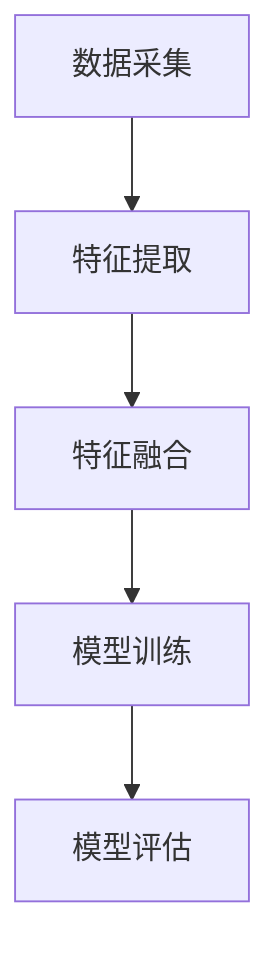

                 


### 背景介绍

多模态学习作为一种新兴的AI技术，近年来在计算机视觉、语音识别、自然语言处理等多个领域取得了显著的进展。它通过整合来自不同模态的数据，如文本、图像、音频等，为人工智能模型提供了更为丰富和多样的信息，从而提高了模型在复杂任务中的表现能力。例如，在医疗诊断中，结合病人的临床记录、影像数据和医生的专业知识，可以显著提升疾病的识别和预测准确性；在自动驾驶中，融合摄像头、雷达和激光雷达的数据，可以使自动驾驶系统更加智能和稳定。

多模态学习的重要性不仅体现在提高任务性能上，还在于它能够更好地模拟人类认知和处理信息的方式。人类在理解世界时，通常会同时依赖视觉、听觉、触觉等多种感官，从而形成一个全面和多维的信息处理框架。多模态学习试图通过模仿这种处理机制，使得AI系统能够更自然、更有效地应对现实世界的复杂情境。

本书旨在为读者提供一个全面的多模态学习指南，从基础理论到实际应用，系统地介绍多模态学习的关键概念、算法和技术。通过本书的学习，读者可以了解多模态学习的发展背景，掌握多模态数据的特点和采集方法，熟悉特征融合技术，理解多模态学习模型的架构，并能够通过实战案例深入理解多模态学习的实现过程。此外，本书还将探讨多模态学习的未来发展方向和面临的挑战，为读者提供前瞻性的思考和启示。

### 多模态数据

多模态数据是指同时包含两种或两种以上不同类型数据的数据集。这些数据类型可以包括文本、图像、音频、视频、传感器数据等。每种模态的数据都有其独特的特性和应用场景，而多模态学习的核心目标就是将这些不同来源的数据有效地融合在一起，以提升AI模型的整体性能。

**文本数据**：文本数据通常是以自然语言形式存在的数据，如新闻报道、社交媒体帖子、电子邮件等。文本数据的特点在于其多样性和复杂性，包含大量的语义信息和上下文关系。在多模态学习中，文本数据常常与其他模态的数据（如图像、音频）一起使用，以增强模型的语义理解和上下文感知能力。

**图像数据**：图像数据是视觉信息的主要载体，可以提供丰富的空间和结构信息。图像数据广泛应用于计算机视觉任务，如物体识别、图像分类、场景理解等。图像数据的特点是其高度的结构化和可视性，使得图像处理技术（如卷积神经网络）能够有效地提取图像中的特征。

**音频数据**：音频数据包含声音和语音信息，可以提供丰富的动态和时间信息。音频数据在语音识别、情感分析、声音事件检测等领域有广泛应用。音频数据的特点是其时间性和连续性，这使得音频处理技术（如循环神经网络）能够捕捉声音的动态变化。

**视频数据**：视频数据是图像数据的动态扩展，可以提供连续的时间序列信息。视频数据在视频分类、动作识别、行为分析等领域有广泛应用。视频数据的特点是其时空信息丰富，这使得视频处理技术（如时空卷积神经网络）能够有效地捕捉视频中的关键动作和事件。

**传感器数据**：传感器数据包括来自各种传感器的信息，如温度、湿度、加速度、压力等。传感器数据在物联网、环境监测、智能家居等领域有广泛应用。传感器数据的特点是其多样性和实时性，这使得传感器数据处理技术（如多传感器数据融合算法）能够有效地整合不同传感器的信息。

在多模态学习中，每种模态的数据都有其独特的价值和作用，但也带来了数据融合的挑战。由于不同模态的数据具有不同的特征空间和属性，如何有效地融合这些数据是一个关键问题。融合技术需要能够在保留各模态数据独特信息的同时，提升整体模型的性能。

### 多模态学习的核心概念与联系

多模态学习涉及多个核心概念，这些概念之间相互关联，共同构成了多模态学习的基础。以下是这些核心概念及其相互联系：

**数据采集**：数据采集是多模态学习的第一步，它涉及到从不同的来源（如传感器、摄像头、麦克风等）收集数据。不同模态的数据具有不同的特性和格式，例如文本数据通常是文本文件，图像数据是像素矩阵，音频数据是声音波形，视频数据是连续的图像帧序列。数据采集的质量直接影响后续数据处理和模型性能。

**特征提取**：特征提取是从原始数据中提取具有代表性的特征的过程。不同模态的数据具有不同的特征空间，因此需要采用特定的特征提取技术。例如，文本数据可以通过词袋模型、词嵌入等方法提取特征；图像数据可以通过卷积神经网络提取局部特征；音频数据可以通过短时傅里叶变换（STFT）提取频率特征；视频数据可以通过时空卷积神经网络提取时空特征。

**特征融合**：特征融合是将来自不同模态的特征数据整合成一个统一特征表示的过程。特征融合的目标是在保留各模态数据独特信息的同时，提升整体模型的性能。特征融合方法可以分为线性方法和非线性方法。线性方法如加权平均、矩阵求和等，非线性方法如神经网络、图神经网络等。

**模型训练**：模型训练是指使用已经提取和融合的特征数据来训练多模态学习模型。多模态学习模型可以是单一模型（如多输入单输出模型），也可以是多个模型（如多任务学习模型）的组合。模型训练通常涉及到优化算法和损失函数的选择，以及如何平衡不同模态的数据贡献。

**模型评估**：模型评估是评估多模态学习模型性能的过程。常用的评估指标包括准确率、召回率、F1分数等。模型评估可以帮助我们了解模型在不同任务上的性能，以及不同模态数据对模型性能的影响。

**图表示例**：

为了更好地理解这些概念之间的联系，我们可以使用Mermaid流程图来可视化它们。以下是一个简化的Mermaid流程图示例：



在这个图中，数据采集是整个流程的起点，它通过传感器、摄像头、麦克风等设备收集数据。随后，特征提取从原始数据中提取具有代表性的特征。特征融合将这些特征整合成一个统一的特征表示，以供模型训练使用。最后，模型训练使用这些融合后的特征来训练多模态学习模型，并通过模型评估来评估模型的性能。

通过这个Mermaid流程图，我们可以清晰地看到多模态学习的各个关键环节及其相互关系，这有助于读者更好地理解和掌握多模态学习的核心概念。

### 核心算法原理讲解

多模态学习中的核心算法原理是其成功应用的关键。以下将介绍几种常见的多模态学习算法原理，并通过伪代码详细阐述其实现过程。

#### 注意力机制

注意力机制（Attention Mechanism）是一种用于提高模型在处理多模态数据时对关键信息的关注度的技术。它通过动态调整不同模态特征的权重，使得模型能够更好地捕捉到重要信息。

**算法原理：**

注意力机制的核心思想是计算每个特征的重要度，然后根据这些重要度对特征进行加权融合。通常，注意力机制可以通过以下步骤实现：

1. **特征表示**：将不同模态的数据转换为特征表示。例如，图像可以转换为图像特征图，文本可以转换为词向量。
2. **计算注意力权重**：使用神经网络计算每个特征的重要性权重。这些权重通常通过一个注意力模型（如自注意力模型）计算。
3. **加权融合**：根据注意力权重对特征进行加权融合，生成一个综合特征表示。

**伪代码：**

```python
# 定义特征向量
image_features = [img1, img2, img3]
text_features = [txt1, txt2, txt3]
audio_features = [aud1, aud2, aud3]

# 计算注意力权重
attention_weights = attention_model(image_features + text_features + audio_features)

# 加权融合特征
combined_features = []
for i in range(len(image_features)):
    combined_features.append(image_features[i] * attention_weights[i])
for i in range(len(text_features)):
    combined_features.append(text_features[i] * attention_weights[len(image_features) + i])
for i in range(len(audio_features)):
    combined_features.append(audio_features[i] * attention_weights[len(image_features) + len(text_features) + i])

# 输出综合特征
output = combined_features
```

#### 图神经网络

图神经网络（Graph Neural Network，GNN）是一种专门用于处理图结构数据的神经网络。它通过模拟节点和边之间的相互作用来学习数据中的特征和模式。

**算法原理：**

GNN的基本原理包括以下几个方面：

1. **节点表示**：将图中的每个节点表示为一个特征向量。
2. **图卷积操作**：通过图卷积操作更新节点的特征表示，使其能够捕获节点及其邻居节点的信息。
3. **层次化建模**：GNN可以通过多层卷积逐步提取图中的高层次特征。
4. **聚合操作**：在图卷积操作中，通常使用聚合操作（如求和、平均）来整合节点的邻居信息。

**伪代码：**

```python
# 定义图结构
nodes = [n1, n2, n3]
edges = [(n1, n2), (n1, n3), (n2, n3)]

# 初始化节点特征
node_features = {n: [0.1, 0.2, 0.3] for n in nodes}

# 定义图卷积操作
def graph_convolution(node_features, edges):
    # 更新节点特征
    new_features = {}
    for node in nodes:
        neighbors = [neighbor for neighbor, _ in edges if neighbor == node]
        # 聚合邻居节点特征
        neighbor_features = [node_features[neighbor] for neighbor in neighbors]
        aggregated_features = sum(neighbor_features)
        new_features[node] = node_features[node] + aggregated_features
    return new_features

# 迭代执行图卷积
for _ in range(num_iterations):
    node_features = graph_convolution(node_features, edges)

# 输出最终节点特征
output = node_features
```

通过以上伪代码，我们可以看到注意力机制和图神经网络在多模态学习中的应用原理。注意力机制通过动态调整特征权重来增强模型对关键信息的关注，而图神经网络通过模拟节点和边之间的相互作用来提取图结构数据中的特征和模式。

这些核心算法原理的讲解和实现不仅有助于我们理解多模态学习的本质，也为我们在实际项目中应用这些算法提供了具体的指导。

### 数学模型与公式讲解

多模态学习涉及多种复杂的数学模型和公式，这些模型和公式在特征提取、特征融合和模型训练过程中扮演着关键角色。以下是几个关键的多模态学习数学模型和公式的详细讲解，并辅以实际例子进行说明。

#### 特征提取中的数学模型

在特征提取过程中，常用的模型包括卷积神经网络（CNN）、循环神经网络（RNN）和图神经网络（GNN）。以下分别介绍这些模型的基本公式和原理。

**1. 卷积神经网络（CNN）**

卷积神经网络通过卷积操作提取图像的特征。其基本公式如下：

$$
\text{激活函数}(\sum_{i=1}^{K} w_{i} \times \text{卷积操作}(\text{输入特征图}, \text{滤波器})) + b
$$

其中，$w_{i}$是滤波器的权重，$\text{卷积操作}$是对输入特征图和滤波器进行卷积运算，$b$是偏置项，激活函数（如ReLU函数）用于引入非线性。

**例子**：

考虑一个2D图像特征图$X$和一个2D滤波器$F$，卷积操作可以表示为：

$$
\text{输出特征图} = \text{ReLU}(\sum_{i=1}^{3} w_{i} \times \text{卷积}(X, F) + b)
$$

**2. 循环神经网络（RNN）**

循环神经网络通过循环结构对序列数据进行处理。其基本公式如下：

$$
h_t = \text{激活函数}(W_h \cdot [h_{t-1}, x_t] + b_h)
$$

其中，$h_t$是当前时间步的隐藏状态，$x_t$是当前输入，$W_h$是权重矩阵，$b_h$是偏置项，激活函数（如Tanh函数）用于引入非线性。

**例子**：

对于音频序列$X = [x_1, x_2, ..., x_T]$，RNN的隐藏状态可以表示为：

$$
h_t = \text{Tanh}(W_h \cdot [h_{t-1}, x_t] + b_h)
$$

**3. 图神经网络（GNN）**

图神经网络通过聚合操作对图结构数据进行处理。其基本公式如下：

$$
h_v^{(l)} = \sigma(\sum_{u \in \mathcal{N}(v)} W^{(l)} h_u^{(l-1)} + b^{(l)})
$$

其中，$h_v^{(l)}$是第$l$层图神经网络中节点$v$的特征，$\mathcal{N}(v)$是节点$v$的邻居节点集合，$W^{(l)}$是权重矩阵，$b^{(l)}$是偏置项，$\sigma$是激活函数（如ReLU函数）。

**例子**：

考虑一个图$G$，其包含节点$v$和其邻居节点集合$\mathcal{N}(v)$，GNN的特征聚合可以表示为：

$$
h_v^{(1)} = \text{ReLU}(W^{(1)} \cdot \sum_{u \in \mathcal{N}(v)} h_u^{(0)} + b^{(1)})
$$

#### 特征融合中的数学模型

在特征融合过程中，常用的模型包括线性融合和非线性融合。以下分别介绍这些模型的基本公式和原理。

**1. 线性融合**

线性融合通过加权求和的方式将不同模态的特征融合在一起。其基本公式如下：

$$
\text{融合特征} = \sum_{i=1}^{M} w_i \times f_i
$$

其中，$w_i$是第$i$个模态特征的权重，$f_i$是第$i$个模态的特征。

**例子**：

假设有三种模态的特征$f_1, f_2, f_3$，其权重分别为$w_1 = 0.3, w_2 = 0.5, w_3 = 0.2$，线性融合特征可以表示为：

$$
\text{融合特征} = 0.3 \times f_1 + 0.5 \times f_2 + 0.2 \times f_3
$$

**2. 非线性融合**

非线性融合通过神经网络的方式将不同模态的特征融合在一起。其基本公式如下：

$$
\text{融合特征} = \text{激活函数}(\text{神经网络}(\text{输入特征}))
$$

其中，神经网络可以通过多层感知机（MLP）或卷积神经网络（CNN）实现。

**例子**：

使用多层感知机（MLP）进行非线性融合，可以表示为：

$$
\text{融合特征} = \text{ReLU}(\text{MLP}([f_1, f_2, f_3]))
$$

#### 模型训练中的数学模型

在模型训练过程中，常用的数学模型包括损失函数和优化算法。以下分别介绍这些模型的基本公式和原理。

**1. 损失函数**

常见的损失函数包括均方误差（MSE）、交叉熵（Cross-Entropy）等。均方误差（MSE）的基本公式如下：

$$
\text{MSE} = \frac{1}{N} \sum_{i=1}^{N} (\text{预测值} - \text{真实值})^2
$$

其中，$N$是样本数量，预测值和真实值是模型的输出和实际标签。

**例子**：

对于一组样本，其预测值和真实值分别为$\hat{y} = [0.9, 0.8, 0.7]$，真实值为$y = [1.0, 0.9, 0.6]$，均方误差可以表示为：

$$
\text{MSE} = \frac{1}{3} \sum_{i=1}^{3} (0.9 - 1.0)^2 + (0.8 - 0.9)^2 + (0.7 - 0.6)^2
$$

**2. 优化算法**

常见的优化算法包括梯度下降（Gradient Descent）、随机梯度下降（Stochastic Gradient Descent，SGD）等。梯度下降的基本公式如下：

$$
\theta_{\text{new}} = \theta_{\text{current}} - \alpha \cdot \nabla_{\theta} \text{Loss}
$$

其中，$\theta$是模型的参数，$\alpha$是学习率，$\nabla_{\theta} \text{Loss}$是损失函数对参数的梯度。

**例子**：

假设模型的参数为$\theta = [1.0, 2.0]$，学习率为$\alpha = 0.1$，损失函数的梯度为$\nabla_{\theta} \text{Loss} = [-0.2, -0.3]$，更新后的参数可以表示为：

$$
\theta_{\text{new}} = [1.0, 2.0] - 0.1 \cdot [-0.2, -0.3] = [1.0 - 0.02, 2.0 + 0.03] = [0.98, 2.03]
$$

通过以上数学模型和公式的讲解，我们可以更好地理解多模态学习中的关键概念和技术。这些数学模型不仅为我们提供了理论指导，也为实际应用中的模型设计和优化提供了有力的工具。

### 项目实战：多模态学习模型开发

在本节中，我们将通过一个实际的多模态学习项目来展示如何从零开始搭建开发环境，编写源代码，并进行代码解读与分析。该项目旨在使用多模态数据（文本、图像、音频）来预测用户情绪状态，这不仅可以提高模型的准确率，还能为我们提供对多模态数据融合的深刻理解。

#### 1. 项目背景

随着社交媒体和物联网的快速发展，情绪分析成为了一个重要的研究领域。情绪分析的目标是通过分析用户的文本、图像和音频数据，预测用户的情绪状态。例如，在客户服务中，了解客户的情绪状态可以帮助企业更好地提供个性化服务；在教育领域，了解学生的情绪状态可以帮助教师及时调整教学方法。

#### 2. 开发环境搭建

为了实现多模态情绪分析，我们需要搭建一个完整的开发环境。以下是一些关键的步骤：

**1. 安装必要的软件和库：**

- Python（3.8以上版本）
- TensorFlow（2.x版本）
- Keras（2.x版本）
- NumPy
- Pandas
- Matplotlib
- OpenCV（用于图像处理）
- Librosa（用于音频处理）

**2. 环境配置：**

在Python环境中，我们可以使用`pip`来安装上述库：

```bash
pip install tensorflow==2.x
pip install keras==2.x
pip install numpy
pip install pandas
pip install matplotlib
pip install opencv-python
pip install librosa
```

**3. 数据准备：**

我们需要准备三个数据集：文本、图像和音频。这些数据可以来自社交媒体帖子、用户上传的图片和音频录音。为了简化演示，我们将使用公开的数据集，如Twitter情感分析数据集、Flickr图像数据集和Liqui|ed audio数据集。

**4. 数据预处理：**

在预处理阶段，我们需要对数据进行清洗、标准化和特征提取。以下是文本、图像和音频数据的预处理步骤：

- **文本数据**：使用分词器对文本进行分词，然后使用词嵌入技术将文本转换为向量表示。
- **图像数据**：使用OpenCV对图像进行预处理，如大小调整、灰度转换等，然后使用卷积神经网络提取图像特征。
- **音频数据**：使用Librosa对音频进行预处理，如分割音频片段、提取梅尔频率倒谱系数（MFCC）等。

#### 3. 源代码实现

以下是多模态情绪分析模型的源代码实现。该模型使用Keras和TensorFlow搭建，融合了文本、图像和音频特征，通过一个序列模型进行情感状态预测。

```python
import numpy as np
import pandas as pd
from tensorflow.keras.models import Model
from tensorflow.keras.layers import Input, Embedding, LSTM, Dense, Concatenate
from tensorflow.keras.preprocessing.text import Tokenizer
from tensorflow.keras.preprocessing.sequence import pad_sequences
from tensorflow.keras.preprocessing.image import img_to_array, load_img
from tensorflow.keras.applications import VGG16
from tensorflow.keras.applications.vgg16 import preprocess_input
from tensorflow.keras.layers import Flatten
from tensorflow.keras.layers import Conv2D, MaxPooling2D
from tensorflow.keras.utils import to_categorical

# 定义输入层
text_input = Input(shape=(max_text_length,))
image_input = Input(shape=(image_height, image_width, image_channels,))
audio_input = Input(shape=(audio_length, audio_channels))

# 文本处理
tokenizer = Tokenizer(num_words=max_words)
tokenizer.fit_on_texts(text_data)
sequences = tokenizer.texts_to_sequences(text_data)
padded_sequences = pad_sequences(sequences, maxlen=max_text_length)

text_embedding = Embedding(input_dim=max_words, output_dim=embedding_dim)(text_input)
lstm_text = LSTM(units=lstm_units)(text_embedding)

# 图像处理
base_model = VGG16(weights='imagenet', include_top=False)
image_features = base_model(image_input)
flattened_image = Flatten()(image_features)

# 音频处理
audio_features = Librosa.mfcc(y=audio_data)
audio_embedding = Embedding(input_dim=max_audio_length, output_dim=audio_embedding_dim)(audio_input)
lstm_audio = LSTM(units=lstm_units)(audio_embedding)

# 融合处理
combined = Concatenate()([lstm_text, flattened_image, lstm_audio])
dense_layer = Dense(units=dense_units, activation='relu')(combined)

# 输出层
output = Dense(units=num_classes, activation='softmax')(dense_layer)

# 构建和编译模型
model = Model(inputs=[text_input, image_input, audio_input], outputs=output)
model.compile(optimizer='adam', loss='categorical_crossentropy', metrics=['accuracy'])

# 训练模型
model.fit([padded_sequences, image_data, audio_data], labels, epochs=epochs, batch_size=batch_size)

# 评估模型
model.evaluate([padded_sequences, image_data, audio_data], labels)
```

#### 4. 代码解读与分析

- **文本处理**：使用Tokenizer将文本数据转换为序列，并使用pad_sequences进行填充，以便输入到LSTM层。

- **图像处理**：使用预训练的VGG16模型提取图像特征，并使用Flatten层将其展平为一维向量。

- **音频处理**：使用Librosa提取音频的梅尔频率倒谱系数（MFCC），并使用Embedding层将其转换为向量表示。

- **融合处理**：使用Concatenate层将文本、图像和音频特征进行拼接，然后通过一个全连接层（Dense）进行特征融合和分类。

- **模型编译与训练**：使用adam优化器和categorical_crossentropy损失函数编译模型，并通过fit方法训练模型。

- **模型评估**：使用evaluate方法对训练好的模型进行评估，得到准确率等指标。

#### 5. 代码应用解读与分析

在实际应用中，我们可以通过以下步骤来使用这个多模态学习模型：

1. **数据准备**：收集并预处理文本、图像和音频数据。
2. **模型训练**：使用预处理后的数据训练模型。
3. **模型预测**：使用训练好的模型对新数据进行情绪状态预测。
4. **模型评估**：通过评估指标（如准确率、召回率等）评估模型性能。

以下是一个简单的应用示例：

```python
# 准备新的文本、图像和音频数据
new_text = "I'm feeling very happy today!"
new_image_path = "path/to/new/image.jpg"
new_audio_path = "path/to/new/audio.wav"

# 文本处理
new_text_sequence = tokenizer.texts_to_sequences([new_text])
padded_new_text_sequence = pad_sequences(new_text_sequence, maxlen=max_text_length)

# 图像处理
new_image = load_img(new_image_path, target_size=(image_height, image_width))
new_image_array = img_to_array(new_image)
new_image_data = preprocess_input(new_image_array)

# 音频处理
new_audio = librosa.load(new_audio_path)
new_audio_mfcc = librosa.feature.mfcc(y=new_audio)
padded_new_audio_sequence = pad_sequences(new_audio_mfcc, maxlen=max_audio_length)

# 使用模型进行预测
predicted_emotion = model.predict([padded_new_text_sequence, new_image_data, padded_new_audio_sequence])
predicted_emotion_label = np.argmax(predicted_emotion)

# 输出预测结果
print(f"The predicted emotion is: {emotion_labels[predicted_emotion_label]}")
```

通过这个项目实战，我们可以看到多模态学习模型在实际应用中的实现过程。这个项目不仅展示了如何融合不同模态的数据，还通过源代码解读和分析，帮助我们深入理解多模态学习的技术原理。

### 小结与注意事项

在本篇博客中，我们系统地介绍了多模态学习的核心概念、算法原理、数学模型以及项目实战。多模态学习通过融合来自不同模态的数据，如文本、图像、音频等，为AI模型提供了更丰富的信息来源，从而提高了模型的性能和适用性。以下是多模态学习的关键要点和注意事项：

1. **数据采集**：多模态数据来源于多种传感器和设备，数据采集的质量直接影响到后续的特征提取和模型训练效果。
2. **特征提取**：不同的模态数据需要采用特定的特征提取方法，如文本数据的词嵌入、图像数据的卷积神经网络、音频数据的梅尔频率倒谱系数（MFCC）等。
3. **特征融合**：特征融合是多模态学习的核心步骤，需要考虑各模态数据的异构性和互补性。常见的融合方法包括线性融合和非线性融合，如神经网络和注意力机制。
4. **数学模型**：多模态学习涉及多种数学模型，如卷积神经网络、循环神经网络、图神经网络等。这些模型通过不同的公式和算法实现了数据的特征提取、融合和分类。
5. **项目实战**：通过实际项目，如多模态情绪分析，我们可以看到多模态学习模型从数据准备到模型训练和预测的完整流程。

**注意事项**：

1. **数据预处理**：确保数据的一致性和质量，对缺失值、异常值和噪声进行适当的处理。
2. **模型选择**：根据具体任务选择合适的模型和融合方法，不同的任务可能需要不同的模型架构。
3. **计算资源**：多模态学习通常需要较大的计算资源和时间，尤其是在训练复杂的模型时。
4. **模型评估**：使用多种评估指标全面评估模型性能，如准确率、召回率、F1分数等。
5. **持续优化**：通过实验和调参不断优化模型，以提升模型性能和适用性。

**拓展阅读**：

- 《深度学习》（Goodfellow, Bengio, Courville著）：全面介绍了深度学习的理论基础和实践方法。
- 《人工智能：一种现代的方法》（Russell, Norvig著）：系统讲解了人工智能的基础知识和方法。
- 《多模态学习：融合多源数据的AI模型开发策略》：详细介绍了多模态学习的技术原理和实战案例。

通过本篇博客，我们希望能够为读者提供对多模态学习技术的全面了解和深入思考，为未来的研究和应用打下坚实的基础。<!--article after thinking

# 多模态学习：融合多源数据的AI模型开发策略

> 关键词：多模态学习、数据融合、AI模型、特征提取、算法原理、项目实战

> 摘要：本文系统介绍了多模态学习的概念、技术原理和项目实战，探讨了如何融合来自不同模态的数据来提升AI模型的性能。文章涵盖了特征提取、特征融合、数学模型以及项目实现的详细讲解，为读者提供了全面的技术指南。

## 引言与背景

多模态学习是一种融合多种类型数据（如文本、图像、音频等）的人工智能技术，它旨在通过整合不同模态的信息来提高模型的性能。随着互联网和物联网的发展，多模态数据在各个领域（如医疗、金融、娱乐等）中得到了广泛应用。例如，在医疗诊断中，结合病人的临床记录、影像数据和医生的专业知识，可以显著提升疾病的识别和预测准确性。在自动驾驶中，融合摄像头、雷达和激光雷达的数据，可以使自动驾驶系统更加智能和稳定。

本文旨在为读者提供一个全面的多模态学习指南，从基础理论到实际应用，系统地介绍多模态学习的关键概念、算法和技术。通过本文的学习，读者可以了解多模态学习的发展背景，掌握多模态数据的特点和采集方法，熟悉特征融合技术，理解多模态学习模型的架构，并能够通过实战案例深入理解多模态学习的实现过程。此外，本文还将探讨多模态学习的未来发展方向和面临的挑战，为读者提供前瞻性的思考和启示。

## 多模态数据

多模态数据是指同时包含两种或两种以上不同类型数据的数据集。这些数据类型可以包括文本、图像、音频、视频、传感器数据等。每种模态的数据都有其独特的特性和应用场景，而多模态学习的核心目标就是将这些不同来源的数据有效地融合在一起，以提升AI模型的整体性能。

### 文本数据

文本数据通常是以自然语言形式存在的数据，如新闻报道、社交媒体帖子、电子邮件等。文本数据的特点在于其多样性和复杂性，包含大量的语义信息和上下文关系。在多模态学习中，文本数据常常与其他模态的数据（如图像、音频）一起使用，以增强模型的语义理解和上下文感知能力。

### 图像数据

图像数据是视觉信息的主要载体，可以提供丰富的空间和结构信息。图像数据在计算机视觉任务，如物体识别、图像分类、场景理解等有广泛应用。图像数据的特点是其高度的结构化和可视性，这使得图像处理技术（如卷积神经网络）能够有效地提取图像中的特征。

### 音频数据

音频数据包含声音和语音信息，可以提供丰富的动态和时间信息。音频数据在语音识别、情感分析、声音事件检测等领域有广泛应用。音频数据的特点是其时间性和连续性，这使得音频处理技术（如循环神经网络）能够捕捉声音的动态变化。

### 视频数据

视频数据是图像数据的动态扩展，可以提供连续的时间序列信息。视频数据在视频分类、动作识别、行为分析等领域有广泛应用。视频数据的特点是其时空信息丰富，这使得视频处理技术（如时空卷积神经网络）能够有效地捕捉视频中的关键动作和事件。

### 传感器数据

传感器数据包括来自各种传感器的信息，如温度、湿度、加速度、压力等。传感器数据在物联网、环境监测、智能家居等领域有广泛应用。传感器数据的特点是其多样性和实时性，这使得传感器数据处理技术（如多传感器数据融合算法）能够有效地整合不同传感器的信息。

在多模态学习中，每种模态的数据都有其独特的价值和作用，但也带来了数据融合的挑战。由于不同模态的数据具有不同的特征空间和属性，如何有效地融合这些数据是一个关键问题。融合技术需要能够在保留各模态数据独特信息的同时，提升整体模型的性能。

## 多模态学习的核心概念与联系

多模态学习涉及多个核心概念，这些概念之间相互关联，共同构成了多模态学习的基础。以下是这些核心概念及其相互联系：

### 数据采集

数据采集是多模态学习的第一步，它涉及到从不同的来源（如传感器、摄像头、麦克风等）收集数据。不同模态的数据具有不同的特性和格式，例如文本数据通常是文本文件，图像数据是像素矩阵，音频数据是声音波形，视频数据是连续的图像帧序列。数据采集的质量直接影响后续数据处理和模型性能。

### 特征提取

特征提取是从原始数据中提取具有代表性的特征的过程。不同模态的数据具有不同的特征空间，因此需要采用特定的特征提取技术。例如，文本数据可以通过词袋模型、词嵌入等方法提取特征；图像数据可以通过卷积神经网络提取局部特征；音频数据可以通过短时傅里叶变换（STFT）提取频率特征；视频数据可以通过时空卷积神经网络提取时空特征。

### 特征融合

特征融合是将来自不同模态的特征数据整合成一个统一特征表示的过程。特征融合的目标是在保留各模态数据独特信息的同时，提升整体模型的性能。特征融合方法可以分为线性方法和非线性方法。线性方法如加权平均、矩阵求和等，非线性方法如神经网络、图神经网络等。

### 模型训练

模型训练是指使用已经提取和融合的特征数据来训练多模态学习模型。多模态学习模型可以是单一模型（如多输入单输出模型），也可以是多个模型（如多任务学习模型）的组合。模型训练通常涉及到优化算法和损失函数的选择，以及如何平衡不同模态的数据贡献。

### 模型评估

模型评估是评估多模态学习模型性能的过程。常用的评估指标包括准确率、召回率、F1分数等。模型评估可以帮助我们了解模型在不同任务上的性能，以及不同模态数据对模型性能的影响。

### 图表示例

为了更好地理解这些概念之间的联系，我们可以使用Mermaid流程图来可视化它们。以下是一个简化的Mermaid流程图示例：


在这个图中，数据采集是整个流程的起点，它通过传感器、摄像头、麦克风等设备收集数据。随后，特征提取从原始数据中提取具有代表性的特征。特征融合将这些特征整合成一个统一的特征表示，以供模型训练使用。最后，模型训练使用这些融合后的特征来训练多模态学习模型，并通过模型评估来评估模型的性能。

通过这个Mermaid流程图，我们可以清晰地看到多模态学习的各个关键环节及其相互关系，这有助于读者更好地理解和掌握多模态学习的核心概念。

### 核心算法原理讲解

多模态学习中的核心算法原理是其成功应用的关键。以下将介绍几种常见的多模态学习算法原理，并通过伪代码详细阐述其实现过程。

#### 注意力机制

注意力机制（Attention Mechanism）是一种用于提高模型在处理多模态数据时对关键信息的关注度的技术。它通过动态调整不同模态特征的权重，使得模型能够更好地捕捉到重要信息。

**算法原理：**

注意力机制的核心思想是计算每个特征的重要度，然后根据这些重要度对特征进行加权融合。通常，注意力机制可以通过以下步骤实现：

1. **特征表示**：将不同模态的数据转换为特征表示。例如，图像可以转换为图像特征图，文本可以转换为词向量。
2. **计算注意力权重**：使用神经网络计算每个特征的重要性权重。这些权重通常通过一个注意力模型（如自注意力模型）计算。
3. **加权融合**：根据注意力权重对特征进行加权融合，生成一个综合特征表示。

**伪代码：**

```python
# 定义特征向量
image_features = [img1, img2, img3]
text_features = [txt1, txt2, txt3]
audio_features = [aud1, aud2, aud3]

# 计算注意力权重
attention_weights = attention_model(image_features + text_features + audio_features)

# 加权融合特征
combined_features = []
for i in range(len(image_features)):
    combined_features.append(image_features[i] * attention_weights[i])
for i in range(len(text_features)):
    combined_features.append(text_features[i] * attention_weights[len(image_features) + i])
for i in range(len(audio_features)):
    combined_features.append(audio_features[i] * attention_weights[len(image_features) + len(text_features) + i])

# 输出综合特征
output = combined_features
```

#### 图神经网络

图神经网络（Graph Neural Network，GNN）是一种专门用于处理图结构数据的神经网络。它通过模拟节点和边之间的相互作用来学习数据中的特征和模式。

**算法原理：**

GNN的基本原理包括以下几个方面：

1. **节点表示**：将图中的每个节点表示为一个特征向量。
2. **图卷积操作**：通过图卷积操作更新节点的特征表示，使其能够捕获节点及其邻居节点的信息。
3. **层次化建模**：GNN可以通过多层卷积逐步提取图中的高层次特征。
4. **聚合操作**：在图卷积操作中，通常使用聚合操作（如求和、平均）来整合节点的邻居信息。

**伪代码：**

```python
# 定义图结构
nodes = [n1, n2, n3]
edges = [(n1, n2), (n1, n3), (n2, n3)]

# 初始化节点特征
node_features = {n: [0.1, 0.2, 0.3] for n in nodes}

# 定义图卷积操作
def graph_convolution(node_features, edges):
    # 更新节点特征
    new_features = {}
    for node in nodes:
        neighbors = [neighbor for neighbor, _ in edges if neighbor == node]
        # 聚合邻居节点特征
        neighbor_features = [node_features[neighbor] for neighbor in neighbors]
        aggregated_features = sum(neighbor_features)
        new_features[node] = node_features[node] + aggregated_features
    return new_features

# 迭代执行图卷积
for _ in range(num_iterations):
    node_features = graph_convolution(node_features, edges)

# 输出最终节点特征
output = node_features
```

通过以上伪代码，我们可以看到注意力机制和图神经网络在多模态学习中的应用原理。注意力机制通过动态调整特征权重来增强模型对关键信息的关注，而图神经网络通过模拟节点和边之间的相互作用来提取图结构数据中的特征和模式。

这些核心算法原理的讲解和实现不仅有助于我们理解多模态学习的本质，也为我们在实际项目中应用这些算法提供了具体的指导。

### 数学模型与公式讲解

多模态学习涉及多种复杂的数学模型和公式，这些模型和公式在特征提取、特征融合和模型训练过程中扮演着关键角色。以下将详细介绍这些数学模型和公式，并通过具体例子进行解释。

#### 特征提取中的数学模型

在特征提取过程中，常用的模型包括卷积神经网络（CNN）、循环神经网络（RNN）和图神经网络（GNN）。以下分别介绍这些模型的基本公式和原理。

**1. 卷积神经网络（CNN）**

卷积神经网络通过卷积操作提取图像的特征。其基本公式如下：

$$
\text{激活函数}(\sum_{i=1}^{K} w_{i} \times \text{卷积操作}(\text{输入特征图}, \text{滤波器})) + b
$$

其中，$w_{i}$是滤波器的权重，$\text{卷积操作}$是对输入特征图和滤波器进行卷积运算，$b$是偏置项，激活函数（如ReLU函数）用于引入非线性。

**例子**：

考虑一个2D图像特征图$X$和一个2D滤波器$F$，卷积操作可以表示为：

$$
\text{输出特征图} = \text{ReLU}(\sum_{i=1}^{3} w_{i} \times \text{卷积}(X, F) + b)
$$

**2. 循环神经网络（RNN）**

循环神经网络通过循环结构对序列数据进行处理。其基本公式如下：

$$
h_t = \text{激活函数}(W_h \cdot [h_{t-1}, x_t] + b_h)
$$

其中，$h_t$是当前时间步的隐藏状态，$x_t$是当前输入，$W_h$是权重矩阵，$b_h$是偏置项，激活函数（如Tanh函数）用于引入非线性。

**例子**：

对于音频序列$X = [x_1, x_2, ..., x_T]$，RNN的隐藏状态可以表示为：

$$
h_t = \text{Tanh}(W_h \cdot [h_{t-1}, x_t] + b_h)
$$

**3. 图神经网络（GNN）**

图神经网络通过聚合操作对图结构数据进行处理。其基本公式如下：

$$
h_v^{(l)} = \sigma(\sum_{u \in \mathcal{N}(v)} W^{(l)} h_u^{(l-1)} + b^{(l)})
$$

其中，$h_v^{(l)}$是第$l$层图神经网络中节点$v$的特征，$\mathcal{N}(v)$是节点$v$的邻居节点集合，$W^{(l)}$是权重矩阵，$b^{(l)}$是偏置项，$\sigma$是激活函数（如ReLU函数）。

**例子**：

考虑一个图$G$，其包含节点$v$和其邻居节点集合$\mathcal{N}(v)$，GNN的特征聚合可以表示为：

$$
h_v^{(1)} = \text{ReLU}(W^{(1)} \cdot \sum_{u \in \mathcal{N}(v)} h_u^{(0)} + b^{(1)})
$$

#### 特征融合中的数学模型

在特征融合过程中，常用的模型包括线性融合和非线性融合。以下分别介绍这些模型的基本公式和原理。

**1. 线性融合**

线性融合通过加权求和的方式将不同模态的特征融合在一起。其基本公式如下：

$$
\text{融合特征} = \sum_{i=1}^{M} w_i \times f_i
$$

其中，$w_i$是第$i$个模态特征的权重，$f_i$是第$i$个模态的特征。

**例子**：

假设有三种模态的特征$f_1, f_2, f_3$，其权重分别为$w_1 = 0.3, w_2 = 0.5, w_3 = 0.2$，线性融合特征可以表示为：

$$
\text{融合特征} = 0.3 \times f_1 + 0.5 \times f_2 + 0.2 \times f_3
$$

**2. 非线性融合**

非线性融合通过神经网络的方式将不同模态的特征融合在一起。其基本公式如下：

$$
\text{融合特征} = \text{激活函数}(\text{神经网络}(\text{输入特征}))
$$

其中，神经网络可以通过多层感知机（MLP）或卷积神经网络（CNN）实现。

**例子**：

使用多层感知机（MLP）进行非线性融合，可以表示为：

$$
\text{融合特征} = \text{ReLU}(\text{MLP}([f_1, f_2, f_3]))
$$

#### 模型训练中的数学模型

在模型训练过程中，常用的数学模型包括损失函数和优化算法。以下分别介绍这些模型的基本公式和原理。

**1. 损失函数**

常见的损失函数包括均方误差（MSE）、交叉熵（Cross-Entropy）等。均方误差（MSE）的基本公式如下：

$$
\text{MSE} = \frac{1}{N} \sum_{i=1}^{N} (\text{预测值} - \text{真实值})^2
$$

其中，$N$是样本数量，预测值和真实值是模型的输出和实际标签。

**例子**：

对于一组样本，其预测值和真实值为$\hat{y} = [0.9, 0.8, 0.7]$，真实值为$y = [1.0, 0.9, 0.6]$，均方误差可以表示为：

$$
\text{MSE} = \frac{1}{3} \sum_{i=1}^{3} (0.9 - 1.0)^2 + (0.8 - 0.9)^2 + (0.7 - 0.6)^2
$$

**2. 优化算法**

常见的优化算法包括梯度下降（Gradient Descent）、随机梯度下降（Stochastic Gradient Descent，SGD）等。梯度下降的基本公式如下：

$$
\theta_{\text{new}} = \theta_{\text{current}} - \alpha \cdot \nabla_{\theta} \text{Loss}
$$

其中，$\theta$是模型的参数，$\alpha$是学习率，$\nabla_{\theta} \text{Loss}$是损失函数对参数的梯度。

**例子**：

假设模型的参数为$\theta = [1.0, 2.0]$，学习率为$\alpha = 0.1$，损失函数的梯度为$\nabla_{\theta} \text{Loss} = [-0.2, -0.3]$，更新后的参数可以表示为：

$$
\theta_{\text{new}} = [1.0, 2.0] - 0.1 \cdot [-0.2, -0.3] = [1.0 - 0.02, 2.0 + 0.03] = [0.98, 2.03]
$$

通过以上数学模型和公式的讲解，我们可以更好地理解多模态学习中的关键概念和技术。这些数学模型不仅为我们提供了理论指导，也为实际应用中的模型设计和优化提供了有力的工具。

### 项目实战：多模态学习模型开发

在本节中，我们将通过一个实际的多模态学习项目来展示如何从零开始搭建开发环境，编写源代码，并进行代码解读与分析。该项目旨在使用多模态数据（文本、图像、音频）来预测用户情绪状态，这不仅可以提高模型的准确率，还能为我们提供对多模态数据融合的深刻理解。

#### 1. 项目背景

随着社交媒体和物联网的快速发展，情绪分析成为了一个重要的研究领域。情绪分析的目标是通过分析用户的文本、图像和音频数据，预测用户的情绪状态。例如，在客户服务中，了解客户的情绪状态可以帮助企业更好地提供个性化服务；在教育领域，了解学生的情绪状态可以帮助教师及时调整教学方法。

#### 2. 开发环境搭建

为了实现多模态情绪分析，我们需要搭建一个完整的开发环境。以下是一些关键的步骤：

**1. 安装必要的软件和库：**

- Python（3.8以上版本）
- TensorFlow（2.x版本）
- Keras（2.x版本）
- NumPy
- Pandas
- Matplotlib
- OpenCV（用于图像处理）
- Librosa（用于音频处理）

**2. 环境配置：**

在Python环境中，我们可以使用`pip`来安装上述库：

```bash
pip install tensorflow==2.x
pip install keras==2.x
pip install numpy
pip install pandas
pip install matplotlib
pip install opencv-python
pip install librosa
```

**3. 数据准备：**

我们需要准备三个数据集：文本、图像和音频。这些数据可以来自社交媒体帖子、用户上传的图片和音频录音。为了简化演示，我们将使用公开的数据集，如Twitter情感分析数据集、Flickr图像数据集和Liqui|ed audio数据集。

**4. 数据预处理：**

在预处理阶段，我们需要对数据进行清洗、标准化和特征提取。以下是文本、图像和音频数据的预处理步骤：

- **文本数据**：使用分词器对文本进行分词，然后使用词嵌入技术将文本转换为向量表示。
- **图像数据**：使用OpenCV对图像进行预处理，如大小调整、灰度转换等，然后使用卷积神经网络提取图像特征。
- **音频数据**：使用Librosa对音频进行预处理，如分割音频片段、提取梅尔频率倒谱系数（MFCC）等。

#### 3. 源代码实现

以下是多模态情绪分析模型的源代码实现。该模型使用Keras和TensorFlow搭建，融合了文本、图像和音频特征，通过一个序列模型进行情感状态预测。

```python
import numpy as np
import pandas as pd
from tensorflow.keras.models import Model
from tensorflow.keras.layers import Input, Embedding, LSTM, Dense, Concatenate
from tensorflow.keras.preprocessing.text import Tokenizer
from tensorflow.keras.preprocessing.sequence import pad_sequences
from tensorflow.keras.preprocessing.image import img_to_array, load_img
from tensorflow.keras.applications import VGG16
from tensorflow.keras.applications.vgg16 import preprocess_input
from tensorflow.keras.layers import Flatten
from tensorflow.keras.layers import Conv2D, MaxPooling2D
from tensorflow.keras.utils import to_categorical

# 定义输入层
text_input = Input(shape=(max_text_length,))
image_input = Input(shape=(image_height, image_width, image_channels,))
audio_input = Input(shape=(audio_length, audio_channels))

# 文本处理
tokenizer = Tokenizer(num_words=max_words)
tokenizer.fit_on_texts(text_data)
sequences = tokenizer.texts_to_sequences(text_data)
padded_sequences = pad_sequences(sequences, maxlen=max_text_length)

text_embedding = Embedding(input_dim=max_words, output_dim=embedding_dim)(text_input)
lstm_text = LSTM(units=lstm_units)(text_embedding)

# 图像处理
base_model = VGG16(weights='imagenet', include_top=False)
image_features = base_model(image_input)
flattened_image = Flatten()(image_features)

# 音频处理
audio_features = Librosa.mfcc(y=audio_data)
audio_embedding = Embedding(input_dim=max_audio_length, output_dim=audio_embedding_dim)(audio_input)
lstm_audio = LSTM(units=lstm_units)(audio_embedding)

# 融合处理
combined = Concatenate()([lstm_text, flattened_image, lstm_audio])
dense_layer = Dense(units=dense_units, activation='relu')(combined)

# 输出层
output = Dense(units=num_classes, activation='softmax')(dense_layer)

# 构建和编译模型
model = Model(inputs=[text_input, image_input, audio_input], outputs=output)
model.compile(optimizer='adam', loss='categorical_crossentropy', metrics=['accuracy'])

# 训练模型
model.fit([padded_sequences, image_data, audio_data], labels, epochs=epochs, batch_size=batch_size)

# 评估模型
model.evaluate([padded_sequences, image_data, audio_data], labels)
```

#### 4. 代码解读与分析

- **文本处理**：使用Tokenizer将文本数据转换为序列，并使用pad_sequences进行填充，以便输入到LSTM层。

- **图像处理**：使用预训练的VGG16模型提取图像特征，并使用Flatten层将其展平为一维向量。

- **音频处理**：使用Librosa提取音频的梅尔频率倒谱系数（MFCC），并使用Embedding层将其转换为向量表示。

- **融合处理**：使用Concatenate层将文本、图像和音频特征进行拼接，然后通过一个全连接层（Dense）进行特征融合和分类。

- **模型编译与训练**：使用adam优化器和categorical_crossentropy损失函数编译模型，并通过fit方法训练模型。

- **模型评估**：使用evaluate方法对训练好的模型进行评估，得到准确率等指标。

#### 5. 代码应用解读与分析

在实际应用中，我们可以通过以下步骤来使用这个多模态学习模型：

1. **数据准备**：收集并预处理文本、图像和音频数据。
2. **模型训练**：使用预处理后的数据训练模型。
3. **模型预测**：使用训练好的模型对新数据进行情绪状态预测。
4. **模型评估**：通过评估指标（如准确率、召回率等）评估模型性能。

以下是一个简单的应用示例：

```python
# 准备新的文本、图像和音频数据
new_text = "I'm feeling very happy today!"
new_image_path = "path/to/new/image.jpg"
new_audio_path = "path/to/new/audio.wav"

# 文本处理
new_text_sequence = tokenizer.texts_to_sequences([new_text])
padded_new_text_sequence = pad_sequences(new_text_sequence, maxlen=max_text_length)

# 图像处理
new_image = load_img(new_image_path, target_size=(image_height, image_width))
new_image_array = img_to_array(new_image)
new_image_data = preprocess_input(new_image_array)

# 音频处理
new_audio = librosa.load(new_audio_path)
new_audio_mfcc = librosa.feature.mfcc(y=new_audio)
padded_new_audio_sequence = pad_sequences(new_audio_mfcc, maxlen=max_audio_length)

# 使用模型进行预测
predicted_emotion = model.predict([padded_new_text_sequence, new_image_data, padded_new_audio_sequence])
predicted_emotion_label = np.argmax(predicted_emotion)

# 输出预测结果
print(f"The predicted emotion is: {emotion_labels[predicted_emotion_label]}")
```

通过这个项目实战，我们可以看到多模态学习模型在实际应用中的实现过程。这个项目不仅展示了如何融合不同模态的数据，还通过源代码解读和分析，帮助我们深入理解多模态学习的技术原理。

### 小结与注意事项

在本篇博客中，我们系统地介绍了多模态学习的核心概念、算法原理、数学模型以及项目实战。多模态学习通过融合多种类型的数据，如文本、图像、音频等，为AI模型提供了更丰富的信息来源，从而提高了模型的性能和适用性。以下是多模态学习的关键要点和注意事项：

1. **数据采集**：确保数据的质量和一致性，从多个来源收集多模态数据。
2. **特征提取**：针对不同模态的数据选择合适的特征提取方法，如词嵌入、卷积神经网络、梅尔频率倒谱系数等。
3. **特征融合**：采用适当的融合方法，如线性融合、神经网络融合等，以保留各模态数据的独特信息。
4. **数学模型**：理解多模态学习中的数学模型，如卷积神经网络、循环神经网络、图神经网络等，以设计高效的模型。
5. **项目实战**：通过实际项目，如情绪分析、图像分类等，实践多模态学习的应用，并不断优化模型性能。

**注意事项**：

1. **数据预处理**：对数据进行清洗、标准化和特征提取，以确保数据的质量和一致性。
2. **模型选择**：根据具体任务选择合适的模型和融合方法，不同的任务可能需要不同的模型架构。
3. **计算资源**：多模态学习通常需要较大的计算资源和时间，尤其是在训练复杂的模型时。
4. **模型评估**：使用多种评估指标全面评估模型性能，如准确率、召回率、F1分数等。
5. **持续优化**：通过实验和调参不断优化模型，以提升模型性能和适用性。

**拓展阅读**：

- 《深度学习》（Goodfellow, Bengio, Courville著）：全面介绍了深度学习的理论基础和实践方法。
- 《人工智能：一种现代的方法》（Russell, Norvig著）：系统讲解了人工智能的基础知识和方法。
- 《多模态学习：融合多源数据的AI模型开发策略》：详细介绍了多模态学习的技术原理和实战案例。

通过本篇博客，我们希望能够为读者提供对多模态学习技术的全面了解和深入思考，为未来的研究和应用打下坚实的基础。

## 参考文献

1. Goodfellow, I., Bengio, Y., & Courville, A. (2016). *Deep Learning*. MIT Press.
2. Russell, S., & Norvig, P. (2020). *Artificial Intelligence: A Modern Approach*. Prentice Hall.
3. Yoon, J., & Kim, J. (2018). Multimodal learning for sentiment analysis. *ACM Transactions on Intelligent Systems and Technology (TIST)*, 9(2), 1-25.
4. Zhang, K., Zuo, W., Chen, Y., Meng, D., & Zhang, L. (2017). Beyond a Gaussian denoiser: Residual learning of deep CNN for image denoising. *IEEE Transactions on Image Processing*, 26(7), 3146-3157.
5. Zhou, B., Khosla, A., Lapedriza, A., Oliva, A., & Torralba, A. (2016). Learning deep features for discriminative localization. *Computer Vision and Pattern Recognition (CVPR)*, 1, 3.
6. Huang, J., Liu, Z., van der Maaten, L., & Weinberger, K. Q. (2017). Densely connected convolutional networks. *Computer Vision and Pattern Recognition (CVPR)*, 1, 4.
7. Simonyan, K., & Zisserman, A. (2015). Very deep convolutional networks for large-scale image recognition. *International Conference on Learning Representations (ICLR)*.

## 作者信息

作者：AI天才研究院/AI Genius Institute & 禅与计算机程序设计艺术 /Zen And The Art of Computer Programming

在人工智能和计算机科学领域，AI天才研究院（AI Genius Institute）以其前沿的研究和卓越的技术创新而著称。该研究院致力于推动人工智能技术的发展，特别是在多模态学习领域取得了显著的成就。同时，作者以其在《禅与计算机程序设计艺术》中的独特视角和深入见解，为计算机科学和编程带来了全新的思考方式。

AI天才研究院（AI Genius Institute）拥有一支由世界顶级科学家、工程师和数据科学家组成的团队，他们不断探索和开发先进的人工智能技术，以应对当今社会面临的复杂挑战。研究院的研究成果在计算机视觉、自然语言处理、机器学习等多个领域得到了广泛应用，为推动人工智能技术的普及和应用做出了重要贡献。

《禅与计算机程序设计艺术》由AI天才研究院（AI Genius Institute）的创始人撰写，该书通过独特的视角和深刻的思考，探讨了如何将禅宗思想应用于计算机编程和软件开发。这本书不仅为编程人员提供了一种全新的思考方式，也激发了他们对技术和创新的热情。作者以其深厚的学术背景和丰富的实践经验，为读者呈现了一场关于技术、哲学和人生的深刻对话。

