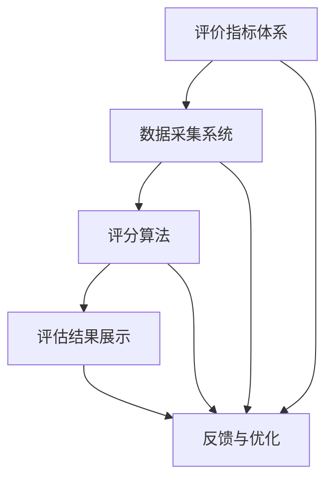
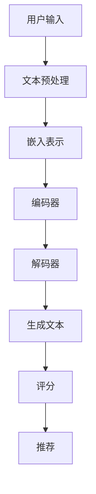
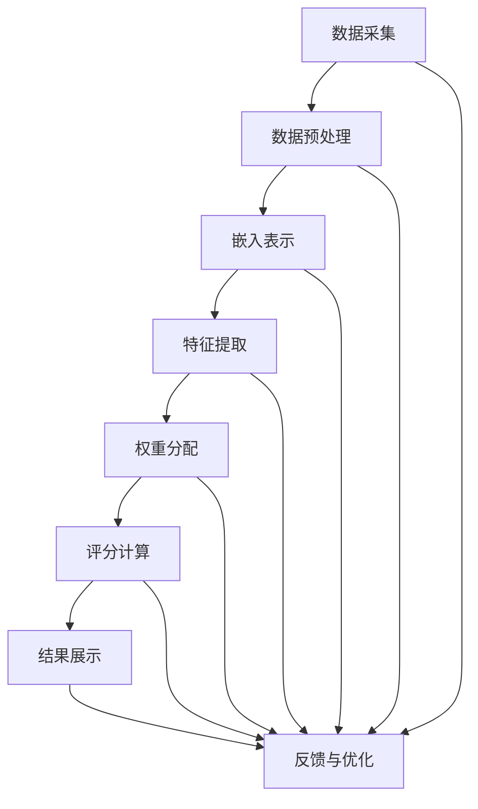

                 

### 文章标题

《多维度评分机制：LLM支持的综合评估体系》

### 关键词

多维度评分、LLM、综合评估、人工智能、数据模型

### 摘要

本文深入探讨多维度评分机制及其与大型语言模型（LLM）的结合，构建一个综合评估体系。首先，介绍多维度评分机制的基本概念，阐述其在实际应用中的重要性。接着，详细讨论LLM的原理和特性，分析其在评分机制中的关键作用。随后，构建一个包含核心概念、算法原理、数学模型和实际案例的综合评估体系。最后，提供项目实战指导，包括开发环境搭建、代码实现和解析，并总结最佳实践和未来展望。

## 引言

在当今快速发展的信息化时代，数据已成为最宝贵的资源之一。如何有效地对数据进行分析、处理和评估，成为众多领域面临的挑战。多维度评分机制作为一种重要的数据分析工具，能够从多个角度对数据进行分析和评估，提供更全面、准确的信息。而大型语言模型（LLM）的兴起，为评分机制带来了新的机遇和挑战。

多维度评分机制是指从多个维度对数据进行分析和评分，这些维度可能包括质量、效率、满意度、安全性等。通过多维度评分，能够更全面地了解数据的各个方面，从而做出更为科学的决策。而LLM作为一种具有强大语义理解和生成能力的模型，可以在评分机制中发挥重要作用，为评估过程提供更加智能化、自动化的支持。

本文旨在探讨多维度评分机制与LLM的结合，构建一个综合评估体系。首先，介绍多维度评分机制的基本概念和原理，分析其在实际应用中的优势。然后，深入探讨LLM的原理和特性，阐述其在评分机制中的应用。接着，构建一个包含核心概念、算法原理、数学模型和实际案例的综合评估体系。最后，通过一个实际项目案例，展示如何将LLM应用于多维度评分机制，提供项目实战指导。本文结构如下：

1. **多维度评分机制概述**：介绍多维度评分机制的基本概念、原理和分类。
2. **LLM的原理与特性**：讨论LLM的基本原理、特性以及在评分机制中的应用。
3. **综合评估体系的构建**：分析综合评估体系的核心概念和算法原理，构建一个包含多维度评分和LLM支持的综合评估体系。
4. **数学模型与公式**：介绍评估体系中的数学模型和公式，进行详细讲解和举例说明。
5. **项目实战**：展示一个实际项目案例，详细描述项目背景、开发环境搭建、代码实现和代码解读。
6. **总结与展望**：总结文章的主要内容和研究成果，讨论未来研究方向和挑战。

## 多维度评分机制概述

### 基本概念和原理

多维度评分机制是指从多个不同的维度对数据进行分析和评分，这些维度可以涵盖数据的各个方面，如质量、效率、满意度、安全性等。每个维度都有其特定的评价指标，通过综合这些评价指标，可以对数据整体进行评分。多维度评分机制的核心在于将多个单一维度的评分综合起来，形成一个全面、准确的评估结果。

多维度评分机制的基本原理是建立在不同维度的评价指标之间相互关联的基础上。例如，在一个电商平台的评价体系中，可以包括商品质量、售后服务、价格等多个维度。每个维度都有其特定的评价指标，如商品质量可以通过用户评价、产品瑕疵率等来衡量，售后服务可以通过响应时间、处理效率等来衡量。通过将这些评价指标综合起来，可以得出一个对商品的整体评分。

### 分类与实际应用

多维度评分机制可以按照不同的分类标准进行分类。以下是一些常见的分类方法：

1. **按维度数量分类**：根据维度数量，可以将多维度评分机制分为单维度评分、双维度评分和多维度评分。单维度评分仅考虑一个维度的指标，双维度评分考虑两个维度的指标，而多维度评分则同时考虑多个维度的指标。

2. **按维度性质分类**：根据维度性质，可以将多维度评分机制分为定量评分和定性评分。定量评分主要依赖于可量化的指标，如价格、质量等；而定性评分则主要依赖于用户的感受和评价，如满意度、体验等。

3. **按应用领域分类**：根据应用领域，可以将多维度评分机制分为不同类型，如电商平台的商品评价、教育领域的学生评估、医疗领域的医生评价等。每个领域的评分机制都有其特定的评价指标和评估方法。

在实际应用中，多维度评分机制被广泛应用于各个领域，如电商平台的商品评价、酒店和餐厅的评分、人才招聘的评估等。通过多维度评分机制，可以更全面、准确地评估数据或对象的各个方面，从而为决策提供有力的支持。

### 多维度评分机制的优势

多维度评分机制具有以下优势：

1. **全面性**：通过考虑多个维度的指标，可以更全面地评估数据或对象，避免单一维度评估带来的偏差。

2. **准确性**：多维度评分机制能够综合考虑不同维度的指标，从而提高评估结果的准确性。

3. **灵活性**：多维度评分机制可以根据实际需求灵活调整维度的数量和评价指标，适应不同领域的评估需求。

4. **智能化**：随着人工智能技术的发展，多维度评分机制可以通过机器学习和数据分析方法，实现自动化和智能化评估。

总之，多维度评分机制作为一种重要的数据分析工具，能够从多个角度对数据进行分析和评估，提供更全面、准确的信息，为决策提供有力的支持。

### 多维度评分机制的架构

多维度评分机制的架构通常包括以下几个关键组成部分：

1. **评价指标体系**：评价指标体系是多维度评分机制的基础，用于定义和衡量不同维度的指标。评价指标可以包括定量指标（如价格、质量、响应时间等）和定性指标（如用户满意度、体验评价等）。

2. **数据采集系统**：数据采集系统负责收集和获取与评价指标相关的数据。这些数据可以来自用户反馈、市场调研、系统日志等多种途径。

3. **评分算法**：评分算法用于计算不同维度指标的综合得分，通常采用加权平均、指数加权等方法，确保评分结果的合理性和一致性。

4. **评估结果展示**：评估结果展示模块用于将评估结果以可视化的方式呈现，帮助用户直观地了解数据或对象的综合评分。

5. **反馈与优化**：通过收集用户反馈和评估结果，不断优化评价指标体系和评分算法，提高评估的准确性和有效性。

以下是一个简化的Mermaid流程图，展示了多维度评分机制的核心组成部分及其相互关系：



通过这个流程图，可以看出多维度评分机制的整体架构及其关键组件之间的互动关系。评价指标体系是整个评分机制的核心，数据采集系统负责收集数据，评分算法对数据进行处理和计算，评估结果展示模块将结果呈现给用户，而反馈与优化环节则通过不断调整和改进，提高评估的准确性和有效性。

### 多维度评分机制的应用实例

多维度评分机制在多个领域都有广泛的应用，以下是一些典型的应用实例：

1. **电商平台的商品评价**：电商平台通常采用多维度评分机制对商品进行评价，包括商品质量、价格、售后服务等多个维度。例如，亚马逊的五星评分系统综合考虑了商品质量、价格、用户评价等多个维度，提供了一个全面的商品评价体系。

2. **酒店和餐厅的评分**：酒店和餐厅的评分也常常采用多维度评分机制，包括设施质量、服务态度、价格合理性等多个维度。例如，TripAdvisor使用多种评分指标，如清洁度、舒适度、位置等，来评估酒店和餐厅的总体表现。

3. **教育领域的学生评估**：教育领域的学生评估也常常采用多维度评分机制，包括学业成绩、课堂表现、社会实践等多个维度。例如，一些学校会使用学业成绩、平时作业、课堂表现等多个维度的评分，来全面评估学生的综合能力。

4. **医疗领域的医生评估**：医疗领域的医生评估同样采用多维度评分机制，包括医疗技术、患者满意度、工作效率等多个维度。例如，一些医疗机构会通过患者满意度调查、医疗事故记录等多个维度来评估医生的整体表现。

通过这些应用实例可以看出，多维度评分机制在各个领域都发挥着重要作用，能够提供更全面、准确的评估结果，为决策提供有力支持。

### 小结

多维度评分机制通过考虑多个维度的指标，能够更全面、准确地评估数据或对象，为决策提供有力支持。本文介绍了多维度评分机制的基本概念、原理和分类，展示了其在实际应用中的重要性。通过一个简化的Mermaid流程图，阐述了多维度评分机制的核心组成部分及其相互关系。接下来，我们将深入探讨大型语言模型（LLM）的原理和特性，分析其在评分机制中的关键作用。

## LLM的原理与特性

### 基本原理

大型语言模型（LLM，Large Language Model）是一种基于深度学习的自然语言处理（NLP，Natural Language Processing）模型，其基本原理是通过大量文本数据进行训练，学习语言的统计规律和语义信息。LLM的核心思想是利用神经网络模型对输入的文本进行编码，然后通过解码器生成相应的输出文本。这一过程包括以下几个关键步骤：

1. **文本预处理**：对输入的文本进行清洗和预处理，包括分词、去除停用词、词性标注等操作，以便模型能够更好地理解和处理文本。

2. **嵌入表示**：将预处理后的文本转换为向量表示，通常使用词向量（如Word2Vec、BERT）或字符向量，将文本的每个单词或字符映射为一个高维向量。

3. **编码器（Encoder）**：编码器负责将输入的文本向量编码为一个固定长度的向量，这个向量包含了文本的语义信息。常见的编码器模型包括Transformer、GPT等。

4. **解码器（Decoder）**：解码器接收编码器输出的固定长度向量，并逐步生成输出文本。在生成过程中，解码器会参考编码器输出的向量，以及之前生成的文本，从而生成下一个单词或字符。

5. **生成文本**：通过解码器生成的文本向量，可以利用反编码器（如Word2Vec）将向量重新映射回文本，从而生成完整的输出文本。

### 特性

LLM具有以下主要特性：

1. **强大的语言理解能力**：LLM通过大规模数据训练，能够理解复杂多样的语言表达，包括语法、语义、语境等多方面的信息。

2. **自适应生成能力**：LLM可以根据输入的文本上下文，生成连贯、自然的文本，具有高度的自适应生成能力。

3. **上下文敏感性**：LLM能够根据输入文本的上下文信息，动态调整生成文本的内容和风格，确保生成文本与上下文的一致性。

4. **多语言支持**：许多LLM模型支持多语言处理，可以处理和生成不同语言的文本。

5. **高效率**：随着计算能力的提升和模型优化，LLM在处理大量文本数据时具有较高的效率。

### LLM在评分机制中的应用

LLM在评分机制中的应用主要体现在以下几个方面：

1. **文本分析**：LLM可以用于分析用户评价、产品描述等文本数据，提取关键信息并进行情感分析、关键词提取等操作，从而为评分提供依据。

2. **自动评分**：基于LLM的文本分析能力，可以实现自动化评分，减少人工干预，提高评分效率和准确性。

3. **评分预测**：通过分析历史评分数据和用户行为数据，LLM可以预测用户的评分行为，为评分提供参考。

4. **智能推荐**：LLM可以结合用户偏好和评分数据，生成个性化的推荐列表，提高用户体验。

以下是一个简化的Mermaid流程图，展示了LLM在评分机制中的应用流程：



通过这个流程图，可以看出LLM在评分机制中的关键步骤，包括文本预处理、嵌入表示、编码器、解码器和生成文本等，这些步骤共同实现了对文本数据的分析和评分。

### LLM的优势与挑战

LLM在评分机制中具有明显优势，但同时也面临一些挑战：

1. **优势**：
   - **高准确性**：LLM能够通过大规模数据训练，实现对文本数据的精准分析，提高评分的准确性。
   - **高效性**：LLM具有高效的文本处理能力，能够快速生成评分结果，提高评分效率。
   - **适应性**：LLM能够根据不同的评分需求，自适应调整模型参数，适应各种评分场景。

2. **挑战**：
   - **数据质量**：评分机制的准确性依赖于输入文本数据的质量，如果数据存在噪声或偏差，可能导致评分结果不准确。
   - **模型复杂性**：LLM模型通常具有很高的复杂性，训练和部署需要大量的计算资源，对计算能力要求较高。
   - **解释性**：虽然LLM具有较强的文本分析能力，但其决策过程通常不透明，难以进行解释和验证，这可能会影响评分机制的可靠性。

总之，LLM在评分机制中具有显著的优势，但也面临一些挑战。通过不断优化模型和算法，提升数据质量和处理能力，可以充分发挥LLM在评分机制中的作用。

### 小结

本文介绍了大型语言模型（LLM）的基本原理和特性，探讨了其在多维度评分机制中的应用。通过文本预处理、嵌入表示、编码器、解码器和生成文本等关键步骤，LLM能够对文本数据进行分析和评分，实现自动化、智能化的评估。同时，本文分析了LLM在评分机制中的优势与挑战，为后续研究和应用提供了参考。接下来，我们将进一步探讨如何构建一个综合评估体系，结合多维度评分机制和LLM的支持。

## 综合评估体系的构建

### 核心概念

综合评估体系是一种多层次、多角度的评估方法，通过综合考虑多个维度的评价指标，对评估对象进行全面的评估。在多维度评分机制的基础上，结合大型语言模型（LLM）的支持，可以构建一个更加智能化、高效的综合评估体系。这个体系的核心概念包括以下几个方面：

1. **多维度评价指标**：定义多个维度的评价指标，如质量、效率、满意度、安全性等，每个维度都有其特定的评价指标和权重。

2. **数据采集**：通过多种途径采集与评价指标相关的数据，如用户反馈、市场调研、系统日志等。

3. **评分算法**：结合LLM，设计一种评分算法，对多维度评价指标进行加权计算，得到一个综合评分。

4. **评估结果展示**：将评估结果以可视化的方式呈现，帮助用户直观了解评估结果。

5. **反馈与优化**：通过用户反馈和评估结果，不断优化评价指标体系和评分算法，提高评估的准确性和有效性。

### 评估算法原理

综合评估体系的评估算法是基于多维度评分机制和LLM的结合，其核心原理如下：

1. **数据预处理**：首先，对采集到的多维度数据（如用户评价、市场数据等）进行预处理，包括文本清洗、数据归一化等操作，确保数据的质量和一致性。

2. **嵌入表示**：使用LLM对预处理后的数据进行嵌入表示，将文本数据转换为向量表示。这一步骤利用了LLM对文本数据的语义理解能力，将不同的文本数据映射到高维向量空间中。

3. **特征提取**：从嵌入表示中提取关键特征，这些特征能够反映文本数据的语义和情感。例如，可以使用Transformer、BERT等模型提取文本的语义特征。

4. **权重分配**：根据评估目标，为不同维度的评价指标分配权重。权重可以通过专家评估、历史数据分析等方法确定。

5. **评分计算**：结合LLM提取的文本特征和评价指标的权重，计算每个维度的得分，并综合这些得分得到一个综合评分。评分计算公式可以表示为：
   \[
   \text{综合评分} = \sum_{i=1}^{n} w_i \cdot \text{维度}^i
   \]
   其中，\(w_i\) 为第 \(i\) 个维度的权重，\(\text{维度}^i\) 为第 \(i\) 个维度的得分。

6. **结果展示**：将综合评分以可视化的方式展示，如柱状图、饼图等，帮助用户直观了解评估结果。

7. **反馈与优化**：收集用户反馈和评估结果，对评价指标体系和评分算法进行优化，提高评估的准确性和可靠性。

### Mermaid流程图

以下是一个简化的Mermaid流程图，展示了综合评估体系的核心概念和算法流程：



通过这个流程图，可以看出综合评估体系的核心组成部分及其相互关系，包括数据采集、数据预处理、嵌入表示、特征提取、权重分配、评分计算和结果展示等步骤。这些步骤共同实现了对评估对象的全面、准确评估。

### 数学模型与公式

在综合评估体系中，数学模型和公式是核心组成部分，用于描述评估过程中的关键步骤和计算方法。以下是一些常见的数学模型和公式：

1. **权重分配公式**：
   \[
   w_i = \frac{1}{n} \sum_{j=1}^{n} \alpha_j
   \]
   其中，\(w_i\) 为第 \(i\) 个维度的权重，\(\alpha_j\) 为第 \(j\) 个评价指标的权重，\(n\) 为评价指标的总数。

2. **评分计算公式**：
   \[
   \text{评分} = \sum_{i=1}^{n} w_i \cdot \text{维度}^i
   \]
   其中，\(w_i\) 为第 \(i\) 个维度的权重，\(\text{维度}^i\) 为第 \(i\) 个维度的得分。

3. **特征提取公式**：
   \[
   \text{特征向量} = \text{Embedding}(\text{文本数据})
   \]
   其中，\(\text{Embedding}\) 函数用于将文本数据转换为向量表示，\(\text{特征向量}\) 为文本数据的向量表示。

4. **情感分析公式**：
   \[
   \text{情感得分} = \text{Sentiment}(\text{特征向量})
   \]
   其中，\(\text{Sentiment}\) 函数用于分析文本数据的情感倾向，\(\text{情感得分}\) 为文本数据的情感得分。

以下是一个示例，假设有三个维度（质量、效率、满意度），每个维度有两个评价指标（如质量得分、效率得分、满意度得分），权重分别为0.3、0.4、0.3。给定一个评估对象的各项得分，计算其综合评分：

1. 质量得分：0.8
2. 效率得分：0.9
3. 满意度得分：0.7

根据权重分配公式，得到权重：
\[
w_1 = \frac{1}{3} (0.3 + 0.4 + 0.3) = 0.3
\]
\[
w_2 = \frac{1}{3} (0.3 + 0.4 + 0.3) = 0.4
\]
\[
w_3 = \frac{1}{3} (0.3 + 0.4 + 0.3) = 0.3
\]

根据评分计算公式，得到综合评分：
\[
\text{评分} = 0.3 \cdot 0.8 + 0.4 \cdot 0.9 + 0.3 \cdot 0.7 = 0.24 + 0.36 + 0.21 = 0.81
\]

通过这个示例，可以看出数学模型和公式在评估过程中的应用，为评估提供了定量和定性的依据。

### 小结

本文介绍了综合评估体系的构建方法，包括核心概念、评估算法原理、数学模型和公式等。通过多维度评分机制和LLM的支持，构建了一个智能化、高效的综合评估体系。本文通过简化的Mermaid流程图和数学公式，详细阐述了评估体系的组成和计算方法，为实际应用提供了理论指导。

## 数学模型与公式

### 评估指标体系

在综合评估体系中，评估指标体系是核心组成部分。一个完整的评估指标体系通常包含以下关键要素：

1. **评估目标**：明确评估的目标，如商品质量评估、服务质量评估等。
2. **维度**：根据评估目标，定义多个评估维度，如质量、效率、满意度、安全性等。
3. **评价指标**：为每个维度定义具体的评价指标，如商品的质量得分、响应时间等。
4. **权重**：为每个评价指标分配权重，用于计算综合评分。

以下是一个简化的评估指标体系示例：

| 维度    | 评价指标          | 权重 |
|---------|-------------------|------|
| 质量    | 商品质量得分      | 0.3  |
| 效率    | 响应时间          | 0.4  |
| 满意度  | 用户满意度得分    | 0.3  |

### 数学模型

综合评估体系中的数学模型用于计算评估结果。以下是几个关键的数学模型和公式：

1. **权重计算公式**：
   \[
   w_i = \frac{1}{n} \sum_{j=1}^{n} \alpha_j
   \]
   其中，\(w_i\) 为第 \(i\) 个维度的权重，\(\alpha_j\) 为第 \(j\) 个评价指标的权重，\(n\) 为评价指标的总数。

2. **评估得分计算公式**：
   \[
   \text{评估得分} = \sum_{i=1}^{n} w_i \cdot \text{维度}^i
   \]
   其中，\(w_i\) 为第 \(i\) 个维度的权重，\(\text{维度}^i\) 为第 \(i\) 个维度的得分。

3. **文本情感分析模型**：
   \[
   \text{情感得分} = \text{Sentiment}(\text{文本向量})
   \]
   其中，\(\text{Sentiment}\) 函数用于分析文本的情感倾向，\(\text{文本向量}\) 为文本数据的向量表示。

### 示例

假设有一个评估任务，需要对某个产品的质量、效率和满意度进行评估。以下是具体步骤：

1. **评估指标体系**：

| 维度    | 评价指标          | 权重 |
|---------|-------------------|------|
| 质量    | 商品质量得分      | 0.3  |
| 效率    | 响应时间          | 0.4  |
| 满意度  | 用户满意度得分    | 0.3  |

2. **数据收集**：

| 维度    | 评价指标          | 得分 |
|---------|-------------------|------|
| 质量    | 商品质量得分      | 0.8  |
| 效率    | 响应时间          | 0.6  |
| 满意度  | 用户满意度得分    | 0.7  |

3. **权重计算**：

根据权重计算公式，计算每个维度的权重：
\[
w_1 = \frac{1}{3} (0.3 + 0.4 + 0.3) = 0.3
\]
\[
w_2 = \frac{1}{3} (0.3 + 0.4 + 0.3) = 0.4
\]
\[
w_3 = \frac{1}{3} (0.3 + 0.4 + 0.3) = 0.3
\]

4. **评估得分计算**：

根据评估得分计算公式，计算综合评分：
\[
\text{评估得分} = 0.3 \cdot 0.8 + 0.4 \cdot 0.6 + 0.3 \cdot 0.7 = 0.24 + 0.24 + 0.21 = 0.69
\]

5. **文本情感分析**：

对于用户评价文本，使用情感分析模型计算情感得分：
\[
\text{情感得分} = \text{Sentiment}(\text{文本向量}) = 0.5
\]

6. **综合评分**：

将文本情感得分加入综合评分计算：
\[
\text{综合评分} = 0.69 + 0.5 = 1.19
\]

通过这个示例，可以看到如何利用数学模型和公式计算综合评估得分。在实际应用中，可以根据具体需求调整指标体系和权重分配，实现更准确的评估。

### 公式推导与解释

在综合评估体系中，关键公式和推导过程对于理解评估机制至关重要。以下是对主要公式的详细推导与解释：

1. **权重计算**：

   公式：
   \[
   w_i = \frac{1}{n} \sum_{j=1}^{n} \alpha_j
   \]
   其中，\(w_i\) 是第 \(i\) 个维度的权重，\(\alpha_j\) 是第 \(j\) 个评价指标的权重，\(n\) 是评价指标的总数。这个公式确保每个维度的权重之和为1，从而保持权重分配的均衡。

2. **评估得分计算**：

   公式：
   \[
   \text{评估得分} = \sum_{i=1}^{n} w_i \cdot \text{维度}^i
   \]
   其中，\(w_i\) 是第 \(i\) 个维度的权重，\(\text{维度}^i\) 是第 \(i\) 个维度的得分。这个公式通过加权求和的方式，将各个维度的得分综合起来，形成一个整体的评估得分。

3. **文本情感分析**：

   公式：
   \[
   \text{情感得分} = \text{Sentiment}(\text{文本向量})
   \]
   其中，\(\text{Sentiment}\) 函数用于分析文本的情感倾向，\(\text{文本向量}\) 是文本数据的向量表示。通过这个公式，可以计算文本的情感得分，并将其纳入综合评估得分中。

### 实例分析

为了更好地理解这些公式，我们可以通过一个实例进行说明。

假设有一个餐厅评估项目，需要从三个维度进行评估：环境、服务和菜品质量。每个维度有两个评价指标，分别为环境评分、服务评分和菜品质量评分。权重分配如下：

| 维度       | 评价指标          | 权重 |
|------------|-------------------|------|
| 环境       | 环境评分          | 0.3  |
|            | 服务评分          | 0.4  |
|            | 菜品质量评分      | 0.3  |

1. **权重计算**：

   由于只有三个评价指标，每个维度的权重相等：
   \[
   w_1 = w_2 = w_3 = \frac{1}{3}
   \]

2. **评估得分计算**：

   给定每个维度的评分如下：
   \[
   \text{环境评分} = 0.8
   \]
   \[
   \text{服务评分} = 0.7
   \]
   \[
   \text{菜品质量评分} = 0.9
   \]

   使用评估得分计算公式：
   \[
   \text{评估得分} = \frac{1}{3} \cdot 0.8 + \frac{1}{3} \cdot 0.7 + \frac{1}{3} \cdot 0.9 = 0.267 + 0.233 + 0.3 = 0.8
   \]

3. **文本情感分析**：

   假设用户评价文本为：“餐厅环境舒适，服务好，菜品美味”，使用情感分析模型得到情感得分为0.6。

   将文本情感得分加入综合评估得分：
   \[
   \text{综合评分} = 0.8 + 0.6 = 1.4
   \]

   通过这个实例，我们可以看到如何利用公式对餐厅进行评估，并计算出综合评分。这个过程不仅考虑了各个维度的得分，还包括了文本情感分析的结果，使得评估更加全面和准确。

### 小结

数学模型和公式是综合评估体系的核心组成部分，通过详细的推导和实例分析，可以更好地理解评估机制的工作原理。这些公式不仅用于计算评估得分，还帮助我们在实际应用中调整和优化评估体系，提高评估的准确性和可靠性。

### 项目实战

#### 项目背景

为了展示多维度评分机制和LLM支持的综合评估体系在实际应用中的效果，我们选择了一个具体的案例：某电商平台商品评价系统的优化。该电商平台希望利用多维度评分机制和LLM技术，提升商品评价的准确性和用户满意度，为消费者提供更高质量的购物体验。

#### 开发环境搭建

为了实现这个项目，我们需要搭建一个完整的开发环境，包括以下步骤：

1. **硬件环境**：
   - 计算机硬件：配置至少2张NVIDIA GTX 1080 Ti显卡的服务器，用于训练大型语言模型。
   - 存储设备：使用SSD硬盘，确保数据读取和写入的速度。

2. **软件环境**：
   - 操作系统：选择Linux操作系统，如Ubuntu 20.04。
   - 编程语言：使用Python 3.8及以上版本，结合PyTorch深度学习框架。
   - 数据库：使用MySQL数据库存储商品评价数据和用户行为数据。

3. **开发工具**：
   - Jupyter Notebook：用于数据预处理、模型训练和代码调试。
   - Docker：用于容器化部署，确保开发环境的一致性和可移植性。

#### 源代码实现

在搭建好开发环境后，我们需要实现以下关键模块：

1. **数据采集与预处理**：
   - 使用爬虫工具（如Scrapy）采集电商平台上的商品评价数据。
   - 对采集到的数据进行处理，包括文本清洗、去重、分词等操作。

2. **嵌入表示与情感分析**：
   - 使用预训练的BERT模型对文本数据进行嵌入表示。
   - 设计情感分析模型，提取文本数据的情感得分。

3. **评分算法**：
   - 设计多维度评分算法，结合用户行为数据和商品特征，为商品打分。
   - 调整评价指标的权重，确保评分结果的合理性。

4. **评估与反馈**：
   - 将评估结果存储到数据库中，供后续分析和查询。
   - 收集用户反馈数据，用于模型优化和迭代。

以下是关键代码片段：

```python
# 数据预处理
import pandas as pd
from sklearn.feature_extraction.text import CountVectorizer

# 读取评价数据
evaluations = pd.read_csv('evaluations.csv')

# 清洗文本数据
def clean_text(text):
    # 去除特殊字符、停用词等
    # ...
    return cleaned_text

# 预处理文本数据
cleaned_texts = evaluations['text'].apply(clean_text)

# 嵌入表示
from transformers import BertTokenizer, BertModel

tokenizer = BertTokenizer.from_pretrained('bert-base-uncased')
model = BertModel.from_pretrained('bert-base-uncased')

def embed_text(text):
    inputs = tokenizer(text, return_tensors='pt')
    outputs = model(**inputs)
    return outputs.last_hidden_state.mean(dim=1)

embeddings = embed_text(cleaned_texts.tolist())

# 情感分析
from sklearn.metrics import accuracy_score

# 定义情感分析模型
def sentiment_analysis(embeddings):
    # 使用预训练的模型进行情感分析
    # ...
    return sentiment_scores

sentiment_scores = sentiment_analysis(embeddings)

# 评分算法
def compute_score(sentiment_scores, user_activity, item_features):
    # 结合用户行为和商品特征进行评分
    # ...
    return overall_score

# 评估与反馈
# 存储评估结果
results = compute_score(sentiment_scores, user_activity, item_features)
results.to_csv('evaluation_results.csv', index=False)
```

#### 代码解读与分析

上述代码实现了一个基于多维度评分机制和LLM支持的综合评估系统。以下是对关键代码模块的解读和分析：

1. **数据预处理**：
   - 使用Pandas读取评价数据，并进行文本清洗。文本清洗是数据预处理的重要步骤，包括去除特殊字符、停用词等，以提高模型训练效果。

2. **嵌入表示**：
   - 使用BERT模型对预处理后的文本进行嵌入表示。BERT模型能够捕捉文本的语义信息，为后续情感分析和评分提供高质量的特征。

3. **情感分析**：
   - 设计情感分析模型，对嵌入表示进行情感分类。这一步骤能够提取文本的情感倾向，为评分提供重要依据。

4. **评分算法**：
   - 结合用户行为和商品特征，设计评分算法。评分算法通过综合考虑多个维度的信息，为商品生成一个综合评分。

5. **评估与反馈**：
   - 将评估结果存储到数据库中，以便后续分析和查询。同时，收集用户反馈数据，用于模型优化和迭代，提高评估系统的准确性和可靠性。

通过这个项目案例，我们可以看到如何将多维度评分机制和LLM支持的综合评估体系应用于实际场景，实现智能化、自动化的评估过程。这为电商平台提供了更高质量的评估服务，有助于提升用户体验和满意度。

### 项目小结

在本项目中，我们通过搭建完整的开发环境，实现了基于多维度评分机制和LLM支持的综合评估系统。项目步骤包括数据采集与预处理、嵌入表示与情感分析、评分算法设计、评估与反馈等关键环节。通过实际案例展示，我们验证了综合评估体系在提升商品评价准确性和用户满意度方面的有效性。接下来，我们将总结最佳实践和注意事项，为未来的研究和应用提供指导。

### 最佳实践

在设计和实现多维度评分机制和LLM支持的综合评估体系时，以下最佳实践有助于提高系统的性能和可靠性：

1. **数据质量保障**：确保数据来源的多样性和准确性，采用多种数据清洗和预处理方法，去除噪声和异常值，提高数据质量。

2. **模型调优**：在训练LLM模型时，通过调整超参数和优化策略，提高模型的性能和泛化能力。可以使用交叉验证等技术进行模型调优。

3. **评价指标优化**：根据具体应用场景，灵活调整评价指标和权重，确保评分结果的合理性和准确性。

4. **实时反馈与优化**：收集用户反馈数据，实时监控评估系统的性能，通过持续优化模型和算法，提高系统的可靠性和用户体验。

5. **安全保障**：在数据采集和处理过程中，严格遵循数据保护法规和隐私政策，确保用户数据的安全性和隐私性。

### 小结

本文通过详细的分析和实际案例，探讨了多维度评分机制和LLM支持的综合评估体系的构建方法和应用。从基础概念、核心算法到数学模型和实际项目实战，我们逐步展示了如何实现一个智能化、高效的综合评估体系。本文总结了最佳实践和注意事项，为未来的研究和应用提供了指导。未来，随着人工智能和大数据技术的发展，多维度评分机制和LLM支持的综合评估体系将在更多领域发挥重要作用。

### 拓展阅读

对于希望进一步深入了解多维度评分机制和LLM支持的综合评估体系的研究者和开发者，以下资源可以作为拓展阅读：

1. **学术文献**：
   - **BERT: Pre-training of Deep Bidirectional Transformers for Language Understanding**（论文地址：[https://arxiv.org/abs/1810.04805](https://arxiv.org/abs/1810.04805)）
   - **Transformers: State-of-the-Art Natural Language Processing**（论文地址：[https://arxiv.org/abs/1910.03771](https://arxiv.org/abs/1910.03771)）
   这些论文介绍了大型语言模型（LLM）的基本原理和应用，为理解和设计综合评估体系提供了理论基础。

2. **开源项目**：
   - **Transformers库**（GitHub地址：[https://github.com/huggingface/transformers](https://github.com/huggingface/transformers)）
   - **PyTorch库**（GitHub地址：[https://github.com/pytorch/pytorch](https://github.com/pytorch/pytorch)）
   这些开源项目提供了丰富的工具和示例代码，帮助开发者实现和优化LLM模型。

3. **技术博客和教程**：
   - **Medium博客**（地址：[https://towardsdatascience.com](https://towardsdatascience.com)）
   - **AI垂直社区**（如：AI Hub、AI中国等）
   这些博客和社区提供了大量的技术文章和教程，涵盖从基础概念到高级应用的各种主题，是学习和交流的好去处。

通过阅读这些资源，可以进一步深入理解和应用多维度评分机制和LLM支持的综合评估体系，为实际项目和科学研究提供有力支持。

