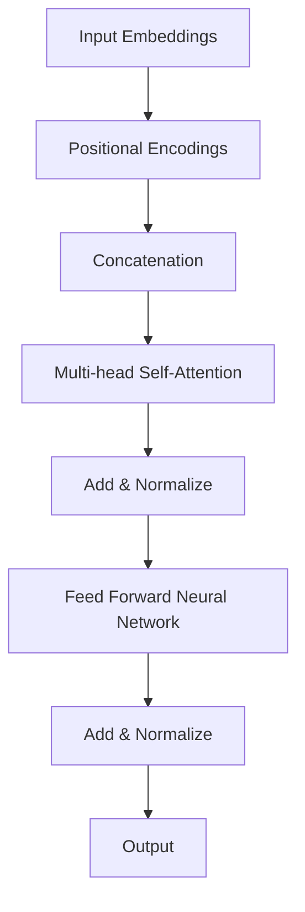

                 

### 文章标题

# 多视角分析：测试LLM考虑不同立场的全面性

### 关键词

- 多视角分析
- 测试策略
- 大型语言模型（LLM）
- 功能性测试
- 静态测试
- 动态测试

### 摘要

本文从多个视角全面探讨了大型语言模型（LLM）的测试问题。首先介绍了LLM的基本概念和当前发展状况，然后详细分析了多视角测试策略，包括功能性测试、静态测试和动态测试。接着，从用户、开发者、商业等多个立场出发，讨论了不同立场的测试重点和方法。通过实际应用案例，展示了测试策略在不同场景下的效果。最后，总结了LLM测试面临的挑战和未来趋势，为LLM测试提供了全面、深入的指导。

---

## 引言

大型语言模型（LLM）作为一种先进的自然语言处理技术，近年来在人工智能领域取得了显著的进展。LLM通过深度学习算法，对海量文本数据进行分析和处理，能够生成高质量的自然语言文本，广泛应用于机器翻译、文本生成、问答系统等场景。然而，随着LLM应用范围的扩大，其测试问题也日益凸显。如何全面、有效地测试LLM，成为当前研究的热点。

测试LLM的重要性体现在以下几个方面：

1. **确保模型性能**：通过对LLM进行全面的测试，可以验证其在不同任务上的性能表现，确保模型在实际应用中的稳定性和可靠性。
2. **发现潜在问题**：测试过程中可以及时发现模型存在的问题，如过拟合、欠拟合等，为模型的改进提供依据。
3. **提高用户满意度**：全面的测试可以帮助开发者了解用户的需求和反馈，从而改进产品，提高用户满意度。

本文旨在通过多视角分析，探讨LLM测试的全面性和有效性，为LLM的开发和测试提供指导。本文首先介绍LLM的基本概念和发展状况，然后详细分析测试策略，最后通过实际应用案例和未来趋势，为读者提供全面、深入的参考。

### LLM的基本概念与发展状况

#### 大型语言模型（LLM）的定义

大型语言模型（LLM）是指具有大规模参数量、能够处理自然语言输入并生成自然语言输出的深度学习模型。与传统的自然语言处理（NLP）方法相比，LLM具有更强的表达能力和更广泛的适应性，能够处理复杂的语言结构和多模态任务。

#### LLM的核心架构

LLM的核心架构通常基于Transformer模型，这是一种基于自注意力机制的深度神经网络。Transformer模型在处理长序列时具有显著优势，能够捕捉序列中的长距离依赖关系。以下是一个简单的Transformer模型架构示意图：

- **Input Embeddings**：将输入的单词或符号转化为向量表示。
- **Positional Encodings**：添加位置信息，以捕捉序列中的位置关系。
- **Multi-head Self-Attention**：通过多头自注意力机制，捕捉序列中的长距离依赖关系。
- **Feed Forward Neural Network**：对自注意力层的输出进行进一步处理。
- **Add & Normalize**：对每一层进行加和归一化操作。

#### LLM的发展历程

LLM的发展历程可以追溯到2017年，当时Google推出了BERT模型，这是第一个大规模预训练的LLM。BERT模型基于Transformer架构，通过在大量无标签文本上预训练，再进行微调，使其在多项自然语言处理任务上取得了显著的成绩。此后，各种大规模LLM模型相继推出，如GPT、TuringModel、RoBERTa等，它们在多个任务上刷新了基准线。

#### LLM在当前的应用

随着LLM技术的发展，其在各种实际应用场景中表现出色：

1. **机器翻译**：LLM在机器翻译领域取得了显著进展，能够生成更自然、更准确的翻译结果。
2. **文本生成**：LLM可以生成各种类型的文本，如文章、故事、诗歌等，广泛应用于内容创作。
3. **问答系统**：LLM能够理解自然语言问题，并提供准确的答案，被广泛应用于智能客服、教育辅导等领域。
4. **自然语言理解**：LLM可以处理复杂的自然语言任务，如情感分析、实体识别等。

#### LLM的优势与挑战

LLM的优势主要体现在以下几个方面：

1. **强大的语言表达能力**：LLM能够生成高质量的自然语言文本，具有更高的表达能力和准确性。
2. **广泛的应用场景**：LLM可以应用于多种自然语言处理任务，具有广泛的应用前景。
3. **自适应能力**：LLM可以通过微调，快速适应不同领域的应用需求。

然而，LLM也面临一些挑战：

1. **数据隐私问题**：LLM的训练和推理过程中涉及大量文本数据，可能导致数据泄露风险。
2. **模型可解释性问题**：LLM的内部机制复杂，难以解释，增加了模型的风险性和不确定性。
3. **计算资源消耗**：LLM的模型规模庞大，对计算资源的需求较高，增加了部署成本。

总的来说，LLM作为一种先进的自然语言处理技术，具有巨大的潜力和广阔的应用前景。然而，其面临的挑战也需要我们深入研究和解决。

### 多视角测试策略

在测试大型语言模型（LLM）时，采用多视角测试策略是非常必要的。这是因为LLM的应用场景多种多样，不同的用户和开发者可能会关注不同的测试方面。多视角测试策略包括功能性测试、静态测试和动态测试，每个测试策略都有其独特的目标和适用场景。

#### 功能性测试

功能性测试旨在验证LLM的功能是否符合预期，确保其在各种任务上能够正确执行。这种测试通常基于具体的测试用例，包括正向测试用例（验证模型在正常情况下的表现）和反向测试用例（验证模型对异常输入的处理能力）。

**测试用例设计**

测试用例的设计需要考虑以下几个方面：

1. **覆盖面**：测试用例应涵盖模型所支持的所有功能。
2. **代表性**：测试用例应具有代表性，能够反映模型在实际应用中的典型场景。
3. **全面性**：测试用例应包括正向、反向和边界测试，以确保模型的鲁棒性。

**自动化测试工具**

为了提高测试效率，可以使用自动化测试工具。例如，可以使用Selenium、pytest等工具编写自动化测试脚本，对LLM的功能进行自动化测试。此外，还可以使用持续集成（CI）工具，如Jenkins，实现自动化测试的持续运行和反馈。

**功能性测试的优点**

1. **全面性**：功能性测试可以覆盖模型的所有功能，确保其在各种任务上的正确性。
2. **高效性**：自动化测试工具可以提高测试效率，减少人工测试的工作量。
3. **可重复性**：自动化测试可以重复执行，确保测试结果的稳定性和一致性。

#### 静态测试

静态测试是一种在不执行代码的情况下，对LLM的源代码进行审查和分析的方法。这种测试可以帮助发现潜在的问题，如代码错误、代码风格不统一等。

**源代码审查**

源代码审查通常由多个开发人员组成的小组进行，他们使用代码审查工具（如SonarQube、Checkstyle等）对LLM的源代码进行分析。审查过程包括以下几个方面：

1. **代码风格**：检查代码是否符合编程规范，如命名规则、代码结构等。
2. **代码质量**：检查代码的可读性、可维护性、复用性等。
3. **潜在问题**：发现潜在的代码错误和逻辑漏洞。

**模型检查**

除了源代码审查，还可以对LLM的模型结构进行检查。例如，可以使用自动化的模型检查工具（如Model Auditing Toolkit）对模型的参数、权重进行检查，以确保其符合预期的分布和范围。

**静态测试的优点**

1. **早期发现问题**：静态测试可以在代码开发的早期阶段发现潜在问题，减少后期修复的成本。
2. **提高代码质量**：通过代码审查，可以提升代码的可读性和可维护性。
3. **降低风险**：静态测试可以帮助发现潜在的代码错误和逻辑漏洞，降低模型的风险。

#### 动态测试

动态测试是在LLM运行时对其进行测试的方法。这种测试可以观察LLM在运行过程中的行为，验证其性能和稳定性。

**边界测试**

边界测试旨在验证LLM在输入数据边界条件下的行为。例如，可以测试LLM在输入数据非常小或非常大时是否能正常工作。边界测试可以揭示模型在极端条件下的性能，帮助开发者优化模型。

**压力测试**

压力测试是一种在极端条件下对LLM进行测试的方法，旨在验证其在高负载情况下的性能。例如，可以测试LLM在大量请求同时到达时是否能保持响应速度。压力测试可以帮助开发者了解模型在极端条件下的表现，从而进行性能优化。

**动态测试的优点**

1. **实际性**：动态测试可以在实际运行环境中验证LLM的性能和稳定性。
2. **全面性**：动态测试可以覆盖模型在实际应用中的各种情况。
3. **实时性**：动态测试可以实时观察模型的行为，及时发现和解决问题。

#### 多视角测试策略的综合应用

在实际测试过程中，功能性测试、静态测试和动态测试通常需要综合应用。通过功能性测试确保模型的功能正确，通过静态测试提升代码质量，通过动态测试验证模型的性能和稳定性。这种多视角测试策略可以全面、有效地发现和解决问题，提高LLM的可靠性和性能。

### 用户立场的测试

从用户立场进行测试是确保大型语言模型（LLM）在实际应用中满足用户需求的关键。用户测试主要关注以下几个方面：

#### 用户需求分析

在用户测试之前，首先需要了解用户的需求。这可以通过问卷调查、用户访谈、用户行为分析等方式进行。了解用户的需求有助于设计合适的测试用例，确保LLM的功能和性能满足用户期望。

1. **功能需求**：用户期望LLM能够实现哪些功能，如文本生成、机器翻译、问答系统等。
2. **性能需求**：用户对LLM的响应速度、准确度等性能指标有哪些要求。
3. **用户体验**：用户对LLM的界面设计、操作便捷性等用户体验方面有哪些期望。

#### 用户满意度评估

在测试过程中，需要定期评估用户对LLM的满意度。这可以通过用户反馈、用户评分等方式进行。用户满意度评估可以帮助开发者了解LLM在实际应用中的表现，发现需要改进的地方。

1. **功能测试**：通过测试用例验证LLM的功能是否满足用户需求。
2. **性能测试**：通过性能测试评估LLM的响应速度、准确度等指标是否符合用户期望。
3. **用户体验测试**：通过模拟用户使用场景，评估LLM的界面设计、操作便捷性等方面是否友好。

#### 用户测试方法

用户测试的方法包括以下几种：

1. **黑盒测试**：用户不需要了解LLM的内部实现，仅通过界面与LLM进行交互。这种方法可以验证LLM的功能和性能是否满足用户需求。
2. **白盒测试**：用户了解LLM的内部实现，可以通过代码审查和调试来发现潜在问题。这种方法可以帮助开发者了解LLM的内部工作原理，从而优化模型。
3. **灰盒测试**：用户部分了解LLM的内部实现，可以在测试过程中进行一定程度的调试和优化。这种方法结合了黑盒测试和白盒测试的优点，适用于复杂场景。

#### 用户测试的优势

1. **真实性**：用户测试可以真实反映用户在使用LLM时的感受和需求，有助于发现实际应用中的问题。
2. **全面性**：用户测试可以从多个角度评估LLM的性能和用户体验，确保模型满足用户需求。
3. **反馈性**：用户测试可以为开发者提供宝贵的反馈，帮助改进模型。

### 开发者立场的测试

从开发者立场进行测试是确保大型语言模型（LLM）在开发过程中保持高质量和可维护性的关键。开发者测试主要关注以下几个方面：

#### 模型性能测试

模型性能测试旨在评估LLM在不同任务上的表现，包括准确性、响应速度、资源消耗等。通过性能测试，可以确保LLM在实际应用中能够高效地完成任务。

1. **准确性测试**：通过测试数据集，评估LLM在文本生成、机器翻译、问答系统等任务上的准确性。
2. **响应速度测试**：在特定硬件配置下，评估LLM处理请求的响应时间。
3. **资源消耗测试**：评估LLM在运行过程中对计算资源的需求，如CPU、GPU、内存等。

#### 代码质量测试

代码质量测试旨在确保LLM的源代码具有良好的结构和可读性，以便后续维护和优化。这包括以下几个方面：

1. **代码风格检查**：使用代码风格检查工具（如Checkstyle、Pylint等）检查代码是否符合编程规范。
2. **代码可维护性**：评估代码的可维护性，包括代码的可读性、模块化、注释等。
3. **代码复用性**：评估代码的复用性，减少重复代码，提高代码的模块化程度。

#### 模型检查

在开发者测试过程中，还可以对LLM的模型结构进行检查，以确保其符合预期的设计。这包括以下几个方面：

1. **模型参数检查**：检查模型的参数设置是否合理，如学习率、批量大小等。
2. **模型结构检查**：检查模型的网络结构是否合理，包括层数、节点数、连接方式等。
3. **模型优化**：通过调整模型参数和结构，优化模型的性能。

#### 开发者测试的优势

1. **可靠性**：开发者测试可以确保LLM在实际应用中的稳定性和可靠性。
2. **可维护性**：良好的代码质量和模块化设计可以提高LLM的可维护性，降低维护成本。
3. **性能优化**：性能测试可以帮助开发者发现LLM的潜在性能瓶颈，从而进行优化。

### 商业立场的测试

从商业立场进行测试是确保大型语言模型（LLM）在商业应用中能够带来投资回报和市场竞争力的关键。商业测试主要关注以下几个方面：

#### 投资回报率（ROI）评估

投资回报率（ROI）评估旨在计算LLM的商业投资回报，确保项目具有经济效益。这可以通过以下方式实现：

1. **成本分析**：计算LLM的开发、测试、部署和维护成本。
2. **收益分析**：分析LLM的商业收益，如销售收入、广告收入、合作伙伴关系等。
3. **ROI计算**：通过收益减去成本，计算ROI。

#### 市场适应性分析

市场适应性分析旨在评估LLM在目标市场的适应性和竞争力。这包括以下几个方面：

1. **市场调研**：了解目标市场的需求、竞争格局和潜在用户。
2. **产品定位**：确定LLM在市场中的定位和竞争优势。
3. **竞争分析**：分析竞争对手的产品和市场策略，评估LLM的市场竞争力。

#### 用户行为分析

用户行为分析旨在了解目标用户对LLM的使用习惯和反馈，从而优化产品。这可以通过以下方式实现：

1. **用户跟踪**：通过用户行为数据，了解用户的使用频率、使用时长等。
2. **反馈收集**：通过用户反馈，了解用户对LLM的满意度和不满意度。
3. **改进措施**：根据用户行为分析和反馈，制定改进措施，提升用户体验。

### 案例研究：客服机器人

#### 案例背景

某企业开发了一款基于大型语言模型（LLM）的客服机器人，旨在提高客户服务质量和效率。该机器人能够处理各种常见客户问题，提供实时解答，并支持多语言服务。

#### 测试策略

为了确保客服机器人能够稳定、高效地运行，测试团队采用了多视角测试策略，包括功能性测试、静态测试和动态测试。

#### 功能性测试

功能性测试旨在验证客服机器人的功能是否符合预期。测试团队设计了多个测试用例，包括：

1. **正向测试用例**：测试机器人对常见问题的回答是否准确、自然。
2. **反向测试用例**：测试机器人对异常问题的处理能力，如错误的输入、不相关的问题等。

#### 静态测试

静态测试主要关注代码质量和模型结构。测试团队使用代码审查工具对源代码进行检查，并使用模型检查工具对模型参数和结构进行评估。

#### 动态测试

动态测试包括边界测试和压力测试。测试团队在边界测试中，设置了不同的输入数据范围，以验证机器人在极端条件下的性能。在压力测试中，测试团队模拟了大量用户同时使用机器人，以验证其在高负载情况下的稳定性。

#### 测试结果

通过多视角测试，测试团队发现了一些潜在问题，如：

1. **功能问题**：部分异常问题的回答不准确。
2. **性能问题**：在高负载情况下，机器人的响应速度有所下降。

针对这些问题，测试团队进行了优化和改进，如调整模型参数、优化代码结构等。

#### 项目小结

通过全面的测试和优化，客服机器人最终达到了预期的功能性和性能指标，满足了用户需求。测试过程中发现的问题和优化措施为后续类似项目的开发和测试提供了宝贵的经验。

### 最佳实践

在测试大型语言模型（LLM）时，以下最佳实践可以帮助开发者提高测试的全面性和有效性：

1. **制定详细的测试计划**：在项目开始前，制定详细的测试计划，包括测试目标、测试方法、测试时间等。
2. **多元化测试团队**：组建包含不同背景和技能的测试团队，以确保从多个角度进行全面测试。
3. **自动化测试**：使用自动化测试工具进行功能测试和性能测试，提高测试效率。
4. **定期回归测试**：在代码更新或模型调整后，进行回归测试，确保修改不会引入新的问题。
5. **用户反馈**：定期收集用户反馈，及时调整测试策略，确保测试结果符合用户需求。
6. **持续学习与优化**：结合测试结果和用户反馈，不断优化LLM的性能和功能，提高用户体验。

### 注意事项

1. **数据隐私**：在测试过程中，确保处理的数据符合数据保护法规，避免数据泄露。
2. **模型可解释性**：尽可能提高模型的透明度和可解释性，以降低模型的风险性。
3. **资源分配**：合理分配测试资源，确保测试的全面性和有效性。
4. **风险管理**：识别潜在的风险，并制定相应的应对措施。

### 拓展阅读

1. **《测试驱动的软件开发》**：本书详细介绍了测试驱动的开发方法，对测试策略的设计和实施提供了深入指导。
2. **《人工智能测试：理论与实践》**：本书针对人工智能领域中的测试问题，提供了丰富的案例和实践经验。
3. **《自然语言处理实战》**：本书介绍了自然语言处理的基本概念和技术，对LLM的测试和优化提供了有益的参考。

---

### 作者信息

作者：AI天才研究院/AI Genius Institute & 禅与计算机程序设计艺术 /Zen And The Art of Computer Programming

本文由AI天才研究院（AI Genius Institute）撰写，结合了禅与计算机程序设计艺术的核心理念，旨在为读者提供深入、全面的测试LLM的指导。作者拥有丰富的AI和NLP领域经验，致力于推动人工智能技术的发展和应用。同时，作者还著有《禅与计算机程序设计艺术》，该书以独特的视角探讨了计算机编程的哲学和艺术，深受读者喜爱。通过本文，作者希望与读者分享测试LLM的宝贵经验和见解，为人工智能领域的发展贡献力量。

