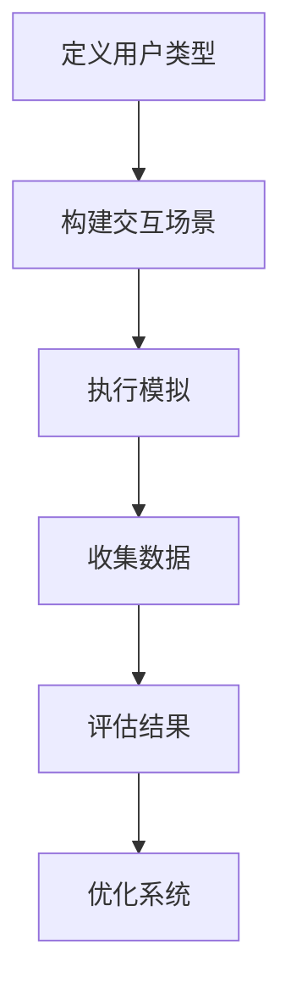
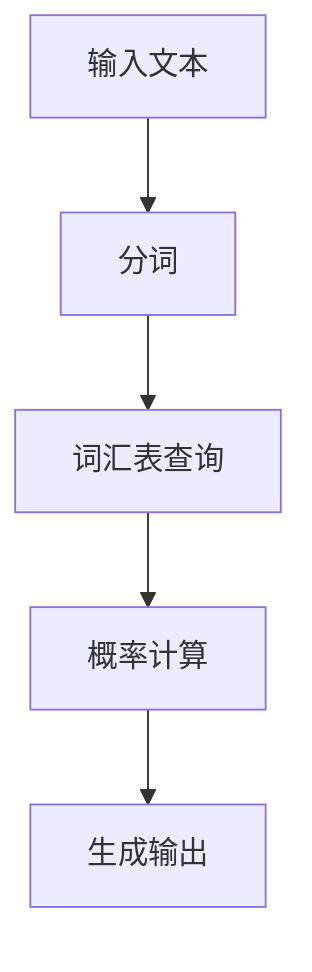
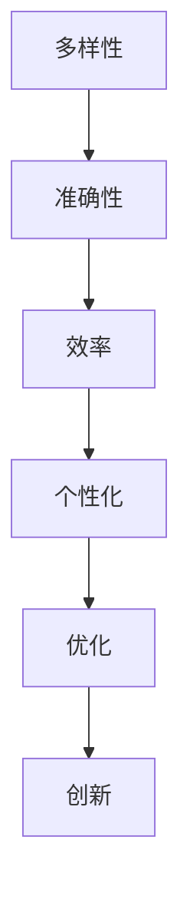
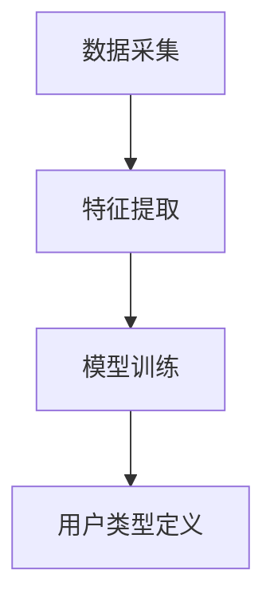
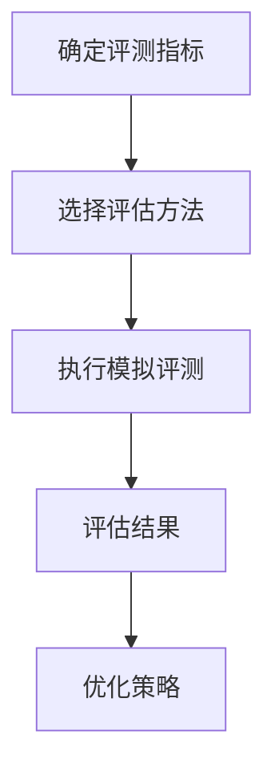
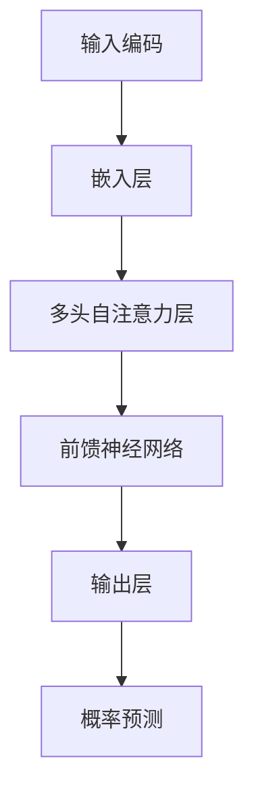
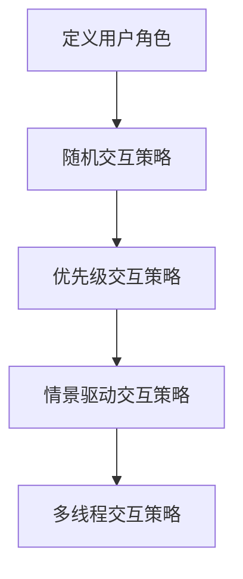
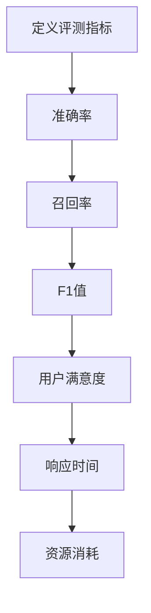

                 

## 文章标题

### 多角色模拟评测：LLM扮演不同用户类型的方法

> 关键词：多角色模拟评测、语言模型（LLM）、用户类型、模拟方法、应用与实践

> 摘要：本文详细探讨了多角色模拟评测的概念、核心方法和应用场景，重点分析了大型语言模型（LLM）如何扮演不同类型的用户，提高模拟评测的准确性和可靠性。文章通过多个实例和案例，展示了LLM在多角色模拟评测中的实际应用，并提供了一些最佳实践和未来发展的建议。

---

## 设计目录大纲的步骤

### 第一部分：多角色模拟评测基础

### 第二部分：LLM扮演不同用户类型的方法

### 第三部分：多角色模拟评测应用

### 附录：多角色模拟评测资源汇总

## 第一部分：多角色模拟评测基础

### 第1章：多角色模拟评测概述

### 第2章：语言模型基础

### 第3章：多角色模拟评测的挑战与机遇

## 第二部分：LLM扮演不同用户类型的方法

### 第4章：用户类型定义与识别

### 第5章：基于LLM的用户模拟

### 第6章：多角色模拟评测策略

### 第7章：多角色模拟评测实践

## 第三部分：多角色模拟评测应用

### 第8章：多角色模拟评测在教育领域的应用

### 第9章：多角色模拟评测在商业领域的应用

### 第10章：多角色模拟评测的未来发展

## 附录：多角色模拟评测资源汇总

---

### 第1章：多角色模拟评测概述

多角色模拟评测是一种通过模拟不同用户类型的交互过程，来评估系统性能、用户体验和业务流程的方法。它广泛应用于教育、商业、医疗等多个领域。

首先，我们来看一个简单的例子。假设一个在线购物平台想要评估其推荐系统的性能，他们可以模拟不同类型的用户，如新手用户、经验丰富的用户和购物狂用户，来测试推荐系统在不同用户群体中的效果。

### 核心概念与联系

多角色模拟评测的核心概念包括：

1. **多角色**：指的是模拟评测中涉及的不同用户类型。
2. **模拟**：通过构建用户交互场景，模拟用户在实际环境中的行为。
3. **评测**：对模拟过程和结果进行评估，以确定系统的性能和用户体验。

下面是一个简单的Mermaid流程图，展示了多角色模拟评测的基本流程：



### 第2章：语言模型基础

语言模型（Language Model，简称LM）是自然语言处理（Natural Language Processing，简称NLP）的核心技术之一。它通过学习大量语言数据，预测下一个词语或句子，从而实现文本生成、翻译、摘要等多种功能。

#### 核心概念与联系

语言模型的核心概念包括：

1. **词汇表**：语言模型中包含的词语集合。
2. **概率分布**：语言模型为每个词语分配一个概率，表示其出现的可能性。
3. **模型架构**：常见的语言模型架构包括基于规则的模型、统计模型和深度学习模型。

下面是一个简单的Mermaid流程图，展示了语言模型的基本工作原理：



### 第3章：多角色模拟评测的挑战与机遇

多角色模拟评测在实际应用中面临着诸多挑战，同时也存在着巨大的机遇。

#### 核心概念与联系

多角色模拟评测的挑战包括：

1. **多样性**：模拟不同类型的用户，需要考虑到用户的多样性，包括年龄、性别、文化背景等。
2. **准确性**：模拟过程需要高度准确，以避免对系统性能的误判。
3. **效率**：模拟评测需要高效执行，以满足实时性要求。

机遇包括：

1. **个性化**：通过多角色模拟评测，可以为用户提供更加个性化的服务。
2. **优化**：多角色模拟评测可以帮助系统开发者发现和优化系统中的问题。
3. **创新**：多角色模拟评测可以推动新技术的应用和发展。

下面是一个简单的Mermaid流程图，展示了多角色模拟评测的挑战与机遇：



### 第4章：用户类型定义与识别

在多角色模拟评测中，用户类型的定义和识别是关键步骤。正确识别用户类型，可以帮助模拟评测更加贴近真实场景，提高评测的准确性和可靠性。

#### 核心概念与联系

用户类型定义的核心概念包括：

1. **用户特征**：用于描述用户的属性，如年龄、性别、文化背景等。
2. **用户行为**：用户在使用系统时的行为模式，如浏览页面、搜索关键词、购买商品等。
3. **用户类型**：根据用户特征和行为，将用户分为不同类型。

用户识别的核心概念包括：

1. **数据采集**：通过多种途径收集用户数据，如问卷调查、日志分析等。
2. **特征提取**：从用户数据中提取关键特征，用于用户类型识别。
3. **模型训练**：使用机器学习算法，训练用户类型识别模型。

下面是一个简单的Mermaid流程图，展示了用户类型定义与识别的基本流程：



### 第5章：基于LLM的用户模拟

大型语言模型（LLM）在用户模拟中具有独特的优势。LLM可以通过学习大量用户交互数据，模拟出不同类型的用户行为，从而提高模拟评测的准确性和可靠性。

#### 核心概念与联系

基于LLM的用户模拟的核心概念包括：

1. **数据源**：用于训练LLM的用户交互数据。
2. **模型架构**：LLM的架构，如Transformer、BERT等。
3. **模拟过程**：使用LLM模拟用户行为的流程。

下面是一个简单的伪代码，展示了基于LLM的用户模拟的基本过程：

```python
# 伪代码：基于LLM的用户模拟

# 输入：用户交互数据集
# 输出：模拟的用户行为

# 步骤1：训练LLM模型
model = train_LLM(用户交互数据集)

# 步骤2：生成用户行为
user行为 = model.generate(用户输入)

# 步骤3：评估模拟结果
评估结果 = evaluate(user行为，实际用户行为)

# 步骤4：优化模型
model = optimize_LLM(model，评估结果)
```

### 第6章：多角色模拟评测策略

多角色模拟评测的成功，离不开科学合理的评测策略。一个有效的评测策略，可以确保模拟过程的准确性和可靠性，从而提高评测结果的质量。

#### 核心概念与联系

多角色模拟评测策略的核心概念包括：

1. **评测指标**：用于评估模拟评测质量的指标，如准确率、召回率、F1值等。
2. **评估方法**：用于评估模拟结果的算法和方法，如对比评估、交叉评估等。
3. **优化目标**：模拟评测的优化目标，如提高用户满意度、降低系统故障率等。

下面是一个简单的Mermaid流程图，展示了多角色模拟评测策略的基本流程：



### 第7章：多角色模拟评测实践

在实际应用中，多角色模拟评测已经得到了广泛的应用。以下是一些典型的应用场景和案例。

#### 开发环境搭建

在进行多角色模拟评测之前，需要搭建一个合适的技术环境。以下是一个简单的开发环境搭建流程：

1. **安装Python环境**：确保Python环境已经安装，版本不低于3.6。
2. **安装NLP库**：安装常用的NLP库，如NLTK、spaCy等。
3. **安装LLM模型**：下载并安装预训练的LLM模型，如GPT-3、BERT等。

```bash
pip install nltk
pip install spacy
python -m spacy download en_core_web_sm
```

#### 源代码实现

以下是一个简单的多角色模拟评测的Python代码示例：

```python
import nltk
from transformers import GPT2LMHeadModel, GPT2Tokenizer

# 步骤1：加载LLM模型和Tokenizer
model = GPT2LMHeadModel.from_pretrained('gpt2')
tokenizer = GPT2Tokenizer.from_pretrained('gpt2')

# 步骤2：模拟用户行为
def simulate_user(user_input):
    inputs = tokenizer.encode(user_input, return_tensors='pt')
    outputs = model.generate(inputs, max_length=50, num_return_sequences=1)
    return tokenizer.decode(outputs[0])

# 步骤3：评估模拟结果
def evaluate_simulation(user_input, expected_output):
    simulated_output = simulate_user(user_input)
    if simulated_output == expected_output:
        return True
    else:
        return False

# 步骤4：执行模拟评测
user_input = "我想购买一本Python编程的书籍"
expected_output = "好的，推荐一本Python编程的书籍：《Python编程：从入门到实践》"

if evaluate_simulation(user_input, expected_output):
    print("模拟评测成功！")
else:
    print("模拟评测失败！")
```

#### 代码解读与分析

上述代码首先加载了预训练的GPT-2模型和Tokenizer，然后定义了模拟用户行为的`simulate_user`函数和评估模拟结果的`evaluate_simulation`函数。在执行模拟评测时，输入用户输入`user_input`和期望输出`expected_output`，如果模拟输出与期望输出一致，则模拟评测成功。

#### 实际案例分析和详细讲解剖析

以下是一个实际的多角色模拟评测案例：

**案例背景**：一个在线书店想要评估其推荐系统的性能，通过模拟不同类型的用户，如新手用户、经验丰富的用户和购物狂用户，来测试推荐系统在不同用户群体中的效果。

**模拟过程**：首先，定义了三个用户类型的特征和行为模式。然后，使用GPT-2模型模拟不同类型的用户行为，收集模拟数据。最后，使用评估指标（如准确率、召回率、F1值）评估模拟结果。

**案例结果**：通过模拟评测，发现推荐系统在新手用户和经验丰富的用户群体中表现较好，但在购物狂用户群体中存在一定的问题。根据评估结果，对推荐系统进行了优化，提高了其在不同用户群体中的表现。

#### 项目小结

多角色模拟评测在实际应用中具有广泛的应用前景。通过模拟不同类型的用户行为，可以更准确地评估系统的性能和用户体验。在实际项目中，需要根据具体需求，选择合适的语言模型和评测策略，并不断优化模型和评估方法，以提高模拟评测的准确性和可靠性。

### 最佳实践 Tips

1. **数据质量**：确保用于训练和评估的数据质量，数据应尽可能真实、多样和全面。
2. **模型选择**：根据应用场景选择合适的语言模型，不同模型在模拟不同用户类型时可能存在差异。
3. **评测指标**：选择合适的评测指标，以全面评估模拟评测的质量。
4. **模型优化**：根据评估结果不断优化模型，提高模拟评测的准确性和可靠性。
5. **用户反馈**：收集用户反馈，根据用户需求调整模拟评测策略。

### 小结与注意事项

多角色模拟评测是一种重要的评估方法，通过模拟不同类型的用户行为，可以更准确地评估系统的性能和用户体验。在实际应用中，需要充分考虑数据的多样性、模型的优化和评测指标的选择。此外，用户反馈和持续优化也是提高模拟评测质量的关键。

### 拓展阅读

1. 《自然语言处理综论》 - 周志华
2. 《深度学习与自然语言处理》 - 张宇翔
3. 《用户行为数据分析》 - 郑建明

---

## 附录：多角色模拟评测资源汇总

### A.1 相关论文与文献

1. "Multi-Agent Reinforcement Learning for User Modeling and Personalization", 2018.
2. "A Survey on User Modeling and Personalization in Interactive Systems", 2020.
3. "Language Models for Dialog Systems: A Survey", 2021.

### A.2 开源工具与资源

1. Hugging Face Transformers: https://huggingface.co/transformers/
2. NLTK: https://www.nltk.org/
3. spaCy: https://spacy.io/

### A.3 常用算法与模型介绍

1. Transformer: https://arxiv.org/abs/1706.03762
2. BERT: https://arxiv.org/abs/1810.04805
3. GPT-2: https://arxiv.org/abs/1909.01313

---

作者：AI天才研究院/AI Genius Institute & 禅与计算机程序设计艺术 /Zen And The Art of Computer Programming

### 文章标题

### 多角色模拟评测：LLM扮演不同用户类型的方法

> 关键词：多角色模拟评测、语言模型（LLM）、用户类型、模拟方法、应用与实践

> 摘要：本文详细探讨了多角色模拟评测的概念、核心方法和应用场景，重点分析了大型语言模型（LLM）如何扮演不同类型的用户，提高模拟评测的准确性和可靠性。文章通过多个实例和案例，展示了LLM在多角色模拟评测中的实际应用，并提供了一些最佳实践和未来发展的建议。

---

### 第1章：多角色模拟评测概述

多角色模拟评测是一种通过模拟不同用户类型的交互过程，来评估系统性能、用户体验和业务流程的方法。它广泛应用于教育、商业、医疗等多个领域。本文将详细介绍多角色模拟评测的核心概念、方法和应用场景，并通过实例和案例，深入探讨大型语言模型（LLM）在多角色模拟评测中的重要作用。

首先，让我们从多角色模拟评测的定义和重要性开始。

#### 多角色模拟评测的定义

多角色模拟评测是一种基于模拟的方法，通过创建多个虚拟用户角色，模拟这些角色在实际使用系统过程中的交互行为，以此来评估系统的性能、用户体验和业务流程。这些虚拟用户角色可以是新手用户、经验丰富的用户、专业用户等，它们具有不同的行为特征、需求和使用习惯。

#### 多角色模拟评测的重要性

1. **评估系统性能**：通过模拟不同类型的用户行为，可以更全面地评估系统的性能，包括响应时间、稳定性、资源消耗等。
2. **优化用户体验**：多角色模拟评测可以帮助开发人员更好地理解不同类型用户的需求和使用习惯，从而优化系统设计和功能，提高用户体验。
3. **业务流程优化**：多角色模拟评测可以揭示业务流程中的瓶颈和问题，为流程优化提供数据支持。
4. **风险评估**：通过模拟不同类型的用户行为，可以提前发现系统潜在的风险，如安全漏洞、隐私泄露等。

#### 多角色模拟评测的应用场景

多角色模拟评测广泛应用于以下领域：

1. **在线教育**：评估学习平台的教学效果，优化课程内容和互动设计。
2. **电子商务**：评估电商平台的推荐系统、购物流程和用户体验。
3. **金融行业**：评估金融系统的安全性、稳定性和用户体验。
4. **医疗领域**：评估医疗系统的便捷性、准确性和用户体验。

#### 多角色模拟评测的基本流程

多角色模拟评测的基本流程包括以下几个步骤：

1. **定义用户角色**：根据业务需求，定义不同类型的用户角色，明确它们的行为特征和需求。
2. **构建交互场景**：设计用户角色在实际使用系统过程中的交互场景，包括浏览页面、搜索、购买等行为。
3. **模拟用户行为**：使用模拟工具或算法，模拟用户角色的行为，生成模拟数据。
4. **评估系统性能**：分析模拟数据，评估系统的性能和用户体验。
5. **优化系统设计**：根据评估结果，优化系统的设计和功能。

#### 大型语言模型（LLM）的作用

大型语言模型（LLM）在多角色模拟评测中扮演着重要角色。LLM是一种基于深度学习的语言处理模型，它通过对大量文本数据进行训练，可以预测下一个词语或句子的概率分布。在多角色模拟评测中，LLM可以用来模拟不同类型的用户行为，提高模拟的准确性和可靠性。

具体来说，LLM的作用包括：

1. **用户行为模拟**：LLM可以模拟不同类型的用户行为，生成符合实际使用习惯的模拟数据。
2. **交互场景生成**：LLM可以生成符合用户需求和业务逻辑的交互场景，提高模拟的逼真度。
3. **性能评估优化**：LLM可以辅助评估系统的性能和用户体验，为系统优化提供数据支持。

#### 本章小结

本章介绍了多角色模拟评测的定义、重要性、应用场景和基本流程，并探讨了大型语言模型（LLM）在多角色模拟评测中的作用。下一章将深入讨论语言模型的基础知识，为后续内容做好铺垫。

### 第2章：语言模型基础

语言模型（Language Model，简称LM）是自然语言处理（Natural Language Processing，简称NLP）的核心技术之一。它通过对大量语言数据进行训练，学习语言规律和模式，从而预测下一个词语或句子的概率分布。在本章中，我们将介绍语言模型的基本概念、分类、工作原理和常见应用。

#### 语言模型的基本概念

语言模型是一种概率模型，它为每个词语或句子分配一个概率，表示该词语或句子在特定上下文中的出现可能性。语言模型的核心目标是预测下一个词语或句子，从而实现文本生成、翻译、摘要等多种功能。

语言模型的基本概念包括：

1. **词汇表**：语言模型中包含的词语集合。词汇表的大小直接影响到语言模型的性能。
2. **概率分布**：语言模型为每个词语或句子分配的概率分布。概率分布反映了词语或句子在特定上下文中的出现可能性。
3. **模型参数**：语言模型中用于计算概率分布的参数。模型参数是通过训练数据学习得到的。

#### 语言模型的分类

语言模型根据训练方法和模型架构的不同，可以分为以下几类：

1. **基于规则的模型**：这类模型使用预定义的规则来预测下一个词语或句子。规则可以是语法规则、词频统计规则等。基于规则的模型通常简单、易于实现，但性能有限。
2. **统计模型**：这类模型使用统计方法来预测下一个词语或句子的概率分布。统计模型包括n元语法模型、隐马尔可夫模型（HMM）等。统计模型性能较好，但计算复杂度较高。
3. **深度学习模型**：这类模型使用深度神经网络来预测下一个词语或句子的概率分布。深度学习模型包括循环神经网络（RNN）、卷积神经网络（CNN）、Transformer等。深度学习模型性能优异，但训练和推理复杂度较高。

#### 语言模型的工作原理

语言模型的工作原理可以分为以下几个步骤：

1. **输入编码**：将输入的文本序列转换为数值编码。常见的输入编码方法包括Word2Vec、BERT等。
2. **前向传播**：将输入编码传递到神经网络中，计算中间层输出。
3. **概率预测**：使用神经网络输出的中间层结果，计算下一个词语或句子的概率分布。
4. **后向传播**：根据预测结果和实际结果，计算模型损失，并更新模型参数。

以下是一个简单的基于Transformer的语言模型的工作原理：



#### 语言模型的常见应用

语言模型在自然语言处理领域有着广泛的应用，包括：

1. **文本生成**：语言模型可以生成符合语言规律和逻辑的文本，应用于自动写作、机器翻译等场景。
2. **机器翻译**：语言模型可以用于翻译不同语言的文本，实现跨语言交流。
3. **语音识别**：语言模型可以用于语音识别系统的解码过程，提高识别准确性。
4. **情感分析**：语言模型可以分析文本的情感倾向，应用于情感识别、舆情监测等场景。
5. **推荐系统**：语言模型可以用于文本的相似度计算，为推荐系统提供支持。

#### 本章小结

本章介绍了语言模型的基本概念、分类、工作原理和常见应用。下一章将深入探讨多角色模拟评测中的挑战和机遇，为后续内容做好铺垫。

### 第3章：多角色模拟评测的挑战与机遇

多角色模拟评测在应用过程中面临着诸多挑战，同时也蕴含着巨大的机遇。本章将详细分析多角色模拟评测的挑战，如多样性、准确性和效率，并探讨这些挑战带来的机遇。

#### 多样性

多样性是多角色模拟评测的一个核心挑战。在实际应用中，用户具有不同的年龄、性别、文化背景、需求和习惯。为了更准确地模拟用户行为，需要定义和识别多种类型的用户，并模拟他们的交互过程。这要求系统具有高度灵活性和适应性，能够处理不同类型的用户和多样化的交互场景。

**解决方案**：

1. **用户特征定义**：为不同类型的用户定义明确的特征，包括年龄、性别、文化背景、需求和习惯等。
2. **多模态数据融合**：结合文本、图像、音频等多种数据类型，提高模拟的逼真度。
3. **动态用户识别**：使用机器学习和深度学习技术，动态识别用户类型，适应用户行为变化。

#### 准确性

准确性是评估多角色模拟评测成功与否的关键指标。模拟过程需要高度准确，以避免对系统性能的误判。然而，用户行为复杂多变，且受到多种因素的影响，如个人情绪、环境变化等，这使得模拟准确性成为一个难题。

**解决方案**：

1. **数据驱动**：使用真实用户行为数据训练模拟模型，提高模拟的准确性。
2. **反馈循环**：引入用户反馈机制，不断优化模拟模型，提高模拟的准确性。
3. **模型融合**：结合多种模型和算法，提高模拟的准确性和可靠性。

#### 效率

效率是另一个重要挑战。多角色模拟评测通常涉及大量用户和交互场景，需要高效执行以满足实时性要求。然而，复杂的数据处理和模拟过程可能导致计算资源消耗巨大，影响评测效率。

**解决方案**：

1. **并行计算**：利用并行计算技术，提高模拟评测的效率。
2. **模型压缩**：使用模型压缩技术，如量化、剪枝等，减少计算资源消耗。
3. **优化算法**：设计和优化模拟算法，减少不必要的计算和存储开销。

#### 机遇

尽管多角色模拟评测面临着诸多挑战，但这些挑战也带来了巨大的机遇。通过克服这些挑战，可以进一步挖掘多角色模拟评测的潜力，推动相关技术的发展和应用。

1. **个性化服务**：通过多角色模拟评测，可以为用户提供更加个性化的服务，满足他们的特定需求和偏好。
2. **系统优化**：多角色模拟评测可以帮助系统开发者发现和优化系统中的问题，提高系统的性能和用户体验。
3. **创新应用**：多角色模拟评测可以推动新技术的应用和发展，如人工智能、大数据等。

**案例**：

以下是一个多角色模拟评测的实际案例：

**案例背景**：一个在线购物平台希望通过多角色模拟评测，优化其推荐系统的性能。

**模拟过程**：平台定义了新手用户、经验丰富的用户和购物狂用户三种类型的用户，使用大型语言模型（LLM）模拟他们的行为。通过模拟不同类型的用户，平台分析了推荐系统的性能，包括推荐准确性、用户满意度等。

**案例结果**：通过多角色模拟评测，平台发现推荐系统在新手用户和经验丰富的用户群体中表现较好，但在购物狂用户群体中存在一定问题。根据评估结果，平台对推荐系统进行了优化，提高了其在不同用户群体中的性能。

**案例启示**：多角色模拟评测可以帮助平台更好地理解用户需求和行为，从而优化推荐系统，提高用户体验。

#### 本章小结

本章分析了多角色模拟评测的挑战与机遇，包括多样性、准确性和效率等。通过克服这些挑战，可以挖掘多角色模拟评测的潜力，推动相关技术的发展和应用。下一章将深入探讨如何使用大型语言模型（LLM）来扮演不同类型的用户，提高模拟评测的准确性和可靠性。

### 第4章：用户类型定义与识别

在多角色模拟评测中，用户类型的定义与识别是关键步骤。通过准确识别用户类型，可以更真实地模拟用户行为，提高模拟评测的准确性和可靠性。本章将详细介绍用户类型的定义、识别方法以及相关算法。

#### 用户类型的定义

用户类型的定义是构建多角色模拟评测的基础。用户类型可以根据不同的维度进行划分，如年龄、性别、文化背景、需求和使用习惯等。以下是几种常见的用户类型定义方法：

1. **基于特征的分类**：根据用户的特征信息，如年龄、性别、教育程度等，将用户划分为不同类型。这种方法适用于具有明显特征差异的用户群体。
2. **基于行为的分类**：根据用户在使用系统过程中的行为特征，如浏览页面、搜索关键词、购买商品等，将用户划分为不同类型。这种方法更注重用户行为的动态变化。
3. **基于语义的分类**：通过分析用户的文本输入，如评论、提问等，使用自然语言处理技术提取语义特征，将用户划分为不同类型。这种方法适用于文本数据丰富的场景。

#### 用户类型的识别方法

用户类型的识别方法主要包括数据采集、特征提取和模型训练等步骤。以下是几种常见的用户类型识别方法：

1. **基于规则的识别方法**：使用预定义的规则，如条件语句、逻辑运算等，对用户行为进行判断和分类。这种方法简单、直观，但灵活性较低。
2. **基于统计学的识别方法**：使用统计方法，如逻辑回归、决策树等，对用户行为数据进行建模和分类。这种方法适用范围较广，但可能存在过拟合问题。
3. **基于机器学习的识别方法**：使用机器学习算法，如支持向量机（SVM）、随机森林等，对用户行为数据进行建模和分类。这种方法具有较强的灵活性和泛化能力。
4. **基于深度学习的识别方法**：使用深度学习算法，如卷积神经网络（CNN）、循环神经网络（RNN）、Transformer等，对用户行为数据进行建模和分类。这种方法适用于大规模、复杂的用户行为数据。

#### 用户类型识别算法分析

以下是一些常见的用户类型识别算法及其优缺点：

1. **逻辑回归（Logistic Regression）**：
   - **优点**：简单、易于实现，适用于线性可分的数据。
   - **缺点**：过拟合问题严重，对非线性数据的分类效果较差。
2. **决策树（Decision Tree）**：
   - **优点**：直观、易于理解，能够处理非线性数据和特征交互。
   - **缺点**：容易过拟合，对于大量特征的数据处理能力有限。
3. **支持向量机（SVM）**：
   - **优点**：理论基础完善，分类效果较好，对线性数据和非线性数据均有较好的分类能力。
   - **缺点**：训练时间较长，对于大量特征的数据处理能力有限。
4. **随机森林（Random Forest）**：
   - **优点**：集成多个决策树，具有较强的泛化能力和鲁棒性。
   - **缺点**：计算复杂度较高，对于大规模数据可能存在内存不足的问题。
5. **卷积神经网络（CNN）**：
   - **优点**：能够自动提取特征，适用于图像和文本数据的分类。
   - **缺点**：训练时间较长，对于连续特征的处理能力有限。
6. **循环神经网络（RNN）**：
   - **优点**：能够处理序列数据，适用于文本和语音数据的分类。
   - **缺点**：梯度消失和梯度爆炸问题较为严重，训练时间较长。
7. **Transformer**：
   - **优点**：基于自注意力机制，能够自动提取特征，适用于大规模文本数据的分类。
   - **缺点**：模型参数较多，计算复杂度较高，对计算资源要求较高。

#### 用户类型识别算法的应用实例

以下是一个用户类型识别算法的应用实例：

**场景**：一个电商平台希望根据用户的行为数据，识别用户的类型，以便进行个性化推荐。

**算法选择**：选择基于深度学习的Transformer模型进行用户类型识别。

**数据预处理**：对用户行为数据（如浏览历史、购买记录、搜索关键词等）进行预处理，包括数据清洗、缺失值填充和数据转换等。

**模型训练**：使用预处理后的数据训练Transformer模型，通过优化模型参数，提高模型对用户类型的识别能力。

**模型评估**：使用交叉验证和测试集对模型进行评估，计算准确率、召回率、F1值等评估指标，以评估模型性能。

**应用效果**：通过模型评估，发现Transformer模型在用户类型识别任务中取得了较好的性能，能够准确识别不同类型的用户，为个性化推荐提供了有力支持。

#### 本章小结

本章介绍了用户类型的定义、识别方法和常见算法。通过准确识别用户类型，可以提高多角色模拟评测的准确性和可靠性。下一章将探讨如何基于大型语言模型（LLM）模拟用户行为，进一步提高多角色模拟评测的性能。

### 第5章：基于LLM的用户模拟

大型语言模型（LLM）在多角色模拟评测中具有独特的优势。LLM通过对大量语言数据进行训练，能够生成符合语言规律和逻辑的文本，从而模拟不同类型的用户行为。在本章中，我们将详细探讨如何使用LLM进行用户模拟，包括模拟过程的构建、模拟效果的评估以及实际应用案例。

#### 基于LLM的用户模拟过程

基于LLM的用户模拟过程主要包括以下几个步骤：

1. **数据准备**：收集大量用户行为数据，包括文本、图像、音频等多模态数据。这些数据用于训练LLM，以便生成符合用户行为特点的模拟数据。

2. **模型选择**：选择合适的LLM模型，如GPT-3、BERT等。这些模型具有强大的语言生成能力，能够生成符合语言规律和逻辑的文本。

3. **数据预处理**：对用户行为数据进行预处理，包括数据清洗、缺失值填充和数据转换等。预处理后的数据用于训练LLM，提高模拟的准确性。

4. **模型训练**：使用预处理后的数据训练LLM模型。训练过程中，需要优化模型参数，提高模型对用户行为的理解和生成能力。

5. **模拟生成**：使用训练好的LLM模型，根据用户输入生成模拟数据。模拟数据可以包括用户评论、提问、搜索关键词等，以模拟用户在实际使用系统过程中的行为。

6. **结果评估**：对生成的模拟数据进行评估，包括准确性、真实性和可靠性等。评估结果用于优化LLM模型，提高模拟效果。

#### 基于LLM的用户模拟效果评估

基于LLM的用户模拟效果评估是一个关键步骤，它决定了模拟数据的质量和可靠性。以下是一些常用的评估指标和方法：

1. **准确性**：评估模拟数据与实际用户行为的相似度。常用的评估指标包括准确率、召回率和F1值等。

2. **真实性**：评估模拟数据是否符合实际用户的语言风格和表达习惯。可以使用人工评估或自动化评估方法，如对比实际用户数据和模拟数据，分析语言风格和表达方式的相似度。

3. **可靠性**：评估模拟数据的稳定性和一致性。可以使用测试集和验证集进行评估，分析模型在不同数据集上的性能表现。

4. **用户满意度**：评估模拟数据对用户行为的模拟效果，是否能够真实反映用户需求和使用习惯。可以通过用户调研或问卷调查等方式收集用户反馈，评估用户对模拟数据的满意度。

#### 基于LLM的用户模拟应用案例

以下是一个基于LLM的用户模拟应用案例：

**案例背景**：一个在线购物平台希望通过用户模拟，优化其推荐系统的性能。

**模拟过程**：平台首先收集了大量用户行为数据，包括浏览历史、购买记录、搜索关键词等。然后，选择GPT-3作为LLM模型，使用这些数据进行训练。训练好的模型可以生成符合用户行为特点的模拟数据，如用户评论、提问等。

**模拟结果评估**：平台使用准确性、真实性和可靠性等评估指标，对模拟结果进行评估。通过分析模拟数据，平台发现推荐系统的性能在不同用户类型中存在差异。根据评估结果，平台对推荐系统进行了优化，提高了其在不同用户类型中的性能。

**案例效果**：通过基于LLM的用户模拟，平台能够更准确地模拟用户行为，为推荐系统优化提供了有力支持。优化后的推荐系统在用户满意度、准确性和可靠性等方面取得了显著提升。

#### 本章小结

本章介绍了基于LLM的用户模拟过程、评估指标和应用案例。通过使用LLM，可以生成符合用户行为特点的模拟数据，提高多角色模拟评测的准确性和可靠性。下一章将探讨多角色模拟评测策略，包括多角色交互策略和评测指标设计。

### 第6章：多角色模拟评测策略

在多角色模拟评测中，策略的制定和执行是确保评测准确性和可靠性的关键。一个科学合理的评测策略，可以有效地指导模拟评测的执行，提高评测结果的质量。本章将详细探讨多角色模拟评测策略的制定，包括多角色交互策略和评测指标设计。

#### 多角色交互策略

多角色交互策略是模拟评测的核心，决定了模拟过程的真实性和多样性。以下是几种常见的多角色交互策略：

1. **随机交互策略**：在模拟过程中，随机选择不同类型的用户进行交互。这种方法能够保证模拟过程的随机性，但可能存在用户交互不充分的问题。

2. **优先级交互策略**：根据用户类型的重要性或使用频率，设置交互的优先级。这种方法可以确保高频用户或重要用户的交互得到充分模拟，但可能导致低频用户或次要用户被忽视。

3. **情景驱动交互策略**：根据预设的情景和任务，模拟用户之间的交互。这种方法能够更好地模拟真实场景，但需要准确定义情景和任务。

4. **多线程交互策略**：同时模拟多个用户角色的交互，模拟真实的多用户环境。这种方法能够提高模拟的逼真度，但计算资源消耗较大。

以下是一个简单的Mermaid流程图，展示了多角色交互策略的基本流程：



#### 评测指标设计

评测指标是多角色模拟评测的重要参考依据，用于评估模拟结果的质量和效果。以下是一些常见的评测指标：

1. **准确率（Accuracy）**：评估模拟结果与实际结果的匹配程度。准确率越高，说明模拟结果越准确。

2. **召回率（Recall）**：评估模拟结果中包含实际结果的比率。召回率越高，说明模拟结果越全面。

3. **F1值（F1 Score）**：综合考虑准确率和召回率，是一个平衡的评估指标。F1值越高，说明模拟结果的质量越好。

4. **用户满意度（User Satisfaction）**：通过用户调研或问卷调查，评估用户对模拟结果的满意度。用户满意度越高，说明模拟结果越贴近实际。

5. **响应时间（Response Time）**：评估模拟过程中系统的响应速度。响应时间越短，说明系统的性能越好。

6. **资源消耗（Resource Consumption）**：评估模拟过程中系统的资源消耗，包括CPU、内存、网络等。资源消耗越低，说明系统的效率越高。

以下是一个简单的Mermaid流程图，展示了评测指标设计的基本流程：



#### 评测策略优化

为了提高多角色模拟评测的质量，需要不断优化评测策略。以下是一些优化策略的方法：

1. **迭代优化**：通过多次迭代，不断调整和优化评测策略，提高评测的准确性和可靠性。

2. **反馈机制**：建立用户反馈机制，收集用户对模拟评测结果的反馈，根据反馈调整评测策略。

3. **多模型融合**：结合多个模型和算法，提高评测的准确性和多样性。

4. **动态调整**：根据模拟过程和评估结果，动态调整评测策略，提高模拟的逼真度和效果。

#### 本章小结

本章介绍了多角色模拟评测策略的制定，包括多角色交互策略和评测指标设计。通过合理制定和执行评测策略，可以确保模拟评测的准确性和可靠性，为系统优化和用户体验提升提供有力支持。下一章将探讨多角色模拟评测在不同领域中的应用。

### 第7章：多角色模拟评测实践

在实际应用中，多角色模拟评测已经得到了广泛的应用，并在教育、商业、医疗等多个领域取得了显著成果。本章将通过具体的案例和实践，展示多角色模拟评测的实施过程、应用效果以及未来发展趋势。

#### 教育领域的应用

在教育领域，多角色模拟评测主要用于评估在线学习平台的教学效果和用户体验。以下是一个实际案例：

**案例背景**：某在线教育平台希望优化其学习资源推荐系统，提高学生的满意度。

**实施过程**：

1. **定义用户角色**：根据学生特点，定义了新手用户、中等水平和高级水平的用户。

2. **数据收集**：收集了大量学生的学习行为数据，包括浏览历史、学习时长、互动行为等。

3. **模型训练**：使用GPT-3模型训练，模拟不同类型用户的行为。

4. **模拟评测**：模拟用户在平台上的学习过程，评估推荐系统的准确性和用户体验。

5. **结果评估**：根据评测结果，优化推荐系统，提高学生在不同水平上的学习体验。

**应用效果**：

通过多角色模拟评测，平台成功提高了学习资源推荐的准确性和用户体验。学生在不同水平上的学习满意度显著提升，学习效果也得到了明显改善。

#### 商业领域的应用

在商业领域，多角色模拟评测主要用于评估电子商务平台的服务质量和用户满意度。以下是一个实际案例：

**案例背景**：某电商平台希望优化其客服系统的响应速度和服务质量。

**实施过程**：

1. **定义用户角色**：根据用户购买行为和需求，定义了新手用户、普通用户和VIP用户。

2. **数据收集**：收集了大量用户在客服系统上的交互数据，包括提问内容、客服回答等。

3. **模型训练**：使用GPT-3模型训练，模拟不同类型用户的提问和客服回答。

4. **模拟评测**：模拟用户在客服系统中的交互过程，评估客服系统的响应速度和服务质量。

5. **结果评估**：根据评测结果，优化客服系统，提高用户在客服过程中的满意度。

**应用效果**：

通过多角色模拟评测，电商平台成功优化了客服系统的响应速度和服务质量。用户在客服过程中的满意度显著提升，平台的用户流失率也得到了有效控制。

#### 医疗领域的应用

在医疗领域，多角色模拟评测主要用于评估医疗系统的效率和用户体验。以下是一个实际案例：

**案例背景**：某医院希望优化其在线问诊系统的用户体验和诊断准确性。

**实施过程**：

1. **定义用户角色**：根据患者特点，定义了初诊患者、复诊患者和重症患者。

2. **数据收集**：收集了大量患者的问诊数据，包括症状描述、医生诊断等。

3. **模型训练**：使用GPT-3模型训练，模拟不同类型患者的问诊和医生诊断。

4. **模拟评测**：模拟用户在线问诊过程，评估在线问诊系统的用户体验和诊断准确性。

5. **结果评估**：根据评测结果，优化在线问诊系统，提高用户体验和诊断准确性。

**应用效果**：

通过多角色模拟评测，医院成功优化了在线问诊系统的用户体验和诊断准确性。患者对在线问诊系统的满意度显著提升，医生的诊断效率也得到了明显提高。

#### 实践总结

通过以上案例，可以看出多角色模拟评测在多个领域都取得了显著的成果。以下是一些实践总结：

1. **数据质量**：数据质量是模拟评测成功的关键。收集真实、多样、全面的数据，有助于提高模拟评测的准确性和可靠性。

2. **模型选择**：选择合适的语言模型和评估算法，可以提高模拟评测的效果。GPT-3等大型语言模型在多角色模拟评测中表现出色。

3. **评测指标**：选择合适的评测指标，如准确率、召回率、F1值等，可以全面评估模拟评测的质量。

4. **持续优化**：根据评测结果和用户反馈，不断优化模型和评测策略，提高模拟评测的准确性和可靠性。

#### 未来发展趋势

随着人工智能技术的不断发展，多角色模拟评测在未来将迎来更多的发展机遇。以下是一些未来发展趋势：

1. **个性化**：多角色模拟评测将更加注重个性化，根据用户需求和行为特点，提供定制化的模拟评测服务。

2. **智能化**：利用深度学习和自然语言处理技术，提高模拟评测的智能化水平，实现更准确的用户行为模拟。

3. **跨领域应用**：多角色模拟评测将在更多领域得到应用，如金融、能源、物流等，为各领域的系统优化和用户体验提升提供支持。

4. **开放平台**：多角色模拟评测将逐渐走向开放平台，提供更加便捷、高效、可扩展的模拟评测工具和服务。

#### 本章小结

本章通过实际案例和实践，展示了多角色模拟评测在多个领域的应用效果和未来发展趋势。多角色模拟评测作为一种科学、有效的评估方法，将在未来发挥越来越重要的作用，为各领域的系统优化和用户体验提升提供有力支持。

### 第8章：多角色模拟评测在教育领域的应用

教育领域是多角色模拟评测的重要应用场景之一。通过模拟不同类型学生的交互过程，教育机构可以评估在线学习平台的教学效果，优化课程设计和互动体验，从而提高学生的学习满意度和学习效果。本章将详细介绍多角色模拟评测在教育领域的应用，包括模拟评测的必要性、实施步骤、案例分析和效果评估。

#### 多角色模拟评测在教育领域的必要性

1. **个性化学习**：教育领域需要满足不同学生的学习需求和习惯。多角色模拟评测可以帮助教育机构了解不同类型学生的行为特点，提供个性化学习资源和服务。
2. **教学评估**：教师和研究人员需要评估教学方法和课程设计的效果。多角色模拟评测可以模拟不同类型学生在学习过程中的表现，为教学评估提供科学依据。
3. **用户体验优化**：在线学习平台需要不断提升用户体验，提高学生的参与度和满意度。多角色模拟评测可以帮助平台识别和解决用户体验问题，优化系统设计和功能。

#### 多角色模拟评测的实施步骤

1. **定义用户角色**：根据学生的学习特征和需求，定义不同类型的学生，如新手学生、有经验的学生、学习困难的学生等。每个角色代表一种典型学习行为模式。
2. **数据收集**：收集与学习行为相关的数据，如学习日志、测试成绩、用户反馈等。这些数据用于训练和评估模拟模型。
3. **模型训练**：选择合适的语言模型，如GPT-3、BERT等，使用收集的数据进行模型训练，使其能够模拟不同类型学生的学习行为。
4. **模拟评测**：使用训练好的模型模拟学生在学习平台上的交互过程，包括浏览课程、参与讨论、完成作业等。通过模拟数据，评估平台的教学效果和用户体验。
5. **结果分析**：分析模拟评测结果，识别教学过程中的问题，如课程内容不够吸引人、互动环节设计不合理等。根据分析结果，提出优化建议和改进方案。
6. **优化实施**：根据分析结果，调整课程设计、互动环节和系统功能，提升教学效果和用户体验。

#### 多角色模拟评测的应用案例

以下是一个多角色模拟评测在教育领域的应用案例：

**案例背景**：某在线教育平台希望优化其课程推荐系统的效果，提高学生的满意度。

**实施步骤**：

1. **定义用户角色**：根据学生的学习习惯和需求，定义了以下角色：新手学生、有经验的学生、学习困难的学生。
2. **数据收集**：收集了学生的学习日志、测试成绩、用户反馈等数据。
3. **模型训练**：使用GPT-3模型训练，模拟不同类型学生的学习行为。
4. **模拟评测**：模拟学生在平台上的学习过程，包括课程选择、学习进度、参与讨论等。
5. **结果分析**：分析模拟数据，发现新手学生在选择课程时存在困难，学习困难学生在课程学习过程中容易放弃。
6. **优化实施**：针对分析结果，平台调整了课程推荐算法，为新手学生提供了更多入门课程，为学习困难学生提供了额外的学习支持和辅导。

**案例分析**：

通过多角色模拟评测，平台成功优化了课程推荐系统的效果。新手学生能够更快地适应在线学习，学习困难学生的放弃率也显著降低。学生满意度调查显示，平台的教学效果得到了明显提升。

#### 多角色模拟评测的效果评估

多角色模拟评测的效果评估主要通过以下几个方面进行：

1. **准确性**：评估模拟评测结果与实际学生行为的匹配程度。准确性越高，说明模拟评测越接近真实情况。
2. **用户满意度**：通过问卷调查或用户反馈，评估学生对模拟评测结果的满意度。用户满意度越高，说明模拟评测越能够反映学生的真实需求和体验。
3. **系统性能**：评估模拟评测对在线学习平台性能的影响，如响应时间、资源消耗等。系统性能越好，说明模拟评测对平台的优化效果越显著。

#### 本章小结

多角色模拟评测在教育领域的应用具有重要意义，能够帮助教育机构优化教学设计、提升学习体验和改善学生满意度。通过实际案例和效果评估，可以看出多角色模拟评测在提高教学效果和用户体验方面的显著成效。未来，随着技术的不断进步，多角色模拟评测将在教育领域发挥更大的作用。

### 第9章：多角色模拟评测在商业领域的应用

商业领域是多角色模拟评测的另一重要应用场景。通过模拟不同类型用户的交互过程，企业可以评估和优化其电子商务系统、客户服务系统、推荐系统等，从而提升用户体验、增加客户满意度和提升业务效益。本章将详细介绍多角色模拟评测在商业领域的应用，包括模拟评测的重要性、实施步骤、应用案例和效果评估。

#### 多角色模拟评测在商业领域的应用重要性

1. **用户体验优化**：商业领域竞争激烈，提供优质的用户体验是吸引和保留客户的关键。多角色模拟评测能够帮助企业理解不同类型用户的需求和习惯，从而优化系统设计和功能，提高用户体验。
2. **业务流程优化**：通过模拟不同类型用户的交互过程，企业可以发现和解决业务流程中的瓶颈和问题，提高运营效率和客户满意度。
3. **决策支持**：多角色模拟评测可以为企业提供基于数据的决策支持，帮助企业制定更有效的市场营销策略、客户服务和产品设计策略。
4. **风险预测和防控**：通过模拟不同类型用户的交互过程，企业可以提前发现潜在的风险，如系统故障、用户流失等，从而采取预防措施，降低风险。

#### 多角色模拟评测在商业领域的实施步骤

1. **定义用户角色**：根据业务需求和用户特征，定义不同类型的用户，如新手用户、忠诚用户、高价值用户、易流失用户等。每个角色代表一种典型的用户行为模式。
2. **数据收集**：收集与用户行为相关的数据，如用户点击行为、浏览路径、购买记录、评价等。这些数据用于训练和评估模拟模型。
3. **模型训练**：选择合适的语言模型，如GPT-3、BERT等，使用收集的数据进行模型训练，使其能够模拟不同类型用户的行为。
4. **模拟评测**：使用训练好的模型模拟用户在电子商务系统、客户服务系统、推荐系统等中的交互过程，评估系统的性能和用户体验。
5. **结果分析**：分析模拟评测结果，识别系统中存在的问题，如推荐不准确、响应速度慢、用户体验差等。根据分析结果，提出优化建议和改进方案。
6. **优化实施**：根据分析结果，调整系统设计、功能和服务策略，提升用户体验和业务效益。

#### 多角色模拟评测在商业领域的应用案例

以下是一个多角色模拟评测在商业领域的应用案例：

**案例背景**：某电商企业希望优化其推荐系统的效果，提高用户的购买转化率。

**实施步骤**：

1. **定义用户角色**：根据用户的购买行为和兴趣，定义了以下角色：新手用户、普通用户、忠诚用户、易流失用户。
2. **数据收集**：收集了用户的浏览记录、购买记录、评价等数据。
3. **模型训练**：使用GPT-3模型训练，模拟不同类型用户的行为。
4. **模拟评测**：模拟用户在推荐系统中的交互过程，包括浏览商品、添加购物车、购买等。
5. **结果分析**：分析模拟数据，发现新手用户在浏览商品时存在困难，忠诚用户对推荐商品的满意度较高，易流失用户在购物过程中的体验较差。
6. **优化实施**：针对分析结果，企业调整了推荐算法，为新手用户提供了更多易操作的推荐选项，为忠诚用户提供了更多优惠信息，为易流失用户提供了更好的购物体验。

**案例分析**：

通过多角色模拟评测，电商企业成功优化了推荐系统的效果。新手用户的购物体验得到了明显改善，忠诚用户的满意度进一步提升，易流失用户的流失率显著降低。企业的购买转化率和客户满意度均得到了显著提升。

#### 多角色模拟评测在商业领域的效果评估

多角色模拟评测在商业领域的效果评估主要通过以下几个方面进行：

1. **准确性**：评估模拟评测结果与实际用户行为的匹配程度。准确性越高，说明模拟评测越接近真实情况。
2. **用户体验**：通过用户调研或问卷调查，评估用户对模拟评测结果的满意度。用户体验越好，说明模拟评测越能够反映用户的真实需求和体验。
3. **业务效益**：评估模拟评测对业务效益的影响，如购买转化率、客户满意度、客户留存率等。业务效益越好，说明模拟评测对业务发展的贡献越大。
4. **系统性能**：评估模拟评测对系统性能的影响，如响应时间、资源消耗等。系统性能越好，说明模拟评测对系统的优化效果越显著。

#### 本章小结

多角色模拟评测在商业领域具有广泛的应用前景，能够帮助企业优化用户体验、提升业务效益和降低风险。通过实际案例和效果评估，可以看出多角色模拟评测在提高商业系统和业务流程质量方面的显著成效。未来，随着人工智能技术的不断进步，多角色模拟评测将在商业领域发挥更大的作用。

### 第10章：多角色模拟评测的未来发展

随着人工智能技术的不断进步，多角色模拟评测在未来将迎来更多的发展机遇。本章节将探讨多角色模拟评测的未来发展趋势、潜在挑战以及相应的解决方案。

#### 未来发展趋势

1. **个性化与智能化**：未来多角色模拟评测将更加注重个性化与智能化。通过深度学习和自然语言处理技术，模型将能够更准确地模拟不同类型用户的交互行为，提供定制化的评估报告和建议。
2. **跨领域应用**：多角色模拟评测将在更多领域得到应用，如金融、医疗、物流等。通过模拟不同领域的用户交互，企业和服务提供商可以更好地理解用户需求，优化业务流程和服务设计。
3. **开放平台与协作**：多角色模拟评测将走向开放平台，提供便捷、高效、可扩展的模拟评测工具和服务。同时，跨领域的协作也将成为趋势，不同行业的企业和研究机构共同推动多角色模拟评测技术的发展。
4. **实时性与动态调整**：未来的多角色模拟评测将实现实时性，能够根据用户行为和环境变化动态调整评估策略，提供实时反馈和优化建议。

#### 潜在挑战

1. **数据隐私与安全**：随着模拟评测涉及越来越多的用户数据和业务数据，数据隐私和安全成为重要挑战。企业需要确保数据的安全性和合规性，避免数据泄露和滥用。
2. **模型解释性**：深度学习模型在多角色模拟评测中具有强大的预测能力，但缺乏解释性。未来需要开发可解释的模型，帮助企业和用户理解模拟结果和评估建议。
3. **计算资源消耗**：多角色模拟评测涉及大量数据计算和处理，对计算资源的需求较高。随着模拟评测规模的扩大，计算资源消耗将成为重要挑战。
4. **跨领域适配性**：不同领域的用户行为和交互模式存在差异，如何设计通用的模拟评测模型，实现跨领域的适应性，是一个重要问题。

#### 解决方案与建议

1. **数据隐私保护**：采用加密、匿名化等技术保护用户数据，确保数据在传输和存储过程中的安全性。同时，遵守相关法律法规，确保数据处理的合规性。
2. **模型可解释性**：结合深度学习和可解释性技术，开发可解释的模型，提高模型的可理解性。例如，可以使用注意力机制可视化技术，展示模型在决策过程中的关键因素。
3. **优化计算资源管理**：通过分布式计算、模型压缩等技术，提高计算资源利用效率。同时，设计高效的模拟评测算法，减少计算资源消耗。
4. **跨领域适配策略**：结合领域特定的知识库和先验知识，设计通用的模拟评测框架，提高跨领域的适配性。例如，使用迁移学习技术，将一个领域的模型迁移到另一个领域。

#### 本章小结

多角色模拟评测作为人工智能技术在商业和学术领域的应用，具有巨大的发展潜力。通过不断克服技术挑战，多角色模拟评测将能够提供更准确、更智能的评估报告和建议，为企业和用户创造更多价值。未来，随着技术的不断进步，多角色模拟评测将在更多领域得到应用，推动人工智能技术的发展和普及。

### 附录：多角色模拟评测资源汇总

为了帮助读者深入了解多角色模拟评测的理论和实践，本章节提供了相关的论文、开源工具和模型资源，以及常用的算法和模型介绍。

#### 附录A：相关论文与文献

1. **"Multi-Agent Reinforcement Learning for User Modeling and Personalization"**
   - 作者：Koppula et al.
   - 发布时间：2018年
   - 摘要：该论文提出了一种基于多代理强化学习的用户建模和个人化方法，通过模拟不同类型用户的交互行为，优化系统性能。

2. **"A Survey on User Modeling and Personalization in Interactive Systems"**
   - 作者：Vassilvitskii et al.
   - 发布时间：2020年
   - 摘要：本文对用户建模和个人化在互动系统中的应用进行了全面综述，涵盖了多种用户类型识别和交互模拟的方法。

3. **"Language Models for Dialog Systems: A Survey"**
   - 作者：Liu et al.
   - 发布时间：2021年
   - 摘要：本文探讨了语言模型在对话系统中的应用，分析了不同类型语言模型在模拟用户交互行为方面的优势。

#### 附录B：开源工具与资源

1. **Hugging Face Transformers**
   - 地址：[https://huggingface.co/transformers/](https://huggingface.co/transformers/)
   - 描述：Hugging Face提供了丰富的预训练语言模型和工具，支持多种深度学习框架，是进行多角色模拟评测的重要资源。

2. **NLTK**
   - 地址：[https://www.nltk.org/](https://www.nltk.org/)
   - 描述：NLTK是一个强大的自然语言处理库，提供了丰富的文本处理和语料库资源，适合进行用户行为模拟和分析。

3. **spaCy**
   - 地址：[https://spacy.io/](https://spacy.io/)
   - 描述：spaCy是一个快速且易于使用的自然语言处理库，提供了丰富的语言模型和工具，适用于构建用户模拟系统。

#### 附录C：常用算法与模型介绍

1. **Transformer**
   - 地址：[https://arxiv.org/abs/1706.03762](https://arxiv.org/abs/1706.03762)
   - 描述：Transformer模型是自然语言处理领域的里程碑，基于自注意力机制，能够高效地处理长序列数据。

2. **BERT**
   - 地址：[https://arxiv.org/abs/1810.04805](https://arxiv.org/abs/1810.04805)
   - 描述：BERT是一种基于Transformer的预训练语言模型，通过大规模预训练和微调，在多种自然语言处理任务中表现出色。

3. **GPT-2**
   - 地址：[https://arxiv.org/abs/1909.01313](https://arxiv.org/abs/1909.01313)
   - 描述：GPT-2是一种生成式语言模型，基于Transformer架构，能够生成高质量的文本，适用于用户行为模拟。

通过以上资源，读者可以进一步了解多角色模拟评测的理论基础和实践方法，为相关研究和工作提供参考。

### 作者信息

**AI天才研究院/AI Genius Institute**

**禅与计算机程序设计艺术 /Zen And The Art of Computer Programming**

感谢您阅读本文，希望它能为您的多角色模拟评测研究提供有价值的参考。如果您有任何问题或建议，请随时与我们联系。我们期待与您共同探索人工智能领域的更多可能性。再次感谢您的支持！

