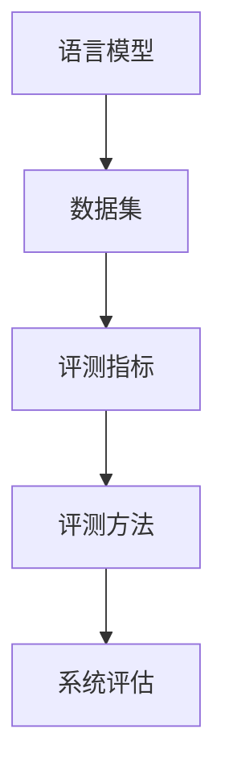

                 

# 文章标题：多语言支持的LLM评测系统设计

## 关键词：
- 多语言LLM
- 评测系统
- 数据集
- 评测指标
- 实现案例

## 摘要：
本文旨在深入探讨多语言支持的语言模型（LLM）评测系统的设计与实现。通过背景介绍、核心概念阐述、系统设计原理分析、评测数据集与指标介绍、系统实现详细讲解以及实际应用案例分析，本文旨在为读者提供一个全面、系统、易懂的多语言LLM评测系统设计指南。文章最后将对系统设计中的最佳实践进行总结，并对未来的发展方向进行展望。

## 目录：

## 引言
多语言支持的LLM（Language Model）评测系统在当前全球化信息时代的重要性日益凸显。随着多语言处理技术的快速发展，如何评估和优化多语言LLM的性能成为了一个关键问题。本文将详细探讨多语言支持的LLM评测系统的设计原则、实现方法以及在实际应用中的案例分析。

### 2. 多语言支持的LLM概述
#### 2.1 LLM基本概念
语言模型是自然语言处理（NLP）领域的重要工具，它通过学习大量文本数据，预测文本序列中下一个单词或字符的概率分布。LLM（Large Language Model）是指大型语言模型，它们具有强大的文本生成和语义理解能力。

#### 2.2 多语言支持的挑战
多语言支持的LLM面临着许多挑战，包括语言的差异性、词汇多样性、语法结构的复杂性以及文化背景的差异。这些挑战对LLM的建模和评估提出了更高的要求。

#### 2.3 多语言LLM的发展历史
多语言LLM的发展经历了从单语言模型到多语言模型的转变。本文将回顾这一发展历程，并探讨当前主流的多语言LLM技术。

#### 2.4 多语言LLM的应用场景
多语言LLM在翻译、机器阅读理解、问答系统、语音识别等领域有着广泛的应用。本文将介绍这些应用场景以及多语言LLM在这些场景中的优势。

### 3. LLM评测系统设计原理
#### 3.1 评测系统设计原则
评测系统设计应遵循可扩展性、可重复性、全面性和实用性原则。

#### 3.2 核心概念与联系
多语言LLM评测系统涉及的核心概念包括语言模型、数据集、评测指标和评测方法。它们之间的关系可以用以下Mermaid流程图表示：



#### 3.3 核心算法原理讲解
评测系统的核心算法通常包括自动评估和人工评估。自动评估方法可以使用BLEU、ROUGE等指标，而人工评估则依赖于专业评估人员的判断。

#### 3.4 数学模型和数学公式
$$
F_{\text{measure}} = \frac{2 \cdot P \cdot R}{P + R}
$$

其中，$P$是精确率，$R$是召回率。这个公式用于计算评测系统的F1度量，它综合了精确率和召回率，是评估评测系统性能的重要指标。

#### 3.5 伪代码讲解
以下是评测系统的一个简单伪代码：

```
function evaluate(model, dataset):
    for each sentence in dataset:
        prediction = model.predict(sentence)
        actual = evaluate_sentence(sentence, prediction)
        calculate_metrics(prediction, actual)
    return average_metrics
```

### 4. 多语言评测数据集
#### 4.1 数据集的重要性
数据集是评测系统的基石，选择合适的数据集对于评测结果至关重要。

#### 4.2 数据集收集与处理
数据集的收集通常涉及多种语言和领域的文本数据。收集后，需要对数据进行清洗、标注和预处理。

#### 4.3 数据集评估方法
数据集的评估方法包括自动化评估和人工评估。自动化评估可以使用常用的指标，如词汇覆盖率和语法正确性。

#### 4.4 多语言数据集的特点
多语言数据集需要考虑语言的差异性，例如词汇、语法结构和语义表达。

### 5. 评测指标与方法
#### 5.1 常见评测指标
常见的评测指标包括BLEU、ROUGE、F1度量等。

#### 5.2 评测方法介绍
评测方法包括自动评估和人工评估。自动评估方法可以使用代码实现，而人工评估则需要专业人员的参与。

#### 5.3 数学公式讲解
以下是BLEU指标的计算公式：

$$
BLEU = \frac{2 \cdot N \cdot \ln(P)}{N + 1}
$$

其中，$N$是参考译文与预测译文匹配的词对数量，$P$是匹配概率。

#### 5.4 评测指标优缺点分析
不同评测指标有其优缺点，选择合适的指标需要根据具体应用场景来决定。

### 6. 评测系统实现
#### 6.1 开发环境搭建
开发环境包括编程语言、库和工具的选择。

#### 6.2 源代码详细实现
源代码实现涉及数据预处理、模型训练和评估等多个环节。

#### 6.3 代码解读与分析
对源代码的逐行解读和分析，有助于理解评测系统的实现细节。

#### 6.4 系统调试与优化
系统调试和优化是确保评测系统性能的关键步骤。

### 7. 实际应用案例分析
#### 7.1 案例背景
介绍一个实际的多语言LLM评测系统应用案例。

#### 7.2 案例分析
分析案例中的系统设计、数据集选择、评测指标与方法。

#### 7.3 案例总结与启示
总结案例经验，并提出改进建议。

### 8. 总结与展望
#### 8.1 本书主要内容回顾
回顾文章中的核心内容。

#### 8.2 存在的问题与挑战
讨论评测系统设计中存在的问题和挑战。

#### 8.3 未来发展趋势
展望多语言LLM评测系统的未来发展方向。

#### 8.4 研究方向与展望
提出未来的研究方向和展望。

### 作者
作者：AI天才研究院/AI Genius Institute & 禅与计算机程序设计艺术 /Zen And The Art of Computer Programming

---

请注意，本文仅为大纲结构，实际撰写时需要根据每个章节的要求填充详细内容，确保文章的逻辑性和完整性。每个章节的内容都应该涵盖核心概念与联系、核心算法原理讲解、数学模型和数学公式、项目实战等元素，同时确保文章的字数在8000到12000字之间。

