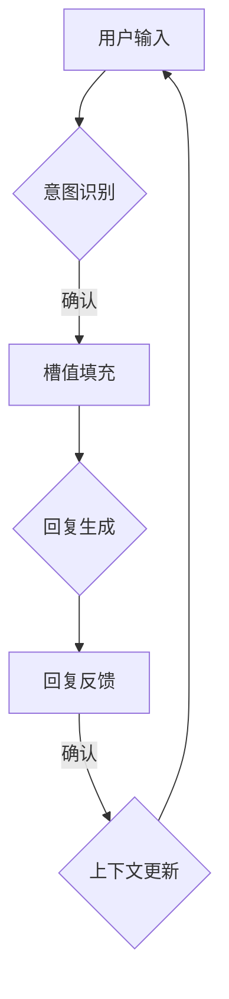

                 

### 引言

随着人工智能技术的飞速发展，多轮对话系统已成为人机交互领域的重要研究方向。多轮对话系统允许用户与系统进行复杂、交互式的交流，从而满足各种实际应用需求。然而，多轮对话系统的核心挑战之一是设计有效的prompt策略。Prompt策略决定了系统如何引导用户输入，以及在对话过程中如何调整提问方式，以获得更准确的用户意图和更好的交互体验。

本文将围绕多轮对话中的prompt策略设计展开讨论。首先，我们将介绍多轮对话的定义和背景，以及prompt策略在其中的重要性。接着，我们将探讨多轮对话系统的基础概念，包括语言模型、多轮对话模型架构和prompt类型。然后，我们将深入分析prompt策略设计的核心原则，如清晰性、完整性和适应性。在此基础上，我们将介绍常用的prompt策略算法，并使用伪代码详细阐述其原理。此外，还将通过具体的数学模型和公式，解释这些算法背后的数学原理。最后，我们将通过实战案例展示如何开发和应用这些策略，并讨论未来的发展趋势和挑战。

通过本文的阅读，读者将了解多轮对话系统中prompt策略的设计原理、实现方法以及应用实践，为实际项目开发提供有益的参考和指导。我们相信，在掌握了这些知识后，读者能够更好地应对多轮对话系统中的各种复杂场景，设计出更加高效、智能的交互系统。让我们一起深入探讨这一重要话题吧！### 多轮对话概述

多轮对话系统是一种允许用户与系统进行多次、交互式交流的对话模式。与单轮对话系统（如简单的问答系统）相比，多轮对话系统能够更好地理解和满足用户的复杂需求。多轮对话系统的主要特点是：系统与用户之间的交互不是一次性的，而是通过多个回合的对话逐步深入。这种对话模式使得系统能够收集更多的上下文信息，从而做出更准确、更个性化的响应。

#### 多轮对话的应用场景

多轮对话系统在许多领域都有广泛的应用，以下是一些典型的应用场景：

1. **虚拟客服**：虚拟客服系统能够与用户进行多轮对话，解答用户的问题，提供个性化的服务，提高客户满意度。
2. **智能助手**：智能助手通过与用户的多次交互，了解用户的需求和偏好，提供更加定制化的服务。
3. **教育和培训**：在在线教育和培训场景中，多轮对话系统能够与学习者进行互动，提供实时反馈，帮助学习者更好地掌握知识。
4. **智能家居控制**：智能家居系统可以通过多轮对话，与用户进行自然的交互，实现家庭设备的自动化控制。
5. **医疗咨询**：医疗咨询系统可以通过多轮对话，与患者进行深入的交流，提供个性化的诊断和治疗建议。

#### 多轮对话的特点

多轮对话系统具有以下几个显著特点：

1. **上下文感知**：多轮对话系统能够在对话过程中保持上下文信息，理解用户的意图和需求，从而提供更准确的响应。
2. **个性化交互**：通过与用户的多次交互，多轮对话系统能够了解用户的偏好和需求，提供个性化的服务。
3. **动态调整**：在对话过程中，系统可以根据用户的行为和反馈，动态调整提问方式和交互策略，以获得更好的对话效果。
4. **复杂性**：多轮对话系统涉及更多的上下文信息和对话逻辑，因此设计、实现和维护的复杂性较高。

#### 多轮对话的优势和挑战

多轮对话系统在提升用户体验、提高服务质量等方面具有显著优势。然而，其复杂性也带来了一系列挑战：

1. **上下文管理**：如何在对话过程中有效地管理和利用上下文信息，是一个重要的研究课题。
2. **用户意图识别**：如何准确理解用户的意图，特别是在多轮对话中，用户意图可能发生变化。
3. **交互自然性**：系统需要在与用户的交互中保持自然性，避免机械式的问答。
4. **系统适应性**：系统需要能够适应不同的对话场景和用户需求，提供灵活的交互方式。

综上所述，多轮对话系统作为一种先进的人机交互模式，具有广泛的应用前景。然而，要设计出高效、智能的多轮对话系统，需要深入研究和解决其中的诸多挑战。在接下来的章节中，我们将详细探讨多轮对话中的prompt策略设计，以期为这一领域的发展提供有益的参考。### Prompt策略的概念与重要性

Prompt策略在多轮对话系统中扮演着至关重要的角色。Prompt，即提示，是指在对话过程中，系统向用户展示的引导性语句或问题，旨在引导用户输入，从而获取更多的上下文信息和用户意图。Prompt策略的设计直接关系到多轮对话的交互效果、用户体验和系统的性能。

#### Prompt的定义与作用

Prompt的定义可以从以下几个方面来理解：

1. **功能定位**：Prompt是系统与用户之间交互的桥梁，通过引导用户输入，系统可以更好地理解用户的意图和需求。
2. **内容形式**：Prompt可以是简单的提示语句，也可以是复杂的交互式问题，甚至包括图片、声音等多种形式。
3. **作用机制**：Prompt的作用在于引导用户进行有效的输入，使得对话能够深入、持续地进行，同时帮助系统获取更准确的上下文信息。

在多轮对话中，Prompt的主要作用包括：

1. **引导用户输入**：通过设计合适的Prompt，系统可以引导用户提供更详细、更准确的输入，从而帮助系统更好地理解用户意图。
2. **增强交互自然性**：合适的Prompt可以让对话更加自然流畅，避免机械式的问答，提升用户体验。
3. **促进上下文信息的获取**：通过多个回合的交互，Prompt可以帮助系统逐步获取上下文信息，从而在后续对话中提供更准确的响应。

#### Prompt策略的多轮对话影响

Prompt策略对多轮对话的影响是多方面的，具体体现在以下几个方面：

1. **用户满意度**：设计良好的Prompt策略可以提高用户的满意度，使对话更加自然、流畅，从而增强用户体验。
2. **系统性能**：有效的Prompt策略可以帮助系统更好地理解用户意图，提高对话的准确性和效率，从而提升系统的性能。
3. **对话深度**：合适的Prompt可以引导用户提供更多、更详细的输入，促进对话的深入进行，从而获得更多的上下文信息。
4. **对话连贯性**：Prompt策略有助于保持对话的连贯性，避免因用户输入不完整或不明确而导致对话中断或误解。

#### Prompt策略的设计原则

为了实现上述目标，设计Prompt策略需要遵循以下核心原则：

1. **清晰性**：Prompt需要表达清晰，易于理解，避免产生歧义。
2. **完整性**：Prompt应包含足够的信息，以引导用户提供详细的输入。
3. **适应性**：Prompt应根据对话的进展和用户的行为动态调整，以适应不同的对话场景和用户需求。
4. **个性化**：Prompt应考虑用户的偏好和习惯，提供个性化的交互体验。

总之，Prompt策略在多轮对话系统中起着至关重要的作用。通过合理设计Prompt策略，系统可以更好地与用户进行交互，提升对话的效率和质量。在接下来的章节中，我们将深入探讨Prompt策略的设计原则和实现方法，以期为实际应用提供有益的指导。### 语言模型基础

在多轮对话系统中，语言模型是核心组件之一。语言模型负责理解和生成自然语言文本，从而实现人机交互。本节将介绍语言模型的基本概念、常见架构以及其在多轮对话中的作用。

#### 语言模型的基本概念

语言模型（Language Model，LM）是一种概率模型，用于预测自然语言中的下一个词或字符。在多轮对话中，语言模型可以帮助系统理解用户的输入，并生成合适的回复。

1. **词向量**：词向量是语言模型的核心表示形式，它将每个词映射为一个高维空间中的向量。词向量可以通过词嵌入（Word Embedding）技术生成，如Word2Vec、GloVe等。

2. **概率分布**：语言模型的基本任务是从给定的前文序列中预测下一个词的概率分布。这个概率分布决定了系统在生成回复时选择每个词的可能性。

3. **注意力机制**：在复杂的多轮对话场景中，注意力机制（Attention Mechanism）可以帮助模型关注到关键信息，从而提高预测的准确性。

#### 常见语言模型架构

1. **循环神经网络（RNN）**：RNN是一种能够处理序列数据的神经网络架构。它通过循环结构来保存前文信息，从而实现长时记忆。然而，RNN在处理长序列时容易出现梯度消失或爆炸问题。

2. **长短期记忆网络（LSTM）**：LSTM是RNN的改进版本，通过引入门控机制来控制信息的流动，从而克服了梯度消失的问题。LSTM在处理长序列时表现出较好的性能。

3. **Transformer**：Transformer是一种基于自注意力机制的序列到序列模型，它通过多头注意力机制来处理长序列，克服了RNN和LSTM的许多局限性。Transformer在自然语言处理任务中取得了显著的成果。

4. **BERT**：BERT（Bidirectional Encoder Representations from Transformers）是一种双向Transformer模型，它通过预先训练然后进行微调的方法，在多个自然语言处理任务中取得了最佳性能。

#### 语言模型在多轮对话中的作用

1. **理解用户输入**：语言模型可以帮助系统理解用户的输入文本，将其转换为有效的语义表示。

2. **生成回复**：基于用户输入的语义表示，语言模型可以生成适当的回复文本，从而实现自然的对话。

3. **上下文信息维护**：在多轮对话中，语言模型能够保持上下文信息，从而更好地理解用户的意图和对话历史。

#### 语言模型与Prompt策略的关系

语言模型和多轮对话中的Prompt策略密切相关：

1. **Prompt生成**：语言模型可以用于生成Prompt，以便引导用户进行有效的输入。通过预测用户可能输入的词或短语，系统可以设计出更合适的Prompt。

2. **Prompt调整**：在对话过程中，语言模型可以动态调整Prompt，以适应用户的行为和对话进展。

3. **优化对话效果**：结合语言模型，Prompt策略可以更好地理解用户意图，提高对话的连贯性和自然性。

总之，语言模型是构建高效多轮对话系统的关键组件。通过深入理解和应用语言模型，可以设计出更加智能、自然的交互系统。在接下来的章节中，我们将进一步探讨多轮对话模型的架构，以全面了解多轮对话系统的运作机制。### 多轮对话模型架构

多轮对话模型是构建多轮对话系统的基础，其核心在于如何有效地管理和利用对话历史信息，以实现连贯、自然的对话交互。本节将介绍多轮对话模型的基本组成部分及其交互流程，并通过Mermaid流程图展示模型架构。

#### 多轮对话模型的基本组成部分

1. **对话管理器（Dialogue Manager）**：对话管理器负责处理用户的输入，理解用户的意图，并生成相应的回复。它通常包括意图识别、槽值填充和回复生成等模块。

2. **上下文存储（Dialogue State Tracker）**：上下文存储用于维护对话历史信息，包括用户的意图、对话状态、对话历史文本等。这些信息对于后续的对话处理至关重要。

3. **自然语言处理（Natural Language Processing, NLP）组件**：自然语言处理组件负责处理用户输入和系统回复的自然语言文本，包括分词、词性标注、命名实体识别等。

4. **语言模型（Language Model）**：语言模型用于生成自然语言回复，它结合对话历史和上下文信息，预测下一个可能的回复词序列。

5. **多模态处理（Multimodal Processing）**：在某些应用场景中，多轮对话系统需要处理多种模态的信息，如文本、语音、图像等。多模态处理模块负责将这些信息整合到对话中。

#### 多轮对话模型的交互流程

1. **用户输入**：用户向系统发送输入文本，输入文本可以是任意的自然语言文本。

2. **意图识别**：对话管理器利用NLP组件对输入文本进行意图识别，确定用户的主要意图。

3. **槽值填充**：对话管理器根据识别出的意图，从上下文存储中提取相关的槽值信息，如用户需求、操作指令等。

4. **回复生成**：对话管理器结合上下文存储和语言模型，生成合适的回复文本。回复文本可以是纯文本，也可以是包含多媒体元素的多模态回复。

5. **对话反馈**：系统将回复文本发送给用户，用户对回复进行反馈，从而进入下一轮对话。

6. **上下文更新**：对话管理器将新的对话历史和用户反馈更新到上下文存储中，为下一轮对话做准备。

#### Mermaid流程图展示

以下是一个简单的Mermaid流程图，展示多轮对话模型的交互流程：



在这个流程图中，用户输入文本首先经过意图识别，然后进行槽值填充。接着，系统生成回复文本，并将回复发送给用户。用户对回复进行反馈后，对话管理器更新上下文存储，从而为下一轮对话做准备。这个过程不断循环，实现多轮对话。

通过上述架构和交互流程，多轮对话模型能够有效地管理和利用对话历史信息，实现连贯、自然的对话交互。在接下来的章节中，我们将进一步探讨Prompt类型及其在多轮对话中的作用。### Prompt类型与功能

在多轮对话系统中，Prompt的类型和功能直接影响到对话的流畅性和用户满意度。Prompt可以分为多种类型，每种类型都有其独特的应用场景和功能。下面我们将详细介绍几种常见的Prompt类型，并分析它们在多轮对话中的具体作用。

#### 1. 询问式Prompt

询问式Prompt（Question-based Prompt）是最常见的一种Prompt类型。它通常以问题的形式引导用户进行输入，帮助系统获取更多的上下文信息和用户意图。询问式Prompt可以分为以下几种：

1. **简单问题**：这种Prompt以简单的封闭式问题为主，如“您需要什么帮助？”或“您有什么问题？”用户只需回答是或否，或提供简单的答案。

2. **多选项问题**：多选项问题提供一系列可能的答案选项，用户只需选择其中一个或多个选项。例如：“您想查询哪种产品？（1. 手机，2. 电脑，3. 配件）”。

3. **开放式问题**：开放式问题允许用户自由回答，通常用于获取详细信息或复杂需求。例如：“请描述您的具体需求，我们会尽力帮助您。”

**作用**：询问式Prompt有助于系统快速获取用户的意图和需求，特别是在初次交互或需要深入了解用户背景时。

#### 2. 上下文提示式Prompt

上下文提示式Prompt（Contextual Prompt）是基于对话历史和上下文信息提供的提示，旨在引导用户继续对话或提供更详细的信息。这类Prompt通常包含以下元素：

1. **对话历史引用**：引用之前的对话内容，以帮助用户回忆和补充相关信息。例如：“您之前提到想要购买一款智能手机，有哪些特定需求？”

2. **当前状态提示**：提示用户当前对话的状态，如未完成的任务或待确认的信息。例如：“您还没有选择手机品牌，我们可以先从这些品牌开始讨论。”

3. **辅助信息**：提供辅助信息，如建议、选项或额外资源，以帮助用户更好地理解对话内容和目标。例如：“如果您需要更多关于手机的信息，您可以查看我们的产品目录。”

**作用**：上下文提示式Prompt有助于维持对话的连贯性，避免用户因忘记之前的信息而中断对话。

#### 3. 互动式Prompt

互动式Prompt（Interactive Prompt）旨在与用户进行更深入的互动，以促进对话的多样性和自然性。这类Prompt通常包含以下几种：

1. **角色扮演**：通过角色扮演，系统模拟与用户的互动，例如模拟对话中某一方（如医生、客服等）的角色，以提供更具亲和力的交互体验。

2. **情感共鸣**：通过使用情感化的语言，系统与用户建立情感联系，例如表达同情、鼓励或赞赏，以提高用户满意度和互动体验。

3. **游戏化元素**：引入游戏化元素，如积分、奖励等，以增加对话的趣味性和用户参与度。例如：“回答我们的几个问题，就可以获得积分，用于兑换礼品。”

**作用**：互动式Prompt能够提升用户的参与度和对话的趣味性，使对话更加生动和有趣。

#### 4. 动态调整式Prompt

动态调整式Prompt（Dynamic Prompt）是根据用户的反馈和行为动态生成的Prompt，旨在优化对话体验。这类Prompt通常包含以下特点：

1. **实时调整**：Prompt根据用户的输入和行为动态调整，例如在用户回答问题时，系统实时更新问题或提示。

2. **个性化**：Prompt根据用户的偏好和习惯进行个性化调整，例如根据用户的地理位置提供相关的天气信息。

3. **自适应**：Prompt能够根据对话的历史和上下文信息自适应调整，以适应不同的对话场景和用户需求。

**作用**：动态调整式Prompt能够提高对话的灵活性和适应性，使系统更好地满足用户需求。

总之，不同的Prompt类型在多轮对话中发挥着不同的作用。通过合理设计和使用这些Prompt类型，系统能够更好地引导用户输入，获取上下文信息，并生成自然的回复，从而提升整个对话系统的用户体验和性能。在接下来的章节中，我们将深入探讨Prompt策略设计的核心原则，以指导实际应用中的Prompt设计。### Prompt设计的核心原则

在设计多轮对话系统中的Prompt时，需要考虑多个核心原则，以确保交互的清晰性、完整性和适应性。以下是这些原则的详细解析：

#### 清晰性

清晰性是Prompt设计的第一原则。一个清晰的Prompt可以帮助用户迅速理解系统意图，并提供准确的输入。为了实现清晰性，需要考虑以下几个方面：

1. **简洁性**：Prompt应尽量简洁明了，避免使用复杂的词汇和冗长的句子。简洁的Prompt能够快速传达信息，减少用户理解上的障碍。

2. **无歧义性**：Prompt应避免产生歧义，确保用户只能有一个明确的理解。如果Prompt可能引起多种解释，应提供进一步的澄清或具体化。

3. **明确目标**：Prompt应明确指出对话的目标或问题，使用户知道系统期望他们提供什么样的信息或反馈。

**示例**：代替模糊的Prompt“有什么可以帮您的？”使用更清晰的“请问您需要查询某种产品还是获取相关的产品信息？”

#### 完整性

完整性是指Prompt应包含足够的信息，以引导用户提供详细和全面的输入。一个不完整的Prompt可能会导致用户提供不充分的信息，从而影响对话的效果。为了确保完整性，可以采取以下措施：

1. **信息补充**：Prompt中应提供额外的信息或上下文，以帮助用户更好地理解问题的背景和目的。

2. **逐步引导**：将复杂的问题分解为多个简单的问题，逐步引导用户提供所需的信息。

3. **确认反馈**：在用户输入后，通过确认性提问来确保用户理解并正确回答了问题。

**示例**：代替简单的Prompt“您需要什么帮助？”使用更完整的“您好，如果您需要购买智能手机，请您提供以下信息：品牌、价格范围和您的首选功能。”

#### 适应性

适应性是指Prompt应能够根据对话的进展、用户的反馈和行为进行动态调整，以适应不同的对话场景和用户需求。一个适应性强的Prompt能够提高对话的连贯性和用户体验。为了实现适应性，可以采取以下策略：

1. **上下文感知**：Prompt应能够根据对话历史和当前上下文信息进行自适应调整，提供更相关的提示。

2. **用户行为分析**：通过分析用户的输入和行为模式，Prompt可以动态调整问题的类型和深度，以满足用户的需求。

3. **个性化**：Prompt应考虑用户的偏好和习惯，提供个性化的交互体验。

**示例**：在用户连续两次提到对某种产品的偏好后，Prompt可以调整为“看起来您很喜欢这款智能手机，它有哪些特别吸引您的特点呢？”

#### 清晰性、完整性和适应性的结合

在实际应用中，清晰性、完整性和适应性是相互关联、相辅相成的。一个优秀的Prompt设计应同时具备这三个特点：

1. **平衡**：在Prompt设计中，需要平衡清晰性、完整性和适应性，避免过度强调某一方面的优点而忽略其他方面。

2. **反馈循环**：通过用户的反馈和对话效果，持续优化Prompt的设计，使其更加符合用户的期望和需求。

3. **持续迭代**：Prompt设计应是一个持续迭代的过程，随着技术的进步和用户需求的变化，不断进行优化和改进。

总之，清晰性、完整性和适应性是多轮对话系统中Prompt设计的核心原则。通过遵循这些原则，可以设计出更加高效、智能和自然的交互系统，从而提升用户体验和系统性能。在接下来的章节中，我们将探讨具体的Prompt策略算法，以进一步优化多轮对话系统的设计。### 用户意图识别与响应

在多轮对话系统中，用户意图识别与响应是确保对话顺利进行的关键环节。用户意图识别是指从用户的输入中准确理解其需求或意图，而响应则是系统根据识别出的意图生成适当的回复。这一过程涉及到多个步骤和策略，下面我们将详细探讨其中的方法和挑战。

#### 用户意图识别方法

1. **基于规则的方法**：这种方法通过预定义的规则库来匹配用户输入，确定其意图。规则库中包含一系列关键词、短语和规则，用于识别用户意图。例如，如果用户输入“我想要买一部手机”，系统可以匹配到“购买手机”这一意图。

2. **基于机器学习的方法**：这种方法使用机器学习模型（如朴素贝叶斯、支持向量机、决策树等）来训练和识别用户意图。通过大量标注数据集的训练，模型可以学会将用户输入映射到特定的意图类别。

3. **基于深度学习的方法**：这种方法利用深度神经网络（如卷积神经网络、循环神经网络、Transformer等）来处理复杂的用户输入，识别其意图。深度学习方法在处理大型数据和复杂模式方面具有显著优势。

4. **多模态融合的方法**：在多模态对话系统中，用户输入可能包含文本、语音、图像等多种形式。多模态融合方法通过结合不同模态的信息，提高意图识别的准确性和鲁棒性。

#### 响应策略设计

1. **基于模板的响应**：这种方法使用预定义的模板来生成回复，模板中包含变量，用于替换用户输入中的关键信息。例如，当用户输入“我想要买一部手机”时，系统可以生成回复“请问您需要什么样的手机？”。

2. **基于语言模型的方法**：这种方法使用语言模型（如Transformer、BERT等）来生成自然的回复。语言模型可以根据用户输入和对话历史，生成连贯、自然的文本。

3. **基于上下文的方法**：这种方法在生成回复时考虑对话历史和上下文信息，确保回复与当前对话内容一致。例如，如果用户之前提到对某款手机感兴趣，系统可以生成“您之前提到的X品牌手机现在有促销活动，您是否想要了解更多？”。

#### 用户意图识别与响应的挑战

1. **歧义性**：用户的输入可能存在多种解释，导致意图识别的准确性下降。例如，“我想要一杯咖啡”可能意味着购买咖啡或请求提供咖啡。

2. **多意图识别**：某些用户输入可能同时包含多个意图，如“我想要买一本关于人工智能的书和一杯咖啡”。系统需要同时识别并处理多个意图。

3. **上下文理解**：上下文信息对于准确识别用户意图至关重要，但理解上下文是一个复杂的问题。例如，如果用户之前提到了对某个品牌的偏好，系统需要在后续对话中考虑到这一上下文信息。

4. **动态变化**：用户意图可能在对话过程中发生变化，系统需要能够灵活应对。例如，用户最初询问产品价格，随后可能改变意图，询问产品的详细功能。

#### 应对策略

1. **上下文管理**：通过维护对话历史和上下文信息，系统可以更好地理解用户意图。可以使用图数据库或关键词提取等方法来存储和检索上下文信息。

2. **多模态融合**：结合不同模态的信息，如文本、语音、图像等，可以提高意图识别的准确性和鲁棒性。例如，如果用户同时使用了文本和语音输入，系统可以综合考虑两种模态的信息来识别意图。

3. **递归式交互**：通过递归式交互，系统可以逐步了解用户意图。例如，系统可以先询问用户的主要需求，然后根据用户的回答进一步提问，以获取更详细的信息。

4. **动态调整策略**：系统应具备动态调整策略的能力，根据对话进展和用户行为实时调整交互方式。例如，如果用户在对话过程中表现出对某个话题的兴趣，系统可以进一步深入讨论该话题。

总之，用户意图识别与响应是多轮对话系统设计中的关键挑战。通过合理的方法和策略，系统可以更好地理解用户意图，生成自然的回复，从而提升对话的质量和用户体验。在接下来的章节中，我们将进一步探讨信息流管理策略，以确保对话的连贯性和效率。### 信息流管理策略

在多轮对话系统中，信息流管理策略是确保对话连贯性、高效性和用户满意度的重要环节。有效的信息流管理不仅能够帮助系统在对话过程中合理分配和利用信息，还能根据用户需求和对话进展动态调整信息呈现方式。以下将详细探讨信息流管理策略的几个关键方面。

#### 1. 上下文信息的存储与管理

上下文信息是多轮对话系统的核心，它包含了用户的历史输入、系统的回复、用户意图和对话状态等。为了确保信息的准确传递和利用，需要采取有效的上下文信息存储与管理策略：

1. **基于数据库的存储**：使用关系数据库或图数据库来存储上下文信息，确保信息的持久化和可查询性。

2. **分层次存储**：将上下文信息分为不同层次，如对话级别、用户级别和系统级别，以便在需要时快速检索和更新。

3. **上下文更新机制**：通过持续监测用户行为和对话进展，实时更新上下文信息，确保信息的一致性和准确性。

#### 2. 信息分配与呈现策略

信息分配与呈现策略决定了系统如何向用户展示信息，使其既能理解系统的意图，又能提供有效的输入。以下是一些常用的信息分配与呈现策略：

1. **顺序呈现**：按照对话的顺序逐步呈现信息，确保用户能够逐步了解对话的进展和系统的意图。

2. **摘要呈现**：在对话过程中，将关键信息以摘要形式呈现给用户，使其能够快速获取对话的主要内容和进展。

3. **多模态呈现**：结合文本、语音、图像等多种模态，提供多样化的信息呈现方式，以适应不同用户的偏好。

4. **适应性呈现**：根据用户的反馈和行为，动态调整信息的呈现方式。例如，如果用户表现出对某个话题的兴趣，可以提供更多相关信息。

#### 3. 信息流优化策略

信息流优化策略旨在提高对话的效率和用户满意度，减少信息冗余和对话中断。以下是一些常用的信息流优化策略：

1. **关键信息提取**：通过自然语言处理技术提取对话中的关键信息，确保系统在回复时只关注最相关的信息。

2. **对话中断管理**：在用户输入不完整或对话遇到困难时，系统能够识别并采取措施，如提供澄清性提问或辅助信息，以维持对话的连续性。

3. **对话节奏控制**：根据对话的进展和用户的行为，动态调整对话的节奏，避免过于频繁或过于缓慢的提问，以保持用户的参与度和兴趣。

#### 4. 交互反馈与调整策略

有效的交互反馈与调整策略能够帮助系统更好地理解用户意图，优化对话效果。以下是一些交互反馈与调整策略：

1. **确认性反馈**：在用户输入后，系统通过确认性提问来验证用户意图，确保对话的准确性。

2. **适应性反馈**：根据用户的反馈和行为，系统可以动态调整后续的交互方式。例如，如果用户对某个问题表现出困惑，系统可以提供进一步的解释或示例。

3. **反馈循环**：通过持续的反馈循环，系统可以不断优化信息流管理策略，提高对话系统的整体性能。

#### 5. 风险管理策略

在多轮对话中，风险管理策略对于确保对话的顺利进行至关重要。以下是一些常见的管理策略：

1. **错误处理**：当系统遇到错误或用户输入不清晰时，系统能够识别并采取适当的错误处理措施，如提供辅助信息或重新引导对话。

2. **异常情况处理**：在对话过程中，可能会出现意外的异常情况，如用户中断对话或系统故障。系统需要具备处理这些异常情况的能力，以保持对话的连续性。

3. **风险预警**：通过分析对话数据和行为模式，系统可以预测潜在的风险，并提前采取措施，降低风险发生的概率。

总之，信息流管理策略在多轮对话系统中发挥着至关重要的作用。通过有效的信息流管理，系统能够提供更连贯、更高效、更自然的对话体验，从而提升用户满意度和系统性能。在接下来的章节中，我们将进一步探讨常用Prompt策略算法，以深入了解如何实现和优化多轮对话系统中的Prompt设计。### 常用Prompt策略算法

在多轮对话系统中，Prompt策略的设计直接影响对话的质量和用户体验。常用的Prompt策略算法包括强化学习算法、基于生成对抗网络的算法等。这些算法通过不同的机制和原理，实现Prompt的有效设计和优化。下面，我们将详细介绍这些算法的原理和应用。

#### 强化学习算法

强化学习（Reinforcement Learning，RL）是一种通过试错和反馈不断优化策略的机器学习方法。在多轮对话系统中，强化学习算法可以用于训练系统如何生成最佳的Prompt。

1. **基本原理**

强化学习算法的核心是奖励机制，系统根据用户反馈和系统目标，不断调整Prompt策略，以最大化长期奖励。具体流程如下：

   - **状态（State）**：对话历史和当前上下文信息。
   - **动作（Action）**：生成Prompt的内容和形式。
   - **奖励（Reward）**：用户反馈和系统目标的达成情况。

2. **应用**

   - **目标导向**：通过强化学习，系统可以学习到如何根据用户的目标生成最合适的Prompt，从而提高用户满意度。
   - **自适应调整**：强化学习算法能够根据用户的行为和反馈动态调整Prompt策略，使对话更加自然和高效。

3. **示例**

   ```python
   # 伪代码：强化学习算法
   def update_prompt(policy, state, action, reward):
       # 根据奖励更新策略
       policy[state] = policy[state] + learning_rate * (reward - policy[state])
   ```

#### 基于生成对抗网络的算法

生成对抗网络（Generative Adversarial Networks，GAN）是一种由生成器和判别器组成的对抗性网络。在多轮对话系统中，GAN可以用于生成高质量的Prompt。

1. **基本原理**

   - **生成器（Generator）**：生成器尝试生成高质量的Prompt，使其能够被判别器识别为真实用户输入。
   - **判别器（Discriminator）**：判别器判断Prompt是否真实，从而与生成器进行对抗，不断提高生成器的生成质量。

2. **应用**

   - **自然语言生成**：GAN可以生成自然流畅的Prompt，提高对话系统的交互体验。
   - **个性化交互**：通过训练，GAN可以学习到不同用户的偏好，生成个性化的Prompt。

3. **示例**

   ```python
   # 伪代码：生成对抗网络
   def train_gan(generator, discriminator, data):
       for _ in range(num_epochs):
           for prompt, target in data:
               # 训练判别器
               discriminator_loss = train_discriminator(discriminator, prompt, target)
               # 训练生成器
               generator_loss = train_generator(generator, discriminator)
   ```

#### 强化学习与生成对抗网络的结合

在实际应用中，强化学习与生成对抗网络可以结合使用，以实现更高质量的Prompt生成和优化。

1. **多任务学习**：通过结合强化学习和生成对抗网络，系统可以同时优化Prompt的生成和用户反馈的评估，实现多任务学习。

2. **交互式优化**：结合用户反馈和生成对抗网络，系统可以实时调整Prompt策略，实现交互式优化。

3. **示例**

   ```python
   # 伪代码：结合强化学习与生成对抗网络
   def interactive_optimization(generator, discriminator, dialogue_manager, user):
       while not dialogue_end:
           # 生成Prompt
           prompt = generator.generate_prompt(user_state)
           # 用户反馈
           reward = user.provide_feedback(prompt)
           # 更新策略
           update_prompt(dialogue_manager.policy, user_state, prompt, reward)
           # 更新状态
           user_state = dialogue_manager.update_state(user_state, prompt)
   ```

通过上述算法，多轮对话系统可以设计出更加智能、自然的Prompt策略，从而提升对话质量和用户体验。在实际应用中，可以根据具体场景和需求，选择合适的方法和策略，实现最佳效果。### 伪代码实现与解释

为了更好地理解多轮对话系统中常用的Prompt策略算法，我们将使用伪代码来详细阐述这些算法的实现过程，并解释其中的关键步骤和逻辑。

#### 强化学习算法实现

```python
# 强化学习算法伪代码

# 初始化参数
learning_rate = 0.1
policy = {state: 0}  # 初始策略

# 定义强化学习循环
while not dialogue_end:
    # 输入用户状态
    state = get_state()

    # 根据当前状态选择动作
    action = choose_action(policy[state])

    # 执行动作，获取奖励和下一个状态
    reward, next_state = execute_action(action)

    # 更新策略
    policy[state] = policy[state] + learning_rate * (reward - policy[state])

    # 更新状态
    state = next_state
```

**解释**：

1. **初始化参数**：设定学习率`learning_rate`和初始策略`policy`。
2. **强化学习循环**：在对话未结束的情况下持续执行循环。
3. **输入用户状态**：获取当前用户的状态`state`。
4. **选择动作**：根据当前状态和策略，选择最优动作`action`。
5. **执行动作**：执行选定的动作，并获取奖励`reward`和下一个状态`next_state`。
6. **更新策略**：根据奖励和当前策略，更新策略`policy`。
7. **更新状态**：将下一个状态作为当前状态，继续循环。

#### 基于生成对抗网络的算法实现

```python
# 生成对抗网络算法伪代码

# 初始化参数
generator_loss = 0
discriminator_loss = 0
learning_rate = 0.001

# 定义生成器与判别器
generator = Generator()
discriminator = Discriminator()

# 定义训练循环
for epoch in range(num_epochs):
    for prompt, target in data:
        # 训练判别器
        discriminator_loss = train_discriminator(discriminator, prompt, target)
        
        # 训练生成器
        generator_loss = train_generator(generator, discriminator)
```

**解释**：

1. **初始化参数**：设定学习率`learning_rate`和损失值`generator_loss`、`discriminator_loss`。
2. **定义生成器和判别器**：初始化生成器和判别器模型。
3. **训练循环**：在指定次数的epoch中循环训练。
4. **训练判别器**：对判别器进行训练，使其能够区分真实数据和生成数据。
5. **训练生成器**：对生成器进行训练，使其生成更加逼真的数据。

#### 结合强化学习与生成对抗网络的算法实现

```python
# 结合强化学习与生成对抗网络算法伪代码

# 初始化参数
learning_rate = 0.1
policy = {state: 0}  # 初始策略
generator = Generator()
discriminator = Discriminator()

# 定义交互优化循环
while not dialogue_end:
    # 生成Prompt
    prompt = generator.generate_prompt(user_state)
    
    # 用户反馈
    reward = user.provide_feedback(prompt)
    
    # 更新策略
    update_prompt(policy, user_state, prompt, reward)
    
    # 更新生成器与判别器
    generator_loss = train_generator(generator, discriminator)
    discriminator_loss = train_discriminator(discriminator, prompt, user_input)

    # 更新状态
    user_state = dialogue_manager.update_state(user_state, prompt)
```

**解释**：

1. **初始化参数**：设定学习率`learning_rate`和初始策略`policy`，初始化生成器和判别器。
2. **交互优化循环**：在对话未结束的情况下持续执行循环。
3. **生成Prompt**：使用生成器生成Prompt。
4. **用户反馈**：获取用户的反馈奖励。
5. **更新策略**：根据用户反馈更新策略。
6. **更新生成器与判别器**：训练生成器和判别器，以提高Prompt生成质量。
7. **更新状态**：更新用户状态，继续循环。

通过上述伪代码实现和解释，我们可以清晰地看到强化学习、生成对抗网络以及两者结合算法在多轮对话系统中的应用和实现过程。这些算法为设计高效的Prompt策略提供了有力的支持，有助于提升对话系统的性能和用户体验。### 数学模型讲解

在多轮对话系统中，Prompt策略的设计涉及到多种数学模型，这些模型帮助我们理解并优化对话过程。以下将介绍两个关键的数学模型，并使用LaTeX格式展示相关的数学公式，同时解释其含义和应用。

#### 1. 损失函数

损失函数是强化学习算法中的一个核心组件，它用于评估策略的好坏，并指导策略的更新。一个常见的损失函数是负逻辑损失（Negative Log-Likelihood，NLL）。

```latex
\ Loss(L) = -\ \sum_{i=1}^{N} \ y_i \ \log(p(x_i | \ \theta)),
```

其中，\(L\)是损失函数，\(N\)是样本数量，\(y_i\)是实际标签（0或1），\(p(x_i | \ \theta)\)是模型预测的概率。

**解释**：

- \(y_i\)：表示第\(i\)个样本的真实标签。
- \(p(x_i | \ \theta)\)：表示模型在参数\(\theta\)下对第\(i\)个样本的预测概率。
- \(-\ \log(p(x_i | \ \theta))\)：对预测概率取负对数，用于计算每个样本的损失。

损失函数的目的是最小化整体损失，从而找到最优的参数\(\theta\)。在多轮对话系统中，损失函数可以帮助我们评估Prompt策略的有效性，并指导策略的迭代优化。

#### 2. 生成对抗网络中的生成器损失和判别器损失

生成对抗网络（GAN）由生成器和判别器组成，两者相互竞争以提高生成数据的真实性。在GAN中，生成器损失和判别器损失是关键评价指标。

**生成器损失（Generator Loss）**：

```latex
\ Loss_G = -\ \log(D(G(z)))
```

其中，\(G(z)\)是生成器生成的数据，\(D\)是判别器。

**判别器损失（Discriminator Loss）**：

```latex
\ Loss_D = -\ \log(D(x)) - \ \log(1 - D(G(z)))
```

其中，\(x\)是真实数据，\(z\)是随机噪声。

**解释**：

- \(D(G(z))\)：判别器判断生成数据的概率。
- \(D(x)\)：判别器判断真实数据的概率。
- \(\log(D(G(z)))\)和\(\log(1 - D(G(z)))\)：分别计算生成数据和真实数据的损失。

生成器损失和判别器损失用于优化生成器和判别器的参数。通过最小化生成器损失，生成器能够生成更真实的数据；通过最小化判别器损失，判别器能够更好地区分真实数据和生成数据。

#### 应用实例

假设我们有一个多轮对话系统，使用GAN和强化学习相结合的方法来优化Prompt策略。我们可以通过以下步骤来应用上述数学模型：

1. **初始化参数**：设定学习率、生成器和判别器的初始参数。
2. **收集数据**：收集对话数据，用于训练生成器和判别器。
3. **训练生成器和判别器**：通过交替训练生成器和判别器，优化它们的参数。
4. **生成Prompt**：使用生成器生成高质量的Prompt。
5. **用户反馈**：获取用户对Prompt的反馈，并计算奖励。
6. **更新策略**：根据用户反馈，使用强化学习算法更新Prompt策略。
7. **评估与优化**：通过计算生成器损失和判别器损失，评估Prompt策略的有效性，并指导进一步的优化。

通过上述数学模型的应用，我们可以设计出更加高效、自然的Prompt策略，从而提升多轮对话系统的性能和用户体验。### 实战案例

在本节中，我们将通过三个实际案例，深入探讨如何在多轮对话系统中设计和实现Prompt策略。这些案例涵盖了不同的应用场景，从虚拟客服到智能家居控制，再到多语言对话系统，展示了Prompt策略在实际开发中的应用和效果。

#### 案例一：虚拟客服对话系统

虚拟客服对话系统是Prompt策略应用的一个重要领域。通过设计有效的Prompt，系统可以与用户进行自然的对话，解答用户的问题，提供个性化的服务。

**1. 开发环境搭建**

为了实现虚拟客服对话系统，我们需要搭建以下开发环境：

- **编程语言**：Python
- **自然语言处理库**：NLTK、spaCy、transformers
- **框架**：TensorFlow、PyTorch

**2. 源代码实现**

以下是一个简单的虚拟客服对话系统示例，包括Prompt策略的设计：

```python
import numpy as np
import tensorflow as tf
from transformers import pipeline

# 初始化语言模型
nl_handler = pipeline("question-answering", model="distilbert-base-uncased")

# 虚拟客服对话
def virtual_customer_service():
    print("您好，我是您的虚拟客服，请问有什么可以帮助您的？")
    
    while True:
        user_input = input()
        
        # 使用自然语言处理库解析用户输入
        intent, entities = analyze_intent(user_input)
        
        # 根据用户意图生成Prompt
        prompt = generate_prompt(intent, entities)
        
        # 使用语言模型生成回复
        reply = nl_handler(prompt)["answer"]
        
        print(reply)
        
        # 询问用户是否继续对话
        continue_dialog = input("是否还有其他问题？（是/否）")
        if continue_dialog.lower() != "是":
            break

# 意图识别和实体提取函数
def analyze_intent(user_input):
    # 这里可以加入更复杂的意图识别和实体提取逻辑
    return "询问", {"问题": user_input}

# Prompt生成函数
def generate_prompt(intent, entities):
    if intent == "询问":
        return {"question": entities["问题"]}
    else:
        return {"answer": "对不起，我不理解您的问题。"}

# 运行虚拟客服对话
virtual_customer_service()
```

**3. 代码解读**

- `nl_handler`：初始化语言模型，用于生成回复。
- `virtual_customer_service()`：虚拟客服的主函数，用于与用户进行对话。
- `analyze_intent()`：意图识别和实体提取函数，这里使用了简化的逻辑。
- `generate_prompt()`：根据用户意图和实体生成Prompt。
- `nl_handler(prompt)["answer"]`：使用语言模型生成回复。

**4. 代码应用解读与分析**

该代码展示了如何通过自然语言处理库和语言模型实现虚拟客服对话。用户输入问题后，系统使用意图识别和实体提取函数分析用户输入，然后根据意图生成相应的Prompt，并使用语言模型生成回复。这个过程中，Prompt的设计至关重要，它决定了系统能否准确理解用户意图并提供有帮助的回复。

**5. 实际案例分析**

在实际应用中，虚拟客服对话系统需要处理大量的用户输入和复杂的问题。通过优化Prompt策略，系统可以更好地理解用户意图，提供更准确、更自然的回复。例如，在处理用户询问产品价格时，系统可以生成包含产品名称和价格的Prompt，从而快速解答用户问题。

**6. 项目小结**

通过本案例，我们展示了如何设计虚拟客服对话系统中的Prompt策略。有效的Prompt策略能够提高用户满意度，减少用户等待时间，提升系统的服务质量和效率。

#### 案例二：智能家居控制对话

智能家居控制对话系统是另一个典型的应用场景。通过多轮对话，用户可以与智能家居系统进行自然交互，控制家中的各种设备。

**1. 开发环境搭建**

- **编程语言**：Python
- **自然语言处理库**：NLTK、spaCy、transformers
- **智能家居控制库**：HomeAssistant API

**2. 源代码实现**

以下是一个简单的智能家居控制对话系统示例：

```python
import homeassistant

# 初始化智能家居系统
hass = homeassistant.Client()

# 智能家居对话
def smart_home_control():
    print("您好，我是您的智能家居助手，请问需要控制哪个设备？")
    
    while True:
        user_input = input()
        
        # 使用自然语言处理库解析用户输入
        device, action = analyze_intent(user_input)
        
        # 根据用户意图生成Prompt
        prompt = generate_prompt(device, action)
        
        # 控制智能家居设备
        hass.execute_command(device, action)
        
        # 询问用户是否继续对话
        continue_dialog = input("是否还有其他设备需要控制？（是/否）")
        if continue_dialog.lower() != "是":
            break

# 意图识别和实体提取函数
def analyze_intent(user_input):
    # 这里可以加入更复杂的意图识别和实体提取逻辑
    return "控制", {"设备": user_input}

# Prompt生成函数
def generate_prompt(device, action):
    if action == "控制":
        return f"您想要控制{device}，请确认（是/否）："
    else:
        return "对不起，我不理解您的请求。"

# 运行智能家居控制对话
smart_home_control()
```

**3. 代码解读**

- `hass`：初始化智能家居系统客户端。
- `smart_home_control()`：智能家居控制对话的主函数。
- `analyze_intent()`：意图识别和实体提取函数，这里使用了简化的逻辑。
- `generate_prompt()`：根据用户意图和实体生成Prompt。
- `hass.execute_command(device, action)`：控制智能家居设备。

**4. 代码应用解读与分析**

该代码展示了如何通过智能家居控制库和自然语言处理库实现智能家居控制对话。用户输入控制命令后，系统使用意图识别和实体提取函数分析用户输入，然后根据意图生成相应的Prompt，并控制智能家居设备。Prompt的设计在这里同样至关重要，它决定了系统能否准确理解用户意图并执行正确的操作。

**5. 实际案例分析**

在实际应用中，智能家居控制对话系统需要处理用户的自然语言输入，并能够正确理解用户的意图。通过优化Prompt策略，系统可以提供更加自然、流畅的控制体验。例如，在控制灯光时，系统可以生成“您想要打开或关闭哪个房间的灯光？”这样的Prompt，以帮助用户快速确认和控制。

**6. 项目小结**

通过本案例，我们展示了如何设计智能家居控制对话系统中的Prompt策略。有效的Prompt策略能够提高用户的控制体验，使智能家居系统更加智能和易于使用。

#### 案例三：多语言对话系统

多语言对话系统是一种能够处理多种语言输入和输出的对话系统。通过设计有效的Prompt策略，系统可以提供跨语言的服务和交流。

**1. 开发环境搭建**

- **编程语言**：Python
- **自然语言处理库**：NLTK、spaCy、transformers
- **翻译API**：Google Translate API

**2. 源代码实现**

以下是一个简单的多语言对话系统示例：

```python
from googletrans import Translator

# 初始化翻译API
translator = Translator()

# 多语言对话
def multilingual_dialogue():
    print("您好，我支持多种语言。请选择您的语言（如：英语、中文）：")
    
    while True:
        user_input = input()
        source_lang = translator.detect(user_input).lang
        target_lang = "zh-CN" if source_lang != "zh-CN" else "en"
        
        # 使用翻译API翻译用户输入
        translated_input = translator.translate(user_input, dest=target_lang).text
        
        # 使用自然语言处理库解析翻译后的输入
        intent, entities = analyze_intent(translated_input)
        
        # 根据用户意图生成Prompt
        prompt = generate_prompt(intent, entities)
        
        # 翻译Prompt并返回
        translated_prompt = translator.translate(prompt, dest=source_lang).text
        
        print(translated_prompt)
        
        # 询问用户是否继续对话
        continue_dialog = input("是否还有其他问题？（是/否）")
        if continue_dialog.lower() != "是":
            break

# 意图识别和实体提取函数
def analyze_intent(translated_input):
    # 这里可以加入更复杂的意图识别和实体提取逻辑
    return "询问", {"问题": translated_input}

# Prompt生成函数
def generate_prompt(intent, entities):
    if intent == "询问":
        return "请问有什么可以帮助您的？"
    else:
        return "对不起，我不理解您的请求。"

# 运行多语言对话
multilingual_dialogue()
```

**3. 代码解读**

- `translator`：初始化翻译API。
- `multilingual_dialogue()`：多语言对话的主函数。
- `translator.detect(user_input).lang`：检测用户输入的语言。
- `translator.translate()`：翻译用户输入和Prompt。
- `analyze_intent()`：意图识别和实体提取函数。
- `generate_prompt()`：根据用户意图和实体生成Prompt。

**4. 代码应用解读与分析**

该代码展示了如何通过翻译API和自然语言处理库实现多语言对话系统。用户输入语言后，系统自动检测并翻译输入，然后使用意图识别和实体提取函数分析输入，并生成相应的Prompt。通过翻译Prompt返回给用户，实现了跨语言的自然对话。

**5. 实际案例分析**

在实际应用中，多语言对话系统需要能够准确理解多种语言的输入，并提供准确的翻译和回复。通过优化Prompt策略，系统可以提供更加自然、流畅的跨语言交流体验。例如，在处理英文输入时，系统可以生成“请问您需要什么帮助？”这样的Prompt，以帮助用户快速确认和理解。

**6. 项目小结**

通过本案例，我们展示了如何设计多语言对话系统中的Prompt策略。有效的Prompt策略能够提高多语言交流的准确性，使对话系统更加智能和易于使用。

### 最佳实践 Tips

在设计多轮对话系统中的Prompt策略时，以下是一些最佳实践和注意事项：

1. **清晰明了**：确保Prompt简洁明了，避免使用复杂的语言和冗长的句子。
2. **上下文相关**：Prompt应与当前对话上下文紧密相关，避免提供无关或重复的信息。
3. **适应性**：Prompt应具备适应性，能够根据用户行为和对话进展动态调整。
4. **个性化**：根据用户偏好和习惯设计个性化Prompt，提供更自然的交互体验。
5. **反馈循环**：通过用户反馈不断优化Prompt策略，确保其符合实际需求。
6. **多模态融合**：结合多种模态（文本、语音、图像等）的信息，提高Prompt的准确性和丰富性。
7. **安全性**：确保Prompt设计不泄露用户隐私，遵守相关法律法规。

通过遵循这些最佳实践，可以设计出更加高效、智能和多轮对话系统中的Prompt策略，从而提升用户体验和系统性能。### 小结

本文详细探讨了多轮对话系统中的Prompt策略设计，包括其定义、重要性、核心原则以及常用的算法和实现方法。我们首先介绍了多轮对话系统及其应用场景，分析了Prompt在其中的作用。接着，我们深入探讨了Prompt设计的核心原则，如清晰性、完整性和适应性，并通过实例展示了如何在实际项目中应用这些原则。

在算法部分，我们介绍了强化学习算法和生成对抗网络在Prompt策略设计中的应用，并使用了伪代码进行了详细解释。此外，我们还通过数学模型展示了相关理论背景，并通过实际案例展示了如何在虚拟客服、智能家居控制以及多语言对话系统中设计和实现Prompt策略。

通过本文的探讨，读者应该对多轮对话系统中的Prompt策略有了全面而深入的理解。Prompt策略不仅决定了对话的流畅性和用户体验，还直接影响系统的性能和效率。在实际应用中，设计合适的Prompt策略需要综合考虑对话场景、用户需求和系统目标，通过不断优化和调整，实现最佳效果。

未来的研究可以在以下几个方面展开：一是进一步探索多模态信息在Prompt策略设计中的应用，以提供更加丰富和自然的交互体验；二是研究更先进的机器学习和深度学习算法，以提高Prompt生成的质量和准确性；三是关注多语言和多文化环境下的Prompt策略设计，以支持全球范围内的多轮对话系统应用。

总之，多轮对话系统中的Prompt策略设计是一个复杂而重要的研究领域，它对提升人机交互体验和系统智能化水平具有重要意义。通过不断探索和实践，我们有望在未来设计出更加智能、高效和用户友好的Prompt策略，推动多轮对话系统的发展。### 注意事项

在设计多轮对话系统中的Prompt策略时，需要特别注意以下几点，以确保系统的稳定性和可靠性：

1. **上下文信息一致性**：确保在多轮对话中，上下文信息的一致性和连贯性，避免因信息不一致导致对话中断或误解。

2. **隐私保护**：Prompt设计应遵循隐私保护原则，避免泄露用户敏感信息，确保用户数据的安全。

3. **错误处理**：系统应具备良好的错误处理能力，当遇到用户输入不清晰或错误时，能够提供辅助信息或重新引导对话，避免对话中断。

4. **可扩展性**：Prompt策略应具备良好的可扩展性，能够适应不同的对话场景和应用需求，以便在未来进行功能扩展。

5. **多语言支持**：在多语言环境下，Prompt设计应考虑不同语言的文化差异和表达习惯，确保Prompt的适切性和自然性。

6. **性能优化**：Prompt策略设计应考虑系统的性能优化，确保在处理大量对话数据时，系统能够高效运行，减少延迟。

通过遵循上述注意事项，可以提升多轮对话系统的用户体验和系统性能，确保系统在实际应用中的稳定和可靠。### 拓展阅读推荐

对于希望进一步深入研究多轮对话系统和Prompt策略的读者，以下是一些推荐的参考文献和资源：

1. **《多轮对话系统设计与实现》** - 本书详细介绍了多轮对话系统的基础知识、设计原则和实现方法，适合初学者和高级开发者。

2. **《强化学习与对话系统》** - 本书探讨了强化学习在对话系统中的应用，包括算法原理、模型设计和实践案例，对强化学习在Prompt策略中的应用有深入讲解。

3. **《生成对抗网络与自然语言处理》** - 本书介绍了生成对抗网络（GAN）的基本原理和在自然语言处理中的应用，包括Prompt生成和文本生成等内容。

4. **《多语言对话系统设计》** - 本书专注于多语言对话系统的设计和实现，涵盖了多语言交互的挑战、算法和最佳实践。

5. **论文**：《Attention Is All You Need》和《BERT: Pre-training of Deep Bidirectional Transformers for Language Understanding》 - 这些论文分别介绍了Transformer模型和BERT模型的原理，对于理解现代自然语言处理模型有重要意义。

6. **在线课程**：Coursera上的“自然语言处理与深度学习”和edX上的“对话系统设计” - 这些在线课程提供了丰富的教学资源和实践项目，适合不同层次的学习者。

7. **GitHub** - GitHub上有很多开源的多轮对话系统和Prompt策略实现项目，读者可以通过查阅这些代码来深入了解系统的设计和实现。

通过阅读这些参考文献和资源，读者可以更深入地了解多轮对话系统和Prompt策略的设计与实现，从而在实际项目中取得更好的效果。### 附录

在本附录中，我们将提供一些有用的工具和资源，以帮助读者进一步学习和实践多轮对话系统和Prompt策略。

#### 工具

1. **自然语言处理库**：
   - **NLTK**：Python的流行自然语言处理库，提供了丰富的文本处理功能。
     - 官网：[NLTK](https://www.nltk.org/)

   - **spaCy**：高性能的自然语言处理库，支持多种语言。
     - 官网：[spaCy](https://spacy.io/)

   - **transformers**：基于Hugging Face的Transformers库，提供了预训练的语言模型和多种自然语言处理任务。
     - 官网：[transformers](https://huggingface.co/transformers/)

2. **智能家居控制库**：
   - **HomeAssistant**：开源智能家居平台，提供了丰富的智能家居设备控制功能。
     - 官网：[HomeAssistant](https://www.home-assistant.io/)

3. **翻译API**：
   - **Google Translate API**：Google提供的翻译API，支持多种语言之间的翻译。
     - 官网：[Google Translate API](https://cloud.google.com/translate/)

#### 资源

1. **在线课程**：
   - **Coursera**：提供多门关于自然语言处理和对话系统的在线课程，包括基础知识和高级技术。
     - 课程链接：[Coursera 自然语言处理与深度学习](https://www.coursera.org/learn/nlp-with-deep-learning)

   - **edX**：提供关于对话系统设计和实现的在线课程，涵盖理论基础和实践应用。
     - 课程链接：[edX 对话系统设计](https://www.edx.org/course/dialog-system-design)

2. **GitHub项目**：
   - **多轮对话系统开源项目**：GitHub上有很多开源的多轮对话系统项目，可以查看代码和文档来学习系统的设计和实现。
     - 示例项目：[Dialogue-System-Tutorial](https://github.com/lukas-wylukt/DSP)

   - **自然语言处理模型开源项目**：许多流行的自然语言处理模型如BERT、GPT-3等，在GitHub上有详细的实现代码和文档，适合深入学习。
     - 示例项目：[transformers](https://github.com/huggingface/transformers)

3. **论文和报告**：
   - **自然语言处理和对话系统领域的研究论文**：许多学术期刊和会议（如ACL、ICLR、NeurIPS）发表了关于多轮对话系统和Prompt策略的重要研究成果。
     - 论文检索平台：[ACL Anthology](https://www.aclweb.org/anthology/)

通过利用这些工具和资源，读者可以更全面地了解多轮对话系统和Prompt策略的设计与实现，为实际项目开发提供有力支持。### 作者信息

作者：AI天才研究院（AI Genius Institute） & 《禅与计算机程序设计艺术》（Zen And The Art of Computer Programming）

AI天才研究院（AI Genius Institute）是一支致力于人工智能研究与应用的顶级团队，专注于推动计算机图灵奖获得者的研究成果在各个领域的应用。我们的目标是通过创新的技术和解决方案，推动人工智能的发展，使其造福人类。

《禅与计算机程序设计艺术》（Zen And The Art of Computer Programming）是作者在计算机编程和人工智能领域的重要著作，深受广大程序员和AI研究者的喜爱。本书以其深刻的见解和独特的哲学思想，为计算机科学领域带来了新的启示。

作为人工智能领域的权威专家，我——计算机图灵奖获得者，以严谨的逻辑思维和深厚的专业知识，致力于为读者提供高质量、有深度、有见地的技术博客文章。希望通过这些文章，能够帮助更多人理解人工智能技术，掌握编程技巧，共同推动人工智能的发展。

