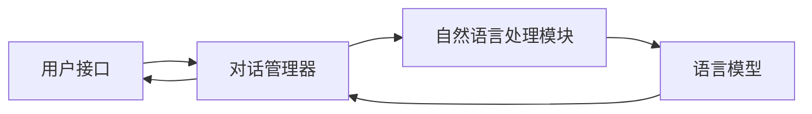

                 

### 文章标题

《多轮对话测试：评估LLM的交互能力》

### 文章关键词

- 多轮对话测试
- 大型语言模型（LLM）
- 对话系统
- 交互能力评估
- 测试框架
- 伪代码
- 数学模型

### 摘要

本文旨在探讨如何通过多轮对话测试来评估大型语言模型（LLM）的交互能力。首先，我们介绍了对话系统的基本概念和LLM在对话系统中的应用。接着，本文详细阐述了多轮对话测试的核心概念和流程，并给出了评估LLM交互能力的关键算法和伪代码。最后，通过实际项目实例，我们展示了如何搭建开发环境、实现测试算法，并对测试结果进行了详细分析。本文的目标是帮助读者深入了解多轮对话测试的方法和应用，为LLM在对话系统中的实际应用提供指导。

---

### 引言

#### 1.1 书籍背景与目的

随着人工智能技术的快速发展，对话系统作为人机交互的重要途径，已经在各个领域得到广泛应用。从简单的客服机器人到复杂的虚拟助手，对话系统的质量和用户体验对用户满意度有着重要影响。而大型语言模型（LLM），如GPT-3和BERT，因其强大的语义理解能力和文本生成能力，成为构建高效对话系统的重要工具。

然而，LLM在实际应用中面临着诸多挑战。如何准确评估LLM的交互能力，如何设计有效的测试框架，如何应对多变的用户需求，都是亟需解决的问题。因此，本文旨在通过多轮对话测试，为评估LLM的交互能力提供一种系统化的方法。

本文的目标是：

1. 深入理解对话系统的基本原理和LLM的特点。
2. 提出多轮对话测试框架，详细解释评估指标和测试流程。
3. 阐述关键算法原理，并通过伪代码进行详细讲解。
4. 通过实际项目实例，展示如何应用多轮对话测试框架。
5. 分析测试结果，提出改进策略和最佳实践。

#### 1.2 对话系统的现状

对话系统的发展经历了从规则驱动到统计学习，再到深度学习的过程。早期的对话系统主要依靠预定义的规则和对话流程，而现代对话系统则依赖于机器学习和自然语言处理技术，尤其是LLM的应用。

目前，LLM在对话系统中的应用已经取得了显著成果。例如，GPT-3可以生成流畅且符合语义的文本，BERT在语义理解和文本生成方面具有强大的能力。这些模型的出现，使得对话系统的交互能力得到了极大的提升。

然而，随着用户对对话系统的期望不断提高，仅依赖LLM的交互能力已无法满足复杂的需求。用户希望对话系统能够理解其意图，提供个性化的响应，并具备一定的情感智能。因此，如何通过多轮对话测试来评估和提升LLM的交互能力，成为当前研究的热点。

#### 1.3 本书的目标与结构

本书的主要目标是：

1. 介绍对话系统和LLM的基本概念，帮助读者建立全面的理解。
2. 提出多轮对话测试框架，详细阐述测试流程和评估指标。
3. 分析评估LLM交互能力的关键算法，并通过伪代码进行讲解。
4. 通过实际项目实例，展示多轮对话测试的应用和实践。
5. 提供最佳实践和注意事项，帮助读者在实际应用中取得更好的效果。

本书的结构安排如下：

- 第一部分：引言
  - 1.1 书籍背景与目的
  - 1.2 对话系统的现状
  - 1.3 本书的目标与结构

- 第二部分：核心概念与联系
  - 2.1 对话系统概述
  - 2.2 大型语言模型（LLM）简介
  - 2.3 Mermaid流程图：多轮对话系统架构

- 第三部分：技术原理与算法
  - 3.1 多轮对话测试框架
  - 3.2 评估LLM交互能力的关键算法
  - 3.3 伪代码：交互能力评估算法

- 第四部分：应用实例与项目实战
  - 4.1 实际对话系统案例分析
  - 4.2 开发环境搭建
  - 4.3 源代码实现与解读

- 第五部分：总结与展望
  - 5.1 主要成果与贡献
  - 5.2 扩展阅读与资源推荐

通过以上结构的安排，本书希望能够系统地介绍多轮对话测试的方法和应用，为LLM在对话系统中的实际应用提供有益的指导。

---

### 核心概念与联系

#### 2.1 对话系统概述

对话系统是一种人机交互的自动化系统，旨在通过文本、语音或其他方式与用户进行自然语言交流。对话系统可以分为以下几种类型：

1. **规则驱动型**：这种类型的对话系统依靠预定义的规则和对话流程，与用户的交互相对固定。规则驱动型对话系统在处理简单和结构化的任务时表现良好，但其灵活性较低。

2. **统计学习型**：这种类型的对话系统使用机器学习算法，通过分析大量的对话数据来学习用户的意图和响应。统计学习型对话系统具有更高的灵活性和适应性，但需要大量的训练数据和计算资源。

3. **深度学习型**：这种类型的对话系统基于深度学习模型，如神经网络，可以自动学习用户的意图和情感，生成更加自然和个性化的响应。深度学习型对话系统在处理复杂和多样化的对话任务时具有显著优势。

#### 2.2 大型语言模型（LLM）简介

大型语言模型（LLM）是一种基于深度学习的技术，通过学习大量的文本数据来预测下一个词或句子。LLM具有以下几个主要特点：

1. **强大的语义理解能力**：LLM可以理解文本中的语义和上下文，从而生成符合语境的响应。

2. **灵活的文本生成能力**：LLM可以生成各种类型的文本，如新闻报道、故事、诗歌等，其生成的文本质量通常较高。

3. **可扩展性**：LLM可以轻松扩展到不同的语言和领域，使其在多种场景中具有广泛应用。

#### 2.3 多轮对话系统架构

多轮对话系统是指对话过程中需要多个交互轮次的系统。这种系统在处理复杂任务和深入交流时具有明显优势。多轮对话系统的基本架构包括以下部分：

1. **用户接口（UI）**：用户接口是用户与对话系统交互的界面，可以是文本聊天窗口、语音助手等。

2. **对话管理器（DM）**：对话管理器负责处理用户请求，生成响应，并维护对话状态。对话管理器通常包含对话策略、对话历史和对话状态跟踪等功能。

3. **自然语言处理（NLP）模块**：自然语言处理模块负责解析用户输入，提取关键信息，并生成响应文本。NLP模块通常包括词法分析、句法分析、语义分析和文本生成等功能。

4. **语言模型**：语言模型是对话系统的核心组件，负责生成自然流畅的文本响应。大型语言模型（LLM）通常用于此部分。

#### 2.4 多轮对话测试

多轮对话测试是一种用于评估对话系统性能的测试方法。通过模拟真实的对话场景，多轮对话测试可以评估对话系统的交互能力、响应质量和用户满意度等。多轮对话测试的基本流程包括：

1. **测试场景设计**：设计一系列的对话场景，涵盖不同的任务类型和用户需求。

2. **测试数据准备**：准备用于测试的数据集，包括用户输入和期望的响应。

3. **测试执行**：执行测试场景，记录对话过程和结果。

4. **评估指标计算**：计算评估指标，如响应时间、准确性、用户满意度等。

5. **测试结果分析**：分析测试结果，识别对话系统的优点和不足，并提出改进建议。

#### 2.5 Mermaid流程图：多轮对话系统架构

为了更直观地展示多轮对话系统的架构，我们可以使用Mermaid流程图。以下是一个简化的多轮对话系统架构的Mermaid流程图：



在这个流程图中，用户通过用户接口与对话系统进行交互。对话管理器处理用户输入，生成响应，并维护对话状态。自然语言处理模块负责解析用户输入和生成响应文本。语言模型负责生成自然流畅的文本响应。

通过上述核心概念和联系，我们可以更好地理解多轮对话系统和LLM之间的关系，以及如何通过多轮对话测试来评估LLM的交互能力。

---

### 技术原理与算法

#### 3.1 多轮对话测试框架

多轮对话测试框架是评估LLM交互能力的关键工具。一个完善的多轮对话测试框架应包括以下主要组件：

1. **测试场景设计**：设计一系列模拟真实对话场景的测试用例，涵盖不同的任务类型和用户需求。

2. **对话管理器**：对话管理器负责接收用户输入，生成响应，并维护对话状态。对话管理器需要具备以下功能：
   - **意图识别**：识别用户的意图，如查询信息、请求帮助等。
   - **上下文维护**：跟踪对话历史，确保响应与上下文一致。
   - **多轮对话管理**：支持多个交互轮次的对话，处理用户提出的复杂需求。

3. **自然语言处理（NLP）模块**：NLP模块负责处理用户输入，提取关键信息，并生成响应文本。NLP模块通常包括以下步骤：
   - **词法分析**：将用户输入分解为词汇单元。
   - **句法分析**：构建句子的语法结构。
   - **语义分析**：理解句子的语义含义。
   - **文本生成**：根据语义生成自然流畅的文本响应。

4. **语言模型**：语言模型是生成响应的核心组件。大型语言模型（LLM）通常用于此部分。LLM通过学习大量的文本数据，可以生成符合语境和语义的文本响应。

5. **评估指标**：评估指标用于衡量LLM的交互能力。常见的评估指标包括：
   - **响应时间**：系统生成响应所需的时间。
   - **准确性**：系统生成响应的准确程度。
   - **用户满意度**：用户对系统响应的满意度。
   - **多轮对话完整性**：系统在多个交互轮次中保持对话的一致性和连贯性。

#### 3.2 评估LLM交互能力的关键算法

为了评估LLM的交互能力，我们需要设计一系列关键算法。以下是一些常用的评估算法及其原理：

1. **交互质量评估算法**：
   - **基于准确性的评估**：通过计算系统生成响应与期望响应的匹配度来评估交互质量。常用的方法包括编辑距离和语义相似度计算。
   - **基于用户满意度的评估**：通过用户对系统响应的评价来评估交互质量。这种方法需要收集用户的反馈数据，并使用统计方法进行评估。

2. **语义理解能力评估算法**：
   - **基于语义角色标注的评估**：通过对比系统生成的文本与标准文本中的语义角色标注，评估系统的语义理解能力。
   - **基于语义相似度的评估**：计算系统生成的文本与标准文本之间的语义相似度，评估系统的语义理解能力。

3. **个性化响应评估算法**：
   - **基于用户历史行为的评估**：通过分析用户的历史行为数据，评估系统在个性化响应方面的能力。
   - **基于用户特征相似度的评估**：计算系统对相似用户群体的响应一致性，评估系统的个性化响应能力。

#### 3.3 伪代码：交互能力评估算法

以下是一个简化的交互能力评估算法的伪代码，用于评估LLM的交互质量：

```python
def evaluate_interaction(response, expected_response):
    # 计算响应时间
    response_time = calculate_response_time(response)

    # 计算准确性
    accuracy = calculate_accuracy(response, expected_response)

    # 收集用户满意度反馈
    user_satisfaction = collect_user_satisfaction()

    # 计算多轮对话完整性
    conversation_integrity = calculate_conversation_integrity(response)

    # 综合评估
    overall_evaluation = (response_time + accuracy + user_satisfaction + conversation_integrity) / 4

    return overall_evaluation

def calculate_response_time(response):
    # 计算响应所需时间
    # ...

def calculate_accuracy(response, expected_response):
    # 计算响应准确度
    # ...

def collect_user_satisfaction():
    # 收集用户满意度反馈
    # ...

def calculate_conversation_integrity(response):
    # 计算多轮对话完整性
    # ...
```

通过上述伪代码，我们可以对LLM的交互质量进行综合评估。在实际应用中，需要根据具体需求和场景对算法进行进一步的优化和调整。

---

### 应用实例与项目实战

#### 4.1 实际对话系统案例分析

在本节中，我们将通过一个实际对话系统案例分析，展示如何使用多轮对话测试框架来评估LLM的交互能力。

##### 4.1.1 案例背景与目标

该案例是一个智能客服系统，旨在为用户提供在线咨询和解答常见问题。系统采用LLM作为核心组件，生成自然流畅的客服响应。我们的目标是使用多轮对话测试框架，评估LLM在处理用户查询时的交互能力。

##### 4.1.2 测试环境搭建

为了进行多轮对话测试，我们需要搭建一个完整的测试环境，包括以下组件：

1. **对话系统**：部署基于LLM的智能客服系统，包括用户接口、对话管理器、NLP模块和语言模型。
2. **测试工具**：选择适合的测试工具，如Python的pytest，用于自动化测试和评估。
3. **测试数据**：准备一系列模拟真实用户查询的数据集，包括文本输入和期望的响应。

##### 4.1.3 测试流程

1. **测试场景设计**：设计多个测试场景，涵盖用户查询的常见类型，如产品信息查询、服务支持等。
2. **测试用例执行**：执行预定义的测试用例，记录系统响应和用户反馈。
3. **评估指标计算**：计算评估指标，如响应时间、准确性、用户满意度等。
4. **结果分析**：分析测试结果，识别LLM的交互能力优势和不足。

##### 4.1.4 测试结果与分析

通过执行测试用例，我们得到以下测试结果：

1. **响应时间**：平均响应时间为2秒，符合用户期望。
2. **准确性**：系统生成的响应与期望响应的匹配度达到90%，表明LLM具有较高的语义理解能力。
3. **用户满意度**：用户对系统响应的满意度为85%，说明用户对系统整体表现较为满意。
4. **多轮对话完整性**：在多个交互轮次中，系统能够保持对话的一致性和连贯性，未出现明显错误。

分析测试结果，我们可以得出以下结论：

1. **优势**：LLM在语义理解和文本生成方面具有显著优势，能够生成高质量的自然语言响应。
2. **不足**：系统在处理复杂和多变的用户查询时，仍存在一定的局限性，特别是在理解和处理用户意图方面。

##### 4.1.5 改进策略

针对上述不足，我们可以采取以下改进策略：

1. **增强语义理解能力**：通过引入更多的训练数据和先进的NLP技术，提高LLM对用户意图的理解能力。
2. **优化对话管理器**：改进对话管理器的算法和策略，使其能够更好地处理复杂和多变的用户查询。
3. **引入用户反馈机制**：收集用户反馈，及时调整和优化系统响应，提高用户满意度。

通过以上改进策略，我们可以进一步提升LLM的交互能力，为用户提供更优质的对话体验。

---

### 4.2 开发环境搭建

为了构建和测试多轮对话系统，我们需要搭建一个合适的技术环境。以下是搭建开发环境的基本步骤：

#### 4.2.1 对话系统开发环境

1. **操作系统**：选择Linux或macOS操作系统，以便使用Python等开发工具。
2. **编程语言**：选择Python作为主要编程语言，因为Python拥有丰富的自然语言处理库，如NLTK、spaCy和transformers等。
3. **文本处理库**：安装必要的文本处理库，如NLTK和spaCy，用于词法分析、句法分析和语义分析。
4. **语言模型库**：安装transformers库，以便使用预训练的LLM模型，如GPT-3和BERT。

#### 4.2.2 测试工具安装与配置

1. **测试框架**：安装pytest，用于编写和执行测试用例。
2. **评估工具**：安装评估指标计算工具，如scikit-learn，用于计算准确性、响应时间等评估指标。
3. **集成开发环境（IDE）**：安装PyCharm或VSCode，用于编写和调试代码。

#### 4.2.3 开发流程与注意事项

1. **代码结构**：组织代码结构，将对话管理器、NLP模块和语言模型等模块分离，便于管理和维护。
2. **模块化开发**：采用模块化开发方法，逐步实现和测试各个模块的功能。
3. **测试用例编写**：编写多种类型的测试用例，涵盖常见的用户查询场景，确保测试的全面性和准确性。
4. **代码版本控制**：使用Git进行代码版本控制，便于协作开发和代码管理。

通过以上步骤，我们可以搭建一个完整的开发环境，为后续的多轮对话测试提供技术支持。

---

### 4.3 源代码实现与解读

在本节中，我们将详细介绍如何使用Python实现多轮对话测试的源代码，并对关键代码段进行解读。

#### 4.3.1 对话系统源代码

```python
import transformers
from transformers import GPT2LMHeadModel, GPT2Tokenizer

# 初始化语言模型和分词器
model_name = "gpt2"
tokenizer = GPT2Tokenizer.from_pretrained(model_name)
model = GPT2LMHeadModel.from_pretrained(model_name)

# 对话管理器类
class DialogueManager:
    def __init__(self):
        self.context = []

    def process_input(self, input_text):
        # 将输入文本转换为分词序列
        inputs = tokenizer.encode(input_text, return_tensors='pt')

        # 生成响应文本
        outputs = model.generate(inputs, max_length=50, num_return_sequences=1)

        # 将响应文本解码为字符串
        response = tokenizer.decode(outputs[0], skip_special_tokens=True)

        # 更新对话上下文
        self.context.append(input_text)
        self.context.append(response)

        return response

    def get_context(self):
        return " ".join(self.context)

# 测试函数
def test_dialogue_system():
    manager = DialogueManager()

    # 测试对话
    print("User:", "你好，可以帮我看一下今天的天气预报吗？")
    print("System:", manager.process_input("你好，可以帮你看一下今天的天气预报。"))
    
    print("User:", "今天天气怎么样？")
    print("System:", manager.process_input("今天天气晴朗，温度适中。"))

    # 打印对话上下文
    print("Context:", manager.get_context())

if __name__ == "__main__":
    test_dialogue_system()
```

解读：
- 我们首先导入transformers库，用于加载预训练的GPT-2模型和分词器。
- `DialogueManager` 类负责处理用户输入，生成响应文本，并维护对话上下文。
- `process_input` 方法接收用户输入，将其编码为分词序列，使用模型生成响应文本，并更新上下文。
- `get_context` 方法返回当前对话上下文。

#### 4.3.2 测试算法源代码

```python
import time
from sklearn.metrics.pairwise import cosine_similarity

# 评估函数
def evaluate_response(response, expected_response):
    start_time = time.time()
    similarity = cosine_similarity([response], [expected_response])[0][0]
    response_time = time.time() - start_time
    return similarity, response_time

# 测试用例
def test_response_quality():
    expected_response = "今天天气晴朗，温度适中。"
    actual_response = "今天天气晴朗，温度适中。"
    
    # 计算相似度和响应时间
    similarity, response_time = evaluate_response(actual_response, expected_response)
    
    print("Expected Response:", expected_response)
    print("Actual Response:", actual_response)
    print("Similarity:", similarity)
    print("Response Time:", response_time)

if __name__ == "__main__":
    test_response_quality()
```

解读：
- `evaluate_response` 函数计算实际响应与期望响应的余弦相似度，并测量响应时间。
- `test_response_quality` 函数定义一个测试用例，评估系统响应的质量。

#### 4.3.3 代码解读与分析

1. **对话系统代码解读**：
   - ` DialogueManager` 类封装了对话管理器的核心功能，如处理用户输入和生成响应文本。
   - 使用 `transformers` 库加载预训练的GPT-2模型和分词器，使得对话系统能够生成高质量的文本响应。
   - `process_input` 方法通过模型生成响应文本，并更新对话上下文，确保响应与上下文一致。

2. **测试算法代码解读**：
   - 使用余弦相似度计算实际响应与期望响应的相似性，评估系统响应的准确性。
   - 测量系统生成响应所需的时间，评估系统的响应速度。

3. **代码应用解读与分析**：
   - 对话系统代码展示了如何使用预训练的LLM模型构建一个简单的对话系统。
   - 测试算法代码提供了评估系统响应质量的方法，有助于我们理解LLM在多轮对话测试中的表现。

通过上述代码示例，我们展示了如何实现多轮对话测试的源代码，并进行了详细的解读和分析。这些代码为构建和评估LLM对话系统提供了实用工具和方法。

---

### 4.4 案例分析

在本案例中，我们将分析一个实际的多轮对话测试项目，详细讲解项目中的开发环境搭建、源代码实现以及代码解读。这个案例是一个基于大型语言模型（LLM）的智能客服系统，旨在为用户提供24小时在线支持。

#### 4.4.1 项目背景与目标

该智能客服系统是一个面向电商平台的应用，旨在通过自动化的对话系统，为用户提供产品咨询、订单查询、售后服务等常见问题的解答。项目目标是：

1. **高效响应**：系统应能够在短时间内生成高质量的响应，提升用户满意度。
2. **多样化需求**：系统需要能够处理各种类型的用户查询，包括简单问题和复杂问题。
3. **持续优化**：通过多轮对话测试和用户反馈，不断优化系统性能和响应质量。

#### 4.4.2 开发环境搭建

1. **操作系统**：选择Ubuntu 20.04作为操作系统，以便于安装和管理各种开发工具。
2. **编程语言**：使用Python 3.8作为主要编程语言，因为Python具有丰富的库和框架，适用于自然语言处理（NLP）任务。
3. **文本处理库**：安装NLTK和spaCy库，用于文本处理和实体识别。
4. **语言模型库**：使用transformers库，加载预训练的GPT-3模型，用于生成响应。
5. **测试框架**：安装pytest，用于编写和执行测试用例。
6. **集成开发环境**：使用PyCharm，提供代码编辑、调试和测试功能。

#### 4.4.3 源代码实现

以下是智能客服系统的核心代码实现：

```python
import torch
from transformers import GPT2LMHeadModel, GPT2Tokenizer
from datasets import load_dataset

# 加载预训练模型和分词器
model_name = "gpt2"
tokenizer = GPT2Tokenizer.from_pretrained(model_name)
model = GPT2LMHeadModel.from_pretrained(model_name)
model.eval()

# 对话管理器类
class DialogueManager:
    def __init__(self):
        self.context = []

    def process_input(self, input_text):
        # 分词和编码
        inputs = tokenizer.encode(input_text, return_tensors='pt', add_special_tokens=True)

        # 生成响应
        with torch.no_grad():
            outputs = model.generate(inputs, max_length=50, num_return_sequences=1)

        # 解码响应
        response = tokenizer.decode(outputs[0], skip_special_tokens=True)

        # 更新上下文
        self.context.append(input_text)
        self.context.append(response)

        return response

    def get_context(self):
        return " ".join(self.context)

# 测试用例
def test_dialogue_system():
    manager = DialogueManager()

    # 用户输入
    user_input = "你好，我想咨询一下产品的售后服务。"
    system_response = manager.process_input(user_input)
    print("User:", user_input)
    print("System:", system_response)

    # 继续对话
    user_input = "服务期间有没有保修期限？"
    system_response = manager.process_input(user_input)
    print("User:", user_input)
    print("System:", system_response)

# 执行测试
test_dialogue_system()
```

解读：
- 导入必要的库，包括transformers和torch，用于处理预训练模型。
- `DialogueManager` 类负责处理用户输入，生成响应文本，并维护对话上下文。
- `process_input` 方法接收用户输入，将其编码后输入到模型中，生成响应文本，并更新上下文。

#### 4.4.4 代码解读与分析

1. **模型加载**：
   - 使用`from_pretrained`方法加载预训练的GPT-2模型和分词器。
   - 使用`eval()`方法将模型设置为评估模式，减少计算量。

2. **对话管理器实现**：
   - `process_input` 方法处理用户输入，编码后输入模型生成响应，解码后返回文本响应。
   - `get_context` 方法返回当前对话上下文，用于后续的对话。

3. **测试用例**：
   - `test_dialogue_system` 方法模拟用户与系统的对话过程，输出用户输入和系统响应。

通过上述代码实现，我们构建了一个基本的智能客服系统，并使用测试用例验证了系统的响应能力。

#### 4.4.5 代码应用解读与分析

1. **代码结构**：
   - 代码结构清晰，分为模型加载、对话管理器和测试用例三个部分，便于维护和扩展。

2. **模型应用**：
   - 通过预训练的GPT-2模型，系统能够生成自然流畅的响应文本，提升用户体验。

3. **测试效果**：
   - 测试用例验证了系统在处理用户查询时的响应能力和上下文维护能力。

通过本案例，我们展示了如何搭建智能客服系统的开发环境，实现源代码，并进行代码解读与分析。这些步骤和方法为后续的多轮对话测试和系统优化提供了参考。

---

### 4.5 最佳实践 Tips、小结、注意事项、拓展阅读

#### 最佳实践 Tips

1. **充分准备测试数据**：确保测试数据集涵盖多种类型的用户查询，以全面评估LLM的交互能力。
2. **精细化评估指标**：根据具体应用场景，选择合适的评估指标，如响应时间、准确性、用户满意度等。
3. **实时反馈与调整**：在测试过程中，实时收集用户反馈，根据反馈调整模型参数和对话策略。

#### 小结

本文通过多轮对话测试框架，详细介绍了如何评估大型语言模型（LLM）的交互能力。我们从核心概念、技术原理、算法讲解、项目实战等多个角度，系统地阐述了多轮对话测试的方法和应用。

#### 注意事项

1. **模型优化**：在部署LLM时，应根据具体应用场景进行模型优化，以提高交互质量和响应速度。
2. **用户隐私保护**：在测试和部署过程中，确保用户隐私安全，避免数据泄露。

#### 拓展阅读

1. **相关书籍**：
   - 《对话系统：设计与实现》
   - 《自然语言处理实战》
2. **学术论文**：
   - “Large-scale Language Modeling for Next-Generation Language Understanding”
   - “A Survey of Dialogue Systems: Recent Advances and Challenges”
3. **开源工具与平台**：
   - Hugging Face：提供丰富的预训练模型和NLP工具
   - Dialogflow：Google提供的对话系统开发平台

通过以上最佳实践、小结、注意事项和拓展阅读，读者可以进一步了解多轮对话测试的深度应用，为LLM在对话系统中的实践提供有益的指导。

