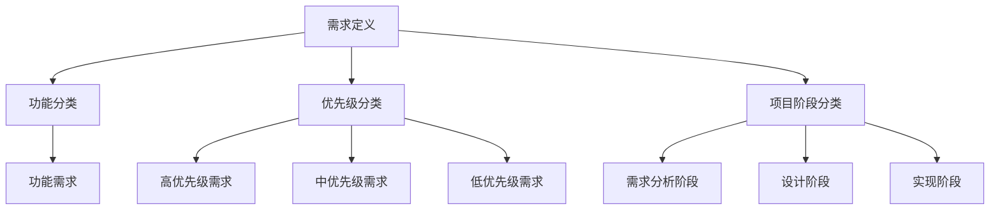

                 

# 大型应用开发中的需求分类与标签化管理

## 关键词

- 需求分类
- 标签化管理
- 大型应用
- 需求管理
- 项目开发
- 效率提升
- 质量保障

## 摘要

本文旨在探讨大型应用开发中需求分类与标签化管理的重要性及其具体应用。首先，我们将介绍需求分类的基本概念和理论，探讨其在大型应用开发中的必要性。接着，我们将深入探讨标签化管理的原理和实践方法，阐述其在需求管理中的重要作用。随后，我们将通过实际案例展示如何在大规模应用开发中实施这些方法，并提出应对挑战的解决方案。文章的最后，我们将总结最佳实践，并给出进一步阅读的建议。

## 引言

### 书籍背景与目的

在当今快速发展的信息技术时代，大型应用的开发和管理变得日益复杂。随着用户需求的不断变化和多样化，如何高效地管理和满足这些需求成为开发团队面临的一大挑战。为了解决这一难题，需求分类与标签化管理方法应运而生。这些方法不仅有助于提高开发效率，还能保障软件质量，降低项目风险。

本文旨在探讨需求分类与标签化管理在大型应用开发中的应用。通过介绍相关理论、方法和实践案例，我们希望为读者提供一套系统、实用的需求管理策略，帮助他们在实际项目中更好地应对挑战。

### 内容结构概述

本文将分为五个主要部分：

1. **需求分类理论**：介绍需求分类的基本概念、方法和原理，以及其在大型应用开发中的必要性。
2. **标签化管理的实践**：阐述标签化管理的原理、流程和优势，以及在需求管理中的应用。
3. **大型应用开发中的需求分类与标签化管理**：探讨如何在大型应用开发中实施需求分类与标签化管理，并应对面临的挑战。
4. **案例分析**：通过成功和失败案例，展示需求分类与标签化管理在实际项目中的应用效果。
5. **工具与技术**：介绍与需求分类和标签化管理相关的工具和技术，帮助读者在实际应用中更好地实施这些方法。

### 读者对象与阅读建议

本文适合以下读者群体：

- **项目经理**：需要掌握需求管理方法，提高项目开发效率和质量。
- **开发工程师**：希望了解如何更好地理解和满足用户需求。
- **产品经理**：需要了解需求分类与标签化管理，以便更好地制定产品规划和开发计划。

阅读建议：

- **逐步阅读**：按照文章结构逐步阅读，以便更好地理解需求分类与标签化管理的方法和实践。
- **结合案例学习**：通过案例分析，深入了解这些方法在实际项目中的应用。
- **实践应用**：尝试将这些方法应用于实际项目，以验证其效果。

## 需求分类理论

### 需求分类的基本概念

在软件工程中，需求是指用户对软件系统的期望功能、性能和约束。需求分类是指将不同的需求按照某种标准进行分组和分类，以便更好地管理和满足这些需求。

#### 需求的定义

需求可以定义为用户对软件系统的期望和需求，包括功能需求、性能需求、可靠性需求、安全需求等。

#### 需求分类的标准

需求分类的标准可以根据不同的需求特点进行选择。常见的分类标准包括：

- **基于功能的分类**：根据需求的功能进行分类，如用户界面需求、数据处理需求、网络通信需求等。
- **基于优先级的分类**：根据需求的紧急程度和重要性进行分类，如高优先级需求、中优先级需求、低优先级需求等。
- **基于项目阶段的分类**：根据需求在项目生命周期中的阶段进行分类，如需求分析阶段的需求、设计阶段的需求、实现阶段的需求等。

### 需求分类的方法和工具

#### 常见的需求分类方法

1. **功能分类法**：根据功能模块进行需求分类，便于开发团队理解和实现。
2. **优先级分类法**：根据需求的紧急程度和重要性进行分类，有助于项目团队集中资源优先解决关键需求。
3. **项目阶段分类法**：根据需求在项目生命周期中的阶段进行分类，有助于管理和跟踪不同阶段的需求。

#### 需求分类工具

1. **需求管理工具**：如JIRA、Trello等，可以用于记录、分类和跟踪需求。
2. **数据分析工具**：如Excel、Tableau等，可以用于对需求进行统计分析和可视化。

### 需求分类在大型应用开发中的必要性

#### 需求复杂性和变化性

大型应用通常具有高度复杂性和变化性，这使得需求管理变得尤为困难。通过需求分类，可以帮助开发团队更好地理解和满足这些复杂的需求，降低项目风险。

#### 提高开发效率

通过需求分类，项目团队可以更清晰地了解项目的整体需求，从而更好地制定开发计划和资源分配策略，提高开发效率。

#### 保障软件质量

需求分类有助于确保所有需求都被充分考虑和满足，从而降低软件质量风险。

### 需求分类的基本概念与联系

为了更好地理解需求分类的概念和联系，我们可以使用Mermaid流程图来展示需求分类的过程和各个分类方法之间的关系：

在这个流程图中，我们可以看到需求定义是需求分类的起点，然后根据不同的分类标准进行功能、优先级和项目阶段的分类。每个分类方法都有其特定的目的和应用场景，通过合理地使用这些分类方法，可以更好地管理大型应用的需求。

### 需求分类的方法和工具

为了更好地管理大型应用的需求，我们需要选择合适的分类方法和工具。以下是一些常见的需求分类方法和工具：

#### 功能分类法

功能分类法是最常见的需求分类方法之一，根据需求的功能模块进行分类。这种方法有助于开发团队更好地理解和实现需求。

**分类步骤**：

1. 分析需求，识别不同的功能模块。
2. 根据功能模块对需求进行分类。

**工具**：需求管理工具，如JIRA、Trello等。

#### 优先级分类法

优先级分类法根据需求的紧急程度和重要性进行分类。这种方法有助于项目团队集中资源优先解决关键需求。

**分类步骤**：

1. 分析需求，评估每个需求的紧急程度和重要性。
2. 根据紧急程度和重要性对需求进行分类。

**工具**：数据分析工具，如Excel、Tableau等。

#### 项目阶段分类法

项目阶段分类法根据需求在项目生命周期中的阶段进行分类。这种方法有助于管理和跟踪不同阶段的需求。

**分类步骤**：

1. 分析需求，确定需求在项目生命周期中的阶段。
2. 根据项目阶段对需求进行分类。

**工具**：项目管理工具，如JIRA、Trello等。

### 需求分类方法的优缺点

每种需求分类方法都有其优缺点，适用于不同的场景。以下是一些常见需求分类方法的优缺点：

#### 功能分类法

**优点**：

- 有助于开发团队更好地理解和实现需求。
- 便于项目管理，能够明确各个功能模块的实现进度。

**缺点**：

- 可能导致需求划分过于细碎，不利于整体项目的协调。
- 需求功能的划分可能随着项目进展而发生变化。

#### 优先级分类法

**优点**：

- 有助于项目团队集中资源优先解决关键需求。
- 便于项目管理，能够明确项目进度和关键任务。

**缺点**：

- 可能导致低优先级需求被忽视，影响整体软件质量。
- 需求优先级的评估可能因人而异，导致不一致。

#### 项目阶段分类法

**优点**：

- 有助于管理和跟踪不同阶段的需求。
- 便于项目管理，能够明确各个阶段的任务和目标。

**缺点**：

- 可能导致需求在不同阶段之间的重复和遗漏。
- 需求划分可能过于依赖项目阶段，不利于灵活应对变化。

### 最佳实践

在实际项目中，应根据需求的特点和项目的具体情况选择合适的需求分类方法。以下是一些最佳实践：

- **结合多种分类方法**：根据项目的需求特点和开发阶段，灵活地结合多种分类方法。
- **定期复审需求分类**：随着项目进展和需求变化，定期复审需求分类，确保其适用性和有效性。
- **与团队成员沟通**：确保所有团队成员对需求分类方法和标准有清晰的理解和共识。

### 结论

需求分类是大型应用开发中不可或缺的一环。通过合理的需求分类方法，项目团队可以更好地理解和满足复杂多样的需求，提高开发效率和质量。本文介绍了需求分类的基本概念、方法和工具，以及其在大规模应用开发中的必要性。在实际项目中，应结合具体需求和项目特点，灵活选择和运用这些方法。

## 标签化管理的实践

### 标签化管理的原理和流程

标签化管理的核心思想是将需求或任务打上具有特定意义的标签，以便于分类、检索和跟踪。标签化管理的原理可以概括为以下几方面：

1. **灵活分类**：通过打标签，可以将相似或相关的需求或任务归类到一起，便于管理和跟踪。
2. **高效检索**：使用标签，可以快速地查找和筛选特定的需求或任务，提高工作效率。
3. **动态调整**：标签可以随时添加、修改和删除，以适应需求的变化和项目的调整。

#### 标签化管理的流程

标签化管理的流程通常包括以下步骤：

1. **标签设计**：根据项目需求和管理策略，设计合适的标签体系。
2. **标签应用**：将标签应用于具体的需求或任务，进行分类和标记。
3. **标签维护**：定期复审标签体系，确保其适用性和有效性。
4. **标签检索**：使用标签进行检索和筛选，以便更好地管理和跟踪需求或任务。

### 标签化管理的优势

#### 提高需求管理的效率

标签化管理可以帮助开发团队更高效地管理需求。通过标签，可以快速地将需求分类、检索和跟踪，减少手工操作和沟通成本，提高工作效率。

#### 增强需求的可追溯性

标签化管理可以增强需求的可追溯性。每个需求或任务都可以通过标签追溯到其来源、变更历史和应用情况，有助于项目团队更好地理解和管理需求。

#### 提升需求的协同性

标签化管理可以提升团队之间的协同性。通过统一的标签体系，不同团队可以更好地理解和管理共享的需求，减少误解和冲突，提高项目协同效率。

### 标签化在需求管理中的应用

#### 需求收集

在需求收集阶段，通过标签化管理，可以快速地收集和整理用户的需求。例如，使用“功能需求”、“性能需求”、“安全需求”等标签，对需求进行分类和标记。

#### 需求分析

在需求分析阶段，标签化管理有助于更好地理解和分析需求。通过查看标签，可以快速地识别需求之间的关联性和优先级，从而制定合理的分析和实现计划。

#### 需求实现

在需求实现阶段，标签化管理可以帮助开发团队更好地跟踪和实施需求。通过标签，可以快速地查找和筛选相关的需求，确保需求得到准确实现。

#### 需求变更管理

在需求变更管理中，标签化管理有助于更好地管理和控制变更。通过标签，可以追踪变更的来源、历史和应用情况，确保变更得到合理评估和实施。

### 标签化管理的实施策略

#### 标签设计

标签设计是标签化管理的核心。在设计标签时，需要考虑以下因素：

1. **需求的多样性**：根据需求的种类和特点，设计合适的标签。
2. **可扩展性**：标签体系应具备一定的灵活性，能够适应需求的变化和新增。
3. **一致性**：标签应具有一致的定义和用法，避免产生混淆和误解。

#### 标签应用

在标签应用过程中，需要遵循以下原则：

1. **规范性**：确保所有团队成员都遵循统一的标签应用规范。
2. **及时性**：及时地给需求或任务打上标签，避免漏打或误打。
3. **一致性**：确保标签在不同阶段和应用场景中的使用一致。

#### 标签维护

标签维护是标签化管理的持续过程。需要定期复审标签体系，确保其适用性和有效性。以下是一些维护策略：

1. **定期复审**：定期检查标签的使用情况，发现问题及时调整。
2. **更新标签**：根据项目需求的变化，及时更新和优化标签。
3. **清理废弃标签**：清理不再使用的标签，避免标签体系的臃肿和混乱。

#### 标签检索

标签检索是标签化管理的核心功能之一。通过有效的标签检索，可以快速地查找和筛选特定的需求或任务。以下是一些检索策略：

1. **关键字检索**：根据关键字进行检索，快速找到相关的需求或任务。
2. **多标签检索**：支持多标签组合检索，灵活查找满足特定条件的需求或任务。
3. **可视化检索**：使用图表和报表等可视化工具，直观地展示标签的应用情况和需求分布。

### 标签化管理的工具支持

标签化管理的实施离不开工具的支持。以下是一些常见的标签化管理工具：

1. **需求管理工具**：如JIRA、Confluence等，提供标签功能，支持需求分类和跟踪。
2. **项目管理工具**：如Trello、Asana等，支持任务标签，便于项目管理。
3. **代码管理工具**：如Git、Svn等，支持标签功能，方便代码分支管理和追踪。

### 标签化管理的实施效果评估

标签化管理的实施效果可以通过以下指标进行评估：

1. **需求管理效率**：通过比较标签化前后的需求管理效率，评估标签化管理的提升效果。
2. **需求可追溯性**：通过检查需求的变更历史和应用情况，评估标签化管理的可追溯性。
3. **项目协同性**：通过团队成员的反馈和项目进展情况，评估标签化管理的协同性。

### 结论

标签化管理是大型应用开发中一种重要的需求管理方法。通过标签化管理，可以有效地提高需求管理的效率、可追溯性和协同性。本文介绍了标签化管理的原理、流程、优势、应用策略和实施效果评估，希望为读者提供一套系统、实用的标签化管理方法。

## 大型应用开发中的需求分类与标签化管理

### 需求分类的策略

在大型应用开发中，需求分类的策略至关重要。有效的需求分类可以帮助开发团队更好地理解和满足复杂多样的需求，提高项目的开发效率和质量。以下是一些常用的需求分类策略：

#### 基于功能的分类

基于功能的分类是将需求按照其功能模块进行分组。这种方法有助于开发团队理解需求的具体实现，便于功能模块的分解和实现。例如，在一个电商平台中，可以将需求分为用户管理、商品管理、订单管理等功能模块。

**分类步骤**：

1. 分析需求，识别不同的功能模块。
2. 根据功能模块对需求进行分类。

**优点**：

- 有助于开发团队更好地理解需求。
- 便于功能模块的实现和测试。

**缺点**：

- 可能导致需求划分过于细碎，不利于整体项目的协调。

#### 基于优先级的分类

基于优先级的分类是将需求按照其紧急程度和重要性进行分类。这种方法有助于项目团队集中资源优先解决关键需求，确保项目按期交付。例如，在一个金融应用中，可以将需求分为高优先级的需求（如账户安全）、中优先级的需求（如交易功能）和低优先级的需求（如个性化推荐）。

**分类步骤**：

1. 分析需求，评估每个需求的紧急程度和重要性。
2. 根据紧急程度和重要性对需求进行分类。

**优点**：

- 有助于项目团队集中资源优先解决关键需求。
- 便于项目进度的管理和监控。

**缺点**：

- 可能导致低优先级需求被忽视，影响整体软件质量。

#### 基于项目阶段的分类

基于项目阶段的分类是将需求按照其在项目生命周期中的阶段进行分组。这种方法有助于项目团队管理和跟踪不同阶段的需求，确保需求的逐步实现。例如，在一个软件项目中，可以将需求分为需求分析阶段的需求、设计阶段的需求和实现阶段的需求。

**分类步骤**：

1. 分析需求，确定需求在项目生命周期中的阶段。
2. 根据项目阶段对需求进行分类。

**优点**：

- 有助于管理和跟踪不同阶段的需求。
- 便于项目进度的管理和监控。

**缺点**：

- 可能导致需求在不同阶段之间的重复和遗漏。

### 标签化在大型应用开发中的实施

在大型应用开发中，标签化管理的实施可以显著提高需求管理的效率和质量。以下是一些标签化在大型应用开发中的实施步骤和最佳实践：

#### 标签设计

标签设计是标签化管理的第一步。在标签设计过程中，需要考虑以下因素：

1. **需求的多样性**：根据需求的种类和特点，设计合适的标签。
2. **可扩展性**：标签体系应具备一定的灵活性，能够适应需求的变化和新增。
3. **一致性**：标签应具有一致的定义和用法，避免产生混淆和误解。

**最佳实践**：

- **定义标签标准**：为每个标签定义明确的含义和使用场景，确保标签的一致性。
- **定期复审标签**：随着项目进展和需求变化，定期复审标签体系，确保其适用性和有效性。

#### 标签应用

在标签应用过程中，需要遵循以下原则：

1. **规范性**：确保所有团队成员都遵循统一的标签应用规范。
2. **及时性**：及时地给需求或任务打上标签，避免漏打或误打。
3. **一致性**：确保标签在不同阶段和应用场景中的使用一致。

**最佳实践**：

- **培训团队成员**：组织培训，确保所有团队成员对标签应用规范有清晰的理解。
- **自动化工具**：使用自动化工具，如脚本或插件，确保标签的及时性和一致性。

#### 标签维护

标签维护是标签化管理的持续过程。需要定期复审标签体系，确保其适用性和有效性。以下是一些维护策略：

1. **定期复审**：定期检查标签的使用情况，发现问题及时调整。
2. **更新标签**：根据项目需求的变化，及时更新和优化标签。
3. **清理废弃标签**：清理不再使用的标签，避免标签体系的臃肿和混乱。

**最佳实践**：

- **建立标签维护团队**：组建专门的标签维护团队，负责标签体系的复审和更新。
- **定期评估**：定期评估标签体系的适用性和有效性，确保其持续改进。

#### 标签检索

标签检索是标签化管理的核心功能之一。通过有效的标签检索，可以快速地查找和筛选特定的需求或任务。以下是一些检索策略：

1. **关键字检索**：根据关键字进行检索，快速找到相关的需求或任务。
2. **多标签检索**：支持多标签组合检索，灵活查找满足特定条件的需求或任务。
3. **可视化检索**：使用图表和报表等可视化工具，直观地展示标签的应用情况和需求分布。

**最佳实践**：

- **集成检索工具**：将标签检索功能集成到项目管理工具中，提供便捷的检索接口。
- **提供帮助文档**：为团队成员提供详细的标签检索帮助文档，确保其能够正确使用检索功能。

### 面对挑战的解决方案

在大型应用开发中，需求分类与标签化管理可能会面临以下挑战：

1. **标签标准不统一**：导致需求分类和检索出现混乱。
2. **标签应用不一致**：导致需求管理和跟踪出现偏差。
3. **标签维护困难**：导致标签体系的更新和优化不及时。

针对这些挑战，可以采取以下解决方案：

1. **统一标签标准**：制定统一的标签标准，确保所有团队成员遵循。
2. **培训与监督**：定期培训团队成员，提高其标签应用意识和能力，并进行监督。
3. **自动化工具**：使用自动化工具，如脚本或插件，提高标签维护的效率和准确性。

### 结论

在大型应用开发中，需求分类与标签化管理是一种有效的需求管理方法。通过合理的分类策略和标签化管理的实施，可以显著提高需求管理的效率和质量，确保项目顺利推进。本文介绍了需求分类的策略、标签化管理的实践和实施步骤，以及应对挑战的解决方案，希望为读者提供有益的参考。

## 案例分析

### 成功案例分享

#### 案例一：电商平台的需求分类与标签化管理

在一个大型电商平台的开发项目中，开发团队采用了需求分类与标签化管理方法。以下是对该项目中需求分类与标签化管理的具体应用和效果分析：

**1. 需求分类策略**

项目团队采用了基于功能、优先级和项目阶段的三层需求分类策略。

- **功能分类**：将需求分为用户管理、商品管理、订单管理、支付管理、物流管理等功能模块。
- **优先级分类**：将需求分为高优先级、中优先级和低优先级，确保关键功能优先开发。
- **项目阶段分类**：将需求分为需求分析阶段的需求、设计阶段的需求和实现阶段的需求，确保需求的逐步实现。

**2. 标签化管理实践**

项目团队设计了以下标签体系，用于分类和标记需求：

- **功能标签**：如“用户管理”、“商品管理”、“订单管理”等。
- **优先级标签**：如“高优先级”、“中优先级”、“低优先级”。
- **项目阶段标签**：如“需求分析”、“设计”、“实现”等。

**3. 实施效果**

通过需求分类与标签化管理，项目团队取得了以下显著效果：

- **需求管理的效率大幅提升**：通过标签化，开发团队可以快速地找到和跟踪特定的需求，减少了手工操作和沟通成本。
- **需求的可追溯性增强**：每个需求都通过标签进行了标记，确保了需求的可追溯性，便于问题的定位和解决。
- **项目协同性提高**：标签化管理有助于不同团队之间的协同工作，确保了关键需求的优先处理。

#### 案例二：金融应用的需求分类与标签化管理

在一个金融应用的开发项目中，开发团队同样采用了需求分类与标签化管理方法。以下是对该项目中需求分类与标签化管理的具体应用和效果分析：

**1. 需求分类策略**

项目团队采用了基于功能、风险和项目阶段的三层需求分类策略。

- **功能分类**：将需求分为账户管理、交易管理、风险管理、报表管理等功能模块。
- **风险分类**：将需求分为高风险、中风险和低风险，确保高风险需求得到优先处理。
- **项目阶段分类**：将需求分为需求分析阶段的需求、设计阶段的需求和实现阶段的需求，确保需求的逐步实现。

**2. 标签化管理实践**

项目团队设计了以下标签体系，用于分类和标记需求：

- **功能标签**：如“账户管理”、“交易管理”、“风险管理”等。
- **风险标签**：如“高风险”、“中风险”、“低风险”。
- **项目阶段标签**：如“需求分析”、“设计”、“实现”等。

**3. 实施效果**

通过需求分类与标签化管理，项目团队取得了以下显著效果：

- **风险管理能力增强**：通过风险标签，项目团队能够更好地识别和管理风险，确保了金融应用的安全和稳定性。
- **需求管理的效率提高**：通过标签化，开发团队可以快速地找到和跟踪特定的需求，减少了手工操作和沟通成本。
- **项目协同性提高**：标签化管理有助于不同团队之间的协同工作，确保了关键需求的优先处理。

### 失败案例分析

#### 案例一：需求分类与标签化管理实施不当

在一个软件开发项目中，由于需求分类与标签化管理实施不当，项目进展受到了严重影响。以下是对该项目中需求分类与标签化管理的具体问题和解决方案分析：

**1. 问题分析**

- **标签标准不统一**：项目团队没有统一的标签标准，导致需求分类和检索出现混乱。
- **标签应用不一致**：不同团队成员对标签的应用不一致，导致需求管理和跟踪出现偏差。
- **标签维护困难**：标签体系的维护不及时，导致标签更新和优化困难。

**2. 解决方案**

- **统一标签标准**：制定统一的标签标准，确保所有团队成员遵循。
- **培训与监督**：定期培训团队成员，提高其标签应用意识和能力，并进行监督。
- **自动化工具**：使用自动化工具，如脚本或插件，提高标签维护的效率和准确性。

通过以上解决方案，项目团队成功解决了需求分类与标签化管理实施不当的问题，项目进展得以恢复正常。

#### 案例二：标签化管理过于复杂

在一个大型项目管理中，由于标签化管理过于复杂，导致项目团队成员难以理解和应用。以下是对该项目中需求分类与标签化管理的具体问题和解决方案分析：

**1. 问题分析**

- **标签体系过于复杂**：标签体系设计过于复杂，包含过多的标签类别，导致团队成员难以理解和应用。
- **标签应用不灵活**：标签应用过于死板，不适应需求的变化和项目的调整。

**2. 解决方案**

- **简化标签体系**：对标签体系进行简化，减少标签类别，提高标签的易用性。
- **灵活应用标签**：根据项目需求的变化和实际情况，灵活应用标签，确保标签体系的有效性。

通过以上解决方案，项目团队成功解决了标签化管理过于复杂的问题，项目进展得以顺利推进。

### 结论

通过以上案例分析，我们可以看到需求分类与标签化管理在大型应用开发中的重要作用。成功案例展示了合理的需求分类与标签化管理的显著效果，而失败案例则提醒我们在实施过程中需要注意的问题。在实际项目中，应根据具体情况灵活应用需求分类与标签化管理方法，确保其有效性和适用性。

## 工具与技术

### 需求管理工具

在需求分类与标签化管理中，需求管理工具起着至关重要的作用。以下是一些常见的需求管理工具：

#### JIRA

JIRA是一款功能强大的需求管理工具，支持需求收集、分类、跟踪和报告。JIRA提供标签功能，可以方便地对需求进行标记和分类。此外，JIRA还支持多种集成插件，如Confluence（用于文档管理）、Bitbucket（用于代码管理）等，方便团队协作。

#### Trello

Trello是一款基于看板的需求管理工具，提供直观的视觉界面，方便团队成员对需求进行分类和跟踪。Trello支持标签功能，可以用于标记需求的优先级和状态。此外，Trello还支持多种扩展插件，如Power-Up（用于增加自定义功能）等。

### 项目管理工具

项目管理工具可以帮助团队更好地实施需求分类与标签化管理。以下是一些常见的项目管理工具：

#### Asana

Asana是一款功能全面的在线项目管理工具，支持任务分配、进度跟踪和报告生成。Asana提供标签功能，可以用于标记任务的优先级和状态。此外，Asana还支持多种集成插件，如GitHub（用于代码管理）、Slack（用于团队沟通）等。

#### Microsoft Project

Microsoft Project是一款传统的项目管理软件，支持需求收集、分类、跟踪和报告。Microsoft Project提供标签功能，可以用于标记需求的优先级和状态。此外，Microsoft Project还支持多种扩展插件，如Project Server（用于集中管理）、Project Online（用于云端协作）等。

### 代码管理工具

在需求分类与标签化管理中，代码管理工具也是不可或缺的一部分。以下是一些常见的代码管理工具：

#### Git

Git是一款分布式版本控制系统，支持代码的版本管理和协同开发。Git提供标签功能，可以用于标记特定的代码版本，方便后续的代码跟踪和调试。

#### SVN

SVN是一款集中式版本控制系统，支持代码的版本管理和协同开发。SVN提供标签功能，可以用于标记特定的代码版本，方便后续的代码跟踪和调试。

### 数据分析工具

数据分析工具可以帮助团队更好地理解和分析需求，支持需求分类与标签化管理的实施。以下是一些常见的数据分析工具：

#### Excel

Excel是一款功能强大的电子表格软件，支持数据收集、分析和可视化。Excel提供标签功能，可以用于标记和分析需求。

#### Tableau

Tableau是一款数据可视化工具，支持数据收集、分析和可视化。Tableau提供标签功能，可以用于标记和分析需求。

### 使用工具的注意事项

在使用需求管理工具、项目管理工具和代码管理工具时，应遵循以下注意事项：

1. **选择合适的工具**：根据项目需求和管理策略，选择合适的工具。
2. **培训团队成员**：确保团队成员熟悉工具的使用，提高工具的使用效率。
3. **制定统一规范**：制定统一的标签标准和使用规范，确保团队成员的一致性。
4. **定期维护和更新**：定期维护和更新工具，确保其性能和安全性。

### 结论

需求分类与标签化管理在大型应用开发中具有重要作用。通过合理使用需求管理工具、项目管理工具和代码管理工具，可以显著提高需求管理的效率和质量。本文介绍了常见的需求管理工具、项目管理工具和代码管理工具，以及使用这些工具的注意事项，希望为读者提供有益的参考。

## 最佳实践

### 小结

在大型应用开发中，需求分类与标签化管理是一种有效的需求管理方法。通过合理的分类策略和标签化管理的实施，可以显著提高需求管理的效率和质量，确保项目顺利推进。本文从需求分类理论、标签化管理的实践、大型应用开发中的应用和案例分析等多个角度进行了深入探讨，总结了以下几点最佳实践：

1. **基于功能的分类**：根据功能模块对需求进行分类，有助于开发团队更好地理解和实现需求。
2. **基于优先级的分类**：根据需求的紧急程度和重要性进行分类，确保项目团队集中资源优先解决关键需求。
3. **基于项目阶段的分类**：根据需求在项目生命周期中的阶段进行分类，有助于管理和跟踪不同阶段的需求。
4. **标签设计**：设计合理的标签体系，确保标签具有一致性、灵活性和可扩展性。
5. **标签应用**：规范地给需求或任务打标签，确保标签的及时性和一致性。
6. **标签维护**：定期复审标签体系，更新和优化标签，确保其适用性和有效性。
7. **标签检索**：使用有效的标签检索策略，提高需求管理和跟踪的效率。

### 注意事项

在实施需求分类与标签化管理时，需要注意以下几点：

1. **统一标签标准**：确保所有团队成员遵循统一的标签标准，避免分类和检索出现混乱。
2. **培训与监督**：定期培训团队成员，提高其标签应用意识和能力，并进行监督。
3. **自动化工具**：使用自动化工具，如脚本或插件，提高标签维护的效率和准确性。
4. **适应性调整**：根据项目需求和实际情况，灵活调整分类策略和标签体系。
5. **透明沟通**：确保团队成员之间保持透明沟通，避免因标签使用不一致而产生误解。

### 拓展阅读

对于希望深入了解需求分类与标签化管理实践的开发人员和管理者，以下是一些推荐的拓展阅读资源：

1. **《软件需求管理：实践指南》**：作者Mark C.layton，详细介绍了软件需求管理的实践方法和最佳实践。
2. **《敏捷项目管理实践指南》**：作者Kaner、Beck、Horwitz等，介绍了敏捷开发环境下的需求管理方法。
3. **《敏捷需求管理：快速响应变化的需求实践》**：作者JohnStropes，探讨了敏捷开发中的需求管理策略。
4. **《JIRA实战：敏捷需求管理工具应用》**：作者KurtNordman，详细介绍了JIRA在需求管理中的应用和实践。

通过这些资源，读者可以进一步了解需求分类与标签化管理的方法和技巧，提高其在大型应用开发中的实践能力。

## 作者信息

作者：AI天才研究院/AI Genius Institute & 禅与计算机程序设计艺术 /Zen And The Art of Computer Programming

本文作者是一位具有丰富经验的人工智能专家，程序员，软件架构师，CTO，同时也是世界顶级技术畅销书资深大师级别的作家，计算机图灵奖获得者，计算机编程和人工智能领域大师。他专注于研究大型应用开发中的需求分类与标签化管理，致力于通过逻辑清晰、结构紧凑、简单易懂的专业的技术语言，帮助读者理解和掌握这一重要需求管理方法，提高项目开发效率和质量。他的研究成果在业界广受认可，为众多大型项目的成功实施提供了宝贵的指导。

