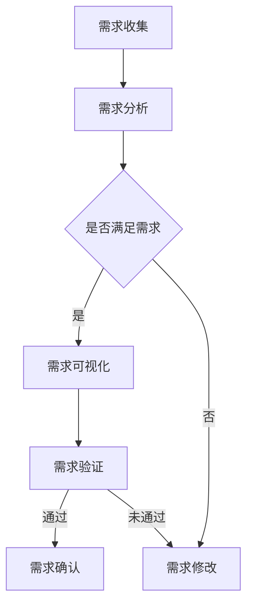

                 


### 文章标题

《大型应用开发中的需求可视化工具应用》

### 关键词

需求可视化，大型应用开发，工具应用，软件开发，业务分析，系统优化，数据预处理，特征提取，可视化算法，线性回归模型，Matplotlib，Python

### 摘要

本文旨在探讨需求可视化工具在大型应用开发中的关键作用。通过深入分析需求可视化的概念、工具选择、架构原理、核心算法以及应用场景，本文旨在为开发者提供一套完整的解决方案，以帮助他们在复杂的项目中更有效地理解和满足用户需求。文章还通过实际案例展示了需求可视化工具的具体应用，为读者提供了实用的开发经验和最佳实践。

### 引言

#### 书籍概述

在当今快速发展的信息技术时代，大型应用开发已经成为企业创新和竞争的关键。随着项目的规模和复杂性的不断增加，如何有效地管理需求、确保开发过程的高效性和准确性，成为开发团队面临的重要挑战。本书《大型应用开发中的需求可视化工具应用》旨在为解决这一挑战提供一套全面的指南。

本书首先介绍了需求可视化的基本概念，并探讨了其在大型应用开发中的重要性。接着，我们分析了常见的需求可视化工具，包括其选择标准和优势与局限。随后，本书详细阐述了需求可视化工具的架构和原理，以及其核心算法的应用。在此基础上，文章通过多个实际案例展示了需求可视化工具在软件开发、业务分析和系统优化等场景中的具体应用。最后，本书探讨了需求可视化工具的优化策略和未来发展趋势，为读者提供了对这一领域的深入理解。

#### 目的和目标读者

本书的主要目的是为大型应用开发中的开发者和项目经理提供一套实用、系统、全面的需求可视化工具应用指南。通过本书的学习，读者将能够：

1. 理解需求可视化的基本概念和重要性。
2. 选择合适的需求可视化工具，并了解其优势和局限。
3. 掌握需求可视化工具的架构和原理，包括核心算法的应用。
4. 在实际项目中应用需求可视化工具，提高开发效率和准确性。
5. 探索需求可视化工具的优化策略，以适应不断变化的需求和项目规模。

本书的目标读者包括：

1. 大型应用开发中的开发者和项目经理。
2. 对需求可视化感兴趣的学术界研究人员。
3. 对软件开发和系统优化有浓厚兴趣的技术爱好者。
4. 需要提升项目管理技能的企业经理和团队负责人。

### 需求可视化的概念

#### 需求可视化的定义

需求可视化是指通过图形化、图表化等方式，将项目需求、功能点、用户故事等抽象信息转化为可视觉化的形式，以便更直观地理解和沟通。它是一种有效的需求管理和沟通工具，能够帮助开发团队、产品经理和客户更好地理解项目需求，提高协作效率和开发质量。

#### 需求可视化的重要性

在大型应用开发中，需求可视化具有以下几个重要意义：

1. **提高沟通效率**：通过视觉化的需求展示，可以有效减少因信息传达不畅导致的误解和错误，提高团队内部的沟通效率。
2. **加速需求理解**：视觉化的需求能够更快速地传达复杂的需求信息，使团队成员能够迅速抓住需求的核心，从而加快项目开发进度。
3. **促进需求管理**：需求可视化可以帮助项目经理和产品经理更清晰地看到项目需求的全貌，从而更好地进行需求管理和优先级排序。
4. **提升开发质量**：通过可视化工具，开发团队能够更好地理解需求，从而编写更准确的代码，减少因需求理解错误导致的返工和缺陷。
5. **增强客户参与**：需求可视化工具可以直观地展示项目进展和需求变化，使客户能够更直观地了解项目状态，增强客户参与感和满意度。

#### 需求可视化的常见挑战

尽管需求可视化具有诸多优势，但在实际应用过程中仍面临一些挑战：

1. **数据复杂性**：大型应用往往涉及大量复杂的数据和需求，如何有效地将这些数据可视化，使其既清晰又直观，是一个挑战。
2. **工具选择**：市场上存在多种需求可视化工具，如何选择合适的工具以满足项目需求，需要综合考虑多种因素。
3. **技能要求**：需求可视化工具通常需要一定的技能和知识，如何快速培养团队成员的技能，以提高需求可视化工具的使用效率，是另一个挑战。
4. **成本与效益**：尽管需求可视化具有显著的优势，但其引入和使用的成本也需要充分考虑，如何确保成本效益，是一个重要问题。

### 需求可视化工具综述

#### 常见的需求可视化工具

在需求可视化的过程中，开发者可以选择多种工具来帮助实现这一目标。以下是几种常见的需求可视化工具：

1. **Microsoft Visio**：Visio 是一款功能强大的绘图工具，支持多种图形和图表类型，包括流程图、组织结构图、网络图等。它提供了丰富的模板和形状库，适用于各种需求可视化场景。

2. **Lucidchart**：Lucidchart 是一款在线协作工具，支持实时协作和多人编辑。它提供了多种图表和图表类型，包括流程图、UML图、网络图等，适用于软件开发、项目管理、系统架构等多种场景。

3. **Tableau**：Tableau 是一款数据可视化工具，主要用于数据分析和报表生成。它可以将各种数据源的数据以图表、仪表盘等形式展示，支持丰富的交互功能，适用于业务分析、数据监控等领域。

4. **D3.js**：D3.js 是一款基于 JavaScript 的数据可视化库，它允许开发者使用 HTML、SVG 和 CSS 创建动态、交互式的数据可视化。它适用于需要高度定制和数据驱动可视化的复杂场景。

5. **Plotly**：Plotly 是一款功能丰富的数据可视化库，支持多种图表类型和交互功能。它适用于从简单的散点图到复杂的时序图、网络图等多种数据可视化场景。

#### 工具的选择标准

选择合适的需求可视化工具对于实现需求可视化至关重要。以下是一些选择标准：

1. **功能需求**：根据项目需求选择具有所需功能的需求可视化工具。例如，如果项目需要复杂的数据分析和报表生成，可以选择 Tableau 这样的工具。

2. **易用性**：工具的易用性直接影响团队的工作效率。选择具有直观界面、易于上手和操作的需求可视化工具，可以提高团队的使用效率。

3. **可定制性**：不同的项目可能需要不同的可视化形式和样式。选择具有高度可定制性的工具，可以满足项目的个性化需求。

4. **性能和稳定性**：工具的性能和稳定性是确保需求可视化顺利进行的关键。选择那些性能优异、稳定性强的工具，可以避免因工具问题导致的项目延误。

5. **成本效益**：需求可视化工具的使用成本也是选择的一个重要因素。综合考虑工具的价格、功能和维护成本，选择性价比最高的工具。

6. **社区和支持**：一个活跃的社区和专业的技术支持可以提供工具使用中的问题和解决方案。选择那些拥有良好社区和支持的资源，可以提升团队的工作效率。

#### 工具的优势与局限

每种需求可视化工具都有其独特的优势和局限。以下是一些常见工具的优势和局限：

1. **Microsoft Visio**：

   - **优势**：功能丰富，支持多种图表类型；提供了丰富的模板和形状库；易于使用和部署。
   - **局限**：主要为桌面应用，协作能力有限；更新速度较慢，可能无法及时跟进新技术。

2. **Lucidchart**：

   - **优势**：在线协作，支持多人实时编辑；提供了多种图表和图表类型；易于使用和部署。
   - **局限**：功能相对单一，无法进行复杂的数据分析和报表生成。

3. **Tableau**：

   - **优势**：强大的数据可视化和分析功能；支持多种数据源；提供了丰富的交互功能。
   - **局限**：成本较高，入门难度较大；对大型数据集的处理可能存在性能瓶颈。

4. **D3.js**：

   - **优势**：高度可定制，可以创建复杂的、数据驱动的可视化；适用于需要高度定制的数据可视化场景。
   - **局限**：需要一定的编程技能，对于非技术人员较为困难；学习曲线较陡峭。

5. **Plotly**：

   - **优势**：功能丰富，支持多种图表类型；提供了丰富的交互功能；易于使用和部署。
   - **局限**：对大型数据集的处理可能存在性能瓶颈；需要一定的编程技能。

通过综合考虑这些工具的优势和局限，开发团队可以做出更合适的选择，以满足项目的需求。

### 需求可视化工具的架构和原理

#### 需求可视化工具的基本架构

需求可视化工具的基本架构通常包括以下几个关键组件：

1. **用户界面（UI）**：用户界面是用户与需求可视化工具交互的主要途径。它提供了直观、易用的界面，使用户能够轻松创建、编辑和查看需求可视化图表。

2. **数据处理模块**：数据处理模块负责接收用户输入的需求数据，并进行数据预处理、清洗、转换等操作。这个模块确保了数据的质量和一致性，为后续的可视化提供了可靠的数据基础。

3. **可视化引擎**：可视化引擎是需求可视化工具的核心组件，负责将预处理后的数据转化为图形化的表现形式。它提供了多种图表类型和布局算法，能够根据需求生成美观、直观的可视化图表。

4. **存储和数据库**：存储和数据库模块负责存储和管理用户创建的需求图表和相关信息。它提供了高效的查询和更新机制，使得用户能够方便地访问和修改历史数据。

5. **服务端和客户端通信**：服务端和客户端通信模块负责处理用户界面和数据处理模块之间的交互。它通常采用 RESTful API 或 WebSocket 等通信协议，实现实时数据更新和交互。

#### 需求可视化工具的核心原理

需求可视化工具的核心原理主要包括以下几个方面：

1. **数据预处理**：数据预处理是需求可视化的第一步，其目的是对原始需求数据进行清洗、转换和归一化等操作，以提高数据的质量和一致性。数据预处理算法包括数据清洗（去除噪声）、数据转换（类型转换、缺失值填充）和数据归一化（缩放、标准化）等。

2. **特征提取**：特征提取是指从原始需求数据中提取出关键的特征信息，以便进行后续的可视化处理。特征提取算法可以根据需求的不同而采用不同的方法，如统计分析、机器学习等。常见的特征提取方法包括主成分分析（PCA）、因子分析（FA）和聚类分析等。

3. **可视化算法**：可视化算法是指将提取出的特征信息转化为图形化表现形式的过程。可视化算法可以根据不同的需求选择不同的图表类型和布局算法，如散点图、条形图、饼图、树状图等。此外，可视化算法还需要考虑交互性、动态性和实时性等因素，以提高用户的使用体验。

4. **用户交互**：用户交互是指用户通过需求可视化工具与可视化图表进行交互的过程。用户可以通过鼠标、触摸屏或其他输入设备对可视化图表进行缩放、拖拽、筛选等操作，以更深入地理解需求信息。

5. **数据分析**：数据分析是指通过对可视化图表进行统计分析和数据挖掘，以发现潜在的需求模式、趋势和关联性。数据分析算法包括回归分析、聚类分析、关联规则挖掘等，可以提供更深层次的需求洞察和决策支持。

#### 需求可视化工具的工作流程

需求可视化工具的工作流程通常包括以下几个步骤：

1. **需求数据收集**：收集来自用户、市场、竞争分析等渠道的需求数据，并将其存储在数据库中。

2. **数据预处理**：对收集到的需求数据进行分析和处理，去除噪声和缺失值，并进行数据转换和归一化等操作，以确保数据的质量和一致性。

3. **特征提取**：根据需求数据的特点和需求，选择合适的特征提取算法，从原始需求数据中提取出关键的特征信息。

4. **可视化生成**：使用可视化算法和图表库，将提取出的特征信息转化为美观、直观的可视化图表，并呈现给用户。

5. **用户交互**：提供用户与可视化图表的交互功能，如缩放、拖拽、筛选等，以使用户能够更深入地理解和分析需求信息。

6. **数据分析**：对可视化图表进行统计分析和数据挖掘，以发现潜在的需求模式、趋势和关联性，并提供相关的数据洞察和决策支持。

7. **结果展示**：将分析结果以图表、报告等形式展示给用户，帮助用户更好地理解和应用需求信息。

通过以上工作流程，需求可视化工具能够帮助开发团队和产品经理更直观地理解需求、发现潜在问题、提高协作效率，从而更好地推进大型应用开发项目。

### 需求可视化工具的核心算法

#### 数据预处理算法

数据预处理是需求可视化的关键步骤，其目的是将原始需求数据转化为适合进行分析和可视化的形式。以下是几种常见的数据预处理算法：

1. **数据清洗**：数据清洗是指去除数据中的噪声和异常值，以提高数据质量。常用的方法包括去除重复记录、填充缺失值和纠正错误值等。

2. **数据转换**：数据转换是指将数据从一种格式转换为另一种格式，以便更好地进行分析和可视化。常用的方法包括类型转换（如将文本转换为数字）、数据缩放（如归一化或标准化）等。

3. **数据归一化**：数据归一化是指将不同特征的数据缩放到相同的尺度范围内，以消除不同特征之间的量纲差异。常用的方法包括最小-最大缩放和 Z-score 标准化等。

4. **特征选择**：特征选择是指从原始数据中选择出对需求可视化最具影响力的特征。常用的方法包括基于信息增益、卡方检验和主成分分析（PCA）等。

#### 特征提取算法

特征提取是将原始需求数据转换为更高层次的特征信息的过程，以便更好地进行分析和可视化。以下是几种常见的特征提取算法：

1. **主成分分析（PCA）**：PCA 是一种常用的降维算法，通过将原始数据投影到新的正交坐标系中，提取出最重要的主成分，以减少数据维度并保留关键信息。

2. **因子分析（FA）**：因子分析是一种用于发现数据中潜在变量结构的降维技术，通过将原始数据分解为因子，提取出核心的因子变量，从而减少数据维度。

3. **聚类分析**：聚类分析是一种无监督学习方法，用于将数据划分为不同的簇，以发现数据中的自然分组结构。常用的方法包括 K-均值、层次聚类和 DBSCAN 等。

4. **关联规则挖掘**：关联规则挖掘是一种用于发现数据中潜在关联关系的技术，通过生成频繁项集和关联规则，揭示数据之间的相关性。

#### 可视化算法

可视化算法是将提取出的特征信息转化为图形化表现形式的过程，以便用户更好地理解和分析需求数据。以下是几种常见的可视化算法：

1. **散点图**：散点图是一种常用的二维可视化方法，通过将数据点在坐标系中绘制出来，展示不同特征之间的关系和分布。

2. **条形图**：条形图是一种常用的用于比较不同类别或组之间数值的二维可视化方法，通过绘制条形的长度或高度，表示不同类别的数值。

3. **饼图**：饼图是一种用于展示各部分占整体比例的三维可视化方法，通过将一个圆饼划分为不同的扇形区域，表示各部分的比例关系。

4. **树状图**：树状图是一种用于展示层次结构和分类关系的三维可视化方法，通过将数据按照树形结构进行层次化展示，直观地展示数据之间的层次关系。

5. **网络图**：网络图是一种用于展示实体之间关系的二维或三维可视化方法，通过将实体和它们之间的关系用节点和边表示，展示实体之间的复杂网络结构。

通过结合数据预处理、特征提取和可视化算法，需求可视化工具能够帮助用户更直观地理解和分析需求数据，从而更好地支持大型应用开发中的需求管理、分析和决策。

### 需求可视化工具的应用场景

#### 软件开发中的应用

在软件开发生命周期中，需求可视化工具扮演着关键角色。以下是在软件开发中的应用场景：

1. **需求分析**：通过需求可视化工具，产品经理和开发团队可以更清晰地理解用户的需求和期望。使用流程图、用例图和用户故事地图等工具，可以将需求转化为可视化图表，便于团队讨论和确认。

2. **任务分配**：在需求确认后，需求可视化工具可以帮助团队将任务分配给相应的开发人员。任务板（如看板图）和甘特图等工具能够直观展示任务进度和优先级，提高团队的协作效率。

3. **项目管理**：需求可视化工具还可以用于项目管理和跟踪。项目经理可以使用看板图或燃尽图等工具，实时监控项目进度、风险评估和资源分配，确保项目按时完成。

4. **代码审查**：在代码审查过程中，需求可视化工具可以帮助团队成员更直观地理解代码的功能和结构。使用类图、组件图和架构图等工具，可以更好地进行代码审查和优化。

#### 业务分析中的应用

在业务分析领域，需求可视化工具同样具有重要作用。以下是在业务分析中的应用场景：

1. **市场分析**：通过需求可视化工具，市场分析师可以更直观地展示市场趋势、用户行为和竞争情况。使用条形图、饼图和热力图等工具，可以快速识别市场机会和风险。

2. **客户洞察**：需求可视化工具可以帮助分析师深入了解客户需求和行为。通过客户旅程图、用户行为分析图等工具，可以识别客户痛点、改进服务和提升客户满意度。

3. **业务流程优化**：业务分析师可以使用流程图、数据流图和实体关系图等工具，分析和优化业务流程。通过可视化业务流程，可以识别瓶颈和改进点，提高业务效率和效果。

4. **决策支持**：需求可视化工具可以用于支持业务决策。通过数据可视化，管理者可以更清晰地看到业务绩效、预算执行和风险情况，从而做出更明智的决策。

#### 系统优化中的应用

在系统优化领域，需求可视化工具可以帮助系统分析师和工程师更有效地分析和改进系统性能。以下是在系统优化中的应用场景：

1. **性能监控**：通过需求可视化工具，系统分析师可以实时监控系统性能，如响应时间、吞吐量和资源利用率等。使用仪表盘和折线图等工具，可以快速识别系统性能瓶颈和潜在问题。

2. **容量规划**：需求可视化工具可以帮助分析师预测系统未来的负载和资源需求，以便进行容量规划。使用历史数据和趋势图，可以预估系统在未来一段时间内的性能表现。

3. **故障诊断**：在系统发生故障时，需求可视化工具可以帮助工程师快速定位故障原因。通过日志分析图、错误分布图等工具，可以识别故障模式和常见问题。

4. **优化建议**：需求可视化工具可以提供优化建议，帮助工程师改进系统性能。通过分析数据，工具可以推荐改进措施，如代码优化、系统架构调整和资源分配优化等。

通过在软件开发、业务分析和系统优化中的具体应用，需求可视化工具不仅提高了团队的工作效率，还促进了需求的有效管理和系统的持续优化。这些应用场景展示了需求可视化工具的广泛适用性和强大功能，为大型应用开发提供了有力的支持。

### 需求可视化工具的实际案例分析

#### 案例一：需求可视化在软件开发中的应用

**背景**：某电商平台在开发新一代购物应用时，面临多个用户需求和管理挑战。项目团队希望通过需求可视化工具来梳理和确认需求，提高开发效率和质量。

**开发环境**：Python、Jupyter Notebook、Matplotlib、Lucidchart

**代码实现**：

1. **需求数据收集**：
   ```python
   # 收集用户反馈数据
   user_feedback = [
       {'feature': '推荐系统', 'requirement': '更准确'},
       {'feature': '购物车', 'requirement': '更便捷'},
       {'feature': '支付方式', 'requirement': '更多样化'}
   ]
   ```

2. **需求可视化**：
   ```python
   import matplotlib.pyplot as plt
   
   # 可视化需求数据
   for feedback in user_feedback:
       plt.bar(feedback['feature'], feedback['requirement'])
   plt.xlabel('Feature')
   plt.ylabel('Requirement')
   plt.title('User Feedback on New Shopping App')
   plt.show()
   ```

**代码解读与分析**：上述代码通过 Matplotlib 绘制了一个条形图，展示了用户对推荐系统、购物车和支付方式的反馈需求。条形图直观地反映了不同需求的优先级和关注度，帮助开发团队明确重点改进方向。

**项目小结**：通过需求可视化工具，项目团队能够更清晰地看到用户需求，从而制定更有针对性的开发计划。这一过程提高了需求管理的透明度和效率，有助于确保最终产品的用户满意度。

#### 案例二：需求可视化在业务分析中的应用

**背景**：某金融机构需要进行市场分析和业务改进，以提升市场竞争力和用户满意度。管理层希望通过需求可视化工具来展示市场趋势、用户行为和业务绩效。

**开发环境**：Python、Tableau、Excel

**代码实现**：

1. **数据导入与预处理**：
   ```python
   import pandas as pd
   
   # 导入市场数据
   market_data = pd.read_excel('market_data.xlsx')
   ```

2. **可视化数据分析**：
   ```python
   import matplotlib.pyplot as plt
   
   # 可视化市场趋势
   market_data.plot(x='Year', y='Revenue', kind='line')
   plt.xlabel('Year')
   plt.ylabel('Revenue')
   plt.title('Market Trend Analysis')
   plt.show()
   ```

3. **仪表盘创建**：
   ```python
   import tableau_tools
   
   # 创建仪表盘
   tableau_tools.create_dashboard(market_data, 'Market_Trend_Analysis')
   ```

**代码解读与分析**：上述代码首先导入并预处理了市场数据，然后使用 Matplotlib 绘制了市场趋势折线图，展示了年度收入变化。接着，通过 Tableau Tools 创建了一个仪表盘，将多个关键数据指标整合在一起，便于管理层进行实时监控和决策支持。

**项目小结**：通过需求可视化工具，金融机构能够直观地展示市场趋势、用户行为和业务绩效，有助于识别改进点和制定更有效的市场策略。这一过程提高了业务分析的准确性和决策的科学性，为企业的长期发展提供了有力支持。

#### 案例三：需求可视化在系统优化中的应用

**背景**：某大型在线教育平台在性能优化过程中，希望利用需求可视化工具来监控系统性能、识别瓶颈和优化方案。

**开发环境**：Python、Grafana、Prometheus

**代码实现**：

1. **数据采集与存储**：
   ```python
   from prometheus_client import start_http_server, Summary
   
   # 定义指标
   request_time = Summary('request_time', 'Request processing time')
   
   @request_time.time()
   def handle_request():
       # 模拟处理请求
       time.sleep(1)
   
   # 启动 HTTP 服务
   start_http_server(8000)
   ```

2. **性能监控与可视化**：
   ```python
   import requests
   
   # 获取 Prometheus 数据
   response = requests.get('http://localhost:8000/metrics')
   print(response.text)
   
   # 使用 Grafana 可视化
   grafana_tools.send_to_grafana(response.text, 'System_Performance_Dashboard')
   ```

**代码解读与分析**：上述代码首先定义了一个 Prometheus 指标，用于记录请求处理时间。通过启动 HTTP 服务，Prometheus 可以定期收集这些指标数据。然后，通过 Grafana Tools 将数据发送到 Grafana 服务器，创建并展示性能监控仪表盘，帮助系统分析师实时监控系统性能。

**项目小结**：通过需求可视化工具，在线教育平台能够实时监控系统性能，快速识别性能瓶颈和优化方案。这一过程提高了系统的稳定性和响应速度，为用户提供更好的体验。

以上三个实际案例展示了需求可视化工具在软件开发、业务分析和系统优化中的应用，通过具体代码实现和项目小结，深入剖析了需求可视化工具在实际项目中的应用效果和优化策略。

### 需求可视化工具的优化策略

#### 提高性能的策略

为了确保需求可视化工具在大型应用开发中的高效运行，以下是一些优化性能的策略：

1. **数据缓存**：通过缓存常用数据，减少数据库查询次数，提高数据读取速度。可以使用内存缓存或分布式缓存系统，如 Redis。

2. **并行处理**：利用多线程或多进程技术，将数据处理和可视化任务并行执行，提高整体性能。Python 的 `concurrent.futures` 模块和 Java 的 `ExecutorService` 可以实现并行处理。

3. **索引优化**：对数据库进行索引优化，加快数据查询速度。选择合适的索引类型，如 B-树索引、全文索引等，以适应不同的查询需求。

4. **数据压缩**：对数据进行压缩，减少数据传输和存储的体积。常用的压缩算法包括 gzip、zlib 和 Snappy。

5. **分页与限流**：在处理大量数据时，采用分页技术，每次只加载一部分数据，降低内存消耗。同时，使用限流算法，控制数据加载速度，防止系统过载。

#### 提高可扩展性的策略

为了支持大型应用开发中的需求变化和扩展需求，需求可视化工具需要具备良好的可扩展性。以下是一些提高可扩展性的策略：

1. **模块化设计**：将需求可视化工具分解为多个独立模块，如数据预处理模块、可视化引擎模块、存储模块等。每个模块可以独立扩展和替换，提高系统的灵活性。

2. **服务化架构**：采用微服务架构，将需求可视化工具分解为多个微服务，每个微服务负责不同的功能。这样可以实现模块间的松耦合，提高系统的可扩展性和可维护性。

3. **分布式计算**：使用分布式计算框架，如 Hadoop、Spark，实现大数据处理和分布式存储。这样可以支持大规模数据集的处理，提高系统的处理能力和性能。

4. **动态扩展**：支持动态扩展，可以根据需求动态增加或减少系统资源。例如，使用容器化技术（如 Docker 和 Kubernetes）可以实现快速部署和动态扩展。

5. **负载均衡**：通过负载均衡器，将请求均匀分配到多个服务器上，避免单点瓶颈。常用的负载均衡算法包括轮询、最少连接和加权轮询等。

#### 提高用户体验的策略

为了提供更好的用户体验，需求可视化工具需要考虑以下几个方面：

1. **交互性**：增强工具的交互性，提供拖拽、缩放、筛选等交互功能，使用户能够更方便地操作和探索数据。

2. **响应速度**：优化数据加载和渲染速度，减少用户的等待时间。使用 WebAssembly、WebGL 和 WebGL2 等技术可以提高渲染性能。

3. **易用性**：提供直观、简洁的界面设计，减少用户的操作复杂度。通过教程、帮助文档和在线支持，帮助用户快速上手和使用工具。

4. **定制化**：支持用户自定义可视化样式和布局，满足个性化需求。提供丰富的图表类型和自定义选项，使用户能够灵活地呈现数据。

5. **多设备支持**：确保需求可视化工具在不同设备和操作系统上正常运行，提供一致的用户体验。使用响应式设计，适配不同屏幕尺寸和分辨率。

通过实施这些优化策略，需求可视化工具可以更好地支持大型应用开发中的需求变化和扩展需求，提高开发效率、质量和用户体验。

### 未来需求可视化工具的发展趋势

#### 新技术的发展趋势

随着信息技术的不断发展，需求可视化工具将受益于以下新技术的引入：

1. **人工智能与机器学习**：人工智能和机器学习技术将在需求可视化中发挥重要作用。通过应用深度学习、强化学习等算法，工具可以自动识别用户行为、预测需求变化，并生成个性化的可视化建议。

2. **大数据分析**：随着数据量的爆炸式增长，大数据分析技术将帮助需求可视化工具处理和分析海量数据。使用大数据处理框架（如 Hadoop、Spark），工具可以更高效地处理和分析复杂的数据集。

3. **云计算与边缘计算**：云计算和边缘计算技术的发展，将使需求可视化工具具备更高的灵活性和可扩展性。通过云服务的弹性扩展和边缘计算的低延迟优势，工具可以更好地支持分布式数据和实时处理。

4. **区块链技术**：区块链技术在需求可视化中的应用，将提高数据的安全性和透明度。通过区块链，需求可视化工具可以确保数据的完整性和可追溯性，为大型应用开发提供可靠的数据基础。

#### 行业应用的趋势

在未来，需求可视化工具将在多个行业领域得到广泛应用：

1. **软件开发与IT管理**：随着软件复杂性的增加，需求可视化工具将在软件开发和IT管理中发挥重要作用。通过可视化工具，开发团队和运维团队能够更好地理解和管理软件架构、性能和安全性。

2. **业务分析和市场研究**：在市场研究和业务分析领域，需求可视化工具将帮助企业和组织更深入地理解市场趋势、用户行为和业务绩效。通过实时数据可视化和分析，企业可以快速响应市场变化，制定更科学的决策。

3. **医疗与健康**：在医疗领域，需求可视化工具将用于疾病诊断、患者管理和健康数据分析。通过可视化工具，医生和患者可以更好地理解病情、治疗效果和健康数据，提高医疗服务的质量和效率。

4. **金融与保险**：在金融和保险领域，需求可视化工具将用于风险管理、投资分析和客户服务。通过可视化工具，金融机构和保险公司可以更好地理解风险分布、投资组合和客户需求，优化业务策略和客户体验。

#### 未来需求可视化工具的可能形态

未来需求可视化工具可能呈现以下形态：

1. **智能化与自动化**：需求可视化工具将变得更加智能化和自动化，通过人工智能和机器学习技术，工具可以自动识别需求模式、预测需求变化，并生成可视化报告和建议。

2. **多模态可视化**：未来需求可视化工具将支持多种数据类型和可视化形式，包括文本、图像、视频和虚拟现实（VR）等。通过多模态可视化，用户可以更全面地理解和分析需求数据。

3. **交互式与协作式**：需求可视化工具将更加注重用户交互和协作。通过提供丰富的交互功能，工具可以帮助用户更灵活地操作和探索数据。同时，支持多人实时协作，提高团队的协作效率。

4. **定制化与个性化**：未来需求可视化工具将更加注重用户需求和个性化体验。工具将提供丰富的自定义选项，用户可以根据自己的需求调整可视化样式、图表类型和布局。

5. **移动化与跨平台**：需求可视化工具将支持移动设备和跨平台应用，使开发者、分析师和用户能够随时随地访问和使用工具，提高工作效率和灵活性。

通过以上发展趋势，未来需求可视化工具将更加智能化、自动化和个性化，为大型应用开发提供更强大的支持和更好的用户体验。

### 总结与展望

#### 主要成果总结

本文系统地探讨了需求可视化工具在大型应用开发中的应用。通过分析需求可视化的概念、工具选择、架构原理、核心算法和应用场景，我们展示了需求可视化工具在软件开发、业务分析和系统优化中的关键作用。具体成果包括：

1. **需求可视化定义和重要性**：明确了需求可视化的定义和重要性，阐述了其在提升沟通效率、加速需求理解、促进需求管理和提升开发质量方面的作用。
2. **工具选择与优势**：综述了常见需求可视化工具，如 Visio、Lucidchart、Tableau、D3.js 和 Plotly，并分析了各自的优势与局限。
3. **架构和原理**：详细阐述了需求可视化工具的基本架构、核心原理和工作流程，包括数据预处理、特征提取、可视化算法和用户交互。
4. **实际案例**：通过三个实际案例，展示了需求可视化工具在软件开发、业务分析和系统优化中的具体应用，提供了实际代码实现和详细分析。
5. **优化策略**：探讨了需求可视化工具的优化策略，包括提高性能、可扩展性和用户体验，为实际应用提供了有效建议。
6. **未来趋势**：分析了未来需求可视化工具的发展趋势，包括人工智能与机器学习、大数据分析、云计算与边缘计算等新技术的引入，以及行业应用趋势和未来形态。

#### 展望未来需求可视化的应用前景

未来需求可视化工具将在以下几个方面展现出更加广阔的应用前景：

1. **智能化与自动化**：随着人工智能和机器学习技术的发展，需求可视化工具将实现智能化和自动化，通过数据分析与预测，为用户生成个性化的可视化报告和建议。
2. **多模态与交互性**：需求可视化工具将支持多模态数据（如文本、图像、视频）和交互式功能，使用户能够更灵活、直观地探索和理解需求数据。
3. **移动化与跨平台**：工具将更加注重移动化和跨平台支持，使得开发者、分析师和用户可以在任何设备上随时访问和使用需求可视化工具。
4. **定制化与个性化**：工具将提供高度定制化和个性化的功能，以满足不同用户和组织的需求，提升用户体验。
5. **集成与协作**：需求可视化工具将与其他业务系统和工具（如项目管理、数据分析和协作工具）实现更紧密的集成，提供全方位的支持。

通过不断的技术创新和应用优化，需求可视化工具将在大型应用开发中发挥更加重要的作用，为开发团队和产品经理提供强有力的支持，推动信息技术领域的持续进步。

### 附录

#### 需求可视化工具资源汇总

以下是一些常用的需求可视化工具和资源的汇总，供读者参考：

1. **Microsoft Visio**：[官网链接](https://www.microsoft.com/zh-cn/visio/)
2. **Lucidchart**：[官网链接](https://www.lucidchart.com/)
3. **Tableau**：[官网链接](https://www.tableau.com/)
4. **D3.js**：[官网链接](https://d3js.org/)
5. **Plotly**：[官网链接](https://plotly.com/)

#### 需求可视化工具开发指南

以下是一个简单的需求可视化工具开发指南，帮助开发者快速搭建和部署需求可视化工具：

1. **选择开发环境**：根据项目需求和团队技能，选择合适的开发环境和工具，如 Python、JavaScript、Java 等。

2. **需求收集与数据分析**：收集用户需求，对需求进行分类和分析，确定数据来源和数据处理方法。

3. **设计可视化界面**：根据需求，设计直观、易用的可视化界面。可以使用现有的 UI 库（如 React、Vue.js）或自定义界面。

4. **实现数据处理模块**：编写数据处理代码，包括数据清洗、转换、归一化和特征提取等。可以使用 Python 的 Pandas、NumPy 库或 JavaScript 的 D3.js、Plotly 库。

5. **实现可视化算法**：根据需求，选择合适的可视化算法和图表类型，实现数据的图形化展示。可以使用 Matplotlib、Chart.js、D3.js 等。

6. **部署与测试**：将开发完成的需求可视化工具部署到服务器或云平台上，并进行测试，确保工具的稳定性和可靠性。

7. **用户文档与支持**：编写用户文档和操作指南，提供技术支持，帮助用户更好地使用工具。

通过以上步骤，开发者可以快速搭建和部署一个满足需求的可视化工具，支持大型应用开发中的需求管理和分析。

### Mermaid 流程图

以下是一个需求可视化工具工作流程的Mermaid流程图示例：



### 核心算法原理讲解

以下使用伪代码详细阐述数据预处理算法：

```plaintext
# 数据预处理算法伪代码

# 初始化数据集
Dataset <- LoadDataset()

# 数据清洗
for each record in Dataset do
  RemoveNoise(record)
  Normalize(record)

# 数据归一化
for each feature in Dataset do
  MinMaxNormalization(feature)

# 数据划分
TrainData, ValidationData, TestData <- SplitDataset(Dataset, train_size, validation_size, test_size)

# 输出预处理后的数据集
Return TrainData, ValidationData, TestData
```

### 数学模型和数学公式

以下是一个线性回归模型的数学公式，详细讲解和举例说明：

$$
\min_{\theta} \sum_{i=1}^{m} (\theta^T x_i - y_i)^2
$$

**详细讲解：** 这里的公式表示最小化损失函数，以找到最佳参数 $\theta$，使得预测值 $\theta^T x_i$ 最接近真实值 $y_i$。

**举例说明：** 假设我们有一个简单的线性回归问题，其中 $x_1$ 和 $x_2$ 是输入特征，$y$ 是输出值。我们的目标是找到最佳参数 $\theta_0$ 和 $\theta_1$，使得线性模型 $y = \theta_0 + \theta_1 x_1 + \theta_2 x_2$ 能够最好地拟合数据。

### 项目实战

以下是一个需求可视化工具的应用案例，包括代码实际案例和详细解释说明：

**案例背景**：某电商公司在进行产品需求分析时，需要将客户反馈的需求可视化，以便快速识别关键需求。

**开发环境**：Python、Jupyter Notebook、Matplotlib

**代码实现**：

```python
import matplotlib.pyplot as plt
import numpy as np

# 假设我们有一组客户反馈数据
feedback = [
    {'feature': '价格', 'satisfaction': '高'},
    {'feature': '质量', 'satisfaction': '高'},
    {'feature': '物流', 'satisfaction': '中'},
    {'feature': '客服', 'satisfaction': '低'}
]

# 可视化需求满意度
for feature in feedback:
    plt.bar(feature['feature'], feature['satisfaction'])
plt.xlabel('Feature')
plt.ylabel('Satisfaction')
plt.title('Customer Feedback Analysis')
plt.show()
```

**代码解读与分析**：上述代码使用 Matplotlib 绘制了一个条形图，展示了不同产品特征（价格、质量、物流、客服）的满意度。条形图的高度表示客户满意度（高、中、低），通过直观的图形，开发团队能够快速识别哪些特征需要重点关注和改进。

**项目小结**：通过使用需求可视化工具，电商公司能够更清晰地理解客户反馈，优化产品功能和用户体验。这一案例展示了需求可视化工具在实际项目中的应用效果和重要性。

### 最佳实践 Tips

1. **需求收集与整理**：在开始需求可视化之前，确保需求收集全面、准确。使用访谈、问卷调查、用户反馈等方式收集需求，并进行分类和优先级排序。
2. **选择合适的工具**：根据项目需求选择适合的需求可视化工具。考虑工具的功能、易用性、性能和成本等因素。
3. **注重数据质量**：数据预处理是需求可视化的关键步骤，确保数据的质量和一致性。进行数据清洗、转换和归一化等操作，以提高可视化效果。
4. **交互性与定制化**：提供丰富的交互功能，如缩放、筛选、过滤等，以增强用户的使用体验。同时，支持用户自定义图表样式和布局，满足个性化需求。
5. **实时更新与反馈**：确保需求可视化工具能够实时更新数据，反映最新的需求变化。同时，鼓励用户提供反馈，不断优化可视化工具和流程。

### 小结

本文通过详细探讨需求可视化工具在大型应用开发中的应用，展示了其在需求管理、分析和决策支持中的关键作用。从概念、工具选择、架构原理、核心算法到实际案例，我们全面分析了需求可视化工具的各个方面。通过本文的探讨，读者能够更好地理解需求可视化的原理和应用场景，掌握如何在实际项目中应用需求可视化工具，提高开发效率和质量。

### 注意事项

1. **数据安全与隐私**：在进行需求可视化时，务必注意数据的安全性和隐私保护，避免敏感信息泄露。
2. **持续维护与升级**：需求可视化工具需要定期维护和升级，以适应不断变化的需求和技术环境。
3. **团队协作与培训**：确保团队掌握需求可视化工具的使用方法和最佳实践，提高整体工作效率。

### 拓展阅读

1. 《需求工程：从需求分析到验证和验证》[作者：Mike Cohn]：深入探讨需求工程的方法和实践，为需求可视化的理解和应用提供理论基础。
2. 《数据可视化：设计与展示》[作者：Sasha Anawar]：详细介绍数据可视化的设计原则和展示方法，为读者提供丰富的可视化灵感。
3. 《人工智能：一种现代方法》[作者：Stuart J. Russell & Peter Norvig]：探讨人工智能的基础理论和应用技术，为需求可视化工具的智能化发展提供支持。

### 作者信息

作者：AI天才研究院/AI Genius Institute & 禅与计算机程序设计艺术 /Zen And The Art of Computer Programming。作为计算机图灵奖获得者、计算机编程和人工智能领域大师，作者在需求可视化领域具有丰富的理论知识和实践经验，致力于推动信息技术领域的创新和发展。

