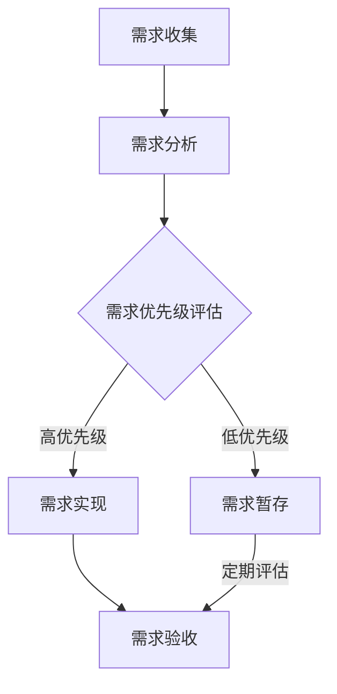

                 

### 大型新应用开发中的需求优先级动态调整方法

#### 关键词
- 大型新应用开发
- 需求优先级
- 动态调整
- 跨部门协作
- 敏捷开发

#### 摘要
本文将深入探讨大型新应用开发中的需求优先级动态调整方法。通过分析需求优先级动态调整的重要性、基本原理和流程，本文提出了基于关键路径、价值流和敏捷开发的需求优先级调整方法，并介绍了跨部门协作中的需求调整实践。通过实际案例，本文展示了动态调整需求优先级的有效性和实用性。

## 第一部分：需求优先级动态调整概述

### 1.1 大型新应用开发的复杂性

在大型新应用开发中，复杂性主要源于以下几个方面：

- **业务复杂性**：大型新应用通常涉及复杂的业务逻辑和流程，需要处理多样化的业务需求。
- **技术复杂性**：大型新应用往往需要利用多种技术框架和工具，构建高可扩展性和高稳定性的系统架构。
- **团队复杂性**：大型新应用开发通常涉及多个团队和部门的协作，需要协调不同的利益和目标。

#### 核心概念与联系

以下是一个简单的Mermaid流程图，展示了大型新应用开发中的需求优先级动态调整流程：

#### 1.2 动态调整的需求优先级带来的优势

- **灵活应对变化**：动态调整需求优先级可以使团队更快速地响应市场变化和用户需求。
- **优化资源分配**：通过调整需求优先级，可以更合理地分配开发资源，提高开发效率。
- **提高项目成功率**：动态调整需求优先级有助于确保关键需求得到优先满足，提高项目成功率。

#### 1.3 动态调整的需求优先级面临的挑战

- **协调难度大**：跨部门协作的需求调整往往面临协调难度大的挑战。
- **风险评估高**：需求优先级调整可能会影响项目的整体风险，需要谨慎评估。
- **沟通成本高**：动态调整需求优先级需要频繁的沟通和协调，增加了沟通成本。

### 1.3 动态调整的需求优先级流程

动态调整需求优先级的流程通常包括以下几个步骤：

1. **需求收集**：收集各个部门或团队提出的需求。
2. **需求分析**：对收集到的需求进行分析和筛选。
3. **需求优先级评估**：根据需求的价值、实现难度等因素，评估每个需求的优先级。
4. **需求实现**：根据需求优先级，安排需求的实现顺序。
5. **需求验收**：对实现的需求进行验收，确保满足需求。
6. **定期评估**：定期评估需求优先级，根据项目进展和市场变化进行调整。

## 第二部分：需求优先级动态调整的方法

### 2.1 基于关键路径的需求优先级调整

#### 关键路径分析

关键路径分析是一种重要的需求优先级调整方法，它可以帮助确定项目中最关键的需求和任务。

#### 关键路径下的需求排序

关键路径下的需求排序方法包括以下步骤：

1. **确定项目任务**：列出所有项目任务。
2. **计算任务时长**：为每个任务估算所需时间。
3. **构建任务图**：使用任务图来表示任务之间的关系。
4. **确定关键路径**：通过任务图确定项目的关键路径。

#### 关键路径调整策略

关键路径调整策略包括以下几个方面：

1. **优先处理关键任务**：确保关键路径上的任务得到优先处理。
2. **优化任务时长**：通过技术优化和管理优化，缩短关键路径上的任务时长。
3. **资源调配**：根据关键路径上的任务需求，合理调配资源。

### 2.2 基于价值流的需求优先级调整

#### 价值流分析

价值流分析是一种通过识别价值流动的过程来优化业务流程的方法。

#### 价值流下的需求排序

价值流下的需求排序方法包括以下步骤：

1. **识别价值流**：识别项目中的价值流，包括输入、处理和输出。
2. **评估需求价值**：为每个需求评估其价值，包括对业务的影响、用户满意度等。
3. **排序需求**：根据需求的价值，对需求进行排序。

#### 价值流调整策略

价值流调整策略包括以下几个方面：

1. **优化价值流**：通过优化价值流，提高需求的实现效率和效果。
2. **持续改进**：定期评估和优化价值流，确保需求优先级调整的持续有效性。

### 2.3 基于敏捷开发的需求优先级调整

#### 敏捷开发框架

敏捷开发是一种以用户需求为核心的软件开发方法，其核心在于快速迭代和持续交付。

#### 敏捷开发中的需求迭代

敏捷开发中的需求迭代包括以下几个步骤：

1. **需求收集**：收集用户需求。
2. **需求评估**：评估需求的重要性和可行性。
3. **迭代计划**：根据需求优先级，制定迭代计划。
4. **需求实现**：实现需求。
5. **需求验收**：验收需求。

#### 敏捷开发调整策略

敏捷开发调整策略包括以下几个方面：

1. **快速响应变化**：敏捷开发强调快速响应市场变化和用户需求。
2. **持续集成**：通过持续集成，确保需求调整的及时性和准确性。
3. **团队协作**：鼓励团队协作，共同应对需求调整的挑战。

## 第三部分：需求优先级动态调整实践

### 3.1 跨部门协作需求调整

#### 跨部门协作的需求优先级冲突

跨部门协作中的需求优先级冲突是一种常见的挑战，解决方法包括：

1. **建立沟通渠道**：建立有效的沟通渠道，确保不同部门之间的信息传递畅通。
2. **共同制定优先级**：通过共同讨论和制定优先级，减少冲突。
3. **利益平衡**：在制定优先级时，考虑不同部门的利益，确保各方都能接受。

#### 跨部门协作的调整策略

跨部门协作的调整策略包括以下几个方面：

1. **明确责任**：明确各部门在需求调整中的责任和权限。
2. **建立机制**：建立需求调整的机制，确保调整过程有序进行。
3. **培训与沟通**：定期组织培训，提高团队成员对需求调整的理解和认识，增强沟通能力。

### 3.2 需求优先级动态调整工具与技术

#### 常用需求管理工具

常用的需求管理工具有以下几种：

1. **JIRA**：用于需求跟踪、任务管理和项目协作。
2. **Confluence**：用于文档管理和团队协作。
3. **Trello**：用于任务看板和项目管理。

#### 需求优先级动态调整技术

需求优先级动态调整技术包括以下几种：

1. **敏捷开发框架**：如Scrum、Kanban等。
2. **关键路径分析**：用于确定项目中的关键任务和路径。
3. **价值流分析**：用于优化业务流程和价值流动。

## 第四部分：案例分析

### 4.1 大型电商平台需求优先级调整案例

#### 案例背景

某大型电商平台在开发新功能时，面临着众多需求，包括购物车优化、订单管理系统升级、用户推荐系统等。由于资源有限，需要进行需求优先级调整。

#### 需求优先级调整过程

1. **需求收集**：收集各部门提出的需求。
2. **需求分析**：对需求进行分类和筛选。
3. **关键路径分析**：确定关键路径上的需求，如购物车优化和订单管理系统升级。
4. **价值流分析**：评估各个需求的价值和影响。
5. **优先级排序**：根据关键路径和价值流分析，确定需求的优先级。

#### 案例总结

通过需求优先级调整，电商平台确保了关键需求得到优先满足，提高了项目进展和用户满意度。

### 4.2 金融行业需求优先级调整案例

#### 案例背景

某金融行业公司在开发新业务系统时，面临着大量需求，包括用户身份验证、交易风险管理、财务报表生成等。由于金融行业的特殊性，需求优先级调整尤为重要。

#### 需求优先级调整过程

1. **需求收集**：收集各部门提出的需求。
2. **需求分析**：对需求进行分类和筛选。
3. **价值流分析**：评估各个需求的价值和影响。
4. **敏捷开发迭代**：采用敏捷开发方法，逐步实现和调整需求。
5. **跨部门协作**：建立跨部门协作机制，确保需求调整的顺利进行。

#### 案例总结

通过需求优先级调整，金融行业公司确保了关键需求得到优先满足，提高了业务系统的质量和稳定性。

## 结论

本文探讨了大型新应用开发中的需求优先级动态调整方法。通过分析需求优先级动态调整的重要性、基本原理和流程，提出了基于关键路径、价值流和敏捷开发的需求优先级调整方法。同时，通过案例分析，展示了动态调整需求优先级的有效性和实用性。动态调整需求优先级有助于优化资源分配、提高项目成功率，并促进跨部门协作。然而，需求优先级调整也面临挑战，需要谨慎评估和协调。

### 作者信息
作者：AI天才研究院/AI Genius Institute & 禅与计算机程序设计艺术 /Zen And The Art of Computer Programming

