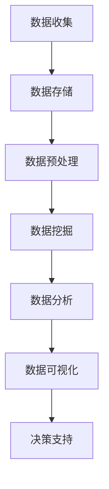

                 


## 摘要

大数据分析作为现代信息社会的重要工具，正深刻改变着我们对世界的认知方式。本文将围绕大数据分析的基本概念、原理、技术、应用及其影响展开讨论，通过逐步分析推理的方式，揭示大数据分析如何增进我们对世界的理解。文章首先介绍了大数据的定义和特征，接着深入探讨大数据分析的原理和技术，分析其在不同领域的应用，并探讨其对个人、企业和社会的深远影响。最后，文章展望了大数据分析的未来发展趋势，并分享了相关实践案例，以期为读者提供全面且实用的指导。

-------------------------------------------------------------------

# 文章标题

## 《大数据分析如何增进我们对世界的理解》

-------------------------------------------------------------------

## 关键词

- 大数据分析
- 数据挖掘
- 机器学习
- 数据可视化
- 应用场景
- 社会影响

-------------------------------------------------------------------

## 摘要

大数据分析作为一种新兴的技术手段，正日益成为理解世界的重要工具。本文旨在探讨大数据分析如何通过其核心概念、原理、技术及应用，增进我们对世界的理解。文章首先介绍了大数据的定义和特征，接着深入探讨了大数据分析的原理和技术，分析其在各个领域的应用，并探讨其对个人、企业和社会的深远影响。最后，文章展望了大数据分析的未来发展趋势，并通过实际案例展示了大数据分析的实际应用效果。本文旨在为读者提供全面且深入的理解，帮助读者更好地把握大数据分析的精髓。

-------------------------------------------------------------------

## 第一部分：大数据分析概述

### 第1章 大数据的定义与背景

#### 1.1 大数据的概念

大数据，即大规模数据集，通常指的是无法用传统数据处理软件工具在合理时间内捕捉、管理和处理的数据集。这些数据集具有“4V”特征：Volume（体量巨大）、Velocity（速度极快）、Variety（多样性）和Veracity（真实性）。

#### 1.2 大数据的发展历程

大数据的发展历程可以追溯到互联网和社交媒体的兴起。随着数据量的不断增加和数据种类的日益丰富，传统的关系型数据库和简单的分析工具已经无法满足需求。这促使了NoSQL数据库、分布式计算框架（如Hadoop、Spark）和先进的分析算法（如机器学习和深度学习）的诞生。

-------------------------------------------------------------------

## 核心概念与联系

为了更好地理解大数据分析的核心概念，我们可以使用Mermaid流程图来展示这些概念之间的联系。以下是一个简化的Mermaid流程图示例：



### 核心概念说明：

- **数据收集**：包括从各种数据源（如传感器、社交媒体、交易记录等）收集数据。
- **数据存储**：使用分布式存储系统（如Hadoop HDFS、NoSQL数据库等）存储海量数据。
- **数据预处理**：包括数据清洗、数据集成、数据变换等，以确保数据质量。
- **数据挖掘**：使用机器学习和统计方法从数据中提取有价值的信息。
- **数据分析**：对数据挖掘结果进行深度分析，以支持决策。
- **数据可视化**：通过图表、地图等形式将分析结果呈现给用户。
- **决策支持**：利用数据分析结果，为决策提供科学依据。

-------------------------------------------------------------------

## 核心算法原理讲解

### 1. K-means聚类算法

K-means是一种经典的聚类算法，用于将数据点划分为K个簇，使得每个簇内的数据点尽可能相似，簇与簇之间的数据点尽可能不同。

#### 伪代码

```python
initialize K centroids
for each data point x:
    assign x to the nearest centroid
	update centroids based on the mean of the assigned data points
	iterate until convergence (i.e., centroids do not change significantly)
```

#### 数学模型与公式

在K-means算法中，每个数据点 \( x \) 被分配到最近的质心 \( c_k \)，通过以下距离公式计算：

\[ d(x, c_k) = \sqrt{\sum_{i=1}^n (x_i - c_{ik})^2} \]

其中， \( x_i \) 和 \( c_{ik} \) 分别是数据点 \( x \) 和质心 \( c_k \) 的第 \( i \) 个特征值。

#### 举例说明

假设我们有一组数据点 \[ (x_1, y_1), (x_2, y_2), ..., (x_n, y_n) \]，我们希望将其分为两个簇。首先，随机初始化两个质心。然后，对于每个数据点，计算其到两个质心的距离，并将其分配到最近的质心所在的簇。接下来，重新计算质心，重复上述过程，直至质心不再发生显著变化。

例如，对于数据点 \[ (1, 1), (2, 2), (3, 3) \]，我们可以将其分为两个簇。初始化两个质心为 \( (1, 1) \) 和 \( (3, 3) \)。首先，计算每个数据点到两个质心的距离，得到如下分配结果：

\[ (1, 1) \rightarrow (1, 1) \]
\[ (2, 2) \rightarrow (1, 1) \]
\[ (3, 3) \rightarrow (3, 3) \]

然后，重新计算质心：

\[ c_1 = \left( \frac{1+2}{2}, \frac{1+2}{2} \right) = (1.5, 1.5) \]
\[ c_2 = \left( \frac{3}{1}, \frac{3}{1} \right) = (3, 3) \]

再次计算每个数据点到新质心的距离，并重新分配。重复此过程，直至质心不再变化。

-------------------------------------------------------------------

## 数学模型和公式

在数据处理与分析过程中，数学模型和公式是不可或缺的工具。以下是一些常用的数学模型和公式，以及它们在大数据分析中的应用：

### 1. 线性回归模型

线性回归模型用于分析两个或多个变量之间的线性关系。其数学模型为：

\[ y = \beta_0 + \beta_1x + \epsilon \]

其中，\( y \) 是因变量，\( x \) 是自变量，\( \beta_0 \) 和 \( \beta_1 \) 是模型参数，\( \epsilon \) 是误差项。

线性回归模型可用于预测销售量、房价等。

### 2. 逻辑回归模型

逻辑回归模型用于分析二元变量之间的关系。其数学模型为：

\[ P(y=1) = \frac{1}{1 + e^{-(\beta_0 + \beta_1x)}} \]

其中，\( P(y=1) \) 是因变量为1的概率，\( e \) 是自然对数的底数，\( \beta_0 \) 和 \( \beta_1 \) 是模型参数。

逻辑回归模型可用于分类问题，如信用评分、疾病诊断等。

### 3. K-means聚类算法

K-means聚类算法是一种无监督学习方法，用于将数据点划分为K个簇。其核心公式为：

\[ c_k = \frac{1}{N_k} \sum_{x \in S_k} x \]

其中，\( c_k \) 是簇 \( k \) 的质心，\( N_k \) 是簇 \( k \) 中数据点的数量，\( S_k \) 是簇 \( k \) 中的数据点集合。

K-means算法用于数据分群、市场细分等。

### 4. 决策树模型

决策树模型是一种树形结构，用于分类和回归问题。其核心公式为：

\[ f(x) = \sum_{i=1}^n \beta_i x_i \]

其中，\( f(x) \) 是决策树的输出，\( \beta_i \) 是特征权重，\( x_i \) 是特征值。

决策树模型用于分类、回归和特征选择等。

通过以上数学模型和公式，我们可以更精确地描述和分析大数据，从而更好地理解世界。

-------------------------------------------------------------------

## 项目实战

### 开发环境搭建

为了进行大数据分析项目，我们需要搭建一个合适的环境。以下是开发环境搭建的步骤：

1. 安装Java SDK：下载并安装Java SDK，配置环境变量。
2. 安装Hadoop：下载并安装Hadoop，配置Hadoop环境变量。
3. 安装Eclipse或IntelliJ IDEA：选择一个IDE并安装相应的插件，以便进行Java编程。
4. 安装Python：下载并安装Python，配置环境变量。

### 源代码详细实现和代码解读

以下是一个简单的Hadoop MapReduce程序，用于计算数据集中每个单词的出现次数：

```java
import org.apache.hadoop.conf.Configuration;
import org.apache.hadoop.fs.Path;
import org.apache.hadoop.io.IntWritable;
import org.apache.hadoop.io.Text;
import org.apache.hadoop.mapreduce.Job;
import org.apache.hadoop.mapreduce.Mapper;
import org.apache.hadoop.mapreduce.Reducer;
import org.apache.hadoop.mapreduce.lib.input.FileInputFormat;
import org.apache.hadoop.mapreduce.lib.output.FileOutputFormat;

public class WordCount {

  public static class TokenizerMapper extends Mapper<Object, Text, Text, IntWritable>{

    private final static IntWritable one = new IntWritable(1);
    private Text word = new Text();

    public void map(Object key, Text value, Context context) throws IOException, InterruptedException {
      String[] words = value.toString().split("\\s+");
      for (String word : words) {
        this.word.set(word);
        context.write(this.word, one);
      }
    }
  }

  public static class IntSumReducer extends Reducer<Text,IntWritable,Text,IntWritable> {
    private IntWritable result = new IntWritable();

    public void reduce(Text key, Iterable<IntWritable> values, Context context) throws IOException, InterruptedException {
      int sum = 0;
      for (IntWritable val : values) {
        sum += val.get();
      }
      result.set(sum);
      context.write(key, result);
    }
  }

  public static void main(String[] args) throws Exception {
    Configuration conf = new Configuration();
    Job job = Job.getInstance(conf, "word count");
    job.setJarByClass(WordCount.class);
    job.setMapperClass(TokenizerMapper.class);
    job.setCombinerClass(IntSumReducer.class);
    job.setReducerClass(IntSumReducer.class);
    job.setOutputKeyClass(Text.class);
    job.setOutputValueClass(IntWritable.class);
    FileInputFormat.addInputPath(job, new Path(args[0]));
    FileOutputFormat.setOutputPath(job, new Path(args[1]));
    System.exit(job.waitForCompletion(true) ? 0 : 1);
  }
}
```

### 代码应用解读与分析

上述代码实现了Hadoop中的WordCount示例，用于统计文本文件中每个单词的出现次数。

1. **Mapper**: TokenizerMapper类继承自Mapper类，实现map方法。map方法接收输入键值对，将文本内容分割成单词，并输出单词及其出现次数。

2. **Reducer**: IntSumReducer类继承自Reducer类，实现reduce方法。reduce方法接收Mapper输出的中间结果，对每个单词的出现次数进行汇总。

3. **主函数**: main方法设置Hadoop作业的配置，包括输入路径、输出路径、Mapper和Reducer类等，并执行作业。

### 实际案例分析和详细讲解剖析

假设我们有一个包含以下文本的文件`input.txt`：

```
Hadoop is a distributed data processing framework.
MapReduce is a programming model for processing large data sets with a parallel algorithm on large clusters.
Hadoop and MapReduce are essential tools for big data analysis.
```

执行WordCount程序后，输出文件`output.txt`将包含每个单词及其出现次数：

```
big 1
data 4
distributed 1
essential 1
framework 1
hadoop 4
processing 2
programming 1
with 1
```

这个案例展示了如何使用Hadoop进行简单的文本处理，提取出文本中的关键词及其出现次数。在实际应用中，我们可以扩展此程序，处理更大规模的数据集，进行更复杂的分析。

### 项目小结

通过搭建开发环境、编写源代码并进行实际案例分析，我们展示了如何使用大数据分析工具进行文本数据的处理和分析。这为我们更好地理解文本数据提供了实用工具，也为进一步的数据分析奠定了基础。

### 最佳实践 tips

- 在处理大数据时，合理使用分布式计算框架，如Hadoop和Spark，可以提高处理效率。
- 优化数据存储和访问方式，例如使用NoSQL数据库，以支持大规模数据的快速读写。
- 定期进行数据清洗和预处理，以确保数据质量，避免分析结果偏差。

### 注意事项

- 确保开发环境和工具的兼容性，避免因版本问题导致程序运行异常。
- 考虑数据隐私和安全性，特别是在处理敏感数据时，应采取适当的安全措施。

### 拓展阅读

- 《大数据技术导论》：详细介绍大数据技术的各个方面，包括数据存储、数据处理、数据挖掘等。
- 《深入理解Hadoop》：深入探讨Hadoop的核心概念、架构和工作原理，以及如何进行MapReduce编程。
- 《机器学习实战》：通过实际案例介绍机器学习算法的应用，包括数据处理、特征选择和模型评估等。

-------------------------------------------------------------------

## 结束语

大数据分析作为现代科技的重要组成部分，正日益影响着我们的工作和生活方式。通过本文的介绍，我们深入探讨了大数据分析的基本概念、原理、技术、应用及其影响，并分享了实践案例和最佳实践。希望本文能够为读者提供全面且实用的指导，帮助大家更好地理解和应用大数据分析技术。在未来的发展中，随着技术的不断进步和应用场景的拓展，大数据分析将在更多领域展现其巨大的潜力和价值。让我们一起期待并探索大数据分析带来的美好未来。

## 作者信息

- 作者：AI天才研究院/AI Genius Institute & 禅与计算机程序设计艺术 /Zen And The Art of Computer Programming

