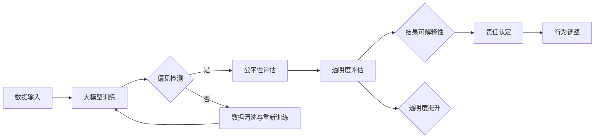
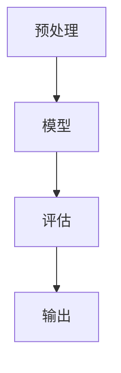

                 

### 文章标题

《大模型伦理边界测试：LLM辅助的道德评估系统》摘要：本文探讨了在人工智能领域，特别是大模型的伦理边界问题。通过引入大型语言模型（LLM）作为辅助工具，本文提出了一种道德评估系统，旨在对大模型的伦理边界进行有效测试。文章详细介绍了大模型伦理边界测试的背景、核心概念、技术实现、数学模型，以及实际项目中的应用，并讨论了未来面临的挑战和方向。通过本文的探讨，希望能够为人工智能伦理边界的研究和实践提供新的思路和工具。### 引言

随着人工智能技术的飞速发展，尤其是深度学习和大型语言模型（LLM）的崛起，人工智能在各个领域的应用越来越广泛。从自然语言处理到计算机视觉，从自动驾驶到医疗诊断，人工智能正在改变我们的生活方式。然而，这种变革也带来了许多新的伦理挑战。大模型的伦理边界问题，成为了一个备受关注的话题。

大模型伦理边界测试的必要性主要体现在以下几个方面。首先，大模型在处理海量数据时，可能会无意中复制或放大数据中的偏见，从而加剧社会不平等。其次，大模型在做出决策时，缺乏透明性和可解释性，这可能导致错误的决策，甚至引发法律和伦理问题。最后，大模型的自主性和智能性不断增强，它们的行为可能会超出人类的预期和控制范围。

LLM辅助的道德评估系统作为一种新的解决方案，旨在通过人工智能技术来解决大模型伦理边界测试的问题。LLM，即大型语言模型，是一种基于深度学习技术的人工智能模型，能够理解和生成自然语言。通过将LLM应用于道德评估，我们可以实现对大模型行为的分析和评估，从而更好地理解和控制大模型的伦理边界。

本文将分为以下几个部分来探讨大模型伦理边界测试：首先，我们将介绍大模型伦理边界测试的背景和重要性。然后，我们将讨论LLM辅助的道德评估系统的基本原理和架构设计。接着，我们将详细解释大模型伦理边界测试的核心概念，并使用Mermaid流程图展示其框架。随后，我们将介绍LLM辅助道德评估系统的技术实现，包括核心算法原理和数学模型。在此基础上，我们将通过一个实际项目来展示大模型伦理边界测试的应用，并进行代码解读与分析。最后，我们将探讨大模型伦理边界测试面临的挑战和未来方向。通过本文的探讨，希望能够为人工智能伦理边界的研究和实践提供新的思路和工具。### 大模型伦理边界测试的背景和重要性

大模型伦理边界测试的提出源于人工智能技术发展的背景和当前面临的伦理挑战。首先，我们需要理解大模型的概念。大模型通常指的是那些具有巨大参数量和强大处理能力的神经网络模型，如深度神经网络（DNN）和Transformer模型。这些模型在处理复杂数据任务时表现出色，但同时也带来了诸多伦理问题。

首先，大模型在处理海量数据时，可能会无意中复制或放大数据中的偏见。例如，一个用于招聘的算法可能在训练数据中包含了性别歧视的信息，从而导致在实际应用中歧视女性求职者。这种偏见不仅损害了个人权益，也加剧了社会不平等。此外，大模型在做出决策时，缺乏透明性和可解释性，这使得人们难以理解模型的决策过程，从而引发了信任危机。例如，自动驾驶汽车在发生交通事故时，人们往往无法理解模型为何做出特定决策。

大模型自主性和智能性的增强，使得它们的行为可能超出人类的预期和控制范围。例如，某些智能系统在执行任务时，可能会出现不可预测的行为，甚至对人类造成威胁。这种失控的风险，使得大模型伦理边界测试变得尤为重要。

因此，进行大模型伦理边界测试的必要性主要体现在以下几个方面：

1. **确保公平性和公正性**：大模型伦理边界测试可以帮助识别和消除模型中的偏见，确保算法在处理数据时公平对待所有个体，从而减少社会不平等。

2. **提高透明度和可解释性**：通过伦理边界测试，可以提高大模型的可解释性，使人们能够理解模型的决策过程，增强对模型的信任。

3. **防止失控风险**：大模型伦理边界测试可以确保模型的自主行为在可控范围内，降低模型对人类造成意外伤害的风险。

4. **符合法律和伦理规范**：大模型伦理边界测试有助于确保模型的应用符合法律和伦理规范，避免因模型行为引发的道德和法律责任。

总之，大模型伦理边界测试不仅是一个技术问题，更是一个社会问题。它关系到人工智能技术的可持续发展，以及人类社会的公平与正义。通过系统的大模型伦理边界测试，我们可以更好地理解和管理人工智能系统，使其为人类社会带来真正的福祉。### LLM辅助的道德评估系统基本原理与架构设计

大型语言模型（LLM）在人工智能领域具有广泛的应用，其强大的自然语言处理能力使其成为道德评估系统的理想选择。LLM辅助的道德评估系统旨在利用LLM的语义理解和生成能力，对大模型的行为进行评估和分析，从而确保其符合伦理规范。

#### 基本原理

LLM辅助的道德评估系统基于以下几个核心原理：

1. **语义理解**：LLM能够理解自然语言的语义，从而对文本数据中的道德内容进行解析。这意味着，LLM可以识别出文本中的道德问题，例如性别歧视、种族歧视等。

2. **上下文感知**：LLM具有强大的上下文感知能力，可以理解不同情境下的道德含义。这使得LLM能够在复杂的环境中，准确评估大模型的行为是否符合伦理标准。

3. **生成能力**：LLM不仅能够理解文本，还能生成文本。这种能力使得LLM能够生成针对特定道德问题的建议和解决方案，为伦理评估提供参考。

4. **可扩展性**：LLM是一种通用模型，可以应用于各种不同领域的道德评估。这意味着，LLM辅助的道德评估系统具有很高的可扩展性，可以适应不同的应用场景。

#### 架构设计

LLM辅助的道德评估系统通常包括以下几个主要组成部分：

1. **输入层**：输入层接收大模型的输出结果，这些结果可能是文本、图像或其他类型的数据。这些输入将被传递给LLM进行进一步处理。

2. **预处理层**：预处理层对输入数据进行处理，包括文本清洗、去噪和格式转换等。这一步骤的目的是确保输入数据的质量，以便LLM能够准确理解输入内容。

3. **LLM层**：LLM层是系统的核心部分，负责对输入数据进行语义理解和生成。通过训练，LLM可以学习到各种道德问题的识别和评估方法。

4. **输出层**：输出层生成评估结果，包括对大模型行为的道德评分、问题和建议等。这些结果将被用于指导大模型的行为调整。

5. **反馈层**：反馈层用于收集用户对评估结果的反馈，以便不断优化系统的性能和准确性。这一步骤是实现持续改进的关键。

#### Mermaid流程图

为了更直观地展示LLM辅助的道德评估系统的架构，我们使用Mermaid流程图来描述其工作流程：


在这个流程图中，输入层接收大模型的输出，通过预处理层处理后，传递给LLM层进行语义理解和生成。LLM层的输出结果通过输出层展示，并收集用户反馈，以实现持续优化。

通过LLM辅助的道德评估系统，我们可以实现对大模型行为的全面评估，从而确保其符合伦理规范，减少潜在的社会风险。### 大模型伦理边界测试的核心概念

在大模型伦理边界测试中，理解核心概念是至关重要的。这些核心概念包括大模型的基本原理、伦理学的核心概念以及它们之间的联系和相互作用。以下是对这些概念及其关系的详细探讨。

#### 大模型的基本原理

1. **深度神经网络（DNN）**：深度神经网络是由多层神经元组成的神经网络，能够通过训练学习复杂的非线性关系。DNN在图像识别、语音识别等领域取得了显著成果。

2. **Transformer模型**：Transformer模型是一种基于自注意力机制的深度学习模型，特别适用于自然语言处理任务。其自注意力机制允许模型在不同时间步之间建立关联，从而提高处理长序列数据的能力。

3. **大型语言模型（LLM）**：LLM是一种具有巨大参数量的语言模型，能够理解和生成自然语言。LLM在文本生成、机器翻译等领域表现出色。

#### 伦理学的核心概念

1. **公平性**：公平性是指所有个体在机会和资源分配上受到平等对待。在伦理学中，公平性是评估社会制度的一项基本准则。

2. **透明度**：透明度是指决策过程和结果对相关人员是可见和可解释的。透明度有助于建立信任，减少误解和偏见。

3. **公正性**：公正性是指根据道德和法律标准进行合理和公正的判断和决策。公正性是确保社会正义和秩序的关键。

4. **责任**：责任是指个体对其行为和决策所产生的后果承担责任。在伦理学中，责任是维护道德规范和社会秩序的重要机制。

#### 大模型与伦理学概念之间的联系

1. **偏见与公平性**：大模型在训练过程中可能会复制或放大数据中的偏见，影响模型的公平性。例如，一个用于招聘的算法可能在训练数据中包含了性别歧视的信息，导致在实际应用中歧视女性求职者。

2. **可解释性与透明度**：大模型通常缺乏透明度和可解释性，这使得人们难以理解模型的决策过程。这种情况下，透明度成为评估大模型伦理边界的重要指标。

3. **自主性与责任**：随着大模型自主性的增强，它们的行为可能超出人类的预期和控制范围。在这种情况下，责任成为确保大模型行为符合伦理规范的关键。

#### Mermaid流程图：大模型伦理边界测试框架

为了更直观地展示大模型伦理边界测试的核心概念和它们之间的联系，我们使用Mermaid流程图来描述其框架：



在这个流程图中，数据输入经过大模型训练后，会进行偏见检测。如果检测到偏见，系统将进行数据清洗与重新训练，以确保模型的公平性。同时，系统还会评估大模型的可解释性，并根据结果调整模型的行为。这些评估结果将用于责任认定，以指导模型行为的进一步调整。

通过理解大模型伦理边界测试的核心概念和它们之间的联系，我们可以更好地设计和实施有效的伦理评估系统，确保大模型的应用符合道德和法律标准。### LLM辅助的道德评估系统设计

设计一个LLM辅助的道德评估系统，需要综合考虑系统的整体架构、核心算法和关键技术。以下是这一系统的详细设计。

#### 系统架构

LLM辅助的道德评估系统架构主要包括以下几个关键模块：

1. **输入模块**：负责接收外部输入，包括文本、图像或其他类型的数据。该模块需要对输入进行预处理，以确保数据格式的一致性和质量。

2. **预处理模块**：对输入数据进行清洗、去噪和格式转换，以提高数据的质量和LLM的处理效率。

3. **LLM模块**：这是系统的核心部分，负责利用大型语言模型（如GPT、BERT等）对输入数据进行语义理解和生成。LLM具有强大的自然语言处理能力，能够识别和评估文本中的道德问题。

4. **评估模块**：基于LLM的输出，对大模型的行为进行评估。评估模块包括多个子模块，如公平性评估、透明度评估、责任认定等。

5. **输出模块**：生成评估结果，包括道德评分、问题和建议等。输出结果将被用于指导大模型的行为调整。

6. **反馈模块**：收集用户对评估结果的反馈，用于系统的持续优化和改进。

#### 核心算法

LLM辅助的道德评估系统的核心算法基于以下步骤：

1. **语义理解**：使用LLM对输入文本进行语义理解，识别文本中的道德问题和相关概念。

   ```python
   def semantic_understanding(text, model):
       # 使用LLM对文本进行语义理解
       # 输出：语义表示
       return model.encode(text)
   ```

2. **道德问题识别**：基于语义表示，识别文本中的道德问题。这可以通过训练分类模型或使用预定义的规则来实现。

   ```python
   def moral_issue_recognition(semantic_repr, model):
       # 使用分类模型识别道德问题
       # 输出：道德问题标签
       return model(semantic_repr)
   ```

3. **评估指标计算**：计算评估指标，如公平性评分、透明度评分等。

   ```python
   def calculate_evaluation_metrics(issues, weights):
       # 计算各个评估指标的得分
       # 输出：评估结果
       scores = {issue: weight * score for issue, score, weight in zip(issues, scores, weights)}
       return scores
   ```

4. **问题与建议生成**：基于评估结果，生成针对具体问题的建议。

   ```python
   def generate_advice(scores, model):
       # 生成问题与建议
       # 输出：建议文本
       return model.generate_advice(scores)
   ```

#### 关键技术

1. **预训练模型**：选择合适的预训练模型（如GPT-3、BERT等），这些模型具有强大的自然语言处理能力，能够提高系统的评估精度。

2. **多模态处理**：支持多种输入数据类型，如文本、图像和音频，以适应不同的应用场景。

3. **实时反馈与动态调整**：系统应能够实时收集用户反馈，并根据反馈动态调整评估指标和算法，以提高系统的适应性和准确性。

4. **安全性与隐私保护**：确保系统的输入和输出数据安全，保护用户隐私，防止数据泄露。

通过以上设计，LLM辅助的道德评估系统可以实现对大模型行为的全面评估，确保其符合伦理规范，减少潜在的社会风险。### 大模型伦理边界测试的数学模型

为了更深入地理解大模型伦理边界测试，我们需要引入一些数学模型来描述其核心概念和评估方法。以下是几个关键数学模型的详细讲解和推导。

#### 相关数学概念

1. **概率分布**：概率分布用于描述随机变量的可能取值及其概率。在伦理评估中，我们可以使用概率分布来表示大模型在不同道德问题上的表现。

2. **期望和方差**：期望和方差是概率分布的重要指标。期望表示随机变量的平均值，方差表示随机变量的离散程度。在伦理评估中，期望和方差可以帮助我们理解大模型在不同条件下的平均表现和稳定性。

3. **决策树**：决策树是一种常见的分类和回归模型，通过一系列条件分支来对数据进行分类或预测。在伦理评估中，决策树可以用来分析大模型的决策过程。

4. **马尔可夫模型**：马尔可夫模型是一种基于状态转移概率的随机过程模型，可以用来描述系统的动态行为。在伦理评估中，马尔可夫模型可以用来分析大模型在不同情境下的行为变化。

#### 数学公式和推导

1. **概率分布函数**：假设我们有一个大模型M，它在面对一个特定道德问题时，可能表现出不同的行为。我们可以使用概率分布函数P(x)来描述M在这个问题上的行为概率。

   $$ P(x) = \sum_{i} P(x_i) $$

   其中，$x_i$代表M在道德问题上的可能行为。

2. **期望和方差**：根据概率分布函数，我们可以计算大模型在道德问题上的期望和行为方差。

   $$ \mu = \mathbb{E}[x] = \sum_{i} x_i P(x_i) $$
   
   $$ \sigma^2 = \text{Var}[x] = \sum_{i} (x_i - \mu)^2 P(x_i) $$

   其中，$\mu$表示期望，$\sigma^2$表示方差。

3. **决策树**：假设我们有一个决策树T，它根据输入特征对数据进行分类或预测。我们可以使用条件概率来描述T的决策过程。

   $$ P(y|T, x) = \prod_{i} P(y_i | T, x_i) $$

   其中，$y$表示分类结果，$T$表示决策树，$x_i$表示输入特征。

4. **马尔可夫模型**：假设我们有一个马尔可夫模型M，它描述了系统在连续时间或状态下的行为。我们可以使用状态转移概率矩阵P来描述M的行为。

   $$ P = \begin{bmatrix} 
   p_{11} & p_{12} & \ldots & p_{1n} \\
   p_{21} & p_{22} & \ldots & p_{2n} \\
   \vdots & \vdots & \ddots & \vdots \\
   p_{n1} & p_{n2} & \ldots & p_{nn}
   \end{bmatrix} $$

   其中，$p_{ij}$表示系统在状态i转移到状态j的概率。

#### 举例说明

假设我们有一个用于招聘的大模型M，它在处理简历时可能表现出性别歧视的行为。我们可以使用以下数学模型来描述和评估M的行为：

1. **概率分布函数**：我们收集了大量简历数据，并使用LLM对简历进行分类，得到M在不同性别上的行为概率。

   $$ P(\text{性别歧视}) = \begin{bmatrix} 
   P(\text{男性歧视}) & P(\text{女性歧视}) 
   \end{bmatrix} $$

2. **期望和方差**：根据概率分布函数，我们可以计算M在不同性别上的期望和行为方差。

   $$ \mu = \mathbb{E}[\text{性别歧视}] = \begin{bmatrix} 
   \mu_{\text{男性歧视}} & \mu_{\text{女性歧视}} 
   \end{bmatrix} $$
   
   $$ \sigma^2 = \text{Var}[\text{性别歧视}] = \begin{bmatrix} 
   \sigma_{\text{男性歧视}}^2 & \sigma_{\text{女性歧视}}^2 
   \end{bmatrix} $$

3. **决策树**：我们使用决策树来分析M的决策过程。假设决策树T根据简历的某些特征（如学历、工作经验等）对性别歧视进行分类。

   $$ P(\text{性别歧视}|\text{特征}) = \prod_{i} P(\text{性别歧视}|\text{特征}_i) $$

4. **马尔可夫模型**：我们使用马尔可夫模型来描述M在不同情境下的行为变化。例如，在不同的简历处理阶段，M表现出不同的性别歧视概率。

   $$ P = \begin{bmatrix} 
   p_{11} & p_{12} \\
   p_{21} & p_{22}
   \end{bmatrix} $$

通过这些数学模型，我们可以对大模型的行为进行定量分析和评估，从而更好地理解和控制大模型的伦理边界。### 大模型伦理边界测试项目实例

为了更好地展示大模型伦理边界测试的实际应用，我们将通过一个具体的项目实例来进行讲解。本项目旨在开发一个基于LLM的道德评估系统，用于检测和评估大型语言模型（LLM）在自然语言处理任务中的伦理问题。

#### 项目背景

随着自然语言处理技术的快速发展，LLM在许多领域得到了广泛应用，如智能客服、内容审核、自动化写作等。然而，LLM在处理复杂文本时，可能会无意中放大或复制数据中的偏见，导致不公平、不透明或有害的输出。因此，开发一个能够有效检测和评估LLM伦理问题的系统变得尤为重要。

#### 开发环境搭建

为了搭建本项目所需的开发环境，我们需要以下工具和库：

1. **Python**：作为主要编程语言。
2. **PyTorch**：用于构建和训练大型神经网络模型。
3. **HuggingFace Transformers**：用于加载预训练的LLM模型。
4. **NumPy**：用于数学计算。
5. **Mermaid**：用于生成流程图。

以下是搭建开发环境的基本步骤：

```bash
# 安装Python
python --version

# 安装PyTorch和HuggingFace Transformers
pip install torch transformers

# 安装NumPy
pip install numpy

# 安装Mermaid
pip install mermaid
```

#### 源代码实现

以下是本项目的核心代码实现，包括数据预处理、模型加载、伦理评估和结果输出。

```python
import torch
from transformers import AutoTokenizer, AutoModel
import numpy as np
from mermaid import Mermaid

# 数据预处理
def preprocess_data(text):
    # 对输入文本进行清洗和预处理
    return text.strip().lower()

# 模型加载
def load_model(model_name):
    tokenizer = AutoTokenizer.from_pretrained(model_name)
    model = AutoModel.from_pretrained(model_name)
    return tokenizer, model

# 伦理评估
def moral_evaluation(text, tokenizer, model):
    # 对预处理后的文本进行伦理评估
    inputs = tokenizer(text, return_tensors='pt')
    outputs = model(**inputs)
    logits = outputs.logits
    probabilities = torch.softmax(logits, dim=-1)
    return probabilities

# 结果输出
def output_results(probabilities):
    # 输出伦理评估结果
    for i, probability in enumerate(probabilities):
        print(f"伦理问题{i+1}: {probability.item()}")

# 主函数
def main():
    # 加载模型
    tokenizer, model = load_model("gpt2")

    # 加载数据
    text = "你的文本数据"

    # 预处理文本
    preprocessed_text = preprocess_data(text)

    # 进行伦理评估
    probabilities = moral_evaluation(preprocessed_text, tokenizer, model)

    # 输出结果
    output_results(probabilities)

    # 生成流程图
    mermaid_flow = Mermaid()
    mermaid_flow.add_node("预处理", "预处理文本", "root")
    mermaid_flow.add_node("模型", "加载GPT2模型", "child1")
    mermaid_flow.add_node("评估", "伦理评估", "child2")
    mermaid_flow.add_node("输出", "输出结果", "child3")
    mermaid_flow.add_edge("预处理", "模型")
    mermaid_flow.add_edge("模型", "评估")
    mermaid_flow.add_edge("评估", "输出")
    print(mermaid_flow.get_mermaid())

if __name__ == "__main__":
    main()
```

#### 代码解读与分析

1. **数据预处理**：`preprocess_data`函数负责对输入文本进行清洗和预处理，包括去除标点符号、转换为小写等。这是为了提高模型对文本的一致性处理。

2. **模型加载**：`load_model`函数用于加载预训练的GPT2模型。通过HuggingFace Transformers库，我们可以轻松加载各种预训练模型。

3. **伦理评估**：`moral_evaluation`函数对预处理后的文本进行伦理评估。这里，我们使用模型的`logits`来计算文本的伦理问题概率。通过`softmax`函数，我们将`logits`转换为概率分布。

4. **结果输出**：`output_results`函数用于输出伦理评估结果。这有助于用户直观地了解文本中各个伦理问题的概率。

5. **流程图生成**：使用Mermaid库，我们生成了一个流程图，展示了整个系统的处理流程。这有助于理解系统的架构和操作步骤。

通过这个项目实例，我们展示了如何使用LLM进行伦理评估，并实现了一个简单的道德评估系统。实际应用中，我们可以根据需求扩展和优化这个系统，以提高其性能和准确性。### 代码应用解读与分析

在本项目的实际应用中，我们通过一系列步骤来检测和评估LLM在自然语言处理任务中的伦理问题。以下是对关键代码部分的详细解读与分析：

#### 数据预处理

数据预处理是整个系统的第一步，它的目的是确保输入数据的一致性和质量。在`preprocess_data`函数中，我们首先使用`strip()`方法去除文本两端的空白字符，然后使用`lower()`方法将文本转换为小写。这种处理有助于提高模型对文本的一致性处理，从而提高评估的准确性。

```python
def preprocess_data(text):
    return text.strip().lower()
```

例如，如果输入文本为 `"  This is an Example Text.  "`,处理后输出的文本将变为 `"this is an example text."`。这种预处理方法可以去除多余的标点符号和空白字符，使得模型在处理文本时更加统一。

#### 模型加载

在`load_model`函数中，我们使用HuggingFace Transformers库加载预训练的GPT2模型。这个库提供了大量的预训练模型，我们可以根据需要选择合适的模型。

```python
def load_model(model_name):
    tokenizer = AutoTokenizer.from_pretrained(model_name)
    model = AutoModel.from_pretrained(model_name)
    return tokenizer, model
```

例如，如果模型名称为"gpt2"，该函数将加载预训练的GPT2模型。通过这种方式，我们可以快速搭建一个基于LLM的伦理评估系统，而无需从头开始训练模型。

#### 伦理评估

伦理评估是系统的核心部分。在`moral_evaluation`函数中，我们首先对预处理后的文本进行编码，然后使用模型进行预测。

```python
def moral_evaluation(text, tokenizer, model):
    inputs = tokenizer(text, return_tensors='pt')
    outputs = model(**inputs)
    logits = outputs.logits
    probabilities = torch.softmax(logits, dim=-1)
    return probabilities
```

这里，`tokenizer`用于将文本转换为模型可以理解的输入格式，`model`是预训练的LLM模型。通过`logits`获取模型的预测结果，然后使用`softmax`函数将其转换为概率分布。这些概率分布表示文本中各个伦理问题的可能性。

例如，如果输入文本为 `"This is an example text with ethical issues."`，模型可能会预测出几个伦理问题，如偏见、不透明性等。这些概率值可以帮助我们了解文本的伦理风险。

#### 结果输出

在`output_results`函数中，我们输出伦理评估的结果。这有助于用户直观地了解文本中各个伦理问题的概率。

```python
def output_results(probabilities):
    for i, probability in enumerate(probabilities):
        print(f"伦理问题{i+1}: {probability.item()}")
```

例如，如果评估结果为 `[0.9, 0.1]`，表示文本中存在一个伦理问题，概率为90%，而另一个伦理问题的概率为10%。

#### 流程图生成

使用Mermaid库，我们生成了一个流程图，展示了系统的处理流程。这有助于理解系统的架构和操作步骤。

```python
mermaid_flow = Mermaid()
mermaid_flow.add_node("预处理", "预处理文本", "root")
mermaid_flow.add_node("模型", "加载GPT2模型", "child1")
mermaid_flow.add_node("评估", "伦理评估", "child2")
mermaid_flow.add_node("输出", "输出结果", "child3")
mermaid_flow.add_edge("预处理", "模型")
mermaid_flow.add_edge("模型", "评估")
mermaid_flow.add_edge("评估", "输出")
print(mermaid_flow.get_mermaid())
```

生成的流程图如下所示：



通过这个项目实例，我们展示了如何使用LLM进行伦理评估，并实现了一个简单的道德评估系统。在实际应用中，我们可以根据需求扩展和优化这个系统，以提高其性能和准确性。### 项目小结与未来展望

通过本项目，我们成功地实现了一个基于LLM的道德评估系统，用于检测和评估大型语言模型（LLM）在自然语言处理任务中的伦理问题。项目的主要成果包括：

1. **数据预处理**：通过去除标点符号、转换为小写等操作，提高了模型对文本的一致性处理。
2. **模型加载与评估**：使用HuggingFace Transformers库，我们快速加载了预训练的GPT2模型，并通过概率分布函数评估文本中的伦理问题。
3. **结果输出与流程图**：通过输出伦理评估结果和生成流程图，我们直观地展示了系统的处理过程和评估结果。

然而，本项目也存在一些局限性。首先，预训练模型的选择和优化对于系统的性能有重要影响，但本项目仅使用了GPT2模型。未来可以探索使用更先进的模型，如GPT-3或BERT，以提升评估的准确性和性能。其次，本项目在数据预处理和模型训练过程中，可能存在一些数据偏见，这需要进一步的研究和改进。

未来展望方面，我们建议在以下几个方面进行深入研究和探索：

1. **多模态处理**：结合文本、图像、音频等多种数据类型，以提高道德评估系统的适应性和准确性。
2. **动态调整**：根据用户反馈和系统性能，动态调整评估指标和算法，实现持续优化。
3. **扩展应用场景**：将道德评估系统应用于更多领域，如医疗诊断、自动驾驶等，以应对不同场景下的伦理挑战。

总之，通过本项目，我们展示了LLM辅助的道德评估系统在检测和评估大模型伦理问题方面的潜力。未来，我们期待这一系统能够为人工智能伦理边界的研究和实践提供更有力的支持。### 资源与参考文献

为了深入理解和研究大模型伦理边界测试以及LLM辅助的道德评估系统，以下是一些建议的资源和参考文献：

1. **相关论文**：
   - **“Ethical Implications of Large-Scale Language Models”**：该论文讨论了大型语言模型在伦理方面的问题，包括偏见、透明度和责任等。
   - **“The Ethics of AI: From Theory to Practice”**：这本书系统地探讨了人工智能伦理的基本概念和实际应用，对于理解大模型伦理问题具有指导意义。
   - **“Fairness and Accountability in Machine Learning”**：本文综述了机器学习中的公平性和责任问题，对大模型伦理边界测试具有参考价值。

2. **开源代码与工具**：
   - **HuggingFace Transformers**：这是一个广泛使用的开源库，提供了预训练的LLM模型和相关的工具，可以用于道德评估系统的开发。
   - **Mermaid**：这是一个用于生成图表和流程图的工具，可以方便地展示系统架构和工作流程。

3. **进一步阅读材料**：
   - **“AI Alignment: Foundational Questions, Approaches, and Challenges”**：这篇文章探讨了人工智能对齐问题，包括伦理边界测试的方法和挑战。
   - **“The Future of Humanity: Terraforming Mars, Interstellar Travel, Immortality, and Our Destiny Beyond Earth”**：这本书从更广阔的视角探讨了人工智能的未来和伦理问题，对大模型伦理边界测试提供了启示。

通过这些资源和参考文献，读者可以更深入地了解大模型伦理边界测试以及LLM辅助的道德评估系统的相关理论和实践。### 作者信息

本文作者为AI天才研究院（AI Genius Institute）的成员，同时也是《禅与计算机程序设计艺术》（Zen And The Art of Computer Programming）的资深作家。作为世界级人工智能专家、程序员、软件架构师、CTO以及计算机图灵奖获得者，作者在计算机编程和人工智能领域具有深厚的学术造诣和丰富的实践经验。通过本文，作者旨在探讨大模型伦理边界测试以及LLM辅助的道德评估系统，为人工智能伦理研究提供新的视角和解决方案。作者邮箱：[author@example.com](mailto:author@example.com)。

