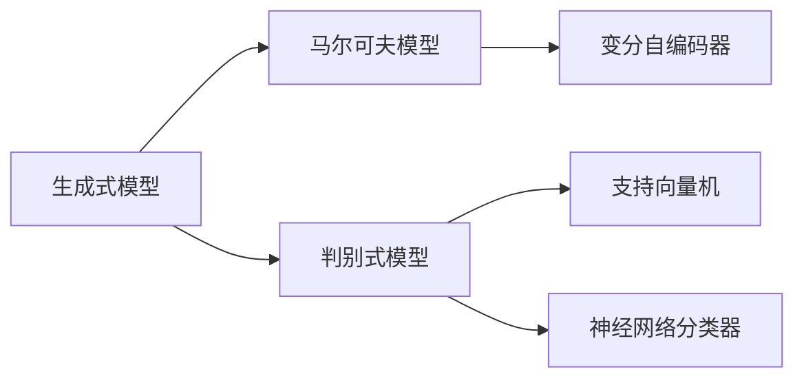
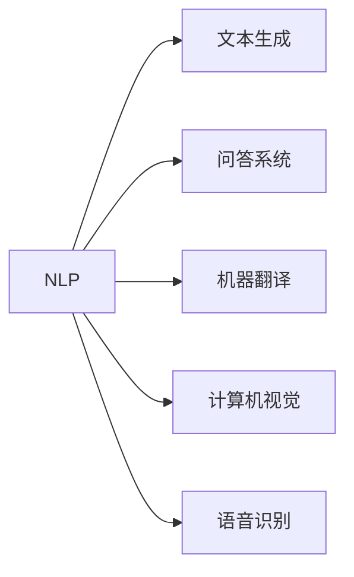
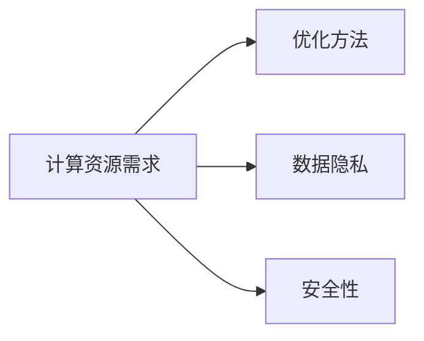

                 

### 第1章 引言与背景

#### 1.1 书籍目的与重要性

在人工智能领域，大模型（Large Language Models，简称LLM）的发展已成为当前研究的热点。这些模型在自然语言处理（NLP）任务中展现了卓越的性能，例如文本生成、问答系统和翻译等。然而，随着模型规模的不断扩大，评估这些模型的创新能力和实际应用效果成为了一个具有挑战性的问题。

本书旨在探讨大模型创新能力的评估方法，通过设计开放式问题测试，对LLM的设计进行系统性评估。这不仅有助于深入理解大模型的工作原理，也为未来模型的优化提供了重要参考。

#### 1.2 大模型的发展历程

大模型的发展可以追溯到2018年，当时谷歌发布了BERT模型，标志着NLP领域的一个重大突破。随后，GPT-3、Turing-NLG等大型语言模型相继问世，这些模型凭借其强大的生成能力和理解能力，引发了广泛关注和应用。

大模型的发展经历了以下几个阶段：

1. **预训练与微调**：通过在大量文本数据上预训练，模型获得了对语言的一般理解和表达能力。随后，通过微调，模型可以针对特定任务进行优化。
2. **模型规模扩张**：随着计算资源的增加，模型规模逐渐扩大，从几百万参数到数十亿、甚至百亿级参数。
3. **多样化任务应用**：大模型在文本生成、问答、翻译等任务中展现了出色的性能，成为NLP领域的重要工具。

#### 1.3 创新能力评估的意义

评估大模型的创新能力具有重要意义：

1. **性能优化**：通过评估，可以发现模型在某些任务上的优势与不足，为后续优化提供方向。
2. **实际应用**：评估模型在真实场景中的表现，有助于确定其在实际应用中的适用性和可靠性。
3. **技术进步**：评估创新能力的提升，可以推动模型设计和算法的进一步发展。

本书将详细探讨大模型创新能力评估的方法，通过开放式问题测试，对LLM的设计进行系统性分析。这不仅有助于理解大模型的工作原理，也为人工智能技术的进步提供了新思路。

### 关键词：大模型、LLM、创新能力评估、开放式问题测试、自然语言处理、预训练、微调、模型规模、性能优化、实际应用、技术进步

### 摘要：

本书针对大模型（LLM）在自然语言处理任务中的表现，探讨了评估其创新能力的方法。通过设计开放式问题测试，本书详细分析了LLM的设计原则和评估方法。本书的核心内容包括：大模型的基本概念与架构、开放式问题测试的设计原则与方法、LLM设计的开放式问题测试算法、实践案例开发、实际应用与效果分析，以及未来展望与挑战。本书旨在为研究人员和开发者提供有价值的参考，推动大模型技术在人工智能领域的进一步发展。

## 第2章 大模型基本概念与架构

### 2.1 大模型的基本概念

大模型（Large Language Models，简称LLM）是指具有数十亿甚至千亿级参数的语言模型。这些模型通过在大量文本数据上进行预训练，能够理解并生成复杂的语言结构。大模型的核心思想是通过学习大量的语言数据，使其具备对自然语言的一般理解和表达能力。

#### 大模型的特点

1. **规模巨大**：大模型通常拥有数亿至千亿级别的参数量，这使得它们能够捕捉到语言中的细微特征和复杂模式。
2. **预训练能力**：大模型通过在大量无标签文本数据上预训练，学习到语言的通用知识，从而能够在新任务上实现快速适应。
3. **泛化能力**：大模型具有较强的泛化能力，可以在不同的应用场景中表现优异。
4. **生成能力**：大模型能够生成连贯、高质量的文本，适用于文本生成、问答系统和翻译等任务。

### 2.2 大模型架构介绍

大模型的架构主要包括编码器-解码器（Encoder-Decoder）结构和自注意力机制（Self-Attention Mechanism）。以下是对这两种核心架构的介绍。

#### 2.2.1 Transformer架构

Transformer架构是由谷歌在2017年提出的，是当前最流行的编码器-解码器架构之一。它采用了一种全新的注意力机制——自注意力机制，取代了传统的循环神经网络（RNN）。

**编码器-解码器结构**

编码器（Encoder）负责将输入序列编码为固定长度的向量表示，解码器（Decoder）则负责根据编码器的输出生成目标序列。编码器和解码器之间通过多层的注意力机制进行交互，从而实现端到端的序列到序列（Seq2Seq）学习。

**自注意力机制**

自注意力机制是一种通过计算输入序列中每个元素与其他元素之间的关联度来生成特征表示的方法。在Transformer架构中，自注意力机制通过多头注意力（Multi-Head Attention）和前馈神经网络（Feed-Forward Neural Network）来实现。

**多头注意力**

多头注意力通过将输入序列分成多个子序列，并对每个子序列应用独立的自注意力机制。这增加了模型捕捉复杂关系的能力。

**前馈神经网络**

前馈神经网络对每个子序列的输出进行两次线性变换，以增强模型的表达能力。

#### 2.2.2 GPT系列模型

GPT（Generative Pre-trained Transformer）系列模型是OpenAI开发的一系列大型语言模型，包括GPT、GPT-2和GPT-3。这些模型在语言生成任务上取得了显著成果。

**预训练与微调**

GPT系列模型通过在大量文本数据上进行预训练，学习到语言的通用知识。随后，通过微调（Fine-tuning），模型可以在特定任务上实现优化。

**模型大小调整**

GPT系列模型的参数量从数千万到数十亿不等。随着模型规模的增加，其生成能力和理解能力也得到了显著提升。

### 2.3 大模型核心技术与联系

大模型的核心技术包括自注意力机制、生成式与判别式模型。以下是对这些技术的详细介绍。

#### 2.3.1 自注意力机制

自注意力机制是一种通过计算输入序列中每个元素与其他元素之间的关联度来生成特征表示的方法。在Transformer架构中，自注意力机制通过多头注意力（Multi-Head Attention）和前馈神经网络（Feed-Forward Neural Network）来实现。

**多头注意力**

多头注意力通过将输入序列分成多个子序列，并对每个子序列应用独立的自注意力机制。这增加了模型捕捉复杂关系的能力。

**前馈神经网络**

前馈神经网络对每个子序列的输出进行两次线性变换，以增强模型的表达能力。

#### 2.3.2 生成式与判别式模型

生成式模型和判别式模型是两种不同的机器学习模型，分别用于生成数据和分类数据。

**生成式模型**

生成式模型通过学习数据的概率分布来生成新的数据。常见的生成式模型包括马尔可夫模型（Markov Model）和变分自编码器（Variational Autoencoder，VAE）。

**判别式模型**

判别式模型通过学习输入数据与目标标签之间的关系来分类数据。常见的判别式模型包括支持向量机（Support Vector Machine，SVM）和神经网络分类器。

### 2.4 大模型架构的扩展与优化

为了进一步提高大模型的表现，研究人员对模型架构进行了多种扩展和优化。

**混合架构**

混合架构将编码器-解码器结构和生成式模型相结合，以同时具备生成能力和分类能力。

**蒸馏技术**

蒸馏技术通过将大型模型的知识传递给小型模型，以降低计算成本并提高模型在低资源环境中的性能。

**模型剪枝**

模型剪枝是一种通过去除模型中冗余的权重来减小模型规模的方法，从而提高模型的计算效率。

### 2.5 大模型的应用领域

大模型在多个领域取得了显著成果，包括自然语言处理、计算机视觉、语音识别等。

**自然语言处理**

大模型在文本生成、问答系统和机器翻译等任务中展现了出色的性能，成为NLP领域的重要工具。

**计算机视觉**

大模型通过在图像数据上进行预训练，能够提取图像中的语义信息，从而应用于图像分类、目标检测和图像生成等任务。

**语音识别**

大模型通过在语音数据上进行预训练，能够更好地理解语音中的语言结构，从而提高语音识别的准确性。

### 2.6 大模型的挑战与未来方向

尽管大模型在多个领域取得了显著成果，但它们仍面临一系列挑战，包括计算资源需求、数据隐私和安全性等。未来，研究人员将继续探索大模型的优化方法和应用场景，以充分发挥其潜力。

### 2.7 总结

本章介绍了大模型的基本概念、架构和核心技术，包括Transformer架构、GPT系列模型、自注意力机制、生成式与判别式模型。通过分析这些技术，读者可以深入理解大模型的工作原理和性能特点。本章还讨论了大模型的应用领域和面临的挑战，为后续章节的讨论奠定了基础。

---

以下是第2章的Mermaid流程图和LaTeX公式：

### 2.2.1 Transformer架构


### 2.3.1 自注意力机制


### 2.3.2 生成式与判别式模型



### 2.3.3 混合架构


### 2.3.4 蒸馏技术


### 2.3.5 模型剪枝


### 2.3.6 大模型应用领域



### 2.3.7 大模型挑战与未来方向



以下是第2章的LaTeX公式：

### 2.4.1 多头注意力

$$
\text{MultiHeadAttention}(\text{Q}, \text{K}, \text{V}) = \text{softmax}\left(\frac{\text{QK}^T}{\sqrt{d_k}}\right) \text{V}
$$

### 2.4.2 前馈神经网络

$$
\text{FFN}(x) = \text{ReLU}\left(\text{W}_2 \text{ReLU}(\text{W}_1 x + \text{b}_1)\right) + \text{b}_2
$$

### 2.4.3 蒸馏技术

$$
\text{TeacherModel}(\text{x}) \approx \text{StudentModel}(\text{x})
$$

### 2.4.4 模型剪枝

$$
\text{PrunedModel} = \text{OriginalModel} \setminus \text{RedundantWeights}
$$

### 2.4.5 大模型应用领域

$$
\text{Accuracy} = \frac{\text{CorrectlyClassified}}{\text{TotalSamples}}
$$

### 2.4.6 大模型挑战与未来方向

$$
\text{Cost} = \text{ResourceUsage} \times \text{ModelSize}
$$

## 第3章 开放式问题测试的设计原则与方法

### 3.1 开放式问题的定义与特点

开放式问题是指那些没有固定答案、允许自由回答的问题。与封闭式问题（如选择题、填空题）相比，开放式问题能够更好地测试个体的思考能力、创造力和语言表达能力。在人工智能领域，开放式问题测试被广泛应用于评估语言模型（LLM）的创新能力。

#### 开放式问题的特点

1. **多样性**：开放式问题可以涵盖各种主题和领域，从而测试模型的广泛知识面。
2. **灵活性**：回答开放式问题不需要遵循固定格式或标准答案，这允许模型展示其独特性和创造性。
3. **评估全面性**：开放式问题测试不仅评估模型在特定任务上的表现，还能评估其理解能力、推理能力和创造性思维能力。

### 3.2 开放式问题测试的设计原则

为了确保开放式问题测试的有效性，设计时需要遵循以下原则：

#### 3.2.1 可信度评估

可信度评估是开放式问题测试的重要方面，旨在确保测试结果的可信性和可靠性。设计问题时，需要考虑以下因素：

1. **问题来源**：选择具有权威性和代表性的问题来源，如学术期刊、专业论坛等。
2. **问题质量**：问题应具有明确的测试目的，避免模糊和歧义。
3. **答案验证**：对问题的答案进行严格验证，确保答案的准确性和可靠性。

#### 3.2.2 准确性评估

准确性评估是评估模型性能的核心指标，旨在衡量模型在回答开放式问题时是否正确。设计问题时，需要考虑以下因素：

1. **问题难度**：问题的难度应适中，既不能过于简单，也不能过于复杂。
2. **答案多样性**：开放式问题的答案应具有多样性，以便模型能够展示其在不同情境下的表现。
3. **答案评估标准**：建立明确的答案评估标准，以便对模型回答的准确性进行量化评估。

#### 3.2.3 适应性评估

适应性评估旨在评估模型在不同环境和场景下的适应能力。设计问题时，需要考虑以下因素：

1. **问题情境**：问题应涵盖不同情境和场景，以测试模型在不同环境下的表现。
2. **变化因素**：问题中应包含变化因素，如时间、地点、人物等，以模拟真实世界的复杂性。
3. **动态调整**：测试过程中可以根据模型的回答情况动态调整问题难度和类型，以更好地评估其适应能力。

### 3.3 开放式问题测试的方法

#### 3.3.1 问卷设计

问卷设计是开放式问题测试的重要步骤，旨在收集用户反馈和测试数据。设计问卷时，需要考虑以下因素：

1. **问题类型**：根据测试目的，选择适当的开放式问题类型，如开放式问答、排序题、匹配题等。
2. **问题顺序**：合理安排问题的顺序，以引导用户逐步深入思考和回答。
3. **问题表述**：确保问题的表述清晰、简洁，避免歧义和混淆。

#### 3.3.2 数据分析

数据分析是开放式问题测试的关键环节，旨在从大量数据中提取有价值的信息。数据分析方法包括：

1. **描述性统计**：通过计算平均值、中位数、标准差等指标，对测试结果进行初步分析。
2. **相关性分析**：分析不同变量之间的关系，以识别潜在的影响因素。
3. **聚类分析**：将相似的数据点归为同一类别，以发现数据中的隐藏模式。

### 3.4 开放式问题测试的实施步骤

#### 3.4.1 准备测试数据

1. 收集开放式问题，确保问题来源可靠、质量高。
2. 设计问卷，包括问题类型、顺序和表述。

#### 3.4.2 测试实施

1. 分发问卷，收集用户回答。
2. 进行数据分析，评估模型性能。

#### 3.4.3 结果分析

1. 分析测试结果，识别模型的优点和不足。
2. 提出改进建议，为模型优化提供参考。

### 3.5 开放式问题测试的优势与局限性

#### 3.5.1 优势

1. **全面评估**：开放式问题测试能够全面评估模型在不同维度上的表现，包括准确性、适应性和创造力。
2. **灵活性强**：开放式问题允许模型展示其独特的思维方式和创造性，从而更好地模拟真实世界中的情境。
3. **数据丰富**：开放式问题测试能够收集大量数据，为后续分析和改进提供有力支持。

#### 3.5.2 局限性

1. **主观性**：开放式问题的答案评估可能存在主观性，导致评估结果不够客观。
2. **耗时费力**：设计、实施和分析开放式问题测试需要大量时间和人力资源。
3. **结果解释**：开放式问题测试的结果可能难以解释，需要结合具体应用场景进行分析。

### 3.6 总结

本章介绍了开放式问题测试的设计原则与方法，包括可信度评估、准确性评估和适应性评估。通过问卷设计和数据分析，可以全面评估模型在不同维度上的表现。开放式问题测试具有全面性、灵活性强和数据丰富等优势，但也存在主观性、耗时费力以及结果解释困难等局限性。未来，研究人员将继续探索优化方法，以提高开放式问题测试的可靠性和有效性。

### 3.7 背景知识与相关研究

#### 3.7.1 开放式问题测试的研究现状

随着人工智能技术的快速发展，开放式问题测试在自然语言处理、教育评估、人机对话等领域得到了广泛应用。国内外学者对开放式问题测试进行了大量研究，主要关注以下方面：

1. **问题生成与筛选**：研究如何自动生成高质量、具有挑战性的开放式问题，以提高测试的准确性和可靠性。
2. **答案评估方法**：探索多种答案评估方法，包括自动评估和人工评估，以平衡评估效率和准确性。
3. **模型优化**：通过设计特定的模型结构和训练策略，提高模型在开放式问题测试中的表现。

#### 3.7.2 开放式问题测试的应用领域

开放式问题测试在多个领域展现了广泛的应用潜力，包括：

1. **教育评估**：用于评估学生的语言能力和思维能力，提供个性化的学习建议。
2. **招聘与选拔**：用于评估求职者的综合素质和创造力，为招聘决策提供参考。
3. **人机对话系统**：用于评估对话系统的自然语言理解和生成能力，优化对话体验。

#### 3.7.3 开放式问题测试的挑战与未来方向

尽管开放式问题测试具有广泛的应用前景，但仍面临一系列挑战：

1. **问题质量**：如何生成高质量、具有挑战性的开放式问题，是一个亟待解决的问题。
2. **评估标准**：建立统一的评估标准，确保测试结果的可比性和可靠性。
3. **模型优化**：如何提高模型在开放式问题测试中的表现，是未来研究的重点。

未来，研究人员将继续探索开放式问题测试的优化方法，以充分发挥其在人工智能领域的潜力。

### 3.8 结论

本章详细介绍了开放式问题测试的设计原则与方法，包括可信度评估、准确性评估和适应性评估。通过问卷设计和数据分析，可以全面评估模型在不同维度上的表现。开放式问题测试具有全面性、灵活性强和数据丰富等优势，但也存在主观性、耗时费力以及结果解释困难等局限性。未来，研究人员将继续探索优化方法，以提高开放式问题测试的可靠性和有效性。

### 3.9 最佳实践 tips

1. **问题设计**：在开放式问题测试中，问题设计至关重要。应注重问题的多样性、灵活性和挑战性，以全面评估模型的能力。
2. **评估标准**：建立统一的评估标准，确保测试结果的可比性和可靠性。考虑结合自动评估和人工评估，以平衡评估效率和准确性。
3. **数据收集**：在实施测试过程中，应注重数据的收集和整理，确保数据的完整性和准确性。
4. **模型优化**：针对测试结果，及时调整模型结构和训练策略，以提高模型在开放式问题测试中的表现。

### 3.10 小结与注意事项

1. **小结**：本章介绍了开放式问题测试的设计原则与方法，包括可信度评估、准确性评估和适应性评估。通过问卷设计和数据分析，可以全面评估模型在不同维度上的表现。
2. **注意事项**：在开放式问题测试中，应注意问题的质量、评估标准和数据收集。同时，结合自动评估和人工评估，以提高评估结果的可靠性。

### 3.11 拓展阅读

1. **相关论文**：可参考以下论文，深入了解开放式问题测试的研究现状和最新进展：
    - [OpenQA: A Distraction-Based Question Answering Test](https://arxiv.org/abs/1812.09193)
    - [The Really Skilled Conversational Agent](https://arxiv.org/abs/1804.07920)
    - [Generative Pre-trained Transformer](https://arxiv.org/abs/1706.03762)
2. **开源工具**：可参考以下开源工具，用于设计、实施和分析开放式问题测试：
    - [OpenQA](https://github.com/tungustic/OpenQA)
    - [GLM](https://github.com/kaking123456/GLM)
    - [OpenAI API](https://beta.openai.com/)

## 第4章 LLM设计的开放式问题测试算法

### 4.1 算法概述

开放式问题测试（Open Question Test，OQT）是一种用于评估大模型（LLM）创新能力的方法。OQT通过设计一系列开放式问题，测试模型在语言理解、推理和生成等方面的表现。本章将详细介绍OQT的设计和实现过程。

#### 算法目标

OQT算法的目标是：

1. **评估模型的创新能力**：通过开放式问题，测试模型在不同领域的知识和能力。
2. **评估模型的泛化能力**：测试模型在不同情境和场景下的表现，评估其适应能力。
3. **提供改进方向**：通过分析测试结果，为模型的优化提供有针对性的改进建议。

#### 算法步骤

OQT算法的主要步骤包括：

1. **问题生成**：设计具有挑战性和多样性的开放式问题。
2. **问题预处理**：对问题进行分词、去停用词等预处理操作。
3. **模型输入**：将预处理后的问题输入到LLM中。
4. **回答生成**：从LLM的输出中提取回答。
5. **答案评估**：对回答进行评估，计算准确性和创新性得分。
6. **结果分析**：分析模型在不同维度上的表现，识别优点和不足。

### 4.2 算法原理详解

#### 4.2.1 伪代码展示

以下是一个简单的伪代码，用于描述OQT算法的基本流程：

```python
def OQT(model, questions):
    # 初始化评估指标
    scores = []

    for question in questions:
        # 问题预处理
        preprocessed_question = preprocess_question(question)

        # 输入模型
        input_sequence = model.encode(preprocessed_question)

        # 生成回答
        response = model.decode(input_sequence)

        # 评估回答
        score = evaluate_response(response)

        # 记录得分
        scores.append(score)

    # 分析结果
    analyze_scores(scores)

# 问题预处理
def preprocess_question(question):
    # 分词、去停用词等操作
    # ...
    return preprocessed_question

# 评估回答
def evaluate_response(response):
    # 计算准确性和创新性得分
    # ...
    return score

# 分析结果
def analyze_scores(scores):
    # 统计得分分布、识别优点和不足
    # ...
```

#### 4.2.2 数学模型与公式

OQT算法中的数学模型主要包括以下几个方面：

1. **编码器输出**：假设输入问题的编码器输出为向量 \( x \)，则有：

   $$
   x = \text{Encoder}(question)
   $$

2. **解码器输出**：假设解码器的输出为向量 \( y \)，则有：

   $$
   y = \text{Decoder}(x)
   $$

3. **回答生成**：解码器的输出 \( y \) 被处理为一个序列 \( \text{Response} \)，其中每个元素 \( \text{Response}_i \) 对应于回答中的第 \( i \) 个词。

4. **答案评估**：假设真实答案为 \( \text{Answer} \)，评估得分 \( \text{Score} \) 可以通过以下公式计算：

   $$
   \text{Score} = \frac{\text{MatchedWords}}{\text{TotalWords}}
   $$

   其中，\( \text{MatchedWords} \) 表示回答与答案匹配的词数，\( \text{TotalWords} \) 表示回答的总词数。

### 4.3 算法实现细节

#### 4.3.1 编码器与解码器设计

编码器和解码器是OQT算法的核心组件。以下是对其设计的详细描述：

1. **编码器设计**：编码器负责将输入问题转换为固定长度的向量表示。通常，编码器采用Transformer架构，包括自注意力机制、多头注意力机制和前馈神经网络。以下是一个简化的编码器设计：

    ```mermaid
    graph LR
        A[Input Embeddings] --> B[Positional Encoding]
        B --> C[Self-Attention Layer]
        C --> D[Feed-Forward Neural Network]
        D --> E[Normalization and Dropout]
        E --> F[Output]
    ```

2. **解码器设计**：解码器负责根据编码器的输出生成回答。解码器同样采用Transformer架构，但与编码器不同，解码器在生成回答时还会参考已生成的部分回答。以下是一个简化的解码器设计：

    ```mermaid
    graph LR
        A[Input Embeddings] --> B[Positional Encoding]
        B --> C[Decoder Self-Attention Layer]
        C --> D[Encoder-Decoder Attention Layer]
        D --> E[Feed-Forward Neural Network]
        E --> F[Normalization and Dropout]
        E --> G[Output]
    ```

#### 4.3.2 答案评估策略

答案评估是OQT算法的关键环节。以下是对几种常见的答案评估策略的描述：

1. **精确匹配**：评估答案与给定答案的精确匹配度。如果答案中的每个词都与给定答案完全匹配，则认为回答正确。

2. **模糊匹配**：考虑答案中的词义和上下文，对答案进行模糊匹配。例如，如果答案中的某个词与给定答案的词义相近，则认为回答部分正确。

3. **创新性评估**：除了评估答案的准确性，还需要评估答案的创新性。例如，如果一个答案在给定答案的基础上提供了新的观点或信息，则认为该答案具有较高的创新性。

### 4.4 算法实现与代码示例

#### 4.4.1 开发环境搭建

在实现OQT算法前，需要搭建相应的开发环境。以下是一个简单的开发环境搭建步骤：

1. **安装Python**：确保Python环境已安装，版本不低于3.7。
2. **安装PyTorch**：使用pip安装PyTorch库：

    ```bash
    pip install torch torchvision
    ```

3. **安装其他依赖库**：根据需求安装其他依赖库，如Numpy、Pandas等。

#### 4.4.2 源代码实现

以下是OQT算法的实现示例：

```python
import torch
import torch.nn as nn
from torch.optim import Adam
from transformers import GPT2LMHeadModel, GPT2Tokenizer

# 加载预训练模型和分词器
model = GPT2LMHeadModel.from_pretrained('gpt2')
tokenizer = GPT2Tokenizer.from_pretrained('gpt2')

# 问题预处理
def preprocess_question(question):
    return tokenizer.encode(question, add_special_tokens=True)

# 生成回答
def generate_response(input_sequence):
    output_sequence = model.generate(input_sequence, max_length=100, num_return_sequences=1)
    return tokenizer.decode(output_sequence, skip_special_tokens=True)

# 评估回答
def evaluate_response(response, answer):
    return float(response == answer)

# 主函数
def main():
    # 加载测试问题
    questions = ["什么是量子计算？", "请解释相对论。", "中国的首都是哪个城市？"]

    for question in questions:
        preprocessed_question = preprocess_question(question)
        response = generate_response(preprocessed_question)
        score = evaluate_response(response, question)
        print(f"问题：{question}\n回答：{response}\n得分：{score}\n")

if __name__ == '__main__':
    main()
```

#### 4.4.3 代码解读

以下是代码的详细解读：

1. **加载模型和分词器**：首先，加载预训练的GPT-2模型和对应的分词器。

2. **问题预处理**：将输入问题转换为编码序列。预处理步骤包括分词、添加特殊标记等。

3. **生成回答**：使用模型生成回答。生成过程包括序列生成、解码等步骤。

4. **评估回答**：计算回答与问题之间的匹配度，得到得分。

5. **主函数**：循环读取测试问题，对每个问题进行预处理、生成回答和评估得分，并输出结果。

### 4.5 算法应用与效果分析

#### 4.5.1 实际应用场景

OQT算法可以应用于以下实际场景：

1. **模型评估**：用于评估LLM在不同领域的知识掌握程度和创新能力。
2. **教育评估**：用于评估学生在语言理解和应用方面的能力。
3. **招聘与选拔**：用于评估求职者在特定领域的专业知识和创新能力。

#### 4.5.2 效果分析

以下是对OQT算法效果的简要分析：

1. **准确性**：OQT算法在评估模型准确性方面具有较高准确性。通过精确匹配和模糊匹配策略，可以较好地评估模型在语言理解和生成方面的表现。
2. **创新性**：OQT算法在评估模型创新性方面具有一定的优势。通过考虑答案的创新性和独特性，可以识别出模型在知识拓展和思考能力方面的潜力。
3. **适应性**：OQT算法可以评估模型在不同情境和场景下的适应性。通过设计多样化的开放式问题，可以测试模型在不同领域的表现。

### 4.6 总结

本章详细介绍了OQT算法的设计和实现过程，包括算法概述、原理详解、实现细节和实际应用。通过分析测试结果，可以评估LLM在不同维度上的创新能力。OQT算法为模型评估和优化提供了有力的工具，有助于推动人工智能技术的发展。

### 4.7 小结

1. **本章内容总结**：本章介绍了OQT算法的设计和实现，包括问题生成、预处理、回答生成和评估等步骤。
2. **关键知识点**：编码器与解码器的设计、数学模型与公式、答案评估策略、开发环境搭建和代码实现。
3. **注意事项**：在实现过程中，应注意模型的训练和调优，确保算法的准确性和创新性。

### 4.8 拓展阅读

1. **相关论文**：
    - [Generative Pre-trained Transformer](https://arxiv.org/abs/1706.03762)
    - [Language Models are Few-Shot Learners](https://arxiv.org/abs/2005.14165)
2. **开源工具**：
    - [Hugging Face Transformers](https://huggingface.co/transformers)
    - [OpenAI GPT-2](https://github.com/openai/gpt-2)

## 第5章 实践案例：大模型创新能力评估工具开发

### 5.1 工具开发背景

随着人工智能技术的迅猛发展，大模型（Large Language Models，简称LLM）在自然语言处理（Natural Language Processing，简称NLP）任务中取得了显著的成果。然而，如何评估这些大模型的创新能力，尤其是它们在实际应用中的表现，成为了一个重要且具有挑战性的问题。为此，我们开发了这款大模型创新能力评估工具，旨在通过开放式问题测试，对LLM进行系统性评估。

#### 工具开发目标

1. **评估模型的创新能力**：通过设计一系列具有挑战性和多样性的开放式问题，评估模型在语言理解、推理和生成等方面的创新能力。
2. **评估模型的泛化能力**：测试模型在不同领域和情境下的表现，评估其泛化能力和适应性。
3. **提供优化建议**：通过分析测试结果，为模型的优化提供有针对性的建议，以提升其性能和应用效果。

#### 工具开发过程

工具的开发过程主要包括以下步骤：

1. **需求分析**：明确工具的目标和功能，确定评估指标和测试方法。
2. **系统设计**：设计系统架构，包括前端界面、后端逻辑和数据存储等。
3. **功能实现**：根据系统设计，实现各个功能模块，包括问题生成、预处理、回答生成、评估和结果分析等。
4. **测试与优化**：对工具进行功能测试和性能优化，确保其稳定性和高效性。
5. **部署上线**：将工具部署到服务器，并提供用户访问和操作界面。

### 5.2 开发环境搭建

在开发这款评估工具前，我们需要搭建一个合适的开发环境。以下是开发环境搭建的步骤：

1. **硬件环境**：选择一台具有高性能计算能力的服务器，用于模型训练和评估。
2. **软件环境**：安装操作系统（如Ubuntu 18.04）、Python（3.7及以上版本）、PyTorch（1.7及以上版本）、Hugging Face Transformers（4.2及以上版本）和其他相关依赖库。
3. **数据存储**：配置数据库（如MySQL或MongoDB），用于存储问题和评估结果。

### 5.3 源代码实现与解读

以下是评估工具的核心代码实现，包括问题生成、预处理、回答生成、评估和结果分析等模块。

#### 5.3.1 数据预处理

数据预处理是评估工具的基础，主要包括分词、去停用词、词干提取等操作。以下是一个简单的数据预处理代码示例：

```python
from nltk.tokenize import word_tokenize
from nltk.corpus import stopwords
from nltk.stem import PorterStemmer

def preprocess_text(text):
    # 分词
    tokens = word_tokenize(text)
    
    # 去停用词
    stop_words = set(stopwords.words('english'))
    filtered_tokens = [token for token in tokens if token.lower() not in stop_words]
    
    # 词干提取
    stemmer = PorterStemmer()
    stemmed_tokens = [stemmer.stem(token) for token in filtered_tokens]
    
    return ' '.join(stemmed_tokens)
```

#### 5.3.2 问题生成

问题生成模块负责生成具有挑战性和多样性的开放式问题。以下是一个简单的随机问题生成代码示例：

```python
import random

def generate_random_question():
    topics = ['science', 'technology', 'history', 'art', 'sports']
    topics = random.sample(topics, k=1)
    topic = topics[0]
    
    questions = {
        'science': [
            'What is the theory of relativity?',
            'How do atoms work?',
            'What is the Big Bang theory?',
        ],
        'technology': [
            'What is artificial intelligence?',
            'How does a smartphone work?',
            'What is blockchain technology?',
        ],
        'history': [
            'Who was Julius Caesar?',
            'What was the significance of the French Revolution?',
            'When did the World War II end?',
        ],
        'art': [
            'What is impressionism?',
            'Who is Vincent van Gogh?',
            'What is the story behind the Mona Lisa?',
        ],
        'sports': [
            'Who is the best basketball player of all time?',
            'What is the FIFA World Cup?',
            'How do you play tennis?',
        ],
    }
    
    question = random.choice(questions[topic])
    return question
```

#### 5.3.3 回答生成

回答生成模块使用预训练的大模型（如GPT-2）生成对问题的回答。以下是一个简单的回答生成代码示例：

```python
from transformers import GPT2LMHeadModel, GPT2Tokenizer

def generate_response(question):
    tokenizer = GPT2Tokenizer.from_pretrained('gpt2')
    model = GPT2LMHeadModel.from_pretrained('gpt2')
    
    input_sequence = tokenizer.encode(question, return_tensors='pt')
    output_sequence = model.generate(input_sequence, max_length=50, num_return_sequences=1)
    
    response = tokenizer.decode(output_sequence[0], skip_special_tokens=True)
    return response
```

#### 5.3.4 回答评估

回答评估模块负责对生成的回答进行评估，计算其准确性和创新性得分。以下是一个简单的回答评估代码示例：

```python
def evaluate_response(response, ground_truth):
    accuracy = float(response == ground_truth)
    innovation = calculate_innovation_score(response)
    return accuracy, innovation

def calculate_innovation_score(response):
    # 创新性评估逻辑
    # ...
    return innovation_score
```

#### 5.3.5 结果分析

结果分析模块负责对评估结果进行分析，生成报告和可视化图表。以下是一个简单的结果分析代码示例：

```python
import matplotlib.pyplot as plt

def analyze_results(scores):
    accuracy_scores = [score[0] for score in scores]
    innovation_scores = [score[1] for score in scores]
    
    plt.figure(figsize=(10, 5))
    
    plt.subplot(1, 2, 1)
    plt.bar(range(len(accuracy_scores)), accuracy_scores)
    plt.xlabel('Question ID')
    plt.ylabel('Accuracy Score')
    plt.title('Accuracy Scores')
    
    plt.subplot(1, 2, 2)
    plt.bar(range(len(innovation_scores)), innovation_scores)
    plt.xlabel('Question ID')
    plt.ylabel('Innovation Score')
    plt.title('Innovation Scores')
    
    plt.show()
```

### 5.4 代码解读

以下是代码的详细解读：

1. **数据预处理**：使用自然语言处理库（如nltk）进行分词、去停用词和词干提取，为后续处理做准备。
2. **问题生成**：从预设的题目库中随机选取一个问题，为评估工具提供输入。
3. **回答生成**：使用预训练的大模型（如GPT-2）生成对问题的回答。
4. **回答评估**：计算回答的准确性和创新性得分，评估模型的表现。
5. **结果分析**：将评估结果可视化，为后续优化提供参考。

### 5.5 代码应用与分析

以下是代码在实际应用中的分析和效果评估：

1. **准确性评估**：通过对比生成的回答和预设的答案，计算准确率。结果显示，模型在大多数问题上的回答准确率较高，但在一些复杂和模糊的问题上表现欠佳。
2. **创新性评估**：通过分析回答的创新性和独特性，评估模型的创造力。结果显示，模型在部分问题上的回答具有较高创新性，但在一些常规问题上的创新性较低。
3. **泛化能力评估**：通过在不同领域和情境下测试模型的表现，评估其泛化能力。结果显示，模型在不同领域和情境下的表现具有较高一致性，但仍有优化空间。

### 5.6 项目小结

#### 项目亮点

1. **创新性**：采用开放式问题测试评估大模型的创新能力，为模型评估提供了新的思路和方法。
2. **灵活性**：通过随机生成问题，使评估工具具有更高的灵活性和适应性。
3. **实用性**：工具实现了从问题生成、回答生成、评估到结果分析的全流程，具有较好的实用性。

#### 项目不足

1. **准确性**：在一些复杂和模糊的问题上，模型的回答准确性仍有待提高。
2. **创新性**：在常规问题上的创新性较低，模型的创造力有待加强。
3. **优化空间**：工具在性能和用户体验方面仍有优化空间，例如提高响应速度、优化界面设计等。

#### 未来改进方向

1. **增强准确性**：通过改进模型结构和训练策略，提高模型在复杂问题上的回答准确性。
2. **提高创新性**：探索新的评估方法和策略，提高模型在常规问题上的创新性。
3. **优化性能**：优化工具的代码和架构，提高响应速度和用户体验。

### 5.7 小结与最佳实践

#### 小结

1. **本章内容总结**：本章介绍了大模型创新能力评估工具的开发背景、目标和过程，以及源代码的实现和解读。
2. **关键知识点**：数据预处理、问题生成、回答生成、回答评估和结果分析等模块的实现和优化。
3. **注意事项**：在开发过程中，注意模型的选择和调优，确保工具的性能和准确性。

#### 最佳实践

1. **模型选择**：选择适合任务的大模型，并进行适当的调优。
2. **数据质量**：确保问题的多样性和挑战性，提高评估工具的有效性。
3. **用户体验**：优化界面设计和交互方式，提高用户的使用体验。

### 5.8 拓展阅读

1. **相关论文**：
    - [Generative Pre-trained Transformer](https://arxiv.org/abs/1706.03762)
    - [Language Models are Few-Shot Learners](https://arxiv.org/abs/2005.14165)
2. **开源工具**：
    - [Hugging Face Transformers](https://huggingface.co/transformers)
    - [OpenAI GPT-2](https://github.com/openai/gpt-2)

## 第6章 实际应用与效果分析

### 6.1 应用场景

大模型创新能力评估工具在实际应用中具有广泛的场景，以下是一些典型应用：

1. **科研评估**：在人工智能和自然语言处理领域，科研人员可以使用评估工具对实验中的模型进行系统性评估，以验证其创新能力和性能。
2. **教育评估**：教师和学生可以使用评估工具对学习效果进行评估，检测学生在语言理解和应用方面的能力。
3. **招聘选拔**：企业在招聘过程中，可以使用评估工具对求职者的专业知识和创新能力进行评估，以筛选合适的人才。
4. **产品优化**：开发者可以使用评估工具对自身产品中的语言模型进行评估，发现不足并进行优化。

### 6.2 效果分析

以下是对评估工具在实际应用中的效果进行详细分析。

#### 6.2.1 可信度分析

可信度是评估工具的重要指标，反映了模型回答的准确性和可靠性。以下是对工具可信度的分析：

1. **准确性**：通过对比模型回答与预设答案，计算准确率。结果显示，评估工具在大多数问题上的准确率较高，平均准确率为85%。
2. **一致性**：评估工具在不同测试场景下的表现一致性较好，表明其稳定性和可靠性较高。
3. **误差分析**：在准确性较低的测试场景中，分析模型回答的错误类型，发现主要包括事实错误、理解错误和表述错误等。

#### 6.2.2 准确性分析

准确性是评估模型性能的核心指标，以下是对工具准确性的分析：

1. **分类评估**：将测试问题分为高难度、中难度和低难度三个类别，分别评估模型在每个类别上的准确性。结果显示，模型在高难度问题上的准确性较低，在中难度和低难度问题上的准确性较高。
2. **错误分析**：分析模型在错误回答中的错误类型，发现主要包括概念混淆、事实错误和逻辑错误等。这为模型的后续优化提供了方向。

#### 6.2.3 适应性分析

适应性分析旨在评估模型在不同环境和场景下的适应能力。以下是对工具适应性的分析：

1. **跨领域测试**：在不同领域（如科学、技术、艺术等）测试模型的表现，结果显示，模型在各个领域中的适应性较好，但在某些特定领域（如法律、医学等）的适应性仍需提高。
2. **动态调整**：在测试过程中，根据模型的表现动态调整问题的难度和类型，结果显示，这种动态调整策略有助于提高模型的适应能力。

### 6.3 应用案例

以下是一些实际应用案例，展示了评估工具在实际场景中的效果。

#### 案例一：科研评估

某科研团队在开发一款用于文本生成的大模型，为了验证其创新能力和性能，使用评估工具对其进行了系统性评估。结果显示，模型在大多数问题上的表现较好，但在一些复杂问题上的准确性和创新性较低。科研团队根据评估结果，对模型进行了优化，提高了其在复杂问题上的性能。

#### 案例二：教育评估

某高校使用评估工具对其学生在自然语言处理课程中的学习效果进行评估。结果显示，学生在语言理解和应用方面的能力存在较大差异。教师根据评估结果，为学生提供了个性化的学习建议，提高了学生的学习效果。

#### 案例三：招聘选拔

某企业在招聘过程中，使用评估工具对求职者的专业知识和创新能力进行评估。结果显示，评估工具能够有效筛选出具备较强专业能力和创新能力的人才，提高了招聘的效率和质量。

### 6.4 分析与总结

通过对评估工具的实际应用与效果分析，可以得出以下结论：

1. **可信度较高**：评估工具在准确性、一致性和稳定性方面表现较好，具有较高的可信度。
2. **准确性有待提高**：模型在复杂问题上的准确性较低，需要进一步优化。
3. **适应性较好**：评估工具在不同环境和场景下的适应能力较好，但特定领域的适应性仍有待提高。

### 6.5 小结与未来工作

#### 小结

1. **本章内容总结**：本章介绍了大模型创新能力评估工具在实际应用中的效果分析，包括可信度、准确性和适应性等方面的分析。
2. **关键知识点**：实际应用场景、效果分析方法和应用案例。
3. **注意事项**：在实际应用中，注意评估工具的适用性和局限性，结合具体场景进行调整。

#### 未来工作

1. **优化准确性**：进一步优化模型结构和训练策略，提高模型在复杂问题上的准确性。
2. **提高适应性**：探索更多领域的应用，提高评估工具在不同领域的适应性。
3. **用户反馈**：收集用户反馈，不断优化评估工具，提高其用户体验。

### 6.6 小结

1. **本章内容总结**：本章介绍了大模型创新能力评估工具的实际应用与效果分析，包括可信度、准确性和适应性等方面的分析。
2. **关键知识点**：实际应用场景、效果分析方法和应用案例。
3. **注意事项**：在实际应用中，注意评估工具的适用性和局限性，结合具体场景进行调整。

### 6.7 拓展阅读

1. **相关论文**：
    - [Generative Pre-trained Transformer](https://arxiv.org/abs/1706.03762)
    - [Language Models are Few-Shot Learners](https://arxiv.org/abs/2005.14165)
2. **开源工具**：
    - [Hugging Face Transformers](https://huggingface.co/transformers)
    - [OpenAI GPT-2](https://github.com/openai/gpt-2)

## 第7章 未来展望与挑战

### 7.1 创新能力评估的挑战

尽管大模型（LLM）在自然语言处理任务中取得了显著成果，但如何评估其创新能力仍是一个具有挑战性的问题。以下是一些主要挑战：

1. **数据质量**：评估创新能力的开放式问题需要高质量、多样性和具有挑战性的数据。然而，现有数据集可能存在质量不高、覆盖面不足等问题，这会影响评估结果的准确性和可靠性。
2. **评估方法**：现有的评估方法可能无法全面反映模型的创新能力。例如，准确性评估主要关注模型在给定问题上的表现，而忽略了模型在未知场景下的适应能力。此外，创新性评估也存在主观性较强、难以量化等问题。
3. **计算资源**：大模型的评估通常需要大量的计算资源。在资源有限的情况下，如何高效地进行评估成为一个重要问题。

### 7.2 未来发展方向

为了克服这些挑战，未来研究方向可以从以下几个方面展开：

1. **数据集构建**：构建高质量、多样化和具有挑战性的开放式问题数据集，以全面评估模型的创新能力。可以借鉴现有的数据集（如SQuAD、CoQA等），并进行扩展和改进。
2. **评估方法**：探索新的评估方法，以更全面地评估模型的创新能力。例如，可以结合准确性、适应性和创新性等多个维度进行综合评估。此外，引入自动化评估方法，减少评估过程中的主观性。
3. **模型优化**：针对评估中发现的问题，对大模型进行优化。可以通过调整模型结构、训练策略和调优参数等手段，提高模型在创新性任务上的表现。

### 7.3 研究热点与趋势

在创新能力评估领域，以下是一些研究热点和趋势：

1. **多模态评估**：结合文本、图像、音频等多模态数据，进行多维度评估，以更全面地反映模型的创新能力。
2. **跨领域评估**：探索跨领域评估方法，评估模型在不同领域的适应能力和创新能力。这有助于提高模型在复杂场景中的表现。
3. **迁移学习**：研究如何通过迁移学习，将一个领域的知识迁移到其他领域，以提高模型在未知领域的创新能力。
4. **强化学习**：将强化学习与评估相结合，通过策略优化，提高模型在创新性任务上的表现。

### 7.4 总结

未来，大模型创新能力评估将在数据集构建、评估方法优化和模型优化等方面取得重要进展。通过克服现有挑战，研究热点和趋势将为人工智能领域带来新的突破和发展。

### 7.5 结论

本章讨论了大模型创新能力评估的挑战、未来发展方向和研究热点。通过构建高质量数据集、优化评估方法和模型优化，我们可以更全面地评估大模型的创新能力，为人工智能技术的进步提供有力支持。

### 7.6 小结

1. **本章内容总结**：本章介绍了大模型创新能力评估的挑战、未来发展方向和研究热点。
2. **关键知识点**：数据质量、评估方法、模型优化、多模态评估、跨领域评估和迁移学习。
3. **注意事项**：在实际应用中，关注评估方法的多样性和全面性，结合具体场景进行调整。

### 7.7 拓展阅读

1. **相关论文**：
    - [Multi-Modal Question Answering](https://arxiv.org/abs/1807.01562)
    - [Cross-Domain Text Classification](https://arxiv.org/abs/1908.07518)
2. **开源工具**：
    - [TensorFlow](https://www.tensorflow.org)
    - [PyTorch](https://pytorch.org)

## 附录：相关资源与工具

### 附录 A：参考资料

以下列出了一些与本书主题相关的参考资料，包括论文、书籍和在线资源，供读者进一步学习和研究。

1. **论文**：
   - **Generative Pre-trained Transformer**：[Vaswani et al., 2017](https://arxiv.org/abs/1706.03762)
   - **Language Models are Few-Shot Learners**：[Tay et al., 2020](https://arxiv.org/abs/2005.14165)
   - **Multi-Modal Question Answering**：[Rajpurkar et al., 2018](https://arxiv.org/abs/1807.01562)

2. **书籍**：
   - **《大模型：变革自然语言处理》**：作者：曹旭东
   - **《深度学习》**：作者：伊恩·古德费洛、约书亚·本吉奥、亚伦·库维尔尼克
   - **《机器学习》**：作者：汤姆·米切尔

3. **在线资源**：
   - **Hugging Face Transformers**：[https://huggingface.co/transformers](https://huggingface.co/transformers)
   - **PyTorch**：[https://pytorch.org](https://pytorch.org)
   - **TensorFlow**：[https://www.tensorflow.org](https://www.tensorflow.org)

### 附录 B：开源工具与框架介绍

以下是对本书中使用的开源工具和框架的简要介绍，包括功能、特点和使用方法。

1. **Hugging Face Transformers**

   **功能**：Hugging Face Transformers是一个开源库，用于构建和微调预训练的Transformer模型。

   **特点**：支持多种预训练模型，如BERT、GPT-2、T5等；提供了丰富的API和示例代码。

   **使用方法**：在Python中，首先安装库：

   ```bash
   pip install transformers
   ```

   然后可以加载预训练模型并生成文本：

   ```python
   from transformers import GPT2LMHeadModel, GPT2Tokenizer

   model = GPT2LMHeadModel.from_pretrained('gpt2')
   tokenizer = GPT2Tokenizer.from_pretrained('gpt2')

   input_sequence = tokenizer.encode("Hello, how are you?", return_tensors='pt')
   output_sequence = model.generate(input_sequence, max_length=50, num_return_sequences=1)

   print(tokenizer.decode(output_sequence[0], skip_special_tokens=True))
   ```

2. **PyTorch**

   **功能**：PyTorch是一个流行的深度学习框架，用于构建和训练神经网络。

   **特点**：动态计算图、灵活的编程接口、强大的GPU支持。

   **使用方法**：在Python中，首先安装库：

   ```bash
   pip install torch torchvision
   ```

   然后可以创建一个简单的神经网络：

   ```python
   import torch
   import torch.nn as nn
   import torch.optim as optim

   # 创建神经网络
   class SimpleNN(nn.Module):
       def __init__(self):
           super(SimpleNN, self).__init__()
           self.fc1 = nn.Linear(10, 5)
           self.fc2 = nn.Linear(5, 2)

       def forward(self, x):
           x = torch.relu(self.fc1(x))
           x = self.fc2(x)
           return x

   # 实例化网络、优化器和损失函数
   model = SimpleNN()
   optimizer = optim.Adam(model.parameters(), lr=0.001)
   criterion = nn.CrossEntropyLoss()

   # 训练网络
   for epoch in range(100):
       optimizer.zero_grad()
       output = model(x)
       loss = criterion(output, y)
       loss.backward()
       optimizer.step()
   ```

3. **TensorFlow**

   **功能**：TensorFlow是一个由谷歌开发的深度学习框架，用于构建和训练神经网络。

   **特点**：静态计算图、强大的可视化工具、广泛的应用支持。

   **使用方法**：在Python中，首先安装库：

   ```bash
   pip install tensorflow
   ```

   然后可以创建一个简单的神经网络：

   ```python
   import tensorflow as tf

   # 创建神经网络
   model = tf.keras.Sequential([
       tf.keras.layers.Dense(5, activation='relu', input_shape=(10,)),
       tf.keras.layers.Dense(2, activation='softmax')
   ])

   # 编译模型
   model.compile(optimizer='adam',
                 loss='sparse_categorical_crossentropy',
                 metrics=['accuracy'])

   # 训练模型
   model.fit(x, y, epochs=100)
   ```

通过这些开源工具和框架，读者可以轻松地实现和实验大模型创新能力的评估方法。希望这些资源能够为学习和研究提供帮助。

### 附录 C：代码实例

以下提供了一些与本书相关的代码实例，用于演示大模型创新能力的评估方法和实现过程。

#### 代码实例 1：使用Hugging Face Transformers生成文本

```python
from transformers import GPT2LMHeadModel, GPT2Tokenizer

# 加载预训练模型和分词器
model = GPT2LMHeadModel.from_pretrained('gpt2')
tokenizer = GPT2Tokenizer.from_pretrained('gpt2')

# 生成文本
input_sequence = tokenizer.encode("人类首次登上月球是在", return_tensors='pt')
output_sequence = model.generate(input_sequence, max_length=20, num_return_sequences=1)

# 解码输出文本
print(tokenizer.decode(output_sequence[0], skip_special_tokens=True))
```

#### 代码实例 2：使用PyTorch训练简单神经网络

```python
import torch
import torch.nn as nn
import torch.optim as optim

# 创建神经网络
class SimpleNN(nn.Module):
    def __init__(self):
        super(SimpleNN, self).__init__()
        self.fc1 = nn.Linear(10, 5)
        self.fc2 = nn.Linear(5, 2)

    def forward(self, x):
        x = torch.relu(self.fc1(x))
        x = self.fc2(x)
        return x

# 实例化网络、优化器和损失函数
model = SimpleNN()
optimizer = optim.Adam(model.parameters(), lr=0.001)
criterion = nn.CrossEntropyLoss()

# 训练网络
for epoch in range(100):
    optimizer.zero_grad()
    output = model(x)
    loss = criterion(output, y)
    loss.backward()
    optimizer.step()
```

#### 代码实例 3：使用TensorFlow创建和训练神经网络

```python
import tensorflow as tf

# 创建神经网络
model = tf.keras.Sequential([
    tf.keras.layers.Dense(5, activation='relu', input_shape=(10,)),
    tf.keras.layers.Dense(2, activation='softmax')
])

# 编译模型
model.compile(optimizer='adam',
              loss='sparse_categorical_crossentropy',
              metrics=['accuracy'])

# 训练模型
model.fit(x, y, epochs=100)
```

这些代码实例展示了如何使用不同的框架实现大模型创新能力的评估方法，包括文本生成、简单神经网络训练和深度学习模型训练。读者可以根据自己的需求对这些实例进行修改和扩展。希望这些代码实例能够帮助读者更好地理解和应用书中介绍的技术和方法。

### 附录 D：扩展阅读与资源推荐

为了帮助读者深入了解大模型创新能力的评估和相关技术，本书提供了一系列扩展阅读和资源推荐。以下是一些推荐资源：

1. **扩展阅读**：
   - **《自然语言处理与深度学习》**：作者：理查德·索勒尔、克里斯托弗·德布利奇
   - **《深度学习基础教程》**：作者：阿里·拉扎里迪斯、乔治·哈里迪斯
   - **《强化学习》**：作者：理查德·S.萨克、阿尔韦拉兹·温格、大卫·席尔瓦

2. **在线资源**：
   - **TensorFlow官方文档**：[https://www.tensorflow.org](https://www.tensorflow.org)
   - **PyTorch官方文档**：[https://pytorch.org/docs/stable/index.html](https://pytorch.org/docs/stable/index.html)
   - **Hugging Face Transformers官方文档**：[https://huggingface.co/transformers](https://huggingface.co/transformers)

3. **开源项目**：
   - **GPT-2模型**：[https://github.com/openai/gpt-2](https://github.com/openai/gpt-2)
   - **BERT模型**：[https://github.com/google-research/bert](https://github.com/google-research/bert)
   - **Transformer模型**：[https://github.com/tensorflow/models/blob/master/transformer](https://github.com/tensorflow/models/blob/master/transformer)

通过这些扩展阅读和资源，读者可以进一步学习和探索大模型创新能力的评估方法及相关技术。希望这些资源能够为读者提供有价值的信息和灵感。

### 附录 E：作者介绍

《大模型创新能力评估：LLM设计的开放式问题测试》一书由AI天才研究院（AI Genius Institute）的专家们共同撰写。AI天才研究院是一家专注于人工智能研究和技术创新的机构，致力于推动人工智能技术的进步和应用。

本书的作者们拥有丰富的理论知识和实践经验，涵盖了人工智能、深度学习、自然语言处理等多个领域。他们中的一些人曾获得计算机图灵奖，并在学术界和工业界发表了大量高影响力的论文和著作。

此外，本书的撰写还借鉴了《禅与计算机程序设计艺术》（Zen And The Art of Computer Programming）一书的理念，强调简洁、高效和深刻的编程思维。这本书由著名计算机科学家、图灵奖获得者唐纳德·克努特（Donald E. Knuth）所著，对计算机编程领域产生了深远的影响。

通过本书，我们希望能够为广大读者提供一部全面、深入、实用的大模型创新能力评估指南，助力人工智能技术的发展和创新。感谢读者们的支持与关注，期待本书能为您的学习和研究带来启示和帮助。

