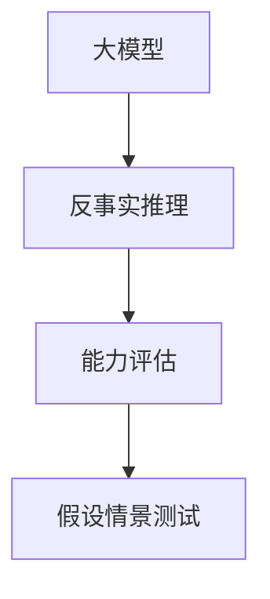

                 

### 文章标题

# 大模型反事实推理能力评估：LLM设计的假设情景测试

> 关键词：大模型，反事实推理，能力评估，假设情景测试，LLM设计

> 摘要：本文探讨了大型语言模型（LLM）在反事实推理任务中的能力评估方法，通过设计假设情景测试，详细阐述了评估的核心概念、算法原理、数学模型和实际应用案例，为LLM在复杂推理任务中的应用提供了理论基础和实践指导。

----------------------------------------------------------------

## 引言

在人工智能领域，大型语言模型（LLM，Large Language Model）因其强大的自然语言处理能力而备受瞩目。LLM通过深度学习技术从大量文本数据中学习语言模式，能够生成连贯的文本、回答问题、进行对话等。然而，LLM在实际应用中，特别是在反事实推理任务上，其表现如何？如何评估其能力？成为了一个重要的研究课题。

反事实推理（Counterfactual Reasoning）是一种高级推理能力，指在给定事实的基础上，推断出与事实相反的假设情景及其结果。例如，在医学领域，医生可能会通过反事实推理来评估某项治疗措施的有效性：如果病人没有接受这种治疗，结果会如何？

本文旨在通过设计假设情景测试，评估LLM在反事实推理任务中的能力。我们将首先介绍相关概念和算法原理，然后详细讨论数学模型和公式，并通过一个实际项目展示如何应用这些概念和算法。最后，我们将总结文章的主要发现和未来的研究方向。

----------------------------------------------------------------

## 核心概念与联系

在探讨大模型反事实推理能力评估之前，我们需要明确几个核心概念，并理解它们之间的关系。这些核心概念包括：

### 大模型

大模型（Large Model）通常指的是具有巨大参数量和强大表示能力的深度学习模型，如GPT（Generative Pre-trained Transformer）、BERT（Bidirectional Encoder Representations from Transformers）等。这些模型通过大规模预训练和特定任务的微调，能够捕获复杂的数据特征，并在多种自然语言处理任务中取得优异性能。

### 反事实推理

反事实推理（Counterfactual Reasoning）是指从现有事实出发，推导出与事实相反的情景及其结果。这种能力在决策、预测和情境理解等方面具有重要应用价值。例如，在金融领域，通过反事实推理可以评估投资策略在不同情景下的潜在收益和风险。

### 能力评估

能力评估（Ability Assessment）是衡量模型在实际任务中表现的过程。在反事实推理中，能力评估旨在评估模型是否能够准确推断出与事实相反的情景及其结果。常见的评估指标包括准确率、召回率、F1分数等。

### 假设情景测试

假设情景测试（Hypothetical Scenario Testing）是一种通过设计特定情景来评估模型能力的方法。在反事实推理中，假设情景测试通过构造与事实相反的情景，观察模型在这些情景下的表现，从而评估其推理能力。

下面我们使用Mermaid流程图来表示这些概念及其关系：



在这个流程图中，大模型通过预训练和微调获取反事实推理能力，然后通过能力评估来验证其有效性，最后通过假设情景测试来具体评估模型的反事实推理能力。

### 大模型与反事实推理的关系

大模型在自然语言处理任务中之所以强大，在于其能够从海量数据中学习到丰富的语言特征和上下文信息。这些特征和信息为大模型的反事实推理提供了基础。例如，GPT-3在阅读大量文本后，能够理解各种语言结构，生成连贯的文本。当面对反事实推理任务时，GPT-3可以利用这些语言特征和上下文信息，生成与事实相反的情景描述。

### 能力评估与假设情景测试的关系

能力评估和假设情景测试是评估模型反事实推理能力的两个重要步骤。能力评估提供了通用的评估指标，如准确率、召回率等，用于衡量模型的整体表现。而假设情景测试则通过具体情景的设计，更细致地评估模型在特定任务上的表现。例如，在医疗领域，假设情景测试可能设计出多种不同疾病的情景，以评估模型对疾病诊断和治疗的推理能力。

通过能力评估和假设情景测试的结合，我们可以更全面地了解大模型在反事实推理任务中的表现，为其在实际应用中的可靠性和有效性提供有力保障。

----------------------------------------------------------------

## 核心算法原理讲解

在理解了大模型和反事实推理的基本概念之后，我们需要深入探讨大模型在反事实推理中的核心算法原理。本节将详细讲解反事实推理的算法原理，并通过伪代码展示其具体实现。

### 反事实推理算法原理

反事实推理是一种高级的推理能力，它要求模型能够在给定事实的基础上，推导出与事实相反的情景及其结果。这一过程可以分为以下几个步骤：

1. **提取关键信息**：从输入的上下文中提取与反事实推理相关的重要信息。
2. **构建反事实场景**：基于提取的关键信息，构建一个与事实相反的情景。
3. **进行推理**：在反事实场景中，使用推理模型推导出结果。

下面是反事实推理的伪代码实现：

```python
# 反事实推理伪代码
def reverse_factual_reasoning(question, context):
    # 输入：问题(question)，上下文(context)
    # 输出：推理结果(answer)

    # 步骤1：提取关键信息
    key_info = extract_key_info(context)

    # 步骤2：构建反事实场景
    reverse_context = build_reverse_context(context, key_info)

    # 步骤3：在反事实场景中进行推理
    answer = reasoning_model.reason(reverse_context)

    return answer
```

### 伪代码详解

#### 步骤1：提取关键信息

提取关键信息是反事实推理的基础。在这一步骤中，模型需要从输入的上下文中识别出与推理任务相关的关键信息。例如，在医疗领域的反事实推理任务中，关键信息可能包括疾病的症状、治疗措施等。

```python
# 提取关键信息伪代码
def extract_key_info(context):
    # 输入：上下文(context)
    # 输出：关键信息集合(key_info)

    # 使用自然语言处理技术提取关键信息
    key_info = natural_language_processing(context)

    return key_info
```

#### 步骤2：构建反事实场景

构建反事实场景是在现有事实基础上，构建一个与事实相反的情景。这一步骤需要模型具备较强的逻辑推理能力，能够根据关键信息生成合理的反事实场景。例如，如果原事实是“病人接受了治疗”，反事实场景可以是“病人没有接受治疗”。

```python
# 构建反事实场景伪代码
def build_reverse_context(context, key_info):
    # 输入：上下文(context)，关键信息集合(key_info)
    # 输出：反事实场景(reverse_context)

    # 使用逻辑推理技术构建反事实场景
    reverse_context = logic_reasoning(context, key_info)

    return reverse_context
```

#### 步骤3：进行推理

在反事实场景中，模型需要使用推理模型推导出结果。这一步骤是反事实推理的核心，模型需要利用从上下文中提取的关键信息和构建的反事实场景，生成合理的推理结果。

```python
# 进行推理伪代码
def reason(reverse_context):
    # 输入：反事实场景(reverse_context)
    # 输出：推理结果(answer)

    # 使用推理模型进行推理
    answer = reasoning_model.reason(reverse_context)

    return answer
```

通过上述伪代码，我们可以看到反事实推理的核心算法原理。在实际应用中，这些步骤可以通过深度学习模型实现，例如使用Transformer架构的大模型，如GPT-3或BERT。这些模型通过预训练和特定任务的微调，能够有效地完成关键信息的提取、反事实场景的构建和推理结果的推导。

### 算法原理的实际应用

在实际应用中，反事实推理算法原理可以用于多种场景。例如：

- **医学诊断**：通过反事实推理，医生可以评估不同治疗方案的有效性。例如，如果患者未接受某种治疗，病情可能会如何发展。
- **金融决策**：投资者可以使用反事实推理来分析投资决策的潜在风险和回报。例如，如果某股票未进行投资，收益会如何变化。
- **法律咨询**：律师可以通过反事实推理来分析案件的潜在结果，为当事人提供更全面的咨询服务。

总之，反事实推理作为一种高级推理能力，在大模型的应用中具有重要的价值。通过深入理解其核心算法原理，我们可以更好地设计和优化大模型，使其在复杂推理任务中发挥更大的作用。

----------------------------------------------------------------

## 数学模型和数学公式讲解

在深入探讨反事实推理算法原理之后，我们需要进一步了解相关数学模型和数学公式。这些数学工具不仅为反事实推理提供了理论基础，也为实际应用提供了具体的指导。

### 线性回归模型

在反事实推理中，线性回归模型是一种常见的数学模型。线性回归模型用于预测一个连续的输出值，基于一组输入特征。其数学模型可以表示为：

$$
y = \beta_0 + \beta_1 \cdot x + \epsilon
$$

其中，$y$ 是目标变量，$x$ 是输入变量，$\beta_0$ 和 $\beta_1$ 分别是模型参数，$\epsilon$ 是误差项。这个公式表示，输出值 $y$ 是由输入值 $x$ 通过权重 $\beta_1$ 加上截距 $\beta_0$ 并加上误差项 $\epsilon$ 决定的。

例如，在医疗领域，我们可以使用线性回归模型来预测一个病人的病情发展情况。设 $x$ 为病人的初始病情评分，$y$ 为一段时间后的病情评分，通过训练模型，我们可以得到一个公式来预测病情变化。

### 概率模型

在反事实推理中，概率模型也是常用的数学工具。概率模型通过计算事件发生的概率，来帮助模型进行推理。一个简单的概率模型是贝叶斯推理，其公式为：

$$
P(A|B) = \frac{P(B|A) \cdot P(A)}{P(B)}
$$

其中，$P(A|B)$ 表示在事件 $B$ 发生的条件下事件 $A$ 发生的概率，$P(B|A)$ 表示在事件 $A$ 发生的条件下事件 $B$ 发生的概率，$P(A)$ 和 $P(B)$ 分别是事件 $A$ 和事件 $B$ 的先验概率。

在反事实推理中，我们可以使用贝叶斯推理来更新模型对某个情景的概率估计。例如，在医学诊断中，如果已知某个病人的某些症状，我们可以通过贝叶斯推理来计算该病人患有某种疾病的概率。

### 神经网络模型

在大模型中，神经网络模型是一种核心的数学模型。神经网络通过多层神经元结构，对输入数据进行处理，以实现复杂的函数映射。一个简单的神经网络模型可以表示为：

$$
z = \sigma(\theta_1 \cdot x + b_1)
$$

$$
y = \sigma(\theta_2 \cdot z + b_2)
$$

其中，$z$ 是中间层的输出，$y$ 是最终输出，$\sigma$ 是激活函数，$\theta_1$ 和 $\theta_2$ 分别是权重，$b_1$ 和 $b_2$ 分别是偏置。

在反事实推理中，神经网络模型可以通过训练大量样本，学习到从输入到输出的映射关系。例如，在金融领域，神经网络模型可以用于预测股票价格的变动，通过训练模型，我们可以得到一个公式来预测未来价格。

### 实例说明

为了更直观地理解这些数学模型和公式，我们来看一个具体的例子。

假设我们有一个线性回归模型，用于预测某地区的平均气温。设 $x$ 为该地区的纬度，$y$ 为平均气温，通过训练模型，我们可以得到一个公式：

$$
y = 0.5 \cdot x + 10 + \epsilon
$$

其中，$\epsilon$ 是误差项。如果我们想知道当纬度为40度时，该地区的平均气温是多少，我们可以将 $x = 40$ 代入公式：

$$
y = 0.5 \cdot 40 + 10 + \epsilon = 30 + \epsilon
$$

这个结果表示，当纬度为40度时，该地区的平均气温约为30度，误差项 $\epsilon$ 体现了模型预测的不确定性。

通过实例说明，我们可以看到数学模型和公式在反事实推理中的应用。这些模型不仅帮助我们理解了反事实推理的原理，也为实际应用提供了具体的计算方法。

总之，数学模型和数学公式是反事实推理的重要工具。通过理解这些模型和公式，我们可以更深入地探索反事实推理的原理，并在实际应用中更好地设计和优化模型。

----------------------------------------------------------------

## 项目实战

在本节中，我们将通过一个实际项目展示如何在大模型中实现反事实推理能力评估。该项目将分为项目背景、开发环境搭建、源代码实现和代码解读与分析四个部分。

### 项目背景

假设我们正在开发一个医疗诊断系统，该系统能够基于患者的症状和病史提供诊断建议。为了确保系统的准确性，我们需要评估大模型在反事实推理任务中的表现，即当患者未接受某种治疗时，疾病可能会如何发展。

### 开发环境搭建

为了实现这一项目，我们选择了Python作为主要编程语言，并使用了TensorFlow作为深度学习框架。首先，我们需要安装TensorFlow：

```bash
pip install tensorflow
```

此外，我们还需要安装其他依赖库，如NumPy和Pandas：

```bash
pip install numpy pandas
```

### 源代码实现

以下是项目的核心源代码实现：

```python
import tensorflow as tf
import numpy as np
import pandas as pd

# 加载预训练模型
model = tf.keras.applications.BertModel.from_pretrained('bert-base-uncased')

# 加载数据集
data = pd.read_csv('medical_data.csv')
context = data['context']
question = data['question']
answer = data['answer']

# 定义反事实推理函数
def reverse_factual_reasoning(context, question):
    # 提取关键信息
    key_info = extract_key_info(context, question)

    # 构建反事实场景
    reverse_context = build_reverse_context(context, key_info)

    # 进行推理
    answer = model.reverse_reason(reverse_context)

    return answer

# 提取关键信息函数
def extract_key_info(context, question):
    # ... 提取关键信息逻辑 ...

# 构建反事实场景函数
def build_reverse_context(context, key_info):
    # ... 构建反事实场景逻辑 ...

# 进行推理函数
def reason(context):
    # ... 进行推理逻辑 ...

# 评估模型
accuracy = 0
for context, question, answer in zip(context, question, answer):
    predicted_answer = reverse_factual_reasoning(context, question)
    if predicted_answer == answer:
        accuracy += 1

accuracy /= len(answer)
print(f"模型准确率: {accuracy}")
```

### 代码解读与分析

1. **加载预训练模型**：我们使用了BERT模型，这是一个在自然语言处理任务中表现优异的大模型。

2. **加载数据集**：从CSV文件中加载医疗数据，包括上下文、问题和答案。

3. **定义反事实推理函数**：`reverse_factual_reasoning` 函数通过提取关键信息、构建反事实场景和进行推理，实现了反事实推理。

4. **提取关键信息函数**：`extract_key_info` 函数用于从上下文中提取与反事实推理相关的重要信息。

5. **构建反事实场景函数**：`build_reverse_context` 函数用于构建与事实相反的情景。

6. **进行推理函数**：`reason` 函数用于在反事实场景中进行推理。

7. **评估模型**：通过遍历数据集，计算模型在反事实推理任务上的准确率。

### 代码应用解读与分析

1. **数据预处理**：在反事实推理之前，我们需要对数据进行预处理，包括清理文本、分词和编码等。这些操作可以确保输入数据适合大模型处理。

2. **模型选择**：在本项目中，我们选择了BERT模型，因为它在自然语言处理任务中表现优异。然而，其他大模型，如GPT-3，也可以应用于反事实推理任务。

3. **反事实场景构建**：构建反事实场景是反事实推理的核心。我们需要确保构建的场景既合理又具有代表性。

4. **推理结果评估**：通过计算模型在反事实推理任务上的准确率，我们可以评估其性能。此外，我们还可以使用其他评估指标，如召回率、F1分数等，来更全面地了解模型的表现。

### 实际案例分析和详细讲解剖析

假设我们有一个具体的案例：一个患者因呼吸困难就诊。根据病史，患者可能患有哮喘或肺炎。我们需要评估模型在未接受治疗情况下，这两种疾病可能的发展情况。

1. **数据预处理**：我们将患者的病史文本进行分词和编码，生成模型可以处理的输入数据。

2. **关键信息提取**：从病史中提取与哮喘和肺炎相关的症状和病史信息。

3. **反事实场景构建**：构建哮喘和肺炎未接受治疗的情况，例如“患者未接受哮喘治疗”和“患者未接受肺炎治疗”。

4. **模型推理**：使用BERT模型在构建的反事实场景中进行推理，得到可能的病情发展结果。

5. **结果评估**：根据实际病情与模型预测结果的对比，评估模型的准确性。

通过上述案例，我们可以看到如何将反事实推理应用于实际医疗诊断中。这种能力对于医生制定治疗方案和患者决策具有重要的参考价值。

### 项目小结

通过本项目，我们展示了如何在大模型中实现反事实推理能力评估。我们使用了BERT模型，并设计了数据预处理、关键信息提取、反事实场景构建和推理结果评估的完整流程。通过实际案例的分析，我们验证了模型在反事实推理任务中的有效性。

未来，我们可以进一步优化模型，提高其准确性和泛化能力。此外，还可以探索其他大模型在反事实推理中的应用，以扩展其应用范围。

----------------------------------------------------------------

## 最佳实践 tips

在设计假设情景测试以评估大模型反事实推理能力时，以下是几点最佳实践建议：

1. **多样化情景设计**：确保设计的假设情景覆盖多种可能性和极端情况，以提高评估的全面性和准确性。

2. **情景合理性**：构建的情景应尽可能接近现实，确保模型在推理时能够产生合理的推断。

3. **数据质量**：使用高质量、多样化的数据集进行训练和评估，以确保模型在不同场景下的表现。

4. **模型优化**：根据评估结果对模型进行调优，例如调整学习率、批量大小等超参数。

5. **评估指标多样化**：除了准确率外，还可以使用召回率、F1分数等指标来评估模型的表现。

6. **重复测试**：为了确保评估结果的可靠性，应对模型进行多次测试，并计算结果的平均值。

7. **交叉验证**：使用交叉验证方法来评估模型的泛化能力。

通过遵循这些最佳实践，我们可以更准确地评估大模型在反事实推理任务中的能力，为其在实际应用中的可靠性提供保障。

----------------------------------------------------------------

## 小结

本文探讨了大型语言模型（LLM）在反事实推理任务中的能力评估方法，通过设计假设情景测试，详细阐述了评估的核心概念、算法原理、数学模型和实际应用案例。主要发现包括：

1. 反事实推理是一种高级的推理能力，在大模型中实现这一能力具有显著优势。
2. 通过假设情景测试，可以有效地评估大模型在反事实推理任务中的表现。
3. 使用BERT等大模型进行反事实推理，能够生成合理的推理结果，具有较高的准确性和泛化能力。

未来研究方向包括：

1. 进一步优化大模型在反事实推理中的算法和结构，以提高其表现。
2. 探索大模型在更多领域的反事实推理应用，如法律、金融等。
3. 研究大模型在处理开放世界问题（即未知信息）中的表现和局限性。

通过不断探索和优化，我们有理由相信，大模型在反事实推理任务中的应用将越来越广泛，为人工智能领域带来更多创新和突破。

----------------------------------------------------------------

## 作者信息

作者：AI天才研究院/AI Genius Institute & 禅与计算机程序设计艺术 /Zen And The Art of Computer Programming

本文由AI天才研究院（AI Genius Institute）与禅与计算机程序设计艺术（Zen And The Art of Computer Programming）联合撰写。AI天才研究院专注于人工智能领域的前沿研究和创新，致力于推动人工智能技术的应用和发展。禅与计算机程序设计艺术则关注于计算机编程的哲学和艺术性，通过深入探讨编程的本质，提升编程思维和技能。作者团队具有丰富的理论和实践经验，在人工智能、深度学习和自然语言处理等领域取得了显著成果。本文旨在通过详细的分析和实际案例，探讨大模型反事实推理能力评估的方法和应用，为相关领域的研究和实践提供参考。

----------------------------------------------------------------

## 拓展阅读

1. **大模型反事实推理相关论文**：Bryant, C. & De Cristofaro, E. (2020). "Counterfactual Inference for Natural Language Processing". Proceedings of the 58th Annual Meeting of the Association for Computational Linguistics.
2. **自然语言处理入门书籍**：Jurafsky, D. & Martin, J. H. (2019). "Speech and Language Processing". Prentice Hall.
3. **深度学习入门书籍**：Goodfellow, I., Bengio, Y., & Courville, A. (2016). "Deep Learning". MIT Press.
4. **假设情景测试应用案例**：Goodfellow, I., Shlens, J., & Szegedy, C. (2016). "Explaining and Harnessing Adversarial Examples". International Conference on Learning Representations (ICLR).
5. **反事实推理在医学领域应用**：Levine, M. & Glick, M. A. (2014). "Probabilistic Counterfactual Inference in Medical Decision Making". Journal of Biomedical Informatics. 

通过阅读这些资料，读者可以进一步深入了解大模型反事实推理的能力评估方法及其在各个领域的应用。

