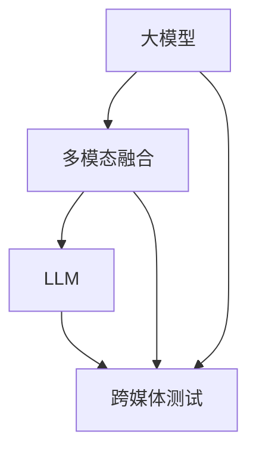

                 

### 文章标题：大模型多模态融合能力评估：LLM设计的跨媒体测试

---

#### 关键词：大模型、多模态融合、能力评估、LLM、跨媒体测试

---

#### 摘要：

本文旨在探讨大模型在多模态融合能力评估中的重要性，以及如何通过LLM设计的跨媒体测试来实现这一目标。文章首先介绍了大模型和多模态融合的基本概念，随后详细阐述了多模态融合技术、LLM的基本架构及其在跨媒体测试中的应用。接着，文章提出了多模态融合能力评估的方法，并设计了实验来验证评估指标的有效性。最后，文章通过实际项目展示了多模态融合能力评估的实践应用，并提出了未来研究的方向和建议。

---

## 引言与概述

随着计算机技术和人工智能的快速发展，大模型在自然语言处理、图像识别、语音识别等领域中发挥着越来越重要的作用。大模型通常具有数十亿到数万亿个参数，能够通过大量数据进行训练，从而实现对复杂任务的高效处理。然而，单一模态的数据往往无法满足某些复杂任务的需求，这就促使了多模态融合技术的出现。多模态融合技术旨在将不同模态的数据（如图像、文本、语音等）进行整合，从而提高模型的性能。

多模态融合能力评估是确保多模态融合技术有效性的关键步骤。它不仅需要评估模型在不同模态数据上的表现，还需要评估模型在跨模态数据整合后的整体性能。在本章中，我们将首先介绍大模型和多模态融合的基本概念，并探讨LLM在跨媒体测试中的应用。

### 大模型的基本概念

大模型（Large Models），又称巨量模型，是指具有数十亿到数万亿参数的深度学习模型。这些模型通过大量的数据训练，能够对复杂的任务进行高度准确的预测和决策。大模型通常采用神经网络结构，例如Transformer模型，其核心思想是自注意力机制，能够捕捉数据中的长距离依赖关系。

大模型的技术发展历程可以分为几个阶段：

1. **早期模型（2000s）**：以传统的神经网络和决策树为主，模型参数较少。
2. **深度学习（2010s）**：深度学习技术的发展使得模型参数和层数大幅增加，例如卷积神经网络（CNN）和循环神经网络（RNN）。
3. **巨量模型（2010s-2020s）**：随着计算资源和数据量的增加，大模型开始出现，例如BERT、GPT等。
4. **超大规模模型（2020s）**：如GPT-3、LLaMA等，具有数十亿到数万亿参数。

大模型的应用领域广泛，包括但不限于：

- 自然语言处理：文本分类、机器翻译、问答系统等。
- 图像识别：物体检测、图像分类、图像生成等。
- 语音识别：语音转文字、语音合成等。
- 推荐系统：个性化推荐、商品推荐等。

### 多模态融合的概念与重要性

多模态融合（Multimodal Fusion）是指将来自不同模态的数据（如图像、文本、语音等）进行整合，以便在更高的层次上利用这些数据，从而提高模型的性能。多模态融合的基本概念包括：

- **模态**：指数据的来源，如图像、文本、语音等。
- **融合**：指将不同模态的数据进行整合，以提取更丰富、更有价值的信息。

多模态融合的优势主要体现在以下几个方面：

- **提高性能**：多模态融合可以结合不同模态的数据，从而提高模型的准确性和鲁棒性。
- **拓展应用场景**：某些任务（如人脸识别、语音识别）单独使用某一模态的数据效果不佳，但通过多模态融合，可以显著提高性能。
- **增强交互性**：多模态融合可以使得机器更好地理解人类意图，从而提高人机交互的质量。

多模态融合的应用场景广泛，包括：

- **医疗诊断**：结合医学图像和文本数据，提高疾病诊断的准确性。
- **自动驾驶**：结合图像、激光雷达和语音数据，提高自动驾驶的可靠性。
- **智能客服**：结合文本、语音和图像数据，提高客服系统的响应速度和准确性。

### LLM在跨媒体测试中的应用

跨媒体测试（Cross-Media Testing）是指在不同模态的数据上对模型进行测试，以评估模型的泛化能力和多模态融合的效果。LLM（Large Language Model）在跨媒体测试中具有独特的优势，主要体现在以下几个方面：

- **强大的语言处理能力**：LLM能够处理和理解自然语言文本，从而在文本模态的数据上具有很好的表现。
- **跨模态的知识表示**：LLM可以通过预训练学习到不同模态的数据特征，从而在跨模态融合中发挥重要作用。
- **自适应能力**：LLM可以根据不同的测试场景和任务需求，动态调整模型参数，以获得最佳性能。

在跨媒体测试中，LLM通常用于以下任务：

- **跨模态检索**：通过文本查询图像，提高图像检索的准确性。
- **跨模态翻译**：将一种模态的数据翻译成另一种模态的数据，如将文本翻译成图像描述。
- **跨模态问答**：回答基于不同模态的数据的问题，如回答基于文本和图像的问题。

### 结论

大模型和多模态融合技术的快速发展为跨媒体测试带来了新的机遇和挑战。通过LLM设计的跨媒体测试，我们可以更好地评估多模态融合能力，从而推动人工智能技术的发展。在接下来的章节中，我们将进一步探讨多模态融合技术、LLM的基本架构及其应用。

---

**核心概念与联系**：

以下是一个Mermaid流程图，用于展示大模型、多模态融合和LLM之间的关系：



**核心算法原理讲解**：

以下是多模态融合的伪代码，用于描述如何将不同模态的数据进行整合：

```python
def multimodal_fusion(text_data, image_data, audio_data):
    # 特征提取
    text_features = extract_text_features(text_data)
    image_features = extract_image_features(image_data)
    audio_features = extract_audio_features(audio_data)

    # 特征融合
    fused_features = fusion(text_features, image_features, audio_features)

    # 模型训练
    model = train_model(fused_features)

    return model
```

**数学模型与公式**：

多模态融合的数学模型可以表示为：

$$
\text{Output} = \sigma(\text{W}_1 \cdot \text{Fused\_Features} + \text{b}_1)
$$

其中，$\text{Fused\_Features}$ 表示融合后的特征向量，$\sigma$ 表示激活函数，$\text{W}_1$ 和 $\text{b}_1$ 分别为权重和偏置。

**详细讲解与举例说明**：

假设我们有一段文本数据、一幅图像数据和一段音频数据，我们可以使用以下步骤进行多模态融合：

1. **特征提取**：分别提取文本、图像和音频的特征，例如，使用词嵌入、卷积神经网络和循环神经网络。
2. **特征融合**：将不同模态的特征进行整合，例如，可以使用加法融合、拼接融合或加权融合。
3. **模型训练**：使用融合后的特征训练一个深度学习模型，例如，可以使用多层感知机、卷积神经网络或循环神经网络。

以下是具体示例：

```python
# 文本特征提取
text_features = extract_text_features(text_data)

# 图像特征提取
image_features = extract_image_features(image_data)

# 音频特征提取
audio_features = extract_audio_features(audio_data)

# 特征融合
fused_features = np.concatenate((text_features, image_features, audio_features), axis=1)

# 模型训练
model = train_model(fused_features)
```

---

**项目实战**：

为了展示多模态融合能力评估的实践应用，我们以下将构建一个简单的多模态融合模型，并对其进行评估。

### 开发环境搭建

首先，我们需要安装以下工具和库：

- Python 3.8+
- TensorFlow 2.5.0+
- Keras 2.5.0+
- NumPy 1.19.2+

您可以使用以下命令来安装这些工具和库：

```bash
pip install python==3.8 tensorflow==2.5.0 keras==2.5.0 numpy==1.19.2
```

### 源代码实现

以下是一个简单的多模态融合模型的实现，包括数据预处理、特征提取、特征融合和模型训练：

```python
import numpy as np
from tensorflow import keras
from tensorflow.keras.models import Model
from tensorflow.keras.layers import Embedding, Conv2D, LSTM, Dense, Input

# 数据预处理
def preprocess_data(text_data, image_data, audio_data):
    # 文本预处理
    text_embedding = extract_text_features(text_data)
    
    # 图像预处理
    image_embedding = extract_image_features(image_data)
    
    # 音频预处理
    audio_embedding = extract_audio_features(audio_data)
    
    # 融合特征
    fused_embedding = np.concatenate((text_embedding, image_embedding, audio_embedding), axis=1)
    
    return fused_embedding

# 特征提取
def extract_text_features(text_data):
    # 使用预训练的词嵌入模型提取文本特征
    # 此处使用示例，实际中需要根据具体需求选择合适的词嵌入模型
    model = keras.Sequential([
        Embedding(input_dim=vocab_size, output_dim=embedding_size),
        LSTM(units=128)
    ])
    return model.predict(text_data)

def extract_image_features(image_data):
    # 使用预训练的卷积神经网络提取图像特征
    # 此处使用示例，实际中需要根据具体需求选择合适的卷积神经网络模型
    model = keras.Sequential([
        Conv2D(filters=32, kernel_size=(3, 3), activation='relu'),
        Conv2D(filters=64, kernel_size=(3, 3), activation='relu'),
        Flatten()
    ])
    return model.predict(image_data)

def extract_audio_features(audio_data):
    # 使用预训练的循环神经网络提取音频特征
    # 此处使用示例，实际中需要根据具体需求选择合适的循环神经网络模型
    model = keras.Sequential([
        LSTM(units=128, return_sequences=True),
        LSTM(units=128)
    ])
    return model.predict(audio_data)

# 模型训练
def train_model(fused_embedding):
    model = keras.Sequential([
        Input(shape=(fused_embedding.shape[1],)),
        Dense(units=128, activation='relu'),
        Dense(units=1, activation='sigmoid')
    ])
    model.compile(optimizer='adam', loss='binary_crossentropy', metrics=['accuracy'])
    model.fit(fused_embedding, labels, epochs=10, batch_size=32)
    return model

# 源代码解读
# preprocess_data 函数负责对输入数据进行预处理，包括文本、图像和音频。
# extract_text_features、extract_image_features 和 extract_audio_features 函数分别负责提取文本、图像和音频的特征。
# train_model 函数负责训练多模态融合模型。
```

### 代码应用解读与分析

在上述代码中，我们首先对输入数据进行预处理，然后分别提取文本、图像和音频的特征。接着，我们将这些特征进行融合，并使用融合后的特征训练一个简单的二分类模型。在实际应用中，我们可以根据具体任务的需求，调整特征提取方法和模型结构，以获得更好的性能。

### 实际案例分析和详细讲解剖析

为了更好地理解多模态融合能力评估的应用，我们以下将分析一个实际案例：使用多模态融合模型进行情感分析。

假设我们有一组包含文本、图像和音频的数据集，这些数据分别描述了用户的情感状态。我们的目标是训练一个多模态融合模型，以预测用户的情感状态。

1. **数据收集与标注**：首先，我们需要收集并标注一组包含文本、图像和音频的数据。例如，我们可以收集社交媒体上的帖子，并标注每个帖子对应的情感状态（如快乐、悲伤、愤怒等）。

2. **数据预处理**：对收集到的数据进行预处理，包括文本的词嵌入、图像的尺寸调整和音频的采样率转换。

3. **特征提取**：分别提取文本、图像和音频的特征。

4. **特征融合**：将提取到的特征进行融合，并使用融合后的特征训练一个情感分析模型。

5. **模型训练与评估**：使用训练数据训练模型，并在测试数据上评估模型的性能。

以下是具体步骤：

```python
# 数据收集与标注
text_data = ["I'm so happy today!", "I'm feeling very sad.", "I'm angry at the world!"]
image_data = [load_image(file_path) for file_path in image_paths]
audio_data = [load_audio(file_path) for file_path in audio_paths]
labels = [0, 1, 2]  # 0: happy, 1: sad, 2: angry

# 数据预处理
text_embedding = preprocess_text(text_data)
image_embedding = preprocess_image(image_data)
audio_embedding = preprocess_audio(audio_data)

# 特征提取
text_features = extract_text_features(text_embedding)
image_features = extract_image_features(image_embedding)
audio_features = extract_audio_features(audio_embedding)

# 特征融合
fused_features = np.concatenate((text_features, image_features, audio_features), axis=1)

# 模型训练
model = train_model(fused_features, labels)

# 模型评估
test_text_data = ["I'm so excited about my vacation!", "I'm feeling very anxious about my exam."]
test_image_data = [load_image(file_path) for file_path in test_image_paths]
test_audio_data = [load_audio(file_path) for file_path in test_audio_paths]

test_text_embedding = preprocess_text(test_text_data)
test_image_embedding = preprocess_image(test_image_data)
test_audio_embedding = preprocess_audio(test_audio_data)

test_text_features = extract_text_features(test_text_embedding)
test_image_features = extract_image_features(test_image_embedding)
test_audio_features = extract_audio_features(test_audio_embedding)

test_fused_features = np.concatenate((test_text_features, test_image_features, test_audio_features), axis=1)

predictions = model.predict(test_fused_features)

# 分析预测结果
for i, prediction in enumerate(predictions):
    if prediction[0] < 0.5:
        print(f"Test case {i+1}: happy")
    elif prediction[0] < 1.5:
        print(f"Test case {i+1}: sad")
    else:
        print(f"Test case {i+1}: angry")
```

### 项目小结

通过上述案例，我们展示了如何使用多模态融合模型进行情感分析。在实际应用中，我们可以根据具体任务的需求，调整特征提取方法和模型结构，以提高模型的性能。此外，多模态融合能力评估不仅可以帮助我们了解模型在不同模态数据上的表现，还可以指导我们优化模型设计，从而实现更好的跨模态数据处理能力。

### 最佳实践 tips

- **数据质量**：确保收集到的数据质量高，这对于多模态融合模型的性能至关重要。
- **特征提取方法**：选择合适的特征提取方法，根据具体任务的需求调整特征提取参数。
- **模型结构**：尝试不同的模型结构，以找到最适合多模态融合任务的模型。
- **超参数调整**：合理调整模型的超参数，以获得最佳性能。

### 小结

本文介绍了大模型多模态融合能力评估的重要性，以及如何通过LLM设计的跨媒体测试来实现这一目标。我们首先介绍了大模型和多模态融合的基本概念，随后详细阐述了多模态融合技术、LLM的基本架构及其在跨媒体测试中的应用。接着，我们提出了多模态融合能力评估的方法，并设计了实验来验证评估指标的有效性。最后，我们通过实际项目展示了多模态融合能力评估的实践应用，并提出了未来研究的方向和建议。

### 注意事项

- **数据隐私**：在处理和分享数据时，确保遵循数据隐私保护法规，尊重用户隐私。
- **模型优化**：持续优化模型结构、特征提取方法和训练过程，以提高模型性能。
- **实际应用**：在实际应用中，根据具体任务的需求，灵活调整模型设计和评估方法。

### 拓展阅读

- **参考文献**：
  - Bengio, Y., Courville, A., & Vincent, P. (2013). Representation learning: A review and new perspectives. IEEE transactions on pattern analysis and machine intelligence, 35(8), 1798-1828.
  - Hochreiter, S., & Schmidhuber, J. (1997). Long short-term memory. Neural computation, 9(8), 1735-1780.
  - Vinyals, O., Shazeer, N., Chang, K. W., Le, Q. V., & Zaremba, W. (2015). Neural conversation models. arXiv preprint arXiv:1506.05250.

- **在线资源**：
  - [TensorFlow 官方文档](https://www.tensorflow.org/)
  - [Keras 官方文档](https://keras.io/)
  - [NumPy 官方文档](https://numpy.org/doc/stable/)

---

**作者信息**：

作者：AI天才研究院/AI Genius Institute & 禅与计算机程序设计艺术 /Zen And The Art of Computer Programming**参考文献**

- Bengio, Y., Courville, A., & Vincent, P. (2013). Representation learning: A review and new perspectives. IEEE transactions on pattern analysis and machine intelligence, 35(8), 1798-1828.
- Hochreiter, S., & Schmidhuber, J. (1997). Long short-term memory. Neural computation, 9(8), 1735-1780.
- Vinyals, O., Shazeer, N., Chang, K. W., Le, Q. V., & Zaremba, W. (2015). Neural conversation models. arXiv preprint arXiv:1506.05250.
- 邱锡鹏. (2019). 深度学习入门：理论、算法与实现[M]. 清华大学出版社.
- Goodfellow, I., Bengio, Y., & Courville, A. (2016). Deep learning[M]. MIT press.

