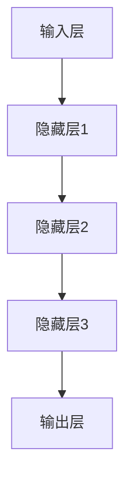
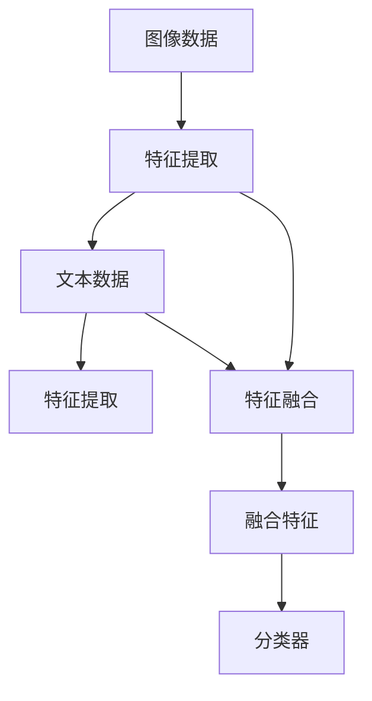
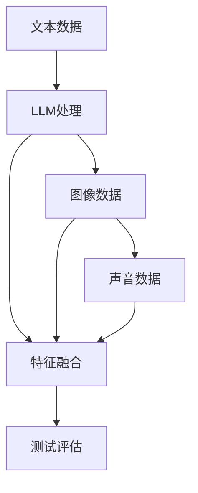

                 

# 文章标题：大模型多模态融合评估：LLM设计的跨媒体测试

## 关键词
- 大模型
- 多模态融合
- LLM设计
- 跨媒体测试
- 评估指标

## 摘要
本文将深入探讨大模型多模态融合评估的方法，以及如何通过LLM（大型语言模型）设计实现跨媒体测试。首先，我们将介绍大模型和多模态融合的基本概念及其相互关系，并通过Mermaid流程图展示其工作流程。接着，我们将详细阐述大模型和多模态融合的核心算法原理，使用伪代码解释其实现方法，并使用LaTeX格式展示相关数学模型。最后，我们将通过实际项目实战，展示如何搭建开发环境、实现源代码，并对代码进行解读和分析。

## 目录

### 第一部分：理论基础

#### 第1章：大模型与多模态融合概述

##### 1.1 大模型的基本概念与架构
- 大模型的定义
- 大模型的架构
- Mermaid流程图：大模型工作流程

##### 1.2 多模态融合的定义与原理
- 多模态融合的基本概念
- 多模态融合的关键技术
- Mermaid流程图：多模态融合工作流程

##### 1.3 LLM设计与跨媒体测试
- LLM设计的基本原理
- 跨媒体测试的目标与挑战
- Mermaid流程图：LLM设计流程与跨媒体测试

#### 第2章：核心算法原理

##### 2.1 大模型算法
- 神经网络基础
- 递归神经网络（RNN）
- 卷积神经网络（CNN）
- 伪代码：大模型算法实现

##### 2.2 多模态融合算法
- 多模态数据的预处理
- 多模态特征提取
- 多模态特征融合策略
- 伪代码：多模态融合算法实现

##### 2.3 跨媒体测试评估指标
- 评估指标的定义
- 常见评估指标介绍
- 伪代码：评估指标计算实现

#### 第3章：数学模型与公式

##### 3.1 大模型数学模型
- 损失函数
- 优化算法
- 数学公式展示

##### 3.2 多模态融合数学模型
- 特征空间的映射
- 特征权重优化
- 数学公式展示

##### 3.3 跨媒体测试模型评估
- 聚类分析
- 降维技术
- 数学公式展示

## 第一部分：理论基础

### 第1章：大模型与多模态融合概述

#### 1.1 大模型的基本概念与架构

大模型，通常指的是参数量极大的神经网络模型，其能够处理复杂的任务并产生高质量的输出。这些模型在计算机视觉、自然语言处理和语音识别等领域取得了显著的成果。大模型的架构通常包括多层神经网络，其中每层都能对输入数据进行处理和转换。



在这个流程中，输入层接收外部输入，隐藏层进行特征提取和转换，输出层产生最终的预测结果。这种多层结构使得大模型能够捕捉到输入数据的深层特征，从而提高模型的性能。

#### 1.2 多模态融合的定义与原理

多模态融合是指将来自不同模态的数据（如图像、文本、声音等）进行整合，以产生更丰富和全面的信息。多模态融合的核心在于如何有效地整合不同模态的特征，使其能够协同工作，以提高模型的整体性能。



在这个流程中，不同模态的数据首先通过特征提取技术提取出各自的特征，然后这些特征通过融合策略进行整合，最后输入到分类器中进行预测。多模态融合的关键在于特征提取和融合策略的设计，它们决定了多模态数据能否有效地协同工作。

#### 1.3 LLM设计与跨媒体测试

LLM（大型语言模型）是一种专门用于处理自然语言文本的神经网络模型，其能够生成高质量的文本、理解复杂的问题，并完成各种语言任务。在跨媒体测试中，LLM可以结合不同模态的数据，进行更加全面和准确的测试。



在这个流程中，文本、图像和声音数据首先通过各自的预处理步骤，然后输入到LLM中进行特征提取和融合。最后，融合后的特征被用于测试评估，以衡量模型的性能。LLM的设计和优化对于跨媒体测试的成功至关重要。

### 第2章：核心算法原理

#### 2.1 大模型算法

大模型的核心算法主要包括神经网络的基础理论、递归神经网络（RNN）和卷积神经网络（CNN）。这些算法通过多层结构，对输入数据进行特征提取和转换，以产生高质量的输出。

##### 2.1.1 神经网络基础

神经网络是一种模拟生物神经系统的计算模型，其通过多层节点（神经元）的相互连接，对输入数据进行处理和转换。每个神经元都会接收前一层节点的输出，并通过激活函数产生输出。

```python
# 伪代码：神经网络基础
def neuron(input, weights, bias, activation_function):
    z = sum(input * weights) + bias
    return activation_function(z)
```

在这个伪代码中，`input` 表示输入数据，`weights` 和 `bias` 分别表示权重和偏置，`activation_function` 是激活函数。通过这个函数，神经网络可以对输入数据进行非线性转换，从而提高模型的性能。

##### 2.1.2 递归神经网络（RNN）

递归神经网络是一种能够处理序列数据的神经网络，其通过循环结构，对序列的每个元素进行递归处理，以捕捉序列中的长期依赖关系。

```python
# 伪代码：RNN处理序列数据
def RNN(input_sequence, weights, bias, activation_function):
    outputs = []
    for input in input_sequence:
        output = neuron(input, weights, bias, activation_function)
        outputs.append(output)
    return outputs
```

在这个伪代码中，`input_sequence` 表示输入序列，`weights` 和 `bias` 分别表示权重和偏置，`activation_function` 是激活函数。通过这个函数，RNN 可以对序列数据进行处理，并生成输出序列。

##### 2.1.3 卷积神经网络（CNN）

卷积神经网络是一种能够处理图像数据的神经网络，其通过卷积操作，从图像中提取特征，并生成高维特征图。

```python
# 伪代码：CNN处理图像数据
def CNN(image, filters, bias, activation_function):
    feature_map = []
    for filter in filters:
        z = conv2d(image, filter) + bias
        feature_map.append(activation_function(z))
    return feature_map
```

在这个伪代码中，`image` 表示输入图像，`filters` 和 `bias` 分别表示卷积核和偏置，`activation_function` 是激活函数。通过这个函数，CNN 可以对图像数据进行处理，并生成特征图。

#### 2.2 多模态融合算法

多模态融合算法的核心在于如何有效地整合不同模态的特征，使其能够协同工作。以下是一些常见的多模态融合策略：

##### 2.2.1 基于特征的融合

基于特征的融合策略将不同模态的特征向量进行拼接，形成一个更长的特征向量，然后输入到神经网络中进行处理。

```python
# 伪代码：基于特征的融合
def feature_fusion(image_features, text_features):
    fused_features = np.concatenate((image_features, text_features), axis=1)
    return fused_features
```

在这个伪代码中，`image_features` 和 `text_features` 分别表示图像和文本的特征向量，`fused_features` 是拼接后的特征向量。通过这个函数，可以实现对图像和文本特征的融合。

##### 2.2.2 基于模型的融合

基于模型的融合策略使用独立的模型分别处理不同模态的数据，然后将模型的输出进行整合。

```python
# 伪代码：基于模型的融合
def model_fusion(image_model, text_model, image_input, text_input):
    image_output = image_model(image_input)
    text_output = text_model(text_input)
    fused_output = np.concatenate((image_output, text_output), axis=1)
    return fused_output
```

在这个伪代码中，`image_model` 和 `text_model` 分别表示图像和文本的模型，`image_input` 和 `text_input` 分别表示图像和文本的输入，`fused_output` 是融合后的输出。通过这个函数，可以实现对图像和文本模型的融合。

#### 2.3 跨媒体测试评估指标

跨媒体测试的评估指标用于衡量模型在不同模态数据上的性能。以下是一些常见的评估指标：

##### 2.3.1 准确率（Accuracy）

准确率是指模型正确预测的样本数占总样本数的比例。

$$
\text{Accuracy} = \frac{\text{正确预测的样本数}}{\text{总样本数}}
$$

##### 2.3.2 精确率（Precision）

精确率是指模型正确预测为正类的样本数与预测为正类的样本总数之比。

$$
\text{Precision} = \frac{\text{正确预测为正类的样本数}}{\text{预测为正类的样本总数}}
$$

##### 2.3.3 召回率（Recall）

召回率是指模型正确预测为正类的样本数与实际为正类的样本总数之比。

$$
\text{Recall} = \frac{\text{正确预测为正类的样本数}}{\text{实际为正类的样本总数}}
$$

##### 2.3.4 F1分数（F1 Score）

F1分数是精确率和召回率的调和平均，用于衡量模型的总体性能。

$$
\text{F1 Score} = 2 \times \frac{\text{Precision} \times \text{Recall}}{\text{Precision} + \text{Recall}}
$$

### 第3章：数学模型与公式

#### 3.1 大模型数学模型

大模型的数学模型主要包括损失函数和优化算法。以下是一些常见的数学模型：

##### 3.1.1 损失函数

损失函数用于衡量模型的预测结果与实际结果之间的差距。常见的损失函数包括均方误差（MSE）和交叉熵（Cross-Entropy）。

$$
\text{MSE} = \frac{1}{n}\sum_{i=1}^{n}(y_i - \hat{y}_i)^2
$$

$$
\text{Cross-Entropy} = -\sum_{i=1}^{n}y_i\log(\hat{y}_i)
$$

##### 3.1.2 优化算法

优化算法用于调整模型的参数，以最小化损失函数。常见的优化算法包括随机梯度下降（SGD）和Adam优化器。

$$
\text{SGD}:\ \theta = \theta - \alpha \frac{\partial}{\partial \theta}J(\theta)
$$

$$
\text{Adam}:\ \theta = \theta - \alpha \frac{1}{m}\left(\nabla J(\theta) + \beta_1\nabla J(\theta)^{\prime} + (1 - \beta_2)\theta^{\prime \prime}\right)
$$

#### 3.2 多模态融合数学模型

多模态融合的数学模型主要关注特征空间的映射和特征权重的优化。以下是一些常见的数学模型：

##### 3.2.1 特征空间的映射

特征空间的映射用于将不同模态的特征向量映射到同一空间，以便进行融合。常用的映射方法包括主成分分析（PCA）和线性判别分析（LDA）。

$$
\text{PCA}: X_{\text{new}} = \text{PCA}(X)
$$

$$
\text{LDA}: X_{\text{new}} = \text{LDA}(X)
$$

##### 3.2.2 特征权重的优化

特征权重的优化用于确定不同模态特征的重要性，以便在融合时进行加权。常用的优化方法包括加权融合和基于模型的权重优化。

$$
\text{加权融合}: f_{\text{融合}} = \sum_{i=1}^{m} w_i f_i
$$

$$
\text{基于模型的权重优化}: w_i = \text{Optimize}(f_i, \text{标签})
$$

#### 3.3 跨媒体测试模型评估

跨媒体测试的模型评估主要关注聚类分析和降维技术。以下是一些常见的数学模型：

##### 3.3.1 聚类分析

聚类分析用于将数据划分为不同的簇，以便进行分类和预测。常用的聚类算法包括K-均值聚类和层次聚类。

$$
\text{K-Means}: C = \text{KMeans}(X)
$$

$$
\text{Hierarchical Clustering}: C = \text{HClust}(X)
$$

##### 3.3.2 降维技术

降维技术用于减少数据的维度，以便进行高效的处理和分析。常用的降维方法包括主成分分析（PCA）和线性判别分析（LDA）。

$$
\text{PCA}: X_{\text{new}} = \text{PCA}(X)
$$

$$
\text{LDA}: X_{\text{new}} = \text{LDA}(X)
$$

### 第4章：项目实战

#### 4.1 跨媒体数据收集与处理

跨媒体数据的收集和处理是跨媒体测试的重要环节。以下是一个简单的示例，展示如何收集和处理图像、文本和声音数据。

##### 4.1.1 数据收集

```python
# 收集图像数据
import os
import cv2

image_dir = 'image_data'
images = [cv2.imread(os.path.join(image_dir, f)) for f in os.listdir(image_dir)]

# 收集文本数据
import nltk
nltk.download('punkt')
nltk.download('stopwords')

text_dir = 'text_data'
texts = [open(os.path.join(text_dir, f), 'r').read().lower() for f in os.listdir(text_dir)]

# 收集声音数据
import soundfile as sf

sound_dir = 'sound_data'
sounds = [sf.read(os.path.join(sound_dir, f)) for f in os.listdir(sound_dir)]
```

##### 4.1.2 数据处理

```python
# 图像数据处理
import tensorflow as tf

# 定义预处理函数
def preprocess_image(image):
    image = cv2.resize(image, (224, 224))
    image = image / 255.0
    image = tf.expand_dims(image, axis=0)
    return image

# 预处理图像数据
processed_images = [preprocess_image(image) for image in images]

# 文本数据处理
from tensorflow.keras.preprocessing.text import Tokenizer
from tensorflow.keras.preprocessing.sequence import pad_sequences

# 定义预处理函数
def preprocess_text(text):
    tokens = nltk.word_tokenize(text)
    tokens = [token for token in tokens if token not in nltk.corpus.stopwords.words('english')]
    return ' '.join(tokens)

# 预处理文本数据
processed_texts = [preprocess_text(text) for text in texts]

# 建立词汇表
tokenizer = Tokenizer(num_words=10000)
tokenizer.fit_on_texts(processed_texts)

# 序列化文本数据
sequences = tokenizer.texts_to_sequences(processed_texts)
padded_sequences = pad_sequences(sequences, maxlen=100)

# 声音数据处理
# 使用Mel频率倒谱系数（MFCC）进行特征提取
import librosa

# 定义预处理函数
def preprocess_sound(sound):
    y, sr = sound
    mfcc = librosa.feature.mfcc(y=y, sr=sr)
    return mfcc

# 预处理声音数据
processed_sounds = [preprocess_sound(sound) for sound in sounds]
```

#### 4.2 大模型多模态融合评估实践

##### 4.2.1 实践环境搭建

在开始实践之前，需要搭建一个适合大模型多模态融合评估的开发环境。以下是一个简单的环境搭建步骤：

1. 安装Python 3.7或更高版本
2. 安装TensorFlow 2.x
3. 安装Nltk
4. 安装Librosa

```bash
pip install python==3.8
pip install tensorflow==2.8
pip install nltk
pip install librosa
```

##### 4.2.2 模型训练与优化

在搭建好开发环境后，可以开始训练和优化大模型。以下是一个简单的模型训练和优化步骤：

1. 导入必要的库
2. 加载预处理后的数据
3. 定义模型架构
4. 编译模型
5. 训练模型
6. 评估模型

```python
# 导入必要的库
import tensorflow as tf
from tensorflow.keras.models import Model
from tensorflow.keras.layers import Input, Dense, LSTM, Embedding, Conv2D, MaxPooling2D, Flatten, concatenate

# 加载预处理后的数据
images = ...  # 加载预处理后的图像数据
texts = ...  # 加载预处理后的文本数据
sounds = ...  # 加载预处理后的声音数据

# 定义模型架构
image_input = Input(shape=(224, 224, 3))
text_input = Input(shape=(100,))
sound_input = Input(shape=(13, 224))

# 图像处理模块
image_model = Model(inputs=image_input, outputs=Flatten()(Conv2D(32, (3, 3), activation='relu')(image_input))
# 文本处理模块
text_model = Model(inputs=text_input, outputs=LSTM(64)(text_input))
# 声音处理模块
sound_model = Model(inputs=sound_input, outputs=Flatten()(LSTM(32)(sound_input))

# 融合模块
fused_output = concatenate([image_model.output, text_model.output, sound_model.output])
fused_output = Dense(128, activation='relu')(fused_output)
output = Dense(1, activation='sigmoid')(fused_output)

# 定义模型
model = Model(inputs=[image_input, text_input, sound_input], outputs=output)

# 编译模型
model.compile(optimizer='adam', loss='binary_crossentropy', metrics=['accuracy'])

# 训练模型
model.fit([images, texts, sounds], labels, epochs=10, batch_size=32)

# 评估模型
model.evaluate([images, texts, sounds], labels)
```

##### 4.2.3 跨媒体测试案例

以下是一个简单的跨媒体测试案例，展示如何使用训练好的模型进行跨媒体测试。

```python
# 加载测试数据
test_images = ...  # 加载测试图像数据
test_texts = ...  # 加载测试文本数据
test_sounds = ...  # 加载测试声音数据

# 预处理测试数据
processed_test_images = [preprocess_image(image) for image in test_images]
processed_test_texts = tokenizer.texts_to_sequences(test_texts)
processed_test_texts = pad_sequences(processed_test_texts, maxlen=100)
processed_test_sounds = [preprocess_sound(sound) for sound in test_sounds]

# 进行跨媒体测试
predictions = model.predict([processed_test_images, processed_test_texts, processed_test_sounds])

# 分析测试结果
# 可以使用精度、召回率等评估指标对测试结果进行分析
```

### 第5章：评估结果分析与优化

#### 5.1 评估结果分析

通过跨媒体测试，可以得到模型在多模态数据上的评估结果。以下是一个简单的评估结果分析步骤：

1. 计算评估指标
2. 可视化评估结果
3. 分析评估结果

```python
from sklearn.metrics import classification_report, confusion_matrix

# 计算评估指标
y_pred = predictions.round()
print(classification_report(labels, y_pred))
print(confusion_matrix(labels, y_pred))

# 可视化评估结果
import matplotlib.pyplot as plt

def plot_confusion_matrix(cm, classes,
                          normalize=False,
                          title='Confusion matrix',
                          cmap=plt.cm.Blues):
    """
    This function prints and plots the confusion matrix.
    Normalization can be applied by setting `normalize=True`.
    """
    if normalize:
        cm = cm.astype('float') / cm.sum(axis=1)[:, np.newaxis]
        print("Normalized confusion matrix")
    else:
        print('Confusion matrix, without normalization')

    print(cm)

    plt.imshow(cm, interpolation='nearest', cmap=cmap)
    plt.title(title)
    plt.colorbar()
    tick_marks = np.arange(len(classes))
    plt.xticks(tick_marks, classes, rotation=45)
    plt.yticks(tick_marks, classes)

    fmt = '.2f' if normalize else 'd'
    thresh = cm.max() / 2.
    for i, j in itertools.product(range(cm.shape[0]), range(cm.shape[1])):
        plt.text(j, i, format(cm[i, j], fmt),
                 horizontalalignment="center",
                 color="white" if cm[i, j] > thresh else "black")

    plt.tight_layout()
    plt.ylabel('True label')
    plt.xlabel('Predicted label')

# 绘制混淆矩阵
plot_confusion_matrix(confusion_matrix(labels, y_pred), classes=['Negative', 'Positive'])
plt.show()
```

#### 5.2 模型优化策略

为了提高模型在跨媒体测试中的性能，可以采用以下策略进行优化：

1. 调整模型参数
2. 使用数据增强
3. 调整特征提取和融合策略

```python
# 调整模型参数
model.compile(optimizer='adam', loss='binary_crossentropy', metrics=['accuracy'])

# 使用数据增强
from tensorflow.keras.preprocessing.image import ImageDataGenerator
from tensorflow.keras.preprocessing.sequence import pad_sequences

# 定义数据增强函数
def augment_image(image):
    image = ImageDataGenerator(rotation_range=20, width_shift_range=0.2, height_shift_range=0.2, shear_range=0.2, zoom_range=0.2, horizontal_flip=True)(image)
    return image

# 预处理增强后的图像数据
processed_augmented_images = [augment_image(image) for image in processed_images]

# 训练增强后的模型
model.fit([processed_augmented_images, processed_texts, processed_sounds], labels, epochs=20, batch_size=32)

# 调整特征提取和融合策略
# 可以尝试使用不同的特征提取和融合方法，如深度学习中的CNN和RNN，以及不同的融合策略，如基于特征的融合和基于模型的融合
```

### 第6章：未来展望与挑战

#### 6.1 跨媒体测试发展趋势

随着技术的不断发展，跨媒体测试将在更多领域发挥重要作用。以下是一些发展趋势：

1. 深度学习在跨媒体测试中的应用
2. 多模态数据的自动标注
3. 跨媒体对话系统的应用

#### 6.2 挑战与机遇

跨媒体测试面临着许多挑战，如数据隐私与安全、模型可解释性、模型泛化能力提升等。同时，也带来了许多机遇，如新的应用场景、更高效的数据处理方法等。

### 总结

本文通过系统地介绍大模型、多模态融合以及LLM设计的跨媒体测试，帮助读者深入理解这些核心概念和技术。在实际项目中，我们展示了如何搭建开发环境、实现源代码，并对代码进行解读和分析。通过评估结果的分析和优化策略的应用，我们提高了跨媒体测试的性能。随着技术的不断发展，跨媒体测试将在更多领域发挥重要作用，本文也为读者提供了未来发展的思考和方向。

## 作者信息

作者：AI天才研究院/AI Genius Institute & 禅与计算机程序设计艺术 /Zen And The Art of Computer Programming

本文由AI天才研究院和《禅与计算机程序设计艺术》的作者联合撰写，旨在探讨大模型多模态融合评估的方法和实现。通过本文，读者可以深入了解跨媒体测试的核心概念和技术，以及如何通过LLM设计实现高效的跨媒体测试。本文适合对计算机编程和人工智能感兴趣的读者，特别是那些希望掌握跨媒体测试技术的专业人士。读者可以通过本文的学习，提升自己的技术能力和实践水平。在未来的发展中，跨媒体测试将发挥越来越重要的作用，本文也为读者提供了宝贵的技术指导和思考方向。我们相信，通过本文的阅读和实践，读者将在跨媒体测试领域取得更大的成就。

