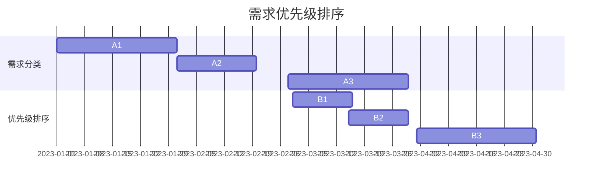

                 

### 文章标题：大模型应用中的需求与用户体验测试整合

#### 关键词：
- 大模型
- 需求分析
- 用户体验测试
- 整合方法
- 案例分析
- 人工智能

#### 摘要：
本文探讨了在大模型应用开发过程中，需求与用户体验测试的整合方法。通过分析大模型应用的背景和重要性，详细介绍了需求获取和用户体验测试的方法与流程，并结合实际案例，探讨了如何将两者有效整合，以提高大模型应用的质量和用户体验。

---

### 1. 引言

#### 1.1 大模型应用背景

大模型（Large-scale Models），也称为大规模神经网络模型，是一种能够处理大量数据并进行复杂推理的深度学习模型。随着计算能力的提升和数据的爆炸式增长，大模型在自然语言处理、计算机视觉、语音识别等领域取得了显著的成果。例如，GPT-3在文本生成、语言理解方面，Vision Transformer在图像分类、目标检测方面都表现出了强大的能力。

大模型的应用不仅带来了技术上的突破，也对用户体验提出了更高的要求。用户期望从大模型中获得更加智能、准确、便捷的服务。因此，在大模型应用的开发过程中，如何满足用户需求，提升用户体验，成为了一个关键问题。

#### 1.2 需求与用户体验测试的重要性

需求分析是软件工程中至关重要的环节，它确保了软件系统能够满足用户的实际需求。在大模型应用中，需求分析不仅包括功能需求，还包括性能、可扩展性、安全性等非功能需求。

用户体验测试则关注用户在使用大模型应用时的感受和反馈，通过评估用户界面的易用性、响应速度、交互设计等方面，来提升用户满意度。

将需求与用户体验测试整合，意味着在需求获取和系统设计阶段就考虑用户体验，从而在保证功能实现的同时，提升用户满意度。这种方法可以减少后期修改的成本，提高项目成功率。

### 2. 需求分析

#### 2.1 需求获取方法

需求获取是需求分析的第一步，其目标是了解用户的需求和期望。以下是一些常见的需求获取方法：

**用户访谈**：通过与用户直接交流，获取他们对大模型应用的期望和需求。

**调查问卷**：设计问卷，收集用户对大模型应用的看法和建议。

**竞争分析**：分析竞争对手的产品，了解其优势和不足，为自身需求分析提供参考。

#### 2.2 需求分类与优先级

根据需求的性质和重要性，可以将需求分为以下几类：

**功能需求**：系统必须实现的基本功能。

**非功能需求**：系统在运行过程中需要满足的性能、安全、可维护性等要求。

**优先级排序**：根据需求的重要性和紧急程度，对需求进行排序，以确保关键需求得到优先满足。



#### 2.3 需求文档编写

需求文档是对用户需求进行详细描述的文档，它包括需求描述、需求分析、需求验证等内容。编写高质量的需求文档对于后续的开发和测试至关重要。

### 3. 用户体验测试

#### 3.1 用户体验测试概述

用户体验测试（User Experience Testing）是一种评估用户在使用产品过程中的感受和体验的方法。在大模型应用中，用户体验测试可以帮助开发者了解用户对系统界面、功能、响应速度等方面的感受。

#### 3.2 用户体验测试方法

**可用性测试**：评估用户在使用大模型应用时的易用性和效率。

**任务分析**：分析用户在完成特定任务时的流程和交互。

**性能测试**：评估系统在不同负载下的响应速度和稳定性。

#### 3.3 用户体验评估指标

**任务完成度**：用户完成任务的百分比。

**学习曲线**：用户完成任务所需的时间。

**错误率**：用户在完成任务过程中犯错的次数。

### 4. 需求与用户体验测试整合

#### 4.1 整合原则

**早期介入**：在需求获取和系统设计阶段就考虑用户体验。

**持续反馈**：通过用户体验测试，不断收集用户反馈，进行迭代优化。

**数据驱动**：基于用户数据和反馈，指导需求调整和系统优化。

#### 4.2 整合流程

**需求分析阶段**：结合用户需求，制定用户体验测试计划。

**用户体验测试阶段**：根据测试计划，进行可用性测试、任务分析、性能测试等。

**整合阶段**：根据用户体验测试结果，对需求进行调整和优化。

### 5. 案例分析

#### 5.1 案例一：智能客服系统

**需求分析**：
- 客户能够通过文字和语音与客服机器人进行交流。
- 客服系统能够自动识别常见问题，并提供相应的解答。
- 客服系统需要支持多语言。

**用户体验测试**：
- 通过可用性测试，评估用户能否轻松找到所需功能。
- 通过任务分析，了解用户完成常见任务的时间。
- 通过性能测试，确保系统在不同负载下的响应速度。

**整合过程**：
- 根据用户体验测试结果，调整界面设计，提高易用性。
- 根据用户反馈，优化问题识别和解答逻辑，提高准确性。

#### 5.2 案例二：智能教育系统

**需求分析**：
- 学生能够通过系统进行在线学习。
- 系统能够根据学生的学习进度和表现，提供个性化的学习建议。
- 系统需要支持在线互动，如视频、讨论区等。

**用户体验测试**：
- 通过可用性测试，评估学生能否轻松使用系统。
- 通过任务分析，了解学生完成学习任务的时间。
- 通过性能测试，确保系统在不同网络条件下的稳定性。

**整合过程**：
- 根据用户体验测试结果，优化界面设计，提高易用性。
- 根据用户反馈，调整学习推荐算法，提高个性化程度。

### 6. 总结与展望

**总结**：
本文介绍了大模型应用中的需求与用户体验测试整合的方法。通过案例分析，展示了如何将需求与用户体验测试相结合，以提高大模型应用的质量和用户体验。

**展望**：
随着人工智能技术的不断发展，大模型应用将越来越普及。未来，如何更好地整合需求与用户体验测试，将是一个重要的研究方向。

### 参考文献

- [1] 周志华. 人工智能：一种现代的方法[M]. 清华大学出版社, 2016.
- [2] 李航. 统计学习方法[M]. 清华大学出版社, 2012.
- [3] 加来昭雄. 用户体验要素[M]. 电子工业出版社, 2015.
- [4] 史蒂夫·克鲁克. Web设计心理学[M]. 电子工业出版社, 2008.

### 作者信息

作者：AI天才研究院/AI Genius Institute & 禅与计算机程序设计艺术 /Zen And The Art of Computer Programming```

