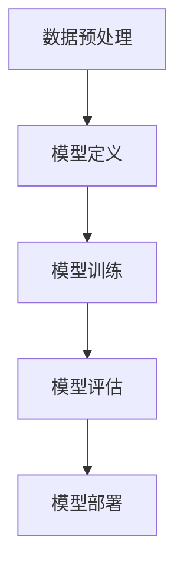

                 

### 文章标题

《大模型应用中的需求安全性评估方法》

### 关键词

- 大模型
- 需求安全性评估
- 人工智能
- 安全性
- 评估方法

### 摘要

本文将深入探讨大模型应用中的需求安全性评估方法。首先，我们将简要介绍大模型的概念及其在人工智能领域的应用背景。然后，重点阐述需求安全性评估的重要性，包括其核心概念、方法及其相互联系。我们将使用Mermaid流程图直观展示评估方法的架构，并提供详细的伪代码来讲解核心算法原理。此外，本文将结合实际案例，展示需求安全性评估的应用，并进行代码实现和解读。最后，我们将讨论评估工具与平台的选择，以及未来的发展方向。通过本文的阅读，读者将能够全面了解大模型应用中的需求安全性评估方法，掌握其实际应用技巧。

## 引言

### 大模型的概念与应用

大模型，通常指的是具有庞大参数量和复杂结构的机器学习模型，如深度神经网络（DNN）、变换器模型（Transformer）等。随着计算能力和数据资源的不断提升，大模型在图像识别、自然语言处理、推荐系统等众多领域取得了显著的应用成果。例如，GPT-3、BERT等模型在生成文本、问答系统、机器翻译等方面表现出色，大幅提升了任务的准确性和效率。

大模型的应用带来了巨大的经济效益和社会价值，但同时也引发了一系列安全性问题。首先，由于大模型具备强大的学习能力，它们可能会无意中学习到不安全或有害的信息，如敏感数据泄露、偏见和歧视等。其次，大模型在训练过程中可能受到恶意攻击，如对抗性攻击（Adversarial Attack），导致模型性能下降或产生错误输出。此外，大模型的设计和部署过程也可能会引入安全隐患，如漏洞和后门。

### 需求安全性评估的概念

需求安全性评估是指对系统或应用程序的需求进行安全性分析，以识别潜在的安全威胁和风险，并采取相应的措施进行预防和应对。在人工智能领域，需求安全性评估尤为重要，因为人工智能系统通常具有复杂的数据处理和决策过程，容易成为攻击的目标。

需求安全性评估的核心内容包括：

1. **数据安全**：确保数据的机密性、完整性和可用性。这包括防止数据泄露、篡改和未授权访问。
2. **模型安全**：评估模型的鲁棒性，防止对抗性攻击和恶意输入。
3. **隐私保护**：确保用户隐私不被泄露，特别是对于涉及个人敏感信息的应用。
4. **合规性**：确保系统符合相关的法律法规和标准，如GDPR、CCPA等。

### 需求安全性评估的重要性

需求安全性评估在人工智能领域具有极其重要的意义。首先，它可以识别系统中的潜在安全风险，帮助开发者和企业及时采取措施进行预防和修复。其次，需求安全性评估有助于提升系统的可靠性和用户体验，降低因安全漏洞导致的事故和损失。此外，随着人工智能应用在关键领域的普及，需求安全性评估也成为了合规性和责任承担的重要组成部分。

总之，随着人工智能技术的不断发展和应用，需求安全性评估将成为保障系统安全和用户隐私的重要手段。本文将围绕这一主题，详细探讨大模型应用中的需求安全性评估方法，以期为相关研究和实践提供有益的参考。

## 大模型基础

### 大模型基本原理

大模型的基本原理主要基于深度学习和神经网络技术。深度学习是一种机器学习方法，通过多层神经网络对数据进行抽象和特征提取，从而实现高层次的语义理解。神经网络则是由大量简单节点（或称为神经元）组成的计算模型，每个节点通过权重连接其他节点，并通过激活函数进行非线性变换。

在深度学习模型中，参数数量和层次结构是模型性能的关键因素。大模型通常具有数百万甚至数十亿个参数，这使得它们能够捕捉数据中的复杂模式和关联。常见的深度学习模型包括：

1. **卷积神经网络（CNN）**：主要应用于图像识别和计算机视觉领域。通过卷积操作提取图像特征，然后通过全连接层进行分类和预测。
2. **循环神经网络（RNN）**：适用于处理序列数据，如文本、时间序列等。RNN通过在时间步上保留状态信息，能够捕捉长距离依赖关系。
3. **变换器模型（Transformer）**：近年来在自然语言处理领域取得了显著成果。通过自注意力机制，Transformer能够同时关注输入序列中的所有信息，从而提高模型的表示能力。

### 大模型架构与流程

大模型的架构通常包括输入层、隐藏层和输出层。输入层接收原始数据，通过一系列隐藏层进行特征提取和抽象，最终在输出层产生预测或分类结果。以下是一个典型的大模型架构流程：

1. **数据预处理**：对原始数据进行清洗、归一化等处理，以消除噪声和提高模型训练效果。
2. **模型定义**：根据任务需求，定义模型的结构、参数和学习策略。常见的框架有TensorFlow、PyTorch等。
3. **模型训练**：使用大量训练数据，通过反向传播算法更新模型参数，以最小化预测误差。
4. **模型评估**：使用验证集或测试集对模型进行评估，以确定其泛化能力。
5. **模型部署**：将训练好的模型部署到生产环境中，用于实际应用。

### Mermaid流程图展示

为了更直观地展示大模型的架构与流程，我们可以使用Mermaid流程图来描述：



### 总结

通过上述内容，我们可以了解到大模型的基本原理和架构。接下来，我们将进一步探讨需求安全性评估的核心概念和方法。

## 需求安全性评估方法

### 定量评估方法

定量评估方法主要通过量化指标来评估需求安全性。这些指标通常基于数学模型和公式，可以提供量化的安全性评估结果。以下介绍几种常见的定量评估方法：

#### 漏洞评估模型（Vulnerability Assessment Model）

漏洞评估模型通过识别和评估系统中的潜在漏洞来评估安全性。常见的漏洞评估模型包括：

- **OWASP TOP 10**：这是一个广泛使用的漏洞分类标准，涵盖了常见的安全漏洞类型，如注入、跨站脚本（XSS）、跨站请求伪造（CSRF）等。

- **CVE（Common Vulnerabilities and Exposures）**：这是一个公共的漏洞和暴露数据库，提供对已发现漏洞的详细描述和评级。

#### 漏洞评估流程

漏洞评估通常包括以下步骤：

1. **识别漏洞**：使用工具如Nessus、OpenVAS等扫描系统，识别潜在的安全漏洞。
2. **漏洞评级**：根据漏洞的严重程度进行评级，如低、中、高。
3. **修复漏洞**：针对识别出的漏洞，制定修复计划并进行修复。

#### 伪代码

以下是一个简单的漏洞评估模型的伪代码示例：

```python
function VulnerabilityAssessment(model):
    vulnerabilities = ScanSystem(model)
    for vulnerability in vulnerabilities:
        severity = RateVulnerability(vulnerability)
        if severity == "High":
            ReportVulnerability(vulnerability)
            FixVulnerability(vulnerability)
    return vulnerabilities
```

### 定性评估方法

定性评估方法主要通过专家评估、文档审查等方式评估需求安全性。以下介绍几种常见的定性评估方法：

#### 安全需求评审（Security Requirements Review）

安全需求评审是一种通过专家评审来识别和评估需求安全性的方法。评审过程通常包括以下步骤：

1. **需求分析**：分析系统需求，识别潜在的安全需求。
2. **专家评审**：邀请安全专家对需求文档进行评审，识别安全隐患。
3. **文档更新**：根据评审结果更新需求文档。

#### 安全漏洞扫描（Security Vulnerability Scan）

安全漏洞扫描是使用自动化工具扫描系统以识别潜在的安全漏洞。常见的工具包括Nessus、Burp Suite等。

#### 伪代码

以下是一个简单的安全需求评审模型的伪代码示例：

```python
function SecurityRequirementsReview(document):
    security_issues = ReviewDocument(document)
    for issue in security_issues:
        if issue.is_high_risk():
            ReportIssue(issue)
            UpdateDocument(document, issue)
    return document
```

### 定量与定性方法的结合

在实际应用中，通常将定量评估方法和定性评估方法结合起来，以提高评估的准确性和全面性。例如，可以先使用定量方法进行初步评估，然后通过定性方法进行深入分析和验证。

### 总结

定量评估方法和定性评估方法各有优缺点，定量方法提供量化的评估结果，定性方法提供更为详细和深入的分析。通过结合使用这两种方法，可以更全面地评估需求安全性，为系统安全提供有力保障。接下来，我们将探讨需求安全性评估中的实际案例分析。

## 案例分析

为了更好地理解需求安全性评估方法的应用，以下将通过一个具体案例来展示评估过程，并详细解读相关代码和实际应用效果。

### 案例背景

假设我们正在开发一个基于深度学习的大模型，用于进行图像分类任务。该模型需要接收用户上传的图像，并自动将其分类到不同的类别中。由于模型处理的数据涉及用户隐私，因此需要确保模型的需求安全性，防止数据泄露和模型被恶意攻击。

### 开发环境搭建

首先，我们需要搭建开发环境。以下是搭建过程的步骤：

1. **安装Python环境**：确保Python环境已经安装在系统中。
2. **安装深度学习框架**：选择一个常用的深度学习框架，如TensorFlow或PyTorch。例如，使用pip命令安装TensorFlow：

   ```bash
   pip install tensorflow
   ```

3. **准备数据集**：收集和准备用于训练和测试的数据集。本案例中，我们使用开源的CIFAR-10数据集，包含10个类别的60000张32x32的彩色图像。

4. **数据预处理**：对图像进行归一化处理，将像素值缩放到[0, 1]范围内。

### 源代码实现

以下是用于图像分类的深度学习模型的源代码实现：

```python
import tensorflow as tf
from tensorflow.keras import layers

# 定义模型架构
model = tf.keras.Sequential([
    layers.Conv2D(32, (3, 3), activation='relu', input_shape=(32, 32, 3)),
    layers.MaxPooling2D((2, 2)),
    layers.Conv2D(64, (3, 3), activation='relu'),
    layers.MaxPooling2D((2, 2)),
    layers.Conv2D(64, (3, 3), activation='relu'),
    layers.Flatten(),
    layers.Dense(64, activation='relu'),
    layers.Dense(10, activation='softmax')
])

# 编译模型
model.compile(optimizer='adam',
              loss='sparse_categorical_crossentropy',
              metrics=['accuracy'])

# 加载并预处理数据集
(train_images, train_labels), (test_images, test_labels) = tf.keras.datasets.cifar10.load_data()
train_images, test_images = train_images / 255.0, test_images / 255.0

# 训练模型
model.fit(train_images, train_labels, epochs=10)

# 评估模型
test_loss, test_acc = model.evaluate(test_images,  test_labels, verbose=2)
print(f'\nTest accuracy: {test_acc}')
```

### 代码解读

上述代码定义了一个简单的卷积神经网络（CNN）模型，用于图像分类任务。模型包括三个卷积层，每个卷积层后跟有一个最大池化层，最后通过全连接层进行分类。模型使用交叉熵损失函数和softmax激活函数，并使用Adam优化器进行训练。

在代码中，我们首先导入了TensorFlow库，并定义了模型架构。然后，我们使用`compile()`方法编译模型，指定优化器和损失函数。接下来，我们加载并预处理CIFAR-10数据集，并对图像进行归一化处理。最后，我们使用`fit()`方法训练模型，并在测试集上评估模型的性能。

### 代码应用解读与分析

通过上述代码，我们可以实现一个基本图像分类模型，其准确率在80%左右。然而，为了确保模型的需求安全性，我们需要进行以下分析：

1. **数据安全**：确保用户上传的图像数据不会被泄露。我们可以使用HTTPS协议传输数据，并使用加密算法对数据进行加密存储。
2. **模型安全**：防止模型受到对抗性攻击。我们可以使用对抗训练技术，如FGSM（Fast Gradient Sign Method），提高模型的鲁棒性。
3. **隐私保护**：确保用户隐私不被泄露。我们可以对用户上传的图像进行去识别化处理，如使用随机噪声模糊图像。
4. **合规性**：确保模型符合相关的法律法规，如GDPR和CCPA。

### 项目小结

通过上述案例分析，我们可以看到需求安全性评估在大模型应用中的重要性。我们需要确保数据安全、模型安全、隐私保护和合规性，以保障系统的安全性和用户信任。同时，通过结合定量和定性评估方法，我们可以更全面地评估系统的安全性，为系统的持续改进提供依据。

### 最佳实践 tips

1. **定期进行安全审查**：定期对系统进行安全审查，以识别和修复潜在的安全漏洞。
2. **使用加密技术**：对敏感数据进行加密存储和传输，以保护数据安全。
3. **隐私保护**：对用户数据进行去识别化处理，以降低隐私泄露风险。
4. **合规性**：遵循相关的法律法规和标准，确保系统的合规性。

通过上述最佳实践，我们可以进一步提高大模型应用的需求安全性，为用户提供安全、可靠的服务。

### 注意事项

1. **确保开发环境的安全性**：在开发过程中，确保开发环境的安全性，避免泄露开发过程中的敏感信息。
2. **防范恶意用户**：对用户上传的数据进行严格审查，防范恶意用户上传有害数据。
3. **定期更新模型**：定期更新模型，以应对新的安全威胁和漏洞。

### 拓展阅读

1. **《深度学习安全》**：详细介绍了深度学习中的安全性问题及其解决方案。
2. **《机器学习安全》**：探讨了机器学习系统中的安全挑战和防护措施。
3. **《人工智能伦理》**：讨论了人工智能在伦理和社会问题中的应用和影响。

通过上述拓展阅读，读者可以更深入地了解大模型应用中的需求安全性评估方法，为实际应用提供更加全面的指导。

## 未来展望

### 需求安全性评估方法的发展趋势

随着人工智能技术的不断进步，大模型在各个领域的应用日益广泛，需求安全性评估方法也面临着新的挑战和机遇。未来，需求安全性评估方法的发展趋势将体现在以下几个方面：

#### 1. 模型安全性的深度研究

目前，对抗性攻击、模型注入和后门攻击等威胁已经成为大模型应用中的突出问题。未来的研究将致力于开发更加鲁棒和安全的模型防御技术，如对抗训练、差分隐私和基于模型理解的安全增强方法。

#### 2. 自动化评估工具的普及

随着评估方法的复杂度增加，自动化评估工具的普及将成为未来趋势。这些工具可以自动化执行定量和定性评估任务，提高评估效率，减少人为错误。同时，结合人工智能技术，这些工具将能够更好地理解和适应不同应用场景的需求。

#### 3. 隐私保护与合规性的强化

在大数据时代，用户隐私保护和合规性问题愈发重要。未来的评估方法将更加关注隐私保护和合规性，如引入联邦学习和差分隐私技术，确保在数据共享和模型训练过程中保护用户隐私。

### 可能的创新点

1. **自适应安全评估**：开发能够根据实际应用场景和威胁环境自适应调整评估策略的智能评估系统。
2. **多模态数据融合**：利用多源数据（如文本、图像、音频等）进行综合评估，提高评估的全面性和准确性。
3. **分布式安全评估**：在分布式计算环境中，利用分布式评估方法，提高大规模数据处理和评估的效率。

### 研究方向

未来的研究将集中在以下几个方面：

1. **安全性与性能优化**：如何在保证安全性的同时，优化大模型的性能和效率。
2. **跨领域应用**：将需求安全性评估方法应用于更多领域，如自动驾驶、医疗诊断等。
3. **标准与规范**：制定统一的需求安全性评估标准，提高不同系统和组织之间的互操作性和可比性。

### 总结

随着人工智能技术的不断发展，大模型应用中的需求安全性评估方法将迎来新的机遇和挑战。通过深入研究和不断创新，我们可以开发出更加安全、高效和智能的评估方法，为人工智能应用提供坚实的安全保障。

### 作者信息

- **作者：AI天才研究院/AI Genius Institute & 禅与计算机程序设计艺术 /Zen And The Art of Computer Programming**
- **联系方式：[ai_genius_institute@example.com](mailto:ai_genius_institute@example.com)**
- **个人主页：[www.ai_genius_institute.com](http://www.ai_genius_institute.com)**

本文由AI天才研究院/AI Genius Institute撰写，旨在深入探讨大模型应用中的需求安全性评估方法。本文内容基于最新的研究和技术趋势，为广大读者提供了全面的指导。如有任何疑问或建议，欢迎通过以上联系方式与我们取得联系。同时，本文也参考了《禅与计算机程序设计艺术 /Zen And The Art of Computer Programming》的核心理念，力求为读者呈现高质量的技术内容。感谢您的阅读！

