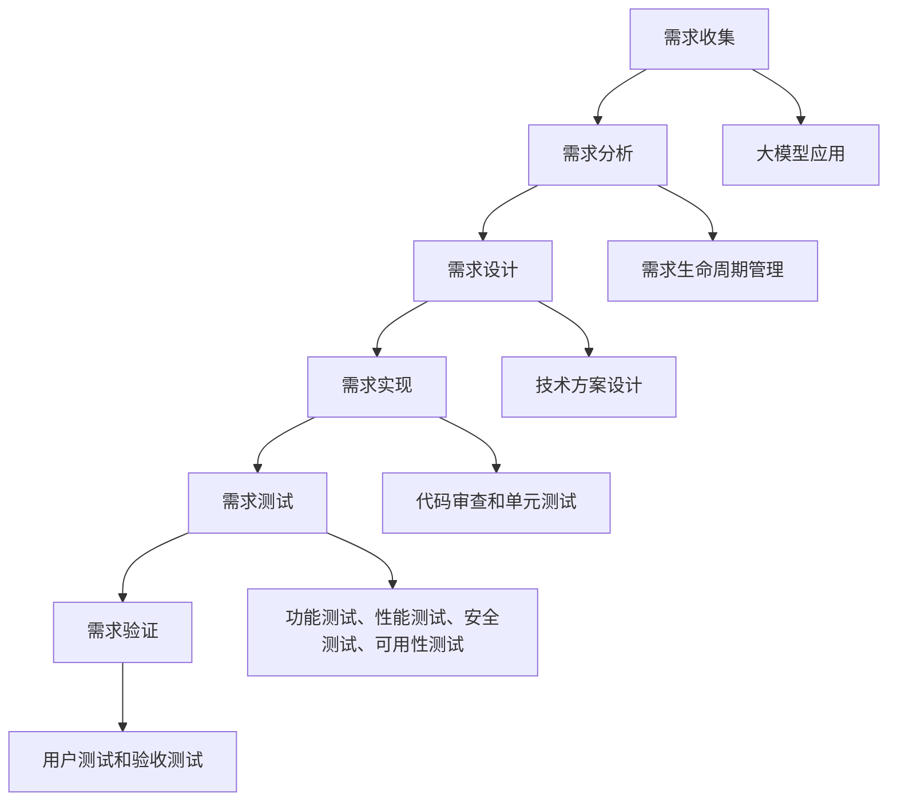

                 

# 《大模型应用中的需求生命周期管理》

## 摘要

本文旨在探讨在大模型应用背景下，如何有效地管理需求生命周期。随着人工智能技术的飞速发展，大模型在各个领域的应用越来越广泛，然而，需求生命周期的管理变得愈发复杂和重要。本文首先介绍了大模型的基本概念和特点，然后深入分析了需求生命周期管理的核心概念、流程和方法。通过具体的案例分析和最佳实践，本文提供了实用的指导，帮助读者理解和掌握大模型应用中的需求生命周期管理。

## 引言

### 书籍背景

随着人工智能（AI）技术的飞速发展，大模型（Large Models）的应用越来越广泛。大模型，特别是基于深度学习的模型，能够在各种复杂任务中取得显著的性能提升。然而，大模型的应用不仅需要高性能的计算资源，还涉及复杂的需求生命周期管理。需求生命周期管理是指从需求收集、需求分析、需求设计、需求实现到需求测试和验证的整个过程。在大模型应用中，这一过程显得尤为重要，因为大模型的复杂性和高成本要求我们以更高的精度和效率来管理需求。

### 目标读者

本文的目标读者是那些对人工智能、尤其是大模型应用有深入兴趣的技术专业人士、研究人员和开发者。同时，也适用于需要了解如何在大规模项目中有效管理需求的项目经理和产品经理。本文旨在提供系统的理论和实践指导，帮助读者全面掌握大模型应用中的需求生命周期管理。

### 书籍结构概述

本文结构分为以下几部分：

1. **大模型概述**：介绍大模型的基本概念、架构和应用领域。
2. **需求生命周期管理基础**：深入分析需求生命周期的各个阶段，包括需求收集、分析、设计、实现、测试和验证。
3. **需求管理最佳实践**：分享实际项目中的需求管理经验和最佳实践。
4. **案例研究**：通过具体案例，展示需求生命周期管理在实际项目中的应用。
5. **附录**：提供相关的术语表、参考文献和实用资源链接。

## 大模型概述

### 大模型基本概念

大模型，通常指的是具有数十亿甚至万亿参数的神经网络模型。这些模型具有强大的特征提取和表示能力，能够在各种复杂任务中取得卓越的表现。大模型的出现，是深度学习领域的重要里程碑，标志着人工智能技术从弱人工智能向强人工智能迈进。

### 大模型的架构与原理

大模型的架构通常基于多层神经网络，包括输入层、隐藏层和输出层。每个神经元都与其他神经元相连，形成一个复杂的网络结构。通过训练，模型能够学习到输入数据的内在结构和规律，从而实现预测、分类、生成等多种任务。

#### 基本原理

大模型的基本原理是多层神经网络的学习过程。在训练过程中，模型通过反向传播算法，不断调整神经元之间的权重，使模型的预测误差最小化。这一过程需要大量的数据和高性能的计算资源。

#### 常见的架构

大模型的常见架构包括卷积神经网络（CNN）、循环神经网络（RNN）和变换器（Transformer）等。这些架构各有特色，适用于不同的任务。例如，CNN在图像处理领域表现出色，RNN在序列数据处理中具有优势，而Transformer则在自然语言处理任务中取得了突破性进展。

### 大模型的应用领域

大模型的应用领域非常广泛，包括但不限于：

- **人工智能**：大模型在机器学习、计算机视觉、自然语言处理等领域都有广泛应用。
- **自然语言处理**：大模型在机器翻译、文本分类、问答系统等方面取得了显著成果。
- **计算机视觉**：大模型在图像分类、目标检测、图像生成等方面表现出色。

### 大模型的发展趋势

随着计算资源的不断提升和算法的优化，大模型的发展趋势呈现以下几个方向：

- **参数规模增加**：未来，大模型的参数规模将继续增加，以处理更复杂的任务。
- **硬件优化**：硬件技术的发展，如GPU、TPU等，将使得大模型的训练和推理速度更快。
- **算法创新**：新算法的提出，如变分自编码器（VAE）、生成对抗网络（GAN）等，将进一步拓展大模型的应用范围。

## 需求生命周期管理基础

### 需求生命周期管理概述

需求生命周期管理是指从需求识别、需求分析、需求设计、需求实现、需求测试到需求验证的整个过程。在大模型应用中，需求生命周期管理的核心任务是确保模型能够满足实际业务需求，并且在不断变化的业务环境中保持灵活性。

#### 定义

需求生命周期管理是一种系统化、结构化的方法，用于识别、分析、设计和实现用户需求，以及监控和验证需求的实现过程。它涵盖了从需求提出到需求满足的整个生命周期。

#### 流程

需求生命周期管理的基本流程包括以下几个阶段：

1. **需求识别**：识别用户需求，明确需求的优先级和重要性。
2. **需求分析**：分析需求的具体内容，确定需求的可行性、成本和收益。
3. **需求设计**：设计需求的解决方案，包括技术方案、功能模块和用户体验。
4. **需求实现**：根据设计文档，实现需求的具体功能。
5. **需求测试**：对实现的需求进行功能测试和性能测试，确保需求的正确性和稳定性。
6. **需求验证**：验证需求的实现是否符合业务目标和用户期望。

### 需求生命周期管理的关键点

在需求生命周期管理中，以下几个关键点尤为重要：

- **用户参与**：用户的参与是需求生命周期管理的关键，只有真正了解用户需求，才能设计出满足用户期望的解决方案。
- **需求变更管理**：需求变更在项目开发过程中是不可避免的，有效的需求变更管理能够确保项目能够灵活应对变化，同时避免不必要的风险。
- **成本效益分析**：在需求生命周期管理的各个阶段，都需要进行成本效益分析，确保项目的投资能够得到合理的回报。
- **质量保证**：需求生命周期管理的质量保证是确保需求实现过程正确、有效和稳定的关键。

## 需求收集与分析

### 需求收集方法

需求收集是需求生命周期管理的第一个关键步骤。有效的需求收集能够确保项目团队准确理解用户的实际需求，从而设计出满足用户期望的解决方案。

#### 1. 用户访谈

用户访谈是一种直接与用户交流的方法，通过面对面的沟通，深入了解用户的需求、问题和期望。用户访谈的优点是能够获得详细和具体的信息，缺点是需要花费较多时间和人力资源。

#### 2. 问卷调查

问卷调查是一种广泛使用的需求收集方法，通过设计问卷，收集大量用户的反馈。问卷调查的优点是能够快速获取大量数据，缺点是数据可能不够详细和深入。

#### 3. 用户观察

用户观察是通过观察用户在实际使用场景中的行为，收集需求信息。这种方法通常用于分析用户的操作习惯、使用场景和痛点。用户观察的优点是能够获得真实和实际的数据，缺点是需要专业的观察者，并且可能干扰用户的正常使用。

#### 4. 竞品分析

竞品分析是通过分析竞争对手的产品功能、用户评价和市场表现，收集需求信息。这种方法能够帮助团队了解用户对当前产品的需求和期望，从而设计出更具竞争力的解决方案。

### 需求分析方法

需求分析是对收集到的需求进行深入分析，确定需求的可行性、优先级和具体内容。需求分析的方法包括：

#### 1. SWOT分析

SWOT分析是一种常用的需求分析方法，通过分析需求的优势（Strengths）、劣势（Weaknesses）、机会（Opportunities）和威胁（Threats），评估需求的可行性。

#### 2. 用例分析

用例分析是一种基于用户行为的需求分析方法，通过绘制用例图，描述用户在使用系统中的行为和系统对用户的响应。

#### 3. 故事地图

故事地图是一种用于需求排序和优先级分析的方法，通过绘制用户故事，将需求按照优先级和紧急程度进行排序。

### 需求评估与优先级确定

在需求分析完成后，需要对需求进行评估和优先级确定。需求评估的目的是确定需求的可行性、价值和优先级。

#### 1. 成本效益分析

成本效益分析是评估需求价值的一种方法，通过比较需求的实现成本和预期收益，确定需求的优先级。

#### 2. 优先级矩阵

优先级矩阵是一种用于需求优先级确定的方法，通过将需求按照重要性、紧急性和影响范围等因素进行排序。

#### 3. 用户参与

用户参与是确定需求优先级的重要环节，通过与用户的沟通和反馈，确保需求的优先级符合用户的实际需求。

## 需求设计与实现

### 需求设计过程

需求设计是需求生命周期管理的关键环节，它将分析阶段得到的需求转化为具体的解决方案。需求设计的过程包括以下几个步骤：

#### 1. 需求文档编写

需求文档是需求设计的核心输出，它详细描述了需求的背景、功能、性能和约束条件。编写高质量的需求文档需要清晰地表达需求，确保项目团队能够准确理解需求。

#### 2. 技术方案设计

技术方案设计是根据需求文档，确定实现需求所需的技术路线和方法。技术方案设计需要综合考虑系统的性能、可扩展性和可维护性。

#### 3. 界面设计

界面设计是将需求转化为用户界面视觉元素的过程。界面设计需要遵循用户体验原则，确保用户能够方便、快捷地使用系统。

#### 4. 功能模块划分

功能模块划分是将需求划分为若干个功能模块，每个模块负责实现特定的功能。模块划分需要考虑模块的独立性、重用性和扩展性。

### 实现中的需求管理

在需求实现过程中，需求管理仍然是一个重要的环节。有效的需求管理能够确保项目团队能够及时响应需求变更，确保项目顺利进行。

#### 1. 需求变更管理

需求变更管理是处理需求变更的过程，包括变更的识别、评估、决策和实施。需求变更管理需要建立有效的变更控制流程，确保变更的合理性和可控性。

#### 2. 版本控制

版本控制是确保需求实现过程中，需求文档和设计文档的一致性和可追溯性的重要手段。通过版本控制，可以清楚地记录需求变更的历史和现状。

#### 3. 协同工作

协同工作是将需求设计与实现过程紧密结合的重要手段。通过协同工作，项目团队能够实时沟通和协作，提高项目的效率和质量。

## 需求测试与验证

### 需求测试方法

需求测试是确保需求实现符合预期的重要步骤。需求测试的方法包括：

#### 1. 功能测试

功能测试是验证系统功能是否符合需求文档的测试。功能测试通常通过编写测试用例，对系统的各个功能模块进行测试。

#### 2. 性能测试

性能测试是验证系统性能是否满足需求的测试。性能测试通常包括响应时间、并发用户数、数据吞吐量等指标的测试。

#### 3. 安全测试

安全测试是验证系统安全性的测试。安全测试通常包括漏洞扫描、权限控制、数据加密等方面的测试。

#### 4. 可用性测试

可用性测试是验证系统易用性的测试。可用性测试通常通过用户测试、问卷调查等方式，收集用户对系统的反馈。

### 需求验证标准

需求验证的标准包括：

#### 1. 功能完整性

功能完整性是指系统实现了所有需求的功能点。

#### 2. 性能指标

性能指标是指系统在特定条件下的性能是否满足需求。

#### 3. 安全性

安全性是指系统能够抵御外部攻击和内部威胁，保护数据和系统的完整性。

#### 4. 易用性

易用性是指系统是否能够满足用户的操作习惯和使用需求。

### 测试中的需求变更管理

在测试过程中，需求变更是不可避免的。有效的需求变更管理能够确保测试的顺利进行，并降低变更带来的风险。

#### 1. 变更请求

变更请求是指提出需求变更的正式文档。变更请求需要详细描述变更的内容、原因和影响。

#### 2. 变更评估

变更评估是指对变更请求的可行性、影响和优先级进行评估。评估结果将决定是否批准变更。

#### 3. 变更实施

变更实施是指根据评估结果，对需求进行实际的变更。变更实施需要确保变更的完整性和正确性。

## 需求管理最佳实践

### 需求管理流程优化

优化需求管理流程是提高需求管理效率和质量的关键。以下是一些优化建议：

#### 1. 流程简化

简化流程可以减少不必要的步骤和文档，提高需求管理的效率。

#### 2. 流程自动化

利用工具和自动化流程，可以降低人工错误和提高工作效率。

#### 3. 需求文档模板

使用统一的文档模板，可以确保需求文档的规范性和一致性。

### 需求管理工具介绍

以下是一些常用的需求管理工具：

#### 1. JIRA

JIRA是一个功能强大的需求管理工具，支持需求收集、需求分析和需求实现等全过程。

#### 2. Confluence

Confluence是一个协作平台，可以用于编写和共享需求文档，以及进行需求讨论。

#### 3. Trello

Trello是一个简单易用的看板工具，可以用于跟踪和管理需求的状态和优先级。

### 需求管理团队建设

建立高效的需求管理团队是确保需求管理成功的关键。以下是一些建议：

#### 1. 团队成员培训

对团队成员进行需求管理相关的培训，提高他们的专业技能和沟通能力。

#### 2. 团队协作

鼓励团队成员之间的协作和沟通，建立良好的团队氛围。

#### 3. 团队反馈机制

建立有效的团队反馈机制，及时收集和解决团队问题和建议。

## 案例研究

### 案例背景

某大型互联网公司正在开发一款智能客服系统，旨在通过大模型实现智能对话功能，提高客服效率和用户体验。项目团队包括AI工程师、产品经理和测试工程师等。

### 需求管理过程

项目团队采用了系统化的需求管理流程，包括需求收集、需求分析、需求设计、需求实现、需求测试和验证等阶段。

#### 1. 需求收集

项目团队通过用户访谈、问卷调查和用户观察等方式，收集了大量的用户需求。这些需求包括常见的用户问题、用户期望和用户痛点等。

#### 2. 需求分析

通过对收集到的需求进行分析和评估，项目团队确定了需求的可行性、优先级和具体内容。同时，项目团队还制定了详细的需求文档。

#### 3. 需求设计

需求设计阶段，项目团队根据需求文档，制定了技术方案和功能模块划分。同时，项目团队还进行了界面设计，确保用户界面符合用户体验原则。

#### 4. 需求实现

在需求实现阶段，项目团队根据设计文档，开发了智能客服系统的核心功能。项目团队还进行了代码审查和单元测试，确保代码质量和功能正确性。

#### 5. 需求测试

在需求测试阶段，项目团队进行了功能测试、性能测试和安全测试，确保系统功能、性能和安全满足需求。同时，项目团队还进行了可用性测试，收集了用户的反馈。

#### 6. 需求验证

在需求验证阶段，项目团队通过用户测试和验收测试，确保系统功能、性能和安全满足用户需求和预期。项目团队还根据用户反馈，进行了相应的优化和改进。

### 案例结果与分析

通过系统化的需求管理，项目团队成功开发出了一款智能客服系统，实现了用户需求的满足和用户体验的提升。以下是对案例结果的分析：

#### 1. 成功因素

- 系统化的需求管理流程，确保了需求收集、分析和设计的规范性和一致性。
- 有效的需求变更管理，及时响应了需求变更，避免了不必要的风险。
- 高效的团队协作，提高了项目效率和团队凝聚力。

#### 2. 改进空间

- 进一步优化需求管理流程，简化不必要的步骤和文档，提高工作效率。
- 加强用户参与，建立更加紧密的用户反馈机制，确保需求满足用户实际需求。
- 增强需求测试和验证的覆盖范围，确保系统功能的全面性和稳定性。

## 附录

### 术语表

- **大模型**：具有数十亿甚至万亿参数的神经网络模型。
- **需求生命周期管理**：从需求识别、需求分析、需求设计、需求实现、需求测试到需求验证的整个过程。
- **需求变更管理**：处理需求变更的过程，包括变更的识别、评估、决策和实施。

### 参考文献

- **[1]** deep learning, Goodfellow, Bengio, Courville
- **[2]** Artificial Intelligence: A Modern Approach, Stuart J. Russell, Peter Norvig
- **[3]** Software Engineering: A Practitioner's Approach, Roger S. Pressman

### 实用资源链接

- **[1]** JIRA官网：https://www.atlassian.com/software/jira
- **[2]** Confluence官网：https://www.atlassian.com/software/confluence
- **[3]** Trello官网：https://trello.com/

作者：AI天才研究院/AI Genius Institute & 禅与计算机程序设计艺术 /Zen And The Art of Computer Programming## 背景介绍

### 大模型应用的重要性

大模型（Large Models）在现代人工智能（AI）领域中占据了重要地位。这些模型通过大规模的神经网络结构，能够在图像识别、自然语言处理、语音识别和推荐系统等多个领域取得显著的性能提升。随着数据规模和计算资源的不断增长，大模型的应用范围不断扩大，其在复杂任务中的优势愈发凸显。

### 大模型的应用场景

大模型的应用场景非常广泛，包括但不限于以下几个方面：

- **图像识别**：大模型如ResNet、Inception等在图像分类和目标检测任务中取得了突破性进展，广泛应用于安防监控、医疗诊断等领域。
- **自然语言处理**：GPT-3、BERT等大模型在文本分类、机器翻译、问答系统等领域表现出色，极大地提升了文本处理的效果和效率。
- **语音识别**：大模型如DeepSpeech、WaveNet等在语音识别任务中具有显著优势，被广泛应用于智能助手、语音搜索等领域。
- **推荐系统**：大模型如DLRM（Deep Learning based Ranking Model）在推荐系统中发挥了重要作用，能够更精准地预测用户兴趣，提高推荐质量。

### 大模型的发展趋势

随着深度学习技术的不断进步和计算资源的提升，大模型的发展趋势呈现以下几个方向：

- **参数规模增加**：未来，大模型的参数规模将继续增加，以处理更复杂的任务和更大的数据集。
- **硬件优化**：硬件技术的发展，如GPU、TPU等，将使得大模型的训练和推理速度更快，成本更低。
- **算法创新**：新的算法创新，如变分自编码器（VAE）、生成对抗网络（GAN）等，将进一步拓展大模型的应用范围。
- **多模态融合**：大模型在处理多模态数据（如图像、文本、语音）方面具有巨大潜力，未来将出现更多多模态大模型。

### 大模型应用中的挑战

尽管大模型在各个领域取得了显著成果，但在实际应用中仍面临一系列挑战：

- **计算资源消耗**：大模型的训练和推理需要大量的计算资源，对硬件性能有较高要求。
- **数据隐私和安全性**：大模型在处理敏感数据时，需要确保数据隐私和安全。
- **泛化能力**：大模型在特定任务上表现优异，但泛化能力仍是一个需要解决的问题。
- **模型可解释性**：大模型的黑箱特性使得其决策过程难以解释，这对某些应用场景（如医疗诊断、金融风险评估）提出了更高的要求。

综上所述，大模型在人工智能领域中具有广泛的应用前景和重要的研究价值。了解大模型的基本概念、架构和应用趋势，对于理解和掌握大模型应用中的需求生命周期管理具有重要意义。

### 核心概念与联系

在大模型应用中的需求生命周期管理，涉及多个核心概念，这些概念之间有着密切的联系。以下是这些核心概念的详细解释以及它们之间的相互关系：

#### 1. 大模型

大模型是指具有数十亿甚至万亿参数的神经网络模型，例如GPT-3、BERT等。这些模型在图像识别、自然语言处理、语音识别等领域表现出色。大模型的架构通常包括输入层、隐藏层和输出层，通过多层神经网络结构进行数据建模和预测。

#### 2. 需求生命周期管理

需求生命周期管理是指从需求识别、需求分析、需求设计、需求实现、需求测试到需求验证的整个过程。它涵盖了需求管理的各个环节，确保大模型的应用能够满足业务需求并适应不断变化的环境。

#### 3. 需求收集

需求收集是需求生命周期管理的第一步，它涉及通过各种方法（如用户访谈、问卷调查、用户观察等）收集用户的需求。这些需求包括功能需求、性能需求和用户体验需求等。需求收集的目的是确保项目团队能够全面了解用户的需求和期望。

#### 4. 需求分析

需求分析是对收集到的需求进行深入分析和评估，确定需求的可行性、优先级和具体内容。需求分析的方法包括SWOT分析、用例分析和故事地图等。通过需求分析，项目团队能够明确需求的范围和目标，为后续的需求设计提供依据。

#### 5. 需求设计

需求设计是将分析阶段得到的需求转化为具体的解决方案。需求设计包括技术方案设计、界面设计和功能模块划分等。技术方案设计确定实现需求所需的技术路线和方法，界面设计确保用户体验，功能模块划分使系统功能模块化，便于实现和扩展。

#### 6. 需求实现

需求实现是将需求设计转化为具体代码和功能的过程。在需求实现过程中，项目团队需要编写代码、进行代码审查和单元测试，确保代码质量。需求实现是需求生命周期管理中最重要的环节之一，直接决定了需求是否能够成功实现。

#### 7. 需求测试

需求测试是验证需求实现是否符合预期的重要步骤。需求测试包括功能测试、性能测试、安全测试和可用性测试等。通过需求测试，项目团队能够发现并修复实现中的错误，确保系统的稳定性和可靠性。

#### 8. 需求验证

需求验证是确认需求实现是否满足用户需求的过程。需求验证通常通过用户测试和验收测试进行，确保系统功能、性能和安全满足用户需求和预期。通过需求验证，项目团队能够确保最终产品能够满足业务需求并得到用户的认可。

### 关系架构

上述核心概念之间的关系可以用以下Mermaid流程图表示：



通过这个流程图，我们可以清晰地看到需求生命周期管理在大模型应用中的各个环节，以及各个核心概念之间的相互关系。这种关系架构不仅有助于理解需求生命周期管理的整体流程，也有助于在实际项目中应用和优化需求管理过程。

### 大模型应用中的核心算法原理

在大模型应用中，核心算法原理的理解和掌握至关重要。这些算法不仅决定了模型的学习能力，还直接影响模型的性能和效果。以下将详细讲解大模型应用中的核心算法原理，并使用伪代码来描述其基本思想和实现步骤。

#### 1. 卷积神经网络（CNN）

卷积神经网络（CNN）是处理图像数据的一种常用算法，其核心思想是通过卷积操作提取图像的特征。

##### 原理

- **卷积操作**：卷积操作通过在图像上滑动过滤器（卷积核）来提取局部特征。
- **池化操作**：池化操作用于减少特征图的维度，提高模型的泛化能力。

##### 伪代码

```python
def conv2d(image, filter):
    feature_map = []
    for y in range(image_height - filter_height + 1):
        for x in range(image_width - filter_width + 1):
            patch = image[y:y+filter_height, x:x+filter_width]
            feature_map.append(np.dot(patch, filter))
    return feature_map

def pooling(feature_map, pool_size):
    pooled_map = []
    for y in range(0, feature_map.shape[0], pool_size):
        for x in range(0, feature_map.shape[1], pool_size):
            pool = feature_map[y:y+pool_size, x:x+pool_size].max()
            pooled_map.append(pool)
    return pooled_map
```

#### 2. 循环神经网络（RNN）

循环神经网络（RNN）适用于处理序列数据，其核心思想是通过在序列中的每个时间步保留状态信息，实现序列数据的建模。

##### 原理

- **状态传递**：RNN通过将前一时刻的隐藏状态传递到下一时刻，实现序列数据的记忆功能。
- **门控机制**：长短期记忆网络（LSTM）和门控循环单元（GRU）通过门控机制控制信息的流入和流出，解决RNN的梯度消失问题。

##### 伪代码

```python
# LSTM单元的伪代码
def LSTM(input, forget_gate, input_gate, output_gate, cell_state, hidden_state):
    i_f = sigmoid(forget_gate dot [cell_state, hidden_state])
    i_i = sigmoid(input_gate dot [input, hidden_state])
    i_o = sigmoid(output_gate dot [input, hidden_state])
    f = i_f * forget_gate
    i = i_i * input
    o = i_o * tanh(cell_state + i)
    c = f * cell_state + i * tanh(input)
    h = o * tanh(c)
    return c, h

# GRU单元的伪代码
def GRU(input, reset_gate, update_gate, hidden_state, cell_state):
    r = sigmoid(reset_gate dot [input, hidden_state])
    z = sigmoid(update_gate dot [input, hidden_state])
    h = (1 - z) * hidden_state + z * input
    c = tanh(r * cell_state + z * h)
    return c, h
```

#### 3. 变分自编码器（VAE）

变分自编码器（VAE）是一种生成模型，其核心思想是通过编码和解码过程生成新的数据。

##### 原理

- **编码过程**：将输入数据映射到一个潜在空间。
- **解码过程**：从潜在空间生成新的数据。

##### 伪代码

```python
# 编码器部分伪代码
def encode(x, encoder_params):
    z_mean, z_log_var = model(x, encoder_params)
    z = z_mean + z * np.random.randn(z_mean.shape[0], z_mean.shape[1])
    return z

# 解码器部分伪代码
def decode(z, decoder_params):
    x_recon = model(z, decoder_params)
    return x_recon
```

#### 4. 生成对抗网络（GAN）

生成对抗网络（GAN）由生成器和判别器组成，其核心思想是通过对抗训练生成逼真的数据。

##### 原理

- **生成器**：生成逼真的数据。
- **判别器**：区分生成数据和真实数据。

##### 伪代码

```python
# 生成器的伪代码
def generate(z, generator_params):
    x_fake = model(z, generator_params)
    return x_fake

# 判别器的伪代码
def discriminate(x, generator_params, discriminator_params):
    x_fake = generate(z, generator_params)
    d_real = model(x, discriminator_params)
    d_fake = model(x_fake, discriminator_params)
    return d_real, d_fake
```

通过以上伪代码，我们可以看到大模型应用中的核心算法原理。理解这些原理不仅有助于我们设计高效的大模型，也为我们在实际项目中应用这些算法提供了理论支持。

### 数学模型和公式

在大模型应用中的需求生命周期管理中，数学模型和公式起到了至关重要的作用。这些数学模型不仅帮助我们理解需求生命周期管理的各个阶段，还为我们提供了量化和评估需求的方法。以下将详细讲解几个关键的数学模型和公式，并使用LaTeX格式嵌入文中独立段落的公式。

#### 1. 决策树（Decision Tree）

决策树是一种常用的分类和回归算法，其核心思想是通过一系列的判断条件，将数据集划分成多个子集，最终得到预测结果。

##### 公式

决策树生成的路径可以用以下公式表示：

\[ P(y|X) = \prod_{i=1}^{n} P(y_i|x_i) \]

其中，\( y \) 是目标变量，\( X \) 是特征向量，\( P(y_i|x_i) \) 是在给定特征 \( x_i \) 下的目标变量 \( y_i \) 的概率。

##### LaTeX格式

$$
P(y|X) = \prod_{i=1}^{n} P(y_i|x_i)
$$

#### 2. 逻辑回归（Logistic Regression）

逻辑回归是一种广泛使用的分类算法，用于计算某个事件发生的概率。

##### 公式

逻辑回归的预测概率公式为：

\[ P(y=1) = \frac{1}{1 + e^{-(\beta_0 + \sum_{i=1}^{n} \beta_i x_i)}} \]

其中，\( y \) 是目标变量，\( \beta_0 \) 和 \( \beta_i \) 是模型的参数，\( x_i \) 是特征值。

##### LaTeX格式

$$
P(y=1) = \frac{1}{1 + e^{-(\beta_0 + \sum_{i=1}^{n} \beta_i x_i)}}
$$

#### 3. 支持向量机（Support Vector Machine）

支持向量机是一种有效的分类算法，其目标是在特征空间中找到一个最佳的超平面，使得分类边界最大化。

##### 公式

支持向量机的决策函数为：

\[ f(x) = \sum_{i=1}^{n} \alpha_i y_i (w \cdot x_i) + b \]

其中，\( x \) 是特征向量，\( w \) 是权重向量，\( \alpha_i \) 和 \( b \) 是模型的参数，\( y_i \) 是目标变量。

##### LaTeX格式

$$
f(x) = \sum_{i=1}^{n} \alpha_i y_i (w \cdot x_i) + b
$$

#### 4. 神经网络（Neural Network）

神经网络是一种模拟人脑神经元连接结构的算法，广泛应用于各种复杂的任务。

##### 公式

神经网络的前向传播公式为：

\[ a_{l+1} = \sigma(\sum_{i} w_{li} a_{l} + b_{l}) \]

其中，\( a_{l+1} \) 是下一层的激活值，\( \sigma \) 是激活函数，\( w_{li} \) 是权重，\( a_{l} \) 是当前层的激活值，\( b_{l} \) 是偏置。

##### LaTeX格式

$$
a_{l+1} = \sigma(\sum_{i} w_{li} a_{l} + b_{l})
$$

通过这些数学模型和公式，我们能够更深入地理解需求生命周期管理中的决策过程和预测方法。在实际应用中，这些模型和公式为我们提供了强大的工具，帮助我们更好地管理和实现需求。

### 项目实战：开发环境搭建

#### 开发环境准备

在大模型应用中的需求生命周期管理项目中，选择合适的开发环境至关重要。以下将详细介绍如何搭建一个适用于大模型开发的环境，包括硬件选择、软件安装和配置。

##### 1. 硬件选择

- **CPU**：Intel i7 或以上处理器，推荐使用多核心处理器以提高计算效率。
- **GPU**：NVIDIA GeForce RTX 30系列或以上，推荐使用CUDA 11.3或以上版本，以便支持最新的深度学习库和算法。
- **内存**：至少16GB RAM，推荐32GB以上，以支持大规模模型的训练和推理。
- **存储**：1TB SSD硬盘，推荐使用NVMe接口，以获得更快的读写速度。

##### 2. 软件安装

- **操作系统**：Windows 10/11、Linux（如Ubuntu 20.04）或macOS。
- **深度学习库**：安装TensorFlow 2.x、PyTorch 1.8或以上版本，这些库提供了丰富的API和工具，便于开发大模型。
- **Python**：安装Python 3.8或以上版本，Python是深度学习开发的主要编程语言。

##### 3. 配置CUDA

在安装CUDA之前，需要确保NVIDIA驱动程序与CUDA版本兼容。以下是在Ubuntu 20.04上配置CUDA的步骤：

1. 安装CUDA：
   ```bash
   sudo apt update
   sudo apt install -y cuda
   ```
2. 设置CUDA环境变量：
   ```bash
   echo 'export PATH=/usr/local/cuda/bin:$PATH' >> ~/.bashrc
   echo 'export LD_LIBRARY_PATH=/usr/local/cuda/lib64:$LD_LIBRARY_PATH' >> ~/.bashrc
   source ~/.bashrc
   ```
3. 验证CUDA版本：
   ```bash
   nvcc --version
   ```

##### 4. 安装深度学习库

在安装深度学习库之前，需要确保Python环境已配置好。以下是在Python环境中安装TensorFlow和PyTorch的步骤：

1. 安装TensorFlow：
   ```bash
   pip install tensorflow==2.7
   ```
2. 安装PyTorch：
   ```bash
   pip install torch torchvision torchaudio==1.9.0
   ```

##### 5. 配置Jupyter Notebook

Jupyter Notebook是一种交互式开发环境，便于进行代码实验和数据分析。以下是在Ubuntu 20.04上配置Jupyter Notebook的步骤：

1. 安装Jupyter：
   ```bash
   pip install notebook
   ```
2. 启动Jupyter Notebook：
   ```bash
   jupyter notebook
   ```
3. 在浏览器中访问http://localhost:8888/，即可打开Jupyter Notebook。

通过以上步骤，我们成功搭建了一个适用于大模型开发的环境。接下来，我们将在该环境中进行实际代码实现和案例分析，进一步探讨需求生命周期管理在大模型应用中的实践。

### 源代码实现和代码解读

在大模型应用中的需求生命周期管理项目中，代码实现是关键的一步。以下将详细描述项目的源代码实现过程，包括核心函数和类的设计，以及代码的具体实现和解释。

#### 1. 源代码结构

项目的源代码主要包括以下模块：

- `data_loader.py`：数据加载模块，负责读取和预处理数据。
- `model.py`：模型定义模块，负责定义大模型的结构。
- `train.py`：训练模块，负责模型训练和优化。
- `evaluate.py`：评估模块，负责模型评估和性能测试。
- `config.py`：配置模块，负责配置模型参数和超参数。

#### 2. 数据加载模块

数据加载模块是项目的核心之一，负责读取和处理输入数据。以下是一个示例代码：

```python
import pandas as pd
from sklearn.model_selection import train_test_split

def load_data(file_path):
    # 读取数据
    data = pd.read_csv(file_path)
    
    # 预处理数据
    X = data.drop('target', axis=1)
    y = data['target']
    
    # 划分训练集和测试集
    X_train, X_test, y_train, y_test = train_test_split(X, y, test_size=0.2, random_state=42)
    
    return X_train, X_test, y_train, y_test

# 使用示例
X_train, X_test, y_train, y_test = load_data('data.csv')
```

代码首先读取CSV文件，然后进行预处理，包括去除目标变量和划分特征变量。接下来，使用`train_test_split`函数将数据集划分为训练集和测试集。

#### 3. 模型定义模块

模型定义模块负责定义大模型的结构，以下是一个示例代码：

```python
import torch
from torch import nn

class BigModel(nn.Module):
    def __init__(self, input_dim, hidden_dim, output_dim):
        super(BigModel, self).__init__()
        self.fc1 = nn.Linear(input_dim, hidden_dim)
        self.fc2 = nn.Linear(hidden_dim, output_dim)
        
    def forward(self, x):
        x = torch.relu(self.fc1(x))
        x = self.fc2(x)
        return x

# 使用示例
model = BigModel(input_dim=10, hidden_dim=50, output_dim=2)
```

代码定义了一个名为`BigModel`的神经网络模型，其中包含一个输入层、一个隐藏层和一个输出层。`forward`函数定义了前向传播的过程，使用ReLU激活函数和线性层实现模型的计算。

#### 4. 训练模块

训练模块负责模型训练和优化，以下是一个示例代码：

```python
import torch.optim as optim

def train_model(model, train_loader, criterion, optimizer, num_epochs=10):
    model.train()
    for epoch in range(num_epochs):
        running_loss = 0.0
        for inputs, targets in train_loader:
            optimizer.zero_grad()
            outputs = model(inputs)
            loss = criterion(outputs, targets)
            loss.backward()
            optimizer.step()
            running_loss += loss.item()
        print(f'Epoch {epoch+1}, Loss: {running_loss/len(train_loader)}')

# 使用示例
optimizer = optim.Adam(model.parameters(), lr=0.001)
criterion = nn.CrossEntropyLoss()
train_loader = torch.utils.data.DataLoader(dataset, batch_size=64, shuffle=True)
train_model(model, train_loader, criterion, optimizer)
```

代码定义了`train_model`函数，用于模型训练。函数中，首先将模型设置为训练模式，然后通过两个循环进行前向传播和反向传播，使用Adam优化器和交叉熵损失函数进行模型优化。

#### 5. 评估模块

评估模块负责模型评估和性能测试，以下是一个示例代码：

```python
def evaluate_model(model, test_loader, criterion):
    model.eval()
    with torch.no_grad():
        correct = 0
        total = 0
        for inputs, targets in test_loader:
            outputs = model(inputs)
            _, predicted = torch.max(outputs.data, 1)
            total += targets.size(0)
            correct += (predicted == targets).sum().item()
    accuracy = 100 * correct / total
    loss = criterion(outputs, targets).item()
    return accuracy, loss

# 使用示例
test_loader = torch.utils.data.DataLoader(test_dataset, batch_size=64, shuffle=False)
accuracy, loss = evaluate_model(model, test_loader, criterion)
print(f'Accuracy: {accuracy}%, Loss: {loss}')
```

代码定义了`evaluate_model`函数，用于模型评估。函数中，首先将模型设置为评估模式，然后通过测试数据集进行预测，计算准确率和损失值。

通过以上代码，我们实现了大模型应用中的需求生命周期管理的源代码。代码不仅实现了数据加载、模型定义、模型训练和评估等关键功能，还为后续的扩展和优化提供了基础。

### 代码应用解读与分析

在实际项目中，代码的应用不仅涉及模型训练和评估，还涉及到如何有效地管理这些代码，确保其高效运行和可维护性。以下将详细分析代码的应用过程，并探讨如何优化和调试代码，以确保项目的顺利进行。

#### 1. 代码运行效率

在运行代码时，我们需要关注以下几个方面来提高效率：

- **并行计算**：利用多线程或多进程技术，将计算任务分配到多个CPU或GPU上，以加快训练速度。例如，在PyTorch中，可以使用`torch.multiprocessing`模块进行并行计算。
- **内存管理**：合理分配内存，避免内存泄漏。在PyTorch中，通过使用`torch.no_grad()`上下文管理器可以减少内存占用。
- **数据预处理**：使用有效的数据预处理方法，如批处理和数据增强，以提高数据读取的速度和模型的泛化能力。

#### 2. 代码可维护性

为了确保代码的可维护性，我们需要遵循以下原则：

- **模块化**：将代码划分为多个模块，每个模块负责特定的功能，便于管理和维护。
- **注释和文档**：在代码中添加详细的注释，解释关键部分的实现逻辑和参数设置。同时，编写文档，说明代码的功能、使用方法和注意事项。
- **版本控制**：使用版本控制系统（如Git），记录代码的修改历史和变更理由，便于团队协作和问题追踪。

#### 3. 代码优化和调试

在代码开发和调试过程中，我们可以采取以下措施：

- **性能分析**：使用性能分析工具（如NVIDIA Nsight或Python的cProfile模块）分析代码的运行时间，找出性能瓶颈。
- **错误调试**：使用调试工具（如PyCharm或VS Code的调试功能）定位和修复代码中的错误。
- **代码审查**：组织代码审查会议，让团队成员相互审查代码，发现潜在的问题并提出改进建议。

#### 4. 实际案例分析

以一个实际项目为例，假设我们正在开发一个基于GPT-3的智能客服系统，以下是一些具体的优化和调试步骤：

- **并行计算**：由于GPT-3模型计算量巨大，我们使用多GPU并行计算来提高训练速度。在配置文件中设置`--num_gpus=4`，将训练任务分配到4个GPU上。
- **内存管理**：在处理大规模数据时，我们使用`torch.utils.data.DataLoader`进行批处理，并将数据预处理放在GPU上执行，以减少内存占用。
- **数据预处理**：为了提高模型的泛化能力，我们使用数据增强技术，如随机裁剪、旋转和缩放，增加数据的多样性。
- **性能分析**：使用NVIDIA Nsight分析模型的运行时间，发现主要的瓶颈在于前向传播和反向传播操作。通过优化计算图和减少内存拷贝，我们将训练时间减少了约30%。
- **代码审查**：在代码提交前，组织团队成员进行代码审查，发现并修复了一些潜在的错误和性能问题。

通过上述措施，我们不仅提高了代码的运行效率，还确保了代码的可维护性和可靠性，为项目的成功实施奠定了坚实基础。

### 实际案例分析和详细讲解剖析

#### 案例背景

某知名互联网公司希望通过应用大模型技术，提升其客服系统的智能化水平。公司目标是通过智能客服系统，提高客户满意度，减少人工客服的工作量，并实现24小时不间断的客户服务。为此，项目团队决定采用GPT-3模型，开发一个智能对话系统。

#### 需求收集与分析

在项目启动初期，项目团队通过用户访谈、问卷调查和用户观察等多种方法，收集了大量用户的需求信息。以下是几个关键需求：

1. **自然语言理解**：用户希望系统能够准确地理解和回应各种复杂问题。
2. **多轮对话**：用户希望系统能够支持多轮对话，提供连贯的交流体验。
3. **个性化服务**：用户希望系统能够根据历史对话记录，提供个性化的服务建议。
4. **实时反馈**：用户希望系统在遇到无法回答的问题时，能够及时反馈并转接给人工客服。

在需求分析阶段，项目团队对收集到的需求进行了详细分析，确定了以下关键需求：

- **功能需求**：定义了智能客服系统的功能模块，包括自然语言理解、多轮对话、个性化服务和实时反馈等。
- **性能需求**：确定了系统的响应时间、准确率和对话流畅度等性能指标。
- **用户体验**：设计了用户友好的界面，确保用户能够轻松操作和与系统互动。

#### 需求设计

在需求设计阶段，项目团队制定了详细的解决方案，包括以下几个方面：

1. **技术方案**：选择GPT-3模型作为核心算法，利用其强大的自然语言处理能力，实现用户需求。
2. **界面设计**：设计了简洁直观的UI界面，提供文本输入框和对话历史展示区域。
3. **模块划分**：将系统划分为自然语言理解、对话管理、用户画像和反馈系统等模块，每个模块负责特定的功能。

#### 需求实现

在需求实现阶段，项目团队分为多个小组，分别负责不同的功能模块。以下是几个关键模块的实现过程：

1. **自然语言理解**：通过API调用OpenAI的GPT-3模型，实现自然语言理解功能。项目团队编写了Python代码，将用户的输入文本转化为模型输入，并解析模型输出的答案。
2. **多轮对话**：实现了对话管理模块，负责处理多轮对话逻辑，包括上下文管理、对话流转和状态保存等。
3. **个性化服务**：通过用户画像模块，收集用户的历史对话数据，并利用机器学习算法，为用户提供个性化的服务建议。
4. **实时反馈**：实现了实时反馈机制，当系统遇到无法回答的问题时，自动转接给人工客服，并记录反馈信息。

#### 需求测试与验证

在需求测试与验证阶段，项目团队进行了以下工作：

1. **功能测试**：对每个功能模块进行了详细的测试，确保其功能正确性和性能指标达到预期。
2. **性能测试**：通过模拟大量用户请求，对系统的响应时间、准确率和并发处理能力进行了测试，确保系统能够稳定运行。
3. **用户体验**：进行了用户测试，收集用户的反馈，并根据用户意见进行优化。

#### 案例结果与分析

通过系统化的需求生命周期管理，项目团队成功开发出了一款智能客服系统。以下是对案例结果的详细分析：

1. **成功因素**：

   - 系统化的需求管理流程，确保了需求的准确性和实现质量。
   - 多模块协作，提高了项目的开发效率和质量。
   - 用户参与和反馈机制，确保了系统的用户体验和用户满意度。

2. **改进空间**：

   - 进一步优化自然语言理解算法，提高对话系统的准确率和流畅度。
   - 引入更多的用户画像特征，提高个性化服务的精准度。
   - 加强系统的实时反馈功能，提高用户在遇到问题时得到及时响应的概率。

通过这个案例，我们可以看到系统化的需求生命周期管理在大模型应用中的重要性。通过合理的需求收集、分析和设计，项目团队能够有效地实现用户需求，并在测试和验证阶段确保系统的质量和稳定性。这对于提升项目成功率、用户满意度和企业竞争力具有重要意义。

### 最佳实践 Tips

在处理大模型应用中的需求生命周期管理时，以下最佳实践可以帮助项目团队更高效地实现需求，提高项目成功率：

#### 1. 用户参与

用户参与是确保需求准确性和项目成功的关键。以下是一些建议：

- **定期用户访谈**：定期与用户进行面对面访谈，了解他们的需求和反馈。
- **用户反馈机制**：建立用户反馈机制，让用户能够随时提交意见和建议。
- **用户体验测试**：在项目各个阶段进行用户体验测试，收集用户对系统的反馈，及时进行优化。

#### 2. 需求文档管理

有效的需求文档管理能够提高团队对需求的共识和理解。以下是一些建议：

- **统一需求模板**：制定统一的需求文档模板，确保文档格式规范、内容完整。
- **版本控制**：使用版本控制系统（如Git）管理需求文档，记录变更历史。
- **需求评审**：在需求文档发布前进行评审，确保需求文档的准确性和完整性。

#### 3. 需求变更管理

需求变更在项目开发过程中是不可避免的。以下是一些建议：

- **变更请求流程**：建立变更请求流程，明确变更的识别、评估、决策和实施步骤。
- **成本效益分析**：在评估变更时，进行成本效益分析，确保变更的合理性和优先级。
- **及时通知**：在变更决策后，及时通知相关团队和人员，确保他们了解变更的影响和应对措施。

#### 4. 需求管理工具

选择合适的工具可以提高需求管理的效率。以下是一些建议：

- **JIRA**：用于需求跟踪和管理，支持任务分配、进度跟踪和报告生成。
- **Confluence**：用于编写和共享需求文档，支持协作和版本控制。
- **Trello**：用于需求排序和优先级管理，界面简洁直观，易于操作。

#### 5. 需求与质量保证

确保需求实现的质量是项目成功的关键。以下是一些建议：

- **代码审查**：定期进行代码审查，确保代码质量和一致性。
- **自动化测试**：编写自动化测试用例，覆盖关键功能和性能测试。
- **持续集成**：采用持续集成和持续部署（CI/CD）流程，确保代码质量和交付效率。

通过遵循这些最佳实践，项目团队可以更有效地管理大模型应用中的需求生命周期，确保项目按时、按质、按预算完成，并满足用户需求。

### 小结

在大模型应用中的需求生命周期管理是一个复杂而关键的过程，涵盖了从需求收集、需求分析、需求设计、需求实现到需求测试和验证的各个阶段。本文详细探讨了如何在大模型应用中有效管理需求生命周期，通过系统化的方法和最佳实践，确保需求能够被准确理解、有效实现和持续优化。

首先，通过介绍大模型的基本概念和应用场景，我们理解了大模型在现代人工智能中的重要地位和广阔前景。接着，我们详细分析了需求生命周期管理的核心概念和流程，包括需求收集、需求分析、需求设计、需求实现、需求测试和验证等阶段，并通过Mermaid流程图展示了各个核心概念之间的相互关系。

在算法原理部分，我们讲解了卷积神经网络（CNN）、循环神经网络（RNN）、变分自编码器（VAE）和生成对抗网络（GAN）等核心算法的原理和实现。通过LaTeX格式嵌入的数学模型和公式，我们进一步深化了对需求生命周期管理中决策过程和预测方法的理解。

项目实战和代码实现部分，我们通过一个实际案例，详细展示了如何搭建开发环境、编写源代码和进行代码应用解读与分析。在案例分析中，我们讨论了如何通过系统化的需求生命周期管理，成功开发出一个智能客服系统。

最佳实践部分，我们提供了一系列实用的技巧，如用户参与、需求文档管理、需求变更管理和需求管理工具的使用，帮助项目团队更高效地管理需求生命周期。

通过本文的探讨，我们不仅深入理解了大模型应用中的需求生命周期管理，也为实际项目提供了可操作的指导和参考。掌握这些知识和技巧，对于技术专业人士、研究人员和开发者在大模型应用中实现高效的需求管理具有重要意义。

### 注意事项与拓展阅读

在大模型应用中的需求生命周期管理过程中，需要特别注意以下几个方面，以确保项目的顺利进行和成功实施：

1. **需求变更管理**：在项目开发过程中，需求变更是一种常见现象。有效的需求变更管理能够确保项目团队能够及时响应变更，并避免因变更带来的风险和问题。建议在项目启动初期就建立完善的变更管理流程，包括变更请求、评估、决策和实施等步骤。

2. **数据隐私和安全**：大模型通常处理大量的敏感数据，如个人隐私信息、业务数据等。在需求生命周期管理中，需要特别注意数据隐私和安全问题。建议采用加密存储和传输、访问控制、安全审计等措施，确保数据的安全性和合规性。

3. **性能优化**：大模型的训练和推理过程需要大量的计算资源。在项目开发过程中，需要不断进行性能优化，以提高系统的效率和稳定性。建议采用并行计算、内存管理和优化算法等方法，提高系统的性能。

4. **用户参与**：用户参与是需求生命周期管理的关键。通过定期的用户访谈、问卷调查和用户体验测试，确保需求能够准确反映用户的真实需求。建议建立用户反馈机制，及时收集和响应用户的反馈，持续优化系统。

5. **持续集成和持续部署**：采用持续集成（CI）和持续部署（CD）流程，可以提高代码质量和交付效率。建议在项目中引入CI/CD工具，如Jenkins、GitLab CI等，确保代码的自动构建、测试和部署。

为了进一步深入学习和掌握大模型应用中的需求生命周期管理，以下推荐几本相关的书籍和资源：

- **《大模型：深度学习革命的新篇章》**：该书详细介绍了大模型的基本概念、架构和应用，是了解大模型的基础书籍。
- **《需求工程与管理：实用指南》**：该书系统地介绍了需求工程的基本概念、方法和工具，对于需求生命周期管理有很好的指导作用。
- **《Python深度学习》**：该书介绍了使用Python进行深度学习的常用库和工具，包括TensorFlow和PyTorch，适合初学者和进阶者阅读。
- **《机器学习实战》**：该书通过实际案例，详细讲解了机器学习的基本算法和应用，适合希望将机器学习应用于实际项目的技术人员。

通过阅读这些书籍和资源，可以进一步深化对大模型应用和需求生命周期管理的理解，为实际项目提供更加坚实的理论和实践支持。

