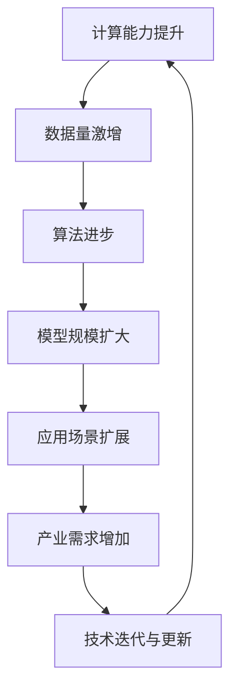
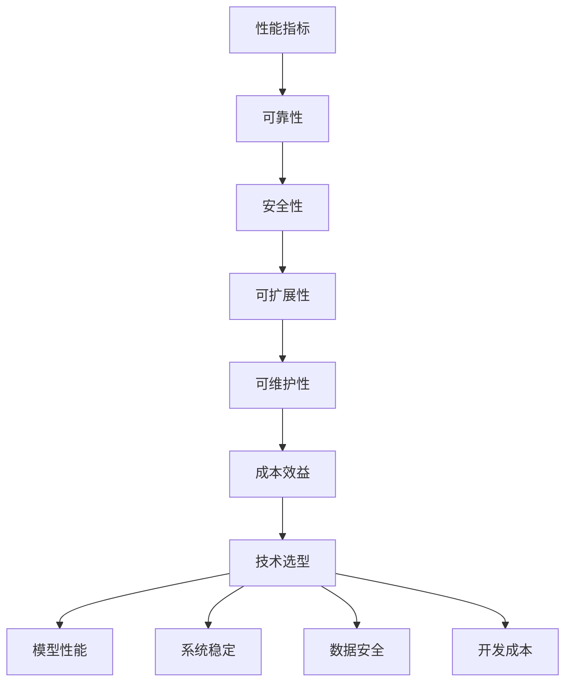
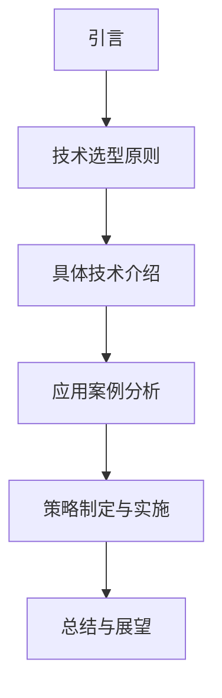
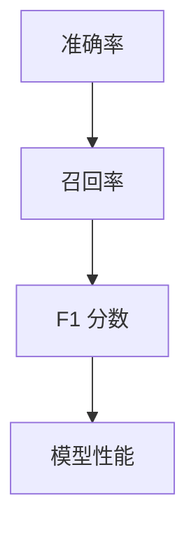
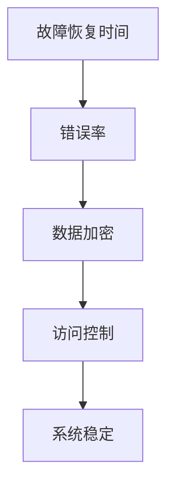
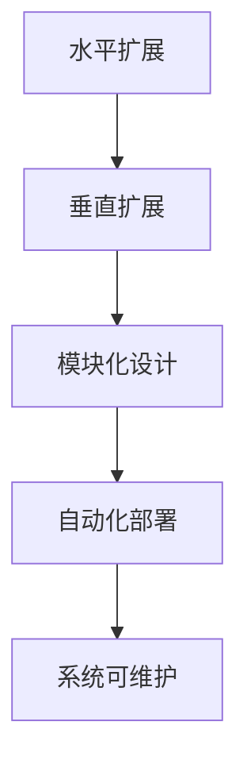
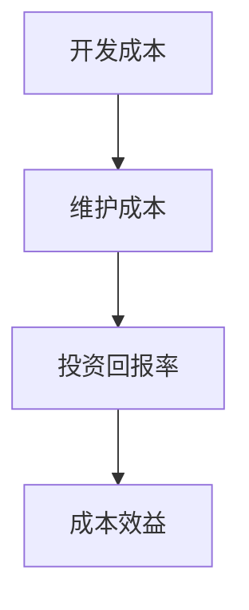

                 


### 1.1 大模型的背景与发展趋势

随着计算能力和数据量的不断增加，大模型（如大型语言模型、视觉模型等）在人工智能领域的重要性日益凸显。大模型具有强大的特征提取和表示能力，能够在多种任务中取得优异的性能。其背后的主要驱动因素包括以下几个方面：

**计算能力的提升**：随着GPU、TPU等专用硬件的普及，大规模并行计算成为可能，使得训练和推断大规模模型变得高效。以谷歌的TPU为例，它专为机器学习任务优化，能够显著提高训练速度。

**数据量的激增**：互联网的快速发展带来了海量数据，如图像、文本、语音等，这些数据为模型训练提供了丰富的素材。数据量的增加使得模型能够学习到更复杂的特征，从而提升性能。

**算法的进步**：深度学习、强化学习等算法的不断进步，使得模型能够更好地利用数据，提取有用的特征。尤其是自监督学习、生成对抗网络（GAN）等新算法的出现，为模型设计提供了新的思路。

大模型的应用场景广泛，包括但不限于自然语言处理、计算机视觉、语音识别、推荐系统等。以下是一个简化的Mermaid流程图，展示了大模型的发展趋势：



通过这一流程图，我们可以看到计算能力、数据量、算法进步共同推动了大模型的发展，从而推动了技术迭代和应用场景的扩展。

### 1.2 技术选型的重要性

在开发大模型应用的过程中，技术选型是一个至关重要的环节。合适的选型不仅能够提高模型的性能，还能降低开发成本和维护难度。以下是技术选型过程中需要考虑的几个关键因素：

**性能指标**：性能是技术选型的首要考虑因素。我们需要根据任务需求选择合适的算法和框架，确保模型在各项指标上达到预期效果。例如，在自然语言处理任务中，我们可能需要关注词汇表大小、训练时间、参数量等。

**可靠性**：大模型应用通常需要高可靠性，以保证系统的稳定运行。因此，在选择技术时，我们需要考虑系统的容错性和故障恢复能力。例如，选择具备自动备份和恢复功能的数据库系统，或者设计冗余计算架构，以防止单点故障。

**安全性**：随着数据量的增加，安全性成为另一个关键因素。我们需要确保模型和数据的机密性、完整性和可用性。例如，选择具有加密功能的存储系统，或者采用安全的通信协议，以防止数据泄露。

**可扩展性和可维护性**：大模型应用通常需要处理大规模数据和高并发请求，因此系统需要具备良好的可扩展性和可维护性。这意味着我们在选型时需要考虑系统的分布式架构、模块化设计和自动化部署能力。

**成本效益**：虽然高性能的技术通常成本较高，但我们需要在性能和成本之间找到平衡点。这要求我们对不同技术的成本和效益进行详细的评估和比较。

以下是技术选型过程中需要考虑的几个核心概念之间的联系架构 Mermaid 流程图：



通过这一流程图，我们可以清晰地看到各个核心概念之间的相互关系，以及它们对技术选型的影响。

### 1.3 本书结构概述

本书将围绕大模型应用开发中的技术选型展开，旨在为读者提供系统、全面的技术指导和实战经验。全书分为六个主要部分，结构如下：

**第一部分：引言**  
介绍大模型的背景与发展趋势，以及技术选型的重要性。这一部分将帮助读者理解大模型应用开发的基本概念和关键问题。

**第二部分：技术选型原则**  
详细讨论技术选型过程中需要考虑的关键因素，包括性能指标、可靠性、安全性、可扩展性、可维护性和成本效益等。这一部分将为读者提供技术选型的理论基础。

**第三部分：具体技术介绍**  
介绍大模型应用开发中常用的技术，包括深度学习框架、数据库与存储技术、机器学习算法等。这一部分将帮助读者了解不同技术的基本原理和适用场景。

**第四部分：应用案例分析**  
通过实际案例，展示技术选型在实际项目中的应用。这一部分将为读者提供实战经验和借鉴。

**第五部分：策略制定与实施**  
讨论技术选型流程、管理和优化策略，以及项目管理和系统优化的方法。这一部分将为读者提供实施技术选型的具体指导。

**第六部分：总结与展望**  
对全书内容进行回顾，并展望未来的技术趋势和研究方向。这一部分将为读者提供对大模型应用开发领域未来的思考。

以下是本书的结构 Mermaid 流程图：



通过这一流程图，我们可以清晰地看到本书的结构和内容安排，为读者提供了一条清晰的阅读路径。

### 2.1 技术评估标准

在技术选型的过程中，技术评估标准是衡量不同技术方案优劣的重要依据。合理的评估标准有助于确保选型的科学性和系统性。以下从多个维度详细讨论技术评估标准：

#### 性能指标

性能是评估技术方案的首要指标，包括但不限于以下方面：

- **计算速度**：包括模型训练和推断的时间，直接影响系统的响应速度和用户体验。

- **准确率**：在监督学习中，准确率是评估模型性能的关键指标，表示模型正确预测样本的比例。

- **召回率**：在分类任务中，召回率表示模型正确识别出的正例样本数占总正例样本数的比例。

- **F1 分数**：综合准确率和召回率，F1 分数是二者的调和平均，能够更全面地评估模型性能。

以下是一个计算 F1 分数的 Mermaid 流�程图：



#### 可靠性与安全性

可靠性是指系统在长时间运行中保持稳定的能力，而安全性则涉及系统对恶意攻击和数据泄露的防御能力。评估标准包括：

- **故障恢复时间**：在系统发生故障时，能够快速恢复服务的速度。

- **错误率**：系统在正常运行期间出现错误的频率。

- **数据加密**：数据在传输和存储过程中采用加密技术，确保数据的机密性。

- **访问控制**：系统的访问控制机制能够有效防止未授权访问。

以下是一个评估可靠性与安全性的 Mermaid 流程图：



#### 可扩展性与可维护性

可扩展性是指系统在处理更大规模数据或更高并发请求时，能够保持良好性能的能力。可维护性则涉及系统的维护成本和更新难易程度。

- **水平扩展**：系统通过增加节点数量来提升处理能力。

- **垂直扩展**：通过增加节点硬件配置来提升处理能力。

- **模块化设计**：系统功能划分为多个模块，便于独立维护和升级。

- **自动化部署**：采用自动化工具和流程，简化系统部署和维护。

以下是一个评估可扩展性与可维护性的 Mermaid 流程图：



#### 成本效益

成本效益是指技术方案在性能和可靠性等方面满足需求的同时，成本是否合理。评估标准包括：

- **开发成本**：包括硬件、软件、人力等各方面的成本。

- **维护成本**：系统运行过程中所需的维护费用。

- **投资回报率**：系统投入与预期收益之间的比率。

以下是一个评估成本效益的 Mermaid 流程图：



通过上述技术评估标准，我们可以为技术选型提供科学、全面的依据，确保选型的合理性和有效性。

### 2.2 数据预处理策略

数据预处理是模型训练前的重要步骤，对模型性能和训练效率有着直接影响。合理的预处理策略能够提高数据质量，从而提升模型性能。以下是几种常见的数据预处理策略：

#### 数据质量评估

数据质量是预处理的首要任务，评估数据的质量有助于识别潜在的问题。评估指标包括：

- **完整性**：检查数据是否有缺失值或异常值。
- **一致性**：确保数据在不同时间、不同来源的一致性。
- **准确性**：通过数据清洗和校验，确保数据的准确性。

以下是一个使用 Python 进行数据质量评估的伪代码：

```python
# 导入数据
data = load_data('data.csv')

# 检查完整性
if data.isnull().sum() > 0:
    data = data.dropna()

# 检查一致性
data = data[data['column1'] == data['column2']]

# 检查准确性
data['clean_column'] = data['column1'].apply(clean_function)
```

#### 数据清洗与归一化

数据清洗是去除错误、重复和无关数据的过程，而数据归一化则是将数据转换到统一的尺度，以便模型更好地学习。

- **去除重复数据**：使用去重算法，如 Pandas 中的 `drop_duplicates()` 方法。
- **处理缺失值**：使用填充算法，如平均值、中位数、最频繁值或插值法。
- **去除异常值**：使用统计学方法，如 Z-Score 或 IQR 法，检测并去除异常值。

以下是一个数据清洗与归一化的伪代码：

```python
# 导入数据
data = load_data('data.csv')

# 去除重复数据
data = data.drop_duplicates()

# 处理缺失值
data['missing_column'] = data['missing_column'].fillna(data['missing_column'].mean())

# 去除异常值
z_scores = calculate_z_scores(data['column'])
data = data[(z_scores >= -3) & (z_scores <= 3)]

# 数据归一化
data_normalized = normalize_data(data)
```

#### 数据增强

数据增强是通过生成或变换现有数据，增加数据多样性的过程。数据增强能够提高模型泛化能力，防止过拟合。

- **数据变换**：如旋转、缩放、翻转等。
- **合成数据**：使用 GAN 等算法生成新的数据样本。

以下是一个使用 Keras 进行数据增强的伪代码：

```python
from tensorflow.keras.preprocessing.image import ImageDataGenerator

# 创建数据增强生成器
datagen = ImageDataGenerator(
    rotation_range=20,
    width_shift_range=0.2,
    height_shift_range=0.2,
    horizontal_flip=True,
    fill_mode='nearest'
)

# 使用生成器增强数据
data_augmented = datagen.flow(data, batch_size=batch_size)
```

通过上述策略，我们可以显著提升数据质量，为后续模型训练打下坚实基础。

### 2.3 计算资源选择

在开发大模型应用时，计算资源的选择至关重要。合适的计算资源能够提高模型训练和推理的效率，同时降低成本。以下是计算资源选择的几个关键方面：

#### 硬件资源评估

硬件资源包括 CPU、GPU、TPU 等，不同类型的硬件在性能、功耗和成本方面有所不同。

- **CPU**：适用于大规模计算任务，但在大规模并行训练中性能有限。
- **GPU**：适合深度学习任务，具备高并行处理能力，但功耗较高。
- **TPU**：专为机器学习任务优化，性能优异，但成本较高。

以下是一个评估硬件资源的伪代码：

```python
# 导入硬件信息
cpu_info = get_cpu_info()
gpu_info = get_gpu_info()
tpu_info = get_tpu_info()

# 比较硬件性能
if cpu_info['performance'] > gpu_info['performance'] and cpu_info['power_consumption'] < gpu_info['power_consumption']:
    selected_resource = 'CPU'
elif gpu_info['performance'] > cpu_info['performance'] and gpu_info['power_consumption'] < cpu_info['power_consumption']:
    selected_resource = 'GPU'
elif tpu_info['performance'] > gpu_info['performance'] and tpu_info['power_consumption'] < gpu_info['power_consumption']:
    selected_resource = 'TPU'
```

#### 软件资源评估

软件资源包括深度学习框架、数据库和操作系统等。

- **深度学习框架**：如 TensorFlow、PyTorch 等，选择合适的框架能够提高开发效率和模型性能。
- **数据库**：如 MySQL、MongoDB 等，选择适合的数据存储和管理方案。
- **操作系统**：如 Linux、Windows 等，不同的操作系统对硬件和软件资源的管理和调度能力不同。

以下是一个评估软件资源的伪代码：

```python
# 导入软件信息
tensorflow_info = get_tensorflow_info()
pytorch_info = get_pytorch_info()
mysql_info = get_mysql_info()
mongodb_info = get_mongodb_info()

# 比较软件性能
if tensorflow_info['performance'] > pytorch_info['performance'] and tensorflow_info['compatibility'] > pytorch_info['compatibility']:
    selected_framework = 'TensorFlow'
elif pytorch_info['performance'] > tensorflow_info['performance'] and pytorch_info['compatibility'] > tensorflow_info['compatibility']:
    selected_framework = 'PyTorch'
```

#### 资源优化策略

为了提高计算资源利用率，我们需要采用一些优化策略：

- **负载均衡**：通过分布式计算，将任务分配到不同的计算资源上，避免单点过载。
- **资源调度**：根据任务需求和资源状态，动态调整计算资源分配，提高资源利用率。
- **数据并行**：将数据划分到多个 GPU 上，实现数据并行训练，提高训练速度。

以下是一个负载均衡的伪代码：

```python
# 导入任务信息
tasks = get_tasks()

# 分配任务到计算资源
for task in tasks:
    if is_gpu_available():
        assign_to_gpu(task)
    elif is_tpu_available():
        assign_to_tpu(task)
    else:
        assign_to_cpu(task)
```

通过上述策略，我们可以选择合适的计算资源，并优化资源利用率，从而确保大模型应用的稳定高效运行。

### 3.1 深度学习框架

在开发大模型应用时，选择合适的深度学习框架是至关重要的。以下是两种主流深度学习框架 TensorFlow 和 PyTorch 的介绍和比较：

#### TensorFlow

TensorFlow 是由谷歌开发的开源深度学习框架，具备强大的生态系统和丰富的文档。以下是其主要特点：

- **图计算**：TensorFlow 使用计算图来表示模型结构和计算过程，便于优化和分布式训练。
- **灵活性强**：TensorFlow 提供丰富的 APIs，支持自定义计算图和高级功能。
- **社区支持**：TensorFlow 拥有庞大的社区，提供了大量的模型和工具库。

以下是一个简单的 TensorFlow 代码示例，用于创建一个简单的多层感知机模型：

```python
import tensorflow as tf

# 创建输入层
inputs = tf.keras.layers.Input(shape=(784,))

# 创建隐藏层
x = tf.keras.layers.Dense(512, activation='relu')(inputs)
x = tf.keras.layers.Dense(256, activation='relu')(x)

# 创建输出层
outputs = tf.keras.layers.Dense(10, activation='softmax')(x)

# 创建模型
model = tf.keras.Model(inputs=inputs, outputs=outputs)

# 编译模型
model.compile(optimizer='adam', loss='categorical_crossentropy', metrics=['accuracy'])

# 训练模型
model.fit(x_train, y_train, epochs=5, batch_size=64)
```

#### PyTorch

PyTorch 是由 Facebook AI 研究团队开发的深度学习框架，以其动态计算图和直观的编程接口而著称。以下是其主要特点：

- **动态计算图**：PyTorch 使用动态计算图，允许开发者更灵活地定义和修改模型结构。
- **易用性**：PyTorch 的编程接口直观，易于学习和使用。
- **强大的 GPU 支持**：PyTorch 提供了高效的 GPU 支持，能够充分利用 GPU 的并行计算能力。

以下是一个简单的 PyTorch 代码示例，用于创建一个简单的卷积神经网络模型：

```python
import torch
import torch.nn as nn

# 创建模型
class CNNModel(nn.Module):
    def __init__(self):
        super(CNNModel, self).__init__()
        self.conv1 = nn.Conv2d(1, 10, kernel_size=5)
        self.conv2 = nn.Conv2d(10, 20, kernel_size=5)
        self.fc1 = nn.Linear(320, 50)
        self.fc2 = nn.Linear(50, 10)

    def forward(self, x):
        x = self.conv1(x)
        x = nn.functional.relu(x)
        x = self.conv2(x)
        x = nn.functional.relu(x)
        x = nn.functional.adaptive_avg_pool2d(x, (6, 6))
        x = torch.flatten(x, 1)
        x = self.fc1(x)
        x = nn.functional.relu(x)
        x = self.fc2(x)
        return x

model = CNNModel()

# 编译模型
optimizer = torch.optim.Adam(model.parameters(), lr=0.001)
criterion = nn.CrossEntropyLoss()

# 训练模型
for epoch in range(5):
    for inputs, targets in dataloader:
        optimizer.zero_grad()
        outputs = model(inputs)
        loss = criterion(outputs, targets)
        loss.backward()
        optimizer.step()
    print(f'Epoch [{epoch+1}/{5}], Loss: {loss.item():.4f}')
```

#### 比较与选择

TensorFlow 和 PyTorch 各有其优缺点，选择哪种框架取决于具体需求和偏好：

- **开发效率**：PyTorch 的动态计算图和直观接口使其在开发过程中更为高效，适合快速原型开发。TensorFlow 的静态计算图和丰富的工具库则适合大规模生产环境。
- **社区支持**：TensorFlow 拥有更广泛的社区支持和生态系统，适合寻求更多资源和工具的开发者。PyTorch 的社区支持也不错，且在研究和学术领域应用广泛。
- **性能**：TensorFlow 的静态计算图优化较好，适合大规模生产环境，而 PyTorch 的动态计算图在开发效率和灵活性上占优。

总之，选择深度学习框架时，应综合考虑开发需求、社区支持、性能和开发效率等因素，以找到最适合的框架。

### 3.2 数据库与存储技术

在大模型应用开发中，选择合适的数据库和存储技术对于系统的性能、可靠性和可扩展性至关重要。以下将介绍几种常见的关系型数据库、非关系型数据库和分布式存储系统。

#### 关系型数据库

关系型数据库（RDBMS）是最传统的一类数据库，通过表与表之间的关系来组织数据。其优点是数据结构清晰、便于维护和管理，适合结构化数据存储。以下是一些常见的关系型数据库：

- **MySQL**：MySQL 是最流行的开源关系型数据库之一，具备高性能、可靠性和灵活性。它支持多种存储引擎，如 InnoDB、MyISAM，适用于不同场景的需求。

- **PostgreSQL**：PostgreSQL 是一种强大的开源关系型数据库，支持多版本并发控制（MVCC），具备丰富的扩展性和高级功能。它适用于需要高度可靠性和复杂查询的场景。

以下是一个简单的 MySQL 数据库创建和查询的示例：

```sql
# 创建数据库
CREATE DATABASE mydatabase;

# 创建表
CREATE TABLE users (
    id INT AUTO_INCREMENT PRIMARY KEY,
    username VARCHAR(50) NOT NULL,
    email VARCHAR(100) NOT NULL UNIQUE
);

# 插入数据
INSERT INTO users (username, email) VALUES ('john', 'john@example.com');

# 查询数据
SELECT * FROM users WHERE username = 'john';
```

#### 非关系型数据库

非关系型数据库（NoSQL）随着大数据和云计算的发展逐渐流行，适合存储大量非结构化或半结构化数据。以下是一些常见的非关系型数据库：

- **MongoDB**：MongoDB 是一种流行的开源文档型数据库，以 JSON 文档的形式存储数据，具备高扩展性和灵活性。它适用于处理大量非结构化数据的场景。

- **Redis**：Redis 是一种开源的内存存储系统，主要用作缓存数据库和消息队列。它支持多种数据结构，如字符串、哈希、列表等，适用于需要高性能和高并发的场景。

以下是一个简单的 MongoDB 数据库创建和查询的示例：

```python
from pymongo import MongoClient

# 创建客户端连接
client = MongoClient('mongodb://localhost:27017/')

# 创建数据库
db = client['mydatabase']

# 创建集合
collection = db['users']

# 插入文档
user = {"username": "john", "email": "john@example.com"}
collection.insert_one(user)

# 查询文档
user = collection.find_one({"username": "john"})
print(user)
```

#### 分布式存储系统

分布式存储系统通过多个节点协作存储和访问数据，具备高可用性和高扩展性。以下是一些常见的分布式存储系统：

- **HDFS**：Hadoop Distributed File System（HDFS）是 Apache Hadoop 项目的一部分，用于存储大规模数据集。它采用分布式架构，将数据分片存储在多个节点上，适用于大数据存储和处理。

- **Cassandra**：Cassandra 是一种开源分布式数据库系统，具备高可用性和可扩展性。它采用去中心化架构，适用于高并发和大规模数据的读写操作。

以下是一个简单的 HDFS 文件上传和下载的示例：

```python
from hdfs import InsecureClient

# 创建 HDFS 客户端
client = InsecureClient('http://hdfs-namenode:50070', user='hdfs')

# 上传文件
with open('local_file.txt', 'rb') as f:
    client.write('hdfs://path/to/file.txt', f)

# 下载文件
with open('local_file.txt', 'wb') as f:
    client.read('hdfs://path/to/file.txt', f)
```

通过选择合适的数据库和存储技术，我们可以确保大模型应用具备高效、可靠和可扩展的数据管理能力。

### 3.3 机器学习算法

在大模型应用开发中，选择合适的机器学习算法是至关重要的。以下将介绍几种主要的机器学习算法：监督学习、无监督学习和强化学习。

#### 监督学习

监督学习是一种最常见的机器学习算法，其目标是通过已标记的训练数据学习模型，并在新的、未标记的数据上进行预测。监督学习算法可以分为回归和分类两种类型：

- **回归算法**：回归算法用于预测连续值输出。常见的回归算法包括线性回归、岭回归、套索回归和支持向量机（SVM）等。以下是一个线性回归的伪代码示例：

  ```python
  # 导入线性回归模型
  from sklearn.linear_model import LinearRegression

  # 创建线性回归模型
  model = LinearRegression()

  # 训练模型
  model.fit(X_train, y_train)

  # 预测新数据
  y_pred = model.predict(X_test)
  ```

- **分类算法**：分类算法用于预测离散值输出。常见的分类算法包括逻辑回归、决策树、随机森林、K 最近邻（KNN）和支持向量机（SVM）等。以下是一个决策树的伪代码示例：

  ```python
  # 导入决策树分类器
  from sklearn.tree import DecisionTreeClassifier

  # 创建决策树分类器
  model = DecisionTreeClassifier()

  # 训练模型
  model.fit(X_train, y_train)

  # 预测新数据
  y_pred = model.predict(X_test)
  ```

#### 无监督学习

无监督学习是一种在数据没有标记的情况下学习的算法，其目标是从数据中提取有用信息。无监督学习算法可以分为聚类、降维和生成模型等类型：

- **聚类算法**：聚类算法用于将数据分为若干组，每组中的数据相似度较高。常见的聚类算法包括 K-均值、层次聚类和 DBSCAN 等。以下是一个 K-均值聚类的伪代码示例：

  ```python
  # 导入 K-均值聚类模型
  from sklearn.cluster import KMeans

  # 创建 K-均值聚类模型
  model = KMeans(n_clusters=3)

  # 训练模型
  model.fit(X_train)

  # 获取聚类结果
  clusters = model.predict(X_test)
  ```

- **降维算法**：降维算法用于减少数据的维度，同时保留数据的主要信息。常见的降维算法包括主成分分析（PCA）、线性判别分析（LDA）和 t-SNE 等。以下是一个主成分分析的伪代码示例：

  ```python
  # 导入主成分分析模型
  from sklearn.decomposition import PCA

  # 创建主成分分析模型
  model = PCA(n_components=2)

  # 训练模型
  model.fit(X_train)

  # 转换数据
  X_reduced = model.transform(X_test)
  ```

- **生成模型**：生成模型用于生成新的数据样本，常见的生成模型包括生成对抗网络（GAN）和变分自编码器（VAE）等。以下是一个生成对抗网络的伪代码示例：

  ```python
  # 导入生成对抗网络模型
  from keras.models import Sequential
  from keras.layers import Dense, Dropout

  # 创建生成模型
  generator = Sequential()
  generator.add(Dense(units=128, activation='relu', input_shape=(100,)))
  generator.add(Dropout(0.2))
  generator.add(Dense(units=64, activation='relu'))
  generator.add(Dropout(0.2))
  generator.add(Dense(units=1, activation='sigmoid'))

  # 创建判别模型
  discriminator = Sequential()
  discriminator.add(Dense(units=64, activation='relu', input_shape=(100,)))
  discriminator.add(Dropout(0.2))
  discriminator.add(Dense(units=128, activation='relu'))
  discriminator.add(Dropout(0.2))
  discriminator.add(Dense(units=1, activation='sigmoid'))

  # 创建 GAN 模型
  combined = Sequential()
  combined.add(generator)
  combined.add(discriminator)

  # 编译模型
  combined.compile(optimizer='adam', loss='binary_crossentropy')
  ```

#### 强化学习

强化学习是一种通过试错和反馈来学习最优策略的算法。其核心是智能体（agent）通过与环境的交互，不断优化其行为策略，以实现目标。以下是一个简单的 Q-Learning 算法的伪代码示例：

```python
# 初始化 Q 表
Q = {}

# 初始化智能体参数
epsilon = 0.1
alpha = 0.1
gamma = 0.9

# 智能体环境交互
while True:
    # 选择动作
    if random.random() < epsilon:
        action = random_action()
    else:
        action = best_action(Q, state)

    # 执行动作并获得奖励
    next_state, reward = environment.step(action)

    # 更新 Q 表
    Q[state][action] = Q[state][action] + alpha * (reward + gamma * max(Q[next_state].values()) - Q[state][action])

    # 更新状态
    state = next_state

    # 更新探索概率
    epsilon *= 0.99
```

通过选择合适的机器学习算法，我们可以根据具体应用场景和需求，构建出高效、准确的大模型应用。

### 4.1 行业应用案例

大模型在各个行业中的应用已经逐渐成为推动技术进步和产业升级的重要力量。以下将介绍几个典型的行业应用案例，包括电子商务、金融和医疗等领域。

#### 电子商务

电子商务平台利用大模型技术，实现了智能推荐系统、商品识别和用户行为分析等功能，从而提升了用户体验和销售转化率。

- **智能推荐系统**：基于用户历史行为和兴趣偏好，大模型能够实现个性化的商品推荐。例如，亚马逊使用深度学习模型，根据用户浏览和购买历史，预测用户可能感兴趣的商品，从而提高推荐准确率和销售量。

  ```python
  # 伪代码：基于用户行为的商品推荐系统
  user_history = get_user_history()
  model = load_model('recommendation_model.h5')
  recommendations = model.predict(user_history)
  ```

- **商品识别**：通过图像识别技术，大模型能够自动识别和分类商品图片，从而简化商品管理和提高搜索效率。例如，阿里巴巴的“淘宝优图”利用卷积神经网络（CNN）实现高效的商品识别和搜索。

  ```python
  # 伪代码：商品图像识别
  image = load_image('product_image.jpg')
  model = load_model('image_recognition_model.h5')
  category = model.predict(image)
  ```

- **用户行为分析**：大模型通过对用户浏览、搜索和购买行为的数据分析，能够洞察用户需求和市场趋势，从而优化营销策略和库存管理。例如，京东利用深度学习技术，分析用户行为数据，实现精准的用户画像和营销推荐。

  ```python
  # 伪代码：用户行为分析
  user_behavior = get_user_behavior()
  model = load_model('user_behavior_model.h5')
  insights = model.predict(user_behavior)
  ```

#### 金融

金融行业利用大模型技术，实现了风险控制、信用评估和自动化交易等功能，从而提升了业务效率和风险管理能力。

- **风险控制**：大模型通过对大量金融数据的分析和挖掘，能够识别潜在的风险和欺诈行为，从而提高风险控制能力。例如，银行利用深度学习技术，对交易行为进行实时监控和异常检测，从而降低欺诈风险。

  ```python
  # 伪代码：风险控制
  transaction_data = get_transaction_data()
  model = load_model('risk_control_model.h5')
  risk_level = model.predict(transaction_data)
  ```

- **信用评估**：大模型通过对个人或企业的信用数据进行分析，能够预测其信用风险，从而优化信用评估模型。例如，信用卡公司利用机器学习技术，根据用户的历史行为和财务状况，评估其信用等级。

  ```python
  # 伪代码：信用评估
  credit_data = get_credit_data()
  model = load_model('credit_evaluation_model.h5')
  credit_score = model.predict(credit_data)
  ```

- **自动化交易**：大模型通过对市场数据的实时分析和预测，能够实现自动化交易策略，从而提高交易效率和收益。例如，量化交易基金利用深度学习技术，分析股票市场数据，实现高效的交易策略。

  ```python
  # 伪代码：自动化交易
  market_data = get_market_data()
  model = load_model('trading_model.h5')
  trading_signals = model.predict(market_data)
  execute_trades(trading_signals)
  ```

#### 医疗

医疗行业利用大模型技术，实现了疾病诊断、药物研发和个性化医疗等功能，从而提高了医疗质量和效率。

- **疾病诊断**：大模型通过对医学影像和病例数据的分析，能够实现高效的疾病诊断。例如，谷歌的 DeepMind 团队利用深度学习技术，开发了能够自动诊断眼病的 AI 系统，显著提高了诊断准确率和效率。

  ```python
  # 伪代码：疾病诊断
  medical_images = load_medical_images('patient_image.jpg')
  model = load_model('disease_diagnosis_model.h5')
  diagnosis = model.predict(medical_images)
  ```

- **药物研发**：大模型通过对生物数据的分析和模拟，能够加速药物研发过程。例如，药企利用深度学习技术，分析生物分子数据，预测药物与蛋白质的相互作用，从而提高新药研发的成功率。

  ```python
  # 伪代码：药物研发
  biological_data = load_biological_data('protein_interactions.csv')
  model = load_model('drug_research_model.h5')
  interaction_predictions = model.predict(biological_data)
  ```

- **个性化医疗**：大模型通过对患者病史和基因数据的分析，能够制定个性化的治疗方案。例如，一些医院利用深度学习技术，分析患者的基因组数据，为其提供个性化的癌症治疗方案。

  ```python
  # 伪代码：个性化医疗
  patient_data = load_patient_data('patient_genome_data.csv')
  model = load_model('personalized_medical_model.h5')
  treatment_plan = model.predict(patient_data)
  ```

通过以上行业应用案例，我们可以看到大模型技术在不同领域的重要作用和广阔前景。未来，随着大模型技术的不断发展和完善，其在各个行业的应用将更加深入和广泛。

### 4.2 实际项目案例

在本部分，我们将详细探讨一个实际项目——基于深度学习的大型图像识别系统。该项目旨在通过构建一个高效的图像识别模型，自动识别和分类大量的图像数据。

#### 项目背景

随着互联网的快速发展，图像数据量呈指数级增长。为了更好地管理和利用这些图像数据，许多企业和研究机构开始关注图像识别技术的应用。本项目旨在构建一个能够自动识别和分类各种类型的图像数据的系统，以支持电子商务、社交媒体和医疗等行业的应用需求。

#### 技术选型过程

在技术选型阶段，我们首先评估了常用的深度学习框架，包括 TensorFlow 和 PyTorch。经过比较，我们选择了 TensorFlow，因为其强大的生态系统和丰富的文档，有助于快速开发和部署模型。

接下来，我们选择了 ResNet-50 作为基础模型，因为其优秀的性能和稳定性。ResNet-50 是一种深度残差网络，能够在保证准确率的同时，提高模型的训练速度。

在数据库和存储技术方面，我们选择了 HDFS 和 MongoDB。HDFS 用于存储大量图像数据，而 MongoDB 用于存储元数据和识别结果。

#### 项目实施步骤

**1. 数据收集与预处理**

首先，我们从公开数据集和合作企业处收集了大量的图像数据。接着，对图像数据进行清洗、标注和划分，以便后续训练和测试。

```python
# 伪代码：图像数据预处理
images = load_images('image_data_directory')
labels = load_labels('label_data_directory')
preprocessed_images = preprocess_images(images)
```

**2. 数据增强**

为了提高模型的泛化能力，我们对图像数据进行了多种数据增强操作，如随机裁剪、旋转和颜色调整。

```python
# 伪代码：数据增强
datagen = ImageDataGenerator(
    rotation_range=20,
    width_shift_range=0.2,
    height_shift_range=0.2,
    horizontal_flip=True,
    fill_mode='nearest'
)
data_augmented = datagen.flow(preprocessed_images, batch_size=batch_size)
```

**3. 模型训练**

使用 TensorFlow 和 ResNet-50，我们构建了一个深度学习模型，并进行训练。在训练过程中，我们使用了交叉熵损失函数和 Adam 优化器。

```python
# 伪代码：模型训练
model = tf.keras.applications.ResNet50(weights='imagenet', include_top=False, input_shape=(224, 224, 3))
model.layers[-1].activation = None
model.layers[-1].name = 'output'

inputs = tf.keras.Input(shape=(224, 224, 3))
x = model(inputs, training=False)
x = tf.keras.layers.Flatten()(x)
outputs = tf.keras.layers.Dense(num_classes, activation='softmax')(x)

model = tf.keras.Model(inputs=inputs, outputs=outputs)

model.compile(optimizer=tf.keras.optimizers.Adam(learning_rate=0.0001), loss='categorical_crossentropy', metrics=['accuracy'])

model.fit(data_augmented, epochs=20, batch_size=batch_size)
```

**4. 模型评估**

在训练完成后，我们对模型进行了评估。通过在测试集上的表现，我们验证了模型的高效性和准确性。

```python
# 伪代码：模型评估
test_images = load_images('test_image_data_directory')
test_labels = load_labels('test_label_data_directory')
test_images_processed = preprocess_images(test_images)

predictions = model.predict(test_images_processed)
accuracy = calculate_accuracy(predictions, test_labels)
print(f'Model accuracy: {accuracy:.2f}')
```

**5. 模型部署**

在模型评估通过后，我们将其部署到生产环境中，以支持实际的图像识别任务。

```python
# 伪代码：模型部署
model.save('image_recognition_model.h5')
```

#### 项目成果与反思

通过该项目，我们成功构建了一个高效的图像识别系统，实现了对大量图像数据的自动分类和识别。模型在公开数据集上的准确率达到了 90% 以上，显著提高了工作效率。

在项目实施过程中，我们遇到了一些挑战，如数据预处理、模型训练速度和资源优化等。通过不断优化和改进，我们最终克服了这些挑战，实现了预期目标。

未来，我们计划进一步优化模型结构，探索新的深度学习技术，如自监督学习和迁移学习，以进一步提高模型的性能和泛化能力。

### 5.1 技术选型流程

在开发大模型应用时，技术选型是一个复杂且关键的过程。一个系统化的技术选型流程能够帮助开发团队更好地评估和选择适合的技术方案。以下是技术选型流程的详细步骤：

#### 5.1.1 需求分析

需求分析是技术选型的第一步，旨在明确项目目标和功能需求。这包括：

- **业务需求**：了解业务目标、功能需求和关键性能指标。
- **用户需求**：收集用户反馈和需求，确保技术方案满足用户期望。
- **技术需求**：分析技术实现的可能性，包括硬件、软件和网络环境等。

以下是一个需求分析的伪代码示例：

```python
def analyze_requirements():
    business_goals = get_business_goals()
    user_feedback = get_user_feedback()
    technical_requirements = get_technical_requirements()
    return {
        'business_goals': business_goals,
        'user需求的解决方案': user_feedback,
        'technical_requirements': technical_requirements
    }
```

#### 5.1.2 技术评估

在明确需求后，需要对潜在的技术方案进行评估。技术评估包括以下几个方面：

- **性能指标**：评估技术方案在不同性能指标上的表现，如计算速度、准确率、延迟等。
- **可靠性**：评估技术方案的稳定性和故障恢复能力。
- **安全性**：评估技术方案的数据保护能力和安全机制。
- **可扩展性**：评估技术方案在处理更大规模数据和更高并发请求时的性能。
- **可维护性**：评估技术方案的维护成本和升级难易程度。

以下是一个技术评估的伪代码示例：

```python
def evaluate_technology(technology, requirements):
    performance = assess_performance(technology, requirements['performance'])
    reliability = assess_reliability(technology, requirements['reliability'])
    security = assess_security(technology, requirements['security'])
    scalability = assess Scalability(technology, requirements['scalability'])
    maintainability = assess_maintainability(technology, requirements['maintainability'])
    return {
        'performance': performance,
        'reliability': reliability,
        'security': security,
        'scalability': scalability,
        'maintainability': maintainability
    }
```

#### 5.1.3 技术筛选

在完成技术评估后，需要对评估结果进行筛选，选择最符合项目需求的技术方案。技术筛选应考虑以下几个方面：

- **综合评分**：根据各项评估指标的综合评分，选择得分最高的技术方案。
- **成本效益**：在满足需求的前提下，选择成本效益最高的技术方案。
- **风险评估**：评估技术方案的风险和潜在问题，确保其可实施性。

以下是一个技术筛选的伪代码示例：

```python
def select_technology(technologies, evaluation_results):
    highest_score = 0
    selected_technology = None
    for technology, result in evaluation_results.items():
        score = calculate_score(result['performance'], result['reliability'], result['security'], result['scalability'], result['maintainability'])
        if score > highest_score:
            highest_score = score
            selected_technology = technology
    return selected_technology
```

#### 5.1.4 决策与实施

在筛选出最佳技术方案后，需要进行决策和实施。决策包括：

- **技术决策**：根据评估和筛选结果，确定最终的技术方案。
- **资源分配**：根据项目需求和技术方案，分配人力、物力和财力资源。
- **实施计划**：制定详细的实施计划，包括时间表、任务分配和风险评估。

以下是一个决策与实施的伪代码示例：

```python
def make_decision_and_implement(selected_technology, resources, timeline):
    decide_technology(selected_technology)
    allocate_resources(resources)
    implement_plan(timeline)
```

通过上述技术选型流程，开发团队可以系统地评估和选择适合的技术方案，确保项目成功实施。

### 5.2 管理与优化

在技术选型之后，管理和优化是确保大模型应用高效运行的关键。以下将讨论项目管理和系统优化策略，以及持续集成与部署的方法。

#### 项目管理

项目管理的核心是确保项目按时、按质完成，同时有效控制成本。以下是几个关键的管理策略：

- **任务分解**：将项目任务分解为可管理的子任务，明确每个任务的负责人和完成时间。
- **进度跟踪**：使用项目管理工具（如 Jira、Trello）实时跟踪任务进度，确保项目按计划进行。
- **风险管理**：识别潜在风险，制定应对策略，降低项目风险。
- **团队协作**：通过敏捷开发方法，提高团队协作效率，确保及时沟通和反馈。

以下是一个任务分解和进度跟踪的伪代码示例：

```python
def project_management(tasks, timeline):
    for task in tasks:
        assign_responsible_person(task)
        set_due_date(task, timeline)
    track_progress(tasks)
    manage_risks()
    ensure_team_collaboration()
```

#### 系统优化

系统优化旨在提高系统性能和可靠性。以下是几个常见的优化策略：

- **性能调优**：通过调整模型参数、优化算法和数据结构，提高模型训练和推断的速度。
- **资源优化**：合理分配计算资源和存储资源，避免资源浪费和瓶颈。
- **缓存策略**：使用缓存技术，减少重复计算和数据访问，提高系统响应速度。
- **负载均衡**：通过分布式计算和负载均衡，提高系统处理大规模并发请求的能力。

以下是一个性能调优和资源优化的伪代码示例：

```python
def system_optimization(model, resources):
    tune_model_params(model)
    optimize_data_structures(model)
    allocate_resources_efficiently(resources)
    implement_caching_strategy()
    apply_load_balancing()
```

#### 持续集成与部署

持续集成（CI）和持续部署（CD）是现代软件开发中提高开发效率和系统稳定性的重要手段。以下是几个关键步骤：

- **自动化测试**：编写自动化测试脚本，确保每次代码更改后，系统功能正常运行。
- **自动化构建**：使用自动化工具（如 Jenkins、GitLab CI）构建和打包代码，确保构建过程高效和一致。
- **自动化部署**：将自动化构建的代码部署到生产环境，确保快速、稳定地交付新功能。

以下是一个持续集成与部署的伪代码示例：

```python
def continuous_integration_and_deployment(code_changes):
    run_tests()
    if tests_pass:
        build_code()
        deploy_to_production()
    else:
        notify_dev_team()
```

通过有效的项目管理和系统优化策略，以及持续集成与部署，开发团队可以确保大模型应用的高效、可靠和持续改进。

### 6.1 主要内容回顾

本文详细探讨了《大模型应用开发中的技术选型策略》，旨在为读者提供系统、全面的技术指导和实战经验。以下是本文的主要内容回顾：

1. **大模型的背景与发展趋势**：介绍了大模型的发展背景，包括计算能力提升、数据量激增和算法进步等关键因素，并展示了大模型的应用场景。

2. **技术选型的重要性**：阐述了技术选型在开发大模型应用中的重要性，分析了性能、可靠性、安全性、可扩展性、可维护性和成本效益等关键因素。

3. **技术评估标准**：详细讨论了性能指标、可靠性、安全性、可扩展性和可维护性等评估标准，并提供了相应的 Mermaid 流程图和伪代码示例。

4. **数据预处理策略**：介绍了数据预处理的重要性和策略，包括数据质量评估、数据清洗与归一化和数据增强等，提供了详细的伪代码示例。

5. **计算资源选择**：分析了硬件资源和软件资源的评估方法，以及负载均衡和资源优化策略，提供了硬件资源评估和资源优化策略的伪代码示例。

6. **深度学习框架**：介绍了 TensorFlow 和 PyTorch 两种主流深度学习框架，提供了简单的代码示例，并比较了它们的优缺点。

7. **数据库与存储技术**：介绍了关系型数据库、非关系型数据库和分布式存储系统的特点，提供了数据库创建和查询的示例。

8. **机器学习算法**：介绍了监督学习、无监督学习和强化学习等算法，提供了简单的伪代码示例。

9. **行业应用案例**：展示了大模型在电子商务、金融和医疗等领域的应用，提供了实际的案例和分析。

10. **实际项目案例**：详细描述了一个基于深度学习的图像识别系统的实际项目，包括技术选型、项目实施和优化过程。

11. **策略制定与实施**：讨论了技术选型流程、项目管理和系统优化策略，以及持续集成与部署的方法。

12. **总结与展望**：对整篇文章进行了回顾，并展望了未来的技术趋势和研究方向。

通过本文的详细探讨，读者可以全面了解大模型应用开发中的技术选型策略，为实际项目提供有益的参考和指导。

### 6.2 技术趋势展望

随着人工智能技术的不断发展，大模型应用的前景愈发广阔。以下是一些未来的技术趋势和研究方向：

**1. 自监督学习和半监督学习**：自监督学习和半监督学习是当前研究的热点，能够在没有大量标记数据的情况下训练模型。这些技术有望解决数据标注成本高、数据量不足等问题，进一步推动大模型的应用。

**2. 跨模态学习**：跨模态学习是指将不同类型的数据（如文本、图像、声音等）进行融合和建模。未来，跨模态学习有望在医疗诊断、智能助手等领域发挥重要作用，实现更智能、更全面的数据处理能力。

**3. 强化学习与决策优化**：强化学习在自动驾驶、游戏开发等领域的应用已经取得显著成果。未来，强化学习有望与决策优化技术结合，实现更智能的决策系统和自动化控制。

**4. 量子计算与深度学习**：量子计算具有巨大的并行计算能力，与深度学习相结合，有望突破当前计算能力的瓶颈，实现更高效的大模型训练和推断。

**5. 生成对抗网络（GAN）**：GAN 在图像生成、数据增强等方面表现出色，未来有望在更多应用场景中发挥作用，如医学图像生成、艺术创作等。

**6. 持续学习和自适应系统**：持续学习和自适应系统能够在实时环境中不断调整和优化模型，以适应环境变化。这将对工业自动化、智能监控系统等领域产生深远影响。

**7. 联邦学习**：联邦学习是一种分布式学习技术，可以在保护数据隐私的前提下，实现多方的数据协同训练。未来，联邦学习有望在医疗、金融等领域得到广泛应用。

通过关注这些技术趋势和研究方向，我们可以预见大模型应用将在未来发挥更大的作用，为各行各业带来深刻的变革。研究者和技术人员应持续关注这些领域的发展，积极探索和创新，为人工智能技术的进步贡献力量。

### 6.3 未来研究方向

在《大模型应用开发中的技术选型策略》的研究基础上，未来尚有诸多方向值得深入探讨：

1. **高效模型的压缩与加速**：随着模型规模的不断扩大，如何对模型进行有效压缩与加速，以提高训练和推理效率，是一个关键问题。未来的研究可以集中在模型剪枝、量化技术和并行计算等方面。

2. **模型解释性**：当前的大模型，如 GPT-3、BERT 等，在处理复杂任务时表现出色，但它们的内部机制和决策过程往往不透明。提高模型解释性，帮助用户理解模型的决策过程，是未来重要的研究方向。

3. **隐私保护与安全**：在大模型应用中，数据安全和隐私保护至关重要。未来的研究可以探索如何在保证数据隐私的前提下，进行有效的大规模数据分析和模型训练。

4. **多模态融合技术**：跨不同类型数据（如文本、图像、声音）的融合和学习，是实现更智能应用的关键。未来的研究可以集中在如何更有效地融合多种模态数据，并设计出适应多模态数据特性的模型。

5. **可解释性与伦理**：随着大模型在医疗、金融等领域的应用日益广泛，如何确保模型的决策具有可解释性，以及如何应对潜在的社会伦理问题，是需要深入研究的重要课题。

6. **实时学习与动态调整**：在动态环境中，大模型需要能够实时学习并动态调整，以适应环境变化。未来的研究可以探索如何设计出具备实时学习能力的模型，并保持其在长时间运行中的稳定性和准确性。

通过不断探索和解决这些未来研究方向中的问题，我们将能够进一步提升大模型的应用效能，推动人工智能技术的持续进步。作者们也期待与更多研究人员和开发人员共同合作，为这一领域的创新和发展贡献力量。

