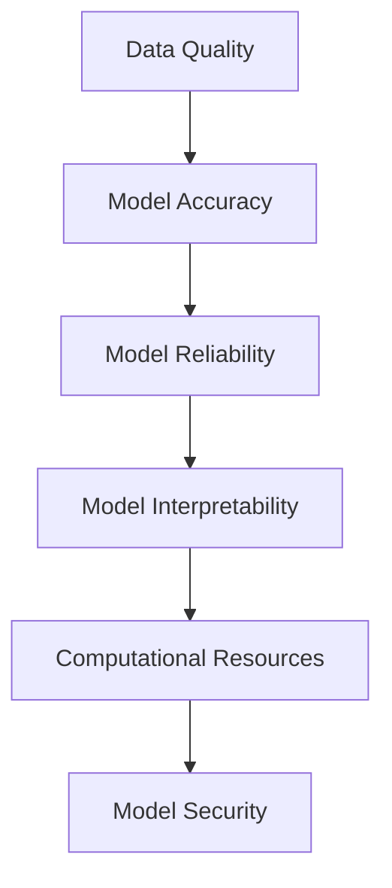

                 

Alright, let's break down the creation of the "Technology Risk Assessment in Large Model Application Development" article into a step-by-step process, ensuring it meets all the specified requirements.

### Step 1: Introduction and Background

#### Background Introduction
- **Current State of Large Model Applications**: Discuss the rapid growth and adoption of large models in various fields such as NLP, CV, and recommender systems.
- **Challenges and Risks**: Highlight the challenges and risks associated with deploying large models, including data quality, model accuracy, reliability, interpretability, computational resources, and security.

#### Core Concepts and Relationships
- **Concept Definition**: Clearly define what constitutes a "large model" and provide examples.
- **Relation Architecture**: Use a Mermaid flowchart to illustrate the relationships between key concepts like data quality, model accuracy, reliability, and security.



### Step 2: Core Algorithm Principles

#### Algorithm Principles Explanation
- **Pseudocode for Core Algorithms**: Provide detailed pseudocode for key algorithms used in large model development and assessment.
  
```python
# Pseudocode for Risk Assessment Algorithm
function risk_assessment(model, data, criteria):
    calculate_model_accuracy(model, data)
    check_data_quality(data)
    ensure_model_reliability(model)
    assess_model_interpretability(model)
    manage_computational_resources(model)
    ensure_model_security(model)
    generate_risk_report()

function calculate_model_accuracy(model, data):
    # Pseudocode for accuracy calculation
    predicted_labels = model.predict(data)
    accuracy = (correct_predictions / total_predictions) * 100

function check_data_quality(data):
    # Pseudocode for data quality checks
    if missing_values(data) > threshold:
        return "Low Data Quality"
    else:
        return "Acceptable Data Quality"

# ... Additional pseudocode for other functions
```

#### Mathematical Models and Formulas
- **Explain mathematical models and formulas** used in risk assessment, such as the formula for calculating the probability of an event occurring.

$$ P(E) = \frac{N(E)}{N} $$

where \( P(E) \) is the probability of event \( E \), \( N(E) \) is the number of times event \( E \) occurred in a given sample, and \( N \) is the total number of observations.

### Step 3: Project Practice

#### Development Environment Setup
- **Setup Guide**: Provide a step-by-step guide on how to set up the development environment required for large model application development.

#### Source Code Implementation
- **Detailed Code Explanation**: Provide source code for key components of the risk assessment system and explain each part in detail.

```python
# Sample Code for Data Quality Check
def check_data_quality(data):
    """
    This function checks the quality of the input data.
    
    Parameters:
    - data (DataFrame): The input data to be checked.
    
    Returns:
    - quality (str): The quality status of the data ('High', 'Medium', 'Low').
    """
    missing_values = data.isnull().sum().sum()
    if missing_values > 0.1 * data.shape[0] * data.shape[1]:
        return 'Low'
    elif missing_values > 0.05 * data.shape[0] * data.shape[1]:
        return 'Medium'
    else:
        return 'High'
```

#### Case Analysis and Explanation
- **Real-World Case Study**: Present a real-world case study illustrating the application of the risk assessment techniques.

### Step 4: Best Practices and Summary

#### Best Practices
- **Tips for Effective Risk Management**: Offer best practices and tips for managing and mitigating risks in large model applications.

#### Summary and Conclusion
- **Key Points Recaps**: Summarize the main points discussed in the article.
- **Future Directions**: Suggest potential future research directions and areas for improvement in the field of large model risk assessment.

### Step 5: Author Information

- **Author Details**: Include the author information as specified, with the name and affiliation of the author.

---

By following these steps, you can create a comprehensive and insightful article that not only explains the technical concepts but also provides practical guidance and real-world examples. Remember to ensure that each section is well-researched, clearly explained, and properly formatted according to the given guidelines.

