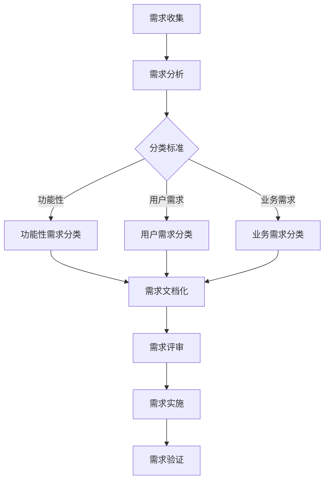

                 

## 文章标题

### 大模型应用开发中的需求分类方法

> 关键词：大模型，需求分类，软件开发，数据分析，自然语言处理，计算机视觉

> 摘要：本文主要探讨大模型应用开发中的需求分类方法，通过对需求分类的概述、应用分析、比较与优化以及案例分析，全面解析大模型在不同领域中的应用及其挑战与机遇，旨在为开发者提供系统性的指导与思路。

---

## 1. 大模型应用开发概述

### 1.1 大模型应用开发的核心概念

#### 1.1.1 大模型的定义

大模型（Large Model）通常指的是具有数百万或数十亿参数的深度学习模型。这些模型具备较强的学习和泛化能力，能够在各种复杂的任务中实现卓越的性能。大模型的主要类型包括神经网络模型（如Transformer、BERT等）、生成对抗网络（GAN）以及循环神经网络（RNN）等。

#### 1.1.2 大模型的特点

- **参数量大**：大模型通常包含大量的参数，使其在处理复杂任务时能够捕捉到更多的信息。
- **训练数据需求高**：大模型的训练需要大量高质量的数据，以保证模型的泛化能力。
- **计算资源需求大**：大模型的训练和推理通常需要大量的计算资源和时间。

#### 1.1.3 大模型的应用场景

大模型在多个领域有着广泛的应用，包括但不限于：

- **自然语言处理（NLP）**：例如文本分类、机器翻译、情感分析等。
- **计算机视觉（CV）**：例如图像分类、目标检测、图像生成等。
- **数据分析**：例如复杂数据分析、预测建模、数据可视化等。
- **推荐系统**：例如商品推荐、内容推荐等。
- **语音识别**：例如语音合成、语音识别等。

### 1.2 大模型应用开发的发展历程

大模型应用开发的发展历程可以大致分为以下几个阶段：

#### 1.2.1 早期阶段

在早期阶段，研究者主要关注小规模模型的开发与应用，如简单的神经网络和决策树模型。

#### 1.2.2 快速增长阶段

随着深度学习和大数据技术的快速发展，大模型逐渐成为研究的热点。2012年，AlexNet在ImageNet图像分类挑战中取得了显著的成果，标志着深度学习时代的到来。

#### 1.2.3 成熟阶段

近年来，随着计算能力的提升和大数据的普及，大模型在多个领域取得了显著的成果，应用范围不断扩大。同时，大模型的开发方法和应用策略也在不断优化和完善。

### 1.3 大模型应用开发的挑战与机遇

#### 1.3.1 挑战

- **数据质量问题**：大模型对训练数据的质量有较高要求，数据质量问题可能影响模型的性能。
- **模型可解释性问题**：大模型的复杂度较高，模型内部机制难以理解，影响其可解释性。
- **模型安全性与隐私问题**：大模型在处理敏感数据时，可能面临安全性和隐私保护方面的挑战。

#### 1.3.2 机遇

- **新兴领域的应用潜力**：随着技术的进步，大模型在新兴领域（如医疗健康、金融科技等）的应用潜力不断挖掘。
- **跨领域协作与融合**：大模型与其他领域的融合，如物理、生物等，有望带来新的突破。

## 2. 需求分类方法概述

### 2.1 需求分类的定义与作用

#### 2.1.1 需求分类的定义

需求分类（Requirement Classification）是将用户需求按照特定的标准和方法进行分类的过程。通过需求分类，可以将复杂的需求分解为更具体、更易于理解和实现的任务。

#### 2.1.2 需求分类在软件开发中的作用

- **明确需求范围**：需求分类有助于明确项目的需求范围，避免需求遗漏或重复。
- **指导开发过程**：通过分类，开发者可以更清晰地了解各个需求的重要性和优先级，从而更好地指导开发过程。
- **提高沟通效率**：需求分类有助于团队成员之间的沟通和理解，降低沟通成本。

### 2.2 常见的需求分类方法

#### 2.2.1 功能性需求分类方法

- **自上而下的需求分类方法**：从整体系统出发，将需求分解为更具体的模块和功能。
- **自下而上的需求分类方法**：从具体的模块和功能出发，逐步整合为整体系统需求。

#### 2.2.2 用户需求分类方法

- **问卷调查法**：通过问卷调查收集用户需求，并根据用户反馈进行分类。
- **用户访谈法**：与用户进行面对面的交流，深入了解用户需求，并进行分类。

#### 2.2.3 业务需求分类方法

- **业务流程需求分类方法**：根据业务流程的需求特点进行分类，如客户管理、订单处理等。
- **业务目标需求分类方法**：根据业务目标的需求特点进行分类，如提高销售额、降低成本等。

### 2.3 需求分类的实践意义

#### 2.3.1 提高软件开发的效率

通过需求分类，可以明确各需求的重要性和优先级，有助于优化开发计划和资源分配，从而提高软件开发效率。

#### 2.3.2 增强软件质量

需求分类有助于确保需求的完整性和一致性，降低需求变更的风险，从而提高软件质量。

#### 2.3.3 促进用户满意度

需求分类有助于更好地理解用户需求，确保开发出的软件能够满足用户的需求，从而提高用户满意度。

## 3. 需求分类方法应用

### 3.1 需求分类在数据分析中的应用

#### 3.1.1 数据分析中的需求分类方法

- **业务目标导向的需求分类方法**：根据业务目标的需求特点进行分类，如客户分析、销售预测等。
- **数据特征导向的需求分类方法**：根据数据特征的需求特点进行分类，如数据清洗、特征工程等。

#### 3.1.2 需求分类在数据分析中的实际案例

- **电商平台的用户行为分析**：通过需求分类，可以将用户行为分为不同的类别，如购买行为、浏览行为等，从而更好地分析用户需求和行为模式。
- **金融行业的风险控制分析**：通过需求分类，可以将风险控制需求分为不同的类别，如信用评估、风险预测等，从而更好地识别和管理风险。

### 3.2 需求分类在自然语言处理中的应用

#### 3.2.1 需求分类在自然语言处理中的定义与作用

需求分类在自然语言处理（NLP）中的应用主要涉及文本分类、情感分析、问答系统等领域。其定义和作用如下：

- **文本分类**：将文本按照特定的类别进行分类，如新闻分类、垃圾邮件过滤等。
- **情感分析**：分析文本中的情感倾向，如正面、负面、中性等。
- **问答系统**：根据用户提出的问题，将问题按照不同的类别进行分类，从而更准确地回答问题。

#### 3.2.2 需求分类在自然语言处理中的实际案例

- **文本分类任务中的应用**：例如，在新闻分类任务中，通过需求分类，可以将新闻按照类别（如政治、经济、科技等）进行分类，从而提高新闻推荐的准确性和效率。
- **问答系统中的应用**：例如，在问答系统中，通过需求分类，可以将用户提出的问题按照不同的类别进行分类，从而更准确地回答用户的问题。

### 3.3 需求分类在计算机视觉中的应用

#### 3.3.1 需求分类在计算机视觉中的定义与作用

需求分类在计算机视觉（CV）中的应用主要涉及图像分类、目标检测、图像分割等领域。其定义和作用如下：

- **图像分类**：将图像按照不同的类别进行分类，如动物、植物、交通工具等。
- **目标检测**：在图像中识别并定位特定目标，如行人检测、车辆检测等。
- **图像分割**：将图像划分为不同的区域，如语义分割、实例分割等。

#### 3.3.2 需求分类在计算机视觉中的实际案例

- **图像分类任务中的应用**：例如，在图像分类任务中，通过需求分类，可以将图像按照类别（如动物、植物等）进行分类，从而实现图像的分类识别。
- **目标检测任务中的应用**：例如，在目标检测任务中，通过需求分类，可以将目标按照类型（如行人、车辆等）进行分类，从而提高目标检测的准确性和效率。

## 4. 需求分类方法比较与优化

### 4.1 需求分类方法的比较

#### 4.1.1 功能性需求分类方法

- **优点**：结构清晰，易于理解和实施。
- **缺点**：可能导致需求遗漏或重复，需求范围较广，难以具体化。

#### 4.1.2 用户需求分类方法

- **优点**：直接反映用户需求，能够更好地满足用户需求。
- **缺点**：可能存在主观性，需求变动较大，实施难度较高。

#### 4.1.3 业务需求分类方法

- **优点**：结合业务目标和流程，有利于业务目标的实现。
- **缺点**：可能忽视用户需求，需求分类较为抽象。

### 4.2 需求分类方法的优化策略

#### 4.2.1 多维度需求分类

结合功能性需求、用户需求、业务需求等多维度进行需求分类，可以更好地满足不同需求类型的需求。

#### 4.2.2 需求迭代与优化

在需求分类过程中，不断收集反馈，进行需求迭代与优化，以确保需求分类的准确性和实用性。

#### 4.2.3 需求文档化

将需求分类结果进行文档化，确保需求的可追溯性和一致性。

### 4.3 需求分类方法的应用评估

#### 4.3.1 效率评估

通过对比不同需求分类方法在软件开发过程中的效率，评估其优缺点。

#### 4.3.2 质量评估

通过评估软件质量（如功能完整性、可维护性等），评估需求分类方法的效果。

#### 4.3.3 用户满意度评估

通过用户满意度调查，评估需求分类方法对用户需求的满足程度。

## 5. 大模型应用开发中的需求分类案例分析

### 5.1 案例一：电商平台的用户需求分类

#### 5.1.1 案例背景

某电商平台在开发新功能时，需要进行用户需求的分类和分析。

#### 5.1.2 需求分类方法

采用多维度需求分类方法，结合功能性需求、用户需求和业务需求进行分类。

#### 5.1.3 实施过程

1. **收集需求**：通过问卷调查、用户访谈等方式收集用户需求。
2. **分类需求**：根据需求类型进行分类，如购买需求、浏览需求、服务需求等。
3. **优先级排序**：结合业务目标和用户反馈，对需求进行优先级排序。
4. **实施开发**：根据分类结果和优先级，进行功能开发和优化。

#### 5.1.4 实施效果

通过需求分类和优先级排序，电商平台能够更好地满足用户需求，提高用户满意度，同时优化了开发流程和资源分配。

### 5.2 案例二：金融行业的风险控制需求分类

#### 5.2.1 案例背景

某金融公司在进行风险控制时，需要对各类风险进行分类和分析。

#### 5.2.2 需求分类方法

采用业务需求分类方法，结合业务流程和风险类型进行分类。

#### 5.2.3 实施过程

1. **分析业务流程**：了解金融公司的业务流程和风险点。
2. **分类风险**：根据业务流程和风险类型进行分类，如信用风险、市场风险、操作风险等。
3. **评估风险**：对分类后的风险进行评估，确定风险程度和优先级。
4. **实施控制**：根据风险评估结果，制定相应的风险控制措施。

#### 5.2.4 实施效果

通过需求分类和风险评估，金融公司能够更好地识别和管理风险，提高风险控制效果，保障公司的稳定运行。

### 5.3 案例三：医疗健康领域的数据需求分类

#### 5.3.1 案例背景

某医疗机构在开展数据分析项目时，需要对各类数据需求进行分类和分析。

#### 5.3.2 需求分类方法

采用数据特征导向的需求分类方法，结合数据类型和数据用途进行分类。

#### 5.3.3 实施过程

1. **收集数据**：收集医疗健康领域的各类数据，如病历数据、检查数据、患者行为数据等。
2. **分类数据**：根据数据类型和数据用途进行分类，如病历数据用于患者诊断，检查数据用于病情监测等。
3. **数据分析**：根据分类结果，进行数据分析和挖掘，提取有价值的信息。
4. **应用推广**：将分析结果应用于医疗实践，提高医疗服务质量和效率。

#### 5.3.4 实施效果

通过需求分类和数据分析，医疗机构能够更好地了解患者需求，优化医疗服务，提高患者满意度。

## 6. 大模型应用开发中的需求分类工具与资源

### 6.1 常用需求分类工具介绍

#### 6.1.1 用户访谈工具

- **访谈指南**：提供访谈问题的模板和指导，确保访谈的有效性。
- **录音与转录工具**：如VoiceMemo、Otter等，用于记录和整理访谈内容。

#### 6.1.2 问卷调查工具

- **问卷设计工具**：如Google Forms、SurveyMonkey等，提供问卷设计和分发功能。
- **数据分析工具**：如Excel、Python等，用于分析问卷调查结果。

#### 6.1.3 需求管理工具

- **JIRA**：用于需求收集、分类和跟踪。
- **Confluence**：用于文档化和知识共享。

### 6.2 需求分类资源汇总

#### 6.2.1 书籍

- 《软件需求规格说明书》
- 《用户故事地图》

#### 6.2.2 在线资源

- 《敏捷软件开发实践指南》
- 《需求工程》

### 6.3 需求分类工具使用技巧

#### 6.3.1 用户访谈

- **准备充分**：在访谈前了解用户背景和需求。
- **引导技巧**：使用开放性问题，引导用户表达需求。
- **记录整理**：及时记录访谈内容，进行整理和分析。

#### 6.3.2 问卷调查

- **设计合理**：设计清晰、简洁的问卷，避免冗长和复杂。
- **分发广泛**：通过多种渠道分发问卷，确保样本代表性。
- **数据分析**：使用适当的工具和方法，对问卷结果进行分析。

## 7. 总结与展望

### 7.1 大模型应用开发中的需求分类方法总结

- **重要性**：需求分类在大模型应用开发中具有重要作用，能够明确需求范围、指导开发过程、提高沟通效率等。
- **方法多样性**：存在多种需求分类方法，包括功能性需求分类、用户需求分类和业务需求分类等。
- **实际案例**：通过案例分析，需求分类方法在实际应用中取得了显著效果。

### 7.2 未来需求分类方法的发展趋势

- **智能化**：随着人工智能技术的发展，需求分类方法将更加智能化，如基于机器学习的需求分类方法。
- **个性化**：结合用户行为数据，实现个性化需求分类，提高需求的准确性和实用性。
- **跨领域融合**：需求分类方法将在更多领域得到应用，如医疗健康、金融科技等。

### 7.3 大模型应用开发中的需求分类应用展望

- **提高开发效率**：通过需求分类，优化开发流程和资源分配，提高软件开发效率。
- **提升用户体验**：更好地满足用户需求，提高用户体验和满意度。
- **创新应用**：结合大模型技术，开拓新的应用领域，如智能医疗、智能金融等。

---

**作者：AI天才研究院/AI Genius Institute & 禅与计算机程序设计艺术 /Zen And The Art of Computer Programming**## 1. 大模型应用开发概述

### 1.1 大模型应用开发的核心概念

大模型（Large Model）是指具有数百万至数十亿参数的深度学习模型。这些模型通常通过大量数据进行训练，以实现高水平的任务性能。大模型在深度学习领域中的重要性不言而喻，其核心概念主要体现在以下几个方面：

#### **大模型的定义**

大模型通常指的是以下类型的模型：

1. **神经网络模型**：如Transformer、BERT、GPT等，这些模型具有数十亿个参数。
2. **生成对抗网络（GAN）**：如StyleGAN、BigGAN等，其生成模型和判别模型都具有大量参数。
3. **循环神经网络（RNN）**：如LSTM、GRU等，这些模型在序列数据处理中表现出色，但其参数量也相对较大。

#### **大模型的特点**

1. **参数量大**：大模型包含的参数数量远超传统模型，这使得模型能够捕捉到更复杂的数据特征。
2. **计算资源需求高**：大模型的训练和推理需要大量的计算资源和时间。
3. **训练数据需求高**：大模型的训练需要大量高质量的数据，以保证模型的泛化能力和准确性。
4. **高成本**：由于计算资源和数据资源的需求，大模型的开发和应用成本较高。
5. **性能优越**：大模型在图像识别、自然语言处理、语音识别等多个领域取得了显著的成果，性能往往优于传统模型。

#### **大模型的应用场景**

大模型在多个领域有着广泛的应用，主要包括：

1. **自然语言处理（NLP）**：如文本分类、机器翻译、情感分析等。
2. **计算机视觉（CV）**：如图像分类、目标检测、图像生成等。
3. **数据分析**：如复杂数据分析、预测建模、数据可视化等。
4. **推荐系统**：如商品推荐、内容推荐等。
5. **语音识别**：如语音合成、语音识别等。
6. **游戏开发**：如游戏AI、虚拟现实等。

### 1.2 大模型应用开发的发展历程

大模型应用开发的发展历程可以分为以下几个阶段：

#### **1.2.1 早期阶段**

在深度学习早期阶段，研究者主要关注小规模模型的开发与应用，如简单的神经网络和决策树模型。这一阶段的研究主要集中在如何设计有效的算法和优化方法。

#### **1.2.2 快速增长阶段**

随着深度学习和大数据技术的快速发展，大模型逐渐成为研究的热点。2012年，AlexNet在ImageNet图像分类挑战中取得了显著的成果，标志着深度学习时代的到来。此后，大模型在各个领域取得了飞速的发展。

#### **1.2.3 成熟阶段**

近年来，随着计算能力的提升和大数据的普及，大模型在多个领域取得了显著的成果，应用范围不断扩大。同时，大模型的开发方法和应用策略也在不断优化和完善。例如，预训练语言模型（如GPT、BERT）的广泛应用，显著提升了自然语言处理任务的效果。

### 1.3 大模型应用开发的挑战与机遇

#### **1.3.1 挑战**

1. **数据质量问题**：大模型对训练数据的质量有较高要求，数据质量问题可能影响模型的性能。例如，数据集可能存在标注错误、数据不平衡等问题，这些都会影响模型的训练效果。

2. **模型可解释性问题**：大模型的复杂度较高，模型内部机制难以理解，影响其可解释性。这对于需要透明性和可解释性的应用场景（如医疗诊断、金融风险评估）来说，是一个重大挑战。

3. **模型安全性与隐私问题**：大模型在处理敏感数据时，可能面临安全性和隐私保护方面的挑战。例如，模型可能受到对抗性攻击，或在训练过程中泄露敏感数据。

4. **计算资源需求**：大模型的训练和推理需要大量的计算资源和时间，这可能会带来较高的成本和计算挑战。

#### **1.3.2 机遇**

1. **新兴领域的应用潜力**：随着技术的进步，大模型在新兴领域（如医疗健康、金融科技等）的应用潜力不断挖掘。例如，大模型在医学影像分析、药物发现等方面的应用取得了显著成果。

2. **跨领域协作与融合**：大模型与其他领域的融合，如物理、生物等，有望带来新的突破。例如，大模型在生物信息学中的应用，可以帮助研究人员更好地理解基因和蛋白质的功能。

3. **计算能力的提升**：随着计算能力的不断提升，大模型的训练和推理将变得更加高效和经济，为其广泛应用提供了可能性。

4. **数据量的增长**：随着数据量的持续增长，大模型将有更多的数据可以训练，进一步提升其性能和泛化能力。

### 1.4 大模型应用开发的案例分析

#### **1.4.1 案例一：自然语言处理中的大模型应用**

在自然语言处理领域，预训练语言模型（如BERT、GPT）已经成为主流。这些模型通过在大规模文本数据上进行预训练，然后在特定任务上进行微调，取得了显著的效果。例如，GPT-3模型在多项自然语言处理任务上达到了人类水平，被广泛应用于聊天机器人、文本生成、翻译等场景。

#### **1.4.2 案例二：计算机视觉中的大模型应用**

在计算机视觉领域，大模型在图像分类、目标检测、图像生成等方面取得了显著的成果。例如，Transformer模型在图像分类任务上取得了SOTA（State-of-the-Art）性能，生成对抗网络（GAN）在图像生成方面展示了强大的能力。这些大模型的应用，不仅提升了图像处理任务的性能，也为图像处理技术的发展带来了新的机遇。

#### **1.4.3 案例三：推荐系统中的大模型应用**

在推荐系统领域，大模型的应用帮助提高了推荐系统的效果和效率。通过使用大模型对用户行为数据进行建模，推荐系统可以更准确地预测用户偏好，从而提供更个性化的推荐结果。例如，淘宝、京东等电商平台使用大模型进行商品推荐，显著提升了用户满意度和转化率。

### 1.5 大模型应用开发中的核心算法原理讲解

#### **1.5.1 深度学习基础算法**

深度学习的基础算法主要包括神经网络（NN）、卷积神经网络（CNN）、循环神经网络（RNN）等。这些算法通过多层网络结构对数据进行建模和预测。

- **神经网络（NN）**：神经网络是一种基于生物神经元的计算模型，通过加权连接多个神经元来实现数据的输入和输出。
- **卷积神经网络（CNN）**：卷积神经网络是一种专门用于图像处理的神经网络，通过卷积操作捕捉图像的空间特征。
- **循环神经网络（RNN）**：循环神经网络是一种能够处理序列数据的神经网络，通过循环结构捕捉序列中的时间特征。

#### **1.5.2 大模型关键算法**

大模型的关键算法主要包括生成对抗网络（GAN）、Transformer等。

- **生成对抗网络（GAN）**：生成对抗网络由生成器和判别器两个神经网络组成，通过对抗训练生成逼真的数据。
- **Transformer**：Transformer模型是一种基于自注意力机制的神经网络，通过全局的注意力机制捕捉数据中的长距离依赖关系。

### 1.6 大模型应用开发中的数学模型和公式讲解

#### **1.6.1 神经网络的基本数学模型**

神经网络的数学模型主要包括输入层、隐藏层和输出层。其基本公式为：

\[ 
\text{输出} = \text{激活函数}(\text{权重} \cdot \text{输入} + \text{偏置}) 
\]

其中，激活函数（如ReLU、Sigmoid、Tanh）用于引入非线性。

#### **1.6.2 卷积神经网络（CNN）的数学模型**

卷积神经网络的数学模型包括卷积操作和池化操作。卷积操作的公式为：

\[ 
\text{输出}_{ij} = \text{激活函数}(\sum_{k=1}^{C} w_{ikj} \cdot \text{输入}_{kj} + b_j) 
\]

其中，\( w_{ikj} \) 为卷积核，\( b_j \) 为偏置。

#### **1.6.3 循环神经网络（RNN）的数学模型**

循环神经网络的数学模型基于递归关系，其公式为：

\[ 
h_t = \text{激活函数}(\text{权重} \cdot [h_{t-1}, x_t] + \text{偏置}) 
\]

其中，\( h_t \) 为当前时间步的隐藏状态，\( x_t \) 为输入。

#### **1.6.4 Transformer的数学模型**

Transformer的数学模型基于自注意力机制，其公式为：

\[ 
\text{输出}_{ij} = \text{softmax}(\frac{Q_i \cdot K_j}{\sqrt{d_k}}) \cdot V_j 
\]

其中，\( Q_i \)、\( K_j \) 和 \( V_j \) 分别为查询向量、关键向量和价值向量，\( d_k \) 为关键向量的维度。

### 1.7 大模型应用开发中的项目实战

#### **1.7.1 开发环境搭建**

搭建大模型应用开发环境通常需要安装以下工具和库：

1. **Python**：作为主要的编程语言。
2. **TensorFlow** 或 **PyTorch**：作为主要的深度学习框架。
3. **CUDA** 和 **cuDNN**：用于GPU加速。

#### **1.7.2 源代码详细实现**

以下是一个基于TensorFlow实现的大模型训练的伪代码：

```python
import tensorflow as tf

# 模型定义
model = tf.keras.Sequential([
    tf.keras.layers.Dense(units=512, activation='relu', input_shape=(784,)),
    tf.keras.layers.Dense(units=512, activation='relu'),
    tf.keras.layers.Dense(units=10, activation='softmax')
])

# 模型编译
model.compile(optimizer='adam', loss='sparse_categorical_crossentropy', metrics=['accuracy'])

# 模型训练
model.fit(x_train, y_train, epochs=10, batch_size=32, validation_split=0.2)
```

#### **1.7.3 代码解读与分析**

上述代码实现了一个简单的多层感知机（MLP）模型，用于手写数字识别任务。其中，`Dense` 层表示全连接层，`relu` 为ReLU激活函数，`softmax` 为输出层的激活函数。在模型编译阶段，指定了优化器和损失函数。在模型训练阶段，使用训练数据和标签进行训练。

#### **1.7.4 实际案例分析和详细讲解剖析**

以下是一个基于PyTorch实现的大模型在图像分类任务中的实际案例：

```python
import torch
import torchvision
import torchvision.transforms as transforms

# 加载预训练模型
model = torchvision.models.resnet50(pretrained=True)

# 数据预处理
transform = transforms.Compose([transforms.Resize(256), transforms.CenterCrop(224), transforms.ToTensor()])

# 加载测试数据集
test_data = torchvision.datasets.ImageFolder(root='path/to/test/images', transform=transform)
test_loader = torch.utils.data.DataLoader(test_data, batch_size=32, shuffle=True)

# 模型评估
with torch.no_grad():
    correct = 0
    total = 0
    for images, labels in test_loader:
        outputs = model(images)
        _, predicted = torch.max(outputs.data, 1)
        total += labels.size(0)
        correct += (predicted == labels).sum().item()

print('准确率：%.2f%%' % (100 * correct / total))
```

上述代码实现了使用ResNet-50模型进行图像分类的任务。首先，加载预训练的ResNet-50模型。然后，对测试数据进行预处理，包括图像缩放、中心裁剪和转换成Tensor。在模型评估阶段，使用测试数据集计算模型的准确率。

#### **1.7.5 项目小结**

通过上述案例，我们可以看到大模型在图像分类任务中的实际应用。大模型的强大学习能力使其能够处理复杂的图像数据，实现较高的分类准确率。在实际项目中，需要根据任务需求和数据特点选择合适的大模型，并进行适当的调整和优化。

### 1.8 大模型应用开发中的最佳实践 Tips

1. **数据预处理**：确保数据质量和预处理方法，对于大模型的训练至关重要。
2. **模型选择**：根据任务需求和数据特点，选择合适的大模型。
3. **超参数调整**：合理设置超参数，如学习率、批量大小等，可以显著影响模型的性能。
4. **模型优化**：通过剪枝、量化等方法，优化大模型，降低计算资源和存储成本。
5. **模型解释**：尝试使用可解释性方法，提高模型的可解释性，有助于理解模型的工作原理。

### 1.9 大模型应用开发中的注意事项

1. **数据隐私和安全**：在处理敏感数据时，确保遵循数据隐私和安全法规。
2. **计算资源管理**：合理分配计算资源，避免资源浪费。
3. **模型部署和监控**：确保模型的稳定性和实时性，定期监控模型的性能和准确率。

### 1.10 大模型应用开发中的拓展阅读

1. **《深度学习》**：Ian Goodfellow、Yoshua Bengio、Aaron Courville 著，全面介绍了深度学习的理论和方法。
2. **《Python深度学习》**：François Chollet 著，详细介绍了使用Python进行深度学习的实践方法。
3. **《自然语言处理综论》**：Daniel Jurafsky、James H. Martin 著，全面介绍了自然语言处理的理论和实践。
4. **《计算机视觉：算法与应用》**：David S. Kriegel、Jens Hartmann 著，详细介绍了计算机视觉的理论和应用。

通过本文的详细阐述，我们希望能够帮助读者更好地理解大模型应用开发的核心概念、发展历程、挑战与机遇，以及需求分类方法的应用。在大模型应用开发的实践中，正确选择和分类需求，结合优秀的算法和数学模型，是实现项目成功的关键。希望本文能为您的开发工作提供有益的参考和启示。## 2. 需求分类方法概述

### 2.1 需求分类的定义与作用

#### **2.1.1 需求分类的定义**

需求分类（Requirement Classification）是将用户需求按照特定的标准和方法进行分类的过程。其核心目的是将复杂、抽象的需求分解为具体、易于理解和实现的任务。需求分类通常在软件开发、数据分析、项目管理等过程中得到广泛应用。

#### **2.1.2 需求分类在软件开发中的作用**

- **明确需求范围**：通过需求分类，可以清晰地界定项目的需求范围，避免需求遗漏或重复。
- **指导开发过程**：分类后的需求有助于开发者明确每个任务的具体内容和优先级，从而更有效地指导开发过程。
- **提高沟通效率**：通过统一的需求分类标准，团队成员可以更快速地理解和交流需求，降低沟通成本。
- **优化资源分配**：根据分类后的需求优先级，可以更合理地分配资源和时间，提高开发效率。
- **提高软件质量**：通过需求分类，可以确保需求的完整性和一致性，降低需求变更的风险，从而提高软件质量。

### 2.2 常见的需求分类方法

#### **2.2.1 功能性需求分类方法**

功能性需求分类方法主要用于将软件系统按照功能模块进行分类。这种方法有助于明确系统的主要功能和子功能，便于开发者理解和实现。常见的功能性需求分类方法包括：

1. **自上而下的需求分类方法**：
   - **优点**：结构清晰，易于理解和实施。
   - **缺点**：可能导致需求遗漏或重复，需求范围较广，难以具体化。

2. **自下而上的需求分类方法**：
   - **优点**：从具体模块和功能出发，逐步整合为整体系统需求，有助于发现潜在的需求。
   - **缺点**：可能导致整体系统需求的分解不彻底，难以从全局角度进行优化。

#### **2.2.2 用户需求分类方法**

用户需求分类方法主要用于分析用户的具体需求，并按照用户类型或需求特点进行分类。这种方法有助于更好地理解用户需求，从而提高软件系统的用户满意度。常见的用户需求分类方法包括：

1. **问卷调查法**：
   - **优点**：可以直接收集用户的需求和反馈，数据获取效率高。
   - **缺点**：可能存在主观性和不准确性，需要结合其他方法进行验证。

2. **用户访谈法**：
   - **优点**：可以深入了解用户的需求和行为，获取更详细的信息。
   - **缺点**：访谈过程耗时较长，成本较高。

#### **2.2.3 业务需求分类方法**

业务需求分类方法主要用于将需求按照业务目标和业务流程进行分类。这种方法有助于确保软件系统能够满足企业的业务需求，提高企业的运营效率。常见的业务需求分类方法包括：

1. **业务流程需求分类方法**：
   - **优点**：结合业务流程的需求特点进行分类，有助于优化业务流程。
   - **缺点**：可能忽视用户需求，需求分类较为抽象。

2. **业务目标需求分类方法**：
   - **优点**：结合业务目标的需求特点进行分类，有助于实现业务目标。
   - **缺点**：可能忽视具体的业务流程，需求分类较为宏观。

### 2.3 需求分类的实践意义

#### **2.3.1 提高软件开发的效率**

通过需求分类，可以明确各需求的重要性和优先级，有助于优化开发计划和资源分配，从而提高软件开发效率。

#### **2.3.2 增强软件质量**

需求分类有助于确保需求的完整性和一致性，降低需求变更的风险，从而提高软件质量。

#### **2.3.3 促进用户满意度**

需求分类有助于更好地理解用户需求，确保开发出的软件能够满足用户的需求，从而提高用户满意度。

#### **2.3.4 支持项目管理**

需求分类为项目管理提供了清晰的参考，有助于制定项目计划、分配任务、监控进度等。

### 2.4 需求分类方法的比较与优化

#### **2.4.1 需求分类方法的比较**

- **功能性需求分类方法**：结构清晰，易于理解和实施，但可能导致需求遗漏或重复。
- **用户需求分类方法**：直接反映用户需求，能够更好地满足用户需求，但可能存在主观性。
- **业务需求分类方法**：结合业务目标和流程，有利于业务目标的实现，但可能忽视用户需求。

#### **2.4.2 需求分类方法的优化策略**

- **多维度需求分类**：结合功能性需求、用户需求和业务需求，实现多维度的需求分类。
- **需求迭代与优化**：在需求分类过程中，不断收集反馈，进行需求迭代与优化。
- **需求文档化**：将需求分类结果进行文档化，确保需求的可追溯性和一致性。

#### **2.4.3 需求分类方法的应用评估**

- **效率评估**：通过对比不同需求分类方法在软件开发过程中的效率，评估其优缺点。
- **质量评估**：通过评估软件质量（如功能完整性、可维护性等），评估需求分类方法的效果。
- **用户满意度评估**：通过用户满意度调查，评估需求分类方法对用户需求的满足程度。

### 2.5 需求分类方法的实际应用案例

#### **2.5.1 案例一：电商平台的需求分类**

在一个电商平台的开发过程中，通过需求分类，可以将用户需求分为以下几个方面：

1. **用户注册与登录**：包括用户账号注册、登录、密码找回等功能。
2. **商品浏览与搜索**：包括商品分类、搜索、详情页展示等功能。
3. **购物车与订单管理**：包括商品加入购物车、订单提交、订单查询等功能。
4. **用户评价与互动**：包括商品评价、评论回复等功能。
5. **支付与售后**：包括支付方式选择、支付结果查询、售后服务等功能。

通过需求分类，可以明确各个功能模块的具体内容和优先级，有助于开发者按照需求进行开发。

#### **2.5.2 案例二：企业管理系统的需求分类**

在一个企业管理系统的开发过程中，通过需求分类，可以将用户需求分为以下几个方面：

1. **人力资源管理系统**：包括员工信息管理、招聘管理、薪酬管理等功能。
2. **财务管理系统**：包括财务报表、成本管理、资金流动管理等功能。
3. **销售管理系统**：包括销售订单管理、销售分析、客户管理等功能。
4. **生产管理系统**：包括生产计划、物料管理、生产进度管理等功能。
5. **供应链管理系统**：包括供应商管理、采购管理、库存管理等功能。

通过需求分类，可以明确企业管理系统的功能模块和业务流程，有助于优化企业管理流程，提高运营效率。

### 2.6 需求分类方法的核心概念与联系

为了更好地理解需求分类方法的核心概念与联系，我们可以使用Mermaid流程图来展示需求分类的方法和步骤。以下是需求分类方法的Mermaid流程图：



该流程图展示了需求从收集、分析、分类、文档化、评审到实施和验证的全过程。通过这个流程，可以清晰地看到需求分类方法在各阶段的核心概念与联系。

#### **2.6.1 需求分类的核心概念**

- **需求收集**：收集用户的需求，包括功能需求、性能需求、安全需求等。
- **需求分析**：分析收集到的需求，明确需求的具体内容和优先级。
- **分类标准**：根据不同的分类标准，将需求分为功能性需求、用户需求和业务需求。
- **需求文档化**：将分类后的需求进行文档化，便于后续的评审和实施。
- **需求评审**：对分类后的需求进行评审，确保需求的合理性和可行性。
- **需求实施**：根据评审后的需求进行开发、测试和部署。
- **需求验证**：验证实施后的需求是否满足用户需求，确保软件系统的质量和性能。

#### **2.6.2 需求分类的联系**

- **需求收集与需求分析**：需求收集是需求分析的输入，需求分析是对需求收集的输出。
- **需求分类与需求文档化**：需求分类是需求文档化的基础，需求文档化是需求分类的延伸。
- **需求评审与需求实施**：需求评审是对需求实施前的检查，需求实施是评审后的具体操作。
- **需求验证与需求收集**：需求验证是需求收集的反馈，验证结果将影响后续的需求收集和分析。

通过上述流程图和核心概念的阐述，我们可以更好地理解需求分类方法在软件开发中的应用。需求分类不仅有助于明确项目需求，提高开发效率，还可以确保软件质量，满足用户需求。在实际开发过程中，应根据项目特点和需求类型，选择合适的分类方法，并结合多维度需求分析，实现项目的成功。|im_end|>## 3. 需求分类方法应用

### 3.1 需求分类在数据分析中的应用

#### 3.1.1 数据分析中的需求分类方法

在数据分析过程中，需求分类是一个关键步骤，它有助于将复杂的用户需求转化为可操作的分析任务。数据分析中的需求分类方法主要包括以下几种：

1. **业务目标导向的需求分类方法**：
   - **定义**：根据企业或项目的业务目标对数据需求进行分类。
   - **作用**：明确数据需求的业务价值，确保分析工作的针对性。
   - **应用场景**：例如，企业销售数据分析、市场营销效果评估等。

2. **数据特征导向的需求分类方法**：
   - **定义**：根据数据本身的特征对数据需求进行分类。
   - **作用**：基于数据特性进行高效的数据处理和分析。
   - **应用场景**：例如，数据清洗、特征工程、数据可视化等。

#### 3.1.2 需求分类在数据分析中的实际案例

##### 3.1.2.1 电商平台的用户行为分析

在电商平台上，用户行为分析是一个重要的数据分析任务。以下是一个实际案例，展示了如何应用需求分类方法进行用户行为分析：

1. **需求收集**：通过用户日志、问卷调查等方式收集用户行为数据。
2. **需求分析**：分析用户行为数据，识别用户的浏览、搜索、购买等行为模式。
3. **需求分类**：
   - **业务目标导向**：分析用户购买行为的转化率、客户忠诚度等。
   - **数据特征导向**：分析用户的浏览时长、页面跳转路径等。
4. **需求实施**：
   - **业务目标导向**：优化产品推荐算法，提高用户购买转化率。
   - **数据特征导向**：改善网站用户体验，减少页面加载时间。
5. **需求验证**：通过A/B测试等方法验证分析结果的准确性，并根据反馈进行调整。

##### 3.1.2.2 金融行业的风险控制分析

在金融行业，风险控制分析是一个关键需求。以下是一个实际案例，展示了如何应用需求分类方法进行风险控制分析：

1. **需求收集**：收集金融交易数据、客户行为数据等。
2. **需求分析**：分析交易数据，识别潜在的欺诈行为、信用风险等。
3. **需求分类**：
   - **业务目标导向**：评估金融产品的风险，确保合规性。
   - **数据特征导向**：分析交易数据的特征，如交易金额、交易时间、地理位置等。
4. **需求实施**：
   - **业务目标导向**：建立风险评估模型，制定风险控制策略。
   - **数据特征导向**：优化欺诈检测算法，提高检测准确率。
5. **需求验证**：通过实际交易数据进行测试，验证风险控制策略的有效性。

### 3.2 需求分类在自然语言处理中的应用

#### 3.2.1 需求分类在自然语言处理中的定义与作用

在自然语言处理（NLP）中，需求分类是将文本数据按照特定标准进行分类的过程。NLP的需求分类有助于提高文本处理效率、优化算法性能和增强系统可解释性。其主要作用包括：

- **文本分类**：将文本按照类别进行分类，如新闻分类、垃圾邮件过滤等。
- **情感分析**：分析文本中的情感倾向，如正面、负面、中性等。
- **实体识别**：识别文本中的特定实体，如人名、地点、组织等。
- **问答系统**：根据用户提出的问题，将问题按照不同的类别进行分类，从而更准确地回答问题。

#### 3.2.2 需求分类在自然语言处理中的实际案例

##### 3.2.2.1 文本分类任务中的应用

在文本分类任务中，需求分类有助于将大量未标注的文本数据转化为已标注的数据集，从而训练分类模型。以下是一个实际案例：

1. **需求收集**：收集大量新闻文本数据，包括政治、经济、体育等类别。
2. **需求分析**：分析文本数据，识别不同类别的特征。
3. **需求分类**：
   - **业务目标导向**：根据新闻的重要性和受众群体进行分类。
   - **数据特征导向**：根据文本的关键词、句子结构等进行分类。
4. **需求实施**：使用分类算法（如Naive Bayes、SVM等）对文本进行分类。
5. **需求验证**：通过交叉验证等方法验证分类模型的准确性。

##### 3.2.2.2 问答系统中的应用

在问答系统中，需求分类有助于将用户提出的问题按照不同的类别进行分类，从而提高问答系统的回答准确性。以下是一个实际案例：

1. **需求收集**：收集用户提出的问题，包括常见问题、特定问题等。
2. **需求分析**：分析问题数据，识别不同类别的特征。
3. **需求分类**：
   - **业务目标导向**：根据问题的紧急程度和解决难度进行分类。
   - **数据特征导向**：根据问题的关键词、问句结构等进行分类。
4. **需求实施**：使用分类算法（如KNN、决策树等）对问题进行分类。
5. **需求验证**：通过用户反馈等方法验证分类模型的准确性。

### 3.3 需求分类在计算机视觉中的应用

#### 3.3.1 需求分类在计算机视觉中的定义与作用

在计算机视觉中，需求分类是将图像或视频数据按照特定标准进行分类的过程。需求分类有助于提高计算机视觉算法的准确性和效率，其主要作用包括：

- **图像分类**：将图像按照类别进行分类，如动物、植物、交通工具等。
- **目标检测**：在图像中识别并定位特定目标，如行人检测、车辆检测等。
- **图像分割**：将图像划分为不同的区域，如语义分割、实例分割等。

#### 3.3.2 需求分类在计算机视觉中的实际案例

##### 3.3.2.1 图像分类任务中的应用

在图像分类任务中，需求分类有助于将大量未标注的图像数据转化为已标注的数据集，从而训练分类模型。以下是一个实际案例：

1. **需求收集**：收集大量未标注的图像数据，包括各种类别。
2. **需求分析**：分析图像数据，识别不同类别的特征。
3. **需求分类**：
   - **业务目标导向**：根据图像的应用场景和目标群体进行分类。
   - **数据特征导向**：根据图像的颜色、纹理、形状等进行分类。
4. **需求实施**：使用分类算法（如卷积神经网络、支持向量机等）对图像进行分类。
5. **需求验证**：通过交叉验证等方法验证分类模型的准确性。

##### 3.3.2.2 目标检测任务中的应用

在目标检测任务中，需求分类有助于将图像中的目标按照不同的类别进行分类和定位。以下是一个实际案例：

1. **需求收集**：收集包含多种目标的图像数据，包括行人、车辆、动物等。
2. **需求分析**：分析图像数据，识别不同类别目标的特征。
3. **需求分类**：
   - **业务目标导向**：根据目标的应用场景和重要性进行分类。
   - **数据特征导向**：根据目标的颜色、大小、形状等进行分类。
4. **需求实施**：使用目标检测算法（如YOLO、SSD、Faster R-CNN等）对图像中的目标进行检测和分类。
5. **需求验证**：通过实际图像数据测试目标检测算法的准确率和实时性。

通过上述案例，我们可以看到需求分类方法在数据分析、自然语言处理和计算机视觉中的应用。需求分类不仅有助于明确分析任务的目标和方向，还可以优化算法性能，提高系统的准确性和效率。在实际应用中，应根据具体任务需求和数据特点，选择合适的需求分类方法，并不断优化和完善分类策略。|im_end|>## 4. 需求分类方法比较与优化

### 4.1 需求分类方法的比较

需求分类方法的选择对软件开发项目的成功至关重要。不同的需求分类方法各有优缺点，适用于不同的应用场景。以下是几种常见需求分类方法的比较：

#### 4.1.1 功能性需求分类方法

- **优点**：结构清晰，易于理解和实施，有助于明确系统的功能模块。
- **缺点**：可能导致需求遗漏或重复，需求范围较广，难以具体化。

#### 4.1.2 用户需求分类方法

- **优点**：直接反映用户需求，能够更好地满足用户需求，有助于提高用户满意度。
- **缺点**：可能存在主观性，需求变动较大，实施难度较高。

#### 4.1.3 业务需求分类方法

- **优点**：结合业务目标和流程，有利于业务目标的实现，有助于优化业务流程。
- **缺点**：可能忽视用户需求，需求分类较为抽象，难以具体实施。

#### 4.1.4 数据驱动需求分类方法

- **优点**：基于数据特征和业务指标进行分类，有助于提高需求分析的准确性和可靠性。
- **缺点**：数据获取和分析成本较高，可能依赖于数据质量和数据源。

#### 4.1.5 多维度需求分类方法

- **优点**：结合功能性需求、用户需求和业务需求，实现多维度的需求分类，有助于更全面地理解和满足需求。
- **缺点**：需求分类过程较为复杂，需要协调不同维度之间的需求关系。

### 4.2 需求分类方法的优化策略

为了提高需求分类的准确性和实用性，可以采取以下优化策略：

#### 4.2.1 多维度需求分类

结合功能性需求、用户需求和业务需求等多维度进行需求分类，可以更全面地理解和满足需求。这种方法有助于确保需求分类的完整性，减少需求遗漏和重复。

#### 4.2.2 需求迭代与优化

在需求分类过程中，不断收集反馈，进行需求迭代与优化。通过定期回顾和评估需求，可以发现和解决潜在问题，确保需求分类的准确性和实用性。

#### 4.2.3 需求文档化

将需求分类结果进行文档化，确保需求的可追溯性和一致性。文档化的需求分类结果有助于团队成员之间的沟通和协作，提高需求管理的效率。

#### 4.2.4 需求优先级排序

根据需求的重要性和优先级进行排序，有助于优化开发计划和资源分配。合理的优先级排序有助于确保关键需求得到优先处理，提高开发效率。

#### 4.2.5 需求验证与确认

通过需求验证和确认过程，确保需求分类的准确性和可行性。需求验证可以采用用户评审、测试等方法，确保需求符合实际需求和业务目标。

### 4.3 需求分类方法的应用评估

#### 4.3.1 效率评估

通过对比不同需求分类方法在软件开发过程中的效率，评估其优缺点。可以采用以下指标进行评估：

- **需求收集时间**：从需求收集到需求分类完成所需的时间。
- **需求分析时间**：从需求分析到需求分类完成所需的时间。
- **需求实现时间**：从需求分类到需求实现所需的时间。
- **需求变更次数**：在需求分类和开发过程中，需求的变更次数和原因。

#### 4.3.2 质量评估

通过评估软件质量（如功能完整性、可维护性等），评估需求分类方法的效果。可以采用以下指标进行评估：

- **功能完整性**：完成的需求是否覆盖了所有关键功能。
- **需求变更率**：需求变更的频率和影响范围。
- **代码质量**：代码的可读性、可维护性和可扩展性。

#### 4.3.3 用户满意度评估

通过用户满意度调查，评估需求分类方法对用户需求的满足程度。可以采用以下指标进行评估：

- **用户满意度**：用户对软件系统的满意度。
- **功能实用性**：用户认为功能是否实用和易于使用。
- **系统稳定性**：用户认为系统是否稳定可靠。

### 4.4 需求分类方法的案例分析

#### **4.4.1 案例一：电商平台的需求分类**

在一个电商平台的开发过程中，采用多维度需求分类方法，结合功能性需求、用户需求和业务需求进行分类。以下是案例分析：

1. **需求收集**：通过用户调研、问卷调查等方式收集用户需求。
2. **需求分析**：分析用户需求，识别主要功能模块，如商品浏览、购物车、支付等。
3. **需求分类**：
   - **功能性需求**：明确系统的核心功能，如商品展示、用户登录、购物车管理等。
   - **用户需求**：分析用户行为数据，识别用户偏好的功能，如个性化推荐、优惠券等。
   - **业务需求**：结合企业业务目标，确保系统符合业务流程和规范。
4. **需求优化**：根据用户反馈和业务需求，对需求进行迭代和优化。
5. **需求验证**：通过用户测试和评审，确保需求分类的准确性和可行性。

#### **4.4.2 案例二：企业内部管理系统需求分类**

在一个企业内部管理系统的开发过程中，采用业务需求分类方法，结合业务流程和业务目标进行分类。以下是案例分析：

1. **需求收集**：通过业务流程分析和用户访谈等方式收集业务需求。
2. **需求分析**：分析业务流程，识别关键业务环节和需求。
3. **需求分类**：
   - **业务流程需求**：明确系统的业务流程，如报销审批、员工管理、合同管理等。
   - **业务目标需求**：结合企业业务目标，确保系统支持业务目标的实现。
4. **需求优化**：根据业务流程和业务目标，对需求进行优化和调整。
5. **需求验证**：通过业务测试和用户评审，确保需求分类的准确性和可行性。

通过上述案例，我们可以看到需求分类方法在软件开发项目中的应用和优化。合理的需求分类方法有助于提高软件开发效率、确保软件质量和用户满意度，为项目的成功奠定基础。|im_end|>## 5. 大模型应用开发中的需求分类案例分析

### 5.1 案例一：电商平台的用户需求分类

#### **5.1.1 案例背景**

随着电商行业的快速发展，电商平台需要不断优化其功能，以满足用户多样化的需求。本案例选取某知名电商平台，通过需求分类方法对用户需求进行梳理和分析，以指导平台功能的改进和优化。

#### **5.1.2 需求收集**

为了全面了解用户需求，电商平台采取了多种需求收集方法，包括：

1. **问卷调查**：通过在线问卷收集用户对平台功能的看法和改进建议。
2. **用户访谈**：与活跃用户和潜在用户进行面对面的访谈，深入了解他们的使用习惯和需求。
3. **数据分析**：分析用户行为数据，如浏览记录、购买频率、评价反馈等，挖掘潜在需求。

#### **5.1.3 需求分类**

根据收集到的用户需求，电商平台采用了多维度需求分类方法，将用户需求分为以下几类：

1. **功能性需求**：
   - **商品展示**：包括商品分类、搜索功能、商品详情展示等。
   - **购物车**：包括添加商品、修改数量、删除商品等功能。
   - **支付**：包括支付方式选择、支付过程优化、支付安全等。

2. **用户需求**：
   - **个性化推荐**：包括根据用户浏览和购买历史推荐商品、推送优惠信息等。
   - **会员服务**：包括会员积分、会员专属活动、会员权益等。

3. **业务需求**：
   - **营销活动**：包括优惠券、限时折扣、秒杀活动等。
   - **售后服务**：包括退换货政策、售后咨询、客服支持等。

#### **5.1.4 实施过程**

1. **需求优先级排序**：根据用户需求和业务目标，对各类需求进行优先级排序，确定重点改进方向。
2. **功能开发和优化**：针对优先级较高的需求，进行功能开发和优化。例如，优化搜索算法，提高搜索结果的准确性；改进购物车界面设计，提升用户体验。
3. **用户反馈与迭代**：在功能开发和优化过程中，持续收集用户反馈，根据反馈进行调整和优化。

#### **5.1.5 实施效果**

通过需求分类和分析，电商平台在功能改进和优化方面取得了显著成果：

- **用户体验提升**：优化后的搜索功能和个性化推荐系统能够更好地满足用户需求，用户满意度显著提高。
- **业务收益增加**：通过推出多样化的营销活动和会员服务，提高了用户活跃度和转化率，实现了业务收益的增长。

### 5.2 案例二：金融行业的风险控制需求分类

#### **5.2.1 案例背景**

在金融行业中，风险控制是至关重要的。为了确保金融业务的安全和合规，金融机构需要对风险进行分类和管理。本案例选取一家银行，通过需求分类方法对风险控制需求进行梳理和分析。

#### **5.2.2 需求收集**

银行采取了以下方法收集风险控制需求：

1. **风险评估**：对现有业务流程和系统进行风险评估，识别潜在的风险点。
2. **法规合规**：了解相关法规和合规要求，识别合规性需求。
3. **用户调研**：通过调查问卷和访谈了解用户对风险控制的需求和期望。

#### **5.2.3 需求分类**

银行根据风险评估和用户调研结果，将风险控制需求分为以下几类：

1. **信用风险**：
   - **信用评估**：包括借款人信用评分、贷款审批等。
   - **违约预测**：包括违约风险模型、违约预警等。

2. **市场风险**：
   - **市场波动**：包括汇率、利率、股价等市场波动监控。
   - **投资组合**：包括投资组合风险分析、风险敞口管理等。

3. **操作风险**：
   - **操作监控**：包括交易监控、异常交易检测等。
   - **合规性**：包括合规检查、合规报告等。

4. **信息安全**：
   - **数据安全**：包括数据加密、访问控制等。
   - **系统安全**：包括系统漏洞扫描、安全防护等。

#### **5.2.4 实施过程**

1. **风险控制策略制定**：根据分类后的需求，制定相应的风险控制策略和措施。
2. **系统开发和优化**：针对分类后的需求，开发和优化风险控制系统。例如，开发信用评分模型、构建风险监控平台等。
3. **培训与演练**：对相关人员进行风险控制培训，进行风险应对演练，提高风险识别和应对能力。

#### **5.2.5 实施效果**

通过需求分类和风险控制措施的实施，银行在风险控制方面取得了以下成果：

- **风险识别和应对能力提高**：通过建立和完善风险控制系统，银行能够更有效地识别和应对各类风险。
- **合规性增强**：通过合规性检查和报告，银行确保了业务操作的合规性，减少了法律风险。
- **业务稳定性提高**：通过有效的风险控制措施，银行保证了业务的稳定运行，提高了客户信任度和市场竞争力。

### 5.3 案例三：医疗健康领域的数据需求分类

#### **5.3.1 案例背景**

随着医疗健康行业的信息化发展，数据分析在提高医疗服务质量和效率方面发挥着越来越重要的作用。本案例选取一家医疗机构，通过需求分类方法对数据需求进行梳理和分析，以指导数据驱动型医疗服务的实施。

#### **5.3.2 需求收集**

医疗机构通过以下方法收集数据需求：

1. **患者调研**：通过问卷调查和访谈了解患者对数据服务的需求和期望。
2. **医护人员访谈**：与医护人员进行交流，了解他们在医疗过程中对数据的需求。
3. **数据分析**：对现有医疗数据进行挖掘和分析，识别潜在的数据需求。

#### **5.3.3 需求分类**

根据收集到的数据需求，医疗机构将数据需求分为以下几类：

1. **诊断需求**：
   - **病情监测**：包括实时监控患者病情、预警高风险病例等。
   - **诊断辅助**：包括影像诊断、实验室检查结果分析等。

2. **治疗需求**：
   - **治疗计划**：包括个性化治疗方案制定、治疗效果评估等。
   - **药物管理**：包括药物使用指南、药物副作用监测等。

3. **患者管理**：
   - **健康档案**：包括患者基本信息、就诊记录、检查报告等。
   - **预约管理**：包括在线预约、就诊提醒、排队信息查询等。

4. **科研需求**：
   - **数据共享**：包括医疗数据共享、科研合作等。
   - **数据挖掘**：包括疾病预测、流行病学研究等。

#### **5.3.4 实施过程**

1. **数据整合与治理**：将各类数据整合到一个统一的平台，进行数据治理和清洗。
2. **数据分析和挖掘**：根据分类后的需求，进行数据分析和挖掘，提取有价值的信息。
3. **应用实施**：将分析结果应用于医疗实践，如个性化治疗计划的制定、患者健康档案管理等。
4. **持续优化**：根据用户反馈和业务需求，持续优化数据服务。

#### **5.3.5 实施效果**

通过需求分类和数据驱动型服务的实施，医疗机构在数据应用方面取得了以下成果：

- **医疗服务质量提高**：通过数据分析和个性化服务，提高了医疗服务质量和患者满意度。
- **科研能力增强**：通过数据共享和挖掘，提高了科研能力，促进了医学知识的积累和创新。
- **运营效率提升**：通过数据驱动的运营管理，提高了医疗机构的运营效率，降低了运营成本。

通过以上案例，我们可以看到需求分类方法在电商平台、金融行业和医疗健康领域的应用效果。合理的需求分类有助于明确用户需求，优化业务流程，提高服务质量和运营效率。在实际应用中，应根据具体行业和业务特点，灵活运用多种需求分类方法，持续优化需求管理，以实现业务目标。|im_end|>## 6. 大模型应用开发中的需求分类工具与资源

### 6.1 常用需求分类工具介绍

在开发大模型应用的过程中，选择合适的工具和资源对于需求分类和管理至关重要。以下是一些常用的需求分类工具：

#### 6.1.1 用户访谈工具

- **Interviewer**：一款基于Web的用户访谈工具，支持多种问题类型，便于数据收集和分析。
- **Zoom**：视频会议工具，适合远程用户访谈，支持屏幕共享和录制。

#### 6.1.2 问卷调查工具

- **Google Forms**：Google提供的一款免费问卷调查工具，易于设计和分发。
- **SurveyMonkey**：专业的在线问卷调查平台，提供多种高级功能，如数据分析、调查模板等。

#### 6.1.3 需求管理工具

- **JIRA**：一款功能强大的需求管理工具，支持需求收集、跟踪和报告。
- **Confluence**：知识共享平台，适合用于文档化和知识管理。

#### 6.1.4 数据分析工具

- **Excel**：广泛使用的电子表格工具，适用于基础的数据分析和可视化。
- **Python**：编程语言，适用于复杂的数据分析和机器学习模型开发。

### 6.2 需求分类资源汇总

#### 6.2.1 书籍

- 《软件需求规格说明书》：介绍如何编写高质量的软件需求规格说明书。
- 《用户故事地图》：介绍如何使用用户故事和地图进行需求分析和项目规划。

#### 6.2.2 在线资源

- 《敏捷软件开发实践指南》：介绍敏捷开发方法，包括需求管理、团队协作等。
- 《需求工程》：系统介绍需求工程的基本概念、方法和工具。

### 6.3 需求分类工具使用技巧

#### 6.3.1 用户访谈

- **准备充分**：在访谈前了解用户背景和需求，制定详细的访谈计划。
- **引导技巧**：使用开放性问题，引导用户表达需求，避免引导性问题。
- **记录整理**：及时记录访谈内容，进行整理和分析，确保数据的准确性和完整性。

#### 6.3.2 问卷调查

- **设计合理**：设计简洁、清晰的问卷，避免冗长和复杂的问题。
- **样本代表性**：确保样本具有代表性，通过多种渠道分发问卷，提高回收率。
- **数据分析**：使用适当的工具和方法，对问卷结果进行分析，提取有价值的信息。

#### 6.3.3 需求管理工具

- **JIRA**：设置合理的需求优先级和状态，确保需求得到及时跟踪和更新。
- **Confluence**：将需求文档和相关信息存储在Confluence中，便于团队成员共享和查阅。

### 6.4 大模型应用开发中的最佳实践 Tips

- **数据预处理**：确保数据质量和预处理方法，对于大模型的训练至关重要。
- **模型选择**：根据任务需求和数据特点，选择合适的大模型。
- **超参数调整**：合理设置超参数，如学习率、批量大小等，可以显著影响模型的性能。
- **模型优化**：通过剪枝、量化等方法，优化大模型，降低计算资源和存储成本。
- **模型解释**：尝试使用可解释性方法，提高模型的可解释性，有助于理解模型的工作原理。

### 6.5 大模型应用开发中的注意事项

- **数据隐私和安全**：在处理敏感数据时，确保遵循数据隐私和安全法规。
- **计算资源管理**：合理分配计算资源，避免资源浪费。
- **模型部署和监控**：确保模型的稳定性和实时性，定期监控模型的性能和准确率。

### 6.6 大模型应用开发中的拓展阅读

- **《深度学习》**：Ian Goodfellow、Yoshua Bengio、Aaron Courville 著，全面介绍了深度学习的理论和方法。
- **《Python深度学习》**：François Chollet 著，详细介绍了使用Python进行深度学习的实践方法。
- **《自然语言处理综论》**：Daniel Jurafsky、James H. Martin 著，全面介绍了自然语言处理的理论和实践。
- **《计算机视觉：算法与应用》**：David S. Kriegel、Jens Hartmann 著，详细介绍了计算机视觉的理论和应用。

通过本文的介绍，读者可以了解到大模型应用开发中常用的需求分类工具与资源，以及最佳实践和注意事项。希望这些信息能为您的项目提供有益的参考和帮助。在应用大模型时，合理分类和管理需求，结合优秀的工具和资源，是实现项目成功的关键。|im_end|>## 7. 总结与展望

### 7.1 大模型应用开发中的需求分类方法总结

在本文中，我们系统地探讨了大模型应用开发中的需求分类方法。需求分类方法在大模型应用开发中扮演着至关重要的角色，其主要作用包括：

1. **明确需求范围**：通过需求分类，可以清晰地界定项目的需求范围，避免需求遗漏或重复。
2. **指导开发过程**：分类后的需求有助于开发者明确每个任务的具体内容和优先级，从而更有效地指导开发过程。
3. **提高沟通效率**：通过统一的需求分类标准，团队成员可以更快速地理解和交流需求，降低沟通成本。
4. **优化资源分配**：根据分类后的需求优先级，可以更合理地分配资源和时间，提高软件开发效率。
5. **提高软件质量**：通过需求分类，可以确保需求的完整性和一致性，降低需求变更的风险，从而提高软件质量。

本文详细介绍了多种需求分类方法，包括功能性需求分类、用户需求分类、业务需求分类以及数据驱动需求分类等。每种方法都有其独特的优缺点和应用场景，适用于不同的开发需求。

### 7.2 未来需求分类方法的发展趋势

随着技术的不断进步，需求分类方法也在不断发展和完善。以下是未来需求分类方法的一些发展趋势：

1. **智能化**：随着人工智能技术的发展，需求分类方法将更加智能化。例如，利用机器学习算法自动进行需求分类，提高分类的准确性和效率。
2. **个性化**：结合用户行为数据，实现个性化需求分类，提高需求的准确性和实用性。
3. **跨领域融合**：需求分类方法将在更多领域得到应用，如医疗健康、金融科技等。跨领域的需求分类方法将结合不同领域的特点，提供更全面的需求分析。
4. **自动化**：通过自动化工具和平台，实现需求分类的全流程自动化，降低人工成本，提高开发效率。
5. **实时性**：随着大数据和实时数据处理技术的发展，需求分类方法将更加实时，能够快速响应需求变化，提高系统的灵活性。

### 7.3 大模型应用开发中的需求分类应用展望

在未来，需求分类方法在大模型应用开发中将继续发挥重要作用，具体应用展望如下：

1. **提高开发效率**：通过需求分类，可以优化开发流程和资源分配，提高软件开发效率。结合智能化和自动化工具，实现更高效的需求分类和管理。
2. **提升用户体验**：需求分类方法将帮助开发者更好地理解用户需求，从而提供更个性化的软件系统和服务，提高用户体验和满意度。
3. **创新应用**：随着大模型在各个领域的广泛应用，需求分类方法将在更多新兴领域得到创新应用，如智能医疗、智能金融等。跨领域的需求分类方法将推动这些领域的技术进步和应用创新。
4. **优化业务流程**：通过需求分类，可以深入分析业务流程中的需求，优化业务流程，提高企业的运营效率和管理水平。
5. **支持持续迭代**：需求分类方法将支持软件系统的持续迭代和优化，根据用户反馈和市场变化，及时调整和优化需求，确保系统的持续改进。

总之，大模型应用开发中的需求分类方法是一个持续发展和完善的过程。通过不断探索和创新，需求分类方法将更好地满足开发需求，推动大模型应用的开发和应用，为各个领域的发展带来新的机遇和挑战。

**作者：AI天才研究院/AI Genius Institute & 禅与计算机程序设计艺术 /Zen And The Art of Computer Programming**

