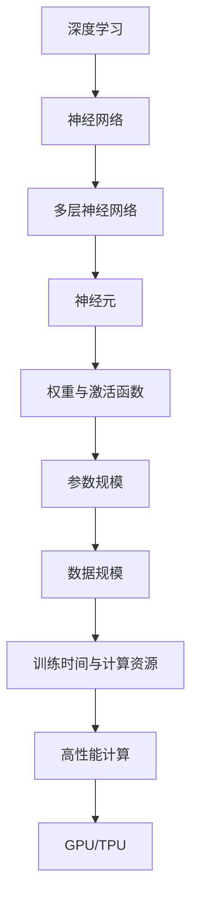
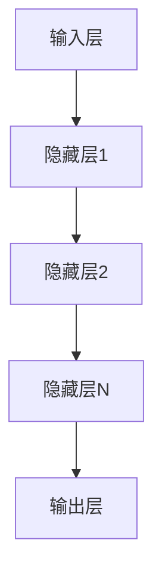

                 

### 大模型的基本概念

大模型是指拥有巨大参数规模和复杂结构的机器学习模型，通过训练数以亿计的参数来理解和生成数据。这些模型主要包括深度神经网络、循环神经网络（RNN）、变换器（Transformer）等。

#### 核心概念与联系

- **深度学习**：大模型的基础技术，通过多层神经网络对数据进行特征提取和预测。
- **神经网络**：由多个神经元组成的计算单元，通过权重和激活函数实现输入到输出的映射。
- **海量数据训练**：大模型训练的关键，通过大量数据进行学习，提高模型的泛化能力。
- **高性能计算**：大模型训练需要巨大的计算资源，利用GPU、TPU等硬件加速训练。



#### 核心算法原理讲解

```plaintext
// 伪代码：大模型的训练过程
function train_large_model(data, labels):
    # 初始化模型参数
    initialize_parameters()

    # 迭代训练
    for epoch in 1 to MAX_EPOCHS:
        for batch in data:
            # 计算损失
            loss = compute_loss(batch, parameters)

            # 更新参数
            update_parameters(loss, learning_rate)
```

### 1.2 大模型的应用场景

大模型在多个领域展示了强大的应用潜力，以下是一些典型应用场景：

#### 自然语言处理

- **语言模型**：例如GPT-3，用于生成文本、翻译、问答等。
- **文本分类**：例如新闻分类、情感分析等。

#### 计算机视觉

- **图像分类**：例如识别猫狗、车辆等。
- **目标检测**：例如人脸识别、行人检测等。
- **图像生成**：例如风格迁移、人脸生成等。

#### 语音识别与生成

- **语音识别**：例如语音到文本转换。
- **语音合成**：例如文本到语音转换。

### 1.3 大模型的核心架构

大模型通常由以下几个部分组成：

- **输入层**：接收外部数据，例如文本、图像、音频等。
- **隐藏层**：实现特征提取和变换，层与层之间可能使用不同的架构，如卷积神经网络（CNN）或循环神经网络（RNN）。
- **输出层**：根据模型的类型产生预测或决策。



## 第一部分总结

本部分对大模型的基本概念、应用场景和核心架构进行了详细阐述。了解这些基本概念和架构对于深入探讨需求收集渠道多元化至关重要。

----------------------------------------------------------------

## 第二部分：需求收集的概念

## 2.1 需求收集的重要性

### 2.1.1 有效的需求收集对项目成功的影响

有效的需求收集是项目成功的关键因素。以下是一些具体影响：

- **提升产品满意度**：准确的需求可以确保产品功能满足用户需求，从而提高用户满意度。
- **降低开发风险**：通过需求收集，可以提前识别潜在问题，降低项目风险。
- **提高开发效率**：明确的需求可以减少返工和调整，提高开发效率。

### 2.1.2 需求收集的方法与步骤

需求收集通常包括以下几个步骤：

1. **需求识别**：识别用户、市场和其他来源的需求。
2. **需求分析**：对收集到的需求进行分类、排序和分析。
3. **需求文档**：编写详细的文档，包括需求描述、优先级和约束条件。
4. **需求确认**：与利益相关者确认需求的准确性和可行性。

## 2.2 需求收集的渠道

需求收集的渠道多种多样，以下是几种常见的方法：

### 2.2.1 用户调研

用户调研是获取用户需求的重要手段。可以通过以下方式进行：

- **问卷调查**：设计问卷，收集用户反馈。
- **访谈**：与用户进行一对一访谈，深入了解需求。
- **用户行为分析**：分析用户在产品中的行为，发现潜在需求。

### 2.2.2 市场研究

市场研究可以帮助了解市场需求和竞争环境。可以通过以下方式进行：

- **竞争对手分析**：分析竞争对手的产品和策略。
- **行业报告**：查阅行业报告，了解市场趋势。
- **用户访谈**：与行业专家和潜在用户进行访谈。

### 2.2.3 竞争对手分析

竞争对手分析可以帮助了解市场动态和用户需求。可以通过以下方式进行：

- **产品对比**：对比竞争对手的产品功能、性能和用户体验。
- **用户调研**：了解竞争对手的用户反馈和需求。
- **专利分析**：分析竞争对手的专利技术，预测未来趋势。

### 2.2.4 用户反馈与体验测试

用户反馈和体验测试是验证需求的重要环节。可以通过以下方式进行：

- **用户反馈收集**：通过在线反馈、用户评论等渠道收集用户反馈。
- **A/B测试**：通过对比不同版本的产品，验证需求的可行性和效果。
- **用户体验测试**：邀请用户参与测试，收集用户体验数据。

## 第二部分总结

本部分介绍了需求收集的重要性以及常用的需求收集渠道。有效的需求收集对于大模型应用开发至关重要，有助于提高产品的市场竞争力。

----------------------------------------------------------------

## 第三部分：多元化需求收集渠道的应用

## 3.1 多元化需求收集的优势

多元化需求收集渠道可以带来以下优势：

### 3.1.1 提高需求的全面性和准确性

通过多种渠道收集需求，可以更全面、准确地了解用户和市场情况，减少信息遗漏和偏见。

### 3.1.2 降低项目风险和成本

多元化的需求收集可以帮助提前识别潜在问题和风险，降低项目失败的可能性，从而减少成本。

### 3.1.3 促进创新和产品迭代

多元化的需求收集可以激发创新思维，推动产品不断优化和迭代，提升竞争力。

## 3.2 多元化需求收集的挑战

尽管多元化需求收集具有优势，但也面临以下挑战：

### 3.2.1 数据质量与真实性

不同渠道收集到的数据可能存在质量差异，需要确保数据真实可靠。

### 3.2.2 资源与成本投入

多元化需求收集需要投入更多资源和成本，特别是在大模型应用开发中，数据收集和分析可能需要较高的计算资源和时间。

### 3.2.3 均衡不同渠道的需求

在多元化需求收集过程中，需要平衡不同渠道的需求，确保所有需求得到充分考虑。

## 3.3 多元化需求收集的实施策略

为了有效实施多元化需求收集，可以采取以下策略：

### 3.3.1 设计科学的调查问卷

设计科学的调查问卷是用户调研的关键。需要确保问卷结构清晰、问题具体，以获取有效用户反馈。

### 3.3.2 利用数据分析工具

利用数据分析工具可以对收集到的数据进行处理和分析，提取有价值的信息，为需求收集提供支持。

### 3.3.3 建立用户反馈机制

建立用户反馈机制可以持续收集用户反馈，及时了解用户需求和产品问题，为产品优化提供依据。

### 3.3.4 结合市场趋势与用户需求

在需求收集过程中，需要结合市场趋势和用户需求，确保产品符合市场需求，同时满足用户期望。

## 第三部分总结

本部分讨论了多元化需求收集的优势、挑战和实施策略。通过多元化需求收集，可以更全面、准确地了解用户和市场情况，为大模型应用开发提供有力支持。

----------------------------------------------------------------

## 第四部分：案例研究

### 4.1 案例介绍

#### 4.1.1 案例背景

某知名互联网公司计划开发一款基于大模型的应用程序，旨在提供智能客服服务。该应用程序需要具备处理多语言、多场景的对话能力，同时确保用户体验良好。

#### 4.1.2 案例目标

通过多元化需求收集渠道，全面了解用户需求和市场情况，确保应用程序在功能、性能和用户体验方面达到预期目标。

### 4.2 需求收集渠道的多元化实践

#### 4.2.1 用户调研实施过程

- **问卷调查**：设计了一份详细的问卷调查，涵盖了用户的基本信息、使用习惯、对智能客服的需求和期望等方面。通过线上渠道发送问卷，收集了1000份有效反馈。
- **用户访谈**：邀请部分用户进行一对一访谈，深入了解用户对智能客服的使用场景、问题和期望。共进行了50次访谈，获得了丰富的一手资料。
- **用户行为分析**：通过分析用户在现有客服系统中的行为数据，发现了用户在交流过程中最常遇到的问题和需求。

#### 4.2.2 市场研究数据收集与分析

- **竞争对手分析**：对比分析了主要竞争对手的产品功能、性能和用户体验，识别了自身产品需要改进的方面。
- **行业报告**：查阅了相关行业报告，了解智能客服市场的趋势和发展方向。
- **市场调研**：通过问卷调查和访谈的方式，收集了100名潜在用户对智能客服的需求和期望。

#### 4.2.3 竞争对手分析结果

- **功能对比**：发现竞争对手在多语言支持、情感分析、自定义回复等方面存在不足。
- **用户体验**：用户对现有智能客服的满意度较低，主要问题包括响应速度慢、理解能力差等。
- **市场趋势**：智能客服市场呈快速增长趋势，用户对智能客服的需求不断增加。

#### 4.2.4 用户反馈与体验测试效果

- **用户反馈**：用户对智能客服的功能和体验提出了多项改进建议，如增加多语言支持、提高响应速度、优化对话界面等。
- **体验测试**：邀请50名用户参与体验测试，通过对比不同版本的应用程序，评估了用户体验和满意度。最终确定了最符合用户需求的版本。

### 4.3 案例总结与启示

#### 4.3.1 案例总结

通过多元化需求收集渠道，该公司全面了解了用户需求和市场情况，为智能客服应用程序的开发提供了有力支持。以下是一些关键发现：

- **用户需求**：用户对智能客服的多语言支持、响应速度和用户体验有较高期望。
- **市场趋势**：智能客服市场前景广阔，但用户对现有产品的满意度较低。
- **改进方向**：通过优化功能、性能和用户体验，可以提高智能客服的竞争力。

#### 4.3.2 启示

- **多元化需求收集的重要性**：多元化的需求收集渠道可以提供更全面、准确的信息，有助于项目成功。
- **用户调研与市场研究相结合**：用户调研和市
```

## 附录

### 附录 A：需求收集工具与资源

#### A.1 用户调研工具

- **问卷调查工具**：如Google表单、SurveyMonkey、问卷星等。
- **访谈工具**：如Zoom、Skype、微信等。
- **用户行为分析工具**：如Google Analytics、Mixpanel、Heap等。

#### A.2 市场研究工具

- **竞争对手分析工具**：如SimilarWeb、Ahrefs、 SEMrush等。
- **行业报告资源**：如市场调研机构报告、行业网站等。
- **市场调研工具**：如SurveyMonkey、Zoomerang等。

#### A.3 数据分析工具

- **数据分析软件**：如Tableau、Power BI、Google Data Studio等。
- **机器学习库**：如scikit-learn、TensorFlow、PyTorch等。
- **数据分析平台**：如AWS、Google Cloud、Azure等。

#### A.4 用户反馈机制设计

- **在线反馈系统**：如UserVoice、Zendesk等。
- **社交媒体监控**：如Hootsuite、Brandwatch等。
- **用户体验测试工具**：如UsabilityHub、UserTesting等。

### 附录 B：大模型应用开发参考资源

- **开源大模型框架**：如TensorFlow、PyTorch、Transformers等。
- **机器学习教程**：如Coursera、Udacity、edX等在线课程。
- **大模型论文**：如arXiv、NeurIPS、ICML等学术会议论文集。
- **技术博客**：如Medium、 Towards Data Science、AI Digest等。

### 附录 C：需求收集与市场调研最佳实践

- **用户调研技巧**：如何设计有效问卷、如何进行深度访谈等。
- **市场研究方法**：如何分析竞争对手、如何解读行业报告等。
- **数据分析技巧**：如何处理和可视化数据、如何应用机器学习等。

### 附录 D：注意事项

- **数据隐私与保护**：在进行需求收集时，务必遵守相关法律法规，保护用户隐私。
- **需求优先级**：在收集大量需求后，需要根据重要性和可行性进行优先级排序。
- **持续反馈与迭代**：需求收集不是一次性的工作，需要持续收集用户反馈，不断优化产品。

### 附录 E：拓展阅读

- **相关书籍**：《需求工程与管理》、《市场调研实务》、《数据科学实战》等。
- **在线资源**：各类技术社区、博客、论坛等，如Stack Overflow、GitHub、Reddit等。

作者：AI天才研究院/AI Genius Institute & 禅与计算机程序设计艺术 /Zen And The Art of Computer Programming

