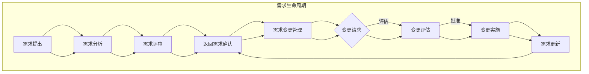

                 


### 背景介绍

在大模型应用开发中，需求追踪技术起着至关重要的作用。随着人工智能技术的快速发展，大模型在各个领域的应用日益广泛，从自然语言处理到计算机视觉，从推荐系统到生成对抗网络，大模型已经成为推动技术创新的重要力量。然而，大模型的开发和应用过程面临着一系列复杂的挑战，其中之一就是需求追踪。

需求追踪是指在软件开发过程中，对需求从提出、分析、设计、实现到测试的全过程进行跟踪和管理的技术。在大模型应用开发中，需求追踪不仅关系到项目的进度和质量，还直接影响到最终应用的性能和用户体验。由于大模型具有数据规模大、模型参数多、训练时间长等特点，需求管理的复杂性显著增加。因此，如何有效地进行需求追踪，成为大模型应用开发中的一个关键问题。

首先，大模型的开发通常涉及多个团队和多个阶段，从数据收集、预处理、模型设计、训练到部署，每个阶段都需要对需求进行详细的管理和追踪。在这个过程中，需求的变更和调整是常态，如何快速、准确地响应这些变更，保证项目的顺利进行，是需求追踪需要解决的核心问题之一。

其次，大模型的应用场景多样，不同应用场景对需求的侧重点和优先级也有所不同。例如，在医疗领域，对模型的准确性和鲁棒性有较高的要求；而在娱乐领域，对模型的创意性和多样性有更高的期望。因此，如何根据不同的应用场景进行需求的定位和管理，是大模型需求追踪的另一个挑战。

此外，大模型的开发和部署往往需要庞大的计算资源和存储资源，这对需求追踪的效率和准确性也提出了更高的要求。传统的需求追踪技术在大模型环境下可能面临性能瓶颈，如何利用现代技术，如大数据处理、云计算和分布式计算，提升需求追踪的效率，也是需求追踪技术发展的重要方向。

综上所述，大模型应用开发中的需求追踪技术不仅需要解决传统需求追踪中存在的问题，还需要适应大模型的特点和挑战，提出新的解决方案。接下来，我们将深入探讨需求追踪的核心概念、架构设计、算法原理、实践应用以及未来展望，以期为读者提供全面的技术指导和思考。

### 需求追踪的核心概念与联系

在深入探讨需求追踪技术之前，首先需要理解需求追踪的核心概念及其相互关系。需求追踪是指在软件开发生命周期中，对需求进行识别、记录、管理和跟踪的过程。以下是需求追踪中几个关键的核心概念及其联系：

#### 需求（Requirement）

需求是软件项目的基础，它定义了软件系统应该做什么。一个需求可以是功能性的，也可以是非功能性的。功能性需求描述软件应具有的具体功能，如“系统应支持用户登录”。非功能性需求则关注软件的性能、安全性和用户体验，如“系统响应时间应小于2秒”。

#### 需求类型（Requirement Types）

需求可以根据来源和内容进行分类。常见的需求类型包括：

- **用户需求**：直接来自最终用户的需求，反映了用户希望软件实现的功能和特性。
- **业务需求**：由业务分析师根据企业战略和目标转化而来的需求，旨在满足业务流程和目标。
- **系统需求**：描述软件系统应满足的技术约束和规范，如编程语言、数据库系统等。

#### 需求生命周期（Requirement Lifecycle）

需求从提出到实现经历多个阶段，包括：

- **需求提出**：识别和记录需求。
- **需求分析**：理解需求并形成文档。
- **需求评审**：评估需求的可行性、完整性和一致性。
- **需求确认**：确认需求是否满足用户和业务需求。
- **需求变更管理**：需求在开发过程中可能会发生变化，需要进行变更管理，确保变更得到正确处理。

#### 需求变更管理（Requirement Change Management）

需求变更管理是需求生命周期中的重要环节，包括：

- **变更请求**：提出需求变更。
- **变更评估**：评估变更对项目的影响。
- **变更批准**：决定是否接受变更。
- **变更实施**：根据批准的变更进行需求调整和项目计划更新。

#### 需求优先级和风险评估（Requirement Priority and Risk Assessment）

在需求管理中，确定需求的优先级和进行风险评估是非常重要的。需求的优先级通常基于其对业务价值和实现难度的评估。高风险需求需要优先处理，以确保项目的顺利进行。

#### 需求文档（Requirement Documentation）

需求文档是需求管理的核心输出，包括需求规格说明、用户故事、用例图等。这些文档不仅用于项目团队内部交流，也是后续设计和开发的基础。

#### 需求与项目管理的联系

需求追踪与项目管理密切相关。项目管理中的关键活动，如项目计划、进度控制和风险管理，都需要基于需求文档和需求追踪数据进行。有效的需求追踪有助于确保项目按时交付，满足业务和用户需求。

#### Mermaid 流程图

为了更直观地理解需求追踪的核心概念和关系，我们可以使用 Mermaid 流程图来表示需求的生命周期和变更管理流程。



通过上述核心概念和关系的探讨，我们可以更好地理解需求追踪在软件开发中的重要性。接下来，我们将进一步探讨需求追踪的架构设计，分析如何通过合理的架构设计来提升需求追踪的效率和质量。

#### 需求追踪的架构设计

需求追踪系统的架构设计是实现高效需求管理的关键。一个良好的架构能够确保需求的提出、分析、实现和变更等环节都能顺畅进行，从而提高项目的整体质量和效率。以下是对需求追踪系统设计原则、技术架构、数据库设计、以及需求追踪与项目管理工具集成的详细探讨。

##### 设计原则

1. **模块化与可扩展性**：需求追踪系统应采用模块化设计，以便于系统扩展和维护。模块化设计使得系统能够灵活地适应需求的变化，同时便于功能的独立开发和更新。

2. **可重用性**：系统设计应注重组件的重用性，减少重复开发的工作量。例如，需求建模模块可以独立开发，并在多个项目中复用。

3. **用户友好性**：需求追踪系统应具备良好的用户界面，简化用户操作，提高使用效率。用户友好的界面不仅能够提升用户体验，还能降低培训成本。

4. **数据一致性**：系统应确保数据的一致性和完整性，避免数据冗余和冲突。通过数据校验机制和事务管理，确保数据的准确性和可靠性。

5. **安全性**：需求追踪系统需要具备较高的安全性，防止未经授权的访问和数据的泄露。应实施访问控制、加密存储和日志记录等安全措施。

##### 技术架构

需求追踪系统的技术架构通常包括以下几个层次：

1. **表示层（Presentation Layer）**：负责用户界面的展示和交互。可以使用Web框架（如Django、Spring Boot）来构建，提供用户友好的操作界面。

2. **业务逻辑层（Business Logic Layer）**：处理业务逻辑，包括需求的创建、修改、删除、查询等操作。可以使用服务层（Service Layer）或控制器（Controller）来实现。

3. **数据访问层（Data Access Layer）**：负责与数据库的交互，实现数据的存储和检索。可以使用ORM（对象关系映射）工具（如Hibernate、Entity Framework）来简化数据访问。

4. **数据库层（Database Layer）**：存储需求相关的数据，包括需求信息、用户信息、项目信息等。数据库的选择应根据系统的需求和性能要求进行。

##### 数据库设计

数据库设计是需求追踪系统的核心，直接影响到系统的性能和数据管理。以下是一些数据库设计的关键点：

1. **实体关系模型**：根据需求类型和需求生命周期设计实体关系模型，如需求表（Requirements）、用户表（Users）、项目表（Projects）等。

2. **索引设计**：合理设计索引，提高数据查询的效率。例如，在需求表中创建索引以提高对需求名称或优先级的查询性能。

3. **事务处理**：确保数据库操作的一致性和完整性。通过事务管理，实现多表操作的一致性，防止数据冲突。

4. **存储优化**：根据需求的特点和访问模式，进行存储优化。例如，对频繁查询的数据进行缓存，减少数据库的负载。

##### 需求追踪与项目管理工具的集成

在现代软件开发中，需求追踪系统通常需要与其他项目管理工具集成，以实现更全面的项目管理。以下是一些常见的集成方式：

1. **集成接口**：通过API（应用程序编程接口）或其他集成方式，将需求追踪系统与项目管理工具（如Jira、Trello）进行连接。这样，项目团队成员可以在一个统一的平台上进行需求管理、任务分配和进度跟踪。

2. **单点登录**：实现需求追踪系统与其他工具的单点登录功能，方便用户在不同工具间切换，提高工作效率。

3. **数据同步**：实现需求数据在不同工具间的同步，确保数据的实时更新。例如，将需求追踪系统中的需求状态同步到项目管理工具的看板上。

4. **工作流集成**：将需求追踪系统与其他工具的工作流进行集成，实现自动化审批和任务流转。例如，当需求状态发生变化时，自动触发相应的审批流程。

通过合理的架构设计、数据库设计和工具集成，需求追踪系统能够有效地支持大模型应用开发的需求管理。一个高效、灵活和用户友好的需求追踪系统，不仅能够提高项目的交付效率，还能显著提升团队协作和项目管理的效果。

### 需求追踪的算法原理

在需求追踪系统中，算法原理起到了关键作用，它们不仅决定了系统的效率，还影响了需求的准确性和可靠性。以下是需求追踪中的几种核心算法原理，包括需求匹配算法、需求优先级排序算法、需求变更检测算法以及需求风险评估算法。我们将通过伪代码和数学模型详细解释这些算法原理，并通过实例进行分析。

#### 需求匹配算法

需求匹配算法用于将用户提出的需求与现有系统需求进行匹配，以确定哪些需求已经实现，哪些需求需要进一步开发。以下是一个简化的需求匹配算法伪代码：

```python
function demand_matching(demand_list, project_requirements):
    matched_demands = []
    for demand in demand_list:
        for requirement in project_requirements:
            if matches(demand, requirement):
                matched_demands.append((demand, requirement))
    return matched_demands

function matches(demand, requirement):
    return demand['description'] == requirement['description']
```

在这个算法中，`demand_list` 是用户提出的需求列表，`project_requirements` 是现有系统需求列表。`matches` 函数用于比较需求和需求的描述是否匹配。

#### 需求优先级排序算法

需求优先级排序算法用于根据需求的业务价值和实现难度对需求进行排序，以便项目团队可以优先处理高优先级的需求。以下是一个简单的优先级排序算法伪代码：

```python
function demand_priority_sort(demand_list):
    sorted_list = sorted(demand_list, key=lambda x: x['priority'], reverse=True)
    return sorted_list
```

在这个算法中，`demand_list` 是需求列表，`priority` 是每个需求的优先级属性。排序函数根据优先级对需求列表进行降序排序。

#### 需求变更检测算法

需求变更检测算法用于监控需求的变化，并触发相应的变更管理流程。以下是一个简化的变更检测算法伪代码：

```python
function demand_change_detection(original_demand, new_demand):
    return original_demand['description'] != new_demand['description']
```

在这个算法中，`original_demand` 是原始需求，`new_demand` 是新需求。如果需求的描述发生了变化，则返回`True`，表示需求发生了变更。

#### 需求风险评估算法

需求风险评估算法用于评估每个需求的风险，并确定哪些需求需要额外的关注和资源。以下是一个简化的风险评估算法伪代码：

```python
function demand_risk_assessment(demand):
    risk_score = 0
    if 'complexity' in demand:
        risk_score += demand['complexity']
    if 'deadline' in demand:
        risk_score += demand['deadline']
    if 'dependencies' in demand:
        risk_score += len(demand['dependencies'])
    return risk_score
```

在这个算法中，`demand` 是需求对象，`complexity`、`deadline` 和 `dependencies` 是需求属性，用于评估需求的复杂度、截止日期和依赖关系。风险评分越高，需求的风险越大。

#### 数学模型与公式

为了更精确地描述需求追踪的算法原理，我们可以使用数学模型和公式。

1. **需求优先级计算公式**

   $$ \text{需求优先级} = \frac{\text{需求价值}}{\text{需求风险}} $$

   其中，`需求价值`和`需求风险`可以通过专家评估或历史数据来计算。

2. **需求变更影响评估公式**

   $$ \text{需求变更影响评估} = \sum_{i=1}^{n} (\text{需求依赖度}_{i} \times \text{变更影响}_{i}) $$

   其中，`需求依赖度`和`变更影响`用于评估需求变更对项目整体的影响。

#### 实例分析

假设有一个需求追踪系统，用户提出了以下三个需求：

1. 需求A：系统应支持用户登录。
2. 需求B：系统应提供搜索功能。
3. 需求C：系统应支持多语言界面。

现有系统需求如下：

1. 系统需求1：系统支持用户登录。
2. 系统需求2：系统提供搜索功能。
3. 系统需求3：系统支持英语界面。

**需求匹配算法**：通过需求匹配算法，可以确定需求A和系统需求1、需求B和系统需求2匹配，而需求C与现有系统需求不匹配。

**需求优先级排序算法**：根据需求的重要性和实现难度，需求A和需求B的优先级较高，需求C的优先级较低。

**需求变更检测算法**：如果用户提出的需求C后来变为“系统应支持中文界面”，则需求C发生了变更，因为其描述从“多语言界面”变为了“中文界面”。

**需求风险评估算法**：假设需求C的复杂度为3，截止日期为两周，无依赖关系，则其风险评分为6。

通过这些算法，需求追踪系统能够有效地对需求进行匹配、排序、变更检测和风险评估，从而支持大模型应用开发中的需求管理。

### 需求追踪的实践应用

在了解需求追踪的理论和算法之后，接下来我们将探讨需求追踪在大模型应用开发中的具体实践应用。以下是需求收集与需求分析、需求实现与验证、需求变更管理以及实际案例分析的详细讲解。

#### 需求收集与需求分析

需求收集是需求追踪的第一步，直接影响到后续的整个开发过程。在大模型应用开发中，需求收集需要综合考虑用户需求、业务目标和现有系统能力。以下是一些常见的需求收集方法：

1. **用户访谈**：通过与最终用户进行一对一访谈，了解他们的使用习惯、需求和痛点，收集真实的用户反馈。
2. **问卷调查**：设计问卷，通过在线或纸质方式收集大量用户的需求信息。
3. **焦点小组**：组织一组代表用户，进行集中讨论，挖掘用户深层次的需求和期望。
4. **需求文档审查**：审查已有的业务文档，如市场分析报告、产品需求文档等，提取关键需求点。

在需求收集完成后，需要进行需求分析。需求分析的目标是明确需求的具体内容、范围和优先级。以下是一些常用的需求分析工具和方法：

1. **用户故事地图**：将用户故事按照业务流程和组织结构进行可视化，帮助团队理解整个系统的需求。
2. **用例图**：描述系统中不同角色与系统交互的场景，明确系统的功能需求。
3. **功能矩阵**：将需求按照功能模块进行分类和优先级排序，便于团队进行任务分配和进度跟踪。

#### 需求实现与验证

在需求分析完成后，进入需求实现阶段。在大模型应用开发中，需求实现涉及到模型设计、训练和部署等多个环节。以下是一些关键步骤：

1. **模型设计**：根据需求分析的结果，设计大模型的架构和参数。这一步骤需要结合业务目标和数据特性，选择合适的人工神经网络结构、损失函数和优化算法。
2. **模型训练**：使用收集到的数据进行模型训练，通过迭代优化模型参数，提高模型的预测性能。这一步骤通常需要大量的计算资源和时间。
3. **模型验证**：在训练数据集和验证数据集上评估模型的性能，确保模型在多个维度上满足需求。常用的验证指标包括准确率、召回率、F1分数等。
4. **模型部署**：将验证通过的模型部署到生产环境，提供实际业务功能。部署过程中需要考虑模型的版本管理、性能监控和故障恢复等。

#### 需求变更管理

在大模型应用开发过程中，需求变更是一个常见且不可避免的现象。有效的需求变更管理能够确保项目能够快速响应变更，同时保持项目的整体进度和质量。以下是一些需求变更管理的实践方法：

1. **变更请求流程**：建立变更请求流程，明确变更的提出、评估、批准和实施的步骤，确保变更请求的规范化和流程化。
2. **变更影响评估**：在变更实施前，评估变更对项目各方面（如时间、成本、质量、资源等）的影响，确保变更的可行性和合理性。
3. **版本控制**：使用版本控制系统（如Git）对需求和代码进行版本控制，确保变更的历史记录可追溯，便于后续的变更管理和问题定位。
4. **沟通协作**：通过团队沟通和协作，确保变更的需求和实施方案得到所有相关人员的认可和理解。

#### 实际案例分析

以下是一个实际案例分析，展示需求追踪在大模型应用开发中的具体实践。

**案例背景**：某公司开发一款智能客服系统，通过大模型实现自然语言处理和对话管理，以提高客户服务质量和效率。

**需求收集**：通过用户访谈和问卷调查，收集到以下主要需求：
- 支持多语言客服。
- 提供快速准确的回答。
- 具备情感理解和回应能力。

**需求分析**：通过用户故事地图和用例图，将需求分解为具体的功能模块：
- 自然语言处理模块：支持多语言文本处理，包括分词、词性标注、命名实体识别等。
- 对话管理模块：理解用户意图，生成合适的回复，同时管理对话状态和上下文。

**模型设计**：设计基于双向长短期记忆网络（Bi-LSTM）的对话模型，结合注意力机制，提高对话的连贯性和准确性。

**模型训练**：使用大规模对话数据集进行训练，通过迭代优化模型参数，提高模型的对话性能。

**模型验证**：在训练数据集和验证数据集上评估模型性能，使用BLEU分数和ROUGE分数等指标衡量模型的回答质量。

**模型部署**：将验证通过的模型部署到生产环境，通过API接口提供服务。

**需求变更管理**：在项目开发过程中，用户提出新增需求“支持语音识别和合成”。通过变更请求流程，评估变更的可行性和影响，最终决定在下一版本中实现这一需求。

通过以上实际案例分析，我们可以看到需求追踪在大模型应用开发中的重要性。有效的需求追踪不仅有助于确保项目的顺利进行，还能提高系统的质量和服务水平。

#### 需求追踪工具与平台

在需求追踪的大模型应用开发中，选择合适的工具和平台是确保项目顺利进行的关键。以下是对常见需求追踪工具的介绍、平台选择与评估、开源需求追踪工具的实践，以及功能优化的详细探讨。

##### 常见需求追踪工具

1. **Jira**
   - **特点**：Jira 是一款功能强大的需求追踪和管理工具，支持敏捷开发方法，提供任务管理、项目进度跟踪和协作功能。
   - **适用场景**：适合大型项目和多个团队的协作需求。

2. **Trello**
   - **特点**：Trello 是一款直观的看板式需求追踪工具，通过卡片和列表的形式管理需求，便于任务分配和进度跟踪。
   - **适用场景**：适合小型团队和项目，尤其是需要可视化任务进度的场景。

3. **Asana**
   - **特点**：Asana 是一款灵活的任务管理工具，支持多种视图（如列表、看板、甘特图等），便于团队协作和项目跟踪。
   - **适用场景**：适合跨部门协作的大型项目。

4. **Microsoft Azure DevOps**
   - **特点**：Azure DevOps 是一款综合性的开发平台，提供需求管理、项目规划、测试管理、持续集成和持续部署等功能。
   - **适用场景**：适合企业级开发团队，特别是需要整合多种开发工具和流程的场景。

##### 平台选择与评估

在选择需求追踪平台时，需要综合考虑以下几个因素：

1. **功能需求**：根据项目需求，选择具有所需功能（如任务管理、需求优先级排序、变更管理、集成等）的平台。
2. **易用性**：平台应具备良好的用户界面和操作体验，降低团队成员的学习和使用成本。
3. **扩展性**：平台应具备较高的扩展性，支持插件和定制开发，满足不同项目的特殊需求。
4. **性能**：平台应具备较高的性能，能够快速响应需求变更和任务分配，保证项目的顺利进行。
5. **安全性**：平台应具备严格的安全机制，保护项目数据和用户隐私。

在评估平台时，可以采用以下步骤：

1. **需求分析**：明确项目需求和目标，列出关键功能和要求。
2. **市场调研**：了解市场上主流的需求追踪平台，收集产品信息、用户评价和案例。
3. **试用评估**：通过试用或演示，评估平台的实际性能和用户体验。
4. **用户反馈**：收集团队成员和用户的反馈，评估平台的适用性和改进空间。
5. **决策**：根据评估结果，选择最符合项目需求的平台。

##### 开源需求追踪工具的实践

开源需求追踪工具具有成本低、灵活度高、可定制性强等优点，适合中小型项目和个人开发者。以下是一些常用的开源需求追踪工具及其实践：

1. **Redmine**
   - **特点**：Redmine 是一款开源的项目管理软件，支持多项目管理、需求管理、任务跟踪等功能。
   - **实践**：可以通过配置Redmine，搭建一个简易的需求追踪系统，适用于小型项目和团队协作。

2. **MantisBT**
   - **特点**：MantisBT 是一款开源的缺陷追踪系统，支持多项目管理、需求管理、版本管理等。
   - **实践**：可以将MantisBT 与其他开源工具（如Git、Jenkins）集成，实现一个完整的需求追踪和开发流程。

3. **Trac**
   - **特点**：Trac 是一款开源的项目管理工具，支持需求管理、代码库管理、任务跟踪等。
   - **实践**：可以通过配置Trac，搭建一个功能完善的需求追踪平台，适用于中小型项目的需求管理。

##### 功能优化

为了提升需求追踪工具的功能和用户体验，可以采用以下策略：

1. **自定义字段和视图**：根据项目需求，自定义需求字段和视图，使需求管理更加灵活和直观。
2. **自动化流程**：通过配置自动化流程，实现需求的自动创建、分配、变更和通知，减少人工操作和错误。
3. **集成其他工具**：通过API或其他集成方式，将需求追踪工具与代码库、持续集成和部署工具集成，实现一站式项目管理。
4. **数据分析与报表**：通过数据分析功能，生成需求状态报表和趋势分析，帮助项目团队更好地掌握项目进展和风险。

通过合理选择和使用需求追踪工具与平台，结合功能优化，可以显著提升大模型应用开发中的需求管理水平，确保项目的顺利进行和成功交付。

### 未来展望与挑战

随着人工智能技术的迅猛发展，大模型应用开发中的需求追踪技术面临着前所未有的机遇和挑战。展望未来，需求追踪技术将在以下几个方面迎来重要的变革和发展。

#### 技术发展趋势

1. **智能化需求分析**：未来的需求追踪技术将更加智能化，通过自然语言处理、机器学习等技术，自动分析用户需求，提高需求识别的准确性和效率。

2. **自动化变更管理**：借助人工智能技术，需求变更的检测、评估和实施将变得更加自动化，减少人工干预，提高变更管理的效率。

3. **多模型融合**：结合多种人工智能模型，如深度学习、强化学习等，实现更精准的需求预测和优化，为项目管理和决策提供更强有力的支持。

4. **区块链应用**：利用区块链技术，实现需求变更的可追溯性和透明性，提升需求管理的安全性和可靠性。

5. **云计算与边缘计算**：结合云计算和边缘计算技术，实现需求追踪的分布式处理，提高系统的可扩展性和响应速度。

#### 大模型应用开发中的需求追踪挑战

1. **需求复杂性增加**：大模型应用开发的需求涉及多个领域和层次，需求的复杂性显著增加，如何有效管理和追踪这些复杂需求成为一个重要挑战。

2. **数据隐私与安全**：在大模型应用中，数据隐私和安全问题尤为重要。如何在需求追踪过程中保护用户数据，防止数据泄露，是一个亟待解决的问题。

3. **计算资源需求**：大模型训练和部署需要庞大的计算资源，这对需求追踪系统的性能和稳定性提出了更高的要求。

4. **跨领域协作**：大模型应用开发通常涉及多个团队和领域，跨领域协作的需求管理变得更加复杂，如何实现高效的需求沟通和协作是一个关键问题。

#### 需求追踪技术在行业中的应用前景

1. **金融行业**：在金融行业，需求追踪技术可以帮助金融机构优化风险管理流程，提高金融产品的开发效率和用户体验。

2. **医疗健康**：在医疗健康领域，需求追踪技术可以辅助医疗机构开发智能医疗系统，提升医疗服务的质量和效率。

3. **智能制造**：在智能制造领域，需求追踪技术可以支持生产线的智能化改造，优化生产流程，提升生产效率。

4. **智能交通**：在智能交通领域，需求追踪技术可以协助城市交通管理部门优化交通管理策略，提升城市交通的运行效率和安全性。

#### 未来研究方向

1. **需求建模与预测**：研究更高效的需求建模方法和需求预测算法，提高需求的准确性和前瞻性。

2. **需求变更自动化**：探索自动化需求变更检测、评估和实施的方法，减少人工干预，提高变更管理的效率。

3. **跨领域需求协同**：研究跨领域需求协同管理技术，实现不同领域需求的无缝整合和协同优化。

4. **隐私保护与安全**：研究需求追踪过程中的数据隐私保护和安全机制，提升系统的安全性和可靠性。

总之，随着人工智能技术的不断进步，需求追踪技术在未来的大模型应用开发中将继续发挥重要作用。面对机遇和挑战，需求追踪技术的研究和应用将不断深入和拓展，为各行业的创新发展提供有力支持。

### 文章小结

本文详细探讨了《大模型应用开发中的需求追踪技术》，通过逐步分析需求追踪的核心概念、架构设计、算法原理、实践应用以及未来展望，为读者提供了一个全面的需求追踪技术图谱。以下是文章的主要结论和总结：

1. **需求追踪的重要性**：需求追踪在大模型应用开发中至关重要，它不仅关系到项目的进度和质量，还直接影响到最终应用的性能和用户体验。

2. **核心概念与联系**：需求追踪涉及需求、需求类型、需求生命周期、需求变更管理、需求优先级和风险评估等核心概念，这些概念相互联系，共同构成了需求追踪的理论基础。

3. **架构设计**：需求追踪系统的架构设计原则包括模块化与可扩展性、可重用性、用户友好性、数据一致性和安全性。通过合理的技术架构和数据库设计，可以实现高效的需求管理。

4. **算法原理**：需求追踪算法包括需求匹配算法、需求优先级排序算法、需求变更检测算法和需求风险评估算法。通过伪代码和数学模型，详细阐述了这些算法的实现原理和应用场景。

5. **实践应用**：需求追踪在大模型应用开发中的实践应用包括需求收集与需求分析、需求实现与验证、需求变更管理和实际案例分析，展示了需求追踪在项目中的具体应用。

6. **未来展望**：随着人工智能技术的不断发展，需求追踪技术将面临智能化、自动化、多模型融合、区块链应用和云计算与边缘计算等新趋势，同时也会遇到需求复杂性增加、数据隐私与安全、计算资源需求等挑战。

**注意事项**：

1. **选择合适的工具和平台**：在需求追踪过程中，选择合适的工具和平台至关重要，应根据项目需求和团队实际情况进行选择和评估。

2. **重视需求变更管理**：需求变更是项目开发中的常态，有效的需求变更管理能够确保项目顺利进行，减少因需求变更带来的风险。

3. **确保数据安全与隐私**：在大模型应用中，数据安全和隐私保护尤为重要，需采取严格的数据保护措施和隐私保护机制。

**拓展阅读**：

1. **《软件需求工程》**：详细介绍了需求工程的理论和实践，对需求管理有全面的阐述。
2. **《人工智能需求工程》**：探讨了如何将人工智能技术应用于需求工程，提高需求管理的智能化水平。
3. **《需求跟踪工具与平台评估》**：提供了对市场上主要需求追踪工具和平台的详细评估和分析。

通过本文的探讨，希望能够为读者提供有价值的思考和实践指导，助力大模型应用开发中的需求追踪工作。希望读者在未来的项目中，能够结合本文的内容，更加高效地管理需求，推动项目的成功交付。作者：AI天才研究院/AI Genius Institute & 禅与计算机程序设计艺术 /Zen And The Art of Computer Programming。

### 文章摘要

本文围绕《大模型应用开发中的需求追踪技术》展开深入探讨，首先介绍了需求追踪在大模型应用开发中的重要性，随后详细阐述了需求追踪的核心概念、架构设计、算法原理、实践应用以及未来展望。文章结构清晰，内容丰富，涵盖了需求管理中的各个环节，包括需求收集与需求分析、需求实现与验证、需求变更管理，以及需求追踪工具与平台的选择与优化。此外，文章还结合实际案例，展示了需求追踪在大模型应用开发中的具体应用。通过本文的阅读，读者可以全面了解需求追踪技术在大模型应用开发中的关键作用，并掌握有效的需求管理策略。关键词：大模型、需求追踪、需求管理、算法原理、实践应用、未来展望。

