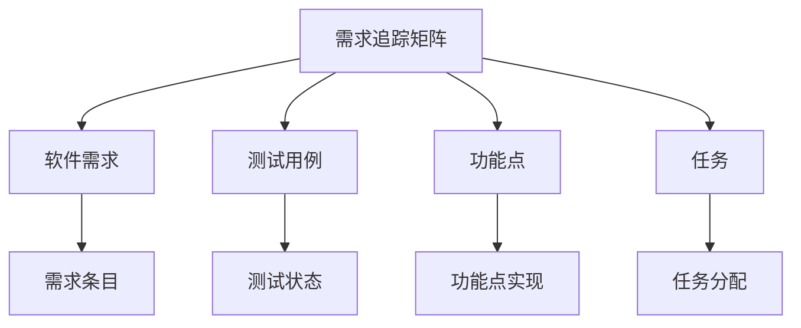

                 

### 文章标题：大模型应用开发中的需求追踪矩阵应用

> 关键词：大模型、需求追踪矩阵、应用开发、行业案例、技术创新

> 摘要：
本文旨在深入探讨大模型应用开发中的需求追踪矩阵应用。通过对大模型应用开发的背景介绍，需求追踪矩阵的概念解析，及其在实际应用中的详细剖析，本文揭示了需求追踪矩阵在大模型开发中的重要性，并通过实际案例展示了其在不同行业中的应用价值。文章最后对需求追踪矩阵的应用实践和未来发展趋势进行了展望，为读者提供了全面的指导。

## 目录

1. **大模型应用开发的背景**
    1.1 大模型应用开发的现状与趋势
    1.2 大模型应用开发的技术基础
    1.3 大模型应用开发的挑战与机遇
    1.4 大模型的基本类型与常见类型
2. **需求追踪矩阵的概念和原理**
    2.1 需求追踪矩阵的定义
    2.2 需求追踪矩阵的组成部分
    2.3 需求追踪矩阵的工作原理
    2.4 需求追踪矩阵与相关概念的关联架构图
3. **需求追踪矩阵在大模型应用开发中的应用**
    3.1 需求追踪矩阵在大模型设计中的应用
    3.2 需求追踪矩阵在大模型开发中的应用
    3.3 需求追踪矩阵在大模型训练中的应用
    3.4 需求追踪矩阵在大模型部署和维护中的应用
4. **需求追踪矩阵在行业应用中的案例研究**
    4.1 需求追踪矩阵在金融行业中的应用：风险管理和客户关系管理
    4.2 需求追踪矩阵在医疗行业中的应用：医疗数据分析和辅助诊断
    4.3 需求追踪矩阵在零售行业中的应用：库存管理和个性化推荐
5. **需求追踪矩阵的应用实践**
    5.1 需求追踪矩阵的应用流程
    5.2 需求追踪矩阵的应用工具
    5.3 需求追踪矩阵的应用效果评估
6. **需求追踪矩阵的未来发展趋势**
    6.1 需求追踪矩阵的技术创新
    6.2 需求追踪矩阵在行业中的应用前景
    6.3 需求追踪矩阵的未来展望

## 1. 大模型应用开发的背景

随着人工智能技术的快速发展，大模型（Large Models）已经在多个领域得到了广泛应用。大模型，通常指的是具有亿级别以上参数的深度学习模型，如BERT、GPT、ViT等。它们在自然语言处理、计算机视觉、语音识别等领域展示了强大的性能。

### 1.1 大模型应用开发的现状与趋势

当前，大模型应用开发已经成为各行业技术进步的重要驱动力。在自然语言处理领域，GPT-3、ChatGLM 等大模型已经可以生成高质量的文本，应用于智能客服、智能写作等领域。在计算机视觉领域，大模型如ResNet、EfficientNet等在图像分类、目标检测等方面取得了显著成果。此外，语音识别领域也受益于大模型的应用，如WaveNet在语音合成领域的突破。

### 1.2 大模型应用开发的技术基础

大模型应用开发离不开以下几个技术基础：

- **深度学习框架**：如TensorFlow、PyTorch等，提供了高效的计算和灵活的API，使得研究人员和开发者能够方便地构建和训练大模型。
- **计算资源**：大模型训练需要大量的计算资源，尤其是GPU和TPU等专用硬件加速器，这些资源在大模型训练过程中起到了关键作用。
- **数据集**：大模型训练依赖于大量的高质量数据集，数据集的质量和数量直接影响大模型的性能。

### 1.3 大模型应用开发的挑战与机遇

虽然大模型应用开发带来了许多机遇，但也面临诸多挑战：

- **计算资源需求**：大模型训练需要大量的计算资源，如何高效地利用计算资源是一个重要问题。
- **数据隐私与安全**：在训练和使用大模型时，涉及大量的敏感数据，如何保护数据隐私和安全是一个关键问题。
- **模型解释性**：大模型的黑箱特性使得其决策过程难以解释，如何提高大模型的可解释性是一个重要课题。

### 1.4 大模型的基本类型与常见类型

大模型可以分为以下几类：

- **语言模型**：如GPT、BERT等，用于处理自然语言任务。
- **视觉模型**：如ResNet、EfficientNet等，用于图像分类、目标检测等任务。
- **语音模型**：如WaveNet、Tacotron等，用于语音识别、语音合成等任务。

这些大模型在各自的领域展示了强大的性能，但它们的开发和应用也有其独特性。

## 2. 需求追踪矩阵的概念和原理

### 2.1 需求追踪矩阵的定义

需求追踪矩阵是一种用于管理和追踪软件需求的方法，它通过表格形式将软件需求与其相关联的测试用例、功能点、任务等联系起来。需求追踪矩阵可以帮助开发团队确保所有需求都得到适当的处理和验证。

### 2.2 需求追踪矩阵的组成部分

需求追踪矩阵通常由以下几个部分组成：

- **需求条目**：记录每个需求的具体内容和优先级。
- **关联项**：记录与需求相关联的其他元素，如测试用例、功能点等。
- **跟踪状态**：记录需求的当前状态，如“待开发”、“开发中”、“测试中”、“已关闭”等。

### 2.3 需求追踪矩阵的工作原理

需求追踪矩阵的工作原理主要包括以下几个步骤：

1. **需求收集**：收集和记录软件需求。
2. **需求关联**：将需求与其他相关元素（如测试用例、功能点等）进行关联。
3. **需求追踪**：通过跟踪状态记录需求的处理过程。
4. **需求验证**：通过测试用例验证需求的实现情况。

### 2.4 需求追踪矩阵与相关概念的关联架构图

下图展示了需求追踪矩阵与相关概念之间的关联架构：



## 3. 需求追踪矩阵在大模型应用开发中的应用

### 3.1 需求追踪矩阵在大模型设计中的应用

在大模型设计阶段，需求追踪矩阵可以帮助开发团队明确和理解项目的需求。具体应用包括：

- **需求分析**：通过需求追踪矩阵，开发团队可以清晰地看到每个需求的具体内容和优先级，从而制定合适的设计方案。
- **需求关联**：将需求与其他相关元素（如测试用例、功能点等）进行关联，确保设计阶段的需求得到全面考虑。

### 3.2 需求追踪矩阵在大模型开发中的应用

在大模型开发阶段，需求追踪矩阵可以确保开发过程中的需求得到有效管理。具体应用包括：

- **需求管理**：通过需求追踪矩阵，开发团队可以实时跟踪需求的状态，确保所有需求都得到适当的处理。
- **需求变更管理**：在开发过程中，需求可能会发生变化，需求追踪矩阵可以帮助团队快速响应这些变更，并确保变更得到适当的记录和跟踪。

### 3.3 需求追踪矩阵在大模型训练中的应用

在大模型训练阶段，需求追踪矩阵可以帮助团队确保训练过程符合需求。具体应用包括：

- **需求验证**：通过需求追踪矩阵，团队可以验证训练过程是否满足了所有的需求。
- **性能评估**：通过需求追踪矩阵，团队可以评估大模型的性能是否符合预期。

### 3.4 需求追踪矩阵在大模型部署和维护中的应用

在大模型部署和维护阶段，需求追踪矩阵可以确保系统的稳定性和性能。具体应用包括：

- **需求监控**：通过需求追踪矩阵，团队可以监控系统是否满足了所有需求，及时发现并解决潜在问题。
- **需求更新**：随着系统的运行，需求可能会发生变化，需求追踪矩阵可以帮助团队及时更新需求，并确保系统的更新符合需求。

## 4. 需求追踪矩阵在行业应用中的案例研究

### 4.1 需求追踪矩阵在金融行业中的应用：风险管理和客户关系管理

在金融行业，需求追踪矩阵在风险管理和客户关系管理中发挥了重要作用。以下是一个具体案例：

**案例背景**：某金融机构正在开发一个智能风险管理系统，该系统需要能够实时分析客户交易行为，识别潜在风险，并自动发送预警通知。

**需求追踪矩阵应用**：

- **需求分析**：通过需求追踪矩阵，团队明确了以下需求：
  - 需求1：系统能够实时监控客户交易行为。
  - 需求2：系统能够自动识别潜在风险并生成预警通知。
- **需求关联**：将需求与测试用例、功能点等关联：
  - 测试用例1：验证系统能否实时监控客户交易行为。
  - 测试用例2：验证系统能否自动识别潜在风险并生成预警通知。
- **需求验证**：通过测试用例验证系统的功能是否符合需求，确保系统能够满足客户的需求。

### 4.2 需求追踪矩阵在医疗行业中的应用：医疗数据分析和辅助诊断

在医疗行业，需求追踪矩阵在医疗数据分析和辅助诊断中得到了广泛应用。以下是一个具体案例：

**案例背景**：某医院正在开发一个智能辅助诊断系统，该系统能够对医学影像进行分析，帮助医生进行疾病诊断。

**需求追踪矩阵应用**：

- **需求分析**：通过需求追踪矩阵，团队明确了以下需求：
  - 需求1：系统能够对医学影像进行高质量处理。
  - 需求2：系统能够基于医学影像数据，生成准确的诊断结果。
- **需求关联**：将需求与测试用例、功能点等关联：
  - 测试用例1：验证系统能否对医学影像进行高质量处理。
  - 测试用例2：验证系统能否基于医学影像数据，生成准确的诊断结果。
- **需求验证**：通过测试用例验证系统的功能是否符合需求，确保系统能够帮助医生提高诊断准确率。

### 4.3 需求追踪矩阵在零售行业中的应用：库存管理和个性化推荐

在零售行业，需求追踪矩阵在库存管理和个性化推荐中发挥了重要作用。以下是一个具体案例：

**案例背景**：某零售企业正在开发一个智能库存管理系统和个性化推荐系统，以提高库存管理效率和客户满意度。

**需求追踪矩阵应用**：

- **需求分析**：通过需求追踪矩阵，团队明确了以下需求：
  - 需求1：系统能够实时监控库存水平，自动生成补货建议。
  - 需求2：系统能够基于客户历史行为，生成个性化的商品推荐。
- **需求关联**：将需求与测试用例、功能点等关联：
  - 测试用例1：验证系统能否实时监控库存水平，自动生成补货建议。
  - 测试用例2：验证系统能否基于客户历史行为，生成个性化的商品推荐。
- **需求验证**：通过测试用例验证系统的功能是否符合需求，确保系统能够提高库存管理效率和客户满意度。

## 5. 需求追踪矩阵的应用实践

### 5.1 需求追踪矩阵的应用流程

需求追踪矩阵的应用流程主要包括以下几个步骤：

1. **需求收集**：收集和记录软件需求。
2. **需求分析**：对需求进行整理和分析，明确每个需求的具体内容和优先级。
3. **需求关联**：将需求与其他相关元素（如测试用例、功能点等）进行关联。
4. **需求追踪**：通过跟踪状态记录需求的处理过程。
5. **需求验证**：通过测试用例验证需求的实现情况。

### 5.2 需求追踪矩阵的应用工具

在实际应用中，需求追踪矩阵可以通过各种工具来实现，如Excel、MySQL、JIRA等。以下是一个基于Excel的需求追踪矩阵示例：

| 需求编号 | 需求描述                | 需求状态 | 关联测试用例 | 关联功能点 |  
|----------|------------------------|----------|-------------|-----------|  
| 001      | 实现用户登录功能      | 开发中   | 001         | 001       |  
| 002      | 实现用户注册功能      | 已完成   | 002         | 002       |  
| 003      | 实现购物车功能        | 开发中   | 003         | 003       |

### 5.3 需求追踪矩阵的应用效果评估

需求追踪矩阵的应用效果可以通过以下几个方面进行评估：

- **需求覆盖率**：评估需求追踪矩阵是否覆盖了所有需求。
- **需求完成度**：评估每个需求是否得到适当的处理和验证。
- **需求变更管理**：评估需求变更的处理速度和准确性。

## 6. 需求追踪矩阵的未来发展趋势

### 6.1 需求追踪矩阵的技术创新

随着人工智能和大数据技术的发展，需求追踪矩阵也在不断创新。例如：

- **自动需求识别**：利用自然语言处理技术，自动识别和解析需求。
- **智能化需求分析**：利用机器学习算法，对需求进行自动分类和分析。
- **可视化需求追踪**：通过数据可视化技术，直观地展示需求追踪过程。

### 6.2 需求追踪矩阵在行业中的应用前景

需求追踪矩阵在各个行业中的应用前景广阔。例如：

- **金融行业**：用于风险管理和客户关系管理。
- **医疗行业**：用于医疗数据分析和辅助诊断。
- **零售行业**：用于库存管理和个性化推荐。

### 6.3 需求追踪矩阵的未来展望

未来，需求追踪矩阵将继续在各个行业中得到广泛应用，并不断创新。其发展趋势包括：

- **集成化**：与其他系统和工具集成，实现更高效的需求管理。
- **智能化**：利用人工智能技术，提高需求追踪的智能化水平。
- **标准化**：制定统一的标准和规范，提高需求追踪的效率和质量。

## 总结

需求追踪矩阵在大模型应用开发中发挥着重要作用，它能够帮助开发团队更好地管理需求，确保项目的顺利进行。本文通过深入探讨需求追踪矩阵的概念、应用和实践，展示了其在各个行业中的应用价值。随着技术的不断发展，需求追踪矩阵将在未来得到更加广泛的应用，为各行业的技术进步提供有力支持。

## 作者信息

作者：AI天才研究院/AI Genius Institute & 禅与计算机程序设计艺术 /Zen And The Art of Computer Programming

## 附录

### 代码示例

以下是一个简单的Python代码示例，展示了如何使用需求追踪矩阵：

```python
# 需求追踪矩阵示例

需求编号 = '001'
需求描述 = '实现用户登录功能'
需求状态 = '开发中'
关联测试用例 = '001'
关联功能点 = '001'

# 打印需求信息
print(f"需求编号：{需求编号}")
print(f"需求描述：{需求描述}")
print(f"需求状态：{需求状态}")
print(f"关联测试用例：{关联测试用例}")
print(f"关联功能点：{关联功能点}")
```

### 拓展阅读

- 《大模型应用开发实践指南》
- 《需求工程：理论与实践》
- 《人工智能与大数据应用》

### 注意事项

- 在使用需求追踪矩阵时，确保需求描述清晰明确，避免歧义。
- 定期更新需求状态，确保需求追踪的准确性。
- 加强需求变更管理，确保需求变更得到及时处理。

### 最佳实践 tips

- 利用自动化工具提高需求追踪的效率。
- 定期组织需求评审会议，确保需求得到充分讨论和确认。
- 建立完善的需求文档体系，为需求追踪提供有力支持。

