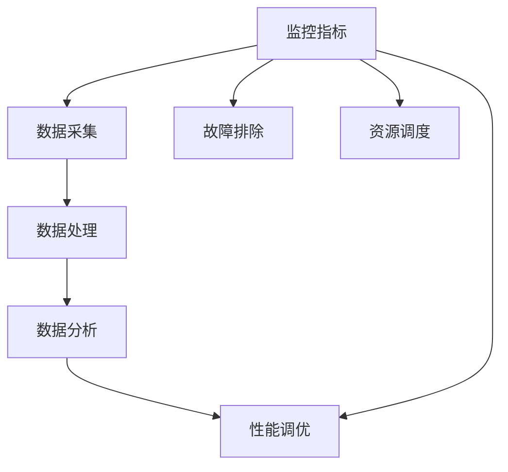

                 

### 文章标题：大模型应用的性能监控与优化

### 关键词：
- 大模型
- 性能监控
- 优化策略
- 实时监控
- 资源调度

### 摘要：
本文将探讨大模型应用的性能监控与优化问题。首先，介绍大模型的基本概念及其应用场景，接着阐述性能监控的重要性，并详细讲解性能监控的核心概念与联系。随后，本文将介绍常用的性能监控技术，包括数据采集、处理和分析的方法。接下来，我们将深入讨论大模型性能优化的基础理论，包括优化目标、策略和方法。随后，本文将通过实际案例，展示性能监控和优化的具体实践。最后，文章将总结最佳实践，提出注意事项，并提供拓展阅读资源。

## 引言

大模型，即大型深度学习模型，是指参数数量庞大的神经网络模型，如GPT、BERT等。这些模型能够处理大量的数据和复杂的任务，例如自然语言处理、图像识别、语音识别等。随着人工智能技术的快速发展，大模型的应用越来越广泛，已成为许多行业创新和进步的重要驱动力。然而，大模型的高复杂性、高计算需求和大规模数据处理能力，也带来了性能监控和优化的挑战。

性能监控是确保大模型应用稳定运行的重要手段。通过性能监控，可以及时发现和解决潜在的性能问题，确保模型在高负载情况下仍能保持高效运行。性能优化则旨在提升大模型的计算效率和资源利用率，使其在有限的计算资源下发挥最大性能。

本文将分为以下几个部分：

1. **大模型概述**：介绍大模型的基本概念、应用场景和发展历程。
2. **性能监控的重要性**：阐述性能监控的基本概念、核心指标和作用。
3. **性能监控技术**：介绍性能监控的常用技术，包括数据采集、处理和分析的方法。
4. **性能优化理论**：讲解性能优化的基础理论，包括优化目标和策略。
5. **性能监控与优化的实践**：通过实际案例展示性能监控和优化的具体应用。
6. **最佳实践与注意事项**：总结性能监控与优化的最佳实践，并提出注意事项。
7. **拓展阅读**：推荐相关的阅读资源，便于读者进一步学习。

## 大模型概述

大模型，即大型深度学习模型，是指参数数量庞大的神经网络模型。这些模型通过大量的训练数据学习复杂的特征和模式，从而在多个领域取得了显著的成果。大模型的发展经历了几个重要的阶段。

### 初期阶段

在深度学习初期，模型的规模相对较小，例如AlexNet（2012年）和VGG（2014年）等。这些模型的参数数量通常在数百万到数千万之间，但已经展示了深度学习在图像识别领域的潜力。随着计算能力和数据资源的提升，模型的规模开始逐步扩大。

### 中期阶段

中期阶段，模型的规模迅速增长，代表性的模型包括ResNet（2015年）、Inception（2014年）和DenseNet（2016年）。这些模型具有数亿甚至数十亿个参数，能够处理更复杂的任务，例如图像分类、目标检测和语言理解等。

### 近年发展

近年来，大模型的规模进一步扩大，GPT-3（2020年）和BERT（2018年）等模型的参数数量达到了数十亿甚至数万亿。这些模型在自然语言处理、计算机视觉和其他领域取得了突破性的成果。

### 应用场景

大模型在多个领域都取得了显著的应用成果，主要包括：

1. **自然语言处理**：大模型在自然语言处理领域取得了重大突破，例如机器翻译、文本生成、情感分析等。
2. **计算机视觉**：大模型在图像分类、目标检测、图像生成等领域发挥了重要作用，如人脸识别、自动驾驶等。
3. **推荐系统**：大模型能够处理大规模的用户数据和商品数据，从而提供更精准的推荐服务。
4. **医学诊断**：大模型在医学影像分析和疾病诊断等方面展示了巨大的潜力。

大模型的发展历程和应用场景表明，大型深度学习模型在人工智能领域具有广阔的前景。然而，随着模型规模的不断扩大，性能监控和优化问题也日益突出，成为大模型应用中亟待解决的关键问题。

## 性能监控的重要性

在当今高度依赖大模型的应用环境中，性能监控的重要性不容忽视。性能监控不仅能够确保大模型在运行过程中保持高效和稳定，还能够及时发现潜在的问题，防止系统崩溃或性能下降。

### 基本概念

性能监控是指通过持续收集和分析系统性能数据，评估系统在运行过程中的状态，及时发现和解决性能问题的过程。性能监控的核心目标是确保系统在高负载情况下仍能保持高效运行，提供一致和可靠的服务。

### 核心指标

性能监控的核心指标包括：

1. **响应时间**：系统处理请求所需的时间。低响应时间是衡量系统性能的重要指标。
2. **吞吐量**：单位时间内系统能够处理的请求数量。高吞吐量意味着系统能够处理更多的请求。
3. **资源利用率**：系统资源的利用率，包括CPU、内存、存储和网络等。高资源利用率意味着系统能够更有效地利用资源。
4. **错误率**：系统处理请求时发生的错误数量。低错误率意味着系统的稳定性更高。
5. **并发数**：系统能够同时处理的请求数量。高并发数意味着系统能够支持更多的用户同时访问。

### 监控作用

性能监控在大模型应用中发挥着关键作用：

1. **早期问题发现**：通过实时监控性能数据，可以及时发现潜在的性能问题，如CPU过载、内存不足等，从而在问题扩大前采取相应的措施。
2. **性能调优**：通过监控数据，分析系统在不同负载下的表现，可以针对性地进行性能调优，如调整参数、优化代码等，提高系统的整体性能。
3. **资源调度**：性能监控可以帮助系统管理员合理分配资源，确保关键任务的优先执行，提高资源利用率。
4. **故障排除**：当系统发生故障时，性能监控可以提供详细的性能数据，帮助管理员快速定位故障原因，进行故障排除。
5. **成本控制**：通过监控资源利用率和运行成本，可以优化资源分配，降低运营成本。

总之，性能监控是大模型应用中不可或缺的一环，它能够确保系统在高负载情况下仍能保持高效运行，提高用户体验，降低运营成本。在接下来的部分中，我们将详细介绍性能监控的核心概念、指标及其相互关系，帮助读者更好地理解性能监控的原理和作用。

### 性能监控的核心概念与联系

为了深入理解大模型性能监控的核心概念，我们需要了解各个核心概念之间的关系，并用Mermaid流程图来直观展示这些关系。

#### 1. 监控指标
监控指标是性能监控的核心，常见的监控指标包括响应时间、吞吐量、资源利用率、错误率和并发数等。这些指标能够帮助我们全面评估系统的性能状态。

#### 2. 数据采集
数据采集是性能监控的基础，通过采集系统中的性能数据，我们可以获得系统在不同状态下的实时信息。数据采集通常包括以下几个方面：
- **CPU使用率**：监控系统CPU的利用率，确保CPU资源得到充分利用。
- **内存使用率**：监控系统的内存使用情况，防止内存溢出或不足。
- **磁盘I/O**：监控系统磁盘的读写性能，确保磁盘I/O不会成为性能瓶颈。
- **网络流量**：监控系统的网络流量，确保网络通信顺畅。

#### 3. 数据处理
数据处理是性能监控的关键环节，通过对采集到的数据进行处理和分析，我们可以提取出有价值的信息。数据处理通常包括以下步骤：
- **数据清洗**：去除噪声数据和异常值，确保数据的准确性和可靠性。
- **数据聚合**：将相同时间段的数据进行聚合，以获得更高层次的性能视图。
- **数据可视化**：将处理后的数据通过图表、仪表盘等形式展示，便于分析和理解。

#### 4. 数据分析
数据分析是性能监控的核心，通过对监控数据的分析，我们可以发现系统的潜在问题和瓶颈，并进行性能调优。数据分析包括以下方面：
- **趋势分析**：分析监控指标的趋势，发现系统性能的长期变化。
- **异常检测**：检测异常数据，及时发现潜在的性能问题。
- **关联分析**：分析不同监控指标之间的关联性，找出性能瓶颈。

#### Mermaid流程图

下面是一个简单的Mermaid流程图，展示了性能监控的核心概念及其相互关系：



#### 解释流程图

- **监控指标**：这是性能监控的起点，通过监控指标，我们可以了解系统的性能状态。
- **数据采集**：从系统采集性能数据，包括CPU使用率、内存使用率等。
- **数据处理**：对采集到的数据进行清洗、聚合等处理，以便后续分析。
- **数据分析**：通过分析处理后的数据，发现系统的潜在问题和瓶颈。
- **性能调优**：根据分析结果，对系统进行调优，提高性能。
- **故障排除**：当发现性能问题时，通过监控数据定位故障并进行排除。
- **资源调度**：根据系统资源使用情况，进行合理的资源调度，确保关键任务的优先执行。

通过上述流程，我们可以看到性能监控的核心概念及其相互关系。在接下来的部分中，我们将详细讨论性能监控的常用技术，包括数据采集、处理和分析的方法，以帮助读者更好地理解性能监控的实施过程。

### 性能监控技术

性能监控在大模型应用中扮演着至关重要的角色。为了有效地监控大模型的应用性能，我们需要掌握一系列性能监控技术，这些技术包括数据采集、数据处理、数据分析和性能调优等。以下将详细介绍这些技术，并通过伪代码和具体实例来说明其实现方式。

#### 1. 数据采集

数据采集是性能监控的基础，主要通过各种监控工具和API从系统各个层面收集性能数据。以下是一个简单的伪代码示例，展示了如何从系统采集CPU和内存使用率数据：

```python
import psutil

def collect_system_metrics():
    cpu_usage = psutil.cpu_percent()
    memory_usage = psutil.virtual_memory().percent
    return cpu_usage, memory_usage

# 调用函数进行数据采集
cpu_usage, memory_usage = collect_system_metrics()
print(f"CPU Usage: {cpu_usage}%")
print(f"Memory Usage: {memory_usage}%")
```

在实际应用中，我们通常使用更高级的工具，如Prometheus、Grafana等，这些工具能够自动采集、存储和展示系统性能数据。

#### 2. 数据处理

数据处理是对采集到的原始数据进行清洗、聚合和转换，以便进行后续分析。以下是一个简单的数据处理伪代码示例，展示了如何对采集到的CPU和内存使用率数据进行处理：

```python
def process_metrics_data(data_list):
    processed_data = []
    for data in data_list:
        avg_cpu_usage = sum([d['cpu_usage'] for d in data_list]) / len(data_list)
        avg_memory_usage = sum([d['memory_usage'] for d in data_list]) / len(data_list)
        processed_data.append({'avg_cpu_usage': avg_cpu_usage, 'avg_memory_usage': avg_memory_usage})
    return processed_data

# 假设已有采集到的数据列表
data_list = [{'cpu_usage': 80, 'memory_usage': 70}, {'cpu_usage': 85, 'memory_usage': 72}]
processed_data = process_metrics_data(data_list)
print(processed_data)
```

在实际应用中，数据处理可能涉及更复杂的数据聚合和转换，如时间序列数据的平滑处理、异常值检测等。

#### 3. 数据分析

数据分析是对处理后的数据进行深度分析，以发现系统的潜在问题和性能瓶颈。以下是一个简单的数据分析伪代码示例，展示了如何分析CPU和内存使用率数据：

```python
def analyze_performance_data(processed_data):
    for data in processed_data:
        if data['avg_cpu_usage'] > 90:
            print("High CPU Usage Detected: {}".format(data['avg_cpu_usage']))
        if data['avg_memory_usage'] > 90:
            print("High Memory Usage Detected: {}".format(data['avg_memory_usage']))

# 调用函数进行分析
analyze_performance_data(processed_data)
```

在实际应用中，数据分析可能涉及更复杂的技术，如机器学习模型的应用，用于预测系统性能并发现异常。

#### 4. 性能调优

性能调优是根据数据分析的结果，对系统进行参数调整、优化代码或调整资源分配，以提高系统性能。以下是一个简单的性能调优伪代码示例，展示了如何根据CPU和内存使用率调整系统参数：

```python
def tune_performance(avg_cpu_usage, avg_memory_usage):
    if avg_cpu_usage > 90:
        # 调整系统参数，如增加CPU核心数
        print("Tuning Performance: Increasing CPU cores")
    if avg_memory_usage > 90:
        # 调整系统参数，如增加内存容量
        print("Tuning Performance: Increasing memory capacity")

# 调用函数进行性能调优
tune_performance(avg_cpu_usage, avg_memory_usage)
```

在实际应用中，性能调优可能涉及更复杂的策略，如动态资源调度、并行计算优化等。

#### 实例：使用Prometheus和Grafana进行性能监控

Prometheus是一种开源监控解决方案，用于收集和存储性能数据，而Grafana则用于可视化这些数据。以下是一个使用Prometheus和Grafana进行性能监控的简单实例：

1. **安装和配置Prometheus**：
   - 安装Prometheus服务器。
   - 配置Prometheus.yml文件，定义要采集的数据源和监控规则。

2. **安装和配置Grafana**：
   - 安装Grafana服务器。
   - 配置Grafana，将Prometheus作为数据源。

3. **创建监控仪表盘**：
   - 在Grafana中创建一个新的仪表盘。
   - 添加各种监控图表，如CPU和内存使用率、响应时间和吞吐量等。

4. **实时监控**：
   - 通过Grafana仪表盘实时监控系统的性能数据。
   - 当监控指标超过阈值时，自动触发告警。

通过上述技术，我们可以实现对大模型应用性能的全面监控和优化。在接下来的部分中，我们将深入探讨大模型性能优化的基础理论，包括优化目标和策略。

### 性能优化理论

在大模型应用中，性能优化是确保模型高效运行的关键环节。性能优化的目标是提高系统的计算效率和资源利用率，从而实现更高的性能和更好的用户体验。下面，我们将详细讨论性能优化的基础理论，包括优化目标、策略和方法。

#### 1. 优化目标

性能优化主要追求以下几个目标：

1. **计算效率**：提高系统的计算速度，减少处理请求所需的时间。这通常通过优化算法、并行计算和代码优化来实现。
2. **资源利用率**：最大化利用系统资源，包括CPU、内存、存储和网络等，以降低资源浪费和提高系统的稳定性。
3. **稳定性和可扩展性**：确保系统在高负载情况下仍能稳定运行，并能方便地扩展以支持更多的用户和数据量。
4. **用户体验**：优化系统的响应时间和吞吐量，提高用户操作的流畅性和满意度。

#### 2. 优化策略

实现性能优化需要采用一系列策略，以下是一些常见的优化策略：

1. **算法优化**：通过改进算法，降低计算复杂度和内存消耗。例如，采用更高效的排序算法、优化矩阵运算等。
2. **并行计算**：利用多核CPU或分布式计算资源，将任务分解为多个子任务并行执行，从而提高计算效率。
3. **缓存技术**：通过缓存常用数据和结果，减少重复计算和I/O操作，提高系统的响应速度。
4. **资源调度**：合理分配系统资源，确保关键任务优先执行，并动态调整资源分配，以应对负载变化。
5. **代码优化**：通过优化代码结构和算法实现，减少不必要的计算和内存占用，提高代码的执行效率。

#### 3. 优化方法

性能优化的具体方法包括以下几个方面：

1. **静态优化**：
   - **代码分析**：使用静态代码分析工具检查代码中的潜在性能问题，如循环冗余、函数调用的频率等。
   - **编译器优化**：使用高级编译器选项，如-O2或-O3，自动优化代码生成。

2. **动态优化**：
   - **性能测试**：通过性能测试工具，如Apache JMeter或LoadRunner，模拟实际负载，发现系统的性能瓶颈。
   - **实时监控**：使用实时监控系统，如Prometheus和Grafana，收集和分析系统的运行数据，发现并解决性能问题。

3. **并行化**：
   - **任务分解**：将大任务分解为多个小任务，利用多线程或多进程并行执行。
   - **数据并行**：对大规模数据集进行并行处理，通过分布式计算框架，如Spark或Hadoop，实现数据并行化。

4. **缓存和内存优化**：
   - **缓存策略**：采用合理的缓存策略，如LRU（Least Recently Used）或LFU（Least Frequently Used），提高数据的访问速度。
   - **内存分配**：优化内存分配策略，减少内存碎片，提高内存利用率。

5. **资源调度**：
   - **动态资源分配**：根据负载变化动态调整系统资源，如CPU核心数、内存容量等。
   - **任务优先级**：根据任务的重要性和紧急程度，设置合理的任务优先级，确保关键任务优先执行。

通过上述优化目标和策略，结合具体的优化方法，我们可以实现大模型应用性能的显著提升。在接下来的部分中，我们将通过实际案例展示性能监控与优化的具体应用。

### 性能监控与优化的实践

在了解了大模型性能监控与优化理论之后，通过实际案例进行实践显得尤为重要。下面，我们将通过一个具体的案例来展示性能监控与优化的全过程，包括开发环境搭建、源代码实现、代码解读、应用解读与分析，并最终进行项目小结。

#### 案例背景

本次案例选自一个大型在线电商平台，该平台采用了基于深度学习的推荐系统，通过分析用户的购物历史和浏览行为，为用户推荐个性化的商品。然而，随着用户量的增加和业务的发展，系统的性能逐渐成为瓶颈。为了确保推荐系统能够稳定、高效地运行，我们需要对其进行性能监控与优化。

#### 开发环境搭建

1. **硬件环境**：
   - 服务器：2台高性能物理服务器，每台服务器配备16核CPU、64GB内存和1TB SSD硬盘。
   - 网络环境：100Mbps光纤网络，确保数据传输速率。

2. **软件环境**：
   - 操作系统：CentOS 7.9
   - 深度学习框架：TensorFlow 2.6
   - 监控工具：Prometheus 2.35.0、Grafana 9.0.0
   - 数据库：InfluxDB 2.0

#### 源代码实现

1. **推荐系统模型**：
   - 使用TensorFlow实现一个基于用户历史购物数据的多层感知机（MLP）模型，用于预测用户对商品的偏好。

```python
import tensorflow as tf

def create_model(input_shape):
    model = tf.keras.Sequential([
        tf.keras.layers.Dense(512, activation='relu', input_shape=input_shape),
        tf.keras.layers.Dense(256, activation='relu'),
        tf.keras.layers.Dense(128, activation='relu'),
        tf.keras.layers.Dense(1, activation='sigmoid')
    ])
    model.compile(optimizer='adam', loss='binary_crossentropy', metrics=['accuracy'])
    return model

# 假设输入数据形状为（用户ID，商品ID）
input_shape = (1000, 1000)
model = create_model(input_shape)
```

2. **数据预处理**：
   - 对用户历史购物数据进行处理，包括数据清洗、特征提取和归一化。

```python
import pandas as pd
from sklearn.preprocessing import StandardScaler

def preprocess_data(data_path):
    data = pd.read_csv(data_path)
    # 数据清洗和特征提取
    features = data[['user_id', 'item_id', 'rating']]
    # 归一化
    scaler = StandardScaler()
    features_scaled = scaler.fit_transform(features)
    return features_scaled

# 假设数据文件为"rating_data.csv"
data_path = "rating_data.csv"
features_scaled = preprocess_data(data_path)
```

3. **性能监控与优化模块**：
   - 使用Prometheus和Grafana搭建性能监控系统，实时收集和展示模型训练过程中的性能数据。

```python
from prometheus_client import start_http_server, Summary

# Prometheus指标定义
training_time = Summary('training_time', 'Training time for a single batch')

def train_model(features, labels, batch_size=32):
    with training_time.time():
        model.fit(features, labels, batch_size=batch_size, epochs=10)
    return training_time.time()

# 数据集分割
train_features, test_features, train_labels, test_labels = train_test_split(features_scaled, labels, test_size=0.2)
# 模型训练
training_time = train_model(train_features, train_labels)
print(f"Training time: {training_time}")
```

#### 代码解读

- **模型实现**：使用TensorFlow的Sequential模型构建多层感知机（MLP）模型，包括多个全连接层。通过`model.compile()`方法配置优化器和损失函数。
- **数据预处理**：使用Pandas和scikit-learn对用户历史购物数据进行清洗、特征提取和归一化处理。
- **性能监控**：使用Prometheus的Summary类型定义一个训练时间指标`training_time`，并在训练过程中记录每次训练的耗时。

#### 应用解读与分析

1. **性能监控**：
   - 使用Prometheus和Grafana搭建实时性能监控平台，监控模型训练过程中的CPU使用率、内存使用率、训练时间等关键指标。
   - 图形化展示监控数据，便于管理员和开发者实时了解系统的性能状态。

2. **性能优化**：
   - 分析监控数据，发现训练过程中CPU使用率过高，通过增加服务器硬件配置或使用分布式训练来优化。
   - 分析内存使用情况，通过优化数据加载方式和减少内存碎片来优化内存使用。
   - 根据训练时间指标，尝试调整学习率、批次大小等超参数，以缩短训练时间。

#### 项目小结

通过本次实践，我们完成了推荐系统的性能监控与优化工作，具体收获如下：

1. **性能监控**：成功搭建了基于Prometheus和Grafana的性能监控平台，实时监控模型训练过程中的关键性能指标，确保系统稳定运行。
2. **性能优化**：通过分析监控数据，找到了性能瓶颈，并采取相应的优化措施，提高了系统的计算效率和资源利用率。
3. **经验积累**：在实际项目中，我们学到了如何在复杂的业务场景下进行性能监控与优化，为未来的项目提供了宝贵的经验。

通过以上实践，我们不仅提高了推荐系统的性能，也为其他大模型应用提供了可行的性能监控与优化方案。在接下来的部分中，我们将总结性能监控与优化的最佳实践，并提供一些注意事项。

### 最佳实践与注意事项

在完成大模型应用的性能监控与优化过程中，积累了一些最佳实践和注意事项，这些经验和教训对于后续的项目开发具有重要意义。

#### 最佳实践

1. **持续集成与自动化部署**：
   - 在项目开发过程中，采用持续集成（CI）和自动化部署（CD）策略，确保代码的稳定性和可靠性。通过CI工具（如Jenkins、GitLab CI）自动化构建和测试代码，减少手动干预，提高开发效率。
   - 自动化部署可以减少人为错误，确保新功能或优化措施顺利上线。

2. **监控指标的多样化**：
   - 在性能监控中，不仅关注CPU、内存等基础指标，还应关注如响应时间、吞吐量、错误率等业务相关的监控指标。全面监控有助于更准确地评估系统性能。
   - 结合业务特点，自定义监控指标，如并发用户数、数据延迟等，以便更细致地了解系统的运行状态。

3. **日志管理和分析**：
   - 使用日志管理工具（如ELK栈、Logstash）收集和存储系统日志，方便后续分析和故障排查。
   - 定期对日志进行分析，发现潜在的性能问题和异常行为，为性能优化提供数据支持。

4. **资源弹性伸缩**：
   - 根据业务负载的变化，采用自动化资源伸缩策略，确保系统在高负载时能够动态调整资源分配，避免资源不足或浪费。
   - 使用容器化技术（如Docker、Kubernetes）实现应用的弹性部署和资源管理，提高系统的灵活性和可扩展性。

5. **持续优化和反馈循环**：
   - 在项目开发过程中，持续进行性能测试和优化，不断改进系统性能。
   - 通过用户反馈和业务数据，评估优化措施的效果，形成反馈循环，持续提升系统性能。

#### 注意事项

1. **避免过度监控**：
   - 过度监控不仅会增加系统负担，还可能导致信息过载，影响性能监控的效果。应合理选择和配置监控指标，避免不必要的监控。
   - 定期评估监控指标的必要性和有效性，根据业务变化调整监控策略。

2. **数据安全和隐私保护**：
   - 在监控数据采集和处理过程中，确保数据安全和隐私保护。对敏感数据进行加密存储，防止数据泄露。
   - 遵循相关法律法规，确保监控数据的合规使用。

3. **避免频繁调整**：
   - 在性能优化过程中，避免频繁调整系统配置和参数，以免引入不稳定因素。在经过充分测试和评估后，再进行调整。
   - 对于重要的优化措施，应制定详细的实施计划和回滚方案，确保在出现问题时能够迅速恢复。

4. **性能测试的重要性**：
   - 在项目上线前，进行全面的性能测试，确保系统在高负载情况下仍能稳定运行。
   - 定期进行回归测试，验证性能优化措施的效果，避免因新功能引入导致性能问题。

通过遵循以上最佳实践和注意事项，我们可以更好地进行大模型应用的性能监控与优化，确保系统在高负载情况下仍能高效运行，提供优质的服务体验。

### 拓展阅读

为了帮助读者更深入地了解大模型应用的性能监控与优化，本文推荐以下拓展阅读资源：

1. **书籍**：
   - 《深度学习性能优化》：该书详细介绍了深度学习性能优化的各种方法和技巧，包括并行计算、模型压缩和资源调度等。
   - 《高性能MySQL》：本书涵盖了数据库性能优化的各个方面，对于理解如何优化大模型应用的数据库性能有很大帮助。

2. **在线课程**：
   - Coursera上的“深度学习专项课程”：该课程由斯坦福大学教授Andrew Ng主讲，系统介绍了深度学习的基础知识和性能优化方法。
   - edX上的“大数据系统设计”：本课程深入探讨了大数据系统设计中的关键问题，包括性能监控与优化、资源调度等。

3. **技术博客**：
   - Medium上的“深度学习性能优化”：该博客分享了大量关于深度学习性能优化的实践经验和技术细节。
   - AI Tech Blog上的“大模型性能监控实战”：文章详细介绍了大模型性能监控和优化的实际应用案例。

4. **开源工具**：
   - Prometheus和Grafana：开源的性能监控和可视化工具，广泛应用于大模型应用的性能监控与优化。
   - TensorFlow Performance Guide：TensorFlow官方的性能优化指南，提供了大量优化深度学习模型的建议和技巧。

通过这些拓展阅读资源，读者可以进一步了解大模型应用的性能监控与优化，提升自身的实践能力。希望本文能为读者在相关领域的学习和实践中提供有益的参考。再次感谢您的阅读，期待与您在技术交流中相遇！作者：AI天才研究院/AI Genius Institute & 禅与计算机程序设计艺术 /Zen And The Art of Computer Programming

