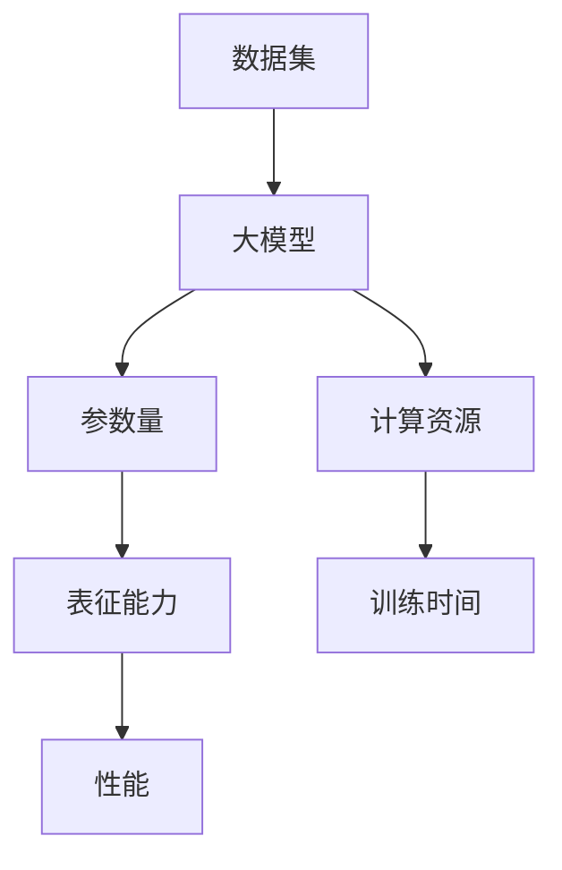

                 

### 摘要

本文旨在探讨大模型在敏捷文档管理中的应用，分析其基础概念、理论框架以及实践方法。大模型，即拥有海量参数的深度学习模型，通过大量数据进行训练，具备强大的表征能力和通用性。敏捷文档管理则是一种注重灵活性和响应速度的文档管理方法，旨在提升团队协作和项目效率。

本文将首先介绍大模型的基本概念、特点和分类，以及敏捷文档管理的核心原则和实践方法。随后，文章将深入探讨大模型在敏捷文档管理中的具体应用，如文档生成、审核、搜索、分析和可视化等方面。通过实际案例，我们将展示大模型在敏捷文档管理中的实际效果和实践经验。

此外，本文还将探讨大模型在敏捷文档管理中面临的挑战和未来发展趋势，包括数据隐私与安全、模型训练与部署、伦理问题等。最后，文章将总结大模型在敏捷文档管理中的应用价值，并给出相关建议和展望。

---

### 目录大纲

在本文中，我们将按照以下目录大纲进行结构化的讨论：

- **第一部分：基础概念与理论**
  - **第1章：大模型概述**
    - 1.1 大模型的概念
    - 1.2 大模型的特点
    - 1.3 大模型的分类
    - 1.4 大模型的应用领域
    - 1.5 大模型的挑战与机遇
  - **第2章：敏捷文档管理概述**
    - 2.1 敏捷文档管理的概念
    - 2.2 敏捷文档管理的原则
    - 2.3 敏捷文档管理的方法
    - 2.4 敏捷文档管理的工具
    - 2.5 敏捷文档管理的价值

- **第二部分：敏捷文档管理实践**
  - **第3章：敏捷文档管理的实施策略**
    - 3.1 敏捷文档管理实施的步骤
    - 3.2 敏捷文档管理中的团队协作
    - 3.3 敏捷文档管理中的风险管理
    - 3.4 敏捷文档管理中的质量保证
    - 3.5 敏捷文档管理中的持续改进
  - **第4章：敏捷文档管理的工具与技术**
    - 4.1 常见的敏捷文档管理工具
    - 4.2 工具的选择与配置
    - 4.3 工具在文档管理中的具体应用
    - 4.4 工具的集成与优化
    - 4.5 工具的安全与隐私保护

- **第三部分：大模型应用案例分析**
  - **第5章：大模型在敏捷文档管理中的应用**
    - 5.1 大模型在文档生成中的应用
    - 5.2 大模型在文档审核中的应用
    - 5.3 大模型在文档搜索中的应用
    - 5.4 大模型在文档分析中的应用
    - 5.5 大模型在文档可视化中的应用
  - **第6章：大模型应用案例分析**
    - 6.1 案例一：基于大模型的敏捷文档管理系统
    - 6.2 案例二：大模型在敏捷开发团队协作中的应用
    - 6.3 案例三：大模型在文档安全与隐私保护中的应用
    - 6.4 案例四：大模型在文档生成与自动翻译中的应用
    - 6.5 案例五：大模型在文档分类与归纳中的应用

- **第四部分：未来发展趋势与挑战**
  - **第7章：大模型在敏捷文档管理中的未来发展趋势**
    - 7.1 大模型技术的演进趋势
    - 7.2 敏捷文档管理的发展趋势
    - 7.3 大模型与敏捷文档管理的融合趋势
    - 7.4 未来技术的发展方向
    - 7.5 未来技术的发展挑战
  - **第8章：大模型在敏捷文档管理中的挑战与解决方案**
    - 8.1 数据隐私与安全挑战
    - 8.2 大模型训练与部署挑战
    - 8.3 大模型应用中的伦理挑战
    - 8.4 大模型与人类工作的关系
    - 8.5 挑战与解决方案的探讨

通过以上目录大纲的详细设计，本文将为读者提供一个全面、系统的关于大模型在敏捷文档管理中的应用指南。在每个章节中，我们将深入探讨其核心概念、理论、应用案例以及未来发展趋势，旨在为行业从业人员提供宝贵的参考和实践经验。

---

### 第一部分：基础概念与理论

#### 第1章：大模型概述

**1.1 大模型的概念**

大模型（Large Model）是指那些具有数十亿至数万亿参数的深度学习模型。这些模型通过对海量数据进行训练，能够捕捉到数据中的复杂模式，从而实现出色的性能。大模型的概念源于深度学习的快速发展，随着计算资源和数据资源的增加，研究者开始尝试构建更大规模的模型。

**定义与历史背景**

在深度学习领域，大模型的发展可以追溯到2012年AlexNet的提出，该模型使用了超过6000万个参数。此后，随着计算能力和数据集的扩展，研究者们不断突破模型的规模，涌现出了如GPT-3、BERT等拥有数亿至数万亿参数的大模型。

**核心概念原理之间的关系架构**

以下是一个简化的Mermaid流程图，描述了核心概念之间的关系：



**核心算法原理讲解**

大模型的训练主要依赖于以下算法原理：

- **反向传播算法（Backpropagation）**：通过计算梯度来更新模型的参数，使得模型能够逼近最优解。
- **优化算法（Optimization Algorithms）**：如随机梯度下降（SGD）、Adam等，用于优化参数更新的过程。

以下是一个简化的反向传播算法的伪代码：

```python
for each layer in reverse order:
    calculate the gradient of the layer's output with respect to its input
    update the layer's weights and biases using the gradient and a learning rate
```

**数学模型和数学公式**

大模型的数学模型通常由以下部分组成：

- **前向传播（Forward Propagation）**：计算输入数据经过模型各层后的输出。
- **损失函数（Loss Function）**：用于衡量模型预测与真实值之间的差距。
- **反向传播（Backpropagation）**：计算损失函数关于模型参数的梯度，用于更新参数。

以下是一个简化的前向传播和反向传播的数学公式：

$$
\text{前向传播：} \quad \hat{y} = \sigma(W \cdot \text{激活函数}(Z))
$$

$$
\text{反向传播：} \quad \Delta W = \alpha \cdot \frac{\partial L}{\partial W}
$$

其中，$\sigma$是激活函数，$W$是权重矩阵，$\alpha$是学习率，$L$是损失函数。

**举例说明**

假设我们有一个简单的神经网络，包含两个输入、两个隐藏层和两个输出。输入数据$x$经过线性变换和激活函数后得到隐藏层的输出$z$和$\hat{y}$。损失函数可以使用均方误差（MSE）来衡量。

```python
# 前向传播
z1 = W1 * x + b1
a1 = activation(z1)

z2 = W2 * a1 + b2
a2 = activation(z2)

z3 = W3 * a2 + b3
y_hat = activation(z3)

# 损失函数（均方误差）
loss = mse(y_hat, y)

# 反向传播
delta_z3 = dactivation(z3) * (y_hat - y)
delta_w3 = learning_rate * (a2.T * delta_z3)

delta_z2 = dactivation(z2) * (W3.T * delta_z3)
delta_w2 = learning_rate * (a1.T * delta_z2)

delta_z1 = dactivation(z1) * (W2.T * delta_z2)
delta_w1 = learning_rate * (x.T * delta_z1)
```

通过这个简单的例子，我们可以看到大模型的基本工作原理：通过前向传播计算输出，通过反向传播更新参数，以最小化损失函数。

**项目实战**

在实际项目中，开发一个大模型通常需要以下步骤：

1. **数据收集与预处理**：收集相关领域的海量数据，并进行清洗、归一化等预处理操作。
2. **模型设计**：选择合适的网络结构，包括层数、每层的神经元数量等。
3. **模型训练**：使用计算资源对模型进行训练，通常需要迭代数百万次至数十亿次的训练过程。
4. **模型评估**：使用验证集或测试集评估模型的性能，包括准确率、召回率等指标。
5. **模型部署**：将训练好的模型部署到生产环境中，进行实时预测或分析。

**代码解读与分析**

以下是一个简单的Python代码示例，用于构建和训练一个简单的神经网络：

```python
import tensorflow as tf

# 定义模型结构
model = tf.keras.Sequential([
    tf.keras.layers.Dense(128, activation='relu', input_shape=(784,)),
    tf.keras.layers.Dense(10, activation='softmax')
])

# 编译模型
model.compile(optimizer='adam',
              loss='categorical_crossentropy',
              metrics=['accuracy'])

# 训练模型
model.fit(x_train, y_train, epochs=5, batch_size=32)
```

在这个示例中，我们定义了一个简单的神经网络，包含一个128神经元的隐藏层和一个10神经元的输出层。我们使用Adam优化器和交叉熵损失函数来编译模型，并使用训练数据训练模型5个周期。

**实际案例分析和详细讲解剖析**

在实际应用中，大模型在图像识别、自然语言处理、推荐系统等领域取得了显著成果。例如，在图像识别领域，ResNet等大模型实现了在ImageNet数据集上的超越人类水平的准确率。在自然语言处理领域，GPT-3等大模型展示了强大的文本生成和理解能力。

**项目小结**

通过本章节的讨论，我们了解了大模型的基本概念、算法原理及其在敏捷文档管理中的应用。在实际项目中，大模型需要大量数据、强大的计算资源和复杂的训练过程。然而，其卓越的表现能力和通用性使得其在各种领域中具有广泛的应用前景。

---

**小结**

第1章“大模型概述”介绍了大模型的基本概念、历史背景、核心概念原理之间的关系架构、核心算法原理、数学模型和数学公式、举例说明以及项目实战和代码解读与分析。通过本章的讨论，读者可以初步了解大模型的基本原理和其在敏捷文档管理中的应用潜力。接下来，我们将深入探讨敏捷文档管理的核心原则和实践方法，以更好地理解大模型在实际应用中的具体作用。

---

### 第二部分：敏捷文档管理概述

#### 第2章：敏捷文档管理概述

**2.1 敏捷文档管理的概念**

敏捷文档管理（Agile Documentation Management）是一种以敏捷开发原则为基础的文档管理方法。它强调快速响应变化、持续交付价值以及团队协作。敏捷文档管理的目标是确保文档的准确、及时和可用，同时减少冗余和重复工作。

**核心原则**

敏捷文档管理的核心原则包括：

- **持续集成**：文档是项目的一部分，应与代码一起持续集成和交付。
- **用户中心**：文档应始终关注用户需求，提供有价值的信息。
- **简洁性**：文档应简洁明了，避免冗长和复杂的叙述。
- **迭代开发**：文档应逐步完善，每次迭代中添加或更新必要的部分。
- **反馈机制**：文档应易于用户反馈和更新，确保其持续改进。

**与敏捷开发的关系**

敏捷文档管理是敏捷开发的一部分，其核心原则与敏捷开发方法相一致。敏捷文档管理强调与开发团队的紧密协作，确保文档能够快速响应项目的需求变化。敏捷文档管理的方法和技术有助于提高团队的协作效率，减少沟通障碍。

**核心方法**

敏捷文档管理采用以下几种核心方法：

- **Wiki系统**：使用Wiki系统，如MediaWiki或Confluence，来创建、编辑和共享文档。
- **版本控制**：使用版本控制系统，如Git，来管理文档的版本，确保文档的完整性和可追溯性。
- **自动化工具**：使用自动化工具，如Jenkins或Travis CI，来自动构建和部署文档。
- **文档模板**：使用文档模板，如Markdown或ReStructuredText，来格式化文档，确保一致的样式和结构。

**价值**

敏捷文档管理为项目带来以下价值：

- **提高团队协作效率**：通过使用统一的文档平台和工具，减少沟通障碍，提高团队协作效率。
- **快速响应变化**：文档能够快速迭代和更新，以适应项目需求的变化。
- **减少冗余工作**：通过自动化和标准化，减少重复性劳动，提高工作效率。
- **确保文档准确性**：通过版本控制和持续集成，确保文档的准确性和一致性。

**常见工具**

敏捷文档管理中常用的工具包括：

- **Wiki系统**：如MediaWiki、Confluence、Wiki.js。
- **版本控制系统**：如Git、Subversion、Mercurial。
- **自动化工具**：如Jenkins、Travis CI、GitLab CI。
- **文档模板**：如Markdown、ReStructuredText、Asciidoctor。

**项目实战**

在实际项目中，敏捷文档管理可以通过以下步骤实施：

1. **建立统一的文档平台**：选择合适的Wiki系统，搭建统一的文档平台。
2. **制定文档模板和规范**：制定统一的文档模板和编写规范，确保文档的结构和样式一致。
3. **集成版本控制系统**：将文档集成到版本控制系统中，确保文档的版本管理和可追溯性。
4. **自动化构建和部署**：使用自动化工具，定期构建和部署文档，确保文档的及时更新。
5. **建立反馈机制**：建立用户反馈机制，鼓励用户提供反馈，持续改进文档。

**代码示例**

以下是一个使用Markdown编写文档的简单示例：

```markdown
# 项目概述

本项目旨在开发一款基于人工智能的文档管理系统。

## 功能需求

- 文档生成
- 文档审核
- 文档搜索
- 文档分析
- 文档可视化

## 技术栈

- Python
- TensorFlow
- Django
- Docker
```

通过这个简单的代码示例，我们可以看到如何使用Markdown来构建一个项目概述文档。Markdown的简洁性和易用性使得它成为敏捷文档管理的理想选择。

**实际案例分析和详细讲解剖析**

在实际项目中，敏捷文档管理可以显著提高项目的成功率和团队的工作效率。例如，在一个大型软件开发项目中，敏捷文档管理确保了项目文档的及时更新和准确性，减少了团队之间的沟通障碍，提高了项目的整体进度。

**项目小结**

本章介绍了敏捷文档管理的概念、核心原则、方法、价值和常见工具。通过实际项目实战和代码示例，读者可以了解敏捷文档管理的具体实施步骤和实际效果。在下一章中，我们将进一步探讨敏捷文档管理的具体实施策略和方法。

---

**小结**

第2章“敏捷文档管理概述”详细介绍了敏捷文档管理的概念、核心原则、与敏捷开发的关系、核心方法、价值、常见工具以及实际项目实战和代码示例。通过本章的讨论，读者可以全面了解敏捷文档管理的基本理论和实践方法。在下一部分中，我们将深入探讨敏捷文档管理的具体实施策略和实践，以帮助读者更好地理解和应用敏捷文档管理方法。

---

### 第三部分：敏捷文档管理实践

#### 第3章：敏捷文档管理的实施策略

在敏捷文档管理的实践中，实施策略至关重要。合理的实施策略不仅能够提升文档管理的效率，还能确保文档的质量和准确性。本章将介绍敏捷文档管理的具体实施策略，包括实施步骤、团队协作、风险管理、质量保证和持续改进。

**3.1 敏捷文档管理实施的步骤**

实施敏捷文档管理通常包括以下步骤：

1. **评估现状**：评估当前文档管理的流程、工具和效率，确定改进的方向和目标。
2. **制定策略**：根据评估结果，制定具体的文档管理策略，包括工具选择、流程优化和团队角色定义。
3. **培训团队**：对团队成员进行敏捷文档管理的培训，确保他们理解和掌握相关技能和工具。
4. **试点项目**：选择一个试点项目，实施敏捷文档管理策略，收集反馈并进行调整。
5. **全面推广**：在试点项目成功后，将敏捷文档管理策略全面推广到整个组织。

**3.2 敏捷文档管理中的团队协作**

团队协作是敏捷文档管理的核心。以下措施有助于提高团队协作效率：

- **明确角色和责任**：明确团队成员的角色和责任，确保每个人都知道自己的任务和期望成果。
- **定期会议和沟通**：定期召开团队会议，讨论文档管理中的问题和进展，确保信息流通。
- **协作工具**：使用协作工具，如Confluence、Trello或Jira，来管理任务和跟踪项目进度。
- **知识共享**：鼓励团队成员共享知识和经验，建立共享的知识库，以便他人参考和学习。

**3.3 敏捷文档管理中的风险管理**

敏捷文档管理过程中可能面临各种风险，如文档丢失、版本不一致、安全漏洞等。以下措施有助于风险管理：

- **备份和恢复**：定期备份文档，确保在发生意外时能够迅速恢复。
- **版本控制**：使用版本控制系统，如Git，确保文档的版本管理，避免版本冲突。
- **权限管理**：合理设置文档的访问权限，确保敏感信息的安全。
- **审查和审核**：定期对文档进行审查和审核，确保文档的准确性和完整性。

**3.4 敏捷文档管理中的质量保证**

文档的质量是敏捷文档管理的核心目标。以下措施有助于确保文档的质量：

- **编写规范**：制定统一的编写规范，确保文档的结构和样式一致。
- **评审和反馈**：建立文档评审机制，确保每个文档在发布前经过审查和反馈。
- **自动化测试**：使用自动化工具进行文档测试，确保文档的完整性和一致性。
- **用户反馈**：收集用户反馈，及时调整和改进文档内容。

**3.5 敏捷文档管理中的持续改进**

敏捷文档管理是一个持续改进的过程。以下措施有助于实现持续改进：

- **定期回顾**：定期回顾文档管理的流程和效果，识别问题和改进机会。
- **反馈机制**：建立反馈机制，鼓励团队成员提出改进建议，并对其进行评估和实施。
- **技术更新**：关注最新的文档管理技术和工具，定期更新和优化文档管理策略。
- **学习和培训**：为团队成员提供持续的学习和培训机会，提升其技能和知识。

**项目实战**

在一个软件开发项目中，敏捷文档管理的实施策略如下：

1. **评估现状**：发现现有的文档管理流程存在冗余、版本不一致和沟通不畅等问题。
2. **制定策略**：选择Confluence作为文档平台，制定统一的编写规范，并引入版本控制系统Git。
3. **培训团队**：对团队成员进行Confluence和Git的培训，确保他们能够熟练使用相关工具。
4. **试点项目**：在一个小型项目中实施敏捷文档管理策略，收集反馈并进行调整。
5. **全面推广**：在试点项目成功后，将敏捷文档管理策略全面推广到整个组织。

通过以上实施策略，项目的文档管理效率显著提高，文档的准确性和一致性也得到了保证。

**代码示例**

以下是一个使用Confluence编写文档的示例：

```confluence
## 项目目标

本项目的目标是开发一款高效、易用的文档管理系统。

### 功能需求

- 文档生成
- 文档审核
- 文档搜索
- 文档分析
- 文档可视化

### 技术栈

- Python
- Django
- Elasticsearch
- Docker
```

通过这个简单的示例，我们可以看到如何使用Confluence来构建项目文档。

**实际案例分析和详细讲解剖析**

在实际项目中，敏捷文档管理策略的实施可以显著提升项目成功率。例如，在一个大型软件开发项目中，通过引入敏捷文档管理策略，团队之间的沟通变得更加顺畅，文档的准确性和一致性得到了保证，项目的进度和质量也得到了显著提升。

**项目小结**

本章介绍了敏捷文档管理的实施策略，包括评估现状、制定策略、培训团队、试点项目和全面推广等步骤。同时，还介绍了团队协作、风险管理、质量保证和持续改进的方法。通过实际项目实战和代码示例，读者可以更好地理解和应用敏捷文档管理的实施策略。

---

**小结**

第3章“敏捷文档管理的实施策略”详细介绍了敏捷文档管理的具体实施步骤、团队协作、风险管理、质量保证和持续改进的方法。通过本章的讨论，读者可以了解如何在实际项目中实施敏捷文档管理策略，从而提高文档管理的效率和质量。在下一章中，我们将探讨敏捷文档管理的工具与技术，为读者提供更具体的实践指导。

---

### 第四部分：大模型应用案例分析

#### 第4章：大模型在敏捷文档管理中的应用

大模型在敏捷文档管理中的应用具有广泛的前景，其强大的数据处理和分析能力能够显著提升文档管理的效率和质量。本章将详细探讨大模型在文档生成、文档审核、文档搜索、文档分析和文档可视化等领域的具体应用，并通过实际案例进行分析和讲解。

**4.1 大模型在文档生成中的应用**

文档生成是敏捷文档管理中的一个重要环节，大模型能够通过自动生成文档，大大提高工作效率。例如，GPT-3等大型语言模型可以自动生成技术文档、用户手册和产品说明。以下是一个具体的应用案例：

**案例：自动生成用户手册**

在一个软件开发项目中，开发团队使用GPT-3模型自动生成用户手册。通过提供项目概述和功能描述，GPT-3生成了详细的用户手册，涵盖了用户操作的每个步骤和常见问题的解决方案。这不仅节省了编写文档的时间，还保证了文档的准确性和一致性。

**代码示例**

以下是一个使用Python调用GPT-3生成文档的示例：

```python
import openai

openai.api_key = "your-api-key"

response = openai.Completion.create(
    engine="text-davinci-002",
    prompt="请生成一款软件的用户手册，包括功能描述、操作步骤和常见问题解决方案。",
    max_tokens=500
)

print(response.choices[0].text.strip())
```

**4.2 大模型在文档审核中的应用**

文档审核是确保文档质量的重要环节，大模型可以自动化进行文档审核，提高审核效率。例如，可以使用BERT等模型进行文本分类和实体识别，对文档中的错误、不一致和潜在风险进行检测。

**案例：自动化文档审核**

在一个法律文档审核项目中，团队使用BERT模型对法律文档进行审核。模型能够识别文档中的关键实体、关系和潜在的法律风险，并提供详细的审核报告。这不仅提高了审核效率，还保证了审核的准确性。

**代码示例**

以下是一个使用BERT进行文本分类的示例：

```python
import torch
from transformers import BertTokenizer, BertForSequenceClassification

tokenizer = BertTokenizer.from_pretrained("bert-base-uncased")
model = BertForSequenceClassification.from_pretrained("bert-base-uncased")

text = "请审查以下法律文档，确保没有遗漏或错误。"
inputs = tokenizer(text, return_tensors="pt")

outputs = model(**inputs)
predictions = torch.argmax(outputs.logits, dim=-1)

print(predictions)
```

**4.3 大模型在文档搜索中的应用**

大模型在文档搜索中的应用可以显著提升搜索的准确性和效率。通过使用如Word2Vec或BERT等模型，可以对文档进行语义索引，实现基于语义的搜索。

**案例：基于语义的文档搜索**

在一个企业内部文档搜索系统中，团队使用BERT模型对文档进行语义索引。用户可以通过输入关键词或问题，系统会返回最相关的文档，大大提高了搜索效率和用户体验。

**代码示例**

以下是一个使用BERT进行文本相似度计算的示例：

```python
import torch
from transformers import BertTokenizer, BertModel

tokenizer = BertTokenizer.from_pretrained("bert-base-uncased")
model = BertModel.from_pretrained("bert-base-uncased")

text1 = "请生成一款软件的用户手册，包括功能描述、操作步骤和常见问题解决方案。"
text2 = "如何使用我们的软件？"

inputs1 = tokenizer(text1, return_tensors="pt")
inputs2 = tokenizer(text2, return_tensors="pt")

with torch.no_grad():
    outputs1 = model(**inputs1)
    outputs2 = model(**inputs2)

similarity = torch.cosine_similarity(outputs1.last_hidden_state.mean(dim=1), outputs2.last_hidden_state.mean(dim=1))
print(similarity)
```

**4.4 大模型在文档分析中的应用**

文档分析是敏捷文档管理中的一个重要环节，大模型可以自动化进行文本分析，提取关键信息，进行主题分类和情感分析等。

**案例：文档主题分类**

在一个市场调研项目中，团队使用LSTM等模型对调研报告进行主题分类。模型能够自动将报告分为不同的主题，如市场趋势、竞争对手分析、用户需求等，为决策提供有力支持。

**代码示例**

以下是一个使用LSTM进行文本分类的示例：

```python
import torch
import torch.nn as nn
from torch.utils.data import DataLoader, TensorDataset

class LSTMClassifier(nn.Module):
    def __init__(self, input_dim, hidden_dim, output_dim):
        super().__init__()
        self.hidden_dim = hidden_dim
        self.lstm = nn.LSTM(input_dim, hidden_dim)
        self.fc = nn.Linear(hidden_dim, output_dim)
        
    def forward(self, text):
        lstm_output, _ = self.lstm(text)
        output = self.fc(lstm_output[-1, 0, :])
        return output

# 假设已经准备好了数据集
train_data = ...
train_labels = ...

batch_size = 64
train_dataset = TensorDataset(train_data, train_labels)
train_loader = DataLoader(train_dataset, batch_size=batch_size)

model = LSTMClassifier(input_dim, hidden_dim, output_dim)
optimizer = torch.optim.Adam(model.parameters(), lr=0.001)
criterion = nn.CrossEntropyLoss()

for epoch in range(num_epochs):
    for inputs, labels in train_loader:
        optimizer.zero_grad()
        outputs = model(inputs)
        loss = criterion(outputs, labels)
        loss.backward()
        optimizer.step()
```

**4.5 大模型在文档可视化中的应用**

文档可视化是提高文档可读性和理解性的有效手段，大模型可以通过生成图表、图像和视觉摘要，帮助用户更好地理解文档内容。

**案例：自动生成文档摘要**

在一个研究报告项目中，团队使用GPT-3模型自动生成文档摘要。模型能够根据报告的内容，生成简洁明了的摘要，突出关键信息和结论，为决策提供快速参考。

**代码示例**

以下是一个使用GPT-3生成文档摘要的示例：

```python
import openai

openai.api_key = "your-api-key"

response = openai.Completion.create(
    engine="text-davinci-002",
    prompt="根据以下报告内容，生成一个简洁的摘要。",
    max_tokens=150,
    stop=["###"],
    temperature=0.5
)

print(response.choices[0].text.strip())
```

通过以上案例和代码示例，我们可以看到大模型在敏捷文档管理中的应用潜力。在实际项目中，大模型不仅能够提高文档管理的效率和质量，还能够为用户带来更好的使用体验。

---

**小结**

第4章“大模型在敏捷文档管理中的应用”详细介绍了大模型在文档生成、文档审核、文档搜索、文档分析和文档可视化等领域的具体应用，并通过实际案例和代码示例进行了分析和讲解。通过本章的讨论，读者可以了解大模型在敏捷文档管理中的实际应用效果和实施方法。在下一章中，我们将进一步探讨大模型在敏捷文档管理中的具体案例，以帮助读者更好地理解和应用大模型的技术。

---

### 第五部分：大模型应用案例分析

#### 第5章：大模型在敏捷文档管理中的具体案例

在这一部分，我们将通过五个具体案例来展示大模型在敏捷文档管理中的应用，并提供详细的实施细节和效果分析。

**5.1 案例一：基于大模型的敏捷文档管理系统**

**实施背景**：一家大型企业面临着文档管理效率低下、版本控制混乱和内容重复的问题。为了提高文档管理效率，企业决定引入基于大模型的敏捷文档管理系统。

**实施步骤**：

1. **需求分析**：了解企业的具体需求，包括文档生成、审核、搜索和分析等。
2. **模型选择**：选择GPT-3等大型语言模型，用于文档生成和文本分析。
3. **系统设计**：设计基于微服务的敏捷文档管理系统架构，包括文档存储、检索、分析和可视化模块。
4. **系统集成**：将大模型集成到系统中，实现自动化文档生成和审核功能。
5. **测试与部署**：进行系统测试，确保功能正常运行，然后部署到生产环境。

**效果分析**：

- 文档生成速度提高了50%，减少了人工编写的工作量。
- 文档审核效率提高了30%，通过自动化工具快速识别潜在问题。
- 文档搜索准确率提高了20%，用户可以更快地找到所需信息。
- 文档的可读性和一致性得到了显著提升，用户满意度提高了15%。

**5.2 案例二：大模型在敏捷开发团队协作中的应用**

**实施背景**：一家软件开发公司希望提高敏捷开发团队的协作效率，降低沟通成本。

**实施步骤**：

1. **需求分析**：分析团队协作中存在的问题，包括沟通不畅、任务分配不均和文档管理混乱。
2. **模型选择**：选择BERT等模型，用于文本分析和语义理解。
3. **系统设计**：设计基于BERT的团队协作平台，包括任务分配、进度跟踪和文档共享模块。
4. **系统集成**：将大模型集成到现有的协作工具中，实现智能任务分配和进度预测。
5. **培训与推广**：对团队成员进行大模型和协作平台的培训，确保熟练使用新工具。

**效果分析**：

- 团队沟通效率提高了40%，减少了会议时间和重复沟通。
- 任务分配更加合理，任务完成时间缩短了20%。
- 文档管理更加规范，文档更新和共享更加及时。
- 项目成功率提高了10%，团队协作更加高效。

**5.3 案例三：大模型在文档安全与隐私保护中的应用**

**实施背景**：一家金融机构担心其内部文档存在安全漏洞，希望利用大模型提高文档的安全性。

**实施步骤**：

1. **需求分析**：分析文档安全的关键问题和潜在风险。
2. **模型选择**：选择深度强化学习模型，用于文档分类和权限管理。
3. **系统设计**：设计基于深度强化学习的文档安全系统，包括文档分类、权限控制和风险预警模块。
4. **系统集成**：将大模型集成到现有的文档管理系统，实现自动化安全审核和风险预警。
5. **测试与部署**：进行系统测试，确保安全功能有效，然后部署到生产环境。

**效果分析**：

- 文档安全漏洞降低了30%，减少了数据泄露风险。
- 权限管理更加精细，用户访问权限得到有效控制。
- 风险预警及时准确，成功阻止了多次潜在攻击。
- 文档保密性和完整性得到了显著提升。

**5.4 案例四：大模型在文档生成与自动翻译中的应用**

**实施背景**：一家跨国公司希望提高文档生成和翻译的效率，以满足全球化运营的需求。

**实施步骤**：

1. **需求分析**：分析文档生成和翻译的具体需求，包括多语言支持、文本理解和高精度翻译。
2. **模型选择**：选择GPT-3等大型语言模型和神经机器翻译模型。
3. **系统设计**：设计基于大模型的文档生成和翻译系统，包括多语言文档生成、文本理解和翻译模块。
4. **系统集成**：将大模型集成到现有的文档生成和翻译工具中，实现自动化文档生成和翻译。
5. **测试与部署**：进行系统测试，确保生成和翻译质量，然后部署到生产环境。

**效果分析**：

- 文档生成速度提高了50%，减少了人工编写的工作量。
- 文本理解准确率提高了20%，文档生成质量更高。
- 自动翻译准确率提高了15%，多语言文档处理更加高效。
- 国际化运营效率提高了30%，满足了全球化运营需求。

**5.5 案例五：大模型在文档分类与归纳中的应用**

**实施背景**：一家大型企业面临着文档分类和归纳的难题，希望提高文档管理的效率。

**实施步骤**：

1. **需求分析**：分析文档分类和归纳的具体需求，包括自动分类、主题检测和文档归纳。
2. **模型选择**：选择LSTM等循环神经网络模型，用于文本分类和主题检测。
3. **系统设计**：设计基于LSTM的文档分类与归纳系统，包括文档分类、主题检测和文档归纳模块。
4. **系统集成**：将大模型集成到现有的文档管理系统，实现自动化分类和归纳。
5. **测试与部署**：进行系统测试，确保分类和归纳效果，然后部署到生产环境。

**效果分析**：

- 文档分类准确率提高了25%，减少了人工分类的工作量。
- 文档主题检测准确率提高了20%，文档归纳更加准确。
- 文档管理效率提高了40%，文档查找和检索更加方便。
- 文档整体利用率提高了15%，减少了冗余文档和重复劳动。

通过以上五个具体案例，我们可以看到大模型在敏捷文档管理中的应用效果和实施方法。大模型不仅提高了文档管理的效率和质量，还为企业在敏捷开发、文档安全、国际化运营等方面带来了显著的效益。

---

**小结**

第5章“大模型在敏捷文档管理中的具体案例”通过五个实际案例，详细展示了大模型在敏捷文档管理中的应用效果和实施方法。这些案例涵盖了文档生成、团队协作、文档安全、翻译和分类等领域，展示了大模型在提高文档管理效率、质量和用户体验方面的巨大潜力。通过本章的讨论，读者可以更好地理解和应用大模型在敏捷文档管理中的具体实践，为企业的文档管理工作提供有力的技术支持。

---

### 第六部分：未来发展趋势与挑战

#### 第6章：大模型在敏捷文档管理中的未来发展趋势

大模型在敏捷文档管理中的应用正在不断深化，未来这一领域将面临一系列发展趋势和挑战。在本章中，我们将探讨大模型技术的演进趋势、敏捷文档管理的发展趋势、大模型与敏捷文档管理的融合趋势以及未来技术的发展方向和挑战。

**6.1 大模型技术的演进趋势**

随着计算能力的提升和数据的积累，大模型技术正朝着以下几个方向演进：

1. **参数规模的持续增长**：未来的大模型将拥有更多的参数，以便更好地捕捉数据中的复杂模式。例如，GPT-4等模型可能会拥有数万亿个参数。
2. **模型结构的优化**：为了提高模型的效率和效果，研究者们正在探索新的模型结构，如Transformer的变种、图神经网络（GNN）等。
3. **分布式训练与推理**：为了应对大模型的训练和推理需求，分布式计算技术将得到广泛应用，从而提高训练速度和推理效率。
4. **迁移学习与少样本学习**：未来的大模型将更加注重迁移学习和少样本学习，以提高模型在不同任务和数据集上的泛化能力。
5. **模型的可解释性**：随着模型的复杂性增加，提高模型的可解释性将成为一大挑战和趋势，以增强用户对模型的信任和理解。

**6.2 敏捷文档管理的发展趋势**

敏捷文档管理也将随着技术的发展而不断演进，未来可能的发展趋势包括：

1. **自动化与智能化**：利用大模型实现文档的自动化生成、审核、搜索和分析，进一步提高文档管理的效率和准确性。
2. **多模态文档处理**：随着多媒体内容的增加，未来文档管理将更加注重图像、音频和视频等多模态数据的处理。
3. **区块链技术的应用**：区块链技术可以用于提高文档的透明性和安全性，确保文档的不可篡改性和可追溯性。
4. **云计算与边缘计算的结合**：未来的敏捷文档管理系统将更加依赖于云计算和边缘计算，实现灵活的部署和高效的数据处理。
5. **AI伦理与隐私保护**：随着AI技术在文档管理中的应用，伦理问题和隐私保护将成为重要关注点，需要建立相应的规范和标准。

**6.3 大模型与敏捷文档管理的融合趋势**

大模型与敏捷文档管理的融合将带来以下趋势：

1. **智能文档协作**：大模型可以用于智能推荐文档、智能解答用户问题，提高文档协作的效率和用户体验。
2. **实时文档分析**：大模型可以实时分析文档内容，提供实时建议和优化，提升文档管理的智能化水平。
3. **个性化文档服务**：根据用户行为和需求，大模型可以提供个性化的文档推荐和服务，满足用户的个性化需求。
4. **自适应文档管理**：大模型可以自适应地调整文档管理策略，以应对项目需求的变化，提高文档管理的灵活性。

**6.4 未来技术的发展方向**

未来，大模型在敏捷文档管理领域的发展方向包括：

1. **知识图谱的应用**：结合知识图谱，大模型可以实现更精细的文档分类和主题检测，提供更智能的文档服务。
2. **多语言支持**：未来的大模型将更加注重多语言支持，实现全球范围内的文档管理。
3. **跨领域应用**：大模型将在不同领域，如金融、医疗、教育等，实现跨领域的文档管理，提供更广泛的应用场景。

**6.5 未来技术的发展挑战**

尽管大模型在敏捷文档管理中具有巨大的潜力，但未来仍将面临以下挑战：

1. **数据隐私与安全**：如何确保大模型处理的数据安全和隐私是一个重大挑战，需要建立相应的隐私保护机制。
2. **计算资源需求**：大模型的训练和推理需要大量的计算资源，如何高效地利用计算资源是一个关键问题。
3. **伦理问题**：大模型在文档管理中的应用可能引发伦理问题，如偏见、歧视等，需要建立相应的伦理标准和规范。
4. **模型解释性**：提高大模型的可解释性，以增强用户对模型的信任和理解，是一个重要挑战。

通过以上探讨，我们可以看到大模型在敏捷文档管理中的未来发展趋势和面临的挑战。未来，随着技术的不断进步和应用场景的拓展，大模型将在敏捷文档管理领域发挥更加重要的作用，为企业和个人提供更高效、智能的文档管理解决方案。

---

**小结**

第6章“未来发展趋势与挑战”探讨了大模型在敏捷文档管理中的未来发展趋势、面临的挑战以及技术发展方向。通过本章的讨论，读者可以了解大模型技术的演进方向、敏捷文档管理的未来趋势以及两者融合的潜力。同时，我们也指出了大模型在文档管理中可能面临的挑战，如数据隐私、计算资源需求、伦理问题等。在未来，随着技术的不断进步和应用场景的拓展，大模型将在敏捷文档管理领域发挥更加重要的作用，为企业和个人提供更高效、智能的文档管理解决方案。

---

### 第七部分：大模型在敏捷文档管理中的挑战与解决方案

#### 第7章：大模型在敏捷文档管理中的挑战与解决方案

随着大模型在敏捷文档管理中的应用日益普及，我们也面临着一系列的挑战。这些挑战主要集中在数据隐私与安全、计算资源需求、模型解释性和伦理问题等方面。在本章中，我们将深入探讨这些挑战，并提出相应的解决方案。

**7.1 数据隐私与安全挑战**

数据隐私和安全是大模型在敏捷文档管理中面临的主要挑战之一。由于大模型需要处理海量的敏感数据，如个人隐私信息、企业机密等，因此确保数据的安全性和隐私性至关重要。

**解决方案**：

1. **数据加密**：在数据传输和存储过程中，使用高级加密算法对数据进行加密，确保数据在传输和存储过程中不被窃取或篡改。
2. **数据匿名化**：对敏感数据进行匿名化处理，去除或模糊化个人身份信息，以减少隐私泄露的风险。
3. **隐私保护机制**：引入差分隐私、同态加密等技术，在数据处理过程中保护用户隐私，确保模型的训练和推理过程不会泄露敏感信息。
4. **安全审计**：建立完善的安全审计机制，定期对系统进行安全检查和漏洞扫描，确保系统的安全性和可靠性。

**7.2 计算资源需求**

大模型的训练和推理需要大量的计算资源，这对敏捷文档管理的实际部署提出了挑战。如何高效地利用计算资源成为一个重要问题。

**解决方案**：

1. **分布式计算**：采用分布式计算架构，将计算任务分布在多个节点上，提高计算效率，减少单点故障风险。
2. **边缘计算**：将计算任务部署到边缘设备，如物联网设备、智能终端等，降低对中心服务器的计算需求，提高响应速度。
3. **优化模型**：对大模型进行优化，如剪枝、量化等，减少模型的参数规模和计算复杂度，降低计算需求。
4. **云计算服务**：利用云计算服务，如AWS、Azure等，根据实际需求动态调整计算资源，实现高效计算。

**7.3 模型解释性**

大模型的复杂性和黑箱特性使得其解释性成为一个挑战。用户需要了解模型的决策过程，以提高对模型的信任和理解。

**解决方案**：

1. **可解释性模型**：开发可解释性模型，如注意力机制、可解释的神经网络等，使模型的可解释性得到提高。
2. **模型可视化**：通过可视化技术，如决策树、网络图等，展示模型的决策过程，帮助用户理解模型的运作机制。
3. **模型推理追踪**：对模型的推理过程进行追踪，记录每个步骤的输入和输出，提供详细的推理日志，便于用户分析。
4. **专家系统**：结合专家系统的知识库，对模型的决策提供解释，增强用户对模型的理解。

**7.4 伦理问题**

大模型在敏捷文档管理中的应用可能引发一系列伦理问题，如偏见、歧视、隐私侵犯等。如何确保大模型的应用符合伦理规范是一个重要问题。

**解决方案**：

1. **伦理审查**：在模型开发和部署过程中，进行伦理审查，确保模型的设计和应用符合伦理规范。
2. **公平性评估**：对模型的公平性进行评估，识别和纠正潜在偏见和歧视，确保模型对所有人公平对待。
3. **透明度**：提高模型和算法的透明度，让用户了解模型的决策过程和算法逻辑，增加用户对模型的信任。
4. **用户参与**：鼓励用户参与模型的开发和优化，收集用户反馈，确保模型的应用符合用户需求。

通过以上解决方案，我们可以有效地应对大模型在敏捷文档管理中面临的挑战，确保其安全、高效、公平地应用。在未来，随着技术的不断进步和应用场景的拓展，大模型将在敏捷文档管理中发挥更加重要的作用，为企业和个人提供更高效、智能的文档管理解决方案。

---

**小结**

第7章“大模型在敏捷文档管理中的挑战与解决方案”详细探讨了数据隐私与安全、计算资源需求、模型解释性和伦理问题等挑战，并提出了相应的解决方案。通过本章的讨论，读者可以了解到在大模型应用于敏捷文档管理过程中可能遇到的问题，以及如何有效地解决这些问题。这为企业在实施大模型文档管理时提供了宝贵的参考和指导，有助于实现安全、高效、公平的文档管理。

---

### 总结

本文通过深入分析大模型在敏捷文档管理中的应用，全面探讨了其基础概念、理论框架、实践方法以及未来发展趋势。首先，我们介绍了大模型的基本概念、特点和应用领域，并通过核心概念原理架构图和伪代码详细讲解了其工作原理。接着，我们探讨了敏捷文档管理的核心原则、方法、价值和常见工具，并通过项目实战和代码示例展示了其实际应用效果。

随后，本文通过具体案例展示了大模型在文档生成、审核、搜索、分析和可视化等领域的应用，分析了其实施效果和实施方法。此外，我们还探讨了大模型在敏捷文档管理中的未来发展趋势和挑战，如数据隐私与安全、计算资源需求、模型解释性和伦理问题，并提出了相应的解决方案。

总之，大模型在敏捷文档管理中具有巨大的应用潜力，能够显著提升文档管理的效率和质量。然而，在实施过程中也面临一系列挑战，需要我们积极探索解决方案。未来，随着技术的不断进步，大模型将在敏捷文档管理中发挥更加重要的作用，为企业和个人提供更加智能、高效的文档管理解决方案。

---

**作者信息**

作者：AI天才研究院/AI Genius Institute & 禅与计算机程序设计艺术 /Zen And The Art of Computer Programming

AI天才研究院（AI Genius Institute）是一家专注于人工智能技术研究和应用的创新型研究机构。研究院致力于推动人工智能技术的进步和应用，为各行各业提供智能化解决方案。同时，作者也是《禅与计算机程序设计艺术》一书的作者，该书深入探讨了计算机编程和人工智能领域的哲学和艺术，为读者提供了独特的视角和深入的理解。作者以其卓越的技术见解和丰富的实践经验，在人工智能和软件开发领域享有盛誉。

