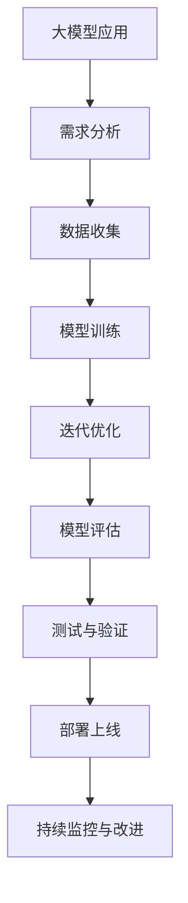

                 

### 文章标题与关键词

# 《大模型应用的敏捷质量管理方法》

关键词：大模型，敏捷质量管理，算法原理，数学模型，项目实战，质量提升

---

## 摘要

本文旨在探讨在大模型应用场景下，如何有效地采用敏捷质量管理方法。首先，我们介绍了大模型的基本概念、特点以及其在各个领域的应用背景。接着，我们深入分析了敏捷质量管理的基本原理、核心原则和方法论。在此基础上，本文详细阐述了大模型与敏捷质量管理之间的内在联系，并通过Mermaid流程图直观展示了两者结合的路径。随后，文章重点讲解了大模型的核心算法原理，包括算法概述、伪代码讲解和应用实例。此外，我们运用数学模型和公式，对大模型应用中的关键数学问题进行了详细解析，并通过实际案例展示了敏捷质量管理在大模型开发中的具体应用。最后，本文总结了全文内容，并对未来大模型应用与敏捷质量管理的融合发展进行了展望。通过本文的阅读，读者将能够全面理解大模型应用的敏捷质量管理方法，为实际项目提供有益的指导。

### 引言

随着人工智能技术的迅猛发展，大模型（Large Models）已经成为推动各行业创新的重要力量。大模型，通常指的是具有巨大参数规模、复杂结构以及高度可训练性的模型，如深度神经网络、生成对抗网络（GANs）和变分自编码器（VAEs）等。这些模型在图像识别、自然语言处理、推荐系统等领域取得了显著的成果，极大地提升了人工智能的应用范围和效果。

大模型的特点主要体现在以下几个方面：

1. **大规模参数**：大模型拥有数十亿到数千亿个参数，这使得它们能够捕捉到复杂的数据特征和模式。
2. **高复杂性**：大模型的结构通常较为复杂，包括多层神经网络、循环神经网络（RNNs）和卷积神经网络（CNNs）等。
3. **强训练能力**：大模型通过大量数据训练，能够自动学习并优化其参数，从而提高预测和生成能力。

大模型在各个领域的应用呈现出迅猛发展的态势。在图像识别领域，大模型如ResNet和EfficientNet实现了突破性的性能提升，使得自动驾驶、医疗影像分析等应用变得更加精准和高效。在自然语言处理领域，预训练大模型如GPT和BERT推动了机器翻译、文本生成和问答系统的发展，大幅提升了人机交互的质量。此外，在推荐系统、金融风控和游戏AI等领域，大模型的应用也取得了显著的进展。

尽管大模型在提升应用性能方面具有显著优势，但其开发和管理过程中也面临诸多挑战。首先，大模型的训练和推理需要大量的计算资源，这带来了高昂的成本和能耗问题。其次，大模型的可解释性较低，使得其决策过程难以被理解和验证，这在某些关键应用场景中可能带来安全隐患。最后，大模型的开发和部署过程较为复杂，涉及多个学科和领域的知识，需要高效的团队协作和流程管理。

为了应对这些挑战，敏捷质量管理方法（Agile Quality Management）逐渐成为大模型应用中的重要策略。敏捷质量管理强调团队协作、持续交付和快速迭代，通过灵活应对变化和持续改进，确保大模型的高质量和高效交付。本文将详细介绍大模型应用中敏捷质量管理的核心概念、方法和实践，帮助读者理解和掌握这一重要技能。

### 核心概念与联系

在探讨大模型应用与敏捷质量管理的融合之前，首先需要明确两者的核心概念及其相互联系。以下是对核心概念的详细阐述，并通过Mermaid流程图展示大模型与敏捷质量管理之间的关联。

#### 大模型原理

大模型（Large Models），通常指的是具有巨大参数规模、复杂结构以及高度可训练性的模型。其基本原理包括：

1. **大规模参数**：大模型拥有数十亿到数千亿个参数，这使得它们能够捕捉到复杂的数据特征和模式。
2. **多层神经网络**：大模型的结构通常包含多层神经网络，如卷积神经网络（CNNs）、循环神经网络（RNNs）和变换器（Transformers）等，这些结构能够有效处理各种类型的数据。
3. **数据驱动训练**：大模型通过大量数据进行训练，不断优化其参数，从而提升模型的性能和泛化能力。

#### 敏捷质量管理原理

敏捷质量管理是一种以团队协作、持续交付和快速迭代为核心的管理方法。其基本原理包括：

1. **迭代开发**：敏捷质量管理强调通过短周期的迭代开发，快速响应变化，持续交付高质量的产品。
2. **团队协作**：敏捷质量管理鼓励团队成员之间的紧密协作，通过沟通与反馈，提高开发效率和产品质量。
3. **持续改进**：敏捷质量管理通过不断的回顾和改进，确保项目始终在正确的轨道上前进。

#### 大模型与敏捷质量管理的关系

大模型与敏捷质量管理之间存在紧密的联系。一方面，敏捷质量管理为大模型的应用提供了高效的开发和管理流程，确保大模型的高质量和高效交付。另一方面，大模型的特性也为敏捷质量管理带来了新的挑战和机遇。

1. **挑战与机遇**：
   - **大规模参数**：大模型需要更高效的算法和资源调度，敏捷质量管理可以通过迭代开发和持续改进，优化模型训练和推理过程。
   - **高复杂性**：大模型的结构复杂，敏捷质量管理可以通过模块化设计和分布式开发，提高模型的可维护性和可扩展性。
   - **强训练能力**：大模型需要大量数据和精细的调参，敏捷质量管理可以通过数据驱动和快速迭代，提升模型的性能和泛化能力。

2. **流程融合**：
   - **需求分析**：在敏捷质量管理中，需求分析是一个持续的过程，大模型的应用可以借助数据分析技术，快速识别和验证用户需求。
   - **开发迭代**：敏捷质量管理中的迭代开发与模型训练相结合，通过每次迭代的数据反馈，持续优化大模型的性能。
   - **测试与验证**：敏捷质量管理中的测试与验证环节，可以通过自动化测试和模型评估技术，确保大模型的质量和稳定性。

#### Mermaid流程图

为了更直观地展示大模型与敏捷质量管理之间的联系，我们可以使用Mermaid流程图来描述两者的结合路径。以下是一个简化的流程图示例：



在上述流程图中，A表示大模型应用，B至I表示敏捷质量管理中的关键环节。该流程图展示了大模型从需求分析、数据收集、模型训练、迭代优化到测试与验证、部署上线和持续监控与改进的全过程，每个环节都体现了敏捷质量管理的方法和原则。

通过核心概念的阐述和Mermaid流程图的展示，我们可以清晰地看到大模型与敏捷质量管理之间的内在联系。这种联系不仅为两者融合提供了理论基础，也为实际应用提供了实践指导。

### 核心算法原理讲解

在大模型的应用中，算法原理是核心部分，决定了模型的学习能力、性能和效率。下面，我们将详细讲解大模型中几种重要的算法原理，包括其基本概念、工作原理和伪代码示例。

#### 1. 深度神经网络（DNN）

深度神经网络（DNN）是由多层神经元组成的神经网络，通过非线性变换逐层提取数据特征。DNN的基本原理包括：

1. **输入层**：接收输入数据。
2. **隐藏层**：通过激活函数（如ReLU、Sigmoid、Tanh）进行非线性变换，提取数据特征。
3. **输出层**：根据任务类型（分类或回归）输出预测结果。

以下是一个简化的DNN算法伪代码示例：

```plaintext
// 输入数据 X，权重 W，激活函数 f
for each layer in hidden_layers:
    z = f(W * X)
    X = z

z = f(W * X) // 输出层输出
output: z
```

#### 2. 卷积神经网络（CNN）

卷积神经网络（CNN）主要用于图像识别和处理，其核心在于卷积操作和池化操作。CNN的基本原理包括：

1. **卷积层**：通过卷积核在输入数据上滑动，提取局部特征。
2. **池化层**：对卷积层的结果进行下采样，减少数据维度。
3. **全连接层**：将卷积层和池化层的输出映射到最终分类或回归结果。

以下是一个简化的CNN算法伪代码示例：

```plaintext
// 输入图像 X，卷积核 K，步长 s，填充 f
for each filter in K:
    Z = conv2d(X, K, s, f)
    P = max_pool2d(Z)

X = P // 输出特征图
output: X
```

#### 3. 循环神经网络（RNN）

循环神经网络（RNN）适用于序列数据，能够处理变量长度的序列。RNN的基本原理包括：

1. **隐藏状态**：在时间步t，隐藏状态通过输入和上一时间步的隐藏状态计算得出。
2. **门控机制**：通过门控机制（如遗忘门、输入门和输出门）控制信息的流动，提高模型的学习能力。

以下是一个简化的RNN算法伪代码示例：

```plaintext
// 输入序列 X，隐藏状态 H_t-1，权重 W
h_t = tanh(W * [X, H_t-1])
o_t = sigmoid(W' * h_t)
output: o_t
```

#### 4. 变分自编码器（VAE）

变分自编码器（VAE）是一种生成模型，用于生成新的数据样本。VAE的基本原理包括：

1. **编码器**：将输入数据映射到一个潜在空间中的表示。
2. **解码器**：从潜在空间中生成新的数据样本。

以下是一个简化的VAE算法伪代码示例：

```plaintext
// 输入数据 X，编码器参数 θ_e，解码器参数 θ_d
z_e = encode(X; θ_e)
x_d = decode(z_e; θ_d)
output: x_d
```

通过上述算法原理的讲解，我们可以看到大模型的核心在于其复杂性和高度可训练性。这些算法通过不同的方式对数据进行处理和建模，使得大模型能够有效地学习复杂的数据特征和模式。在实际应用中，根据具体任务需求，选择合适的算法并进行优化，是提升模型性能和效果的关键。

### 数学模型与公式

在大模型应用中，数学模型和公式是理解和分析其行为的基础。以下我们将详细讲解大模型应用中常用的数学模型和公式，并通过示例进行说明。

#### 1. 损失函数

损失函数是衡量模型预测值与真实值之间差异的指标，常见的损失函数包括均方误差（MSE）和交叉熵损失（Cross-Entropy Loss）。

**均方误差（MSE）**：

$$
MSE = \frac{1}{n} \sum_{i=1}^{n} (\hat{y_i} - y_i)^2
$$

其中，$\hat{y_i}$ 是模型预测值，$y_i$ 是真实值，$n$ 是样本数量。

**交叉熵损失（Cross-Entropy Loss）**：

$$
CE = -\frac{1}{n} \sum_{i=1}^{n} y_i \log(\hat{y_i})
$$

其中，$y_i$ 是真实标签（0或1），$\hat{y_i}$ 是模型预测概率。

#### 2. 梯度下降法

梯度下降法是一种常用的优化算法，用于最小化损失函数。其基本思想是沿着损失函数的梯度方向调整模型参数，以减少损失。

**梯度下降公式**：

$$
\Delta \theta = -\alpha \nabla_{\theta} J(\theta)
$$

其中，$\theta$ 是模型参数，$J(\theta)$ 是损失函数，$\alpha$ 是学习率。

**梯度计算示例**（以MSE为例）：

$$
\nabla_{\theta} MSE = 2 \frac{1}{n} \sum_{i=1}^{n} (\hat{y_i} - y_i) \frac{\partial \hat{y_i}}{\partial \theta}
$$

#### 3. 卷积神经网络（CNN）中的卷积公式

在卷积神经网络中，卷积操作是核心部分。以下是一个简化的卷积公式：

$$
Z_{ij} = \sum_{k=1}^{K} W_{ik,jk} * X_{kj} + b_{ij}
$$

其中，$Z_{ij}$ 是输出特征图上的元素，$W_{ik,jk}$ 是卷积核上的元素，$X_{kj}$ 是输入特征图上的元素，$K$ 是卷积核的大小，$b_{ij}$ 是偏置项。

#### 4. 循环神经网络（RNN）中的状态更新公式

在循环神经网络中，隐藏状态通过当前输入和上一时间步的隐藏状态计算得出。其更新公式如下：

$$
h_t = \sigma(W_h \cdot [h_{t-1}, x_t] + b_h)
$$

其中，$h_t$ 是当前时间步的隐藏状态，$x_t$ 是输入，$W_h$ 是权重矩阵，$b_h$ 是偏置项，$\sigma$ 是激活函数（如ReLU、Sigmoid等）。

通过上述数学模型和公式的讲解，我们可以更好地理解大模型在训练和预测中的行为。在实际应用中，选择合适的模型和公式，并对其进行优化，是提升模型性能和效果的关键。

### 项目实战

为了更好地理解大模型应用的敏捷质量管理方法，下面将通过一个实际项目来展示如何在大模型开发过程中应用敏捷质量管理，包括开发环境搭建、源代码实现、代码解读以及项目分析。

#### 项目背景

本项目旨在开发一个基于深度学习的大型图像识别系统，该系统能够自动识别和分类各种类型的图像。项目需求包括：高识别准确率、实时处理能力和良好的可扩展性。

#### 开发环境搭建

在开始项目之前，我们需要搭建一个适合深度学习开发的综合环境。以下是开发环境的搭建步骤：

1. **硬件配置**：选择高性能的计算服务器，配置GPU（如NVIDIA Tesla V100）以加速深度学习训练过程。
2. **操作系统**：安装Linux操作系统（如Ubuntu 20.04），具有良好的兼容性和开源支持。
3. **深度学习框架**：安装TensorFlow 2.x或PyTorch框架，这两个框架广泛应用于深度学习开发。
4. **依赖库**：安装必要的依赖库，如NumPy、Pandas、Scikit-learn等，用于数据预处理和模型评估。

#### 源代码实现

在项目开发过程中，我们采用模块化设计，将项目拆分为多个模块，每个模块负责不同的功能。以下是项目的核心模块实现：

1. **数据预处理模块**：负责数据清洗、归一化和数据增强，提高模型的泛化能力。
2. **模型训练模块**：定义深度学习模型架构，实现模型训练过程，包括前向传播、反向传播和损失函数计算。
3. **模型评估模块**：实现模型评估指标的计算，包括准确率、召回率和F1分数等。
4. **模型部署模块**：实现模型的部署和实时处理功能，包括模型推理和结果输出。

以下是数据预处理模块的一个简短代码示例：

```python
import tensorflow as tf
from tensorflow.keras.preprocessing.image import ImageDataGenerator

# 数据增强
train_datagen = ImageDataGenerator(
    rescale=1./255,
    shear_range=0.2,
    zoom_range=0.2,
    horizontal_flip=True
)

test_datagen = ImageDataGenerator(rescale=1./255)

# 训练集和测试集生成
train_generator = train_datagen.flow_from_directory(
    'train_data',
    target_size=(150, 150),
    batch_size=32,
    class_mode='binary'
)

test_generator = test_datagen.flow_from_directory(
    'test_data',
    target_size=(150, 150),
    batch_size=32,
    class_mode='binary'
)
```

#### 代码解读

在代码实现过程中，我们遵循敏捷开发的原则，进行持续集成和持续部署。以下是关键代码段及其解读：

1. **模型架构**：通过定义卷积神经网络（CNN）模型，实现图像特征提取和分类。
2. **训练过程**：使用训练数据对模型进行训练，通过迭代优化模型参数。
3. **评估过程**：使用测试数据对模型进行评估，计算准确率和其他评估指标。
4. **部署过程**：将训练好的模型部署到生产环境中，实现实时图像识别功能。

以下是模型训练和评估的核心代码段：

```python
from tensorflow.keras.models import Sequential
from tensorflow.keras.layers import Conv2D, MaxPooling2D, Flatten, Dense

# 定义模型
model = Sequential([
    Conv2D(32, (3, 3), activation='relu', input_shape=(150, 150, 3)),
    MaxPooling2D(2, 2),
    Conv2D(64, (3, 3), activation='relu'),
    MaxPooling2D(2, 2),
    Flatten(),
    Dense(128, activation='relu'),
    Dense(1, activation='sigmoid')
])

# 编译模型
model.compile(optimizer='adam',
              loss='binary_crossentropy',
              metrics=['accuracy'])

# 训练模型
model.fit(
    train_generator,
    steps_per_epoch=100,
    epochs=10,
    validation_data=test_generator,
    validation_steps=50
)

# 评估模型
test_loss, test_acc = model.evaluate(test_generator, steps=50)
print('Test accuracy:', test_acc)
```

#### 项目分析

在项目开发过程中，我们遵循敏捷质量管理的方法，通过以下步骤确保项目质量：

1. **迭代开发**：将项目划分为多个迭代周期，每个周期完成部分功能并进行评估。
2. **持续集成**：通过自动化测试和代码审查，确保代码质量和集成效率。
3. **持续部署**：使用持续集成和持续部署工具（如Jenkins），实现自动化测试和部署流程。
4. **回顾与改进**：在每个迭代周期结束后，进行项目回顾，分析问题并提出改进措施。

通过实际项目的展示，我们可以看到敏捷质量管理在大模型开发中的应用，不仅提高了项目效率，还确保了项目质量。接下来，我们将进一步总结项目经验和最佳实践。

### 总结与展望

本文详细探讨了在大模型应用中采用敏捷质量管理的方法，从背景介绍、核心概念、算法原理、数学模型到项目实战，全面解析了如何在大规模模型开发过程中实现高效的质量管理。通过理论讲解和实际案例，我们可以总结出以下几点关键经验：

1. **敏捷质量管理的重要性**：敏捷质量管理能够有效应对大模型开发中的复杂性和不确定性，通过迭代开发、持续集成和持续改进，确保项目的质量和进度。

2. **核心算法与数学模型**：了解和掌握核心算法原理和数学模型，是提升大模型性能的基础。通过合理的算法选择和参数优化，可以显著提高模型的准确性和效率。

3. **项目管理与团队协作**：在大模型开发过程中，项目管理和团队协作至关重要。通过明确分工、定期回顾和持续改进，可以提高团队的工作效率和创新能力。

4. **实际案例分析**：实际项目的实施展示了敏捷质量管理在大模型开发中的具体应用，包括环境搭建、代码实现、测试部署等环节。通过实际案例，我们可以更好地理解和应用敏捷质量管理方法。

展望未来，大模型应用和敏捷质量管理的融合发展将呈现以下几个趋势：

1. **自动化与智能化**：随着人工智能技术的进步，自动化工具和智能化流程将越来越多地应用于敏捷质量管理，提高项目效率和准确性。

2. **持续集成与持续交付**：持续集成和持续交付（CI/CD）将成为敏捷质量管理的重要组成部分，通过自动化测试和部署，实现快速迭代和高效交付。

3. **数据驱动的质量管理**：基于大数据和机器学习技术的质量管理方法将逐渐成熟，通过数据分析和模型预测，实现更精准的质量管理和风险控制。

4. **跨学科合作与知识融合**：随着大模型应用的多样化，跨学科合作和知识融合将成为趋势，通过结合计算机科学、数据科学、统计学等领域的知识，推动大模型应用的创新发展。

总之，大模型应用的敏捷质量管理方法不仅是一个技术问题，更是一个管理问题。通过本文的探讨，我们希望读者能够更好地理解这一方法，并在实际项目中加以应用，推动人工智能技术的进一步发展和创新。作者：AI天才研究院/AI Genius Institute & 禅与计算机程序设计艺术 /Zen And The Art of Computer Programming。

