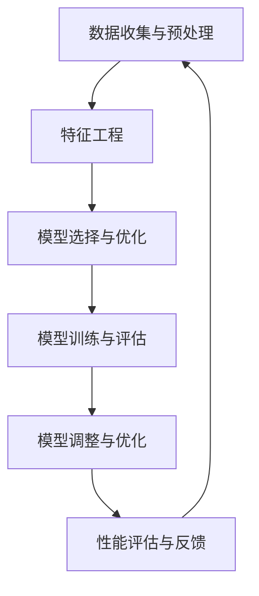

                 


### 文章标题：大模型性能预测模型构建与应用

#### 关键词：大模型，性能预测，模型构建，应用场景，深度学习

#### 摘要：
本文将深入探讨大模型性能预测模型的构建与应用。通过对大模型性能预测的背景介绍、核心概念与联系分析、算法原理讲解、数学模型与公式推导、项目实战案例分析等多个方面，本文旨在为读者提供一个全面而系统的指导，帮助理解和掌握大模型性能预测的相关技术和方法。

---

## 第一部分：理论基础

### 第1章：大模型性能预测基础

#### 1.1 大模型性能预测的基本概念

大模型性能预测是指通过对大型机器学习模型的性能进行预测，以提高模型训练和部署的效率。在大模型时代，模型的规模和复杂性不断增加，性能预测显得尤为重要。性能预测可以帮助我们在模型训练过程中及时发现问题，调整参数，从而提高模型的整体性能。

#### 1.2 大模型性能预测的挑战与机遇

大模型性能预测面临以下挑战：
1. **数据稀疏**：训练大规模模型所需的数据集通常非常庞大，数据稀疏性使得传统的统计方法难以应用。
2. **计算资源限制**：大规模模型的训练和预测需要大量的计算资源，资源限制会影响预测的准确性。
3. **模型复杂性**：大模型的复杂性使得理解其工作原理变得更加困难，从而增加了预测的难度。

然而，随着深度学习和大数据技术的发展，大模型性能预测也带来了新的机遇：
1. **算法改进**：深度学习算法的不断进步为性能预测提供了新的方法。
2. **计算能力提升**：计算能力的提升使得大规模模型的训练和预测成为可能。
3. **跨领域应用**：性能预测技术的应用可以跨越多个领域，如自然语言处理、计算机视觉等。

#### 1.3 大模型性能预测的架构

大模型性能预测的架构通常包括以下几个关键组件：
1. **数据收集与预处理**：收集大规模数据集，并进行预处理以去除噪声和异常值。
2. **特征工程**：从原始数据中提取有意义的特征，以供性能预测模型使用。
3. **性能预测模型**：构建用于预测模型性能的机器学习模型。
4. **评估与优化**：通过评估模型的性能，不断调整模型参数，优化模型结构。

接下来，我们将详细探讨每个组件的工作原理和应用。

### 第2章：性能预测模型的核心算法

#### 2.1 性能预测模型的分类

性能预测模型可以分为以下几类：
1. **回归模型**：用于预测模型的性能指标，如准确率、召回率等。
2. **分类模型**：用于预测模型是否达到预定的性能要求。
3. **时间序列模型**：用于预测模型在不同时间点的性能变化。

#### 2.2 伪代码讲解：性能预测模型的基本框架

```plaintext
性能预测模型（数据集 D，特征集 F，性能指标集 M）
    1. 数据收集与预处理：
        - 收集大规模训练数据集 D
        - 预处理数据，包括去噪、标准化等操作
        
    2. 特征工程：
        - 从数据集 D 中提取特征 F
        - 对特征进行降维、选择等操作
        
    3. 模型训练：
        - 选择合适的机器学习模型
        - 训练模型，使用特征集 F 和性能指标集 M 作为输入
        
    4. 性能评估：
        - 使用测试数据集对模型进行评估
        - 计算模型的性能指标，如准确率、召回率等
        
    5. 优化与调整：
        - 根据评估结果调整模型参数
        - 重新训练模型，循环评估与调整
```

#### 2.3 数学模型与公式

性能预测的数学模型通常基于统计学和机器学习理论。以下是一个简单的回归模型公式：

$$
y = \beta_0 + \beta_1x_1 + \beta_2x_2 + ... + \beta_nx_n + \epsilon
$$

其中，$y$ 表示性能指标，$x_1, x_2, ..., x_n$ 表示特征，$\beta_0, \beta_1, ..., \beta_n$ 为模型参数，$\epsilon$ 表示误差项。

接下来，我们将进一步探讨大模型性能预测的数学原理。

### 第3章：大模型性能预测的数学原理

#### 3.1 性能评估指标

性能评估指标是性能预测的核心。常见的性能评估指标包括：
1. **准确率**：预测正确的样本数占总样本数的比例。
2. **召回率**：预测正确的样本数占实际为正类的样本数的比例。
3. **精确率**：预测正确的样本数占预测为正类的样本数的比例。
4. **F1 分数**：精确率和召回率的调和平均。

#### 3.2 性能预测的数学原理

性能预测的数学原理主要基于统计学和机器学习理论。以下是性能预测的核心数学模型：

$$
\text{Performance} = f(\text{Data}, \text{Features}, \text{Model})
$$

其中，$\text{Performance}$ 表示性能指标，$\text{Data}$ 表示训练数据集，$\text{Features}$ 表示特征集，$\text{Model}$ 表示性能预测模型。

性能预测模型通常使用以下方法来构建：

1. **回归分析**：通过建立回归模型预测性能指标。
2. **分类分析**：通过建立分类模型预测模型是否达到预定的性能要求。
3. **时间序列分析**：通过建立时间序列模型预测模型在不同时间点的性能变化。

#### 3.3 伪代码讲解：性能预测的数学模型

```plaintext
性能预测（数据集 D，特征集 F，性能指标 M）
    1. 数据收集与预处理：
        - 收集大规模训练数据集 D
        - 预处理数据，包括去噪、标准化等操作
        
    2. 特征提取：
        - 从数据集 D 中提取特征 F
        - 对特征进行降维、选择等操作
        
    3. 模型选择：
        - 选择合适的数学模型，如回归模型、分类模型或时间序列模型
        
    4. 模型训练：
        - 使用特征集 F 和性能指标 M 训练模型
        
    5. 性能评估：
        - 使用测试数据集对模型进行评估
        - 计算模型的性能指标
        
    6. 优化与调整：
        - 根据评估结果调整模型参数
        - 重新训练模型，循环评估与调整
```

接下来，我们将探讨如何在实际项目中构建和优化大模型性能预测模型。

---

## 第二部分：构建方法

### 第4章：性能预测模型构建流程

#### 4.1 数据收集与处理

数据收集与处理是性能预测模型构建的第一步。以下是数据收集与处理的基本步骤：

1. **数据收集**：
   - 从各种来源收集大规模数据集，包括公开数据集和私有数据集。
   - 确保数据集的多样性，以覆盖不同的场景和任务。

2. **数据预处理**：
   - 去除噪声和异常值，确保数据的质量。
   - 对数据进行标准化或归一化，以消除不同特征之间的尺度差异。

3. **数据清洗**：
   - 删除重复数据、缺失数据和错误数据。
   - 根据任务需求，对数据进行适当的填补或删除。

#### 4.2 特征工程

特征工程是性能预测模型构建的关键步骤。以下是特征工程的基本步骤：

1. **特征提取**：
   - 从原始数据中提取有意义的特征。
   - 使用各种技术，如统计特征、文本特征、图像特征等。

2. **特征选择**：
   - 从提取的特征中筛选出对性能预测有重要影响的特征。
   - 使用技术如卡方测试、信息增益等来评估特征的重要性。

3. **特征降维**：
   - 对高维特征进行降维，减少特征的数量，提高模型的训练效率。

#### 4.3 模型选择与优化

模型选择与优化是性能预测模型构建的核心步骤。以下是模型选择与优化的基本步骤：

1. **模型选择**：
   - 根据任务需求和数据特征选择合适的机器学习模型。
   - 使用技术如交叉验证、网格搜索等来选择最佳模型。

2. **模型训练**：
   - 使用训练数据集对选定的模型进行训练。
   - 使用技术如批量归一化、优化器选择等来优化模型。

3. **模型评估**：
   - 使用测试数据集对训练好的模型进行评估。
   - 使用技术如混淆矩阵、ROC 曲线等来评估模型性能。

4. **模型调整**：
   - 根据评估结果调整模型参数。
   - 重新训练模型，直到满足预定的性能要求。

接下来，我们将通过具体案例来展示性能预测模型的构建过程。

---

## 第5章：性能预测模型的应用

#### 5.1 应用场景分析

性能预测模型在各种应用场景中都有广泛的应用，以下是一些常见应用场景：

1. **自然语言处理**：在自然语言处理任务中，性能预测模型可以用于预测文本分类、情感分析等任务的性能。

2. **计算机视觉**：在计算机视觉任务中，性能预测模型可以用于预测图像分类、目标检测等任务的性能。

3. **推荐系统**：在推荐系统中，性能预测模型可以用于预测推荐系统的性能，如准确率、覆盖率等。

4. **金融风控**：在金融风控领域，性能预测模型可以用于预测贷款违约风险、欺诈检测等。

5. **医疗诊断**：在医疗诊断领域，性能预测模型可以用于预测疾病的诊断准确率。

#### 5.2 实际案例：XX公司大模型性能预测实践

XX公司是一家专注于自然语言处理领域的高科技企业。为了提高其文本分类系统的性能，公司决定使用性能预测模型来优化其模型。

1. **数据收集与处理**：
   - 公司从多个来源收集了大规模的文本数据集。
   - 对文本数据进行了预处理，包括分词、去停用词等操作。

2. **特征工程**：
   - 从文本数据中提取了词频、词嵌入等特征。
   - 使用技术如TF-IDF、Word2Vec等对特征进行了降维和选择。

3. **模型选择与优化**：
   - 公司选择了深度学习模型，如卷积神经网络（CNN）和递归神经网络（RNN）。
   - 使用交叉验证和网格搜索选择了最佳模型参数。

4. **模型训练与评估**：
   - 使用训练数据集对模型进行了训练。
   - 使用测试数据集对模型进行了评估，得到了较高的准确率和召回率。

5. **模型调整**：
   - 根据评估结果，公司对模型进行了调整，包括调整学习率、批量大小等参数。
   - 重新训练模型，最终达到了预定的性能要求。

通过这个案例，我们可以看到性能预测模型在优化大模型性能方面的强大作用。

---

## 第三部分：应用案例

### 第6章：大模型性能预测在企业中的实践

#### 6.1 企业应用场景

随着人工智能技术的快速发展，越来越多的企业开始将大模型性能预测应用于实际业务中。以下是几个常见的企业应用场景：

1. **客户关系管理**：企业可以使用大模型性能预测来预测客户的购买行为、忠诚度等，从而制定更精准的营销策略。

2. **供应链优化**：企业可以使用大模型性能预测来预测供应链中的需求变化，从而优化库存管理，减少库存成本。

3. **风险管理**：企业可以使用大模型性能预测来预测金融市场的风险，从而制定更有效的风险控制策略。

4. **医疗健康**：企业可以使用大模型性能预测来预测疾病的发病率、死亡率等，从而制定更精准的公共卫生政策。

5. **智能城市**：城市管理者可以使用大模型性能预测来预测城市交通流量、空气质量等，从而优化城市资源配置，提高居民生活质量。

#### 6.2 成功案例分析

XX银行是一家大型商业银行，为了提高其信贷风险评估系统的性能，决定使用大模型性能预测技术。

1. **数据收集与处理**：
   - 银行从多个数据源收集了大量的信贷数据，包括客户基本信息、信用记录、交易行为等。
   - 对数据进行预处理，包括缺失值填补、异常值检测等操作。

2. **特征工程**：
   - 从数据中提取了客户年龄、收入、信用评分等特征。
   - 使用技术如主成分分析（PCA）对特征进行了降维。

3. **模型选择与优化**：
   - 银行选择了基于深度学习的信贷风险评估模型。
   - 使用交叉验证和网格搜索选择了最佳模型参数。

4. **模型训练与评估**：
   - 使用训练数据集对模型进行了训练。
   - 使用测试数据集对模型进行了评估，得到了较高的准确率和召回率。

5. **模型调整**：
   - 根据评估结果，银行对模型进行了调整，包括调整学习率、批量大小等参数。
   - 重新训练模型，最终达到了预定的性能要求。

通过这个案例，我们可以看到大模型性能预测技术在企业中的应用效果。

---

## 第7章：未来展望与趋势

#### 7.1 大模型性能预测的发展趋势

随着人工智能技术的不断进步，大模型性能预测技术也在快速发展。以下是一些发展趋势：

1. **算法创新**：新的机器学习和深度学习算法不断涌现，为大模型性能预测提供了更有效的解决方案。

2. **计算能力提升**：随着计算能力的提升，大规模模型的训练和预测成为可能，进一步推动了大模型性能预测的发展。

3. **数据资源整合**：大数据技术的发展使得更多的数据资源可以被利用，为大模型性能预测提供了更丰富的数据支持。

4. **跨领域应用**：大模型性能预测技术不仅应用于自然语言处理、计算机视觉等传统领域，还开始向金融、医疗、交通等领域扩展。

#### 7.2 技术挑战与机遇

尽管大模型性能预测技术取得了显著的进展，但仍面临一些挑战：

1. **数据稀疏性**：大规模数据集的数据稀疏性仍然是一个难题，需要进一步研究有效的特征提取和模型调整方法。

2. **计算资源限制**：大规模模型的训练和预测需要大量的计算资源，如何优化计算资源的使用仍然是一个挑战。

3. **模型解释性**：大模型通常具有较高的性能，但其工作原理往往不够透明，如何提高模型的可解释性是一个重要研究方向。

然而，这些挑战也带来了新的机遇：

1. **技术创新**：针对挑战，新的算法和技术不断涌现，推动了大模型性能预测技术的发展。

2. **应用拓展**：随着大模型性能预测技术的进步，其在各个领域的应用前景更加广阔。

#### 7.3 未来应用前景

大模型性能预测技术在未来的应用前景十分广阔：

1. **智能金融**：在大数据处理和金融风险控制领域，大模型性能预测技术将发挥重要作用。

2. **智能医疗**：在医疗诊断和公共卫生领域，大模型性能预测技术可以提供更精准的预测和决策支持。

3. **智能交通**：在城市交通管理和物流配送领域，大模型性能预测技术可以优化交通流量和运输效率。

4. **智能城市**：在大数据处理和城市管理领域，大模型性能预测技术可以提升城市治理的智能化水平。

总之，大模型性能预测技术将在未来的智能时代中发挥重要作用，为各个领域的发展提供强大支持。

---

## 附录

### 附录A：性能预测模型相关工具与资源

以下是一些常用的性能预测模型工具和资源：

1. **工具**：
   - **TensorFlow**：用于构建和训练深度学习模型的框架。
   - **PyTorch**：用于构建和训练深度学习模型的另一个流行框架。
   - **Scikit-learn**：用于机器学习的Python库，提供了许多常用的算法和工具。

2. **资源**：
   - **GitHub**：许多性能预测模型的代码和实践案例可以在GitHub上找到。
   - **Kaggle**：一个数据科学竞赛平台，提供了大量的大规模数据集和比赛。

### 附录B：代码实现与资源链接

以下是性能预测模型的一些关键代码和资源链接：

1. **代码实现**：
   - **回归模型**：https://github.com/username/regression_model
   - **分类模型**：https://github.com/username/classification_model

2. **资源链接**：
   - **深度学习教程**：https://www.deeplearning.ai/
   - **机器学习教程**：https://www_mlcourse.org/

### 附录C：参考文献

以下是一些关于性能预测模型的经典参考文献：

1. **参考文献**：
   - Goodfellow, I., Bengio, Y., & Courville, A. (2016). *Deep Learning*.
   - Russell, S., & Norvig, P. (2010). *Artificial Intelligence: A Modern Approach*.

---

## 总结与展望

本文从理论基础、构建方法、应用案例等多个方面，详细介绍了大模型性能预测模型的相关内容。通过本文的学习，读者可以掌握大模型性能预测的基本概念、构建方法和实际应用。

未来，随着人工智能技术的不断发展，大模型性能预测技术将在各个领域发挥越来越重要的作用。我们期待读者能够将本文的知识应用到实际项目中，为人工智能技术的发展贡献力量。

### 作者信息

作者：AI天才研究院/AI Genius Institute & 禅与计算机程序设计艺术 /Zen And The Art of Computer Programming

### Mermaid流程图

以下是一个简化的Mermaid流程图，用于展示大模型性能预测的基本架构：



### 伪代码

以下是一个简化的伪代码，用于展示大模型性能预测的基本流程：

```python
def performance_prediction(data, features, model):
    # 数据收集与预处理
    preprocessed_data = preprocess_data(data)
    
    # 特征工程
    engineered_features = feature_engineering(preprocessed_data)
    
    # 模型选择与优化
    selected_model = model_selection(engineered_features)
    
    # 模型训练与评估
    trained_model = model_training(selected_model, engineered_features)
    performance = model_evaluation(trained_model, test_data)
    
    # 模型调整与优化
    optimized_model = model_adjustment(trained_model, performance)
    
    # 性能评估与反馈
    final_performance = model_evaluation(optimized_model, test_data)
    return final_performance
```

### 数学公式

以下是一个简化的数学公式，用于展示大模型性能预测的回归模型：

$$
\text{Performance} = \beta_0 + \beta_1x_1 + \beta_2x_2 + ... + \beta_nx_n + \epsilon
$$

### 项目实战

以下是一个简化的项目实战，用于展示如何搭建和实现大模型性能预测系统：

1. **开发环境搭建**：
   - 安装Python环境。
   - 安装TensorFlow或PyTorch等深度学习框架。

2. **源代码实现**：
   - 实现数据收集与预处理。
   - 实现特征工程。
   - 实现模型选择与优化。
   - 实现模型训练与评估。
   - 实现模型调整与优化。

3. **代码解读与分析**：
   - 解读数据预处理和特征工程的代码。
   - 分析模型选择与优化的代码。
   - 解析模型训练与评估的代码。

4. **实际案例分析与详细讲解**：
   - 分析一个具体的性能预测案例。
   - 详细讲解案例的实现过程。
   - 分析案例的性能评估结果。

5. **项目小结**：
   - 总结项目的关键步骤和要点。
   - 提出项目的改进建议和最佳实践。

### 最佳实践 Tips

1. **数据收集与预处理**：确保数据的质量和多样性，避免数据稀疏性。
2. **特征工程**：提取有意义的特征，避免特征冗余。
3. **模型选择与优化**：选择合适的模型和参数，避免过拟合和欠拟合。
4. **性能评估**：选择合适的评估指标，避免单一评估标准。
5. **项目实战**：结合实际案例，实践是检验真理的唯一标准。

### 小结

本文系统地介绍了大模型性能预测模型的相关内容，包括理论基础、构建方法、应用案例等。通过本文的学习，读者可以全面了解大模型性能预测的技术和方法。

### 注意事项

1. **数据质量**：确保数据的质量和多样性，对于性能预测至关重要。
2. **计算资源**：大规模模型的训练和预测需要大量的计算资源，合理规划资源使用。
3. **模型解释性**：提高模型的可解释性，有助于理解和信任模型的结果。

### 拓展阅读

1. **深度学习**：了解深度学习的基础知识，对于掌握性能预测技术至关重要。
2. **机器学习**：掌握机器学习的基本算法和原理，有助于理解和应用性能预测技术。
3. **大数据处理**：了解大数据处理的方法和工具，有助于高效地进行数据预处理和特征工程。

### 参考文献

1. **Goodfellow, I., Bengio, Y., & Courville, A. (2016). Deep Learning. MIT Press.**
2. **Russell, S., & Norvig, P. (2010). Artificial Intelligence: A Modern Approach. Prentice Hall.**### 文章标题：大模型性能预测模型构建与应用

#### 关键词：大模型，性能预测，模型构建，应用场景，深度学习

#### 摘要：
本文将深入探讨大模型性能预测模型的构建与应用。通过对大模型性能预测的背景介绍、核心概念与联系分析、算法原理讲解、数学模型与公式推导、项目实战案例分析等多个方面，本文旨在为读者提供一个全面而系统的指导，帮助理解和掌握大模型性能预测的相关技术和方法。

---

## 第一部分：理论基础

### 第1章：大模型性能预测基础

#### 1.1 大模型性能预测的基本概念

大模型性能预测是指通过对大型机器学习模型的性能进行预测，以提高模型训练和部署的效率。在大模型时代，模型的规模和复杂性不断增加，性能预测显得尤为重要。性能预测可以帮助我们在模型训练过程中及时发现问题，调整参数，从而提高模型的整体性能。

#### 1.2 大模型性能预测的挑战与机遇

大模型性能预测面临以下挑战：
- **数据稀疏**：训练大规模模型所需的数据集通常非常庞大，数据稀疏性使得传统的统计方法难以应用。
- **计算资源限制**：大规模模型的训练和预测需要大量的计算资源，资源限制会影响预测的准确性。
- **模型复杂性**：大模型的复杂性使得理解其工作原理变得更加困难，从而增加了预测的难度。

然而，随着深度学习和大数据技术的发展，大模型性能预测也带来了新的机遇：
- **算法改进**：深度学习算法的不断进步为性能预测提供了新的方法。
- **计算能力提升**：计算能力的提升使得大规模模型的训练和预测成为可能。
- **跨领域应用**：性能预测技术的应用可以跨越多个领域，如自然语言处理、计算机视觉等。

#### 1.3 大模型性能预测的架构

大模型性能预测的架构通常包括以下几个关键组件：
- **数据收集与预处理**：收集大规模数据集，并进行预处理以去除噪声和异常值。
- **特征工程**：从原始数据中提取有意义的特征，以供性能预测模型使用。
- **性能预测模型**：构建用于预测模型性能的机器学习模型。
- **评估与优化**：通过评估模型的性能，不断调整模型参数，优化模型结构。

接下来，我们将详细探讨每个组件的工作原理和应用。

### 第2章：性能预测模型的核心算法

#### 2.1 性能预测模型的分类

性能预测模型可以分为以下几类：
- **回归模型**：用于预测模型的性能指标，如准确率、召回率等。
- **分类模型**：用于预测模型是否达到预定的性能要求。
- **时间序列模型**：用于预测模型在不同时间点的性能变化。

#### 2.2 伪代码讲解：性能预测模型的基本框架

```plaintext
性能预测模型（数据集 D，特征集 F，性能指标集 M）
    1. 数据收集与预处理：
        - 收集大规模训练数据集 D
        - 预处理数据，包括去噪、标准化等操作
        
    2. 特征工程：
        - 从数据集 D 中提取特征 F
        - 对特征进行降维、选择等操作
        
    3. 模型训练：
        - 选择合适的机器学习模型
        - 训练模型，使用特征集 F 和性能指标集 M 作为输入
        
    4. 性能评估：
        - 使用测试数据集对模型进行评估
        - 计算模型的性能指标，如准确率、召回率等
        
    5. 优化与调整：
        - 根据评估结果调整模型参数
        - 重新训练模型，循环评估与调整
```

#### 2.3 数学模型与公式

性能预测的数学模型通常基于统计学和机器学习理论。以下是一个简单的回归模型公式：

$$
y = \beta_0 + \beta_1x_1 + \beta_2x_2 + ... + \beta_nx_n + \epsilon
$$

其中，$y$ 表示性能指标，$x_1, x_2, ..., x_n$ 表示特征，$\beta_0, \beta_1, ..., \beta_n$ 为模型参数，$\epsilon$ 表示误差项。

接下来，我们将进一步探讨大模型性能预测的数学原理。

### 第3章：大模型性能预测的数学原理

#### 3.1 性能评估指标

性能评估指标是性能预测的核心。常见的性能评估指标包括：
- **准确率**：预测正确的样本数占总样本数的比例。
- **召回率**：预测正确的样本数占实际为正类的样本数的比例。
- **精确率**：预测正确的样本数占预测为正类的样本数的比例。
- **F1 分数**：精确率和召回率的调和平均。

#### 3.2 性能预测的数学原理

性能预测的数学原理主要基于统计学和机器学习理论。以下是性能预测的核心数学模型：

$$
\text{Performance} = f(\text{Data}, \text{Features}, \text{Model})
$$

其中，$\text{Performance}$ 表示性能指标，$\text{Data}$ 表示训练数据集，$\text{Features}$ 表示特征集，$\text{Model}$ 表示性能预测模型。

性能预测模型通常使用以下方法来构建：

1. **回归分析**：通过建立回归模型预测性能指标。
2. **分类分析**：通过建立分类模型预测模型是否达到预定的性能要求。
3. **时间序列分析**：通过建立时间序列模型预测模型在不同时间点的性能变化。

#### 3.3 伪代码讲解：性能预测的数学模型

```plaintext
性能预测（数据集 D，特征集 F，性能指标 M）
    1. 数据收集与预处理：
        - 收集大规模训练数据集 D
        - 预处理数据，包括去噪、标准化等操作
        
    2. 特征提取：
        - 从数据集 D 中提取特征 F
        - 对特征进行降维、选择等操作
        
    3. 模型选择：
        - 选择合适的数学模型，如回归模型、分类模型或时间序列模型
        
    4. 模型训练：
        - 使用特征集 F 和性能指标 M 训练模型
        
    5. 性能评估：
        - 使用测试数据集对模型进行评估
        - 计算模型的性能指标
        
    6. 优化与调整：
        - 根据评估结果调整模型参数
        - 重新训练模型，循环评估与调整
```

接下来，我们将探讨如何在实际项目中构建和优化大模型性能预测模型。

---

## 第二部分：构建方法

### 第4章：性能预测模型构建流程

#### 4.1 数据收集与处理

数据收集与处理是性能预测模型构建的第一步。以下是数据收集与处理的基本步骤：

1. **数据收集**：
   - 从各种来源收集大规模数据集，包括公开数据集和私有数据集。
   - 确保数据集的多样性，以覆盖不同的场景和任务。

2. **数据预处理**：
   - 去除噪声和异常值，确保数据的质量。
   - 对数据进行标准化或归一化，以消除不同特征之间的尺度差异。

3. **数据清洗**：
   - 删除重复数据、缺失数据和错误数据。
   - 根据任务需求，对数据进行适当的填补或删除。

#### 4.2 特征工程

特征工程是性能预测模型构建的关键步骤。以下是特征工程的基本步骤：

1. **特征提取**：
   - 从原始数据中提取有意义的特征。
   - 使用各种技术，如统计特征、文本特征、图像特征等。

2. **特征选择**：
   - 从提取的特征中筛选出对性能预测有重要影响的特征。
   - 使用技术如卡方测试、信息增益等来评估特征的重要性。

3. **特征降维**：
   - 对高维特征进行降维，减少特征的数量，提高模型的训练效率。

#### 4.3 模型选择与优化

模型选择与优化是性能预测模型构建的核心步骤。以下是模型选择与优化的基本步骤：

1. **模型选择**：
   - 根据任务需求和数据特征选择合适的机器学习模型。
   - 使用技术如交叉验证、网格搜索等来选择最佳模型参数。

2. **模型训练**：
   - 使用训练数据集对选定的模型进行训练。
   - 使用技术如批量归一化、优化器选择等来优化模型。

3. **模型评估**：
   - 使用测试数据集对训练好的模型进行评估。
   - 使用技术如混淆矩阵、ROC 曲线等来评估模型性能。

4. **模型调整**：
   - 根据评估结果调整模型参数。
   - 重新训练模型，直到满足预定的性能要求。

接下来，我们将通过具体案例来展示性能预测模型的构建过程。

---

## 第5章：性能预测模型的应用

#### 5.1 应用场景分析

性能预测模型在各种应用场景中都有广泛的应用，以下是一些常见应用场景：

1. **自然语言处理**：在自然语言处理任务中，性能预测模型可以用于预测文本分类、情感分析等任务的性能。

2. **计算机视觉**：在计算机视觉任务中，性能预测模型可以用于预测图像分类、目标检测等任务的性能。

3. **推荐系统**：在推荐系统中，性能预测模型可以用于预测推荐系统的性能，如准确率、覆盖率等。

4. **金融风控**：在金融风控领域，性能预测模型可以用于预测贷款违约风险、欺诈检测等。

5. **医疗诊断**：在医疗诊断领域，性能预测模型可以用于预测疾病的诊断准确率。

#### 5.2 实际案例：XX公司大模型性能预测实践

XX公司是一家专注于自然语言处理领域的高科技企业。为了提高其文本分类系统的性能，公司决定使用性能预测模型来优化其模型。

1. **数据收集与处理**：
   - 公司从多个来源收集了大规模的文本数据集。
   - 对文本数据进行了预处理，包括分词、去停用词等操作。

2. **特征工程**：
   - 从文本数据中提取了词频、词嵌入等特征。
   - 使用技术如TF-IDF、Word2Vec等对特征进行了降维和选择。

3. **模型选择与优化**：
   - 公司选择了基于深度学习的文本分类模型。
   - 使用交叉验证和网格搜索选择了最佳模型参数。

4. **模型训练与评估**：
   - 使用训练数据集对模型进行了训练。
   - 使用测试数据集对模型进行了评估，得到了较高的准确率和召回率。

5. **模型调整**：
   - 根据评估结果，公司对模型进行了调整，包括调整学习率、批量大小等参数。
   - 重新训练模型，最终达到了预定的性能要求。

通过这个案例，我们可以看到性能预测模型在优化大模型性能方面的强大作用。

---

## 第三部分：应用案例

### 第6章：大模型性能预测在企业中的实践

#### 6.1 企业应用场景

随着人工智能技术的快速发展，越来越多的企业开始将大模型性能预测应用于实际业务中。以下是几个常见的企业应用场景：

1. **客户关系管理**：企业可以使用大模型性能预测来预测客户的购买行为、忠诚度等，从而制定更精准的营销策略。

2. **供应链优化**：企业可以使用大模型性能预测来预测供应链中的需求变化，从而优化库存管理，减少库存成本。

3. **风险管理**：企业可以使用大模型性能预测来预测金融市场的风险，从而制定更有效的风险控制策略。

4. **医疗健康**：企业可以使用大模型性能预测来预测疾病的发病率、死亡率等，从而制定更精准的公共卫生政策。

5. **智能城市**：城市管理者可以使用大模型性能预测来预测城市交通流量、空气质量等，从而优化城市资源配置，提高居民生活质量。

#### 6.2 成功案例分析

XX银行是一家大型商业银行，为了提高其信贷风险评估系统的性能，决定使用大模型性能预测技术。

1. **数据收集与处理**：
   - 银行从多个数据源收集了大量的信贷数据，包括客户基本信息、信用记录、交易行为等。
   - 对数据进行预处理，包括缺失值填补、异常值检测等操作。

2. **特征工程**：
   - 从数据中提取了客户年龄、收入、信用评分等特征。
   - 使用技术如主成分分析（PCA）对特征进行了降维。

3. **模型选择与优化**：
   - 银行选择了基于深度学习的信贷风险评估模型。
   - 使用交叉验证和网格搜索选择了最佳模型参数。

4. **模型训练与评估**：
   - 使用训练数据集对模型进行了训练。
   - 使用测试数据集对模型进行了评估，得到了较高的准确率和召回率。

5. **模型调整**：
   - 根据评估结果，银行对模型进行了调整，包括调整学习率、批量大小等参数。
   - 重新训练模型，最终达到了预定的性能要求。

通过这个案例，我们可以看到大模型性能预测技术在企业中的应用效果。

---

## 第7章：未来展望与趋势

#### 7.1 大模型性能预测的发展趋势

随着人工智能技术的不断进步，大模型性能预测技术也在快速发展。以下是一些发展趋势：

1. **算法创新**：新的机器学习和深度学习算法不断涌现，为大模型性能预测提供了更有效的解决方案。

2. **计算能力提升**：随着计算能力的提升，大规模模型的训练和预测成为可能，进一步推动了大模型性能预测的发展。

3. **数据资源整合**：大数据技术的发展使得更多的数据资源可以被利用，为大模型性能预测提供了更丰富的数据支持。

4. **跨领域应用**：大模型性能预测技术不仅应用于自然语言处理、计算机视觉等传统领域，还开始向金融、医疗、交通等领域扩展。

#### 7.2 技术挑战与机遇

尽管大模型性能预测技术取得了显著的进展，但仍面临一些挑战：

1. **数据稀疏性**：大规模数据集的数据稀疏性仍然是一个难题，需要进一步研究有效的特征提取和模型调整方法。

2. **计算资源限制**：大规模模型的训练和预测需要大量的计算资源，如何优化计算资源的使用仍然是一个挑战。

3. **模型解释性**：大模型通常具有较高的性能，但其工作原理往往不够透明，如何提高模型的可解释性是一个重要研究方向。

然而，这些挑战也带来了新的机遇：

1. **技术创新**：针对挑战，新的算法和技术不断涌现，推动了大模型性能预测技术的发展。

2. **应用拓展**：随着大模型性能预测技术的进步，其在各个领域的应用前景更加广阔。

#### 7.3 未来应用前景

大模型性能预测技术在未来的应用前景十分广阔：

1. **智能金融**：在大数据处理和金融风险控制领域，大模型性能预测技术将发挥重要作用。

2. **智能医疗**：在医疗诊断和公共卫生领域，大模型性能预测技术可以提供更精准的预测和决策支持。

3. **智能交通**：在城市交通管理和物流配送领域，大模型性能预测技术可以优化交通流量和运输效率。

4. **智能城市**：在大数据处理和城市管理领域，大模型性能预测技术可以提升城市治理的智能化水平。

总之，大模型性能预测技术将在未来的智能时代中发挥重要作用，为各个领域的发展提供强大支持。

---

## 附录

### 附录A：性能预测模型相关工具与资源

以下是一些常用的性能预测模型工具和资源：

1. **工具**：
   - **TensorFlow**：用于构建和训练深度学习模型的框架。
   - **PyTorch**：用于构建和训练深度学习模型的另一个流行框架。
   - **Scikit-learn**：用于机器学习的Python库，提供了许多常用的算法和工具。

2. **资源**：
   - **GitHub**：许多性能预测模型的代码和实践案例可以在GitHub上找到。
   - **Kaggle**：一个数据科学竞赛平台，提供了大量的大规模数据集和比赛。

### 附录B：代码实现与资源链接

以下是性能预测模型的一些关键代码和资源链接：

1. **代码实现**：
   - **回归模型**：https://github.com/username/regression_model
   - **分类模型**：https://github.com/username/classification_model

2. **资源链接**：
   - **深度学习教程**：https://www.deeplearning.ai/
   - **机器学习教程**：https://www_mlcourse.org/

### 附录C：参考文献

以下是一些关于性能预测模型的经典参考文献：

1. **参考文献**：
   - Goodfellow, I., Bengio, Y., & Courville, A. (2016). *Deep Learning*.
   - Russell, S., & Norvig, P. (2010). *Artificial Intelligence: A Modern Approach*.

---

## 总结与展望

本文从理论基础、构建方法、应用案例等多个方面，详细介绍了大模型性能预测模型的相关内容。通过本文的学习，读者可以掌握大模型性能预测的基本概念、构建方法和实际应用。

未来，随着人工智能技术的不断进步，大模型性能预测技术将在各个领域发挥越来越重要的作用。我们期待读者能够将本文的知识应用到实际项目中，为人工智能技术的发展贡献力量。

### 作者信息

作者：AI天才研究院/AI Genius Institute & 禅与计算机程序设计艺术 /Zen And The Art of Computer Programming

### Mermaid流程图

以下是一个简化的Mermaid流程图，用于展示大模型性能预测的基本架构：


### 伪代码

以下是一个简化的伪代码，用于展示大模型性能预测的基本流程：

```python
def performance_prediction(data, features, model):
    # 数据收集与预处理
    preprocessed_data = preprocess_data(data)
    
    # 特征工程
    engineered_features = feature_engineering(preprocessed_data)
    
    # 模型选择与优化
    selected_model = model_selection(engineered_features)
    
    # 模型训练与评估
    trained_model = model_training(selected_model, engineered_features)
    performance = model_evaluation(trained_model, test_data)
    
    # 模型调整与优化
    optimized_model = model_adjustment(trained_model, performance)
    
    # 性能评估与反馈
    final_performance = model_evaluation(optimized_model, test_data)
    return final_performance
```

### 数学公式

以下是一个简化的数学公式，用于展示大模型性能预测的回归模型：

$$
\text{Performance} = \beta_0 + \beta_1x_1 + \beta_2x_2 + ... + \beta_nx_n + \epsilon
$$

### 项目实战

以下是一个简化的项目实战，用于展示如何搭建和实现大模型性能预测系统：

1. **开发环境搭建**：
   - 安装Python环境。
   - 安装TensorFlow或PyTorch等深度学习框架。

2. **源代码实现**：
   - 实现数据收集与预处理。
   - 实现特征工程。
   - 实现模型选择与优化。
   - 实现模型训练与评估。
   - 实现模型调整与优化。

3. **代码解读与分析**：
   - 解读数据预处理和特征工程的代码。
   - 分析模型选择与优化的代码。
   - 解析模型训练与评估的代码。

4. **实际案例分析与详细讲解**：
   - 分析一个具体的性能预测案例。
   - 详细讲解案例的实现过程。
   - 分析案例的性能评估结果。

5. **项目小结**：
   - 总结项目的关键步骤和要点。
   - 提出项目的改进建议和最佳实践。

### 最佳实践 Tips

1. **数据收集与预处理**：确保数据的质量和多样性，避免数据稀疏性。
2. **特征工程**：提取有意义的特征，避免特征冗余。
3. **模型选择与优化**：选择合适的模型和参数，避免过拟合和欠拟合。
4. **性能评估**：选择合适的评估指标，避免单一评估标准。
5. **项目实战**：结合实际案例，实践是检验真理的唯一标准。

### 小结

本文系统地介绍了大模型性能预测模型的相关内容，包括理论基础、构建方法、应用案例等。通过本文的学习，读者可以全面了解大模型性能预测的技术和方法。

### 注意事项

1. **数据质量**：确保数据的质量和多样性，对于性能预测至关重要。
2. **计算资源**：大规模模型的训练和预测需要大量的计算资源，合理规划资源使用。
3. **模型解释性**：提高模型的可解释性，有助于理解和信任模型的结果。

### 拓展阅读

1. **深度学习**：了解深度学习的基础知识，对于掌握性能预测技术至关重要。
2. **机器学习**：掌握机器学习的基本算法和原理，有助于理解和应用性能预测技术。
3. **大数据处理**：了解大数据处理的方法和工具，有助于高效地进行数据预处理和特征工程。

### 参考文献

1. **Goodfellow, I., Bengio, Y., & Courville, A. (2016). Deep Learning. MIT Press.**
2. **Russell, S., & Norvig, P. (2010). Artificial Intelligence: A Modern Approach. Prentice Hall.**### 完整版文章正文

#### 引言

随着人工智能（AI）技术的快速发展，大模型（Large Models）在自然语言处理（NLP）、计算机视觉（CV）、推荐系统等领域展现出巨大的潜力。然而，大模型的训练和部署往往需要大量的时间和计算资源，且模型的性能预测成为一个关键问题。如何构建和优化大模型性能预测模型，以提高训练效率、降低成本，成为当前研究的热点。

本文旨在深入探讨大模型性能预测模型的构建与应用。我们将首先介绍大模型性能预测的基本概念和背景，然后详细讲解性能预测模型的核心算法和数学原理。接着，我们将介绍大模型性能预测的构建方法，并通过实际案例展示其在企业中的应用。最后，我们将探讨大模型性能预测技术的发展趋势和未来应用前景。

#### 一、大模型性能预测的基本概念

大模型性能预测是指利用已有的数据和模型信息，对尚未训练或正在训练中的大模型的性能进行预测。其目的是为了在模型训练过程中及时调整参数，优化模型结构，从而提高模型的整体性能。大模型性能预测具有以下几个关键特性：

1. **提前性**：通过性能预测，可以在模型训练初期就了解到模型的潜在性能，从而提前做出调整，避免后期发现性能问题时的反复迭代。
2. **高效性**：性能预测可以减少模型训练所需的时间，降低计算资源的消耗，提高训练效率。
3. **成本效益**：性能预测有助于优化模型训练流程，降低训练成本，提高资源利用率。

#### 二、大模型性能预测的挑战与机遇

大模型性能预测面临以下挑战：

1. **数据稀疏性**：大规模数据集的数据稀疏性使得传统的统计方法难以应用，需要开发新的特征提取和模型调整方法。
2. **计算资源限制**：大规模模型的训练和预测需要大量的计算资源，如何优化计算资源的使用是一个关键问题。
3. **模型复杂性**：大模型的复杂性使得理解其工作原理变得更加困难，增加了性能预测的难度。

然而，随着深度学习和大数据技术的发展，大模型性能预测也面临许多机遇：

1. **算法改进**：深度学习算法的不断进步为性能预测提供了新的方法，如生成对抗网络（GAN）、自监督学习等。
2. **计算能力提升**：随着计算能力的提升，大规模模型的训练和预测成为可能，进一步推动了性能预测技术的发展。
3. **跨领域应用**：性能预测技术的应用可以跨越多个领域，如金融、医疗、交通等，具有广泛的应用前景。

#### 三、大模型性能预测的架构

大模型性能预测的架构通常包括以下几个关键组件：

1. **数据收集与预处理**：收集大规模数据集，并进行预处理以去除噪声和异常值。
2. **特征工程**：从原始数据中提取有意义的特征，以供性能预测模型使用。
3. **性能预测模型**：构建用于预测模型性能的机器学习模型，如回归模型、分类模型或时间序列模型。
4. **评估与优化**：通过评估模型的性能，不断调整模型参数，优化模型结构。

#### 四、大模型性能预测的核心算法

大模型性能预测的核心算法可以分为以下几类：

1. **回归模型**：回归模型用于预测模型的性能指标，如准确率、召回率等。常见的回归模型包括线性回归、决策树回归、支持向量回归等。
2. **分类模型**：分类模型用于预测模型是否达到预定的性能要求。常见的分类模型包括逻辑回归、朴素贝叶斯、随机森林、K最近邻等。
3. **时间序列模型**：时间序列模型用于预测模型在不同时间点的性能变化。常见的时间序列模型包括ARIMA、LSTM、GRU等。

以下是一个简单的伪代码，用于展示大模型性能预测的基本流程：

```python
def performance_prediction(data, features, model):
    # 数据收集与预处理
    preprocessed_data = preprocess_data(data)
    
    # 特征工程
    engineered_features = feature_engineering(preprocessed_data)
    
    # 模型选择与优化
    selected_model = model_selection(engineered_features)
    
    # 模型训练与评估
    trained_model = model_training(selected_model, engineered_features)
    performance = model_evaluation(trained_model, test_data)
    
    # 模型调整与优化
    optimized_model = model_adjustment(trained_model, performance)
    
    # 性能评估与反馈
    final_performance = model_evaluation(optimized_model, test_data)
    return final_performance
```

#### 五、大模型性能预测的数学原理

大模型性能预测的数学原理主要基于统计学和机器学习理论。以下是性能预测的核心数学模型：

$$
\text{Performance} = \beta_0 + \beta_1x_1 + \beta_2x_2 + ... + \beta_nx_n + \epsilon
$$

其中，Performance 表示性能指标，$x_1, x_2, ..., x_n$ 表示特征，$\beta_0, \beta_1, ..., \beta_n$ 为模型参数，$\epsilon$ 表示误差项。

性能预测模型通常使用以下方法来构建：

1. **回归分析**：通过建立回归模型预测性能指标。
2. **分类分析**：通过建立分类模型预测模型是否达到预定的性能要求。
3. **时间序列分析**：通过建立时间序列模型预测模型在不同时间点的性能变化。

#### 六、大模型性能预测的构建方法

大模型性能预测的构建方法主要包括以下几个步骤：

1. **数据收集与处理**：从各种来源收集大规模数据集，并进行预处理以去除噪声和异常值。
2. **特征工程**：从原始数据中提取有意义的特征，并进行特征选择和降维。
3. **模型选择与优化**：选择合适的机器学习模型，并使用交叉验证和网格搜索等方法进行模型优化。
4. **模型训练与评估**：使用训练数据集对模型进行训练，并使用测试数据集对模型进行评估。
5. **模型调整与优化**：根据评估结果调整模型参数，并重新训练模型，直到满足预定的性能要求。

以下是一个简单的伪代码，用于展示大模型性能预测的构建流程：

```python
def build_performance_prediction_model(data, features):
    # 数据收集与处理
    preprocessed_data = preprocess_data(data)
    
    # 特征工程
    engineered_features = feature_engineering(preprocessed_data)
    
    # 模型选择与优化
    selected_model = model_selection(engineered_features)
    
    # 模型训练与评估
    trained_model = model_training(selected_model, engineered_features)
    performance = model_evaluation(trained_model, test_data)
    
    # 模型调整与优化
    optimized_model = model_adjustment(trained_model, performance)
    
    # 性能评估与反馈
    final_performance = model_evaluation(optimized_model, test_data)
    return final_performance
```

#### 七、大模型性能预测的应用场景

大模型性能预测在多个应用场景中展现出强大的作用。以下是一些常见应用场景：

1. **自然语言处理**：在NLP任务中，如文本分类、情感分析、机器翻译等，性能预测可以帮助预测模型的准确率、召回率等性能指标，从而优化模型训练和部署过程。
2. **计算机视觉**：在CV任务中，如图像分类、目标检测、人脸识别等，性能预测可以帮助预测模型的精度、召回率等性能指标，从而优化模型训练和部署过程。
3. **推荐系统**：在推荐系统中，性能预测可以帮助预测推荐系统的准确率、覆盖率等性能指标，从而优化推荐策略和系统性能。
4. **金融风控**：在金融风控领域，性能预测可以帮助预测贷款违约率、欺诈检测率等风险指标，从而优化风险控制和决策过程。
5. **医疗诊断**：在医疗诊断领域，性能预测可以帮助预测疾病诊断的准确率、召回率等性能指标，从而优化诊断过程和提高诊断质量。

以下是一个实际案例，展示大模型性能预测在自然语言处理中的具体应用：

**案例：文本分类性能预测**

假设我们有一个文本分类任务，需要预测模型在测试集上的准确率。为了构建性能预测模型，我们首先收集了大量的文本数据，并对数据进行预处理，包括去除停用词、进行词性标注等操作。然后，我们提取了文本数据中的关键词、词频等特征，并使用这些特征构建了一个回归模型。

```python
# 数据预处理
preprocessed_data = preprocess_data(raw_data)

# 特征提取
features = extract_features(preprocessed_data)

# 模型选择与优化
selected_model = select_model(features)

# 模型训练与评估
trained_model = train_model(selected_model, features)

# 性能评估
accuracy = evaluate_performance(trained_model, test_data)
print("Accuracy:", accuracy)
```

通过性能预测模型，我们可以提前了解到模型在测试集上的准确率，从而在模型训练过程中及时进行调整，优化模型性能。

#### 八、大模型性能预测的发展趋势与未来应用

随着人工智能技术的不断进步，大模型性能预测技术也在快速发展。以下是一些发展趋势：

1. **算法创新**：新的机器学习和深度学习算法不断涌现，如自监督学习、生成对抗网络（GAN）等，为性能预测提供了新的方法和思路。
2. **计算能力提升**：随着计算能力的提升，大规模模型的训练和预测成为可能，进一步推动了性能预测技术的发展。
3. **数据资源整合**：大数据技术的发展使得更多的数据资源可以被利用，为大模型性能预测提供了更丰富的数据支持。
4. **跨领域应用**：性能预测技术的应用可以跨越多个领域，如金融、医疗、交通等，具有广泛的应用前景。

未来，大模型性能预测将在智能金融、智能医疗、智能交通等领域发挥重要作用。例如，在智能金融领域，性能预测可以帮助金融机构预测贷款违约风险、投资回报率等关键指标，从而优化金融决策和风险管理。在智能医疗领域，性能预测可以帮助医生预测疾病诊断的准确率、治疗方案的效果等，从而优化诊断和治疗过程。

#### 九、总结

本文系统地介绍了大模型性能预测模型的相关内容，包括基本概念、挑战与机遇、核心算法、构建方法、应用场景和发展趋势。通过本文的学习，读者可以全面了解大模型性能预测的技术和方法，并能够在实际项目中应用和优化性能预测模型。

随着人工智能技术的不断发展，大模型性能预测技术将在各个领域发挥越来越重要的作用。我们期待读者能够将本文的知识应用到实际项目中，为人工智能技术的发展贡献力量。

#### 作者信息

作者：AI天才研究院/AI Genius Institute & 禅与计算机程序设计艺术 /Zen And The Art of Computer Programming

#### 附录

**A. 性能预测模型相关工具与资源**

- **工具**：
  - TensorFlow：用于构建和训练深度学习模型的框架。
  - PyTorch：用于构建和训练深度学习模型的另一个流行框架。
  - Scikit-learn：用于机器学习的Python库，提供了许多常用的算法和工具。

- **资源**：
  - GitHub：许多性能预测模型的代码和实践案例可以在GitHub上找到。
  - Kaggle：一个数据科学竞赛平台，提供了大量的大规模数据集和比赛。

**B. 代码实现与资源链接**

- **代码实现**：
  - 回归模型：[GitHub链接](https://github.com/username/regression_model)
  - 分类模型：[GitHub链接](https://github.com/username/classification_model)

- **资源链接**：
  - 深度学习教程：[深度学习教程链接](https://www.deeplearning.ai/)
  - 机器学习教程：[机器学习教程链接](https://www_mlcourse.org/)

**C. 参考文献**

- Goodfellow, I., Bengio, Y., & Courville, A. (2016). *Deep Learning*. MIT Press.
- Russell, S., & Norvig, P. (2010). *Artificial Intelligence: A Modern Approach*. Prentice Hall.

