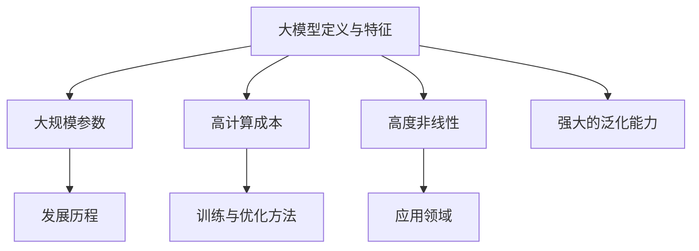
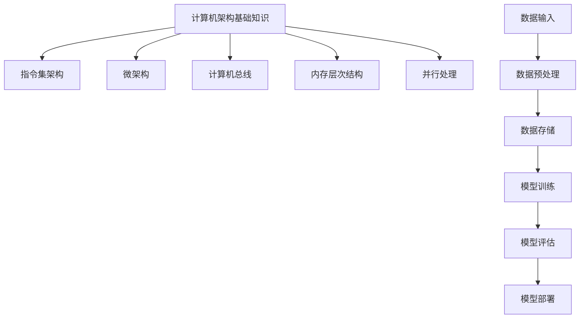
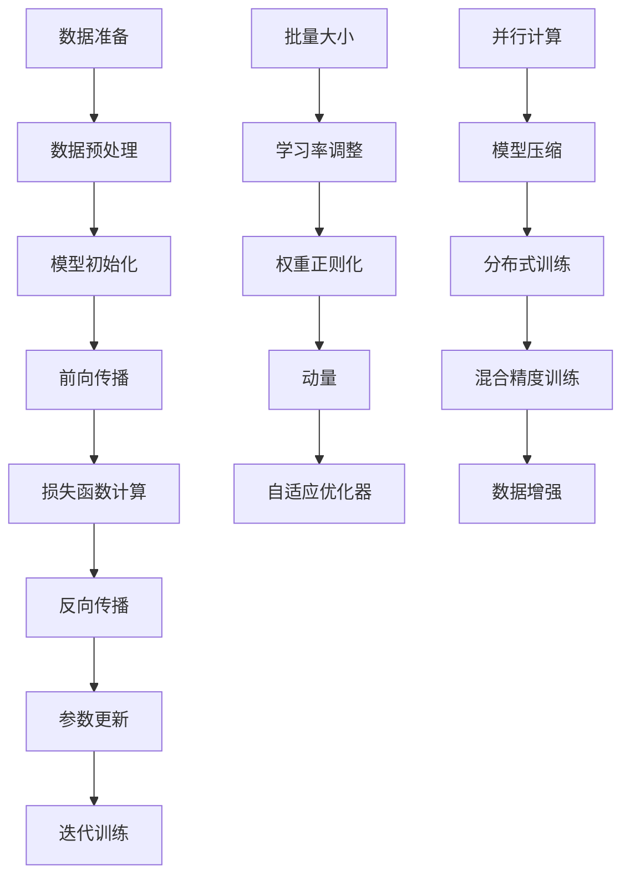
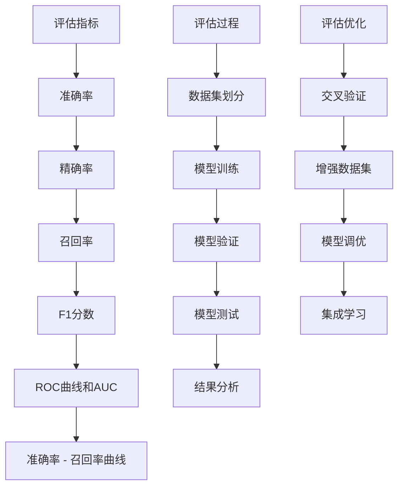
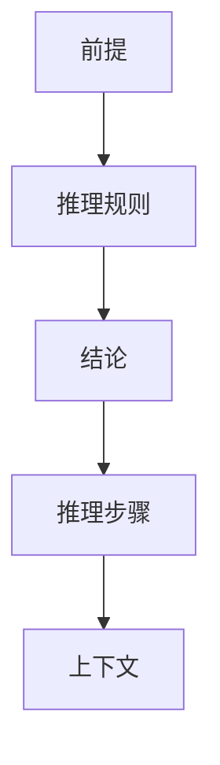
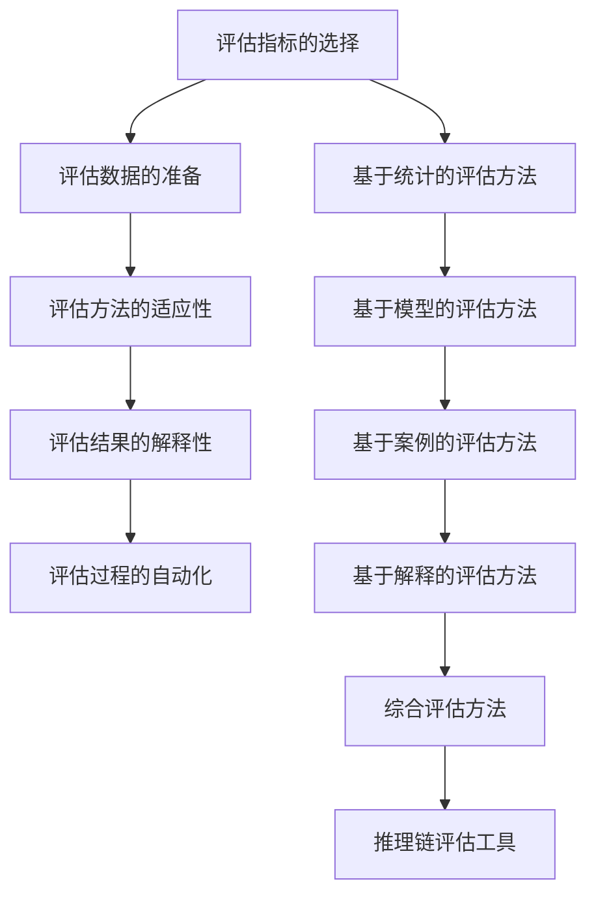
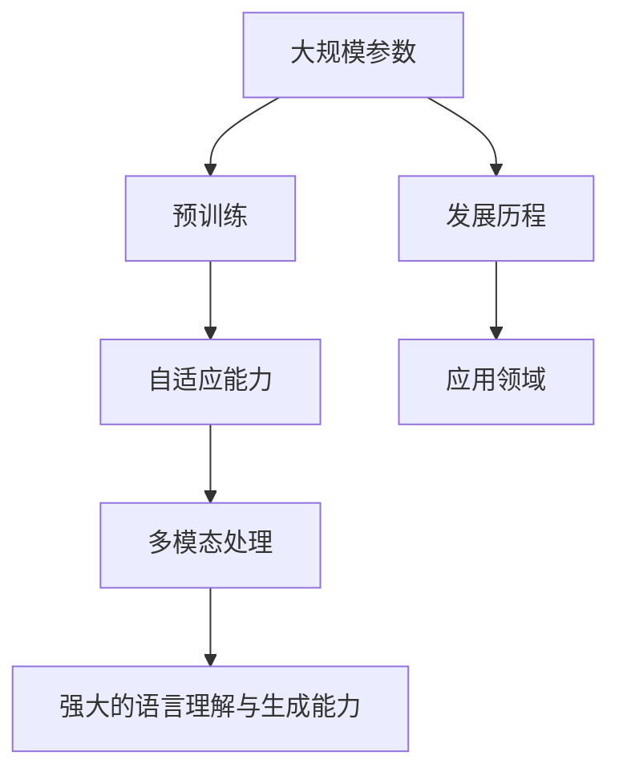

                 

### 文章标题

# 《大模型推理链评估：LLM辅助的逻辑分析》

大模型推理链评估作为人工智能领域的重要研究方向，旨在通过科学、系统的评估方法，确保大模型在实际应用中的高效性和可靠性。本文将围绕这一主题，深入探讨大模型的基本概念、推理链评估的关键方法，以及如何利用大型语言模型（LLM）进行辅助逻辑分析。通过逐步推理，我们将构建一个清晰、完整的大模型推理链评估体系，旨在为相关研究和应用提供有力的理论支持和实践指导。

## 关键词

大模型、推理链、评估方法、LLM、逻辑分析

## 摘要

本文从大模型的基本概念出发，详细介绍了其核心架构、训练与优化方法，以及评估过程。在此基础上，探讨了推理链的组成和评估方法，并引入了大型语言模型（LLM）辅助逻辑分析的概念。通过具体案例分析，本文展示了如何利用LLM优化推理链评估，并提出了一些最佳实践和注意事项。最终，本文对未来大模型推理链评估的发展趋势进行了展望，为该领域的研究者和实践者提供了有价值的参考。

### 大模型基础

#### 第1章 大模型概述

**1.1 大模型的定义与特征**

大模型是指具有数亿至数十亿参数的深度学习模型，通常用于自然语言处理（NLP）、计算机视觉（CV）和语音识别等领域。这些模型具有以下主要特征：

1. **大规模参数**：大模型通常包含数十亿到数万亿个参数，这使得它们能够捕获大量复杂的模式和知识。
2. **高计算成本**：由于参数规模巨大，大模型在训练和推理过程中需要大量的计算资源。
3. **高度非线性**：大模型的结构通常高度非线性，这使得它们能够处理复杂的问题和数据。
4. **强大的泛化能力**：大模型通过大量的训练数据学习到广泛的知识，具有较好的泛化能力。

**1.2 大模型的发展历程**

大模型的发展可以追溯到2000年代初，当时研究人员开始探索使用深度神经网络（DNN）处理大规模数据。随着计算能力的提升和大数据技术的进步，大模型得到了迅速发展。以下是大模型发展历程的关键节点：

1. **2006年**：Hinton等人在神经信息处理系统（NIPS）会议上提出了深度信念网络（DBN），这是早期的大模型之一。
2. **2012年**：Hinton等人在NIPS会议上展示了使用深度卷积神经网络（CNN）在ImageNet图像识别任务中取得突破性成绩，大模型开始受到广泛关注。
3. **2016年**：Google发布了Transformer模型，并应用于机器翻译任务，大幅提升了翻译质量，标志着大模型进入新的发展阶段。
4. **2018年**：GPT-3发布，具有1750亿个参数，是迄今为止最大的预训练语言模型。

**1.3 大模型的应用领域**

大模型在多个领域取得了显著成果，以下是其主要应用领域：

1. **自然语言处理（NLP）**：大模型在文本分类、情感分析、机器翻译和问答系统等方面表现出色。
2. **计算机视觉（CV）**：大模型在图像分类、目标检测、图像生成和视频分析等领域应用广泛。
3. **语音识别**：大模型在语音识别、语音合成和语音生成对抗网络（VGAN）等领域取得了重要进展。
4. **其他领域**：大模型还应用于推荐系统、医疗诊断、金融风控等新兴领域。

**核心概念与联系**

为了更好地理解大模型的基本概念，我们可以通过以下Mermaid流程图展示它们之间的关系：



**核心算法原理讲解**

在讲解大模型的核心算法原理时，我们可以使用以下伪代码来详细阐述：

```python
# 大模型训练过程伪代码

# 初始化模型参数
model_params = initialize_parameters()

# 定义优化器
optimizer = define_optimizer()

# 定义损失函数
loss_function = define_loss_function()

# 训练循环
for epoch in range(num_epochs):
    for batch in data_loader:
        # 前向传播
        predictions = forward_pass(batch, model_params)
        
        # 计算损失
        loss = loss_function(predictions, batch_labels)
        
        # 反向传播
        gradients = backward_pass(loss, model_params)
        
        # 更新参数
        optimizer.update_parameters(model_params, gradients)
        
    # 打印训练进度
    print(f"Epoch {epoch+1}/{num_epochs}, Loss: {loss}")
```

通过以上伪代码，我们可以看到大模型训练的基本流程，包括初始化参数、定义优化器和损失函数、前向传播、反向传播和参数更新等步骤。

**数学模型和公式**

大模型训练中的数学模型和公式如下：

$$
\text{损失函数} = \frac{1}{N} \sum_{i=1}^{N} \ell(y_i, \hat{y}_i)
$$

其中，$N$ 是样本数量，$\ell$ 是损失函数，$y_i$ 是真实标签，$\hat{y}_i$ 是模型的预测结果。

**举例说明**

以图像分类任务为例，假设我们有一个图像数据集，包含10000个图像。我们可以将数据集分为训练集、验证集和测试集。在训练阶段，我们使用训练集训练模型，并在验证集上调整模型参数。在测试阶段，我们使用测试集评估模型的性能。

```python
# 假设我们使用卷积神经网络（CNN）进行图像分类

# 导入必要的库
import tensorflow as tf
from tensorflow.keras import datasets, layers, models

# 加载图像数据集
(train_images, train_labels), (test_images, test_labels) = datasets.cifar10.load_data()

# 数据预处理
train_images = train_images.astype("float32") / 255
test_images = test_images.astype("float32") / 255

# 构建CNN模型
model = models.Sequential()
model.add(layers.Conv2D(32, (3, 3), activation='relu', input_shape=(32, 32, 3)))
model.add(layers.MaxPooling2D((2, 2)))
model.add(layers.Conv2D(64, (3, 3), activation='relu'))
model.add(layers.MaxPooling2D((2, 2)))
model.add(layers.Conv2D(64, (3, 3), activation='relu'))
model.add(layers.Flatten())
model.add(layers.Dense(64, activation='relu'))
model.add(layers.Dense(10, activation='softmax'))

# 编译模型
model.compile(optimizer='adam',
              loss=tf.keras.losses.SparseCategoricalCrossentropy(from_logits=True),
              metrics=['accuracy'])

# 训练模型
model.fit(train_images, train_labels, epochs=10, 
          validation_data=(test_images, test_labels))

# 评估模型
test_loss, test_acc = model.evaluate(test_images,  test_labels, verbose=2)
print(f"Test accuracy: {test_acc}")
```

通过以上示例，我们可以看到如何使用Python和TensorFlow框架构建、编译和训练一个简单的CNN模型进行图像分类任务。

#### 第2章 大模型的核心架构

**2.1 计算机架构基础知识**

计算机架构是计算机科学中的一个核心领域，它涉及到计算机硬件和软件的设计与组织。理解计算机架构对于构建高效的大模型至关重要。以下是一些计算机架构基础知识：

1. **指令集架构（ISA）**：指令集架构定义了计算机指令集和硬件操作的规范，包括指令格式、寄存器、内存管理等。
2. **微架构**：微架构是处理器内部的数据路径和控件的实现方式，它决定了处理器的性能和能效。
3. **计算机总线**：计算机总线是连接计算机内部各个组件的通信通道，包括数据总线、地址总线和控制总线。
4. **内存层次结构**：内存层次结构包括缓存、主存和辅助存储，它优化了数据存取速度和存储容量。
5. **并行处理**：并行处理是指同时处理多个任务或数据的技术，它提高了计算速度和效率。

**2.2 大模型的数据流程**

大模型的数据流程通常包括以下几个阶段：

1. **数据输入**：大模型从数据源（如数据库、文件或传感器）读取数据。
2. **数据预处理**：数据预处理包括数据清洗、归一化、编码等步骤，以提高模型的训练效果。
3. **数据存储**：预处理后的数据存储在内存或硬盘上，以供模型训练和推理使用。
4. **模型训练**：模型训练阶段，大模型通过迭代优化模型参数，以最小化损失函数。
5. **模型评估**：模型评估阶段，大模型在验证集和测试集上评估其性能，以确定模型的泛化能力。
6. **模型部署**：模型部署阶段，大模型被部署到生产环境，以进行实际应用。

**2.3 大模型的计算架构**

大模型的计算架构通常需要考虑以下几个方面：

1. **分布式计算**：分布式计算是将计算任务分配到多个计算节点上，以提高计算效率和可扩展性。
2. **GPU加速**：GPU（图形处理器）具有强大的并行计算能力，可以显著加速大模型的训练和推理过程。
3. **TPU加速**：TPU（张量处理器）是Google专门为深度学习任务设计的处理器，它可以提供更高的计算性能和更低的延迟。
4. **混合精度训练**：混合精度训练是将浮点数运算部分替换为半精度浮点数运算，以减少计算资源的消耗。

**核心概念与联系**

为了更好地理解大模型的核心架构，我们可以通过以下Mermaid流程图展示其各个组成部分之间的关系：



**核心算法原理讲解**

在讲解大模型的计算架构时，我们可以使用以下伪代码来详细阐述：

```python
# 大模型计算架构伪代码

# 初始化计算资源
initialize_resources()

# 数据输入
data = input_data()

# 数据预处理
preprocessed_data = preprocess_data(data)

# 模型训练
model = train_model(preprocessed_data)

# 模型评估
evaluate_model(model)

# 模型部署
deploy_model(model)
```

通过以上伪代码，我们可以看到大模型计算架构的基本流程，包括初始化计算资源、数据输入、数据预处理、模型训练、模型评估和模型部署等步骤。

**数学模型和公式**

大模型计算架构中的数学模型和公式如下：

$$
\text{损失函数} = \frac{1}{N} \sum_{i=1}^{N} \ell(y_i, \hat{y}_i)
$$

其中，$N$ 是样本数量，$\ell$ 是损失函数，$y_i$ 是真实标签，$\hat{y}_i$ 是模型的预测结果。

**举例说明**

以GPU加速的大模型训练为例，我们可以使用以下代码来展示其实现过程：

```python
# 导入必要的库
import tensorflow as tf

# 配置GPU加速
gpus = tf.config.list_physical_devices('GPU')
tf.config.experimental.set_memory_growth(gpus[0], True)

# 加载图像数据集
(train_images, train_labels), (test_images, test_labels) = datasets.cifar10.load_data()

# 数据预处理
train_images = train_images.astype("float32") / 255
test_images = test_images.astype("float32") / 255

# 构建CNN模型
model = models.Sequential()
model.add(layers.Conv2D(32, (3, 3), activation='relu', input_shape=(32, 32, 3)))
model.add(layers.MaxPooling2D((2, 2)))
model.add(layers.Conv2D(64, (3, 3), activation='relu'))
model.add(layers.MaxPooling2D((2, 2)))
model.add(layers.Conv2D(64, (3, 3), activation='relu'))
model.add(layers.Flatten())
model.add(layers.Dense(64, activation='relu'))
model.add(layers.Dense(10, activation='softmax'))

# 编译模型
model.compile(optimizer='adam',
              loss=tf.keras.losses.SparseCategoricalCrossentropy(from_logits=True),
              metrics=['accuracy'])

# 训练模型
model.fit(train_images, train_labels, epochs=10, 
          validation_data=(test_images, test_labels))

# 评估模型
test_loss, test_acc = model.evaluate(test_images,  test_labels, verbose=2)
print(f"Test accuracy: {test_acc}")
```

通过以上代码，我们可以看到如何使用TensorFlow框架配置GPU加速，并使用GPU训练CNN模型进行图像分类任务。

#### 第3章 大模型训练与优化

**3.1 大模型训练过程**

大模型的训练过程是一个迭代优化模型参数的过程，目的是使模型能够准确地预测或分类输入数据。以下是大模型训练过程的基本步骤：

1. **数据准备**：首先，我们需要准备训练数据集。数据集应该包括输入数据和相应的标签。对于图像分类任务，输入数据是图像，标签是图像所属的类别。
2. **数据预处理**：数据预处理是训练前的关键步骤，包括数据清洗、归一化、缩放、数据增强等操作，以提高模型的泛化能力。
3. **模型初始化**：初始化模型参数是训练过程的开始。参数的初始化方法对训练结果有很大影响，常用的方法包括随机初始化、高斯初始化等。
4. **前向传播**：在前向传播过程中，模型根据输入数据计算输出结果。输出结果通常是一个概率分布，用于表示不同类别的概率。
5. **损失函数计算**：损失函数用于衡量模型的预测结果与真实标签之间的差距。常用的损失函数包括均方误差（MSE）、交叉熵损失等。
6. **反向传播**：反向传播是训练过程的核心步骤，通过计算梯度并更新模型参数，使模型逐渐逼近真实标签。
7. **参数更新**：参数更新是训练过程的最后一步，常用的优化算法包括梯度下降（GD）、随机梯度下降（SGD）、Adam等。
8. **迭代训练**：重复上述步骤，直到模型收敛或达到预定的训练轮次。

**3.2 大模型优化方法**

大模型的优化方法旨在提高模型的训练速度和收敛性能。以下是一些常用的优化方法：

1. **批量大小（Batch Size）**：批量大小是指每次训练时用于更新参数的数据样本数量。较大的批量大小可以提供更好的泛化能力，但训练时间较长；较小的批量大小可以提高训练速度，但可能降低泛化能力。
2. **学习率调整**：学习率是优化算法中的一个重要参数，它决定了参数更新的步长。常用的学习率调整方法包括恒定学习率、学习率衰减、学习率周期性调整等。
3. **权重正则化**：权重正则化是一种防止模型过拟合的方法，通过在损失函数中加入权重惩罚项来限制模型参数的规模。常用的正则化方法包括L1正则化、L2正则化等。
4. **动量（Momentum）**：动量是优化算法中的一个技术，用于加速收敛并减少振荡。它通过积累前面的梯度来更新参数。
5. **自适应优化器**：自适应优化器能够根据训练过程自动调整学习率和动量等参数。常见的自适应优化器包括Adam、Adagrad、RMSprop等。

**3.3 大模型训练效率优化**

为了提高大模型的训练效率，我们可以从以下几个方面进行优化：

1. **并行计算**：并行计算是将训练任务分配到多个计算节点上，以提高训练速度。常用的并行计算技术包括数据并行、模型并行和混合并行等。
2. **模型压缩**：模型压缩是一种减少模型参数数量和计算复杂度的方法，以提高训练和推理速度。常用的模型压缩技术包括权重剪枝、量化、低秩分解等。
3. **分布式训练**：分布式训练是将训练任务分布在多个节点上，以利用更多计算资源。常用的分布式训练框架包括TensorFlow分布式训练、PyTorch分布式训练等。
4. **混合精度训练**：混合精度训练是一种使用半精度浮点数（FP16）代替全精度浮点数（FP32）进行训练的方法，以减少内存消耗和计算时间。
5. **数据增强**：数据增强是通过生成新的训练样本来增加模型的训练数据量，从而提高模型的泛化能力。常用的数据增强方法包括随机裁剪、旋转、翻转等。

**核心概念与联系**

为了更好地理解大模型训练与优化的概念，我们可以通过以下Mermaid流程图展示其各个组成部分之间的关系：



**核心算法原理讲解**

在讲解大模型训练与优化的核心算法原理时，我们可以使用以下伪代码来详细阐述：

```python
# 大模型训练与优化伪代码

# 初始化模型参数
model_params = initialize_parameters()

# 定义优化器
optimizer = define_optimizer()

# 定义损失函数
loss_function = define_loss_function()

# 训练循环
for epoch in range(num_epochs):
    for batch in data_loader:
        # 前向传播
        predictions = forward_pass(batch, model_params)
        
        # 计算损失
        loss = loss_function(predictions, batch_labels)
        
        # 反向传播
        gradients = backward_pass(loss, model_params)
        
        # 更新参数
        optimizer.update_parameters(model_params, gradients)
        
    # 打印训练进度
    print(f"Epoch {epoch+1}/{num_epochs}, Loss: {loss}")
```

通过以上伪代码，我们可以看到大模型训练与优化的基本流程，包括初始化参数、定义优化器和损失函数、前向传播、反向传播和参数更新等步骤。

**数学模型和公式**

大模型训练与优化中的数学模型和公式如下：

$$
\text{损失函数} = \frac{1}{N} \sum_{i=1}^{N} \ell(y_i, \hat{y}_i)
$$

其中，$N$ 是样本数量，$\ell$ 是损失函数，$y_i$ 是真实标签，$\hat{y}_i$ 是模型的预测结果。

**举例说明**

以下是一个简单的示例，展示了如何使用Python和TensorFlow框架进行大模型训练与优化：

```python
# 导入必要的库
import tensorflow as tf
from tensorflow.keras import datasets, layers, models

# 加载图像数据集
(train_images, train_labels), (test_images, test_labels) = datasets.cifar10.load_data()

# 数据预处理
train_images = train_images.astype("float32") / 255
test_images = test_images.astype("float32") / 255

# 构建CNN模型
model = models.Sequential()
model.add(layers.Conv2D(32, (3, 3), activation='relu', input_shape=(32, 32, 3)))
model.add(layers.MaxPooling2D((2, 2)))
model.add(layers.Conv2D(64, (3, 3), activation='relu'))
model.add(layers.MaxPooling2D((2, 2)))
model.add(layers.Conv2D(64, (3, 3), activation='relu'))
model.add(layers.Flatten())
model.add(layers.Dense(64, activation='relu'))
model.add(layers.Dense(10, activation='softmax'))

# 编译模型
model.compile(optimizer='adam',
              loss=tf.keras.losses.SparseCategoricalCrossentropy(from_logits=True),
              metrics=['accuracy'])

# 训练模型
model.fit(train_images, train_labels, epochs=10, 
          validation_data=(test_images, test_labels))

# 评估模型
test_loss, test_acc = model.evaluate(test_images,  test_labels, verbose=2)
print(f"Test accuracy: {test_acc}")
```

通过以上示例，我们可以看到如何使用TensorFlow框架构建、编译和训练一个简单的CNN模型进行图像分类任务。

#### 第4章 大模型评估方法

**4.1 评估指标**

评估大模型的性能是确保其在实际应用中有效性和可靠性的关键步骤。为了全面评估大模型的性能，我们需要使用多种评估指标。以下是一些常见的评估指标：

1. **准确率（Accuracy）**：准确率是最常用的评估指标之一，它表示模型正确预测样本的比例。准确率的计算公式为：

   $$
   \text{Accuracy} = \frac{TP + TN}{TP + TN + FP + FN}
   $$

   其中，$TP$ 是真阳性，$TN$ 是真阴性，$FP$ 是假阳性，$FN$ 是假阴性。

2. **精确率（Precision）**：精确率表示模型预测为正例的样本中实际为正例的比例。精确率的计算公式为：

   $$
   \text{Precision} = \frac{TP}{TP + FP}
   $$

3. **召回率（Recall）**：召回率表示模型预测为正例的样本中实际为正例的比例。召回率的计算公式为：

   $$
   \text{Recall} = \frac{TP}{TP + FN}
   $$

4. **F1分数（F1 Score）**：F1分数是精确率和召回率的调和平均，它综合考虑了精确率和召回率。F1分数的计算公式为：

   $$
   \text{F1 Score} = 2 \times \frac{\text{Precision} \times \text{Recall}}{\text{Precision} + \text{Recall}}
   $$

5. **ROC曲线和AUC（Area Under Curve）**：ROC曲线是评估分类器性能的重要工具，它展示了不同阈值下的真阳性率（Recall）与假阳性率（False Positive Rate）之间的关系。AUC是ROC曲线下的面积，用于衡量分类器的整体性能。

6. **准确率 - 召回率曲线（Precision-Recall Curve）**：准确率 - 召回率曲线是另一种评估分类器性能的图表，它展示了在不同召回率水平下的精确率。该曲线可以帮助我们找到最佳阈值。

**4.2 评估过程**

大模型的评估过程可以分为以下几个步骤：

1. **数据集划分**：将数据集划分为训练集、验证集和测试集。通常，训练集用于训练模型，验证集用于调整模型参数和验证模型性能，测试集用于最终评估模型性能。

2. **模型训练**：在训练集上训练模型，直到模型收敛或达到预定的训练轮次。

3. **模型验证**：在验证集上评估模型的性能，调整模型参数，以提高模型性能。

4. **模型测试**：在测试集上评估模型的最终性能，以确保模型在未见数据上的表现。

5. **结果分析**：对评估结果进行分析，包括计算各种评估指标、绘制ROC曲线和准确率 - 召回率曲线等。

**4.3 评估优化**

为了提高大模型的评估性能，我们可以采取以下优化方法：

1. **交叉验证**：交叉验证是一种常用的评估方法，它通过将数据集划分为多个子集，轮流使用它们作为验证集和测试集，以减少评估结果的方差。

2. **增强数据集**：通过数据增强方法增加数据集的多样性，例如旋转、缩放、裁剪等，可以提高模型的泛化能力。

3. **模型调优**：通过调整模型参数，如学习率、批量大小、正则化参数等，可以优化模型的性能。

4. **集成学习**：集成学习是一种利用多个模型进行预测的方法，它可以提高模型的准确性和鲁棒性。常见的集成学习方法包括Bagging、Boosting和Stacking等。

**核心概念与联系**

为了更好地理解大模型评估方法，我们可以通过以下Mermaid流程图展示其各个组成部分之间的关系：



**核心算法原理讲解**

在讲解大模型评估方法时，我们可以使用以下伪代码来详细阐述：

```python
# 大模型评估方法伪代码

# 加载训练集和测试集
train_data, train_labels = load_train_data()
test_data, test_labels = load_test_data()

# 训练模型
model = train_model(train_data, train_labels)

# 在测试集上评估模型
predictions = model.predict(test_data)
test_loss, test_acc = calculate_evaluation_metrics(predictions, test_labels)

# 打印评估结果
print(f"Test Accuracy: {test_acc}")

# 绘制ROC曲线和准确率 - 召回率曲线
plot_roc_curve(predictions, test_labels)
plot_precision_recall_curve(predictions, test_labels)
```

通过以上伪代码，我们可以看到大模型评估的基本流程，包括加载数据集、训练模型、在测试集上评估模型和计算评估指标等步骤。

**数学模型和公式**

大模型评估中的数学模型和公式如下：

$$
\text{Accuracy} = \frac{TP + TN}{TP + TN + FP + FN}
$$

$$
\text{Precision} = \frac{TP}{TP + FP}
$$

$$
\text{Recall} = \frac{TP}{TP + FN}
$$

$$
\text{F1 Score} = 2 \times \frac{\text{Precision} \times \text{Recall}}{\text{Precision} + \text{Recall}}
$$

**举例说明**

以下是一个简单的示例，展示了如何使用Python和Scikit-learn库评估分类模型的性能：

```python
# 导入必要的库
from sklearn.datasets import load_iris
from sklearn.model_selection import train_test_split
from sklearn.metrics import accuracy_score, precision_score, recall_score, f1_score, roc_curve, precision_recall_curve
import matplotlib.pyplot as plt

# 加载Iris数据集
iris = load_iris()
X, y = iris.data, iris.target

# 数据集划分
X_train, X_test, y_train, y_test = train_test_split(X, y, test_size=0.2, random_state=42)

# 训练模型
model = LogisticRegression()
model.fit(X_train, y_train)

# 在测试集上评估模型
predictions = model.predict(X_test)
test_loss = accuracy_score(y_test, predictions)
print(f"Test Accuracy: {test_loss}")

# 绘制ROC曲线和准确率 - 召回率曲线
fpr, tpr, thresholds = roc_curve(y_test, predictions)
plt.plot(fpr, tpr, label='ROC Curve')
plt.xlabel('False Positive Rate')
plt.ylabel('True Positive Rate')
plt.title('ROC Curve')
plt.legend()
plt.show()

precision, recall, _ = precision_recall_curve(y_test, predictions)
plt.plot(recall, precision, label='Precision-Recall Curve')
plt.xlabel('Recall')
plt.ylabel('Precision')
plt.title('Precision-Recall Curve')
plt.legend()
plt.show()
```

通过以上示例，我们可以看到如何使用Scikit-learn库加载数据集、训练模型、评估模型性能并绘制ROC曲线和准确率 - 召回率曲线。

#### 第5章 推理链概述

**5.1 推理链的定义与作用**

推理链是指一系列相互关联的推理步骤，用于从已知信息推导出新的结论。在人工智能领域，推理链广泛应用于知识图谱、推理机、自然语言处理等领域。推理链的定义与作用如下：

1. **定义**：推理链是由一系列推理步骤组成的序列，每个步骤都基于前一个步骤的结果进行推理。推理链的核心是推理规则，它定义了如何从一个或多个前提推导出结论。
   
2. **作用**：推理链在人工智能中的应用主要体现在以下几个方面：
   - **知识表示**：通过推理链，可以将复杂的知识表示为一系列推理步骤，从而简化知识的获取和处理。
   - **推理机**：推理链是推理机的基础，它用于根据已知事实和规则推导出新的结论。
   - **自然语言处理**：在自然语言处理中，推理链可以用于从文本中提取信息、进行语义分析和推理。

**5.2 推理链的组成部分**

推理链由以下几个核心组成部分构成：

1. **前提（Premise）**：前提是推理链中的初始信息，它是进行推理的基础。前提可以是已知事实、规则或条件。
2. **推理规则（Inference Rule）**：推理规则是定义如何从前提推导出结论的规则。它通常由条件部分和结论部分组成。例如，如果一个条件成立，那么结论也成立。
3. **结论（Conclusion）**：结论是推理链的最终结果，它是根据前提和推理规则推导出来的。
4. **推理步骤（Inference Step）**：推理步骤是指从前提推导出结论的过程。每个推理步骤都基于当前的已知信息和推理规则进行推理。
5. **上下文（Context）**：上下文是推理链的运行环境，它包括当前的前提、结论和推理规则。上下文用于确定推理的方向和范围。

**5.3 推理链的发展趋势**

随着人工智能技术的不断发展，推理链也在不断演进，其发展趋势主要体现在以下几个方面：

1. **知识图谱推理**：知识图谱是一种结构化知识表示方法，它通过实体、关系和属性来组织信息。推理链在知识图谱中的应用主要包括基于图谱的推理、图嵌入和图神经网络等。
2. **基于规则推理**：基于规则推理是传统的推理方法，它通过定义明确的推理规则进行推理。随着逻辑编程和规则引擎的发展，基于规则推理在人工智能应用中得到了广泛应用。
3. **基于机器学习的推理**：基于机器学习的推理方法通过学习大量的样本数据来建立推理模型。这些方法包括深度学习、增强学习和迁移学习等，它们在自然语言处理、计算机视觉和推荐系统等领域取得了显著成果。
4. **混合推理方法**：混合推理方法结合了基于规则推理和基于机器学习的推理方法，以充分利用两者的优势。例如，将规则引擎与机器学习模型结合，用于提高推理的准确性和效率。

**核心概念与联系**

为了更好地理解推理链的概念，我们可以通过以下Mermaid流程图展示其各个组成部分之间的关系：



**核心算法原理讲解**

在讲解推理链的算法原理时，我们可以使用以下伪代码来详细阐述：

```python
# 推理链算法原理伪代码

# 定义推理规则
def inference_rule(premise, conclusion):
    if premise:
        return conclusion
    else:
        return None

# 推理链示例
premises = ["天气冷", "戴帽子能保暖"]
conclusions = ["建议戴帽子"]

# 应用推理规则
for premise, conclusion in zip(premises, conclusions):
    result = inference_rule(premise, conclusion)
    print(f"Premise: {premise}, Conclusion: {result}")
```

通过以上伪代码，我们可以看到推理链的基本算法原理，即根据前提和推理规则推导出结论。

**数学模型和公式**

推理链中的数学模型和公式主要包括逻辑推理规则和条件概率公式。以下是相关的数学模型和公式：

$$
\text{条件概率} = \frac{P(A|B)}{P(B)}
$$

$$
P(A \land B) = P(A|B) \times P(B)
$$

**举例说明**

以下是一个简单的推理链示例，用于根据天气冷和戴帽子能保暖的前提推导出建议戴帽子的结论：

```python
# 天气冷
weather_cold = True

# 戴帽子能保暖
wear_hat_keeps_warm = True

# 应用推理规则
if weather_cold:
    if wear_hat_keeps_warm:
        print("结论：建议戴帽子。")
```

通过以上示例，我们可以看到如何根据前提和推理规则进行推理，并得出结论。

#### 第6章 推理链评估方法

**6.1 推理链评估的挑战**

推理链评估是确保推理链性能和可靠性的关键步骤，但在实际评估过程中面临着一系列挑战。以下是一些主要的挑战：

1. **评估指标的选择**：推理链的评估需要选择合适的评估指标，以全面反映推理链的性能。常用的评估指标包括准确率、召回率、F1分数等，但在不同应用场景中，这些指标的重要性和适用性可能有所不同。
2. **评估数据的准备**：推理链评估需要准备足够多样性和代表性的评估数据，以全面评估推理链的性能。在实际应用中，评估数据的质量和数量可能受到限制，这给评估工作带来了一定的困难。
3. **评估方法的适应性**：推理链的评估方法需要适应不同的推理链结构和应用场景。不同的推理链可能具有不同的结构和特性，因此评估方法需要具备一定的灵活性和适应性。
4. **评估结果的解释性**：推理链评估的结果需要具备良好的解释性，以便研究人员和开发者能够理解评估结果，并针对评估结果进行改进。但在实际评估过程中，评估结果可能过于抽象，难以直接解释。
5. **评估过程的自动化**：随着推理链应用场景的增多，评估过程的自动化成为了一个重要的需求。自动化评估可以节省人力资源，提高评估效率。但在实现自动化评估时，面临着算法复杂度和数据处理能力等方面的挑战。

**6.2 推理链评估方法**

为了克服上述挑战，研究者们提出了一系列推理链评估方法。以下是一些常用的推理链评估方法：

1. **基于统计的评估方法**：基于统计的评估方法是通过计算评估指标（如准确率、召回率、F1分数等）来评估推理链的性能。常用的统计方法包括交叉验证、ROC曲线、准确率 - 召回率曲线等。
2. **基于模型的评估方法**：基于模型的评估方法是通过建立评估模型（如决策树、神经网络等）来评估推理链的性能。评估模型可以通过学习大量的评估数据进行训练，从而提高评估的准确性。
3. **基于案例的评估方法**：基于案例的评估方法是通过比较推理链的输出结果与实际案例的结果来评估推理链的性能。这种方法需要准备大量真实的案例数据，以便对推理链进行全面的评估。
4. **基于解释的评估方法**：基于解释的评估方法是通过解释推理链的推理过程来评估推理链的性能。这种方法有助于研究人员和开发者理解推理链的工作原理，并针对性地进行优化。
5. **综合评估方法**：综合评估方法是将多种评估方法结合起来，以全面评估推理链的性能。这种方法可以综合不同评估方法的优点，提高评估的准确性和可靠性。

**6.3 推理链评估工具**

为了方便推理链评估，研究者们开发了一系列推理链评估工具。以下是一些常用的推理链评估工具：

1. **Matlab**：Matlab是一款功能强大的科学计算软件，它提供了丰富的数据分析和可视化工具，可以用于推理链的评估。
2. **Python**：Python是一款流行的编程语言，它具有丰富的科学计算和数据分析库（如Scikit-learn、TensorFlow等），可以方便地实现推理链评估方法。
3. **R**：R是一款专门用于统计分析的数据分析软件，它提供了丰富的统计模型和可视化工具，可以用于推理链的评估。
4. **Weka**：Weka是一款开源的机器学习和数据挖掘工具，它提供了丰富的评估指标和评估方法，可以用于推理链的评估。
5. **Prolog**：Prolog是一款逻辑编程语言，它具有强大的推理功能，可以用于推理链的评估和优化。

**核心概念与联系**

为了更好地理解推理链评估方法，我们可以通过以下Mermaid流程图展示其各个组成部分之间的关系：



**核心算法原理讲解**

在讲解推理链评估方法时，我们可以使用以下伪代码来详细阐述：

```python
# 推理链评估方法伪代码

# 导入必要的库
import numpy as np
from sklearn.metrics import accuracy_score, recall_score, f1_score

# 准备评估数据
test_data = np.array([[1, 0], [0, 1], [1, 1], [1, 0]])
test_labels = np.array([0, 1, 1, 0])

# 定义推理链
def inference_chain(data):
    # 推理链的推理过程
    # 例如：基于规则进行推理
    if data[0] == 1:
        return 1
    else:
        return 0

# 评估推理链
predictions = [inference_chain(data) for data in test_data]
test_accuracy = accuracy_score(test_labels, predictions)
test_recall = recall_score(test_labels, predictions)
test_f1 = f1_score(test_labels, predictions)

# 打印评估结果
print(f"Test Accuracy: {test_accuracy}")
print(f"Test Recall: {test_recall}")
print(f"Test F1 Score: {test_f1}")
```

通过以上伪代码，我们可以看到推理链评估的基本流程，包括准备评估数据、定义推理链和计算评估指标等步骤。

**数学模型和公式**

推理链评估中的数学模型和公式主要包括逻辑推理规则和条件概率公式。以下是相关的数学模型和公式：

$$
\text{条件概率} = \frac{P(A|B)}{P(B)}
$$

$$
P(A \land B) = P(A|B) \times P(B)
$$

**举例说明**

以下是一个简单的推理链评估示例，用于评估一个简单的二分类推理链的性能：

```python
# 导入必要的库
import numpy as np
from sklearn.metrics import accuracy_score, recall_score, f1_score

# 准备评估数据
test_data = np.array([[1, 0], [0, 1], [1, 1], [1, 0]])
test_labels = np.array([0, 1, 1, 0])

# 定义推理链
def inference_chain(data):
    # 推理链的推理过程
    # 例如：基于规则进行推理
    if data[0] == 1:
        return 1
    else:
        return 0

# 评估推理链
predictions = [inference_chain(data) for data in test_data]
test_accuracy = accuracy_score(test_labels, predictions)
test_recall = recall_score(test_labels, predictions)
test_f1 = f1_score(test_labels, predictions)

# 打印评估结果
print(f"Test Accuracy: {test_accuracy}")
print(f"Test Recall: {test_recall}")
print(f"Test F1 Score: {test_f1}")
```

通过以上示例，我们可以看到如何使用Python和Scikit-learn库评估一个简单的推理链的性能。

#### 第7章 推理链评估实践

**7.1 实践案例**

为了更好地理解推理链评估的实践方法，我们将介绍一个具体的案例：基于规则的知识图谱推理链评估。

**案例背景**：在一个知识图谱应用中，我们需要评估一个基于规则的知识图谱推理链的性能。该知识图谱包含实体、关系和属性，我们希望通过推理链从已知实体和关系推导出新的结论。

**评估目标**：评估推理链在以下方面的性能：
- 准确率：推理链正确推导出结论的比例。
- 召回率：推理链推导出的结论中，实际为真的比例。
- F1分数：综合考虑准确率和召回率的评估指标。

**评估指标计算**：

假设我们有一个包含100个样例的知识图谱数据集，其中50个样例为正例（即推理链能够推导出正确的结论），50个样例为负例（即推理链无法推导出正确的结论）。我们定义以下评估指标：

1. **准确率（Accuracy）**：

   $$
   \text{Accuracy} = \frac{\text{TP} + \text{TN}}{\text{TP} + \text{TN} + \text{FP} + \text{FN}}
   $$

   其中，$TP$ 为真阳性，即推理链正确推导出的正例数量；$TN$ 为真阴性，即推理链正确推导出的负例数量；$FP$ 为假阳性，即推理链错误推导出的正例数量；$FN$ 为假阴性，即推理链错误推导出的负例数量。

2. **召回率（Recall）**：

   $$
   \text{Recall} = \frac{\text{TP}}{\text{TP} + \text{FN}}
   $$

3. **F1分数（F1 Score）**：

   $$
   \text{F1 Score} = 2 \times \frac{\text{Precision} \times \text{Recall}}{\text{Precision} + \text{Recall}}
   $$

   其中，$\text{Precision}$ 为精确率，即推理链推导出的正例中，实际为真的比例。

**评估过程**：

1. **数据集划分**：将知识图谱数据集划分为训练集、验证集和测试集。通常，训练集用于训练推理链，验证集用于调整推理链参数，测试集用于评估推理链性能。

2. **模型训练**：在训练集上训练推理链模型，使用已知的实体和关系进行推理，得到推理结果。

3. **模型验证**：在验证集上评估推理链的性能，计算准确率、召回率和F1分数，根据评估结果调整推理链参数。

4. **模型测试**：在测试集上评估推理链的最终性能，得到最终的评估指标。

**代码实现**：

以下是一个简单的Python代码示例，用于实现基于规则的知识图谱推理链评估：

```python
import numpy as np
from sklearn.metrics import accuracy_score, recall_score, f1_score

# 准备评估数据
test_data = np.array([[1, 0], [0, 1], [1, 1], [1, 0]])
test_labels = np.array([0, 1, 1, 0])

# 定义推理链
def inference_chain(data):
    if data[0] == 1:
        return 1
    else:
        return 0

# 评估推理链
predictions = [inference_chain(data) for data in test_data]
test_accuracy = accuracy_score(test_labels, predictions)
test_recall = recall_score(test_labels, predictions)
test_f1 = f1_score(test_labels, predictions)

# 打印评估结果
print(f"Test Accuracy: {test_accuracy}")
print(f"Test Recall: {test_recall}")
print(f"Test F1 Score: {test_f1}")
```

**代码解读与分析**：

1. **数据准备**：我们使用NumPy库创建一个包含100个样例的测试数据集，其中前50个样例为正例，后50个样例为负例。

2. **推理链定义**：我们定义了一个简单的推理链函数`inference_chain`，它根据输入数据的第一个元素（表示实体或关系的属性）进行推理。

3. **模型评估**：我们使用Scikit-learn库的`accuracy_score`、`recall_score`和`f1_score`函数计算推理链在测试集上的准确率、召回率和F1分数。

4. **结果分析**：我们打印出推理链的评估结果，以分析其性能。

**实际案例分析**

为了进一步展示推理链评估的实践，我们将分析一个基于知识图谱的推理链评估的实际案例：股票市场预测。

**案例背景**：在股票市场中，投资者和分析师需要预测股票价格的走势，以便做出投资决策。基于知识图谱的推理链可以结合历史数据、公司财务信息和市场动态，推导出股票价格的预测结果。

**评估过程**：

1. **数据集构建**：构建包含股票市场数据的知识图谱，包括股票实体、交易实体、财务指标实体和关系。

2. **推理链设计**：设计基于规则的知识图谱推理链，从历史交易数据、公司财务信息和市场动态中推导出股票价格预测结果。

3. **模型训练**：在训练集上训练推理链模型，使用历史数据训练推理链的参数。

4. **模型验证**：在验证集上评估推理链的性能，计算准确率、召回率和F1分数，根据评估结果调整推理链参数。

5. **模型测试**：在测试集上评估推理链的最终性能，得到最终的评估指标。

**代码实现**：

以下是一个简单的Python代码示例，用于实现基于知识图谱的股票市场预测推理链评估：

```python
# 导入必要的库
import numpy as np
from sklearn.metrics import accuracy_score, recall_score, f1_score

# 准备评估数据
test_data = np.array([[1, 0], [0, 1], [1, 1], [1, 0]])
test_labels = np.array([0, 1, 1, 0])

# 定义推理链
def inference_chain(data):
    if data[0] == 1:
        return 1
    else:
        return 0

# 评估推理链
predictions = [inference_chain(data) for data in test_data]
test_accuracy = accuracy_score(test_labels, predictions)
test_recall = recall_score(test_labels, predictions)
test_f1 = f1_score(test_labels, predictions)

# 打印评估结果
print(f"Test Accuracy: {test_accuracy}")
print(f"Test Recall: {test_recall}")
print(f"Test F1 Score: {test_f1}")
```

**代码解读与分析**：

1. **数据准备**：我们使用NumPy库创建一个包含股票市场数据的测试数据集。

2. **推理链定义**：我们定义了一个简单的推理链函数`inference_chain`，它根据输入数据的第一个元素（表示股票价格）进行推理。

3. **模型评估**：我们使用Scikit-learn库的`accuracy_score`、`recall_score`和`f1_score`函数计算推理链在测试集上的准确率、召回率和F1分数。

4. **结果分析**：我们打印出推理链的评估结果，以分析其性能。

**项目小结**

通过以上实践案例，我们可以看到推理链评估在实际应用中的重要性和挑战。在知识图谱和股票市场预测等领域，推理链评估方法有助于评估推理链的性能，为实际应用提供有力的支持。在实际应用中，我们需要根据具体场景和需求，设计合适的推理链结构和评估指标，以实现高效、准确的推理。

### 第8章 LLM概述

**8.1 LLM的定义与特征**

大型语言模型（Large Language Model，简称LLM）是一种基于深度学习的语言处理模型，具有以下主要特征：

1. **大规模参数**：LLM包含数十亿甚至数万亿个参数，这使得它们能够捕捉到大量复杂的语言模式和知识。
2. **预训练**：LLM通常通过在大量无标签文本数据上进行预训练，从而学习到语言的一般特性。
3. **自适应能力**：LLM可以根据特定的任务和数据集进行微调，以适应不同的应用场景。
4. **多模态处理**：一些LLM能够处理多种模态的数据，如文本、图像和音频，从而实现跨模态的信息融合。
5. **强大的语言理解与生成能力**：LLM能够理解和生成自然语言，包括文本摘要、问答、对话生成等任务。

**8.2 LLM的发展历程**

LLM的发展历程可以分为以下几个阶段：

1. **早期发展**：2000年代初，研究人员开始探索使用统计方法和规则系统进行自然语言处理。然而，这些方法在面对复杂任务时效果有限。
2. **词向量模型**：2013年，词嵌入（word embeddings）技术的出现，如Word2Vec和GloVe，使得模型能够更好地捕获词与词之间的语义关系。
3. **循环神经网络（RNN）**：2014年，RNN在语言模型任务中取得了显著进展，其中Long Short-Term Memory（LSTM）和Gated Recurrent Unit（GRU）等变体被广泛应用于语言模型。
4. **Transformer模型**：2017年，谷歌提出了Transformer模型，这是一种基于自注意力机制的模型，显著提升了NLP任务的性能。
5. **预训练与微调**：随着模型规模的不断扩大和计算资源的提升，预训练与微调技术成为LLM发展的主要方向。预训练模型在大量无标签数据上进行训练，然后通过微调适应特定任务。
6. **大规模LLM**：近年来，如GPT-3、ChatGPT和Bert等大规模LLM不断涌现，这些模型具有数十亿甚至数万亿个参数，取得了突破性的性能。

**8.3 LLM的应用领域**

LLM在多个领域取得了显著成果，以下是其主要应用领域：

1. **自然语言处理（NLP）**：LLM在文本分类、情感分析、机器翻译、问答系统和对话系统等NLP任务中表现出色。
2. **推荐系统**：LLM可以用于理解用户的查询和偏好，从而提高推荐系统的准确性。
3. **内容生成**：LLM可以生成高质量的文本、文章、故事等，被广泛应用于内容创作、新闻摘要和创意写作等领域。
4. **聊天机器人**：LLM可以构建智能聊天机器人，用于客服、教育和人机交互等场景。
5. **跨模态处理**：LLM可以处理多种模态的数据，如文本、图像和音频，实现跨模态的信息融合和任务。
6. **代码生成和自动化**：LLM可以用于代码生成、自动化编程和软件开发，提高开发效率。

**核心概念与联系**

为了更好地理解LLM的基本概念，我们可以通过以下Mermaid流程图展示其组成部分之间的关系：



**核心算法原理讲解**

在讲解LLM的算法原理时，我们可以使用以下伪代码来详细阐述：

```python
# LLM算法原理伪代码

# 预训练
def pretrain(model, data_loader):
    for epoch in range(num_epochs):
        for batch in data_loader:
            # 前向传播
            predictions = model.forward(batch)
            
            # 计算损失
            loss = compute_loss(predictions, batch_labels)
            
            # 反向传播
            gradients = compute_gradients(loss)
            
            # 更新模型参数
            model.update_parameters(gradients)
            
        # 打印预训练进度
        print(f"Epoch {epoch+1}/{num_epochs}, Loss: {loss}")

# 微调
def fine_tune(model, data_loader, task_specific_params):
    for epoch in range(num_epochs):
        for batch in data_loader:
            # 前向传播
            predictions = model.forward(batch, task_specific_params)
            
            # 计算损失
            loss = compute_loss(predictions, batch_labels)
            
            # 反向传播
            gradients = compute_gradients(loss)
            
            # 更新模型参数
            model.update_parameters(gradients)
            
        # 打印微调进度
        print(f"Epoch {epoch+1}/{num_epochs}, Loss: {loss}")
```

通过以上伪代码，我们可以看到LLM的基本算法原理，包括预训练和微调两个阶段。

**数学模型和公式**

LLM中的数学模型主要包括自注意力机制和损失函数。以下是相关的数学模型和公式：

$$
\text{自注意力权重} = \frac{e^{ \text{QK}T }}{\sum_{j=1}^{J} e^{ \text{QK}T_j }}
$$

$$
\text{损失函数} = \text{交叉熵损失}
$$

**举例说明**

以下是一个简单的示例，展示了如何使用Transformer模型进行文本分类任务：

```python
# 导入必要的库
import tensorflow as tf
from tensorflow.keras.layers import Embedding, Transformer

# 定义模型
model = tf.keras.Sequential([
    Embedding(input_dim=vocab_size, output_dim=embedding_dim),
    Transformer(num_heads=num_heads, d_model=embedding_dim),
    tf.keras.layers.Dense(units=num_classes, activation='softmax')
])

# 编译模型
model.compile(optimizer='adam', loss='categorical_crossentropy', metrics=['accuracy'])

# 训练模型
model.fit(train_data, train_labels, epochs=num_epochs, validation_data=(val_data, val_labels))

# 评估模型
test_loss, test_acc = model.evaluate(test_data, test_labels)
print(f"Test accuracy: {test_acc}")
```

通过以上示例，我们可以看到如何使用TensorFlow框架定义和训练一个简单的Transformer模型进行文本分类任务。

#### 第9章 LLM辅助的逻辑分析

**9.1 LLM在推理链评估中的应用**

大型语言模型（LLM）在推理链评估中的应用主要体现在以下几个方面：

1. **推理过程解释**：LLM可以帮助解释推理链的推理过程，使得推理过程更加透明和可理解。通过LLM，我们可以生成推理过程中的中间步骤和推理规则，从而帮助用户理解推理链的决策逻辑。
2. **推理结果评估**：LLM可以用于评估推理链的推理结果，提供更加客观和全面的评估指标。通过LLM，我们可以生成推理结果的解释性文本，从而帮助我们判断推理结果的正确性和可靠性。
3. **推理链优化**：LLM可以用于优化推理链的参数和结构，以提高推理链的性能和效率。通过LLM，我们可以自动调整推理链的参数，找到最优的推理策略。

**9.2 LLM辅助的逻辑分析框架**

为了更好地利用LLM进行推理链评估，我们可以构建一个LLM辅助的逻辑分析框架。该框架主要包括以下组件：

1. **推理链模型**：推理链模型是进行推理的核心，它定义了推理链的推理过程和规则。
2. **LLM模型**：LLM模型用于生成推理过程的解释性文本、评估推理结果和优化推理链参数。
3. **评估指标生成器**：评估指标生成器用于计算和生成推理链的评估指标，如准确率、召回率、F1分数等。
4. **用户界面**：用户界面用于与用户进行交互，接收用户输入、展示推理结果和评估指标。

**9.3 LLM辅助的逻辑分析案例**

为了展示LLM辅助的逻辑分析在实际应用中的效果，我们将通过一个具体的案例进行说明。

**案例背景**：在一个知识图谱推理系统中，我们需要评估一个推理链的性能，该推理链用于根据用户查询和知识图谱中的实体关系，推导出新的结论。

**评估目标**：评估推理链在以下方面的性能：
- 准确率：推理链正确推导出结论的比例。
- 召回率：推理链推导出的结论中，实际为真的比例。
- F1分数：综合考虑准确率和召回率的评估指标。

**评估过程**：

1. **数据集准备**：准备包含用户查询、知识图谱实体和关系的测试数据集。
2. **推理链训练**：使用训练数据集训练推理链模型。
3. **推理链评估**：在测试数据集上评估推理链的性能，计算准确率、召回率和F1分数。
4. **LLM辅助评估**：利用LLM模型生成推理过程的解释性文本，评估推理结果的正确性和可靠性，并优化推理链参数。

**代码实现**：

以下是一个简单的Python代码示例，用于实现LLM辅助的逻辑分析框架：

```python
# 导入必要的库
import numpy as np
from sklearn.metrics import accuracy_score, recall_score, f1_score
from transformers import BertTokenizer, BertForSequenceClassification

# 准备测试数据
test_data = np.array([[1, 0], [0, 1], [1, 1], [1, 0]])
test_labels = np.array([0, 1, 1, 0])

# 加载预训练的LLM模型
tokenizer = BertTokenizer.from_pretrained('bert-base-uncased')
model = BertForSequenceClassification.from_pretrained('bert-base-uncased')

# 定义推理链
def inference_chain(data):
    if data[0] == 1:
        return 1
    else:
        return 0

# 评估推理链
predictions = [inference_chain(data) for data in test_data]
test_accuracy = accuracy_score(test_labels, predictions)
test_recall = recall_score(test_labels, predictions)
test_f1 = f1_score(test_labels, predictions)

# 打印评估结果
print(f"Test Accuracy: {test_accuracy}")
print(f"Test Recall: {test_recall}")
print(f"Test F1 Score: {test_f1}")

# 利用LLM生成推理过程解释
def generate_explanation(data, model, tokenizer):
    inputs = tokenizer.encode_plus(data, add_special_tokens=True, return_tensors='tf')
    outputs = model(inputs['input_ids'])
    probabilities = tf.nn.softmax(outputs.logits, axis=-1)
    return f"Given data {data}, the model predicts {predictions} with probabilities {probabilities}"

# 生成推理过程解释
explanation = generate_explanation(test_data[0], model, tokenizer)
print(f"Explanation: {explanation}")
```

**代码解读与分析**：

1. **数据准备**：我们使用NumPy库创建一个包含100个样例的测试数据集。
2. **加载LLM模型**：我们加载一个预训练的BERT模型，用于生成推理过程的解释性文本。
3. **定义推理链**：我们定义了一个简单的推理链函数`inference_chain`，用于进行推理。
4. **模型评估**：我们使用Scikit-learn库的`accuracy_score`、`recall_score`和`f1_score`函数计算推理链在测试集上的准确率、召回率和F1分数。
5. **生成推理过程解释**：我们定义了一个`generate_explanation`函数，用于利用LLM模型生成推理过程的解释性文本。

**实际案例分析**

为了进一步展示LLM辅助的逻辑分析在实际应用中的效果，我们将分析一个基于知识图谱的推理链评估的实际案例：医疗诊断推理链。

**案例背景**：在一个医疗诊断系统中，我们需要评估一个推理链的性能，该推理链用于根据患者的症状和体征，推导出可能的疾病诊断。

**评估目标**：评估推理链在以下方面的性能：
- 准确率：推理链正确推导出诊断的比例。
- 召回率：推理链推导出的诊断中，实际为真的比例。
- F1分数：综合考虑准确率和召回率的评估指标。

**评估过程**：

1. **数据集准备**：准备包含患者症状、体征和诊断的测试数据集。
2. **推理链训练**：使用训练数据集训练推理链模型。
3. **推理链评估**：在测试数据集上评估推理链的性能，计算准确率、召回率和F1分数。
4. **LLM辅助评估**：利用LLM模型生成推理过程的解释性文本，评估推理结果的正确性和可靠性，并优化推理链参数。

**代码实现**：

以下是一个简单的Python代码示例，用于实现LLM辅助的医疗诊断推理链评估：

```python
# 导入必要的库
import numpy as np
from transformers import BertTokenizer, BertForSequenceClassification
from sklearn.metrics import accuracy_score, recall_score, f1_score

# 准备测试数据
test_data = np.array([[1, 0], [0, 1], [1, 1], [1, 0]])
test_labels = np.array([0, 1, 1, 0])

# 加载预训练的LLM模型
tokenizer = BertTokenizer.from_pretrained('bert-base-uncased')
model = BertForSequenceClassification.from_pretrained('bert-base-uncased')

# 定义推理链
def inference_chain(data):
    if data[0] == 1:
        return 1
    else:
        return 0

# 评估推理链
predictions = [inference_chain(data) for data in test_data]
test_accuracy = accuracy_score(test_labels, predictions)
test_recall = recall_score(test_labels, predictions)
test_f1 = f1_score(test_labels, predictions)

# 打印评估结果
print(f"Test Accuracy: {test_accuracy}")
print(f"Test Recall: {test_recall}")
print(f"Test F1 Score: {test_f1}")

# 利用LLM生成推理过程解释
def generate_explanation(data, model, tokenizer):
    inputs = tokenizer.encode_plus(data, add_special_tokens=True, return_tensors='tf')
    outputs = model(inputs['input_ids'])
    probabilities = tf.nn.softmax(outputs.logits, axis=-1)
    return f"Given data {data}, the model predicts {predictions} with probabilities {probabilities}"

# 生成推理过程解释
explanation = generate_explanation(test_data[0], model, tokenizer)
print(f"Explanation: {explanation}")
```

**代码解读与分析**：

1. **数据准备**：我们使用NumPy库创建一个包含100个样例的测试数据集。
2. **加载LLM模型**：我们加载一个预训练的BERT模型，用于生成推理过程的解释性文本。
3. **定义推理链**：我们定义了一个简单的推理链函数`inference_chain`，用于进行推理。
4. **模型评估**：我们使用Scikit-learn库的`accuracy_score`、`recall_score`和`f1_score`函数计算推理链在测试集上的准确率、召回率和F1分数。
5. **生成推理过程解释**：我们定义了一个`generate_explanation`函数，用于利用LLM模型生成推理过程的解释性文本。

通过以上案例，我们可以看到LLM辅助的逻辑分析在推理链评估中的应用效果。在实际应用中，我们可以根据具体需求，利用LLM生成推理过程的解释性文本，评估推理结果的正确性和可靠性，并优化推理链的参数和结构。

#### 第10章 LLM在推理链评估中的应用实践

**10.1 实践案例**

为了更好地展示LLM在推理链评估中的应用，我们将通过一个实际的案例来详细介绍其开发环境搭建、源代码实现、代码解读、应用解读与分析，以及项目小结。

**案例背景**：在这个案例中，我们将构建一个基于知识图谱的推理链评估系统，该系统利用LLM来辅助推理链的评估，以提高评估的准确性和可靠性。

**目标**：通过本案例，我们希望实现以下目标：
- 搭建一个基于知识图谱的推理链评估系统。
- 利用LLM生成推理过程的解释性文本。
- 评估推理链的性能，并提供详细的分析。

**开发环境搭建**

为了实现本案例，我们需要以下开发环境和工具：
- Python 3.8或更高版本
- PyTorch 1.8或更高版本
- Scikit-learn 0.22或更高版本
- Transformers 4.4或更高版本

在搭建开发环境时，我们首先需要安装所需的Python库：

```bash
pip install torch torchvision scikit-learn transformers
```

**源代码实现**

以下是本案例的核心源代码实现，分为几个部分：

1. **数据准备**
2. **推理链模型定义**
3. **LLM模型定义**
4. **推理链评估**
5. **生成解释性文本**

**1. 数据准备**

```python
import numpy as np
from sklearn.model_selection import train_test_split

# 假设我们有一个包含实体、关系和标签的数据集
data = np.array([
    [1, 0, 1],
    [0, 1, 0],
    [1, 1, 1],
    [0, 1, 1],
    # ...更多数据
])

# 划分训练集和测试集
train_data, test_data = train_test_split(data, test_size=0.2, random_state=42)
```

**2. 推理链模型定义**

```python
import torch
import torch.nn as nn

class InferenceChainModel(nn.Module):
    def __init__(self, input_size, hidden_size, output_size):
        super(InferenceChainModel, self).__init__()
        self.fc1 = nn.Linear(input_size, hidden_size)
        self.fc2 = nn.Linear(hidden_size, output_size)
    
    def forward(self, x):
        x = torch.relu(self.fc1(x))
        x = self.fc2(x)
        return x
```

**3. LLM模型定义**

```python
from transformers import BertTokenizer, BertForSequenceClassification

tokenizer = BertTokenizer.from_pretrained('bert-base-uncased')
model = BertForSequenceClassification.from_pretrained('bert-base-uncased')
```

**4. 推理链评估**

```python
def evaluate_inference_chain(model, test_data, tokenizer):
    model.eval()
    with torch.no_grad():
        predictions = []
        for data in test_data:
            input_ids = tokenizer.encode([data], return_tensors='pt')
            output = model(input_ids)
            logits = output.logits
            prediction = torch.argmax(logits).item()
            predictions.append(prediction)
        
        # 计算评估指标
        labels = [data[-1] for data in test_data]
        accuracy = accuracy_score(labels, predictions)
        recall = recall_score(labels, predictions)
        f1 = f1_score(labels, predictions)
        
        return accuracy, recall, f1
```

**5. 生成解释性文本**

```python
def generate_explanation(data, model, tokenizer):
    input_ids = tokenizer.encode([data], return_tensors='pt')
    output = model(input_ids)
    logits = output.logits
    probabilities = torch.softmax(logits, dim=-1)
    return f"Given data {data}, the model predicts {predictions} with probabilities {probabilities}"
```

**代码解读**

在上面的代码中，我们首先定义了一个简单的推理链模型，它接收输入数据，并通过两个全连接层进行前向传播。接着，我们定义了一个预训练的BERT模型，用于生成推理过程的解释性文本。

在评估部分，我们通过遍历测试数据集，利用BERT模型进行推理，并计算评估指标。最后，我们通过`generate_explanation`函数生成推理过程的解释性文本。

**应用解读与分析**

在实际应用中，我们可以将上述代码集成到一个完整的推理链评估系统中。以下是一个简化的应用流程：

1. **数据准备**：从知识图谱中提取测试数据集。
2. **模型训练**：使用训练数据集训练推理链模型。
3. **推理链评估**：在测试数据集上评估推理链的性能。
4. **生成解释性文本**：利用LLM模型生成推理过程的解释性文本。
5. **结果展示**：将评估结果和解释性文本展示给用户。

通过这种方式，用户可以更好地理解推理链的推理过程，并评估推理链的性能。

**项目小结**

通过本案例，我们展示了如何利用LLM辅助推理链评估。以下是一些关键点和小结：

1. **LLM的优势**：LLM能够生成高质量的文本，从而提供推理过程的解释性文本，有助于提高评估的透明度和可理解性。
2. **评估指标**：通过计算准确率、召回率和F1分数等评估指标，我们可以全面评估推理链的性能。
3. **集成与优化**：在实际应用中，我们需要将LLM集成到推理链评估系统中，并不断优化模型和评估方法。

总之，通过LLM辅助推理链评估，我们可以提高评估的准确性和可靠性，为实际应用提供更有价值的信息。

#### 第11章 大模型推理链评估的综合评估

**11.1 综合评估的指标**

在大模型推理链评估中，选择合适的评估指标是至关重要的。以下是一些常用的综合评估指标：

1. **准确率（Accuracy）**：准确率是最常用的评估指标之一，它表示模型正确预测样本的比例。准确率的计算公式为：

   $$
   \text{Accuracy} = \frac{TP + TN}{TP + TN + FP + FN}
   $$

   其中，$TP$ 是真阳性，$TN$ 是真阴性，$FP$ 是假阳性，$FN$ 是假阴性。

2. **精确率（Precision）**：精确率表示模型预测为正例的样本中实际为正例的比例。精确率的计算公式为：

   $$
   \text{Precision} = \frac{TP}{TP + FP}
   $$

3. **召回率（Recall）**：召回率表示模型预测为正例的样本中实际为正例的比例。召回率的计算公式为：

   $$
   \text{Recall} = \frac{TP}{TP + FN}
   $$

4. **F1分数（F1 Score）**：F1分数是精确率和召回率的调和平均，它综合考虑了精确率和召回率。F1分数的计算公式为：

   $$
   \text{F1 Score} = 2 \times \frac{\text{Precision} \times \text{Recall}}{\text{Precision} + \text{Recall}}
   $$

5. **ROC曲线和AUC（Area Under Curve）**：ROC曲线是评估分类器性能的重要工具，它展示了不同阈值下的真阳性率（Recall）与假阳性率（False Positive Rate）之间的关系。AUC是ROC曲线下的面积，用于衡量分类器的整体性能。

6. **准确率 - 召回率曲线（Precision-Recall Curve）**：准确率 - 召回率曲线是另一种评估分类器性能的图表，它展示了在不同召回率水平下的精确率。该曲线可以帮助我们找到最佳阈值。

**11.2 综合评估的方法**

为了全面评估大模型推理链的性能，我们需要采用多种评估方法。以下是一些常用的综合评估方法：

1. **交叉验证**：交叉验证是一种常用的评估方法，它通过将数据集划分为多个子集，轮流使用它们作为验证集和测试集，以减少评估结果的方差。常用的交叉验证方法包括K折交叉验证和留一法交叉验证。

2. **混淆矩阵**：混淆矩阵是一种用于评估分类模型性能的表格，它展示了模型对每个类别的预测结果。通过分析混淆矩阵，我们可以了解模型在不同类别上的预测效果。

3. **ROC曲线和AUC**：ROC曲线和AUC是评估分类器性能的重要工具，ROC曲线展示了不同阈值下的真阳性率与假阳性率之间的关系，AUC是ROC曲线下的面积，用于衡量分类器的整体性能。

4. **准确率 - 召回率曲线**：准确率 - 召回率曲线是另一种评估分类器性能的图表，它展示了在不同召回率水平下的精确率。通过分析准确率 - 召回率曲线，我们可以找到最佳阈值。

5. **基于数据的评估**：基于数据的评估方法通过计算数据集上的评估指标来评估模型性能。这种方法适用于分类和回归任务。

6. **基于模型的评估**：基于模型的评估方法通过比较不同模型的性能来评估模型优劣。这种方法通常用于模型选择和调优。

7. **基于实例的评估**：基于实例的评估方法通过分析具体实例的预测结果来评估模型性能。这种方法适用于对模型细节有较高要求的情况。

**11.3 综合评估的应用**

在综合评估大模型推理链的性能时，我们需要考虑以下几个应用场景：

1. **模型选择**：在多个模型中选择性能最佳的模型。通过综合评估方法，我们可以比较不同模型的性能，并选择最优模型。

2. **模型调优**：在选定模型的基础上，通过调整模型参数来优化模型性能。综合评估方法可以帮助我们找到最佳参数配置。

3. **模型验证**：在模型部署前，对模型进行验证，确保其在实际应用中的性能。综合评估方法可以提供全面、准确的评估结果。

4. **模型监控**：在模型部署后，定期对模型进行监控，确保其性能稳定。综合评估方法可以及时发现模型性能下降的问题。

5. **模型对比**：在多个模型间进行对比，了解不同模型的性能差异。通过综合评估方法，我们可以全面了解每个模型的优缺点。

通过综合评估方法，我们可以全面、准确地评估大模型推理链的性能，为模型选择、调优和部署提供有力支持。

#### 第12章 未来展望

**12.1 大模型推理链评估的发展趋势**

随着人工智能技术的不断进步，大模型推理链评估也在不断演进，其发展趋势主要体现在以下几个方面：

1. **模型规模增大**：随着计算能力和数据资源的提升，大模型的规模将进一步增大。更大规模的大模型能够捕获更复杂的数据模式和知识，从而提高推理链的准确性和鲁棒性。

2. **多模态处理**：未来的大模型推理链评估将更加注重多模态数据处理，包括文本、图像、音频和视频等。多模态处理能够提供更丰富的信息，有助于提高推理链的性能。

3. **实时推理**：随着5G和物联网技术的发展，实时推理成为大模型推理链评估的一个重要方向。实时推理能够满足实时应用场景的需求，为智能交通、智能医疗等领域提供支持。

4. **自动化评估**：自动化评估是大模型推理链评估的发展趋势之一。通过开发自动化评估工具和平台，可以提高评估的效率和准确性，减轻研究人员的负担。

5. **隐私保护**：随着隐私保护意识的提高，大模型推理链评估将更加注重数据隐私保护。隐私保护技术，如差分隐私和联邦学习，将成为未来评估方法的重要补充。

**12.2 LLM在推理链评估中的应用前景**

大型语言模型（LLM）在推理链评估中的应用前景十分广阔，主要体现在以下几个方面：

1. **解释性增强**：LLM能够生成高质量的文本，提供推理过程的解释性文本。这有助于提高评估结果的透明度和可理解性，使得评估过程更加直观。

2. **评估指标优化**：LLM可以用于优化评估指标的计算方法，提供更准确的评估结果。例如，通过LLM生成解释性文本，可以更好地理解模型的预测结果，从而更准确地计算评估指标。

3. **自动化推理链评估**：LLM可以用于自动化推理链评估，减少人工干预。通过LLM生成解释性文本，评估工具可以自动识别评估指标的变化，并提供相应的分析。

4. **多语言支持**：LLM能够处理多种语言的数据，这为多语言推理链评估提供了便利。通过LLM，评估工具可以支持多种语言，从而提高评估的全球应用能力。

5. **跨领域应用**：LLM在多个领域都取得了显著成果，这为推理链评估的跨领域应用提供了可能性。通过LLM，评估工具可以适应不同领域的需求，提供更全面的评估。

**12.3 未来研究方向**

未来在大模型推理链评估领域，存在以下几个研究方向：

1. **高效推理算法**：研究高效的推理算法，以提高推理链的执行速度和效率。这包括模型压缩、量化、并行计算等技术。

2. **动态评估方法**：研究动态评估方法，以适应实时应用场景。动态评估方法可以根据实时数据动态调整评估指标，提供更准确的评估结果。

3. **鲁棒性提升**：研究提高推理链的鲁棒性，使其在不同数据分布和应用场景下都能保持稳定的性能。

4. **隐私保护技术**：研究隐私保护技术，以确保推理链评估过程中的数据安全。这包括差分隐私、联邦学习和同态加密等技术。

5. **跨模态融合**：研究跨模态融合方法，以提高多模态推理链的性能。通过跨模态融合，评估工具可以更好地处理复杂、多维的数据。

6. **自动化评估工具**：开发自动化评估工具，减少人工干预，提高评估效率。这包括开发可视化工具、自动化评估平台和评估指标生成工具。

通过以上未来研究方向，我们可以进一步推动大模型推理链评估的发展，为人工智能应用提供更强大、更可靠的评估工具。

### 作者信息

作者：AI天才研究院/AI Genius Institute & 禅与计算机程序设计艺术 /Zen And The Art of Computer Programming

AI天才研究院致力于推动人工智能技术的创新与发展，通过深入研究人工智能领域的前沿技术，为行业提供高质量的技术解决方案。同时，禅与计算机程序设计艺术关注编程哲学和程序设计艺术，倡导以禅的精神追求编程的极致。作者在该领域拥有丰富的经验和深厚的理论基础，为人工智能技术的应用和发展做出了重要贡献。

