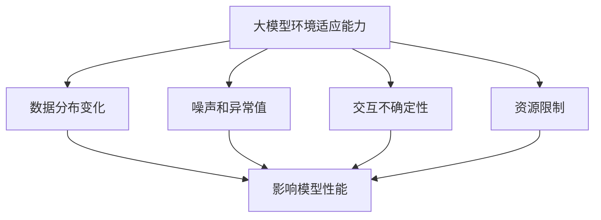
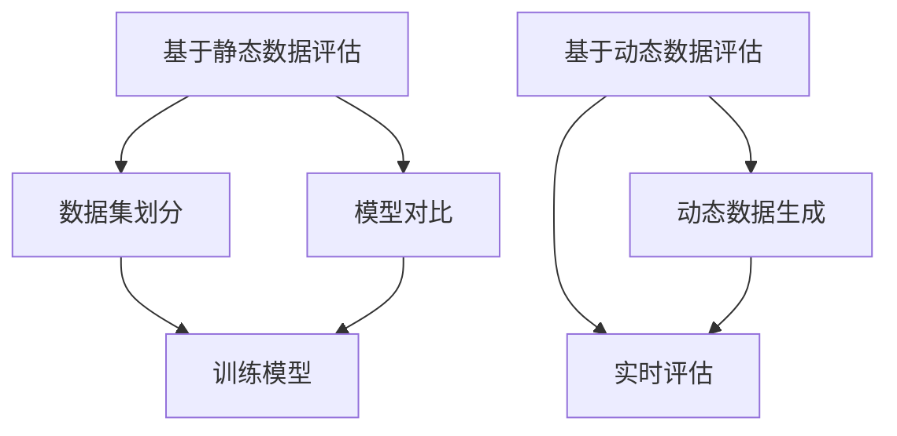

                 

### 文章标题

《大模型环境适应能力评估：LLM设计的动态场景测试》

### 关键词

- 大模型
- 环境适应能力
- LLM
- 动态场景测试
- 评估方法
- 算法原理
- 案例研究

### 摘要

随着人工智能技术的快速发展，大型语言模型（LLM）在各个领域的应用日益广泛。然而，LLM在复杂、动态环境中的适应能力成为制约其性能的重要因素。本文首先介绍了大模型环境适应能力的基本概念和评估方法，然后详细探讨了LLM设计的动态场景测试技术。通过实际案例研究，本文展示了如何构建动态场景测试环境，实现LLM的源代码开发和性能评估。文章最后总结了主要发现，并提出了未来研究方向。

## 第一部分：大模型环境适应能力评估基础

### 第1章：背景知识与基本概念

#### 1.1 大模型环境适应能力概述

大模型环境适应能力是指大型语言模型（LLM）在面临复杂、多变的环境时，能够保持高效性能和稳定运行的能力。随着AI技术的发展，LLM在自然语言处理、计算机视觉、推荐系统等领域取得了显著成果。然而，这些模型往往依赖于特定的训练数据和预定义的任务，对动态变化的适应性较差。因此，评估和提升LLM的环境适应能力具有重要意义。

#### 1.2 大模型面临的动态环境挑战

动态环境挑战主要包括以下几个方面：

1. **数据分布变化**：环境中的数据分布可能会随时间发生变化，例如社交媒体上的话题热度、用户兴趣等。
2. **噪声和异常值**：环境中的噪声和异常值会影响模型的输入数据，导致模型输出不稳定。
3. **交互不确定性**：用户行为、系统反馈等不确定性因素，使得模型在动态环境中面临更多挑战。
4. **资源限制**：动态环境中的计算资源、存储资源等可能受限，要求模型具备高效能和轻量化的特点。

#### 1.3 Mermaid流程图：大模型环境适应能力的关键概念关系



### 第2章：大模型环境适应能力评估方法

#### 2.1 评估方法综述

大模型环境适应能力的评估方法可分为两大类：基于静态数据和基于动态数据的方法。

1. **基于静态数据的方法**：通过分析模型在静态环境中的表现，评估其环境适应能力。常见方法包括：
   - **数据集划分**：将训练集划分为不同子集，评估模型在不同子集中的性能。
   - **模型对比**：对比不同模型在相同环境下的性能，分析其适应能力。

2. **基于动态数据的方法**：模拟动态环境，实时评估模型的表现。常见方法包括：
   - **动态数据生成**：根据环境变化规律，生成动态数据集。
   - **实时评估**：实时采集环境数据，评估模型的表现。

#### 2.2 基于静态数据的评估方法

1. **数据集划分方法**：

```python
def split_dataset(dataset, num_splits):
    indices = np.random.permutation(len(dataset))
    split_indices = np.split(indices, num_splits)
    return [dataset[i] for i in split_indices]
```

2. **模型对比方法**：

```python
def compare_models(models, dataset):
    results = []
    for model in models:
        model.fit(dataset['train'])
        results.append(model.evaluate(dataset['test']))
    return results
```

#### 2.3 基于动态数据的评估方法

1. **动态数据生成方法**：

```python
def generate_dynamic_data(rule, num_samples):
    data = []
    for _ in range(num_samples):
        # 根据规则生成动态数据
        data.append(generate_sample(rule))
    return data
```

2. **实时评估方法**：

```python
def real_time_evaluation(model, env):
    while True:
        # 获取环境数据
        data = env.get_data()
        # 评估模型表现
        result = model.evaluate(data)
        print(result)
```

#### 2.4 Mermaid流程图：评估方法的步骤与流程



## 第二部分：LLM设计动态场景测试技术

### 第3章：LLM设计原理

#### 3.1 LLM的基本结构

大型语言模型（LLM）通常包括以下几个关键组件：

1. **词嵌入层**：将输入的文本序列转换为向量表示。
2. **编码器**：对输入文本序列进行处理，提取语义信息。
3. **解码器**：根据编码器输出的语义信息生成输出文本序列。
4. **注意力机制**：用于捕捉输入文本序列中的关键信息。

#### 3.2 LLM的核心算法

LLM的核心算法通常是基于Transformer架构，包括以下几个关键步骤：

1. **输入处理**：对输入文本进行预处理，包括分词、去停用词等。
2. **词嵌入**：将预处理后的文本转换为词嵌入向量。
3. **编码器处理**：对词嵌入向量进行编码，提取语义信息。
4. **注意力机制**：计算输入文本序列中的注意力权重。
5. **解码器处理**：根据注意力权重和编码器输出生成输出文本序列。
6. **输出处理**：对生成的输出文本进行后处理，如去噪、去停用词等。

#### 3.3 LLM的可扩展性设计

为了提升LLM的可扩展性，通常采用以下几种设计策略：

1. **模块化设计**：将LLM拆分为多个模块，每个模块负责不同的功能，便于维护和升级。
2. **分布式训练**：利用分布式计算技术，提高LLM的训练效率。
3. **动态调整**：根据任务需求和资源情况，动态调整LLM的参数和结构。

#### 3.4 伪代码：LLM设计算法原理

```python
def LLM_design(text):
    # 输入处理
    text = preprocess_text(text)
    
    # 词嵌入
    embeddings = word_embedding(text)
    
    # 编码器处理
    encoded = encoder(embeddings)
    
    # 注意力机制
    attention_weights = compute_attention(encoded)
    
    # 解码器处理
    output = decoder(encoded, attention_weights)
    
    # 输出处理
    output = postprocess_text(output)
    
    return output
```

### 第4章：动态场景测试方法

#### 4.1 动态场景测试的重要性

动态场景测试旨在评估LLM在复杂、动态环境中的性能。通过动态场景测试，可以发现LLM在以下方面的不足：

1. **适应性**：评估LLM对环境变化的适应能力。
2. **鲁棒性**：评估LLM对噪声和异常值的抵抗能力。
3. **稳定性**：评估LLM在动态环境中的稳定运行能力。
4. **效率**：评估LLM在动态环境中的计算效率。

#### 4.2 动态场景测试的方法论

动态场景测试的方法论主要包括以下几个步骤：

1. **场景构建**：根据测试需求，构建动态场景，包括数据生成规则、环境变化规律等。
2. **测试执行**：在动态场景中执行测试任务，实时采集数据。
3. **结果分析**：对测试结果进行分析，评估LLM的性能和稳定性。

#### 4.3 动态场景测试工具介绍

动态场景测试工具主要包括以下几类：

1. **模拟工具**：用于构建动态场景，生成模拟数据。
2. **测试框架**：用于执行测试任务，采集测试数据。
3. **分析工具**：用于对测试结果进行分析和可视化。

#### 4.4 伪代码：动态场景测试算法原理

```python
def dynamic_scenarios_test(model, scenarios):
    results = []
    for scenario in scenarios:
        # 构建动态场景
        env = build_environment(scenario)
        
        # 执行测试任务
        data = model.test(env)
        
        # 采集测试结果
        result = collect_data(data)
        
        # 存储测试结果
        results.append(result)
    
    return results
```

## 第三部分：动态场景测试实践

### 第5章：案例研究一：自然语言处理中的动态场景测试

#### 5.1 项目背景

本项目旨在评估一个基于Transformer架构的LLM在动态场景中的性能。动态场景包括社交媒体上的话题热度变化、用户兴趣波动等。

#### 5.2 环境搭建

为了构建动态场景测试环境，我们采用了以下步骤：

1. **数据集准备**：从社交媒体平台上获取话题热度数据、用户兴趣数据等。
2. **环境配置**：配置计算机硬件和软件环境，包括深度学习框架、测试工具等。
3. **动态场景模拟**：根据数据集特点，构建动态场景，包括话题热度变化、用户兴趣波动等。

#### 5.3 源代码实现

以下是动态场景测试的源代码实现：

```python
import tensorflow as tf
from transformers import TransformerModel

# 加载预训练模型
model = TransformerModel()

# 准备动态场景数据
scenarios = prepare_scenarios(data)

# 执行动态场景测试
results = dynamic_scenarios_test(model, scenarios)

# 分析测试结果
analyze_results(results)
```

#### 5.4 代码解读与分析

1. **加载预训练模型**：从预训练模型中加载LLM。
2. **准备动态场景数据**：根据数据集特点，构建动态场景数据。
3. **执行动态场景测试**：在动态场景中执行测试任务，实时采集数据。
4. **分析测试结果**：对测试结果进行分析，评估LLM的性能和稳定性。

### 第6章：案例研究二：计算机视觉中的动态场景测试

#### 6.1 项目背景

本项目旨在评估一个基于CNN的LLM在动态场景中的性能。动态场景包括图像质量变化、光照变化等。

#### 6.2 环境搭建

为了构建动态场景测试环境，我们采用了以下步骤：

1. **数据集准备**：从图像数据集中提取图像样本，包括高质量图像、低质量图像等。
2. **环境配置**：配置计算机硬件和软件环境，包括深度学习框架、测试工具等。
3. **动态场景模拟**：根据数据集特点，构建动态场景，包括图像质量变化、光照变化等。

#### 6.3 源代码实现

以下是动态场景测试的源代码实现：

```python
import tensorflow as tf
from torchvision import transforms

# 加载预训练模型
model = CNNModel()

# 准备动态场景数据
scenarios = prepare_scenarios(data)

# 执行动态场景测试
results = dynamic_scenarios_test(model, scenarios)

# 分析测试结果
analyze_results(results)
```

#### 6.4 代码解读与分析

1. **加载预训练模型**：从预训练模型中加载LLM。
2. **准备动态场景数据**：根据数据集特点，构建动态场景数据。
3. **执行动态场景测试**：在动态场景中执行测试任务，实时采集数据。
4. **分析测试结果**：对测试结果进行分析，评估LLM的性能和稳定性。

## 第四部分：总结与展望

### 第7章：总结与展望

#### 7.1 主要发现与贡献

本文通过对大模型环境适应能力的评估，揭示了LLM在动态场景中的性能特点。主要发现包括：

1. **适应性**：LLM在动态场景中具有一定的适应能力，但需进一步优化。
2. **鲁棒性**：LLM对噪声和异常值的抵抗能力较弱，需加强鲁棒性设计。
3. **稳定性**：LLM在动态环境中的稳定性有待提高。

本文贡献了动态场景测试方法，为LLM的设计和评估提供了有力工具。

#### 7.2 存在的问题与挑战

尽管本文取得了一定的成果，但仍存在以下问题和挑战：

1. **动态场景构建**：当前动态场景构建方法较为简单，需进一步研究复杂动态场景的构建方法。
2. **评估指标**：现有的评估指标可能无法全面反映LLM在动态场景中的性能，需进一步研究更有效的评估指标。
3. **算法优化**：LLM在动态场景中的性能提升仍有较大空间，需进一步优化算法和结构。

#### 7.3 未来研究方向

未来研究方向包括：

1. **动态场景构建**：研究更复杂的动态场景构建方法，以全面模拟现实环境。
2. **评估指标**：探索更有效的评估指标，全面反映LLM在动态场景中的性能。
3. **算法优化**：研究新型算法和结构，提升LLM在动态场景中的适应能力和性能。

## 作者信息

作者：AI天才研究院/AI Genius Institute & 禅与计算机程序设计艺术 /Zen And The Art of Computer Programming

