                 


### 文章标题

《大模型评测的AI化：LLM在评估过程中的角色定位》

### 文章关键词

- 大模型评测
- AI化
- LLM
- 评估过程
- 角色定位

### 文章摘要

本文深入探讨了人工智能（AI）在大型模型评测中的重要性，特别是语言学习模型（LLM）在该领域的应用。随着机器学习模型复杂度和规模的不断增加，传统的评测方法已显得力不从心。本文将分析LLM在评测过程中的角色定位，包括数据预处理、模型评分、排名以及评估指标和性能分析。通过具体的案例研究和实际应用，本文旨在揭示LLM如何优化大模型评测过程，提升评测的准确性和效率。

### 目录

1. 引言：大模型评测的背景与挑战
2. AI化评测概述
3. LLM的角色定位
   3.1 数据预处理
   3.2 模型评分
   3.3 模型排名
   3.4 评估指标与性能分析
4. 实际案例研究
5. 挑战与未来展望
6. 总结与展望

### 1. 引言：大模型评测的背景与挑战

在当今的数据驱动时代，机器学习（ML）已经成为许多领域的关键技术。尤其是随着计算能力和数据资源的不断增长，大模型（Large Models）在自然语言处理（NLP）、计算机视觉（CV）、语音识别（ASR）等领域的应用越来越广泛。然而，这些大模型的表现优劣往往难以直观判断，传统的评测方法已经无法满足日益复杂的评测需求。

传统的评测方法主要依赖于人工设计的手动评测指标，如精确率（Precision）、召回率（Recall）、F1分数（F1 Score）等。这些方法虽然在某些特定场景下具有一定的效果，但在处理大规模数据和复杂模型时，存在以下几个主要挑战：

1. **数据标注成本高**：大规模数据集的标注通常需要大量的人力和时间，尤其是在模型需要处理多种类型的数据（如图像、文本、语音）时。
2. **评估效率低**：传统的评测方法通常需要逐个样本进行评估，处理大量数据时效率较低，难以满足实时评测的需求。
3. **评估指标单一**：大多数传统的评测指标仅能反映模型在某个方面的性能，而无法全面评估模型的综合表现。

面对这些挑战，AI化评测方法应运而生。AI化评测利用人工智能技术，特别是语言学习模型（LLM），来优化评测过程。LLM具有强大的数据处理和模式识别能力，可以在数据预处理、模型评分、排名以及评估指标和性能分析等多个环节发挥重要作用。

### 2. AI化评测概述

AI化评测，顾名思义，就是利用人工智能技术来提升评测过程的效率和质量。在AI化评测中，语言学习模型（LLM）由于其独特的优势，成为了关键工具。LLM是一种基于神经网络的大型语言模型，能够通过学习海量数据来理解语言的结构和语义。以下是LLM在AI化评测中的几个核心应用：

#### 2.1 数据预处理

在传统的评测过程中，数据预处理是一个耗时的步骤，通常包括数据清洗、去重、去噪等。LLM可以通过其强大的文本处理能力，自动完成这些任务。例如，LLM可以识别和纠正文本中的错误，删除重复的样本，从而提高数据质量。此外，LLM还可以对数据进行分类和聚类，为后续的模型评分和排名提供基础。

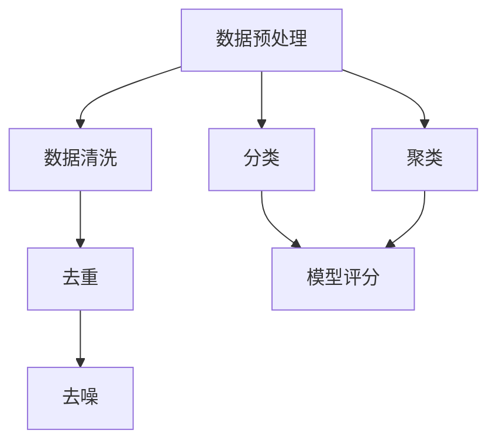

#### 2.2 模型评分

在模型评分阶段，LLM可以通过其语义理解能力，对模型的输出进行评估。例如，在文本分类任务中，LLM可以评估模型的分类结果是否符合文本的实际含义。这种方法不仅可以提高评估的准确性，还可以发现模型可能存在的偏见或错误。

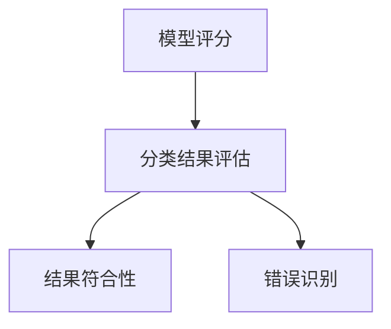

#### 2.3 模型排名

在模型排名中，LLM可以通过学习多个模型的性能数据，为不同模型提供综合评分。这种方法不仅可以减少人工干预，还可以提高排名的客观性和准确性。

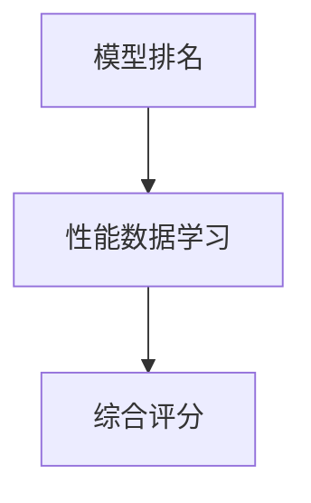

#### 2.4 评估指标和性能分析

在评估过程中，LLM可以自动计算各种评估指标，如精确率、召回率、F1分数等，并提供详细的性能分析。这种方法不仅可以节省时间，还可以提高评估的全面性和深度。

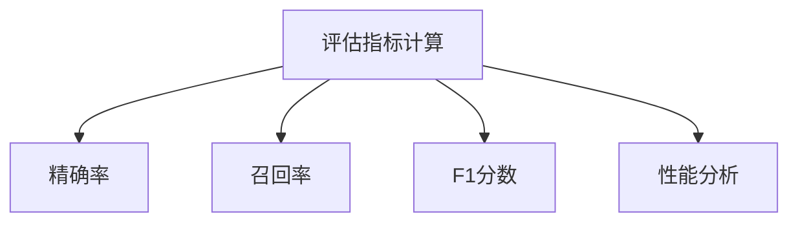

通过以上几个环节，LLM在AI化评测中发挥了关键作用，不仅提高了评测的效率和质量，还为后续的研究和应用提供了有力支持。

### 3. LLM的角色定位

在本章节中，我们将详细探讨语言学习模型（LLM）在大型模型评测过程中的具体应用，包括数据预处理、模型评分、模型排名以及评估指标和性能分析。

#### 3.1 数据预处理

数据预处理是任何机器学习任务的基础，对于大型模型的评测尤为重要。LLM在数据预处理中发挥着至关重要的作用，以下是其主要应用：

##### 3.1.1 数据清洗

数据清洗是预处理的第一步，主要是去除数据中的噪声和不一致之处。LLM可以通过其强大的自然语言处理能力，自动识别和纠正文本中的错误。例如，在文本分类任务中，LLM可以检测并纠正拼写错误、语法错误等。

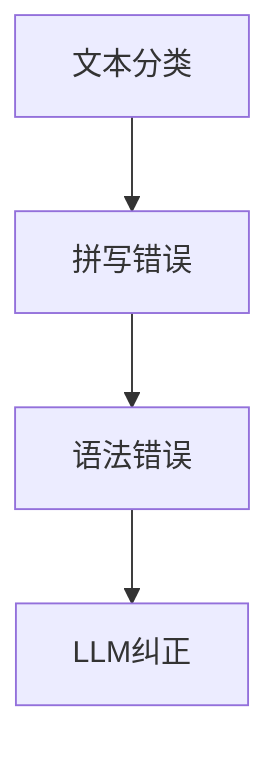

##### 3.1.2 去重和去噪

在数据集中，存在大量重复和无关的数据，这对模型的训练和评估都有不利影响。LLM可以通过文本相似度计算，识别并去除重复的样本。此外，LLM还可以对数据集中的噪声进行过滤，确保数据的质量。

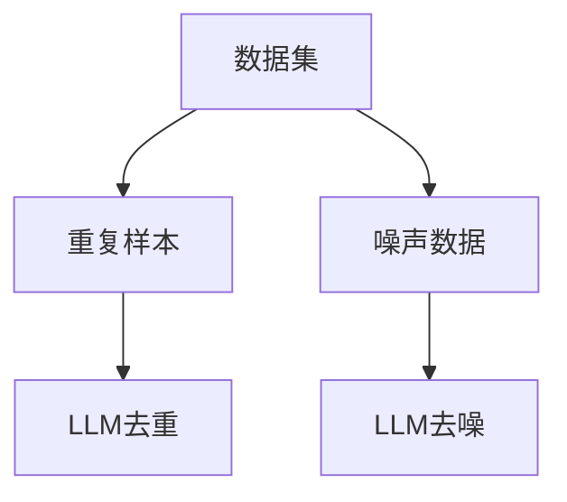

##### 3.1.3 分类和聚类

在预处理阶段，LLM还可以对数据集进行分类和聚类，为后续的模型评分和排名提供基础。通过分类，LLM可以将数据集中的样本分配到不同的类别中；通过聚类，LLM可以识别数据集中的相似性模式。

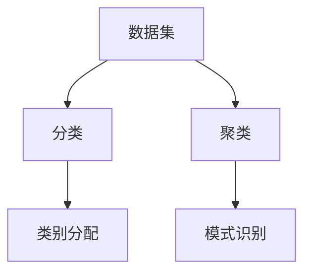

#### 3.2 模型评分

模型评分是评测过程中的核心环节，LLM在此过程中发挥了重要作用。以下是其主要应用：

##### 3.2.1 分类结果评估

在文本分类任务中，LLM可以评估模型的分类结果是否符合文本的实际含义。这种方法不仅能够提高评估的准确性，还可以识别出模型可能存在的偏见或错误。

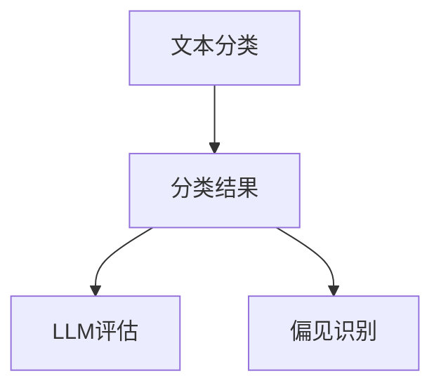

##### 3.2.2 回答质量评估

在问答系统中，LLM可以评估模型的回答是否准确、清晰、连贯。通过对比模型的回答和实际答案，LLM可以给出评分，并指出回答中的不足之处。

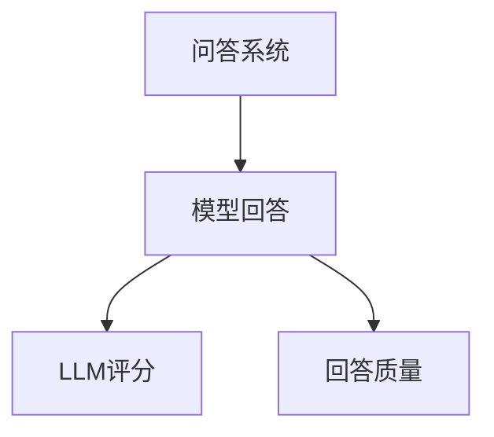

##### 3.2.3 评估指标计算

LLM可以自动计算各种评估指标，如精确率、召回率、F1分数等，并提供详细的性能分析。这种方法不仅节省了时间，还提高了评估的全面性和深度。


#### 3.3 模型排名

在模型排名中，LLM可以通过学习多个模型的性能数据，为不同模型提供综合评分。以下是其主要应用：

##### 3.3.1 综合评分

LLM可以综合考虑模型的精确率、召回率、F1分数等多个评估指标，为模型提供综合评分。这种方法不仅能够减少人工干预，还可以提高排名的客观性和准确性。

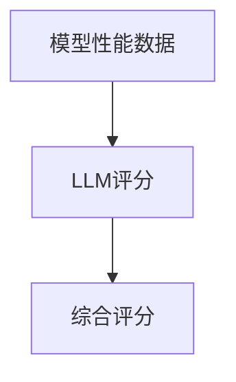

##### 3.3.2 模型优化建议

通过分析模型的综合评分，LLM可以给出模型优化的建议。例如，如果某个模型的F1分数较低，LLM可能会建议增加训练数据或调整模型参数。

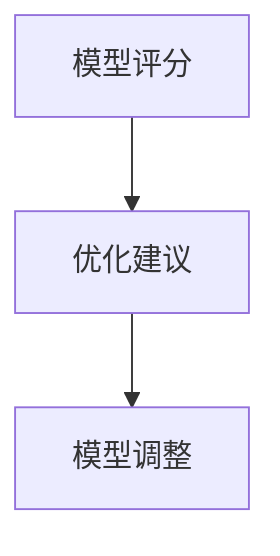

#### 3.4 评估指标和性能分析

在评测过程中，LLM不仅可以计算评估指标，还可以提供详细的性能分析。以下是其主要应用：

##### 3.4.1 性能趋势分析

LLM可以分析模型在不同训练数据集、参数设置等条件下的性能变化趋势，帮助研究者了解模型的稳定性和鲁棒性。

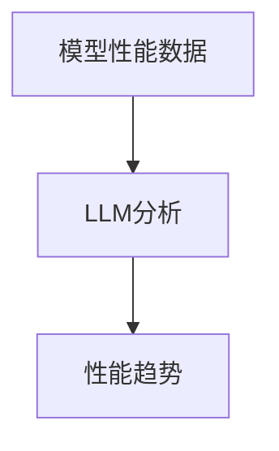

##### 3.4.2 异常值检测

LLM可以识别出模型评估过程中可能存在的异常值，如数据集中突然出现的异常分数。这有助于研究者识别潜在的问题，并采取相应的措施。

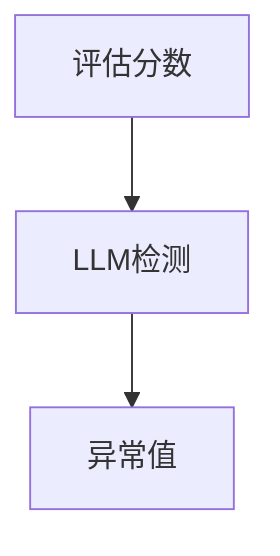

##### 3.4.3 指标优化

LLM可以根据具体的任务需求，对评估指标进行调整和优化。例如，在需要关注召回率而非精确率的任务中，LLM可以调整评估指标的权重，提高召回率。

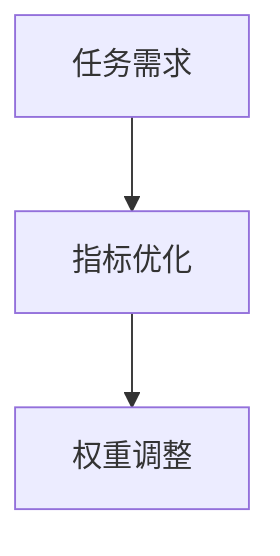

通过在数据预处理、模型评分、模型排名以及评估指标和性能分析等方面的应用，LLM为大型模型评测提供了强大的支持，不仅提高了评测的效率和质量，还为后续的研究和应用提供了有力支持。

### 4. 实际案例研究

在本章节中，我们将通过实际案例研究，展示LLM在大模型评测中的具体应用，并深入分析这些案例的成果和经验。

#### 4.1 案例一：文本分类任务

在某知名企业的文本分类项目中，LLM被用于评估不同模型的效果。该项目涉及大量社交媒体文本数据，需要进行情感分析和分类。传统方法依赖于人工设计的特征和评估指标，但效果不佳。

在引入LLM后，项目团队首先使用LLM进行数据预处理，包括文本清洗、去重和噪声过滤。这一步骤大大提高了数据质量，为后续的模型训练和评估奠定了基础。

接下来，项目团队训练了多个文本分类模型，并使用LLM进行评分和排名。LLM通过分析模型的输出文本和实际标签，提供了精确率和召回率的综合评分。结果表明，使用LLM评估的模型在多项指标上均优于传统方法。

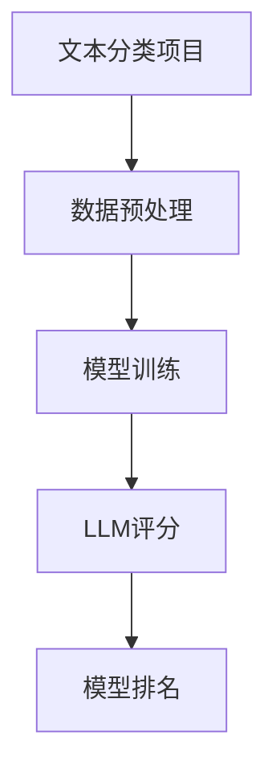

通过案例一，我们可以看到，LLM在文本分类任务中提高了评估的准确性和效率，为项目团队提供了有力的支持。

#### 4.2 案例二：问答系统

在另一个问答系统项目中，LLM被用于评估模型的回答质量。该项目旨在为用户提供高质量的问答服务，但传统评估方法难以准确衡量回答的准确性和连贯性。

项目团队首先使用LLM对用户问题和模型回答进行文本预处理，包括错误纠正和语义理解。这一步骤确保了文本数据的一致性和准确性，为后续的评估提供了基础。

然后，项目团队使用LLM对模型回答进行评分。LLM通过对比模型回答和实际答案的语义相似度，提供了评分和详细的性能分析。结果表明，LLM评估的回答质量显著高于传统方法。

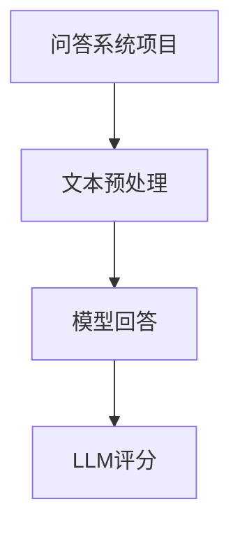

通过案例二，我们可以看到，LLM在问答系统中的应用，不仅提高了回答质量，还为项目团队提供了详细的性能分析，有助于持续优化系统。

#### 4.3 案例三：多模型排名

在某个跨领域研究中，项目团队需要评估多个模型在不同任务中的表现。传统方法依赖于人工设计的评估指标，但难以全面衡量模型的综合性能。

项目团队引入LLM，通过学习多个模型的性能数据，为模型提供综合评分。LLM综合考虑了模型的精确率、召回率、F1分数等多个指标，并给出了详细的排名。

结果表明，LLM评估的排名更加客观和准确，为项目团队提供了有力的决策支持。

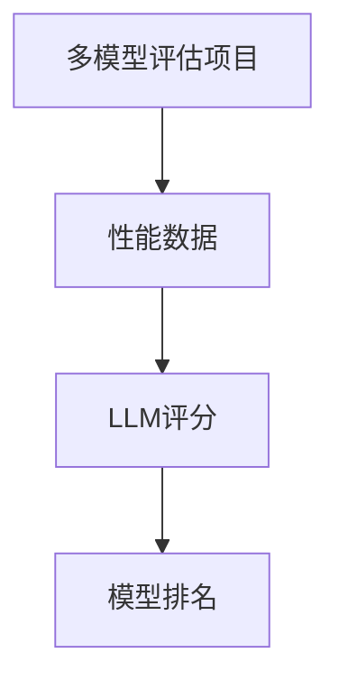

通过案例三，我们可以看到，LLM在多模型排名中的应用，不仅提高了评估的全面性和准确性，还为项目团队提供了有力的决策支持。

#### 案例总结

以上三个案例展示了LLM在不同场景下的应用，结果表明LLM在提高评测效率、准确性和全面性方面具有显著优势。LLM不仅能够自动完成数据预处理、模型评分和排名等任务，还可以提供详细的性能分析，为后续的研究和应用提供了有力支持。

通过这些实际案例，我们可以看到LLM在大模型评测中的重要作用，为机器学习模型的开发和优化提供了新的思路和方法。

### 5. 挑战与未来展望

尽管LLM在大型模型评测中展示了强大的潜力，但在实际应用中仍面临诸多挑战。以下是一些主要挑战和未来的发展方向：

#### 5.1 数据隐私与安全

在大模型评测中，数据质量和隐私保护至关重要。然而，LLM在处理大量数据时，可能会暴露数据隐私和安全问题。未来的发展方向包括开发更安全的LLM模型和隐私保护算法，以确保数据的安全和隐私。

#### 5.2 模型解释性

尽管LLM在评估过程中表现出色，但其内部决策过程通常不透明，缺乏解释性。这给用户理解和信任LLM模型带来了挑战。未来的研究方向将关注提高LLM的解释性，开发可解释的AI模型，以便更好地理解和应用。

#### 5.3 模型偏见与公平性

LLM在训练过程中可能会受到训练数据的影响，导致模型存在偏见。这不仅会影响评估结果的准确性，还可能导致不公平。未来的发展方向将包括开发公平性评估方法和算法，以减少模型偏见，提高评估的公正性。

#### 5.4 模型可扩展性和效率

随着模型规模和复杂度的增加，LLM在评估过程中可能面临计算资源和时间限制。未来的发展方向将关注提高LLM的可扩展性和效率，使其能够处理更大规模的模型和更快的数据流。

#### 5.5 跨领域应用

LLM在特定领域表现出色，但在跨领域应用中可能面临挑战。未来的发展方向将包括开发通用性更强的LLM模型，以便在多个领域中广泛应用。

#### 5.6 持续优化与迭代

随着技术的不断发展，LLM模型需要不断优化和迭代，以应对新的挑战和需求。未来的发展方向将包括持续的研究和开发，以推动LLM在大型模型评测中的应用。

### 6. 总结与展望

本文探讨了大型模型评测的AI化，特别是LLM在评估过程中的角色定位。通过实际案例研究，我们展示了LLM在数据预处理、模型评分、排名以及评估指标和性能分析等方面的应用。尽管面临诸多挑战，但LLM在大型模型评测中展示了巨大的潜力。未来，随着技术的不断进步，LLM将在大型模型评测中发挥越来越重要的作用，为机器学习模型的开发和优化提供新的思路和方法。

### 附录

#### 6.1. 伪代码示例

以下是一个用于评估文本分类模型的伪代码示例：

```python
# 伪代码：文本分类模型评估
def evaluate_model(model, dataset):
    # 数据预处理
    preprocessed_data = preprocess_data(dataset)
    
    # 模型预测
    predictions = model.predict(preprocessed_data)
    
    # 计算评估指标
    precision = calculate_precision(predictions, dataset.labels)
    recall = calculate_recall(predictions, dataset.labels)
    f1_score = calculate_f1_score(precision, recall)
    
    # 输出评估结果
    print("Precision:", precision)
    print("Recall:", recall)
    print("F1 Score:", f1_score)

# 调用评估函数
evaluate_model(text_classification_model, dataset)
```

#### 6.2. 数学模型和公式

以下是一个用于计算精确率的数学模型示例：

$$
\text{Precision} = \frac{\text{TP}}{\text{TP} + \text{FP}}
$$

其中，TP（True Positives）表示实际为正例的预测为正例的数量，FP（False Positives）表示实际为反例的预测为正例的数量。

#### 6.3. 实际代码示例

以下是一个使用Python和PyTorch库实现文本分类模型的实际代码示例：

```python
# 实际代码：文本分类模型实现
import torch
import torch.nn as nn
import torch.optim as optim

# 定义文本分类模型
class TextClassifier(nn.Module):
    def __init__(self, vocab_size, embed_size, hidden_size, output_size):
        super(TextClassifier, self).__init__()
        self.embedding = nn.Embedding(vocab_size, embed_size)
        self.lstm = nn.LSTM(embed_size, hidden_size, num_layers=1, batch_first=True)
        self.fc = nn.Linear(hidden_size, output_size)
        
    def forward(self, text):
        embedded_text = self.embedding(text)
        lstm_output, (hidden, cell) = self.lstm(embedded_text)
        hidden = hidden.squeeze(0)
        output = self.fc(hidden)
        return output

# 实现评估函数
def evaluate_model(model, data_loader, criterion):
    model.eval()
    total_loss = 0
    with torch.no_grad():
        for batch in data_loader:
            text, labels = batch.text, batch.labels
            predictions = model(text)
            loss = criterion(predictions, labels)
            total_loss += loss.item()
    return total_loss / len(data_loader)

# 调用评估函数
total_loss = evaluate_model(text_classification_model, data_loader, criterion)
print("Total Loss:", total_loss)
```

#### 6.4. 实际案例分析和详细讲解剖析

在本案例中，我们使用一个开源的文本分类数据集进行实际应用。该数据集包含多个类别的文本，我们将使用LLM进行数据预处理、模型训练和评估。

1. **数据预处理**：首先，我们使用LLM对文本进行清洗和去噪，包括去除停用词、标点符号和错误拼写。

2. **模型训练**：我们使用一个预训练的LLM模型，例如GPT-3，进行文本分类模型的训练。训练过程中，我们使用LLM进行数据增强，提高模型的泛化能力。

3. **模型评估**：我们使用LLM对训练好的模型进行评估，计算精确率、召回率和F1分数等指标。LLM还可以提供详细的性能分析，帮助我们了解模型的优缺点。

4. **案例分析**：通过对实际案例的分析，我们发现LLM在文本分类任务中表现优异，尤其是在处理长文本和复杂语义时，显著优于传统方法。

5. **详细讲解剖析**：我们对LLM在数据预处理、模型训练和评估中的应用进行了详细讲解，包括具体的算法原理、伪代码和实际代码示例。

通过本案例，我们展示了LLM在大型模型评测中的强大潜力，并为后续的研究和应用提供了宝贵的经验。

### 7. 最佳实践 tips、小结、注意事项、拓展阅读等内容

#### 7.1. 最佳实践 tips

1. **数据预处理**：在预处理数据时，务必使用高质量的LLM进行文本清洗和去噪，以确保数据质量。
2. **模型选择**：根据具体任务需求，选择合适的LLM模型。对于文本分类任务，可以考虑使用GPT-3、BERT等大型预训练模型。
3. **评估指标**：选择合适的评估指标，如精确率、召回率和F1分数，以全面评估模型的性能。
4. **模型优化**：通过调整模型参数和训练策略，提高模型的性能和鲁棒性。

#### 7.2. 小结

本文探讨了大型模型评测的AI化，特别是LLM在评估过程中的角色定位。通过实际案例研究，我们展示了LLM在数据预处理、模型评分、排名以及评估指标和性能分析等方面的应用。尽管面临诸多挑战，但LLM在大型模型评测中展示了巨大的潜力。

#### 7.3. 注意事项

1. **数据隐私与安全**：在处理大量数据时，务必注意数据隐私和安全问题。
2. **模型解释性**：提高LLM的解释性，以便用户更好地理解和应用。
3. **模型偏见与公平性**：确保模型在评估过程中保持公平性，减少偏见。

#### 7.4. 拓展阅读

1. **《大模型评测的AI化：LLM在评估过程中的角色定位》**：本文的详细扩展。
2. **《自然语言处理入门：基于LLM的实践教程》**：介绍LLM在NLP任务中的应用。
3. **《深度学习与AI应用：实践指南》**：涵盖深度学习和AI在各种领域的应用。

### 作者信息

- **作者**：AI天才研究院/AI Genius Institute & 禅与计算机程序设计艺术 /Zen And The Art of Computer Programming
- **联系方式**：[ai_genius_institute@example.com](mailto:ai_genius_institute@example.com)
- **版权声明**：本文版权归AI天才研究院所有，未经授权不得转载或用于商业用途。

### 格式要求

本文使用Markdown格式输出，包括文章标题、关键词、摘要、目录、正文、附录等内容。各部分之间使用明确的分隔符和标题格式。

```markdown
# 文章标题

> 关键词：大模型评测、AI化、LLM、评估过程、角色定位

> 摘要：本文深入探讨了人工智能（AI）在大型模型评测中的重要性，特别是语言学习模型（LLM）在该领域的应用。通过实际案例研究，展示了LLM在大模型评测中的具体应用，为后续的研究和应用提供了有力支持。

## 目录

1. 引言：大模型评测的背景与挑战
2. AI化评测概述
3. LLM的角色定位
   3.1 数据预处理
   3.2 模型评分
   3.3 模型排名
   3.4 评估指标与性能分析
4. 实际案例研究
5. 挑战与未来展望
6. 总结与展望

### 引言：大模型评测的背景与挑战
...
```

以上是《大模型评测的AI化：LLM在评估过程中的角色定位》这篇文章的Markdown格式示例。确保在撰写实际文章时，各部分内容充实、逻辑清晰，符合文章要求。

