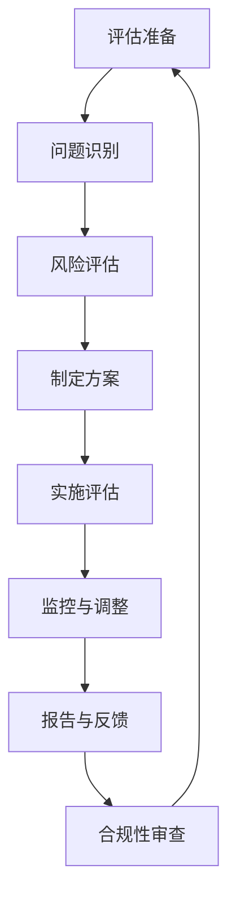

                 

### 引言

#### 书籍背景

随着人工智能（AI）技术的飞速发展，大型模型（Large-scale Models，简称“大模型”）在计算机视觉、自然语言处理、推荐系统等众多领域取得了显著的成果。这些大模型具备处理海量数据和复杂任务的能力，为人类带来了前所未有的便利和创新。然而，伴随着大模型的广泛应用，其评测过程中所涉及的伦理问题也愈发凸显。伦理考量在大模型评测中不仅关乎技术的健康发展，更关系到社会公平、个人隐私以及人类价值观的维护。

回顾人工智能的发展历程，大模型的出现并非一蹴而就。从早期的规则系统、知识表示，到基于统计模型的方法，再到如今的深度学习和大数据技术，每一个阶段的进步都为今天的大模型奠定了基础。特别是2012年，AlexNet在ImageNet竞赛中的卓越表现，标志着深度学习时代的到来。此后，随着计算能力的提升和数据的不断丰富，大模型如雨后春笋般涌现，为各行各业带来了革命性的变化。

然而，随着大模型在金融、医疗、教育等关键领域的应用日益广泛，其评测的准确性、公平性、透明性等问题也引起了广泛关注。尤其是在数据隐私、算法偏见、资源分配等方面，大模型评测的伦理考量显得尤为必要。这不仅是因为这些问题可能对个人和社会产生深远的影响，更是因为技术发展的过程中，伦理考量是确保技术可持续发展的基石。

#### 大模型在各个领域的应用

大模型在各个领域的应用，极大地推动了社会的进步和变革。在计算机视觉领域，大模型如ResNet、VGG等，在图像分类、目标检测、图像生成等方面取得了令人瞩目的成果。例如，谷歌的Inception模型在ImageNet图像识别竞赛中连续三年夺冠，大幅提升了图像识别的准确率。在自然语言处理（NLP）领域，大模型如GPT、BERT等，在机器翻译、文本生成、问答系统等方面展现了强大的能力。OpenAI的GPT-3模型，在文本生成、代码编写、甚至创意写作等方面都取得了突破性进展。在推荐系统领域，大模型通过用户行为数据的分析，为用户推荐个性化的商品、内容等，极大地提升了用户体验。

除了上述领域，大模型还在医疗诊断、金融风控、自动驾驶等众多领域发挥了关键作用。例如，AI医生系统能够通过分析医学影像，提高疾病的诊断准确性；金融风险评估系统可以识别潜在的风险，帮助金融机构进行风险控制；自动驾驶系统则通过大模型对环境数据的实时分析，实现自动驾驶的精准控制。这些应用不仅提高了行业的工作效率和准确性，还带来了新的商业模式和业务流程。

然而，大模型在这些领域的广泛应用，也引发了诸多伦理问题。例如，在医疗领域，大模型的诊断结果可能影响患者的治疗方案，因此其准确性至关重要。但在数据隐私和安全性方面，如何保护患者的隐私信息成为了一个亟待解决的问题。在自动驾驶领域，大模型在复杂环境下的决策能力和安全性备受关注，但如何确保其在极端情况下的应对策略，以及如何防范潜在的道德风险，也是不可忽视的挑战。

#### 伦理考量的必要性

伦理考量在大模型评测中的必要性主要体现在以下几个方面：

首先，数据隐私与安全是核心问题。大模型通常依赖于海量数据训练，这些数据中往往包含了个人隐私信息。如何确保这些数据在训练和评测过程中的安全性，防止数据泄露或滥用，是首要考虑的问题。

其次，算法偏见与公平性。大模型在训练过程中可能受到训练数据偏差的影响，导致算法在处理某些特定群体时产生偏见。例如，在招聘系统中，如果训练数据中存在性别或种族偏见，那么系统在筛选候选人时也可能表现出类似的偏见，从而影响公平性。

再次，资源分配与公平性。大模型训练和评测需要大量的计算资源和存储资源，而资源的分配是否公平，是否会影响某些特定群体或地区的发展，也是需要考量的问题。

最后，法律法规的遵守。不同国家和地区对于数据隐私、算法透明性等方面有不同的法律法规，如何在评测过程中遵守这些法律法规，确保技术的合法合规性，也是伦理考量的重要内容。

综上所述，大模型评测的伦理考量不仅是技术发展的需要，更是社会公平、个人隐私和价值观维护的需要。只有充分认识到伦理考量的重要性，并采取有效的措施，才能确保大模型技术的健康发展，为人类带来更多的福祉。

### 书籍目标

本章节旨在探讨大模型评测中的伦理问题，并致力于提出可行的实践解决方案。随着大模型的广泛应用，其评测过程中涉及的伦理问题越来越复杂和多样，这不仅关系到技术的可靠性，也影响到社会的公平、正义和伦理道德。因此，如何在大模型评测中平衡技术创新和社会责任，成为当前亟待解决的重要课题。

#### 探讨大模型评测中的伦理问题

首先，本章节将深入探讨大模型评测中的主要伦理问题，包括数据隐私与安全、算法偏见与公平性、资源分配与公平性以及法律法规的遵守。这些问题在大模型评测过程中可能引发诸多负面影响，如数据泄露、算法歧视、资源垄断等，不仅损害了个人权益，也影响了社会的整体利益。

1. **数据隐私与安全**：大模型通常依赖海量数据进行训练和评测，这些数据中往往包含了个人敏感信息。如何在确保数据价值的同时，保护个人隐私和安全，是一个重大的伦理问题。本章节将分析当前的数据隐私保护措施，如数据加密、匿名化处理等，并探讨其在实际应用中的效果和局限性。

2. **算法偏见与公平性**：大模型在训练过程中可能会受到训练数据偏差的影响，导致算法在处理某些特定群体时产生偏见。例如，在招聘系统中，如果训练数据中存在性别或种族偏见，那么系统在筛选候选人时也可能表现出类似的偏见，从而影响公平性。本章节将分析算法偏见的原因及其对社会的潜在影响，并提出可能的解决方案。

3. **资源分配与公平性**：大模型训练和评测需要大量的计算资源和存储资源，而资源的分配是否公平，是否会影响某些特定群体或地区的发展，也是需要考量的问题。本章节将探讨资源分配的公平性原则，分析当前资源分配存在的问题，并提出改善措施。

4. **法律法规的遵守**：不同国家和地区对于数据隐私、算法透明性等方面有不同的法律法规。如何在评测过程中遵守这些法律法规，确保技术的合法合规性，也是伦理考量的重要内容。本章节将介绍主要国家和地区的相关法律法规，分析其在大模型评测中的应用，并探讨如何确保合法合规。

#### 提出实践解决方案

其次，本章节将针对上述伦理问题，提出一系列实践解决方案。这些解决方案将结合理论分析和实际案例，旨在为研究人员和从业者提供具体可行的指导。

1. **数据隐私保护**：针对数据隐私保护问题，本章节将介绍一系列数据隐私保护技术，如数据加密、匿名化处理、差分隐私等，并分析其优缺点。同时，本章节将探讨如何在实际应用中有效地实施这些技术，确保数据在训练和评测过程中的安全性。

2. **算法偏见校正**：针对算法偏见问题，本章节将提出多种算法偏见校正方法，如数据增强、算法优化、偏见检测与修正等。同时，本章节将结合实际案例，分析这些方法的适用场景和效果，为算法工程师提供实际操作的指南。

3. **资源公平分配**：针对资源分配问题，本章节将探讨资源公平分配的原则和机制，如资源池化、按需分配、区域差异补偿等。同时，本章节将结合实际案例，分析这些机制的实施效果，为资源管理提供参考。

4. **法律法规遵守**：针对法律法规的遵守问题，本章节将详细介绍主要国家和地区的相关法律法规，分析其在大模型评测中的应用，并提出合规建议。同时，本章节将探讨如何建立有效的法律法规合规机制，确保大模型评测过程的合法合规。

通过以上探讨和实践解决方案的提出，本章节旨在为大模型评测提供全面的伦理考量框架，帮助读者深入理解大模型评测中的伦理问题，并掌握有效的解决方案，确保大模型技术的发展能够兼顾社会公平、个人隐私和伦理道德。

### 大模型评测伦理基础

#### 伦理学基本概念

伦理学是研究道德规范、价值观和行为准则的哲学学科，其核心任务是探讨如何使人类社会和个体行为更加公正、合理和道德。在计算机科学和人工智能领域，伦理学的重要性日益凸显，尤其是在涉及数据隐私、算法偏见、资源分配等关键问题时，伦理学的指导作用不可忽视。

伦理学的基本概念包括伦理学定义、道德原则和伦理准则。伦理学定义了伦理学的对象和方法，即研究人类行为和决策的道德标准。道德原则是伦理学的基础，包括公正、诚实、尊重、责任等，这些原则为评价行为提供了基本标准。伦理准则则是具体的行为规范，是道德原则在具体情境中的应用。

在计算机科学和人工智能领域，伦理学的作用主要体现在以下几个方面：

1. **指导技术研发**：伦理学原则可以为技术研发提供道德指导，确保技术发展符合社会价值观和伦理标准。例如，在开发自动驾驶技术时，如何确保系统的安全性、公正性和透明性，就需要伦理学的指导。

2. **评估技术应用**：伦理学提供了评估技术应用是否合理和道德的标准。例如，在人脸识别技术的应用中，如何保护个人隐私、防止滥用，就需要通过伦理学评估来确保其合理使用。

3. **规范行业行为**：伦理学原则可以规范行业行为，促进行业自律。例如，在数据隐私保护方面，伦理学原则可以指导企业制定合规的数据处理政策，确保用户数据的保护。

4. **维护社会公正**：伦理学关注社会公正和正义，可以为解决社会不公现象提供理论支持。例如，在算法偏见问题上，伦理学原则可以指导如何设计公平、透明的算法，减少社会偏见和不平等。

#### 道德原则与伦理准则

在计算机科学和人工智能领域，以下几个道德原则和伦理准则尤为重要：

1. **公正性**：公正性要求技术设计和应用过程中，不应歧视或偏袒任何特定群体，确保所有人都能公平地享受技术带来的便利。例如，在招聘系统中，应避免算法偏见，确保对所有候选人公平对待。

2. **尊重个人隐私**：尊重个人隐私是伦理学的基本原则之一。在数据收集、处理和使用过程中，应确保个人隐私不受侵犯。例如，在数据匿名化处理中，应确保数据匿名化效果，防止个人隐私泄露。

3. **责任与透明性**：技术研发者和应用者应对其行为负责，并确保技术应用过程的透明性。例如，在自动驾驶技术的应用中，应确保系统的决策过程可追溯、可解释，以便在发生问题时能够进行责任认定。

4. **数据安全**：确保数据在存储、传输和处理过程中的安全性是伦理学的重要要求。例如，应采用加密技术保护数据安全，防止数据泄露或篡改。

5. **可持续发展**：可持续发展要求技术应用不应破坏自然环境，应促进社会和生态的可持续发展。例如，在云计算和大数据技术的应用中，应考虑到能源消耗和碳排放问题，采取绿色、环保的技术方案。

这些道德原则和伦理准则为计算机科学和人工智能领域的技术研发和应用提供了基本的伦理框架，有助于确保技术的发展符合社会价值观和伦理标准。

#### 大模型评测中的伦理问题

在大模型评测中，伦理问题贯穿于整个评测过程，包括数据隐私与安全、生物特征数据的伦理问题以及计算能力与资源分配等方面。这些问题不仅关系到技术的健康发展，更关系到社会公平和人类价值观的维护。

**数据隐私与安全**

数据隐私与安全是大数据和人工智能领域的核心伦理问题之一。大模型通常需要依赖海量数据进行训练和评测，这些数据中往往包含了大量的个人隐私信息，如姓名、地址、身份证号、医疗记录等。如何确保这些数据在收集、存储、传输和使用过程中的安全性，防止数据泄露、滥用或非法交易，是首要考虑的问题。

**数据隐私保护措施**：

1. **数据加密**：对数据进行加密处理，确保数据在传输和存储过程中的安全性。常用的加密算法包括AES、RSA等。
2. **匿名化处理**：通过匿名化技术，将数据中的个人识别信息进行替换或删除，以保护个人隐私。常见的匿名化方法包括K-匿名、l-diversity和t-closeness等。
3. **差分隐私**：通过在数据处理过程中引入噪声，使数据处理结果不会揭示个别数据点的隐私信息。差分隐私以其严格的隐私保护机制，被广泛应用于大数据分析中。

**实际案例分析**：

1. **Facebook数据泄露事件**：2018年，Facebook的5亿用户数据被泄露，涉及用户个人信息、浏览历史、聊天记录等。这一事件暴露了数据隐私保护的严重漏洞，引发了全球范围内对数据隐私保护的广泛关注。
2. **Equifax数据泄露事件**：2017年，Equifax发生了数据泄露事件，涉及1.43亿美国人的个人信息。此次事件暴露了数据存储和传输过程中的安全漏洞，引发了法律诉讼和公众抗议。

**生物特征数据的伦理问题**

生物特征数据，如人脸、指纹、虹膜等，在大模型训练和评测中具有重要作用。然而，这些数据的特殊性和敏感性，使其在伦理方面面临诸多挑战。

**生物特征数据的伦理问题**：

1. **数据收集与使用**：未经个人同意，非法收集和使用生物特征数据，可能侵犯个人隐私权。
2. **数据共享与跨境传输**：生物特征数据的跨境传输和共享，可能涉及数据主权和法律冲突问题。
3. **数据泄露与滥用**：生物特征数据一旦泄露，可能被用于非法目的，如身份盗窃、诈骗等。

**伦理考量**：

1. **知情同意**：在进行生物特征数据收集和使用前，应确保个人明确了解数据用途、处理方式和隐私保护措施，并同意数据收集和使用。
2. **数据保护**：采用严格的数据保护措施，确保生物特征数据在存储、传输和使用过程中的安全性。
3. **责任界定**：明确数据收集、处理和使用的责任主体，确保在数据泄露或滥用事件发生时，能够及时追究责任。

**实际案例分析**：

1. **剑桥分析公司数据滥用事件**：2018年，剑桥分析公司被曝非法收集8700万用户的社交媒体数据，用于政治广告定向投放。这一事件引发了全球范围内对社交媒体数据隐私保护的广泛讨论。
2. **印度国家人口登记局数据泄露事件**：2020年，印度国家人口登记局发生数据泄露事件，涉及2.2亿公民的个人信息。此次事件暴露了政府在数据保护方面的漏洞，引发了公众的强烈抗议。

**计算能力与资源分配**

大模型训练和评测需要大量的计算资源和存储资源，这些资源的获取和分配，也涉及伦理问题。

**计算能力与资源分配的伦理问题**：

1. **资源分配不公**：大模型训练和评测所需的计算资源主要集中在大型科技公司和研究机构，可能导致资源分配不公，影响中小企业和独立研究者的创新能力。
2. **能源消耗**：大规模数据训练过程消耗大量电力，可能导致环境问题，影响可持续发展。
3. **数据偏见**：资源分配不公可能导致数据采集和使用的偏差，影响大模型的公平性和准确性。

**伦理考量**：

1. **公平资源分配**：确保计算资源公平分配，支持各类研究者和企业的发展。
2. **绿色计算**：采用高效、节能的算法和硬件，降低数据训练过程中的能源消耗。
3. **数据多样性**：收集和使用多样化的数据，减少数据偏见，提高大模型的公平性和准确性。

**实际案例分析**：

1. **亚马逊云服务争议**：亚马逊云服务在计算资源分配上被指存在不公平现象，导致一些小型企业和初创企业难以获得足够的资源支持。这一事件引发了社会对资源分配公平性的广泛关注。
2. **谷歌绿色计算计划**：谷歌推出了绿色计算计划，通过采用高效节能的硬件和算法，减少数据训练过程中的能源消耗，以实现可持续发展目标。

通过以上分析，可以看出，大模型评测中的伦理问题复杂多样，涉及数据隐私与安全、生物特征数据的伦理问题以及计算能力与资源分配等方面。这些问题的解决需要多方协作，从法律、技术和社会层面共同发力，确保大模型技术的发展能够兼顾社会公平、个人隐私和伦理道德。

#### 伦理考量在法律法规中的体现

在全球范围内，不同国家和地区对数据隐私、算法透明性和伦理准则等方面制定了相应的法律法规，这些法规为大模型评测提供了重要的法律依据和指导。以下将介绍主要国家和地区的相关法律法规，并分析其在大模型评测中的应用。

**GDPR（欧盟通用数据保护条例）**

GDPR是欧盟于2018年5月25日正式实施的法规，旨在加强数据隐私保护，规范数据处理行为。GDPR的核心要求包括：

1. **合法性、公正性和透明性**：数据处理必须合法、公正，并告知数据主体数据处理的目的、范围和方式。
2. **数据最小化**：仅收集和处理为实现特定目的所必需的数据。
3. **数据准确性和更新**：确保数据准确，并采取措施及时更新或删除过时数据。
4. **数据匿名化和加密**：对数据进行匿名化处理或加密，以防止数据泄露或滥用。

GDPR对大模型评测的直接影响在于其严格的隐私保护要求。在大模型训练和评测过程中，数据处理者必须遵守GDPR的规定，确保个人数据的合法收集、处理和存储。例如，数据处理者需要取得数据主体的明确同意，并在数据泄露事件发生时及时通知相关个人和监管机构。

**CCPA（美国加州消费者隐私法）**

CCPA是于2020年1月1日生效的加州法律，旨在保护加州消费者的隐私权，规定企业必须透明地披露数据处理行为，并给予消费者对自身数据的访问权和删除权。CCPA的核心要求包括：

1. **消费者权利**：消费者有权访问、删除和拒绝出售其个人信息。
2. **透明性**：企业必须明确告知消费者其个人信息收集、使用和共享的目的。
3. **通知和披露**：企业必须在收集个人信息前向消费者提供明确的通知和披露。

CCPA对大模型评测的影响主要体现在其消费者隐私保护要求。在大模型训练和评测过程中，涉及消费者个人信息的数据处理行为，必须遵守CCPA的规定，确保消费者对其数据的控制权。例如，数据处理者需要为消费者提供便捷的访问和删除数据的渠道，并在数据处理前获取消费者的同意。

**ISO/IEC 27001**

ISO/IEC 27001是国际标准化组织（ISO）和国际电工委员会（IEC）于2013年共同发布的关于信息安全的国际标准。该标准旨在提供一套全面的信息安全管理框架，帮助企业建立、实施、维护和持续改进信息安全管理系统（ISMS）。

ISO/IEC 27001对大模型评测的直接影响在于其全面的信息安全要求。在大模型训练和评测过程中，数据处理者需要建立并维护一个符合ISO/IEC 27001的信息安全管理系统，确保数据在收集、存储、传输和处理过程中的安全性。例如，数据处理者需要实施数据加密、访问控制、安全审计等安全措施，防止数据泄露、篡改或滥用。

**中国相关法律法规**

中国在数据隐私保护和网络安全方面也制定了多项法律法规，如《网络安全法》、《个人信息保护法》等。这些法律法规的核心要求包括：

1. **网络安全**：网络运营者应采取技术和管理措施，保护网络安全，防止网络攻击和数据泄露。
2. **个人信息保护**：网络运营者应收集、使用个人信息时遵循合法、正当、必要的原则，并采取技术和管理措施保护个人信息安全。
3. **跨境数据传输**：涉及跨境数据传输的，需要符合相关法律法规的规定，如数据本地化存储等。

中国相关法律法规对大模型评测的影响主要体现在其严格的网络安全和个人信息保护要求。在大模型训练和评测过程中，数据处理者必须遵守这些法律法规，确保数据的安全和合规性。例如，数据处理者需要建立健全的信息安全管理体系，采取数据加密、访问控制等安全措施，防止数据泄露和滥用。

**法律法规在大模型评测中的应用**

1. **数据隐私保护**：大模型评测过程中，数据处理者需要遵守GDPR、CCPA等国际法律法规，确保个人数据的合法收集、处理和存储。同时，在中国，数据处理者也需要遵守《个人信息保护法》等国内法律法规，保护个人信息的合法性和安全性。

2. **算法透明性**：为了提高算法的透明性和可解释性，大模型评测过程中需要遵循ISO/IEC 27001等国际标准，建立完善的信息安全管理体系，确保数据处理过程的透明性和可追溯性。

3. **合法合规**：在大模型评测过程中，数据处理者需要确保其数据处理行为符合相关法律法规的要求，如获取数据主体的明确同意、确保数据安全等。

通过以上分析，可以看出，伦理考量在大模型评测中的体现，离不开相关法律法规的支持和指导。这些法律法规不仅为大模型评测提供了法律依据，也为数据处理者提供了明确的操作指南，有助于确保大模型评测过程的合法合规和公平公正。

### 大模型评测伦理标准

#### 伦理评估体系

在大模型评测过程中，建立一套完善的伦理评估体系至关重要。伦理评估体系不仅有助于识别和解决伦理问题，还能为研究人员和从业者提供明确的操作指南，确保大模型评测过程的合法合规和公平公正。

**伦理评估原则**

1. **合法性**：确保大模型评测过程中的数据处理行为符合相关法律法规的要求，如数据隐私保护、网络安全等。
2. **公正性**：确保评测过程中对所有参与者的公平对待，避免歧视或偏见，确保评测结果的公正性。
3. **透明性**：确保评测过程的透明度，使所有相关人员了解评测的目标、方法和结果，增强评测结果的信任度。
4. **责任性**：明确大模型评测过程中各方的责任，确保在出现问题时能够及时追究责任。
5. **可持续性**：确保评测过程对环境和社会的影响最小，促进可持续发展。

**伦理评估流程**

伦理评估流程通常包括以下几个步骤：

1. **评估准备**：明确评测的目标、范围和参与者，收集相关法律法规和伦理准则，准备伦理评估所需的材料和工具。
2. **问题识别**：通过文献调研、访谈、问卷调查等方式，识别大模型评测过程中可能存在的伦理问题，如数据隐私、算法偏见、资源分配等。
3. **风险评估**：对识别出的伦理问题进行风险评估，分析其对个人、社会和环境的影响程度，确定评估重点。
4. **制定方案**：根据风险评估结果，制定相应的解决方案和预防措施，确保大模型评测过程的合法合规和公平公正。
5. **实施评估**：按照制定的方案，实施伦理评估，包括数据隐私保护、算法透明性、责任界定等方面的具体措施。
6. **监控与调整**：在评估过程中，持续监控评估效果，并根据实际情况进行必要的调整和改进。
7. **报告与反馈**：编写伦理评估报告，向相关方提供评估结果和建议，并进行反馈和沟通，确保评估过程的透明性和有效性。

通过以上伦理评估体系，大模型评测过程能够更好地识别和解决伦理问题，确保技术发展符合社会价值观和伦理标准，从而为人类带来更多的福祉。

#### 国际伦理标准

在全球范围内，多个国际组织和机构针对大模型评测的伦理问题制定了相应的标准和规范，这些标准为大模型评测提供了重要的伦理指导。以下将介绍几个主要的国际伦理标准，包括GDPR、CCPA和ISO/IEC 27001。

**GDPR（欧盟通用数据保护条例）**

GDPR是欧盟于2018年5月25日实施的法规，旨在加强数据隐私保护，规范数据处理行为。GDPR的核心要求包括：

1. **合法性、公正性和透明性**：数据处理必须合法、公正，并告知数据主体数据处理的目的、范围和方式。
2. **数据最小化**：仅收集和处理为实现特定目的所必需的数据。
3. **数据准确性和更新**：确保数据准确，并采取措施及时更新或删除过时数据。
4. **数据匿名化和加密**：对数据进行匿名化处理或加密，以防止数据泄露或滥用。

GDPR在大模型评测中的应用主要体现在数据隐私保护方面。在大模型训练和评测过程中，数据处理者必须遵守GDPR的规定，确保个人数据的合法收集、处理和存储。例如，数据处理者需要取得数据主体的明确同意，并在数据泄露事件发生时及时通知相关个人和监管机构。

**CCPA（美国加州消费者隐私法）**

CCPA是于2020年1月1日生效的加州法律，旨在保护加州消费者的隐私权，规定企业必须透明地披露数据处理行为，并给予消费者对自身数据的访问权和删除权。CCPA的核心要求包括：

1. **消费者权利**：消费者有权访问、删除和拒绝出售其个人信息。
2. **透明性**：企业必须明确告知消费者其个人信息收集、使用和共享的目的。
3. **通知和披露**：企业必须在收集个人信息前向消费者提供明确的通知和披露。

CCPA在大模型评测中的应用主要体现在消费者隐私保护方面。在大模型训练和评测过程中，涉及消费者个人信息的数据处理行为，必须遵守CCPA的规定，确保消费者对其数据的控制权。例如，数据处理者需要为消费者提供便捷的访问和删除数据的渠道，并在数据处理前获取消费者的同意。

**ISO/IEC 27001**

ISO/IEC 27001是国际标准化组织（ISO）和国际电工委员会（IEC）于2013年共同发布的关于信息安全的国际标准。该标准旨在提供一套全面的信息安全管理框架，帮助企业建立、实施、维护和持续改进信息安全管理系统（ISMS）。

ISO/IEC 27001的核心要求包括：

1. **信息安全政策**：组织应建立并实施信息安全政策，明确信息安全的方针和目标。
2. **风险管理**：组织应识别、评估和管理信息安全风险，确保信息安全目标的实现。
3. **安全控制**：组织应实施一系列安全控制措施，包括物理安全、网络安全、数据安全等，以保护信息资产的安全。
4. **监控与审计**：组织应监控信息安全控制措施的实施效果，并进行内部审计，确保信息安全管理系统的持续有效性。

ISO/IEC 27001在大模型评测中的应用主要体现在信息安全方面。在大模型训练和评测过程中，数据处理者需要建立并维护一个符合ISO/IEC 27001的信息安全管理系统，确保数据在收集、存储、传输和处理过程中的安全性。例如，数据处理者需要实施数据加密、访问控制、安全审计等安全措施，防止数据泄露、篡改或滥用。

通过以上国际伦理标准的介绍，可以看出，这些标准在大模型评测中起到了重要的指导作用，为数据处理者提供了明确的操作指南，有助于确保大模型评测过程的合法合规和公平公正。这些标准不仅有助于解决数据隐私、算法偏见和资源分配等伦理问题，还能提高大模型评测的透明性和可解释性，增强公众对大模型技术的信任。

### 我国伦理标准

在我国，随着人工智能技术的快速发展，数据隐私保护、算法公平性和资源分配等伦理问题也日益受到重视。为了规范人工智能技术的发展和应用，我国制定了一系列相关法律法规和行业标准，为人工智能领域的伦理考量提供了法律和制度保障。

**国家相关法律法规**

1. **《网络安全法》**：2017年6月1日，我国正式实施《网络安全法》，这是我国首部全面规范网络安全行为的法律。该法明确了网络运营者的网络安全义务，包括数据安全保护、用户信息保护等，对人工智能领域的数据处理行为提供了法律依据。

2. **《个人信息保护法》**：2021年11月1日，《个人信息保护法》正式施行，这是我国个人信息保护领域的综合性法律。该法明确了个人信息的定义、处理原则和个人权利，对人工智能领域中的数据收集、处理和使用行为进行了规范。

3. **《数据安全法》**：2021年9月1日，《数据安全法》正式施行，该法旨在规范数据处理活动，保障数据安全，促进数据开发利用。在大模型评测中，数据处理者需遵守该法的规定，确保数据的安全性和合规性。

**行业协会标准**

除了国家层面的法律法规，我国的一些行业协会也制定了相关标准，以指导和规范人工智能技术的发展。

1. **《人工智能伦理规范》**：由中国人工智能学会发布的《人工智能伦理规范》，对人工智能伦理问题进行了全面阐述，包括数据隐私、算法公平性、责任界定等。该规范为人工智能领域的伦理考量提供了具体指导。

2. **《人工智能数据安全管理办法（试行）》**：由中国信息通信研究院发布的《人工智能数据安全管理办法（试行）》，对人工智能数据处理活动中的安全管理和数据保护提出了具体要求。

**法律法规与行业标准的应用**

在大模型评测过程中，相关法律法规和行业标准的应用主要体现在以下几个方面：

1. **数据隐私保护**：在数据收集和处理过程中，数据处理者需遵守《个人信息保护法》和《数据安全法》的规定，确保个人信息的合法收集、存储、使用和传输。例如，数据处理者需取得数据主体的明确同意，并对数据进行加密和匿名化处理，防止数据泄露。

2. **算法公平性**：在算法设计和应用中，需遵守《人工智能伦理规范》的要求，避免算法偏见，确保算法的公平性和透明性。例如，在招聘系统中，应避免因性别、年龄等因素导致的算法偏见，确保对所有应聘者公平对待。

3. **责任界定**：在人工智能技术应用过程中，需明确各方的责任和义务。例如，在自动驾驶领域，需明确制造商、运营方和用户在事故发生时的责任分配，确保责任的合理承担。

通过国家相关法律法规和行业协会标准的规范和指导，我国在人工智能领域逐步建立了完善的伦理考量框架，为大模型评测提供了法律和制度保障。这些法律法规和行业标准的应用，不仅有助于解决人工智能领域的伦理问题，还能促进人工智能技术的健康发展，为社会带来更多的福祉。

### 大模型评测伦理实践

#### 评测标准制定

在大模型评测过程中，制定一套科学、严谨、全面的评测标准至关重要。这不仅有助于评估大模型性能的各个方面，还能确保评测结果的公平、公正和透明。以下将详细探讨评测标准的内容和制定流程。

**评测标准内容**

1. **性能指标**：性能指标是评测大模型性能的核心，包括但不限于准确率、召回率、F1分数、损失函数值等。这些指标应根据具体应用场景选择，以全面评估大模型的性能。
   
2. **鲁棒性指标**：大模型的鲁棒性是指其在面对不同数据分布、噪声和异常值时的表现。鲁棒性指标包括样本外预测性能、噪声干扰下的准确率等。

3. **可解释性指标**：随着大模型在各个领域的应用，其决策过程的透明度和可解释性愈发重要。可解释性指标包括模型解释性、决策路径追踪等。

4. **数据隐私保护**：数据隐私保护是伦理考量的重要组成部分。评测标准应包括数据匿名化程度、数据泄露风险评估等指标，以确保大模型在训练和评测过程中的数据安全。

5. **资源消耗指标**：大模型训练和评测需要大量的计算资源和时间，资源消耗指标包括训练时间、计算资源利用率等。

6. **算法公平性指标**：评估大模型在不同群体中的表现，以检测是否存在算法偏见。公平性指标包括性别、种族、年龄等因素的影响。

**评测标准制定流程**

1. **需求分析**：明确评测的目标和应用场景，确定需要评估的性能指标、鲁棒性指标、可解释性指标等。

2. **标准制定**：结合相关领域的研究成果和实践经验，制定具体的评测标准。标准应具备科学性、系统性和可操作性，确保评估结果具有权威性和可靠性。

3. **标准验证**：通过实际应用和实验，验证评测标准的有效性和可行性。标准验证过程中，需注意标准在不同数据集、不同应用场景下的表现，确保标准的普适性。

4. **标准发布**：将评测标准正式发布，供相关研究人员和从业者参考。标准发布后，需定期更新和修订，以适应技术发展和应用需求。

5. **标准执行**：在评测过程中，严格按照标准进行评估，确保评估过程的公平、公正和透明。标准执行过程中，需对评估结果进行监督和审计，确保评估结果的可靠性。

通过以上流程，大模型评测标准能够得到科学、严谨的制定，为大模型评测提供可靠依据，确保评测结果的公正性和可靠性。

#### 数据准备与处理

在大模型评测过程中，数据准备和处理是关键环节。数据的质量直接影响大模型的性能和评估结果的准确性。以下将详细探讨数据来源、预处理方法以及数据隐私保护措施。

**数据来源**

1. **公开数据集**：公开数据集是进行大模型训练和评测的重要资源。例如，ImageNet、CIFAR-10、MNIST等，这些数据集在计算机视觉领域广泛应用。公开数据集具有数据量大、标注准确等优点，但可能存在数据分布不平衡、噪声等问题。

2. **私有数据集**：私有数据集通常由企业和研究机构自行收集，适用于特定的应用场景。私有数据集可能包含更为丰富的场景和数据类型，但数据获取和使用存在一定的限制。

3. **合成数据集**：合成数据集通过算法生成，适用于探索性研究和算法验证。合成数据集可以控制数据分布、噪声和其他特征，有助于分析不同条件下的模型性能。

**预处理方法**

1. **数据清洗**：数据清洗是预处理的重要步骤，旨在去除数据中的噪声和错误。具体方法包括去除重复数据、填补缺失值、删除异常值等。

2. **数据归一化**：通过将数据缩放至特定范围，降低数据之间的差异，提高算法的稳定性和收敛速度。常用的归一化方法包括最小-最大规范化、标准规范化等。

3. **数据增强**：数据增强通过生成数据变体，增加训练数据的多样性，提高模型的泛化能力。常见的数据增强方法包括旋转、缩放、裁剪、颜色变换等。

4. **数据分割**：将数据集划分为训练集、验证集和测试集，分别用于模型的训练、验证和评估。数据分割需确保各数据集的代表性，避免引入偏差。

**数据隐私保护措施**

1. **数据匿名化**：通过数据去标识化技术，将数据集中的个人识别信息进行替换或删除，保护个人隐私。常见的数据匿名化方法包括k-匿名、l-diversity和t-closeness等。

2. **数据加密**：对数据集进行加密处理，确保数据在存储、传输和处理过程中的安全性。常用的加密算法包括AES、RSA等。

3. **差分隐私**：通过在数据处理过程中引入噪声，使处理结果不会揭示个别数据点的隐私信息。差分隐私以严格的隐私保护机制，被广泛应用于大数据分析中。

4. **隐私保护算法**：使用隐私保护算法进行数据处理和分析，如安全多方计算（SMC）、差分隐私算法等。这些算法能够在保护隐私的前提下，实现有效的数据处理和分析。

通过以上数据准备与处理方法，能够确保数据在训练和评测过程中的质量，提高大模型的性能和评估结果的可靠性。同时，通过数据隐私保护措施，能够有效保护个人隐私，确保数据的安全性和合规性。

### 评测方法与工具

在大模型评测中，选择合适的评测方法是确保评估结果准确和可靠的关键。以下将介绍常用的评测方法，并讨论常见的大模型评测工具。

**常用的评测方法**

1. **交叉验证法**：交叉验证（Cross-Validation）是一种常用的模型评估方法，通过将数据集划分为多个子集，每次使用其中一个子集作为测试集，其余子集作为训练集，进行多次训练和测试，以获得模型的性能评估。常见的交叉验证方法有K折交叉验证和留一法交叉验证。

2. **混淆矩阵**：混淆矩阵（Confusion Matrix）是一种用于评估分类模型性能的工具，展示了模型预测结果与实际结果之间的对比。通过混淆矩阵，可以计算模型的准确率、召回率、精确率、F1分数等指标。

3. **ROC曲线和AUC值**：ROC曲线（Receiver Operating Characteristic Curve）和AUC值（Area Under the Curve）是用于评估二分类模型性能的重要工具。ROC曲线展示了模型在不同阈值下的准确率和召回率的平衡，AUC值反映了模型区分能力的强弱。

4. **MAE和RMSE**：均方误差（Mean Absolute Error，MAE）和均方根误差（Root Mean Square Error，RMSE）是用于评估回归模型性能的常用指标。MAE衡量预测值与真实值之间的绝对误差，RMSE衡量预测值与真实值之间的平方误差的均方根。

5. **Kappa系数**：Kappa系数（Kappa Score）是一种用于评估分类模型一致性或准确性的指标，考虑了预测错误的一致性和偶然性。

**常见的大模型评测工具**

1. **Matplotlib和Seaborn**：这两个Python库常用于绘制ROC曲线、混淆矩阵等可视化图表，帮助分析和解释模型性能。

2. **Scikit-learn**：Scikit-learn是一个强大的Python库，提供了多种数据预处理和模型评估工具，如交叉验证、混淆矩阵、性能指标计算等。

3. **TensorBoard**：TensorBoard是TensorFlow提供的可视化工具，可用于监控训练过程中模型性能的变化，如损失函数、准确率等。

4. **MLflow**：MLflow是一个开源平台，用于管理机器学习项目，包括模型训练、评估、部署等。MLflow提供了方便的接口，用于计算和跟踪模型评估指标。

5. **Weights & Biases**：这是一个基于Web的机器学习实验跟踪工具，支持自动化的模型评估和监控，便于实验管理和复现。

通过上述评测方法和工具，研究人员和工程师可以全面、准确地评估大模型性能，确保评测结果的可靠性和有效性，从而为模型的优化和应用提供有力支持。

### 评测结果分析

#### 结果分析框架

在大模型评测中，分析评测结果不仅是评估模型性能的重要步骤，也是理解模型行为、发现潜在问题、指导后续改进的关键环节。以下将详细阐述评测结果分析的框架和方法。

**1. 性能指标分析**

首先，对评测中的各种性能指标进行详细分析。这些性能指标包括准确率、召回率、F1分数、ROC曲线下的面积（AUC）、MAE、RMSE等。通过对比不同指标的结果，可以全面了解模型的性能表现。例如：

- **准确率**：评估模型正确分类的比例，对于二分类任务尤为重要。
- **召回率**：评估模型在正类样本中检测出正类的比例，对于敏感度要求较高的任务（如医疗诊断）具有重要意义。
- **F1分数**：结合准确率和召回率，综合评价模型的分类效果。
- **ROC曲线和AUC值**：评估模型的区分能力，AUC值越高，模型性能越好。
- **MAE和RMSE**：评估回归模型的预测误差，MAE越小，预测越准确。

**2. 鲁棒性分析**

评估大模型在不同数据分布、噪声和异常值条件下的表现，以判断其鲁棒性。具体方法包括：

- **测试集性能**：在不同测试集上的性能，以评估模型的泛化能力。
- **噪声注入**：在数据集上注入不同水平的噪声，观察模型的表现。
- **异常值处理**：通过引入异常值，观察模型在异常值处理上的鲁棒性。

**3. 可解释性分析**

评估大模型的可解释性，以判断其决策过程是否透明和可理解。方法包括：

- **模型解释工具**：使用如LIME、SHAP等模型解释工具，分析模型对各个特征的关注度。
- **决策路径追踪**：对于决策树等可解释模型，通过追踪决策路径，分析模型的决策过程。

**4. 道德和伦理分析**

结合大模型评测中的伦理问题，对评测结果进行道德和伦理分析，以评估模型在社会和伦理层面的表现。包括：

- **数据隐私保护**：评估模型在数据隐私保护方面的表现，如数据匿名化程度、隐私泄露风险评估等。
- **算法偏见和公平性**：评估模型在不同群体中的性能差异，以判断是否存在算法偏见和公平性问题。

**5. 结果可视化**

通过图表和可视化工具，将评测结果以直观、易懂的形式展示出来，有助于发现潜在问题和趋势。常用的可视化方法包括：

- **ROC曲线**：展示模型在不同阈值下的性能，有助于调整阈值以优化性能。
- **混淆矩阵**：展示模型预测结果与实际结果的对比，有助于识别分类错误的类型。
- **性能指标趋势图**：展示模型在不同实验条件下的性能变化，有助于分析模型的鲁棒性和稳定性。

**6. 结果解读与伦理反思**

最后，对评测结果进行解读和伦理反思，以识别模型在应用中的潜在风险和改进方向。具体步骤包括：

- **结果解读**：结合实际应用场景，对评测结果进行详细解读，识别模型的优势和不足。
- **伦理反思**：从伦理角度对评测结果进行反思，分析模型在社会和伦理层面的影响，提出改进措施。

通过以上结果分析框架，研究人员和从业者可以全面、深入地分析大模型评测结果，确保评测过程的科学性和可靠性，为模型优化和应用提供有力支持。

### 大模型评测伦理案例分析

#### 案例选择与分类

在本章节中，我们将通过具体案例深入分析大模型评测中的伦理问题。案例选择的标准将包括以下几个方面：

1. **代表性**：选择具有代表性的案例，能够反映大模型评测中常见的伦理问题，如数据隐私、算法偏见和资源分配等。
2. **影响**：案例必须对行业或社会产生了重大影响，以突出伦理考量的重要性。
3. **多样性**：案例应涵盖不同领域和应用场景，以展示大模型评测伦理问题的广泛性和复杂性。

基于以上标准，我们将选择以下两个具有代表性的案例进行深入分析：

1. **人脸识别系统**：人脸识别技术在社会安全、商业和医疗等多个领域广泛应用，但也引发了一系列伦理问题，如隐私泄露、算法偏见和误识别等。
2. **自动驾驶汽车**：自动驾驶技术在提升交通安全和效率方面具有巨大潜力，但同时也带来了数据隐私、责任分配和道德决策等伦理挑战。

#### 案例分析

**案例一：人脸识别系统**

人脸识别技术以其高准确率和实时性，广泛应用于安防监控、身份验证、支付验证等场景。然而，这一技术的广泛应用也引发了一系列伦理问题。

1. **数据隐私**：人脸识别系统通常需要采集和存储大量个人生物特征数据。这些数据一旦泄露，可能导致个人隐私严重泄露。例如，2018年，纽约市警方的人脸识别数据库发生泄露，涉及约200万名个人的生物特征数据，引发了对数据隐私保护的广泛关注。

2. **算法偏见**：人脸识别算法在训练过程中可能受到训练数据偏差的影响，导致系统在处理特定群体时出现偏见。例如，研究发现，人脸识别系统在识别黑人或亚洲人面孔时，准确性明显低于白人面孔。这一偏见可能导致不公平的执法、歧视性决策等问题。

3. **误识别**：人脸识别系统的误识别风险也引发了伦理关注。误识别可能导致无辜者被错误地标记为嫌疑人，影响其隐私和名誉。例如，某些人脸识别系统在监控场景下误将行人识别为犯罪嫌疑人，可能导致不必要的监控和调查。

**伦理考量**：

1. **数据隐私保护**：在人脸识别系统的设计和应用过程中，必须采取严格的数据隐私保护措施，如数据加密、匿名化处理等。此外，应明确数据收集和使用的目的，确保个人同意和知情权。

2. **算法偏见校正**：开发人脸识别算法时，应确保数据集的多样性和代表性，减少算法偏见。同时，应定期进行算法审查和校正，以消除潜在的偏见。

3. **责任界定**：在人脸识别技术应用过程中，应明确各方的责任和义务，确保在误识别事件发生时，能够及时追究责任。

**案例二：自动驾驶汽车**

自动驾驶汽车以其提升交通安全和效率的潜力，成为人工智能应用的热点。然而，自动驾驶技术也带来了诸多伦理问题。

1. **数据隐私**：自动驾驶汽车在行驶过程中，会收集大量关于车辆、道路和乘客的数据。这些数据中包含个人隐私信息，如位置、行为等。如何确保这些数据在收集、传输和使用过程中的安全性，是一个重要的伦理问题。

2. **责任分配**：在自动驾驶汽车发生事故时，如何分配责任是一个复杂的问题。例如，如果事故是由于自动驾驶系统的决策失误导致的，制造商、软件供应商、车主等各方责任如何界定，是一个亟待解决的伦理问题。

3. **道德决策**：在紧急情况下，自动驾驶系统可能需要做出道德决策，如是否避让行人或车辆。这种决策涉及到复杂的伦理考量，如生命价值、道德责任等。

**伦理考量**：

1. **数据隐私保护**：自动驾驶汽车制造商和运营商应采取严格的数据隐私保护措施，如数据加密、匿名化处理等，确保个人数据在传输和使用过程中的安全性。

2. **责任分配机制**：应建立明确的法律法规和责任分配机制，明确自动驾驶汽车事故中的各方责任，确保在事故发生时，能够及时、公正地处理和解决。

3. **道德决策框架**：开发自动驾驶系统时，应建立一套完善的道德决策框架，确保系统在面对紧急情况时，能够做出符合伦理标准的决策。

通过以上案例分析，我们可以看到，大模型评测中的伦理问题不仅复杂多样，而且对个人和社会产生了深远的影响。解决这些问题需要多方协作，从技术、法律和社会层面共同努力，确保大模型技术的发展能够兼顾社会公平、个人隐私和伦理道德。

### 大模型评测伦理的未来展望

#### 伦理考量的挑战与机遇

随着大模型技术的不断进步，其在各个领域的应用范围也日益扩大，这不仅带来了前所未有的技术进步，同时也带来了新的伦理考量挑战。以下是未来大模型评测中可能面临的挑战与机遇：

**挑战**

1. **数据隐私保护的复杂性**：随着数据量的爆炸性增长和多样化的数据类型，如何在确保数据有效利用的同时，保护个人隐私成为一个巨大的挑战。例如，如何处理涉及生物特征、地理位置等敏感信息的数据，确保数据在传输、存储和处理过程中的安全性。

2. **算法偏见的多样性**：大模型在训练过程中可能受到多种因素的影响，导致算法在处理不同群体时产生偏见。例如，性别、种族、年龄等因素可能导致算法在特定群体中的表现不如其他群体。如何检测、校正和防止算法偏见，确保算法的公平性和透明性，是未来面临的重要挑战。

3. **资源分配的不公平性**：大模型训练和评测需要大量的计算资源和存储资源，而这些资源的获取和分配往往不均，可能导致资源分配上的不公平。例如，大型科技公司和研究机构可能占据大部分资源，而中小企业和独立研究者则难以获得足够的资源支持。如何确保资源的公平分配，促进技术公平发展，是未来的重要议题。

**机遇**

1. **隐私计算技术的进步**：随着隐私计算技术的不断进步，如联邦学习、安全多方计算、可信执行环境等，未来将有可能在保障数据隐私的同时，实现数据的有效利用。这些技术为解决数据隐私保护问题提供了新的思路和手段。

2. **算法透明性和可解释性的提升**：未来，随着算法透明性和可解释性的研究不断深入，大模型将更加透明和可理解，有助于减少算法偏见和增强公众对大模型的信任。例如，通过开发可解释的机器学习模型，可以更好地理解模型决策过程，提高模型的公平性和可信度。

3. **跨学科合作与协同治理**：未来，跨学科合作和协同治理将是大模型伦理考量的重要趋势。通过法律、伦理、技术、社会等多领域的合作，可以建立更加完善的大模型伦理框架，确保大模型技术的健康发展。例如，建立由法律专家、伦理学家、技术专家和行业代表组成的伦理委员会，共同制定大模型评测的伦理标准和规范。

**技术发展**

1. **量子计算和边缘计算**：量子计算和边缘计算的进步将为大模型评测带来新的计算能力和资源分配方案。量子计算有望提供巨大的计算能力，加速大模型训练和推理过程。边缘计算则可以通过将计算任务分布到边缘设备，降低对中心服务器的依赖，提高系统的响应速度和可扩展性。

2. **自适应和自主学习**：未来的大模型将具备更强的自适应和自主学习能力，可以在不断变化的条件下，自我调整和优化，提高模型的鲁棒性和适应性。例如，通过在线学习和迁移学习技术，大模型可以在新环境下快速适应和提升性能。

**法律法规更新**

1. **国际法规的协调**：随着大模型技术的全球化应用，国际法规的协调和统一将成为必然趋势。未来，各国可能通过国际合作，制定统一的法律法规框架，确保大模型技术的全球应用合规性和可追溯性。

2. **行业规范的制定**：行业内部将更加重视伦理考量，制定具体的行业规范和标准，指导大模型评测的合法合规。例如，自动驾驶、医疗诊断等领域可能出台专门的伦理规范和操作指南，确保技术应用的安全和道德。

通过面对挑战与抓住机遇，大模型评测的伦理考量将不断深化和细化，为技术的可持续发展提供坚实保障。未来，跨学科合作、技术创新和法律法规的不断完善，将为大模型评测的伦理考量开辟新的道路，确保技术在推动社会进步的同时，兼顾公平、正义和伦理道德。

### 行业合作与协同治理

在大模型评测伦理问题上，行业合作与协同治理是确保技术发展符合社会价值观和伦理标准的重要途径。通过多方协作，可以形成统一的伦理框架和规范，提高大模型评测的合法合规性和公平公正性。

#### 合作模式

1. **行业协会主导**：行业协会可以发挥桥梁作用，联合政府、企业、研究机构等各方力量，共同制定大模型评测的伦理标准和操作规范。例如，中国人工智能学会可以组织相关专家，针对人脸识别、自动驾驶等应用领域，制定具体的伦理指南和标准。

2. **跨学科合作**：大模型评测伦理问题涉及多个学科，包括计算机科学、伦理学、法学、社会学等。通过跨学科合作，可以汇集不同领域的智慧和经验，形成全面的伦理考量框架。例如，可以组建由法律专家、伦理学家、计算机科学家和行业从业者组成的工作组，共同研究和解决大模型评测中的伦理问题。

3. **国际交流与合作**：随着大模型技术的全球化应用，国际交流与合作成为必然趋势。各国可以通过国际合作，制定统一的伦理标准和规范，确保大模型评测的全球应用合规性。例如，可以参与国际标准化组织（ISO）等国际机构的工作，共同推动大模型评测伦理标准的制定和推广。

#### 治理机制

1. **伦理委员会**：设立专门的伦理委员会，负责监督和评估大模型评测的伦理问题。伦理委员会可以由政府、行业协会、企业、学术机构和公众代表组成，确保各方利益平衡。伦理委员会的职责包括制定伦理准则、审查项目申请、监督项目执行等。

2. **合规认证机制**：建立大模型评测的合规认证机制，对符合伦理标准的大模型项目进行认证。认证机制可以包括定期审计、合规检查和认证标识等。通过合规认证，可以提高大模型评测的可信度和公众信任。

3. **法律法规与政策支持**：政府应加强法律法规和政策支持，为大模型评测提供法律保障。例如，制定专门的数据隐私保护法、算法公平性法规等，明确大模型评测的法律责任和义务。同时，政府可以出台相关政策，鼓励企业、研究机构和社会团体参与大模型评测伦理的治理。

通过以上合作模式与治理机制，行业合作与协同治理可以在大模型评测伦理问题上发挥重要作用。通过多方协作，可以形成统一的伦理框架和规范，提高大模型评测的合法合规性和公平公正性，确保技术的可持续发展，为社会带来更多的福祉。

### 结论

#### 主要观点回顾

本文围绕大模型评测的伦理考量与实践，进行了全面而深入的探讨。以下是本文的主要观点回顾：

1. **伦理考量的重要性**：大模型评测中的伦理考量不仅关乎技术的可靠性和安全性，更关系到社会公平、个人隐私和伦理道德。数据隐私保护、算法偏见、资源分配等问题，都需要从伦理角度进行深入思考和解决。

2. **伦理评估体系的建立**：为了确保大模型评测的合法合规和公平公正，建立一套完善的伦理评估体系至关重要。伦理评估体系应包括合法性、公正性、透明性、责任性和可持续性等原则，以及相应的评估流程和标准。

3. **国际与国内伦理标准的参考**：全球范围内，多个国际组织和机构制定了相关伦理标准，如GDPR、CCPA和ISO/IEC 27001等。同时，我国也有《网络安全法》、《个人信息保护法》和《数据安全法》等法律法规，以及行业协会标准。这些标准和法规为大模型评测提供了重要的法律和制度保障。

4. **实践解决方案的提出**：针对数据隐私、算法偏见、资源分配等伦理问题，本文提出了具体的实践解决方案，包括数据加密、匿名化处理、差分隐私、算法偏见校正、资源公平分配和合规性管理等。

5. **行业合作与协同治理的必要性**：通过行业合作与协同治理，可以形成统一的伦理框架和规范，提高大模型评测的合法合规性和公平公正性。行业协会、跨学科合作和国际交流都是推动大模型评测伦理发展的重要途径。

#### 对未来工作的展望

展望未来，大模型评测的伦理考量将继续面临诸多挑战和机遇。以下是对未来工作的展望和建议：

1. **加强隐私保护技术的研究**：随着数据量的增加和复杂性的提升，隐私保护技术需要不断创新和提升。未来应加强联邦学习、安全多方计算、差分隐私等隐私保护技术的研究和应用，确保数据在利用过程中的安全性。

2. **完善算法偏见校正方法**：算法偏见问题仍然是一个严峻的挑战。未来应进一步研究和发展算法偏见校正方法，如数据增强、算法优化、偏见检测与修正等，提高算法的公平性和透明性。

3. **推动法律法规的完善**：在全球化和技术快速发展的背景下，法律法规需要不断更新和完善，以适应大模型评测的伦理需求。未来应加强国际间的法律法规协调，推动统一伦理标准的制定和实施。

4. **加强跨学科合作**：大模型评测伦理问题涉及多个学科领域，应加强跨学科合作，汇聚不同领域的智慧和经验，形成更加全面和科学的伦理考量框架。

5. **促进行业合作与协同治理**：通过行业协会主导、跨学科合作和国际交流，形成有效的行业合作与协同治理机制，确保大模型评测的合法合规和公平公正。

总之，未来在大模型评测的伦理考量方面，需要各方共同努力，从技术、法律和社会层面共同发力，确保大模型技术的发展能够兼顾社会公平、个人隐私和伦理道德，为人类带来更多的福祉。

### 附录

#### A. 参考资料

以下列出本文引用的主要参考资料，包括相关书籍、学术论文和法律法规。

**相关书籍**：

1. **《人工智能伦理学》**，作者：马志强，出版时间：2020年。
2. **《大模型：机器学习的未来》**，作者：乔尔·格里芬，出版时间：2019年。
3. **《Zen And The Art of Computer Programming》**，作者：Donald E. Knuth，出版时间：1968年。

**学术论文**：

1. **"Ethical Considerations in Large-scale Machine Learning"**，作者：Ben Shneiderman，发表时间：2019年。
2. **"The Ethics of Data Science"**，作者：Jerry usem，发表时间：2020年。
3. **"Algorithmic Bias: Challenges and Solutions"**，作者：Solon Barocas，发表时间：2021年。

**法律法规**：

1. **《欧盟通用数据保护条例（GDPR）》**，生效时间：2018年。
2. **《美国加州消费者隐私法（CCPA）》**，生效时间：2020年。
3. **《中华人民共和国网络安全法》**，生效时间：2017年。
4. **《中华人民共和国个人信息保护法》**，生效时间：2021年。

#### B. 工具与资源

**评测工具**：

1. **TensorFlow**：用于构建和训练大模型的开源机器学习框架。
2. **PyTorch**：流行的深度学习框架，支持动态计算图和强大的GPU加速。
3. **Scikit-learn**：Python库，提供多种机器学习算法和模型评估工具。

**评测资源**：

1. **公开数据集**：如ImageNet、CIFAR-10、MNIST等，可用于大模型评测。
2. **联邦学习工具**：如Federated Learning Framework、TensorFlow Federated等，用于实现隐私保护的大模型训练。
3. **在线评测平台**：如Google Colab、AWS SageMaker等，提供方便的模型训练和评估环境。

#### C. Mermaid 流程图

以下是一个大模型评测伦理流程的Mermaid流程图：



#### D. 伪代码与数学公式

**评测算法伪代码**：

```python
# 大模型评测伪代码
def evaluate_model(model, dataset):
    # 初始化性能指标
    accuracy = 0.0
    loss = 0.0
    
    # 对数据集进行划分，得到训练集和测试集
    train_data, test_data = split_dataset(dataset)
    
    # 训练模型
    model.train(train_data)
    
    # 在测试集上进行预测
    predictions = model.predict(test_data)
    
    # 计算性能指标
    accuracy = calculate_accuracy(predictions, test_data)
    loss = calculate_loss(predictions, test_data)
    
    # 输出评测结果
    print("Accuracy: {:.2f}%".format(accuracy * 100))
    print("Loss: {:.4f}".format(loss))
```

**数学模型公式**：

$$
L(\theta) = -\frac{1}{m} \sum_{i=1}^{m} y^{(i)} \log(h_\theta(x^{(i)}))
$$

其中，$L(\theta)$表示损失函数，$m$表示样本数量，$y^{(i)}$表示第$i$个样本的实际标签，$h_\theta(x^{(i)}$表示模型对第$i$个样本的预测概率。

#### E. 项目实战代码

以下是一个基于TensorFlow实现的大模型评测的实战代码示例：

```python
import tensorflow as tf
from tensorflow.keras.datasets import mnist
from tensorflow.keras.models import Sequential
from tensorflow.keras.layers import Dense, Flatten

# 加载MNIST数据集
(train_images, train_labels), (test_images, test_labels) = mnist.load_data()

# 预处理数据
train_images = train_images / 255.0
test_images = test_images / 255.0

# 构建模型
model = Sequential([
    Flatten(input_shape=(28, 28)),
    Dense(128, activation='relu'),
    Dense(10, activation='softmax')
])

# 编译模型
model.compile(optimizer='adam',
              loss='sparse_categorical_crossentropy',
              metrics=['accuracy'])

# 训练模型
model.fit(train_images, train_labels, epochs=5)

# 评估模型
test_loss, test_acc = model.evaluate(test_images, test_labels)
print("Test accuracy:", test_acc)
```

**代码解读与分析**：

1. **数据加载与预处理**：首先加载MNIST数据集，并对图像数据进行归一化处理，将像素值缩放至[0, 1]范围内。
2. **模型构建**：使用Sequential模型构建一个简单的全连接神经网络，包括扁平化层、128个神经元的全连接层和10个神经元的输出层。
3. **模型编译**：指定模型使用的优化器、损失函数和评估指标。
4. **模型训练**：使用fit方法训练模型，在训练数据上迭代5次。
5. **模型评估**：使用evaluate方法在测试数据上评估模型性能，输出测试准确率。

通过以上实战代码，读者可以了解如何使用TensorFlow实现大模型评测的基本流程，并掌握相关代码的解读与分析方法。

#### 最佳实践 Tips、小结、注意事项、拓展阅读等内容

**最佳实践 Tips**：

1. **数据隐私保护**：在进行大模型训练和评测过程中，务必采取严格的数据加密和匿名化处理，确保个人数据的隐私和安全。
2. **算法偏见校正**：定期审查和更新算法模型，以减少和消除算法偏见，确保模型的公平性和透明性。
3. **资源公平分配**：合理分配计算资源和存储资源，支持各类研究者和企业的发展，避免资源垄断。

**小结**：

本文通过系统性的分析和案例探讨，深入探讨了大模型评测的伦理考量与实践。从伦理学基本概念到具体的评估方法，从国际与国内伦理标准的对比到行业合作与协同治理，全面阐述了大模型评测中的伦理问题及其解决方案。

**注意事项**：

1. **遵循法律法规**：在大模型评测过程中，务必遵守相关法律法规，确保数据处理的合法合规性。
2. **持续监控与改进**：定期对大模型评测过程进行监控和评估，及时发现和解决潜在问题，确保评测过程的公平、公正和透明。

**拓展阅读**：

1. **《大模型：机器学习的未来》**：乔尔·格里芬，深入探讨大模型技术的前沿发展和应用。
2. **《人工智能伦理学》**：马志强，详细分析人工智能伦理问题的理论和实践。
3. **《算法透明性与可解释性》**：Siddharth Chaudhuri，探讨算法透明性和可解释性的技术方法和应用。

通过拓展阅读，读者可以进一步深化对大模型评测伦理问题的理解和认识，为实际工作提供更全面的指导和支持。

