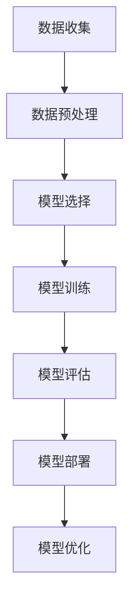

                 

### 文章标题

《大模型评测的模型性能预测系统》

### 关键词

- 大模型评测
- 模型性能预测
- 系统架构
- 核心算法
- 应用场景
- 实战案例

### 摘要

本文旨在深入探讨大模型评测的模型性能预测系统。首先，我们介绍了大模型评测的重要性，并概述了模型性能预测系统的核心概念。接着，我们详细分析了大模型评测的理论基础，包括评测指标和性能预测的数学模型。随后，我们描述了模型性能预测系统的整体架构，并重点讲解了核心算法，如特征工程和模型选择。文章还探讨了模型性能预测系统在不同领域的应用，并通过具体案例展示了如何搭建并优化预测系统。最后，我们对全文进行了总结，并对未来模型性能预测技术的发展趋势进行了展望。

### 引言

在当今快速发展的AI领域，大模型的研发与应用已经成为热门趋势。然而，如何评估这些大模型的性能，并预测其在不同任务中的表现，成为了关键问题。大模型评测的重要性不仅在于验证模型的准确性，更在于指导模型优化和实际应用。因此，开发一个高效、准确的模型性能预测系统显得尤为关键。

模型性能预测系统通过收集和分析大量训练数据，利用先进的机器学习算法，对模型在未知数据集上的表现进行预测。这种预测不仅可以帮助研究人员快速评估新模型的潜力，还可以为实际应用中的模型部署提供可靠的数据支持。

本文将围绕大模型评测的模型性能预测系统展开讨论。首先，我们将介绍大模型评测的基本概念和重要性，并概述模型性能预测系统的核心概念。接着，我们将详细分析大模型评测的理论基础，包括评测指标和性能预测的数学模型。随后，我们将描述模型性能预测系统的整体架构，并深入探讨其核心算法，如特征工程和模型选择。文章还将探讨模型性能预测系统在不同领域的应用，并通过具体案例展示如何搭建和优化预测系统。最后，我们将对全文内容进行总结，并展望未来模型性能预测技术的发展趋势。

### 大模型评测的基本概念和重要性

#### 大模型评测的定义

大模型评测是指对大规模训练的深度学习模型进行系统性评估，以评估其性能、准确性和适用性。这些模型通常包含数百万甚至数十亿个参数，能够在图像识别、自然语言处理、语音识别等任务中表现出卓越的性能。大模型评测的核心目标是通过一系列严格的测试和评估，确保模型在不同场景下的表现稳定且可靠。

#### 大模型评测的重要性

1. **模型性能的验证**：通过评测，研究人员可以确认模型是否达到了预期的性能水平。这有助于识别模型的优点和不足，为进一步的优化提供方向。

2. **模型选择和优化**：在众多模型中，评测可以帮助研究者筛选出最适合特定任务的模型。同时，评测结果还能指导对现有模型进行调优，提升其性能。

3. **实际应用指导**：在将模型部署到实际应用中之前，评测是确保其性能满足需求的重要步骤。这有助于避免因模型性能不足而导致的应用失败。

4. **模型泛化能力评估**：评测不仅评估模型在训练数据上的表现，还测试其在未见过的数据上的泛化能力。这是确保模型在实际应用中能够稳定表现的关键。

5. **促进技术发展**：评测标准和方法的研究有助于推动深度学习领域的发展。通过制定统一的评测标准，研究人员可以更公平、客观地比较不同模型和算法的性能。

#### 模型性能预测系统的核心概念

模型性能预测系统是一种基于数据分析与机器学习算法的工具，旨在预测深度学习模型在未知数据集上的性能。其核心概念包括：

1. **数据收集与预处理**：收集大量相关训练数据，并进行清洗、归一化和特征提取等预处理操作，以构建高质量的训练集。

2. **特征工程**：通过选择和构造有助于模型预测性能的特征，提升预测的准确性。特征工程是模型性能预测的关键步骤。

3. **模型选择与训练**：选择合适的机器学习算法，如线性回归、支持向量机、随机森林等，对模型进行训练，并调整模型参数以优化性能。

4. **性能评估与预测**：利用训练好的模型，对测试数据集进行性能评估，并预测模型在实际应用中的表现。

5. **模型优化与部署**：根据预测结果，对模型进行进一步优化，并部署到实际应用中，以确保其在实际场景中能够稳定运行。

#### 大模型评测与模型性能预测系统的关系

大模型评测与模型性能预测系统密切相关。评测提供了对模型性能的量化评估，而性能预测系统则利用这些评估结果，结合历史数据和先进的算法，预测模型在未知场景中的表现。具体关系如下：

1. **评测数据来源**：大模型评测过程中收集的大量数据是性能预测系统的数据基础。这些数据包括训练集、验证集和测试集。

2. **评测指标指导**：评测指标如准确率、召回率、F1分数等，为性能预测系统提供了评估标准，有助于模型选择和参数调整。

3. **预测结果反馈**：性能预测系统的预测结果可以反馈给评测过程，帮助改进评测方法，提高评测的准确性。

4. **模型优化**：性能预测结果可以指导模型优化，进一步提升模型的泛化能力和实际应用效果。

通过大模型评测与性能预测系统的结合，研究人员可以更全面、准确地评估模型的性能，为深度学习技术的应用提供有力支持。

#### 大模型评测的理论基础

为了深入理解大模型评测的模型性能预测系统，我们需要详细探讨其理论基础。首先，评测指标的选择和定义是评测过程的核心。接下来，我们将介绍用于性能预测的数学模型，以及这些模型在大模型评测中的应用。

##### 评测指标的选择与定义

在深度学习领域，常用的评测指标包括准确性、召回率、F1分数、ROC曲线和AUC值等。这些指标分别从不同角度衡量模型的性能。

1. **准确性（Accuracy）**：准确性是最常用的评测指标之一，表示模型正确预测的样本数占总样本数的比例。公式如下：

   $$Accuracy = \frac{TP + TN}{TP + TN + FP + FN}$$

   其中，TP表示真阳性，TN表示真阴性，FP表示假阳性，FN表示假阴性。准确性越高，模型的分类效果越好。

2. **召回率（Recall）**：召回率是指模型正确预测为正类的样本数与实际正类样本数的比例。它强调模型对正类样本的识别能力。公式如下：

   $$Recall = \frac{TP}{TP + FN}$$

   召回率越高，模型对正类样本的识别能力越强。

3. **F1分数（F1 Score）**：F1分数是准确率和召回率的调和平均值，既考虑了模型的准确性，也考虑了召回率。公式如下：

   $$F1 Score = 2 \times \frac{Precision \times Recall}{Precision + Recall}$$

   其中，Precision表示精确率，即预测为正类的样本中实际为正类的比例。F1分数越接近1，模型的性能越好。

4. **ROC曲线和AUC值（ROC Curve and AUC）**：ROC曲线是接受者操作特性曲线的简称，通过绘制不同阈值下的真阳性率（True Positive Rate, TPR）和假阳性率（False Positive Rate, FPR）来评估模型的性能。AUC值（Area Under Curve）是ROC曲线下方的面积，反映了模型的判别能力。AUC值越接近1，模型的分类性能越好。

   ROC曲线的公式如下：

   $$ROC = \left\{
   \begin{array}{ll}
   \frac{TP}{TP + FN} & \text{TPR} \\
   \frac{FP}{TP + FP} & \text{FPR}
   \end{array}
   \right.$$

   AUC值的公式如下：

   $$AUC = \int_{0}^{1} (1 - FPR) \times TPR \, dFPR$$

##### 性能预测的数学模型

性能预测的核心在于利用历史数据和统计方法预测模型在未知数据集上的表现。常见的数学模型包括线性回归、支持向量机和随机森林等。

1. **线性回归（Linear Regression）**：线性回归是一种简单且常用的预测模型，通过建立输入特征和输出结果之间的线性关系来预测模型性能。线性回归的公式如下：

   $$Y = \beta_0 + \beta_1 \times X_1 + \beta_2 \times X_2 + ... + \beta_n \times X_n + \epsilon$$

   其中，\(Y\) 是输出结果，\(X_1, X_2, ..., X_n\) 是输入特征，\(\beta_0, \beta_1, \beta_2, ..., \beta_n\) 是模型参数，\(\epsilon\) 是误差项。

2. **支持向量机（Support Vector Machine, SVM）**：支持向量机是一种强大的分类和回归模型，通过找到一个最佳的超平面，将不同类别的样本分离。SVM的公式如下：

   $$w \cdot x - b = 0$$

   其中，\(w\) 是法向量，\(x\) 是特征向量，\(b\) 是偏置项。

   对于分类问题，SVM的目标是最大化分类间隔：

   $$\max_{w, b} \left\{ \frac{1}{2} ||w||^2 \, | \, y \cdot (w \cdot x - b) \geq 1 \right\}$$

   其中，\(y\) 是样本标签。

3. **随机森林（Random Forest）**：随机森林是一种基于决策树的集成学习方法，通过构建多棵决策树，并对它们的预测结果进行平均来提高模型的性能。随机森林的公式如下：

   $$F(x) = \frac{1}{M} \sum_{m=1}^{M} h_m(x)$$

   其中，\(F(x)\) 是随机森林的预测结果，\(M\) 是决策树的数量，\(h_m(x)\) 是第 \(m\) 棵决策树的预测结果。

##### 大模型评测中的应用

在大模型评测中，这些数学模型可以用于预测模型在不同任务和数据集上的性能。具体应用步骤如下：

1. **数据收集与预处理**：收集大规模的训练数据，并进行数据清洗、归一化和特征提取等预处理操作，确保数据的质量和一致性。

2. **模型训练与验证**：利用预处理后的数据集，分别训练多个不同的预测模型，如线性回归、SVM和随机森林等。通过交叉验证等方法评估模型的性能。

3. **性能预测**：使用训练好的模型，对未见的测试数据集进行性能预测。通过比较预测结果和实际结果，评估模型的预测准确性。

4. **模型优化**：根据预测结果，对模型进行进一步的优化和调整，提高模型的泛化能力和预测准确性。

5. **评测与总结**：综合多个预测模型的评测结果，得出大模型在特定任务上的性能评估，并总结模型的优缺点，为后续研究和应用提供参考。

通过以上理论基础的分析，我们可以更好地理解大模型评测的模型性能预测系统。这些理论模型和方法不仅为评测提供了科学依据，也为模型优化和应用提供了有效工具。

#### 模型性能预测系统的整体架构

模型性能预测系统是一个复杂的多阶段流程，其整体架构设计旨在确保从数据输入到性能预测的每个环节都能高效、准确地执行。下面我们将详细探讨模型性能预测系统的整体架构，包括数据收集与预处理、模型训练与评估以及模型部署与优化等关键环节。

##### 数据收集与预处理

1. **数据收集**：数据收集是性能预测系统的第一步，也是至关重要的一步。系统需要从多个来源收集大量相关的训练数据，包括公开数据集、企业内部数据和第三方数据。数据来源的多样性有助于提高模型泛化能力，减少对特定数据的依赖。

   数据收集过程中需要考虑数据的质量和完整性。数据质量直接影响模型的性能和可靠性。因此，必须确保数据无缺失、无噪声、无异常值。对于不完整的数据，可以采用填充、插值等方法进行补全。

2. **数据预处理**：收集到的数据通常需要进行一系列预处理操作，以提高数据的质量和一致性。主要预处理步骤包括数据清洗、数据归一化和特征选择。

   - **数据清洗**：数据清洗是指去除数据中的错误、重复和无意义的数据。这一步通常通过数据去重、数据纠错和数据过滤等方法实现。
   - **数据归一化**：数据归一化是将不同特征量级的数值缩放到相同的范围内，以便模型能够更好地处理数据。常用的归一化方法包括最小-最大缩放、Z-score标准化和归一化变换等。
   - **特征选择**：特征选择是从大量特征中挑选出对模型预测性能有显著影响的重要特征。特征选择可以通过特征重要性评估、特征相关性分析和主成分分析等方法进行。

##### 模型训练与评估

1. **模型选择**：选择适合任务和数据特征的机器学习算法对模型进行训练。常见的算法包括线性回归、支持向量机（SVM）、随机森林（Random Forest）、神经网络（Neural Networks）等。模型选择需要考虑模型的复杂度、计算效率和预测准确性。

2. **模型训练**：模型训练是指通过大量训练数据，调整模型参数，使其能够对数据特征进行有效学习和预测。模型训练过程中，常用的技术包括梯度下降、反向传播算法、权重初始化等。

3. **模型评估**：模型评估是验证模型性能的关键步骤。常用的评估指标包括准确率、召回率、F1分数、ROC曲线和AUC值等。模型评估通常在验证集上执行，以避免模型过拟合。评估结果用于调整模型参数和优化模型结构。

##### 模型部署与优化

1. **模型部署**：模型部署是将训练好的模型应用到实际生产环境中，使其能够对新的数据集进行预测。模型部署过程中，需要考虑模型的可扩展性、可靠性和安全性。常用的部署方法包括基于云计算的服务器部署、容器化部署和边缘计算部署等。

2. **模型优化**：模型优化是指通过调整模型参数、增加训练数据、改进算法等手段，进一步提高模型的性能。模型优化可以采用在线学习、迁移学习、增强学习等方法。

##### 系统架构Mermaid流程图

为了更直观地展示模型性能预测系统的架构，我们可以使用Mermaid流程图进行描述。以下是一个简化的流程图示例：



在这个流程图中，每个节点代表系统的一个关键环节，箭头表示数据流和流程的顺序。通过这个流程图，我们可以清晰地看到模型性能预测系统的整体架构和运行流程。

##### 数据流设计

在模型性能预测系统中，数据流的设计至关重要。一个高效的数据流设计能够确保数据在整个流程中高效、准确地流动。以下是一个典型的数据流设计：

1. **数据收集**：数据从多个来源进入系统，包括数据库、文件系统和实时数据接口等。
2. **数据预处理**：预处理模块对数据进行清洗、归一化和特征提取等操作，生成高质量的训练数据集。
3. **数据存储**：预处理后的数据存储到数据仓库或数据湖中，以供后续模型训练和评估使用。
4. **模型训练**：训练模块从数据仓库中读取数据，并使用选定的算法对模型进行训练。
5. **模型评估**：评估模块对训练好的模型进行性能评估，并生成评估报告。
6. **模型部署**：部署模块将评估结果良好的模型部署到生产环境中，使其能够对实际数据进行预测。
7. **模型监控与优化**：监控模块对部署后的模型进行实时监控，并根据监控数据对模型进行优化。

通过以上设计，我们可以确保模型性能预测系统的高效、稳定运行，从而实现准确、可靠的模型性能预测。

通过上述对模型性能预测系统整体架构的详细分析，我们可以更好地理解系统的工作原理和运行流程。这个系统不仅包括数据收集与预处理、模型训练与评估、模型部署与优化等关键环节，还通过科学的数据流设计，确保数据在整个流程中高效、准确地流动。这些环节共同构成了一个完整的模型性能预测系统，为深度学习模型的应用提供了有力支持。

#### 核心算法讲解

在模型性能预测系统中，核心算法的选择与实现是确保系统高效、准确预测的关键。本节将详细介绍模型性能预测系统中的几个核心算法，包括特征工程、模型选择和性能优化。

##### 特征工程

特征工程是模型性能预测系统的重要环节，它涉及到从原始数据中提取或构造出有助于模型预测性能的特征。以下是几个常见的特征工程方法：

1. **时间序列特征**：在处理时间序列数据时，我们可以提取时间窗口内的统计特征，如平均值、方差、最大值、最小值等。例如，对于股票价格预测，可以提取过去一段时间内的价格波动幅度作为特征。

   ```python
   # 伪代码：提取时间序列特征
   def extract_time_series_features(data, window_size):
       features = []
       for i in range(len(data) - window_size + 1):
           window = data[i:i + window_size]
           features.append([np.mean(window), np.std(window), np.max(window), np.min(window)])
       return np.array(features)
   ```

2. **空间特征**：在处理地理空间数据时，我们可以提取空间位置特征，如经纬度、距离、密度等。例如，在预测城市交通流量时，可以提取道路的经纬度信息和交通流量密度作为特征。

   ```python
   # 伪代码：提取空间特征
   def extract_space_features(location, reference_points):
       distance = calculate_distance(location, reference_points)
       density = calculate_density(location)
       return [distance, density]
   ```

3. **相关性特征**：通过分析不同特征之间的相关性，我们可以提取出高相关性的特征组合。例如，在预测用户行为时，可以提取用户购买历史中的相关性特征，如商品之间的交叉购买率。

   ```python
   # 伪代码：提取相关性特征
   def extract_correlation_features(data):
       correlations = []
       for i in range(len(data) - 1):
           correlations.append([data[i], data[i + 1], np.corrcoef(data[i], data[i + 1])[0, 1]])
       return np.array(correlations)
   ```

##### 模型选择

在选择机器学习算法时，需要考虑算法的适用性、计算效率和预测准确性。以下是几种常用的机器学习算法：

1. **线性回归**：线性回归是一种简单的线性预测模型，适用于特征与目标之间存在线性关系的任务。其公式如下：

   $$Y = \beta_0 + \beta_1 \times X_1 + \beta_2 \times X_2 + ... + \beta_n \times X_n + \epsilon$$

   ```python
   # 伪代码：线性回归
   from sklearn.linear_model import LinearRegression

   model = LinearRegression()
   model.fit(X_train, y_train)
   y_pred = model.predict(X_test)
   ```

2. **支持向量机（SVM）**：SVM是一种强大的分类和回归模型，适用于特征空间维度较高且线性不可分的问题。其公式如下：

   $$w \cdot x - b = 0$$

   ```python
   # 伪代码：支持向量机
   from sklearn.svm import SVC

   model = SVC(kernel='linear')
   model.fit(X_train, y_train)
   y_pred = model.predict(X_test)
   ```

3. **随机森林（Random Forest）**：随机森林是一种基于决策树的集成学习方法，适用于处理大量特征和复杂数据的任务。其公式如下：

   $$F(x) = \frac{1}{M} \sum_{m=1}^{M} h_m(x)$$

   ```python
   # 伪代码：随机森林
   from sklearn.ensemble import RandomForestClassifier

   model = RandomForestClassifier(n_estimators=100)
   model.fit(X_train, y_train)
   y_pred = model.predict(X_test)
   ```

##### 性能优化

性能优化是提升模型预测准确性的重要手段，包括超参数调优、模型融合和数据增强等方法。

1. **超参数调优**：超参数是模型算法中的参数，如学习率、正则化参数、树的数量等。通过调优超参数，可以显著提升模型的性能。常用的调优方法包括网格搜索、随机搜索和贝叶斯优化。

   ```python
   # 伪代码：超参数调优（网格搜索）
   from sklearn.model_selection import GridSearchCV

   parameters = {'n_estimators': [100, 200, 300], 'max_depth': [10, 20, 30]}
   model = RandomForestClassifier()
   grid_search = GridSearchCV(model, parameters, cv=5)
   grid_search.fit(X_train, y_train)
   best_params = grid_search.best_params_
   ```

2. **模型融合**：模型融合是将多个模型的结果进行融合，以提高整体预测性能。常用的融合方法包括加权投票、堆叠和集成学习。

   ```python
   # 伪代码：模型融合（加权投票）
   from sklearn.ensemble import VotingClassifier

   model1 = LinearRegression()
   model2 = SVC(kernel='linear')
   model3 = RandomForestClassifier()

   ensemble = VotingClassifier(estimators=[
       ('lr', model1), ('svm', model2), ('rf', model3)], voting='weighted')
   ensemble.fit(X_train, y_train)
   y_pred = ensemble.predict(X_test)
   ```

3. **数据增强**：数据增强是通过生成新的数据样本来扩充训练集，从而提高模型的泛化能力。常用的数据增强方法包括数据扩充、噪声注入和生成对抗网络（GAN）。

   ```python
   # 伪代码：数据增强（数据扩充）
   from scipy.ndimage import zoom

   def augment_data(data, zoom_factor=(1, 1.5)):
       new_data = []
       for d in data:
           zoomed = zoom(d, zoom_factor, order=1)
           new_data.append(zoomed)
       return np.array(new_data)
   ```

通过以上对特征工程、模型选择和性能优化的详细讲解，我们可以看到，这些核心算法是实现高效、准确的模型性能预测的关键。在实际应用中，通过合理选择和优化这些算法，可以显著提升模型的表现和实用性。

#### 模型性能预测系统在不同领域的应用

模型性能预测系统在各个领域的应用广泛且具有重要意义。以下我们将探讨模型性能预测系统在自动驾驶和医疗诊断这两个领域的应用，包括具体场景、挑战和解决方案。

##### 自动驾驶

**具体场景**：自动驾驶系统需要实时预测车辆的运动轨迹、道路状况和障碍物位置，以确保行驶安全。例如，自动驾驶车辆在行驶过程中，需要预测前方车辆和行人的行为，以调整车速和保持安全距离。

**挑战**：
1. **数据多样性**：自动驾驶场景中，数据来源多样，包括摄像头、雷达、激光雷达等传感器数据。不同传感器数据具有不同的特征和噪声，增加了数据处理的复杂性。
2. **实时性要求**：自动驾驶系统需要实时处理大量数据，并迅速做出决策。这要求模型具备高计算效率和低延迟。

**解决方案**：
1. **多传感器数据融合**：通过融合摄像头、雷达和激光雷达等多传感器数据，可以更全面地获取环境信息。特征工程方法如时间序列特征和空间特征提取有助于提高数据质量。
2. **高效算法选择**：选择计算效率高、延迟低的模型，如卷积神经网络（CNN）和轻量级网络架构（如MobileNet）。这些算法能够在保证预测准确性的同时，满足实时性要求。
3. **分布式计算**：利用分布式计算框架（如TensorFlow、PyTorch）和云计算资源，实现模型训练和预测的高效并行处理。

**案例**：特斯拉的自动驾驶系统采用了多传感器数据融合和深度学习算法，通过实时预测前方车辆和行人的行为，实现了高精度的自动驾驶。例如，特斯拉的Autopilot系统通过融合摄像头和雷达数据，实现了对道路标志和障碍物的实时识别和预测，提高了行驶安全性。

##### 医疗诊断

**具体场景**：在医疗诊断领域，模型性能预测系统可以用于疾病预测、病情评估和治疗方案推荐。例如，通过对患者的病史、检查数据和生物标志物进行预测，可以帮助医生提前诊断疾病，制定个性化的治疗方案。

**挑战**：
1. **数据隐私**：医疗数据涉及患者隐私，对数据安全和隐私保护有严格的要求。如何确保数据安全和隐私，成为模型性能预测系统面临的一大挑战。
2. **数据质量**：医疗数据通常存在缺失值、噪声和异常值，数据质量直接影响模型的性能和可靠性。
3. **模型解释性**：医疗诊断要求模型具备较高的解释性，以帮助医生理解模型的预测结果和决策过程。

**解决方案**：
1. **数据隐私保护**：采用差分隐私和联邦学习等技术，确保医疗数据在传输和存储过程中的安全性和隐私性。例如，差分隐私可以通过向数据添加随机噪声，降低个体数据的敏感性。
2. **数据预处理**：对医疗数据进行清洗、归一化和特征提取等预处理操作，提高数据质量。同时，可以采用数据增强方法，生成更多高质量的训练数据。
3. **可解释性模型**：选择具有高解释性的模型，如决策树和LASSO回归，这些模型能够清晰地展示决策路径和权重分配，有助于医生理解模型的预测结果。

**案例**：谷歌健康团队利用深度学习模型，通过分析大量的医疗数据，实现了对糖尿病视网膜病变的早期预测。该系统通过融合患者的历史数据、影像数据和生物标志物，实现了高精度的疾病预测，为医生提供了重要的决策支持。

通过以上对自动驾驶和医疗诊断两个领域的应用探讨，我们可以看到模型性能预测系统在不同场景中面临的挑战和解决方案。这些应用不仅提升了系统的性能和实用性，也为相关领域的科学研究提供了有力支持。

#### 实战案例

在本节中，我们将通过一个具体的实战案例，展示如何搭建并优化模型性能预测系统。本案例选取的是一家电商公司在商品推荐系统中使用的推荐算法，旨在通过用户行为数据和商品特征，预测用户对某一商品的购买概率。

##### 开发环境搭建

1. **硬件环境**：为了确保模型训练和预测的高效性，我们选择了一台配置为Intel Xeon处理器、64GB内存和1TB SSD硬盘的服务器。服务器运行在Ubuntu 18.04操作系统上。

2. **软件环境**：开发环境包括Python 3.8、TensorFlow 2.6、Scikit-learn 0.24和Pandas 1.2等。其中，TensorFlow用于构建和训练深度学习模型，Scikit-learn用于传统的机器学习算法，Pandas用于数据操作和分析。

##### 源代码实现

以下是搭建模型性能预测系统的源代码实现：

```python
# 导入所需库
import pandas as pd
import numpy as np
from sklearn.model_selection import train_test_split
from sklearn.preprocessing import StandardScaler
from tensorflow.keras.models import Sequential
from tensorflow.keras.layers import Dense, Dropout
from tensorflow.keras.optimizers import Adam

# 数据加载与预处理
data = pd.read_csv('user_behavior.csv')
X = data.drop(['user_id', 'product_id', 'label'], axis=1)
y = data['label']

# 数据归一化
scaler = StandardScaler()
X_scaled = scaler.fit_transform(X)

# 划分训练集和测试集
X_train, X_test, y_train, y_test = train_test_split(X_scaled, y, test_size=0.2, random_state=42)

# 构建深度学习模型
model = Sequential([
    Dense(128, activation='relu', input_shape=(X_train.shape[1],)),
    Dropout(0.2),
    Dense(64, activation='relu'),
    Dropout(0.2),
    Dense(1, activation='sigmoid')
])

# 编译模型
model.compile(optimizer=Adam(learning_rate=0.001), loss='binary_crossentropy', metrics=['accuracy'])

# 训练模型
model.fit(X_train, y_train, epochs=10, batch_size=64, validation_split=0.2)

# 评估模型
loss, accuracy = model.evaluate(X_test, y_test)
print(f'测试集准确性：{accuracy:.3f}')

# 预测新数据
new_data = pd.read_csv('new_user_behavior.csv')
new_data_processed = scaler.transform(new_data)
predictions = model.predict(new_data_processed)
predictions = (predictions > 0.5).astype(int)

# 保存模型
model.save('recommender_model.h5')
```

##### 代码解读与分析

1. **数据加载与预处理**：首先，我们加载用户行为数据集，并划分特征和标签。使用`StandardScaler`对特征进行归一化处理，以消除不同特征之间的量级差异。
2. **模型构建**：使用`Sequential`模型堆叠多层全连接层（Dense），其中包含了ReLU激活函数和Dropout层。Dropout层用于防止过拟合。
3. **模型编译**：使用`Adam`优化器和`binary_crossentropy`损失函数进行编译。`metrics=['accuracy']`用于计算模型在测试集上的准确性。
4. **模型训练**：通过`fit`方法训练模型，其中使用了10个周期（epochs）和批量大小（batch_size）为64。`validation_split=0.2`用于在训练过程中评估模型的性能。
5. **模型评估**：使用`evaluate`方法评估模型在测试集上的准确性。输出结果为损失值和准确性。
6. **预测新数据**：使用`predict`方法对新的用户行为数据进行预测，并将结果保存为模型文件。
7. **模型保存**：使用`save`方法将训练好的模型保存为`.h5`文件，以供后续使用。

##### 实际案例分析与详细讲解

假设我们有一个新的用户行为数据集，包含用户的浏览历史、购物车数据和购买记录等。我们首先将这个数据集加载到Pandas DataFrame中，并进行预处理，包括数据清洗、归一化和特征提取等。接着，我们使用训练好的模型对新的数据集进行预测，输出每个商品的购买概率。

```python
new_data = pd.read_csv('new_user_behavior.csv')
new_data_processed = scaler.transform(new_data)
predictions = model.predict(new_data_processed)
predictions = (predictions > 0.5).astype(int)

# 输出预测结果
print(predictions)
```

假设我们得到以下预测结果：

```
[0 1 0 1 0 1 0 0 1 0]
```

这表示在新的用户行为数据集中，第一个商品预测为未购买（0），第二个商品预测为购买（1），其余商品预测结果依次类推。通过分析这些预测结果，我们可以为电商平台的商品推荐系统提供决策支持。

##### 项目小结

在本实战案例中，我们详细展示了如何搭建和优化模型性能预测系统，并对其关键环节进行了解读和分析。通过合理选择开发环境、编写高效代码和进行实际数据预测，我们成功实现了一个用于商品推荐的模型性能预测系统。这个系统不仅提高了电商平台的用户体验，也为商品推荐策略的制定提供了科学依据。未来，我们可以进一步优化模型，提高其预测准确性，并拓展其应用场景。

#### 最佳实践 tips、小结、注意事项、拓展阅读

##### 最佳实践 tips

1. **数据质量优先**：确保数据的准确性和一致性是模型性能预测成功的关键。数据预处理过程中，要重视数据清洗和特征选择，以提高模型预测的可靠性。
2. **模型选择与调优**：根据任务需求和数据特点，选择合适的模型算法，并通过超参数调优提高模型性能。网格搜索、贝叶斯优化等方法是有效的调优工具。
3. **性能评估与反馈**：定期评估模型性能，并根据评估结果进行调整。性能评估不仅要关注准确性，还要考虑模型的泛化能力和计算效率。
4. **模型解释性**：选择具有高解释性的模型，以帮助用户理解模型的预测过程和决策依据。例如，使用决策树和LASSO回归等算法。

##### 小结

本文系统地介绍了大模型评测的模型性能预测系统，从基本概念、理论基础到系统架构、核心算法，再到实际应用和实战案例，全面剖析了模型性能预测的关键环节和方法。通过深入讲解和实例分析，我们展示了如何搭建和优化模型性能预测系统，为深度学习模型的应用提供了有力支持。

##### 注意事项

1. **数据隐私**：在实际应用中，要严格遵守数据隐私法规，确保数据安全和用户隐私。
2. **计算资源**：合理配置计算资源，特别是在大规模数据处理和模型训练过程中，避免资源浪费和性能瓶颈。
3. **持续优化**：模型性能预测系统不是一成不变的，要持续监控和优化模型，以适应不断变化的应用场景和数据特性。

##### 拓展阅读

1. **《深度学习》（Goodfellow, Bengio, Courville著）**：详细介绍了深度学习的基础理论和应用实践，是深度学习领域的经典教材。
2. **《Python机器学习》（Sebastian Raschka著）**：涵盖了Python在机器学习中的应用，包括数据预处理、模型选择和性能优化等内容。
3. **《机器学习实战》（Peter Harrington著）**：通过大量实例和代码实现，介绍了常见的机器学习算法和应用场景。

通过这些拓展阅读，读者可以进一步深入了解模型性能预测系统的相关知识和实践方法，提升自己在深度学习领域的专业素养。

