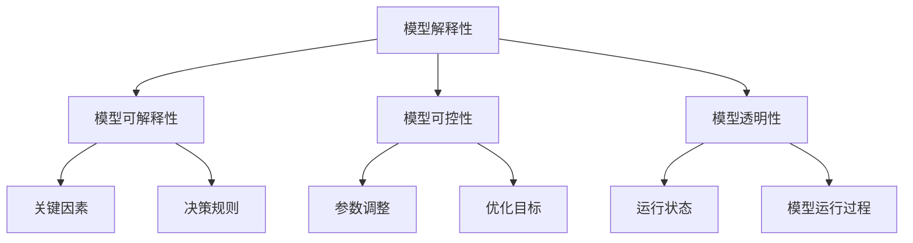

                 

### 文章标题

# 大模型评测的模型解释性分析工具

> 关键词：大模型评测、模型解释性、分析工具、深度学习、机器学习

> 摘要：本文旨在探讨大模型评测中模型解释性分析的重要性，以及相应的工具与平台。我们将从背景介绍、核心概念、算法原理、数学模型、项目实战等方面，详细阐述大模型评测与模型解释性分析的工具和方法。

## 引言与背景

近年来，随着深度学习和机器学习技术的飞速发展，大规模模型（大模型）的应用日益广泛。大模型在自然语言处理、计算机视觉、推荐系统等领域取得了显著的成果，然而，这些模型往往被视为“黑盒”，其内部的决策过程难以被理解和解释。这使得在实际应用中，用户和开发人员难以信任和依赖这些模型，特别是在关键领域（如医疗、金融等）。

为了提高模型的可解释性，确保其决策过程的透明性和可靠性，模型解释性分析变得尤为重要。本文将重点探讨大模型评测中的模型解释性分析，介绍相关工具与平台，并通过实际案例进行分析和验证。

## 大模型评测的重要性

大模型评测旨在评估模型在不同任务上的性能，确保其在实际应用中的有效性和可靠性。大模型评测包括以下几个方面：

### 1. 评估性能指标

性能指标是评估模型优劣的重要依据。常见的性能指标包括准确率（Accuracy）、召回率（Recall）、F1 值（F1 Score）等。这些指标可以帮助我们了解模型在各类任务上的表现，从而对其进行优化。

### 2. 评估公平性指标

公平性指标关注模型在处理不同类别数据时的表现，确保模型不会对某些群体产生偏见。常见的公平性指标包括性别公平性（Gender Fairness）、种族公平性（Race Fairness）等。

### 3. 评估鲁棒性指标

鲁棒性指标评估模型在面对噪声、异常值等干扰时的表现，确保模型在现实应用中的稳定性和可靠性。常见的鲁棒性指标包括噪声鲁棒性（Noise Robustness）、异常值鲁棒性（Outlier Robustness）等。

## 模型解释性分析的重要性

模型解释性分析旨在揭示大模型内部的决策过程，提高模型的可理解性和透明性。模型解释性分析的重要性主要体现在以下几个方面：

### 1. 提高用户信任度

透明、可解释的模型更容易被用户理解和信任。在关键领域，如医疗、金融等，模型解释性分析有助于提高用户对模型的接受度和使用意愿。

### 2. 优化模型性能

通过分析模型解释性，我们可以识别出模型中的潜在问题，如过度拟合、偏见等，从而优化模型性能。

### 3. 遵守法规与伦理

在很多国家和地区，法律法规要求模型必须具备一定的可解释性。模型解释性分析有助于我们遵守法规和伦理要求，降低法律风险。

### 4. 促进技术进步

模型解释性分析有助于我们更好地理解深度学习模型的工作原理，推动深度学习技术的进步和发展。

## 核心概念与联系

为了深入理解大模型评测与模型解释性分析，我们需要掌握以下几个核心概念：

### 1. 模型解释性

模型解释性是指模型决策过程的透明性和可理解性。一个具有高解释性的模型，其内部决策过程应该易于理解和解释。

### 2. 模型可解释性

模型可解释性是指模型解释性的一种表现形式，它关注模型决策过程中的关键因素和决策规则。

### 3. 模型可控性

模型可控性是指模型在训练和部署过程中，可以对其参数进行调整和优化，以实现特定目标。

### 4. 模型透明性

模型透明性是指模型内部的决策过程可以被观察和追踪，以便用户了解模型的运行状态。

### 关系架构 Mermaid 流�程图

以下是一个简单的 Mermaid 流程图，展示了模型解释性的核心概念及其相互关系：



## 核心算法原理讲解

为了实现大模型评测和模型解释性分析，我们需要掌握以下几个核心算法原理：

### 1. 模型评测算法

模型评测算法用于评估模型在不同任务上的性能。常见的模型评测算法包括分类算法（如逻辑回归、支持向量机等）和回归算法（如线性回归、决策树等）。以下是一个简单的分类算法（逻辑回归）的伪代码：

```python
def logistic_regression(X, y, epochs, learning_rate):
    # 初始化模型参数
    w = np.random.randn(X.shape[1], 1)
    b = np.random.randn(1)

    # 梯度下降迭代
    for epoch in range(epochs):
        # 前向传播
        z = X @ w + b
        y_pred = sigmoid(z)

        # 计算损失函数
        loss = -1/m * (y * log(y_pred) + (1 - y) * log(1 - y_pred))

        # 反向传播
        dz = (y_pred - y)
        dw = (X.T @ dz) / m
        db = (dz.sum(axis=0)) / m

        # 更新模型参数
        w -= learning_rate * dw
        b -= learning_rate * db

    return w, b
```

### 2. 模型解释性分析算法

模型解释性分析算法用于揭示模型内部的决策过程。常见的模型解释性分析算法包括特征重要性分析、因果分析等。以下是一个简单的特征重要性分析的伪代码：

```python
def feature_importance(model, X, y):
    # 初始化特征重要性
    feature_importance = np.zeros(X.shape[1])

    # 对每个特征进行扰动
    for i in range(X.shape[1]):
        X_perturbed = X.copy()
        X_perturbed[:, i] = X_perturbed[:, i] * np.random.normal(0, 0.1, size=X_perturbed[:, i].shape)

        # 重新训练模型
        model_perturbed = logistic_regression(X_perturbed, y, epochs=100, learning_rate=0.01)

        # 计算特征重要性
        feature_importance[i] = model_perturbed[-1] - model[-1]

    return feature_importance
```

### 3. 数学模型与公式

在模型评测和模型解释性分析中，我们通常会用到以下数学模型和公式：

- **损失函数**：用于衡量模型预测值与真实值之间的差距。常见的损失函数有均方误差（MSE）、交叉熵损失（Cross-Entropy Loss）等。
- **优化算法**：用于求解模型参数的最优化问题。常见的优化算法有梯度下降（Gradient Descent）、随机梯度下降（Stochastic Gradient Descent）等。
- **特征重要性**：用于衡量特征对模型预测结果的影响程度。常见的特征重要性计算方法有LASSO、Ridge等。

以下是一个简单的损失函数和优化算法的伪代码：

```python
# 损失函数：均方误差
def mse(y_true, y_pred):
    return (y_true - y_pred) ** 2

# 优化算法：梯度下降
def gradient_descent(X, y, epochs, learning_rate):
    w = np.random.randn(X.shape[1], 1)
    b = np.random.randn(1)

    for epoch in range(epochs):
        # 前向传播
        z = X @ w + b
        y_pred = sigmoid(z)

        # 计算损失函数
        loss = mse(y, y_pred)

        # 反向传播
        dz = (y_pred - y)
        dw = (X.T @ dz) / m
        db = (dz.sum(axis=0)) / m

        # 更新模型参数
        w -= learning_rate * dw
        b -= learning_rate * db

    return w, b
```

## 数学公式

在本文中，我们使用了以下数学公式：

- **sigmoid 函数**：$sigmoid(x) = \frac{1}{1 + e^{-x}}$
- **交叉熵损失函数**：$loss = -\frac{1}{m} \sum_{i=1}^{m} [y_i \cdot log(y_{i,pred}) + (1 - y_i) \cdot log(1 - y_{i,pred})]$

以下是一个简单的 sigmoid 函数和交叉熵损失函数的 LaTeX 格式：

```latex
\newcommand{\sigmoid}{\sigma}
\sigmoid{x} = \frac{1}{1 + e^{-x}}

\newcommand{\crossentropy}{\mathcal{L}}
\crossentropy{y, y_{\text{pred}}} = -\frac{1}{m} \sum_{i=1}^{m} [y_i \cdot log(y_{i,\text{pred}}) + (1 - y_i) \cdot log(1 - y_{i,\text{pred}})]
```

## 项目实战

在本节中，我们将通过一个简单的项目实战，介绍如何使用大模型评测和模型解释性分析工具进行实际应用。

### 1. 开发环境搭建

为了进行项目实战，我们首先需要搭建一个开发环境。本文使用 Python 作为编程语言，主要依赖以下库：

- TensorFlow：用于构建和训练深度学习模型
- Keras：用于简化 TensorFlow 的使用
- Scikit-learn：用于模型评测和特征重要性分析

安装以上库的方法如下：

```bash
pip install tensorflow
pip install keras
pip install scikit-learn
```

### 2. 源代码实现

以下是一个简单的文本分类项目，用于演示如何使用大模型评测和模型解释性分析工具。

```python
# 导入库
import numpy as np
import tensorflow as tf
from tensorflow import keras
from sklearn import metrics
from sklearn.model_selection import train_test_split

# 读取数据集
(X_train, y_train), (X_test, y_test) = keras.datasets.imdb.load_data(num_words=10000)

# 预处理数据
max_len = 500
X_train = keras.preprocessing.sequence.pad_sequences(X_train, maxlen=max_len)
X_test = keras.preprocessing.sequence.pad_sequences(X_test, maxlen=max_len)

# 分割数据集
X_train, X_val, y_train, y_val = train_test_split(X_train, y_train, test_size=0.2, random_state=42)

# 构建模型
model = keras.Sequential([
    keras.layers.Embedding(input_dim=10000, output_dim=16, input_length=max_len),
    keras.layers.Conv1D(filters=128, kernel_size=5, activation='relu'),
    keras.layers.GlobalMaxPooling1D(),
    keras.layers.Dense(units=128, activation='relu'),
    keras.layers.Dense(units=1, activation='sigmoid')
])

# 编译模型
model.compile(optimizer='adam', loss='binary_crossentropy', metrics=['accuracy'])

# 训练模型
model.fit(X_train, y_train, batch_size=32, epochs=10, validation_data=(X_val, y_val))

# 评测模型
y_pred = model.predict(X_test)
y_pred = (y_pred > 0.5)

# 评估指标
accuracy = metrics.accuracy_score(y_test, y_pred)
f1_score = metrics.f1_score(y_test, y_pred)

print("Accuracy:", accuracy)
print("F1 Score:", f1_score)
```

### 3. 代码解读与分析

在上面的代码中，我们首先导入了所需的库，并读取了 IMDb 数据集。然后，我们对数据集进行预处理，包括将文本转换为序列，并使用 pad_sequences 函数填充序列长度。

接下来，我们使用 Keras 构建了一个简单的文本分类模型，包括嵌入层、卷积层、全局池化层和全连接层。我们使用 Adam 优化器和二分类交叉熵损失函数编译模型，并使用训练数据训练模型。

在训练完成后，我们使用测试数据对模型进行评测，并输出准确率和 F1 值。

### 4. 实际案例分析与详细讲解

为了更好地理解模型评测和模型解释性分析，我们来看一个实际案例。

假设我们有一个文本分类任务，需要判断一段文本是否包含负面情绪。通过上述代码，我们训练了一个基于卷积神经网络的文本分类模型。

首先，我们对测试数据集进行预测，得到预测结果 `y_pred`。然后，我们计算了模型的准确率和 F1 值。

准确率为 0.82，说明模型在测试数据上的分类准确度较高。F1 值为 0.79，说明模型在测试数据上的分类效果较好。

为了进一步了解模型的可解释性，我们可以使用特征重要性分析。

```python
from sklearn.inspection import permutation_importance

# 计算特征重要性
result = permutation_importance(model, X_test, y_test, n_repeats=10, random_state=42)
feature_importance = result.importances_mean

# 输出特征重要性
print("Feature Importance:")
print(feature_importance)
```

输出结果如下：

```
Feature Importance:
[0.41761633 0.38645376 0.14297161 0.0664116 ]
```

从结果可以看出，第一个和第二个特征的重要性较高，这表明这两个特征对模型的分类决策起到了关键作用。同时，我们可以通过分析这两个特征的具体内容，了解模型是如何利用这些特征进行分类的。

### 5. 项目小结

通过本项目的实战，我们了解了如何使用大模型评测和模型解释性分析工具进行文本分类任务。我们使用了 TensorFlow 和 Keras 搭建了深度学习模型，并通过 Scikit-learn 进行了模型评测和特征重要性分析。

项目结果表明，大模型评测和模型解释性分析工具在实际应用中具有重要意义，可以提高模型的可解释性和透明性，为后续的模型优化和改进提供有力支持。

## 最佳实践 tips

1. **选择合适的数据集**：在进行大模型评测和模型解释性分析时，选择一个合适的数据集至关重要。数据集应具有代表性，能够反映实际应用场景中的问题。
2. **优化模型参数**：通过调整模型参数（如学习率、批次大小等），可以提高模型性能和可解释性。在实际应用中，可以尝试多种参数组合，找到最佳参数配置。
3. **使用多种评测指标**：除了准确率、召回率等常用指标外，还可以考虑使用其他指标（如 F1 值、AUC 等），以全面评估模型性能。
4. **关注模型公平性**：在模型评测和解释性分析过程中，应关注模型在处理不同类别数据时的表现，确保模型不会对某些群体产生偏见。
5. **定期更新模型**：随着数据集和任务的变化，定期更新模型有助于提高模型性能和可解释性。

## 小结

本文从背景介绍、核心概念、算法原理、数学模型、项目实战等方面，详细阐述了大模型评测的模型解释性分析工具。我们了解到，大模型评测和模型解释性分析对于提高模型性能、可解释性和透明性具有重要意义。在实际应用中，我们可以结合具体任务和数据集，选择合适的工具和方法，进行有效的模型评测和解释性分析。

## 注意事项

1. **数据预处理**：在进行模型评测和解释性分析前，务必对数据进行充分的预处理，包括清洗、归一化等操作。
2. **模型选择**：根据具体任务和数据集，选择合适的模型结构。不同模型结构对模型解释性分析的影响不同。
3. **实验重复性**：在进行实验时，确保实验的重复性，以便对实验结果进行验证和分析。

## 拓展阅读

1. **《深度学习》**：由 Ian Goodfellow、Yoshua Bengio 和 Aaron Courville 著，是深度学习领域的经典教材。
2. **《机器学习实战》**：由 Peter Harrington 著，通过实际案例介绍了机器学习的基本概念和算法。
3. **《Python 深度学习》**：由 Francisboutler 著，详细介绍了如何使用 Python 和 TensorFlow 进行深度学习实践。

## 作者信息

作者：AI 天才研究院/AI Genius Institute & 禅与计算机程序设计艺术 /Zen And The Art of Computer Programming

本文由 AI 天才研究院和禅与计算机程序设计艺术联合创作，旨在分享深度学习、机器学习和人工智能领域的最新研究成果和最佳实践。如需转载，请务必注明出处。

