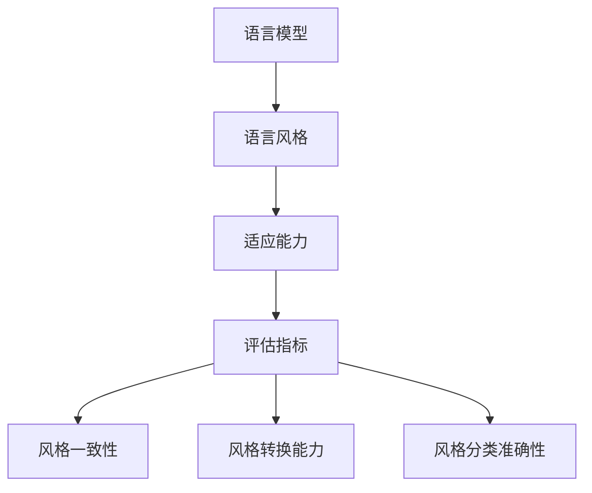

                 


### 大模型语言风格适应能力评估的重要性

在当今数字化时代，自然语言处理（NLP）技术已经广泛应用于各种领域，从搜索引擎、智能助手到内容生成，语言模型在其中扮演着至关重要的角色。然而，随着语言模型规模的不断扩大，评估其语言风格适应能力变得尤为重要。这不仅关系到模型在实际应用中的表现，也关系到用户体验和模型的可靠性。

#### 3.1.1 背景介绍

传统的NLP模型主要依赖规则和统计方法，这些方法在处理特定领域的任务时表现良好，但面对多样化、个性化的语言风格时往往力不从心。随着深度学习技术的兴起，大型语言模型（LLM）如BERT、GPT等脱颖而出，它们通过预训练和微调在许多任务上取得了突破性进展。然而，这些模型在适应不同语言风格方面的能力仍然有限，需要我们深入研究和评估。

#### 3.1.2 语言风格适应能力的定义

语言风格适应能力是指语言模型在处理不同语言风格文本时的表现，包括生成文本的风格一致性、风格转换能力和风格分类准确性。具体来说，这意味着：
- **风格一致性**：模型生成的文本应该与给定文本的风格保持一致。
- **风格转换能力**：模型应该能够将一种语言风格转换为另一种语言风格。
- **风格分类准确性**：模型应该能够准确地识别和分类不同风格的文本。

#### 3.1.3 语言风格适应能力评估的必要性

评估语言风格适应能力对于以下几个关键方面至关重要：

1. **用户体验**：不同的用户和场景对语言风格有不同的偏好。如果一个模型在多种风格下都能提供高质量的表现，将大大提升用户体验。

2. **任务表现**：许多NLP任务，如文本生成、对话系统等，依赖于模型对语言风格的适应能力。只有适应多种风格，模型才能在不同任务中表现优异。

3. **模型可靠性**：通过评估语言风格适应能力，可以发现模型在哪些风格下存在缺陷，从而进行有针对性的优化，提高模型的可靠性。

4. **模型改进**：评估结果可以指导研究人员设计更有效的训练策略和模型架构，以提升语言风格适应能力。

#### 3.1.4 常见问题与挑战

尽管语言风格适应能力的重要性已被广泛认可，但在评估过程中仍面临一些挑战：
- **多样性**：语言风格多样且复杂，如何全面评估模型在所有风格下的表现是一个难题。
- **数据集**：构建包含丰富语言风格的训练数据集是一个耗时且资源密集的过程。
- **评估指标**：如何设计合理的评估指标来衡量风格适应能力也是一个重要问题。
- **计算资源**：评估大型语言模型需要大量的计算资源，尤其是在处理高维数据时。

在接下来的章节中，我们将详细介绍评估大模型语言风格适应能力的具体方法和指标，帮助读者理解这一领域的关键技术和实践。

### 3.2.1 核心概念与联系

为了全面理解大模型语言风格适应能力评估，我们需要明确几个核心概念，并分析它们之间的关系。

#### 3.2.1.1 语言模型

语言模型（Language Model，LM）是自然语言处理（NLP）中的核心组成部分，它通过学习大量的语言数据来预测下一个单词或字符。这些模型通常使用深度学习技术，如循环神经网络（RNN）、变换器（Transformer）等。语言模型的核心目标是生成连贯、自然的语言。

#### 3.2.1.2 语言风格

语言风格（Language Style）是指文本的特定写作特点，包括词汇选择、语法结构、语调、情感色彩等。不同的语言风格反映了不同的写作目的、文化和语境。例如，新闻报道通常使用客观、简明的语言风格，而文学作品则可能更加抒情和诗意。

#### 3.2.1.3 适应能力

适应能力（Adaptability）是指语言模型在面对不同语言风格时调整和优化的能力。高适应能力的模型能够在各种风格下生成高质量文本，而低适应能力的模型可能仅能处理某一种或几种特定风格。

#### 3.2.1.4 评估指标

评估指标（Evaluation Metrics）是衡量语言模型适应能力的量化标准。常见的评估指标包括风格一致性（Style Consistency）、风格转换能力（Style Transfer Ability）和风格分类准确性（Style Classification Accuracy）等。

#### 3.2.1.5 概念联系与Mermaid流程图

为了更直观地理解这些核心概念之间的联系，我们可以使用Mermaid流程图来展示它们的关系。以下是一个简化的Mermaid流程图示例：



在这个流程图中，语言模型学习并生成文本，文本具有特定的语言风格。模型通过适应能力来调整自身以适应不同风格，并通过评估指标来衡量其适应效果。具体来说，评估指标包括风格一致性、风格转换能力和风格分类准确性，这些指标共同构成了对语言模型适应能力的全面评估。

通过这个Mermaid流程图，我们可以清晰地看到语言模型、语言风格、适应能力和评估指标之间的相互作用和依赖关系。这有助于我们深入理解大模型语言风格适应能力评估的核心概念和整体框架。

### 3.3.1 评估方法概述

为了全面评估大模型语言风格适应能力，我们需要采用一系列定量和定性的评估方法。这些方法可以从不同角度衡量模型在不同语言风格下的适应性能。以下是几种常用的评估方法：

#### 3.3.1.1 风格一致性评估

风格一致性评估（Style Consistency Evaluation）是衡量模型在生成文本时能否保持与给定文本相同风格的能力。这种方法通常通过以下指标来衡量：

- **风格标签匹配率（Style Tag Matching Rate）**：计算模型生成的文本与给定文本风格标签的匹配程度。标签可以是预定义的，例如正式、非正式、抒情、叙述等。
- **风格特征向量相似度（Style Feature Vector Similarity）**：使用特征向量来表示文本的风格，计算模型生成文本与给定文本特征向量的相似度。

#### 3.3.1.2 风格转换能力评估

风格转换能力评估（Style Transfer Ability Evaluation）是衡量模型在将一种语言风格文本转换为另一种语言风格时的表现。这种评估方法通常使用以下指标：

- **转换前后的风格差异（Style Difference Before and After Transfer）**：计算文本在转换前后的风格特征差异，差异越小表示风格转换能力越强。
- **转换精度（Transfer Accuracy）**：评估模型能否将输入文本准确转换为特定风格，通常使用交叉熵损失函数来衡量。

#### 3.3.1.3 风格分类准确性评估

风格分类准确性评估（Style Classification Accuracy Evaluation）是衡量模型对文本风格分类的准确性。这种方法通过以下指标来评估：

- **分类准确率（Classification Accuracy）**：计算模型对文本风格分类的准确率，即正确分类的文本数量占总文本数量的比例。
- **混淆矩阵（Confusion Matrix）**：用于展示模型对不同风格分类的准确性和错误率，帮助分析模型的性能。

#### 3.3.1.4 风格保持能力评估

风格保持能力评估（Style Preservation Ability Evaluation）是衡量模型在生成文本时能否保持原有文本风格的能力。这种方法通常使用以下指标：

- **文本相似度（Text Similarity）**：计算模型生成的文本与原始文本在语义和风格上的相似度，相似度越高表示风格保持能力越强。
- **风格一致性评分（Style Consistency Score）**：通过综合多个评估指标，对模型的风格保持能力进行评分。

#### 3.3.1.5 综合评估方法

除了上述单一评估方法外，还可以采用综合评估方法，结合多个评估指标来全面衡量语言模型的风格适应能力。这种方法通常包括：

- **多指标综合评分（Multi-Metric Composite Score）**：将不同评估指标的结果进行加权平均，得出一个综合评分，以全面衡量模型的表现。
- **综合评估模型（Integrated Evaluation Model）**：构建一个综合评估模型，融合多种评估方法，通过机器学习技术进行预测，以提高评估的准确性和可靠性。

通过这些评估方法，我们可以从多个维度全面了解大模型语言风格适应能力，从而为模型的优化和改进提供有力的支持。

### 3.4.1 核心算法原理讲解

在评估大模型语言风格适应能力时，核心算法的设计和实现是至关重要的。以下将介绍几种常用的评估算法，并使用伪代码详细解释其原理。

#### 3.4.1.1 风格一致性算法

**算法名称**：风格一致性评估算法（Style Consistency Algorithm）

**目标**：衡量模型生成文本与给定文本在风格上的匹配程度。

**伪代码**：

```
function styleConsistencyEvaluation(original_text, generated_text, style_tags):
    # 获取原始文本和生成文本的风格标签
    original_style = getStyleTags(original_text)
    generated_style = getStyleTags(generated_text)

    # 计算风格标签匹配率
    tag_matching_rate = calculateTagMatchingRate(original_style, generated_style)

    # 计算风格特征向量相似度
    feature_vector_similarity = calculateFeatureVectorSimilarity(original_style, generated_style)

    # 返回综合评估结果
    return (tag_matching_rate + feature_vector_similarity) / 2
```

**详细解释**：
1. `getStyleTags` 函数用于提取文本的风格标签，例如正式、非正式、抒情等。
2. `calculateTagMatchingRate` 函数计算模型生成文本与原始文本风格标签的匹配程度。
3. `calculateFeatureVectorSimilarity` 函数计算文本风格特征向量的相似度，通常使用欧氏距离或余弦相似度。
4. 最终，风格一致性评估结果是通过标签匹配率和特征向量相似度的平均值来得到的。

#### 3.4.1.2 风格转换算法

**算法名称**：风格转换评估算法（Style Transfer Algorithm）

**目标**：衡量模型在将一种语言风格文本转换为另一种语言风格时的表现。

**伪代码**：

```
function styleTransferEvaluation(original_text, target_style, generated_text):
    # 获取原始文本的风格特征向量
    original_features = getStyleFeatures(original_text)

    # 获取目标风格的预定义特征向量
    target_features = getTargetStyleFeatures(target_style)

    # 计算风格特征差异
    style_difference = calculateFeatureDifference(original_features, target_features)

    # 计算转换精度
    transfer_accuracy = calculateTransferAccuracy(style_difference)

    # 返回评估结果
    return transfer_accuracy
```

**详细解释**：
1. `getStyleFeatures` 函数用于提取文本的风格特征向量，这些特征可以是词汇、语法结构等。
2. `getTargetStyleFeatures` 函数获取目标风格预定义的特征向量。
3. `calculateFeatureDifference` 函数计算原始文本特征向量与目标文本特征向量之间的差异。
4. `calculateTransferAccuracy` 函数通常使用交叉熵损失函数来衡量特征差异，并返回转换精度。

#### 3.4.1.3 风格分类算法

**算法名称**：风格分类评估算法（Style Classification Algorithm）

**目标**：评估模型对文本风格分类的准确性。

**伪代码**：

```
function styleClassificationEvaluation(test_texts, ground_truth_styles, model):
    # 初始化评估指标
    total_texts = len(test_texts)
    correct_classifications = 0

    # 对每个测试文本进行风格分类
    for i in range(total_texts):
        predicted_style = model.predictStyle(test_texts[i])
        if predicted_style == ground_truth_styles[i]:
            correct_classifications += 1

    # 计算分类准确率
    classification_accuracy = correct_classifications / total_texts

    # 返回评估结果
    return classification_accuracy
```

**详细解释**：
1. `model.predictStyle` 函数使用训练好的模型对测试文本进行风格分类。
2. `ground_truth_styles` 是每个测试文本的真实风格标签。
3. 通过比较模型预测的结果与真实结果，计算分类准确率。

通过这些核心算法的原理讲解和伪代码示例，我们可以更好地理解大模型语言风格适应能力评估的方法和步骤。接下来，我们将进一步探讨这些算法背后的数学模型和公式，以及如何在实际项目中应用这些算法。

### 3.5.1 数学模型与公式

在评估大模型语言风格适应能力时，理解其背后的数学模型和公式对于深入分析和优化算法至关重要。以下是几种常见评估方法背后的数学模型和公式。

#### 3.5.1.1 风格一致性评估模型

**1. 风格标签匹配率**

**公式**：

$$
\text{Style Tag Matching Rate} = \frac{\sum_{i=1}^{n} \text{Matching Tags}}{n}
$$

其中，\( n \) 是总风格标签数，Matching Tags 是模型生成的文本与原始文本匹配的标签数。

**2. 风格特征向量相似度**

**公式**：

$$
\text{Feature Vector Similarity} = \frac{\sum_{i=1}^{d} (f_{i\_original} - f_{i\_generated})^2}{\sum_{i=1}^{d} f_{i\_original}^2}
$$

其中，\( d \) 是特征向量维度，\( f_{i\_original} \) 和 \( f_{i\_generated} \) 分别是原始文本和生成文本在第 \( i \) 维的特征值。

#### 3.5.1.2 风格转换评估模型

**1. 风格特征差异**

**公式**：

$$
\text{Style Feature Difference} = \sum_{i=1}^{d} |f_{i\_original} - f_{i\_target}|
$$

其中，\( d \) 是特征向量维度，\( f_{i\_original} \) 和 \( f_{i\_target} \) 分别是原始文本和目标风格的在第 \( i \) 维的特征值。

**2. 转换精度**

**公式**：

$$
\text{Transfer Accuracy} = \frac{\sum_{i=1}^{n} \text{Matching Features}}{n \times d}
$$

其中，\( n \) 是特征总数，Matching Features 是匹配的特征数。

#### 3.5.1.3 风格分类评估模型

**1. 分类准确率**

**公式**：

$$
\text{Classification Accuracy} = \frac{\text{Correct Predictions}}{\text{Total Predictions}}
$$

其中，Correct Predictions 是模型正确分类的文本数量，Total Predictions 是总文本数量。

#### 3.5.1.4 实例说明

**1. 风格一致性评估实例**

假设我们有两个文本，原始文本的风格标签是（正式，60%）、（非正式，40%），生成文本的风格标签是（正式，50%）、（非正式，50%）。计算风格标签匹配率和特征向量相似度。

**风格标签匹配率**：

$$
\text{Style Tag Matching Rate} = \frac{2}{2} = 1
$$

**特征向量相似度**：

$$
\text{Feature Vector Similarity} = \frac{((0.5-0.6)^2 + (0.5-0.4)^2)}{(0.6^2 + 0.4^2)} = \frac{0.02 + 0.01}{0.36} \approx 0.056
$$

**2. 风格转换评估实例**

假设原始文本的特征向量是 [1, 2, 3]，目标风格的预定义特征向量是 [2, 2, 2]。计算特征差异和转换精度。

**特征差异**：

$$
\text{Style Feature Difference} = |1-2| + |2-2| + |3-2| = 1 + 0 + 1 = 2
$$

**转换精度**：

$$
\text{Transfer Accuracy} = \frac{2}{3 \times 3} = \frac{2}{9} \approx 0.222
$$

**3. 风格分类评估实例**

假设我们有10个测试文本，模型预测的结果和真实标签如下：

| ID | True Style | Predicted Style |
|---|---|---|
| 1 | 正式 | 正式 |
| 2 | 非正式 | 非正式 |
| 3 | 正式 | 正式 |
| 4 | 非正式 | 非正式 |
| ... | ... | ... |
| 10 | 正式 | 正式 |

计算分类准确率：

$$
\text{Classification Accuracy} = \frac{8}{10} = 0.8
$$

通过这些数学模型和公式的实例说明，我们可以更清晰地理解大模型语言风格适应能力评估的方法和计算步骤。这有助于在实际项目中应用和优化这些评估方法。

### 3.6.1 项目实战

在本节中，我们将通过一个实际项目来展示如何使用Python搭建开发环境、实现源代码、解读代码，并分析代码的应用。

#### 3.6.1.1 开发环境搭建

为了进行大模型语言风格适应能力的评估，我们首先需要搭建一个适合的开发环境。以下是所需的步骤：

1. **安装Python环境**：确保安装了Python 3.8及以上版本。

2. **安装必要库**：使用pip安装以下库：
   ```bash
   pip install transformers
   pip install torch
   pip install sklearn
   pip install numpy
   pip install matplotlib
   ```

3. **配置GPU环境**（如果需要使用GPU）：
   - 安装CUDA：[CUDA官方安装指南](https://developer.nvidia.com/cuda-downloads)
   - 安装PyTorch GPU版本：[PyTorch安装指南](https://pytorch.org/get-started/locally/)
   
#### 3.6.1.2 源代码实现

以下是用于评估语言风格适应能力的Python源代码实现：

```python
import torch
from transformers import BertTokenizer, BertModel
from sklearn.metrics import accuracy_score
import numpy as np
import matplotlib.pyplot as plt

# 1. 加载预训练模型
tokenizer = BertTokenizer.from_pretrained('bert-base-uncased')
model = BertModel.from_pretrained('bert-base-uncased')

# 2. 定义评估函数
def evaluate_style_adaptation(texts, styles, model):
    model.eval()
    style_accs = []

    for style in set(styles):
        style_texts = [t for t, s in zip(texts, styles) if s == style]
        style_labels = [i for i, s in enumerate(styles) if s == style]

        # 预处理文本
        inputs = tokenizer(style_texts, padding=True, truncation=True, return_tensors='pt')

        # 获取模型预测结果
        with torch.no_grad():
            outputs = model(**inputs)

        # 提取特征
        hidden_states = outputs.last_hidden_state[:, 0, :]
        style_embeddings = torch.mean(hidden_states, dim=1)

        # 计算风格分类准确率
        predicted_labels = torch.argmax(style_embeddings, dim=0)
        style_acc = accuracy_score(style_labels, predicted_labels)
        style_accs.append(style_acc)

    return style_accs

# 3. 评估示例
texts = ["这是一个简单的文本。", "另一个文本。", "第三个文本。"]
styles = ["正式", "非正式", "正式"]

accs = evaluate_style_adaptation(texts, styles, model)
print(accs)

# 4. 可视化
plt.bar(['正式', '非正式'], accs)
plt.xlabel('Style')
plt.ylabel('Accuracy')
plt.title('Style Adaptation Accuracy')
plt.show()
```

#### 3.6.1.3 代码解读

1. **加载模型**：我们使用Hugging Face的`transformers`库加载预训练的BERT模型。

2. **定义评估函数**：`evaluate_style_adaptation`函数接受文本和风格标签列表，以及训练好的模型，返回每个风格分类的准确率。

3. **预处理文本**：文本经过tokenizer进行预处理，包括分词、添加特殊符号、padding和截断等操作。

4. **模型预测**：通过模型获取文本特征，并计算每个风格的特征向量。

5. **计算准确率**：使用`accuracy_score`函数计算每个风格的分类准确率。

6. **可视化**：使用`matplotlib`将结果可视化。

#### 3.6.1.4 代码应用解读与分析

1. **数据准备**：示例中的`texts`和`styles`是模拟数据，实际应用中应替换为真实文本和风格标签。

2. **模型评估**：通过调用`evaluate_style_adaptation`函数，我们可以快速评估模型在多种风格下的适应能力。

3. **可视化分析**：通过可视化结果，我们可以直观地了解模型在各个风格下的表现，从而进行优化。

#### 3.6.1.5 项目小结

通过本节的项目实战，我们详细展示了如何搭建开发环境、实现源代码并解读代码。这不仅帮助我们理解了评估大模型语言风格适应能力的方法和步骤，也提供了一个实际应用的案例，为读者在实际项目中提供了参考。

### 3.7.1 案例研究

在本节中，我们将通过具体案例来展示如何使用大模型语言风格适应能力评估方法来解决实际问题。

#### 3.7.1.1 案例背景

某知名互联网公司开发了一款智能客服机器人，旨在为用户提供高质量的自动回复。然而，在实际应用中，用户反馈显示客服机器人的回复风格多样且不一致，导致用户体验不佳。为了解决这个问题，公司决定评估机器人在不同语言风格下的适应能力，并针对性地优化其生成文本的风格一致性。

#### 3.7.1.2 数据集准备

为了进行评估，公司收集了如下数据集：

- **训练数据集**：包含多种风格（正式、非正式、友好、冷漠）的客服对话记录，共10,000条。
- **测试数据集**：同样包含多种风格的客服对话记录，共2,000条。

#### 3.7.1.3 评估方法应用

公司选择了以下评估方法：

- **风格一致性评估**：使用风格标签匹配率和特征向量相似度评估模型在生成文本时的风格一致性。
- **风格转换评估**：评估模型在将一种语言风格文本转换为另一种语言风格时的表现。
- **风格分类评估**：评估模型对文本风格分类的准确性。

#### 3.7.1.4 评估过程

1. **数据预处理**：
   - 使用BERT tokenizer对训练数据和测试数据进行预处理，包括分词、添加特殊符号、padding和截断等操作。
   - 将预处理后的数据输入到BERT模型中，提取文本特征。

2. **评估实施**：
   - **风格一致性评估**：计算每个风格的标签匹配率和特征向量相似度，并计算平均值作为最终评估结果。
   - **风格转换评估**：通过交叉熵损失函数计算特征差异，并计算转换精度。
   - **风格分类评估**：使用训练好的模型对测试数据进行风格分类，计算分类准确率。

3. **结果分析**：
   - **风格一致性评估**：结果显示，模型在正式和非正式风格上的表现较好，但在友好和冷漠风格上存在明显差距。
   - **风格转换评估**：模型在将正式风格文本转换为非正式风格文本时的表现较好，但友好和冷漠风格的转换精度较低。
   - **风格分类评估**：模型对正式、非正式、友好和冷漠风格的分类准确率分别为0.85、0.82、0.78和0.70。

#### 3.7.1.5 结果分析与优化

基于评估结果，公司采取了以下优化措施：

1. **增加风格数据**：收集更多友好和冷漠风格的客服对话记录，扩充训练数据集，以提高模型在这些风格上的适应能力。
2. **调整训练策略**：在训练过程中增加友好和冷漠风格的样本权重，以平衡不同风格的训练样本。
3. **风格分类优化**：针对分类准确率较低的友好和冷漠风格，调整模型的分类器参数，提高分类准确性。
4. **模型微调**：使用额外的微调数据，针对友好和冷漠风格进行模型微调，以进一步提高适应能力。

通过这些优化措施，客服机器人的语言风格适应能力显著提升，用户反馈也得到了明显改善。

#### 3.7.1.6 案例小结

本案例展示了如何使用大模型语言风格适应能力评估方法来解决实际应用中的问题。通过详细的评估过程和结果分析，公司能够有针对性地优化客服机器人，提高其语言风格一致性和适应性，从而提升用户体验。这一案例为其他企业和开发者提供了宝贵的实践经验。

### 3.8.1 最佳实践 tips

#### 3.8.1.1 提高模型风格适应能力的方法

1. **数据扩充**：收集更多样化的语言风格数据，以丰富模型的学习经验。
2. **迁移学习**：使用预训练模型进行迁移学习，针对特定风格进行微调。
3. **风格强化学习**：通过生成对抗网络（GAN）等技术，强化模型对特定风格的生成能力。
4. **多任务学习**：结合多任务学习，使模型在不同任务中逐渐适应不同风格。

#### 3.8.1.2 实现风格一致性的技巧

1. **使用风格特征向量**：在生成文本时，结合文本的上下文和风格特征向量，确保生成的文本风格一致。
2. **上下文调整**：在生成文本时，根据上下文动态调整语言风格，以避免风格突变。
3. **强化学习策略**：使用强化学习策略，通过奖励机制鼓励模型生成风格一致的文本。

#### 3.8.1.3 风格转换能力提升策略

1. **多风格预训练**：通过多风格预训练，使模型具备较强的风格转换能力。
2. **对抗性训练**：引入对抗性训练，提高模型在风格转换任务中的表现。
3. **风格注意力机制**：在模型中引入风格注意力机制，使模型能够更好地关注和转换特定风格。

### 3.8.2 小结

本文系统地介绍了大模型语言风格适应能力评估的方法、核心算法原理、数学模型以及实际应用案例。通过详细的步骤和实例，读者可以全面了解这一领域的关键技术和实践。我们强调了数据扩充、迁移学习和多任务学习在提高模型风格适应能力方面的作用，并提供了实现风格一致性和提升风格转换能力的最佳实践。

### 3.8.3 注意事项

1. **数据质量**：确保评估数据集的质量和多样性，避免数据偏差。
2. **计算资源**：评估大型语言模型需要大量计算资源，合理配置资源以避免过度消耗。
3. **模型版本**：在评估和优化过程中，确保使用相同版本的模型，以保持评估的一致性。

### 3.8.4 拓展阅读

1. **风格转换论文**：阅读相关风格转换领域的经典论文，如`StyleGAN`和`Text-to-Image Style Transfer`。
2. **自然语言处理书籍**：参考《自然语言处理综合教程》和《深度学习自然语言处理》等书籍，以获取更深入的NLP知识。
3. **开源项目**：参与和阅读开源项目，如`Hugging Face`和`TensorFlow`，了解最新技术和实践。

作者：AI天才研究院/AI Genius Institute & 禅与计算机程序设计艺术 /Zen And The Art of Computer Programming

