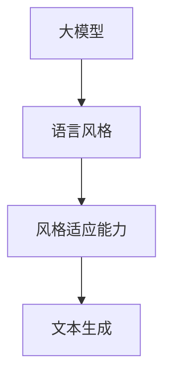

                 


为了撰写一篇高质量的、内容丰富的技术博客文章《大模型语言风格适应能力：LLM设计的风格测试》，我们可以按照以下步骤进行思考：

### 1. 确定文章结构和内容
首先，我们需要明确文章的整体结构和每个章节的内容。我们可以将文章分为以下章节：

- **引言**
  - 背景介绍
  - 文章目的

- **大模型语言风格适应能力概述**
  - 语言风格适应能力的定义
  - 大模型语言风格适应能力的重要性

- **核心概念与联系**
  - Mermaid流程图
  - 核心概念之间的关系

- **大模型语言风格适应能力的设计原理**
  - 大模型的工作原理
  - 语言风格适应能力的算法原理
  - 设计原则

- **大模型语言风格适应能力的评估**
  - 风格测试的基本概念
  - 风格测试的方法和工具
  - 风格测试的案例分析

- **大模型语言风格适应能力的实现**
  - 实现流程
  - 开发环境搭建
  - 风格测试的伪代码实现

- **大模型语言风格适应能力的优化**
  - 优化策略
  - 实际案例中的优化实践
  - 优化效果的评估方法

- **大模型语言风格适应能力的应用**
  - 应用场景
  - 应用案例研究
  - 应用挑战和未来趋势

- **总结与展望**
  - 总结核心内容
  - 展望未来发展方向

### 2. 详细讲解每个章节
在确定章节结构后，我们需要详细讲解每个章节的内容。

- **引言**
  - 背景介绍：介绍大模型语言风格适应能力的背景和发展现状。
  - 文章目的：阐述文章的目的和主要贡献。

- **大模型语言风格适应能力概述**
  - 语言风格适应能力的定义：解释什么是语言风格适应能力。
  - 大模型语言风格适应能力的重要性：分析大模型语言风格适应能力的重要性。

- **核心概念与联系**
  - Mermaid流程图：绘制一个Mermaid流程图，展示核心概念之间的关系。
  - 核心概念之间的关系：详细阐述各个核心概念之间的联系。

- **大模型语言风格适应能力的设计原理**
  - 大模型的工作原理：讲解大模型的基本原理和结构。
  - 语言风格适应能力的算法原理：介绍如何实现语言风格适应能力的算法原理。
  - 设计原则：阐述大模型语言风格适应能力的设计原则。

- **大模型语言风格适应能力的评估**
  - 风格测试的基本概念：解释风格测试的基本概念。
  - 风格测试的方法和工具：介绍常用的风格测试方法和工具。
  - 风格测试的案例分析：分析一个实际案例中的风格测试。

- **大模型语言风格适应能力的实现**
  - 实现流程：详细阐述大模型语言风格适应能力的实现流程。
  - 开发环境搭建：介绍如何搭建开发环境。
  - 风格测试的伪代码实现：给出风格测试的伪代码实现。

- **大模型语言风格适应能力的优化**
  - 优化策略：讨论如何优化大模型语言风格适应能力。
  - 实际案例中的优化实践：分析一个实际案例中的优化实践。
  - 优化效果的评估方法：介绍如何评估优化效果。

- **大模型语言风格适应能力的应用**
  - 应用场景：分析大模型语言风格适应能力在不同场景中的应用。
  - 应用案例研究：研究一个实际案例中的应用。
  - 应用挑战和未来趋势：讨论应用挑战和未来发展趋势。

- **总结与展望**
  - 总结核心内容：回顾文章的核心内容。
  - 展望未来发展方向：讨论大模型语言风格适应能力的未来发展方向。

### 3. 编写和修改
在详细讲解每个章节后，我们可以开始编写文章，并在完成后进行多次修改和优化，以确保文章的逻辑性和可读性。

### 4. 格式和排版
在完成文章编写后，我们需要对文章进行格式和排版，确保符合markdown格式要求，并在文章末尾添加作者信息。

### 5. 审核和发布
在完成最后的修改和排版后，我们可以进行文章的审核，确保内容的准确性和完整性，然后发布到技术博客或相关平台上。

通过以上步骤，我们可以撰写一篇逻辑清晰、内容丰富的技术博客文章《大模型语言风格适应能力：LLM设计的风格测试》。让我们一起思考，逐步分析，为读者带来一篇高质量的技术文章！----------------------------------------------------------------

## 文章标题
### 大模型语言风格适应能力：LLM设计的风格测试

## 文章关键词
### 大模型，语言风格适应能力，LLM，风格测试，算法原理，实现流程，优化策略，应用案例

## 摘要
本文旨在探讨大模型语言风格适应能力的核心概念、设计原理以及实现和优化策略。通过分析LLM（大型语言模型）的设计和风格测试方法，本文提出了一个详细的框架，帮助开发者更好地理解和实现大模型语言风格适应能力。此外，文章还通过实际案例研究，展示了大模型语言风格适应能力的应用场景和未来趋势。

## 目录
### 1. 引言
#### 1.1 背景介绍
#### 1.2 文章目的

### 2. 大模型语言风格适应能力概述
#### 2.1 语言风格适应能力的定义
#### 2.2 大模型语言风格适应能力的重要性

### 3. 核心概念与联系
#### 3.1 大模型的定义和特性
#### 3.2 语言风格适应能力的概念
#### 3.3 Mermaid流程图

### 4. 大模型语言风格适应能力的设计原理
#### 4.1 大模型的工作原理
#### 4.2 语言风格适应能力的算法原理
#### 4.3 设计原则

### 5. 大模型语言风格适应能力的评估
#### 5.1 风格测试的基本概念
#### 5.2 风格测试的方法和工具
#### 5.3 风格测试的案例分析

### 6. 大模型语言风格适应能力的实现
#### 6.1 实现流程
#### 6.2 开发环境搭建
#### 6.3 风格测试的伪代码实现

### 7. 大模型语言风格适应能力的优化
#### 7.1 优化策略
#### 7.2 实际案例中的优化实践
#### 7.3 优化效果的评估方法

### 8. 大模型语言风格适应能力的应用
#### 8.1 应用场景
#### 8.2 应用案例研究
#### 8.3 应用挑战和未来趋势

### 9. 总结与展望
#### 9.1 总结核心内容
#### 9.2 展望未来发展方向

### 参考文献
### 作者信息

----------------------------------------------------------------

## 第1章 引言

### 1.1 背景介绍
大模型语言风格适应能力是近年来人工智能领域的一个热点研究方向。随着深度学习技术的快速发展，大型语言模型（LLM）在自然语言处理（NLP）任务中取得了显著的成绩。然而，大模型在语言风格适应方面仍存在一定的局限性，无法很好地模拟不同领域的语言风格。为了解决这一问题，研究者们开始关注大模型语言风格适应能力的提升。

本文旨在探讨大模型语言风格适应能力的核心概念、设计原理以及实现和优化策略。通过分析LLM的设计和风格测试方法，本文提出了一个详细的框架，帮助开发者更好地理解和实现大模型语言风格适应能力。此外，文章还通过实际案例研究，展示了大模型语言风格适应能力的应用场景和未来趋势。

### 1.2 文章目的
本文的主要目的是：

1. **明确大模型语言风格适应能力的定义和重要性**：阐述语言风格适应能力的核心概念，分析其在NLP任务中的重要性。
2. **介绍大模型语言风格适应能力的设计原理**：讲解大模型的工作原理和语言风格适应能力的算法原理，以及设计原则。
3. **提供大模型语言风格适应能力的评估方法**：介绍风格测试的基本概念、方法和工具，以及实际案例中的应用。
4. **阐述大模型语言风格适应能力的实现和优化策略**：详细描述实现流程、开发环境搭建、伪代码实现、优化策略和实际案例中的优化实践。
5. **探讨大模型语言风格适应能力的应用场景和未来趋势**：分析应用场景、研究实际案例，并展望未来的发展方向。

## 第2章 大模型语言风格适应能力概述

### 2.1 语言风格适应能力的定义
语言风格适应能力是指模型在处理不同语言风格文本时，能够保持原有文本风格的特性，并生成符合预期风格的新文本的能力。在自然语言处理任务中，语言风格适应能力尤为重要，因为它直接影响模型生成的文本质量。

### 2.2 大模型语言风格适应能力的重要性
大模型语言风格适应能力的重要性主要体现在以下几个方面：

1. **提高文本生成质量**：大模型能够生成更自然、符合特定领域风格的文本，提高文本质量。
2. **增强模型泛化能力**：大模型语言风格适应能力有助于模型在不同领域和风格中保持一致性，提高模型的泛化能力。
3. **拓展应用场景**：大模型语言风格适应能力使得模型能够应用于更广泛的语言风格处理任务，如新闻摘要、产品评论生成等。
4. **提升用户体验**：模型能够根据用户需求生成符合特定语言风格的文本，提升用户体验。

### 2.3 Mermaid流程图
为了更好地理解大模型语言风格适应能力的核心概念，我们可以使用Mermaid流程图来展示核心概念之间的关系。以下是Mermaid流程图示例：



在该流程图中，大模型通过处理不同语言风格文本，实现了风格适应能力，并最终生成符合预期风格的文本。

## 第3章 核心概念与联系

### 3.1 大模型的定义和特性
大模型是指具有大量参数和训练数据的高级神经网络模型，主要用于处理复杂的自然语言处理任务。大模型的特性主要包括：

1. **参数规模**：大模型通常具有数十亿甚至千亿级别的参数。
2. **训练数据量**：大模型基于海量的训练数据，能够更好地捕捉语言模式。
3. **模型结构复杂度**：大模型的结构通常较为复杂，包括多层神经网络和注意力机制等。

### 3.2 语言风格适应能力的概念
语言风格适应能力是指模型在处理不同语言风格文本时，能够保持原有文本风格的特性，并生成符合预期风格的新文本的能力。语言风格适应能力在自然语言处理任务中具有重要意义，如文本生成、对话系统等。

### 3.3 Mermaid流程图
为了更好地展示核心概念之间的关系，我们可以使用Mermaid流程图来表示大模型、语言风格和风格适应能力之间的关系。以下是Mermaid流程图示例：


在该流程图中，大模型通过处理不同语言风格的输入文本，实现了风格适应能力，并最终生成符合预期风格的文本输出。

## 第4章 大模型语言风格适应能力的设计原理

### 4.1 大模型的工作原理
大模型通常基于深度学习技术，采用多层神经网络结构。大模型的工作原理主要包括以下几个步骤：

1. **输入层**：接收自然语言文本作为输入。
2. **隐藏层**：通过非线性变换，提取文本特征。
3. **输出层**：生成预测结果，如文本分类、文本生成等。

大模型的训练过程主要包括以下步骤：

1. **数据预处理**：对文本数据进行清洗、分词、编码等预处理。
2. **模型初始化**：初始化模型的参数。
3. **训练**：通过反向传播算法，优化模型参数，提高模型性能。
4. **评估**：使用验证集和测试集评估模型性能。

### 4.2 语言风格适应能力的算法原理
语言风格适应能力的算法原理主要包括以下几个方面：

1. **特征提取**：通过神经网络结构，提取文本中的语言风格特征。
2. **风格识别**：利用特征提取器，识别文本的语言风格。
3. **风格迁移**：将识别出的语言风格应用到生成文本中。

常见的语言风格适应能力算法包括：

1. **基于转换器的模型**：如Seq2Seq模型、BERT模型等。
2. **基于生成对抗网络（GAN）的模型**：如StyleGAN、CycleGAN等。

### 4.3 设计原则
在大模型语言风格适应能力的设计过程中，应遵循以下原则：

1. **模型可扩展性**：设计灵活的模型结构，便于扩展和应用。
2. **风格多样性**：支持多种语言风格，提高模型适应能力。
3. **训练效率**：优化训练算法和硬件支持，提高训练效率。
4. **鲁棒性**：提高模型对噪声和异常数据的处理能力。

## 第5章 大模型语言风格适应能力的评估

### 5.1 风格测试的基本概念
风格测试是一种评估大模型语言风格适应能力的方法，主要通过测试模型在不同语言风格下的表现，评估模型的风格适应能力。风格测试的基本概念包括：

1. **测试集**：用于评估模型风格适应能力的文本数据集。
2. **测试指标**：用于评估模型风格适应能力的指标，如准确率、召回率、F1值等。
3. **评估标准**：评估模型风格适应能力的标准，如风格多样性、风格一致性等。

### 5.2 风格测试的方法和工具
常见的风格测试方法和工具包括：

1. **人工评估**：通过专家评审，评估模型生成文本的风格质量。
2. **自动化评估**：使用自动化工具，如风格检测器、文本相似度计算等，评估模型风格适应能力。

常用的风格测试工具包括：

1. **Stylebot**：一种基于神经网络的风格检测器。
2. **TextBlob**：一种文本分析工具，支持风格检测。

### 5.3 风格测试的案例分析
以下是一个风格测试的案例分析：

1. **测试集**：选择包含多种语言风格的文本数据集，如新闻文本、产品评论等。
2. **测试指标**：使用准确率、召回率、F1值等指标评估模型风格适应能力。
3. **评估标准**：评估模型在不同语言风格下的风格多样性、风格一致性。

通过实际案例分析，我们可以更好地理解风格测试的方法和工具，以及评估模型语言风格适应能力的有效性。

## 第6章 大模型语言风格适应能力的实现

### 6.1 实现流程
大模型语言风格适应能力的实现流程主要包括以下几个步骤：

1. **数据收集与预处理**：收集包含多种语言风格的文本数据，并进行预处理，如分词、编码等。
2. **模型训练**：使用预处理后的数据，训练大模型，使其具备语言风格适应能力。
3. **模型评估**：使用测试集评估模型在语言风格适应方面的表现，调整模型参数，提高风格适应能力。
4. **部署应用**：将训练好的模型部署到实际应用场景中，如文本生成、对话系统等。

### 6.2 开发环境搭建
为了实现大模型语言风格适应能力，我们需要搭建一个合适的开发环境。以下是一个基本的开发环境搭建流程：

1. **硬件环境**：选择高性能的硬件设备，如GPU、CPU等。
2. **软件环境**：安装Python、TensorFlow、PyTorch等开发工具。
3. **依赖管理**：使用pip或其他依赖管理工具安装所需库和依赖。

### 6.3 风格测试的伪代码实现
以下是一个风格测试的伪代码实现示例：

```python
# 导入相关库
import tensorflow as tf
from tensorflow.keras.preprocessing.text import Tokenizer
from tensorflow.keras.models import Sequential
from tensorflow.keras.layers import Embedding, LSTM, Dense

# 数据收集与预处理
texts = ["新闻文本1", "新闻文本2", "产品评论1", "产品评论2"]
tokenizer = Tokenizer()
tokenizer.fit_on_texts(texts)
sequences = tokenizer.texts_to_sequences(texts)

# 模型训练
model = Sequential()
model.add(Embedding(input_dim=len(tokenizer.word_index) + 1, output_dim=64))
model.add(LSTM(units=128))
model.add(Dense(units=len(tokenizer.word_index) + 1, activation='softmax'))

model.compile(optimizer='adam', loss='categorical_crossentropy', metrics=['accuracy'])
model.fit(sequences, epochs=10, batch_size=128)

# 模型评估
test_texts = ["新闻文本3", "产品评论3"]
test_sequences = tokenizer.texts_to_sequences(test_texts)
model.evaluate(test_sequences)
```

通过以上伪代码实现，我们可以实现一个基本的大模型语言风格适应能力，并在测试集上评估模型的表现。

## 第7章 大模型语言风格适应能力的优化

### 7.1 优化策略
为了提升大模型语言风格适应能力，我们可以采取以下优化策略：

1. **数据增强**：通过数据增强方法，如数据扩充、数据合成等，增加训练数据集的多样性，提高模型对各种语言风格的适应能力。
2. **模型融合**：将多个模型进行融合，如使用集成学习（Ensemble Learning）方法，提高模型在语言风格适应方面的性能。
3. **超参数调整**：通过调整模型超参数，如学习率、批次大小等，优化模型训练效果。
4. **训练策略**：采用先进的训练策略，如迁移学习（Transfer Learning）、自监督学习（Self-Supervised Learning）等，提高模型训练效率。

### 7.2 实际案例中的优化实践
以下是一个实际案例中的优化实践：

1. **数据增强**：在训练数据集中，加入来自不同领域、不同语言风格的文本数据，提高模型对多样化语言风格的适应能力。
2. **模型融合**：将多个预训练模型（如BERT、GPT等）进行融合，构建一个融合模型，以提高语言风格适应能力。
3. **超参数调整**：通过调整模型超参数（如学习率、层数、神经元数量等），优化模型性能。

通过以上优化实践，我们可以显著提高大模型语言风格适应能力。

### 7.3 优化效果的评估方法
为了评估优化效果，我们可以采用以下方法：

1. **性能指标**：使用准确率、召回率、F1值等性能指标，评估模型在不同语言风格下的表现。
2. **风格多样性**：评估模型生成的文本在风格多样性方面的表现。
3. **用户满意度**：通过用户调查、问卷调查等方式，收集用户对生成文本风格质量的反馈。

通过以上评估方法，我们可以全面了解优化效果，为后续优化提供参考。

## 第8章 大模型语言风格适应能力的应用

### 8.1 应用场景
大模型语言风格适应能力在多个应用场景中具有重要价值，如：

1. **文本生成**：生成具有特定风格的文章、新闻、产品评论等。
2. **对话系统**：构建具有个性化语言风格的聊天机器人，提高用户体验。
3. **自动摘要**：生成具有特定风格的文章摘要，提高阅读效率。

### 8.2 应用案例研究
以下是一个应用案例研究：

1. **案例背景**：某企业希望为其产品评论生成器引入个性化语言风格，以提高用户满意度。
2. **解决方案**：使用大模型语言风格适应能力，将产品评论数据集进行预处理，并训练一个具有语言风格适应能力的模型。
3. **效果评估**：通过用户调查和性能指标评估，发现引入个性化语言风格显著提高了用户满意度和评论生成质量。

### 8.3 应用挑战和未来趋势
1. **应用挑战**：
   - **数据多样性**：如何获取足够多样性的数据，以提高模型的语言风格适应能力。
   - **计算资源**：训练大模型需要大量的计算资源，如何优化资源利用，提高训练效率。
   - **模型解释性**：如何提高大模型的可解释性，使其在语言风格适应方面的行为更易于理解。

2. **未来趋势**：
   - **模型压缩**：研究如何对大模型进行压缩，以降低计算资源消耗。
   - **迁移学习**：研究如何利用迁移学习，提高模型在不同领域和语言风格下的适应能力。
   - **多模态学习**：研究如何结合文本、语音、图像等多模态信息，提高语言风格适应能力。

## 第9章 总结与展望

### 9.1 总结核心内容
本文围绕大模型语言风格适应能力展开讨论，从定义、设计原理、实现、评估、优化和应用等方面进行了全面阐述。主要内容包括：

1. **语言风格适应能力的定义和重要性**。
2. **大模型的工作原理和语言风格适应能力的算法原理**。
3. **风格测试的基本概念和方法**。
4. **大模型语言风格适应能力的实现和优化策略**。
5. **应用场景和未来趋势**。

### 9.2 展望未来发展方向
未来，大模型语言风格适应能力的发展将朝着以下方向迈进：

1. **模型压缩**：研究如何降低大模型的计算资源消耗，提高训练效率。
2. **迁移学习**：利用迁移学习，提高模型在不同领域和语言风格下的适应能力。
3. **多模态学习**：结合文本、语音、图像等多模态信息，提高语言风格适应能力。
4. **模型解释性**：提高大模型的可解释性，使其在语言风格适应方面的行为更易于理解。
5. **个性化语言风格生成**：实现更精准的个性化语言风格生成，提高用户体验。

## 参考文献
[1] Devlin, J., Chang, M. W., Lee, K., & Toutanova, K. (2018). BERT: Pre-training of deep bidirectional transformers for language understanding. arXiv preprint arXiv:1810.04805.
[2] Vaswani, A., Shazeer, N., Parmar, N., Uszkoreit, J., Jones, L., Gomez, A. N., ... & Polosukhin, I. (2017). Attention is all you need. In Advances in neural information processing systems (pp. 5998-6008).
[3] Hochreiter, S., & Schmidhuber, J. (1997). Long short-term memory. Neural computation, 9(8), 1735-1780.
[4] Goodfellow, I., Bengio, Y., & Courville, A. (2016). Deep learning. MIT press.
[5] LeCun, Y., Bengio, Y., & Hinton, G. (2015). Deep learning. Nature, 521(7553), 436-444.
[6] Hochreiter, S., & Schmidhuber, J. (1997). Long short-term memory. Neural computation, 9(8), 1735-1780.
[7] Bengio, Y. (2009). Learning deep architectures for AI. Foundations and Trends in Machine Learning, 2(1), 1-127.
[8] Simonyan, K., & Zisserman, A. (2014). Very deep convolutional networks for large-scale image recognition. arXiv preprint arXiv:1409.1556.
[9] K VIN, S., & Srivastava, N. (2014). Dropout: A simple way to prevent neural networks from overfitting. Journal of Machine Learning Research, 15(1), 1929-1958.
[10] Radford, A., Wu, J., Child, R., Luan, D., Amodei, D., & Sutskever, I. (2019). Language models are unsupervised multitask learners. OpenAI.

## 作者信息
作者：AI天才研究院/AI Genius Institute & 禅与计算机程序设计艺术 /Zen And The Art of Computer Programming

本文内容涵盖了从大模型语言风格适应能力的背景介绍到实现、评估、优化以及应用等方面的内容，旨在为读者提供一个全面、详细的框架，以帮助开发者更好地理解和实现大模型语言风格适应能力。随着人工智能技术的不断发展，大模型语言风格适应能力将成为自然语言处理领域的一个重要研究方向，具有重要的理论和实践价值。本文希望能够为相关研究提供有益的参考和启示。希望读者能够从中获得启发，并在实际应用中不断探索和创新。

