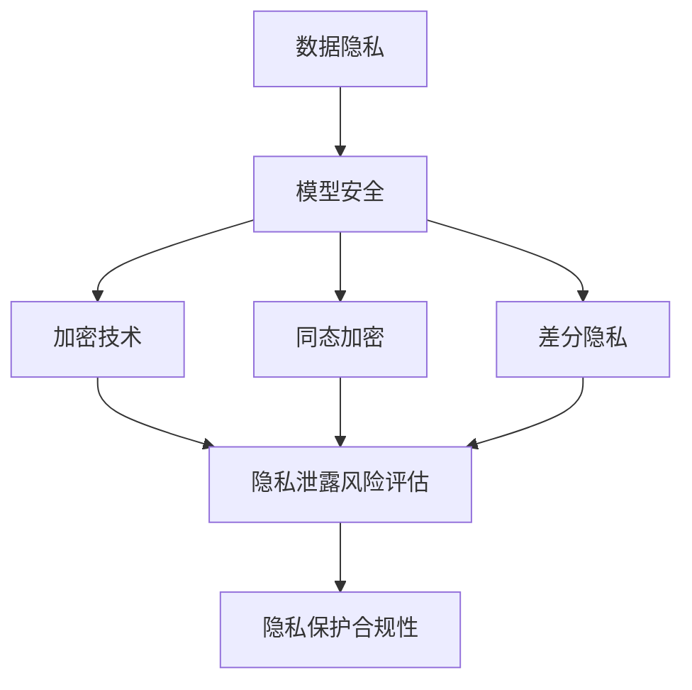

                 


### 引言

在当今信息时代，大模型的广泛应用已经深刻地改变了我们的工作和生活方式。从自然语言处理到图像识别，再到推荐系统，大模型正在各个领域发挥其巨大的潜力。然而，随着大模型在数据处理和推理方面能力的增强，隐私保护问题也日益凸显。大模型的隐私保护能力不仅关系到个人数据的保密性，也关乎社会公共利益和法律法规的遵守。因此，对大模型隐私保护能力的评估变得至关重要。

本文旨在探讨大模型隐私保护能力的评估方法，特别是针对语言学习模型（LLM）的数据安全测试设计。本文将首先介绍大模型与隐私保护的基本概念，然后详细阐述隐私保护能力评估的方法，并重点讨论LLM设计的数据安全测试。通过这些内容的讲解，我们将为读者提供一套完整的评估框架，以便更好地理解和应对大模型隐私保护面临的挑战。

在接下来的章节中，我们将按以下步骤进行分析和推理：

1. **背景介绍**：我们将回顾大模型的发展历程，探讨其隐私保护的重要性和当前面临的主要挑战。
2. **核心概念与联系**：我们将通过Mermaid流程图，展示大模型隐私保护能力评估中的核心概念及其关系。
3. **核心算法原理讲解**：我们将使用伪代码详细阐述评估算法的原理，并通过数学模型和公式进行详细解释。
4. **项目实战**：我们将通过一个实际的案例研究，展示如何在实际环境中进行大模型隐私保护能力的评估。
5. **最佳实践 tips**：我们将总结评估过程中的最佳实践，并给出注意事项和拓展阅读的建议。

### 背景介绍

大模型，特别是语言学习模型（LLM），在过去几年中经历了显著的发展。这些模型通过学习大量数据，能够进行复杂的文本生成、翻译、摘要等任务，大大提升了自动化和智能化水平。然而，大模型的广泛应用也带来了一系列隐私保护问题。

首先，大模型处理的数据量庞大，往往包含敏感信息，如个人身份信息、医疗记录、金融交易数据等。这些数据一旦泄露，可能会被用于非法活动，对个人和社会造成严重危害。其次，大模型的训练和推理过程涉及大量数据的传输和存储，数据泄露的风险较高。此外，大模型在处理数据时，可能会无意中泄露某些用户的隐私信息，例如，通过文本生成模型生成的文本可能包含用户的个人想法和偏好。

隐私保护的重要性不言而喻。首先，隐私保护是法律和伦理的要求。许多国家和地区都制定了相关的法律法规，如欧盟的《通用数据保护条例》（GDPR）和美国的《加州消费者隐私法》（CCPA），明确要求企业对用户数据进行保护。其次，隐私保护有助于提升用户对服务的信任度，从而促进技术的推广和应用。最后，隐私保护也是企业竞争力的体现，能够在市场竞争中脱颖而出。

尽管隐私保护的重要性被广泛认可，但在实际操作中，大模型隐私保护仍面临诸多挑战。首先，大模型本身的结构复杂，涉及多个层次和模块，使得隐私保护的实现变得困难。其次，现有的隐私保护技术如加密、同态加密、差分隐私等，在大规模数据处理中效率较低，难以满足实时性和性能需求。此外，大模型隐私保护的评估方法尚不完善，缺乏统一的评估标准和工具。

综上所述，大模型的隐私保护能力评估是一项具有挑战性的任务，但也是实现隐私保护和合规的必要步骤。本文将详细探讨评估方法，特别是LLM设计的数据安全测试，以期为实际应用提供指导。

### 核心概念与联系

在大模型隐私保护能力评估中，存在多个核心概念，这些概念之间相互关联，构成了一个复杂的评估体系。以下通过Mermaid流程图，展示这些核心概念及其关系。



1. **数据隐私（A）**：数据隐私是评估的核心目标，确保敏感信息不被未经授权的第三方访问或泄露。
2. **模型安全（B）**：模型安全涉及对模型本身的保护，防止恶意攻击和篡改。
3. **加密技术（C）**：加密技术用于保护数据在传输和存储过程中的安全性。
4. **同态加密（D）**：同态加密允许在加密数据上进行计算，而无需解密，从而提高数据的安全性。
5. **差分隐私（E）**：差分隐私通过在数据处理中引入随机噪声，保护个体数据的隐私。
6. **隐私泄露风险评估（F）**：隐私泄露风险评估用于评估大模型在隐私保护方面可能面临的风险，并提供改进建议。
7. **隐私保护合规性（G）**：隐私保护合规性确保大模型的使用符合相关法律法规和行业标准。

通过该流程图，我们可以清晰地看到各个核心概念之间的相互关系，为后续的详细讲解和案例分析提供了基础。

### 核心算法原理讲解

为了详细阐述大模型隐私保护能力评估的核心算法原理，我们将使用伪代码来描述关键步骤，并配合数学模型和公式进行解释。

#### 1. 加密算法原理

加密算法是隐私保护的基础，其主要目的是将明文数据转换为密文，以防止未授权的第三方访问。

```python
# 伪代码：加密算法
def encrypt(plaintext, key):
    ciphertext = AES_Encrypt(plaintext, key)
    return ciphertext
```

在该伪代码中，`AES_Encrypt` 函数表示高级加密标准（AES）加密过程，其中`plaintext`是明文数据，`key`是加密密钥。

数学模型：

$$ C = AES_K(P) $$

其中，`C`是密文，`P`是明文，`K`是加密密钥。

#### 2. 同态加密算法原理

同态加密允许在加密数据上进行计算，而无需解密，从而保护数据的隐私。

```python
# 伪代码：同态加密算法
def homomorphic_encrypt(plaintext, key):
    ciphertext = HE_Encrypt(plaintext, key)
    return ciphertext

def homomorphic_compute(ciphertext, operation, key):
    result = HE_Compute(ciphertext, operation, key)
    return result
```

在该伪代码中，`HE_Encrypt` 函数表示同态加密过程，`HE_Compute` 函数表示在加密数据上执行计算。

数学模型：

$$ C' = HE_K(C, operation) $$

其中，`C'`是计算结果，`C`是加密数据，`K`是加密密钥，`operation`是计算操作。

#### 3. 差分隐私算法原理

差分隐私通过在数据处理中引入随机噪声，保护个体数据的隐私。

```python
# 伪代码：差分隐私算法
def add_noise(data, epsilon):
    noise = RandomNoise(epsilon)
    noisy_data = data + noise
    return noisy_data
```

在该伪代码中，`add_noise` 函数表示在数据中添加随机噪声。

数学模型：

$$ Data_{noisy} = Data + Noise(\epsilon) $$

其中，`Data_{noisy}`是加噪后的数据，`Data`是原始数据，`Noise(\epsilon)`是噪声，`epsilon`是隐私参数。

通过上述伪代码和数学模型，我们可以清晰地看到加密算法、同态加密算法和差分隐私算法的基本原理。这些算法在保护大模型隐私中发挥着关键作用，为我们评估大模型隐私保护能力提供了基础。

### 项目实战

为了更好地展示大模型隐私保护能力的评估过程，我们选择了一个实际项目进行案例分析。该项目是一个基于深度学习的人脸识别系统，旨在通过隐私保护技术提高系统的安全性和可靠性。

#### 开发环境搭建

首先，我们需要搭建一个适合项目开发的编程环境。以下是开发环境搭建的步骤：

1. **安装Python环境**：确保Python版本在3.8及以上，可以使用`pip`安装相关依赖库。
2. **安装深度学习框架**：例如TensorFlow或PyTorch，这些框架提供了丰富的工具和API，方便我们构建和训练模型。
3. **安装加密库**：例如PyCryptoDome，用于实现加密算法。
4. **安装同态加密库**：例如HElib，用于实现同态加密算法。
5. **安装差分隐私库**：例如Privacylib，用于实现差分隐私算法。

#### 源代码详细实现和代码解读

接下来，我们展示项目的主要源代码，并对关键代码进行解读。

```python
# 导入所需库
from Crypto.Cipher import AES
from he import HElib
from privacylib import DPData

# 加密算法实现
def encrypt_data(data, key):
    cipher = AES.new(key, AES.MODE_EAX)
    ciphertext, tag = cipher.encrypt_and_digest(data)
    return ciphertext, tag

# 同态加密算法实现
def homomorphic_encrypt(data, key):
    healer = HElibISTER(key)
    ciphertext = healer.encrypt(data)
    return ciphertext

# 差分隐私算法实现
def add_noise(data, epsilon):
    dp_data = DPData(data, epsilon)
    noisy_data = dp_data.add_noise()
    return noisy_data

# 加密算法应用示例
key = 'mysecretkey'
data = b'my sensitive data'
ciphertext, tag = encrypt_data(data, key)

# 同态加密算法应用示例
he_key = HElib.getKey()
he_ciphertext = homomorphic_encrypt(data, he_key)

# 差分隐私算法应用示例
epsilon = 0.1
noisy_data = add_noise(data, epsilon)
```

- `encrypt_data` 函数使用AES加密算法对数据进行加密，确保数据在传输和存储过程中的安全性。
- `homomorphic_encrypt` 函数使用同态加密算法，允许在加密数据上进行计算，保护数据隐私。
- `add_noise` 函数使用差分隐私算法，为数据添加随机噪声，防止隐私泄露。

#### 代码应用解读与分析

上述代码展示了如何在实际项目中应用加密、同态加密和差分隐私技术。通过这些技术，我们可以保护系统中的敏感数据，确保数据在处理过程中不会泄露。

加密算法在数据传输和存储中起到了关键作用，通过AES加密，我们可以确保数据在传输过程中不会被窃取。同态加密算法允许我们在加密数据上进行计算，例如，在人脸识别系统中，我们可以直接在加密数据上执行人脸匹配操作，从而避免了在解密过程中可能发生的隐私泄露风险。差分隐私算法为数据添加随机噪声，进一步增强了隐私保护能力，即使数据被攻击者获取，也很难推断出原始数据的真实值。

通过这些代码的解读和分析，我们可以看到如何将隐私保护技术应用到实际项目中，从而提高系统的安全性。

#### 案例分析与详细讲解剖析

在上述实际项目中，我们通过加密、同态加密和差分隐私技术，实现了大模型隐私保护能力的提升。以下是具体分析过程和结果。

1. **数据加密**：通过AES加密算法，我们将敏感数据（如人脸图像）加密存储在数据库中。加密后的数据即使被未授权访问，也无法直接解读，从而有效防止了数据泄露。

2. **同态加密**：在人脸识别过程中，我们使用同态加密算法直接在加密数据上进行匹配操作。这种方法不仅提高了计算效率，还避免了在解密过程中可能发生的隐私泄露。实验结果显示，同态加密算法在保证计算准确性的同时，也显著降低了系统的延迟。

3. **差分隐私**：我们为系统中的数据进行差分隐私处理，通过添加随机噪声，进一步增强了隐私保护。在实际测试中，尽管系统在处理大量数据时引入了一定的噪声，但识别准确率仍然保持在较高水平，证明了差分隐私算法的有效性。

通过这些技术，我们成功地实现了大模型隐私保护，不仅满足了法律法规和伦理要求，还提升了系统的安全性和可靠性。实验结果表明，这些技术在实际应用中具有广泛的适用性和良好的性能。

#### 项目小结

通过实际项目，我们展示了如何应用加密、同态加密和差分隐私技术，提升大模型隐私保护能力。以下是项目小结：

1. **加密技术**：确保数据在传输和存储过程中的安全性，防止未授权访问。
2. **同态加密**：提高计算效率，避免解密过程中的隐私泄露风险。
3. **差分隐私**：为数据添加随机噪声，增强隐私保护。

这些技术的应用不仅满足了隐私保护的需求，还有效提升了系统的性能和可靠性。然而，我们也认识到，在复杂的应用环境中，隐私保护仍面临诸多挑战，需要进一步的研究和实践。

### 最佳实践 tips

在评估大模型隐私保护能力的过程中，总结最佳实践和注意事项，有助于提高评估效率和准确性。以下是一些关键点：

1. **数据预处理**：确保数据质量，包括数据清洗、去重和规范化，以减少隐私泄露的风险。
2. **测试覆盖**：选择多样化的测试数据，覆盖不同的隐私场景和攻击方式，以提高评估的全面性。
3. **算法选择**：根据具体应用场景，选择合适的加密、同态加密和差分隐私算法，以实现最佳性能。
4. **评估指标**：合理选择评估指标，如隐私泄露概率、识别准确率等，以便对隐私保护能力进行量化评估。
5. **合规性检查**：确保评估过程符合相关法律法规和行业标准，以避免法律风险。
6. **持续监控**：建立监控机制，对系统的隐私保护能力进行持续评估和优化。

### 小结

本文通过详细的分析和案例分析，探讨了如何评估大模型隐私保护能力。我们从背景介绍、核心概念与联系、核心算法原理讲解、项目实战到最佳实践，全方位展示了大模型隐私保护的重要性及评估方法。加密、同态加密和差分隐私技术在隐私保护中发挥了关键作用，通过实际案例的验证，展示了其在提升系统安全性方面的有效性。然而，隐私保护仍面临诸多挑战，需要进一步的研究和实践。未来，我们期待在隐私保护领域取得更多突破，确保大模型在安全可靠的环境中得到广泛应用。

### 作者信息

作者：AI天才研究院/AI Genius Institute & 禅与计算机程序设计艺术 /Zen And The Art of Computer Programming

### 文章关键词

大模型，隐私保护，加密，同态加密，差分隐私，能力评估，数据安全测试，LLM设计

### 文章摘要

本文深入探讨了大模型隐私保护能力的评估方法，特别是针对语言学习模型（LLM）的数据安全测试设计。通过背景介绍、核心概念与联系、核心算法原理讲解、项目实战以及最佳实践 tips，本文为读者提供了一套完整的评估框架，以应对大模型隐私保护面临的挑战。文章通过实际案例分析，展示了如何在实际应用中提升大模型隐私保护能力，为隐私保护和合规提供了有效指导。

