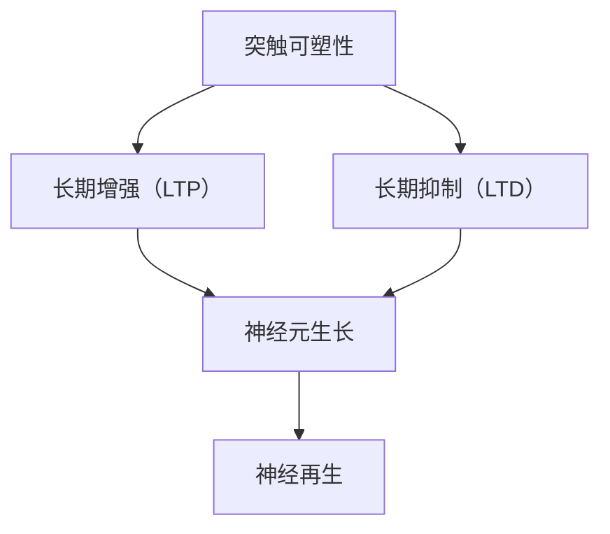

                 


### 文章标题
《大脑可塑性与终身学习：拓展世界可理解性的潜力》

### 文章关键词
大脑可塑性，终身学习，神经网络，强化学习，数学模型，项目实战

### 文章摘要
本文深入探讨了大脑可塑性与终身学习的关系，介绍了大脑可塑性的基本概念和原理，以及如何利用终身学习来拓展我们对世界的理解。文章通过详细的算法原理讲解、数学模型解析、项目实战案例，展示了如何将理论应用到实践中，以实现个人认知能力的持续提升。文章旨在为读者提供一个全面的指南，帮助他们理解大脑可塑性在终身学习中的重要性，并激发他们在个人和职业发展中积极应用这一理念。

---

## 引言

在信息爆炸的时代，终身学习已成为个人成长和社会发展的关键。然而，传统的学习模式往往受限于时间、地点和资源的限制。随着人工智能和神经科学的发展，我们开始意识到大脑的潜力远未穷尽。大脑的可塑性，即大脑在一生中能够适应和改变的能力，为我们提供了新的视角和可能性。本文将探讨大脑可塑性如何与终身学习相互促进，从而拓展我们对世界的理解。

### 大脑可塑性的重要性

大脑可塑性是指大脑结构和功能的改变，可以由经验、学习和训练引起。这一概念的重要性在于，它揭示了大脑的灵活性，并挑战了传统观念中“定型”的固定思维模式。研究表明，大脑可塑性不仅在儿童期存在，在整个成年期都保持着较高的水平。这意味着，无论年龄大小，我们都有机会通过学习和训练来优化大脑功能。

### 终身学习的发展

终身学习理念最早可追溯到20世纪60年代，随着全球化和信息技术的快速发展，它逐渐成为现代社会的基石。终身学习不仅强调知识的不断更新，更注重学习态度和方法的培养。这一理念鼓励人们主动适应不断变化的环境，通过持续学习来提升自我价值和竞争力。

### 关联与目标

大脑可塑性为终身学习提供了生物学基础，而终身学习则为大脑可塑性提供了实践平台。本文将详细探讨这两者之间的关联，并介绍相关的核心概念、算法原理、数学模型，以及如何通过实际项目来实现终身学习。我们的目标是帮助读者理解大脑可塑性在终身学习中的作用，并激发他们在个人和职业发展中积极应用这一理念。

---

## 第1章 大脑可塑性基础

### 大脑可塑性的定义与原理

大脑可塑性是指大脑在一生中能够适应和改变的能力。这种改变可以通过经验、学习和训练引起，表现为神经连接的增强、新突触的形成和神经元活动的变化。大脑可塑性使大脑能够适应外部环境的变化，从而提高学习和记忆的能力。

### 大脑可塑性的神经科学基础

大脑可塑性主要通过以下几种机制实现：

1. **突触可塑性**：突触是神经元之间的连接，突触可塑性指的是突触强度的变化。长期增强（LTP）和长期抑制（LTD）是两种主要的突触可塑性机制。

2. **神经元生长**：神经元可以通过生长新突触和改变现有突触的结构来适应新的学习任务。

3. **神经再生**：在某些情况下，受损的神经元可以通过再生新的神经连接来恢复功能。

### Mermaid流程图：大脑可塑性工作原理



这个流程图展示了大脑可塑性工作原理的核心步骤。突触可塑性通过长期增强和长期抑制来改变神经元之间的连接强度，进而影响神经元生长和神经再生。

---

## 第2章 终身学习的概念与理论

### 终身学习的定义与历史发展

终身学习是一种持续的学习过程，它始于出生，贯穿人的一生，甚至延伸到退休后。这一概念最早由法国教育家保罗·朗格朗（Paul Lengrand）在20世纪60年代提出，强调学习不仅仅是在学校阶段，而是一个持续的过程，需要通过多种形式和渠道进行。

### 终身学习的核心理论和原则

1. **学习观的转变**：从传统的知识传递转变为能力培养，注重个体自主学习能力和问题解决能力。

2. **知识更新的速度**：随着信息技术的快速发展，知识更新的速度越来越快，终身学习成为应对知识过时的重要手段。

3. **个性化学习**：尊重个体的差异，通过定制化的学习方案来满足不同需求。

4. **社会互动**：通过与他人交流和合作，实现知识的共享和创新的产生。

### 大脑可塑性与终身学习的关系

大脑可塑性与终身学习密切相关。大脑的可塑性为个体提供了持续学习和适应新环境的能力，而终身学习则为大脑提供了丰富的刺激和训练，进一步增强了大脑的可塑性。这种相互作用形成了一个正反馈循环，使得个体能够不断拓展自己的认知能力。

---

## 第3章 支持终身学习的关键算法

### 神经网络与深度学习

#### 3.1.1 神经网络基本原理

神经网络是一种模仿生物神经系统的计算模型，由多个神经元组成，每个神经元都与多个其他神经元连接。神经网络的输入通过权重连接到每个神经元，经过激活函数处理后产生输出。神经网络通过不断调整权重来优化性能，从而实现复杂模式的识别和学习。

#### 3.1.2 深度学习算法详解（伪代码）

```python
# 定义神经网络结构
layers = [Input(shape=(input_dim)), Dense(units=hidden_units, activation='relu'), Dense(units=output_dim)]

# 构建和编译模型
model = Sequential(layers)
model.compile(optimizer='adam', loss='categorical_crossentropy', metrics=['accuracy'])

# 训练模型
model.fit(x_train, y_train, epochs=epochs, batch_size=batch_size)

# 评估模型
performance = model.evaluate(x_test, y_test)
```

这段伪代码展示了如何构建、编译和训练一个简单的神经网络模型。神经网络通过反向传播算法不断调整权重，以最小化预测误差。

### 强化学习与决策制定

#### 3.2.1 强化学习基本原理

强化学习是一种通过不断交互和反馈来学习决策策略的方法。它通过奖励和惩罚信号来调整行为，以最大化长期回报。强化学习的关键在于值函数和策略的优化。

#### 3.2.2 强化学习算法详解（伪代码）

```python
# 初始化值函数
V = np.zeros([state_space])

# 定义学习率
alpha = 0.1

# 定义折扣因子
gamma = 0.9

# 迭代更新值函数
for episode in range(epochs):
    state = env.reset()
    done = False
    while not done:
        action = choose_action(state, V)
        next_state, reward, done = env.step(action)
        V[state] = V[state] + alpha * (reward + gamma * max(V[next_state]) - V[state])
        state = next_state
```

这段伪代码展示了如何使用强化学习算法更新值函数，从而学习最优策略。强化学习通过不断尝试和反馈，逐步优化决策过程。

---

## 第4章 数学模型与公式

### 相关的数学模型

在终身学习过程中，多个数学模型被广泛应用于数据分析和决策制定。以下是一些核心的数学模型：

1. **概率论模型**：概率论模型用于评估不确定性，如贝叶斯定理和马尔可夫链。
2. **信息论模型**：信息论模型用于量化信息价值和传输效率，如熵和互信息。
3. **优化模型**：优化模型用于寻找最优解，如线性规划和非线性规划。

### 举例说明

#### 4.1.1 公式应用实例

贝叶斯定理在终身学习中用于更新知识置信度：

$$
P(A|B) = \frac{P(B|A) \cdot P(A)}{P(B)}
$$

其中，$P(A|B)$ 表示在已知 $B$ 发生的情况下 $A$ 发生的概率，$P(B|A)$ 和 $P(A)$ 分别为条件概率和先验概率。

#### 4.1.2 复杂公式解析

马尔可夫决策过程（MDP）是一个用于决策制定的优化模型，其状态转移概率矩阵可以表示为：

$$
P(s' | s, a) = \sum_{a'} p(a' | s) \cdot r(s', a')
$$

其中，$s$ 和 $s'$ 分别为当前状态和下一状态，$a$ 和 $a'$ 分别为当前动作和下一动作，$p(a' | s)$ 和 $r(s', a')$ 分别为动作概率和回报函数。

---

## 第5章 项目实战：构建终身学习环境

### 实践终身学习的步骤

要构建一个有效的终身学习环境，可以遵循以下步骤：

1. **明确学习目标**：设定清晰的学习目标和预期成果，以确保学习过程具有方向性。
2. **选择合适的工具和资源**：根据学习目标选择合适的工具和资源，如在线课程、学习平台和文献资料。
3. **制定学习计划**：制定详细的学习计划，包括学习时间、内容和进度，以确保学习过程的有序性。
4. **持续评估和调整**：定期评估学习效果，根据评估结果调整学习计划，以保持学习效率。

### 环境搭建与工具选择

搭建终身学习环境需要选择合适的工具和平台。以下是一些常用的工具和平台：

1. **在线学习平台**：如Coursera、edX和Udacity，提供丰富的课程资源和互动学习环境。
2. **编程工具**：如Jupyter Notebook和PyCharm，用于编写和调试代码。
3. **文献资料库**：如Google Scholar和IEEE Xplore，用于查阅学术论文和专业资料。

### 代码实现与解读

以下是一个简单的Python脚本，用于实现一个基于强化学习的决策制定模型：

```python
import numpy as np
import gym

# 初始化环境
env = gym.make("CartPole-v0")

# 初始化值函数
V = np.zeros([env.observation_space.n])

# 定义学习率
alpha = 0.1

# 定义折扣因子
gamma = 0.9

# 迭代更新值函数
for episode in range(1000):
    state = env.reset()
    done = False
    total_reward = 0
    while not done:
        action = choose_action(state, V)
        next_state, reward, done = env.step(action)
        V[state] = V[state] + alpha * (reward + gamma * max(V[next_state]) - V[state])
        state = next_state
        total_reward += reward
    print(f"Episode {episode}: Total Reward = {total_reward}")

# 关闭环境
env.close()
```

这段代码展示了如何使用强化学习算法在一个简单的 CartPole 环境中训练决策制定模型。通过不断尝试和反馈，模型能够学会在给定状态下选择最优动作，以最大化长期回报。

### 代码应用解读与分析

这段代码实现了强化学习中的值函数更新过程，其中 `choose_action` 函数用于选择当前状态下的最佳动作。通过迭代训练，模型能够在 CartPole 环境中实现稳定的平衡，这表明强化学习算法在决策制定中具有较高的实用性。

### 实际案例分析和详细讲解剖析

以下是一个实际案例，展示了如何利用终身学习环境进行项目开发：

**案例：开发一个简单的推荐系统**

**目标**：实现一个基于用户行为的推荐系统，为用户提供个性化的商品推荐。

**步骤**：

1. **数据收集与预处理**：收集用户购买历史数据，并对其进行预处理，包括数据清洗、归一化和特征提取。
2. **模型选择与训练**：选择合适的推荐算法，如协同过滤或基于内容的推荐，并使用预处理后的数据训练模型。
3. **系统部署与优化**：将训练好的模型部署到线上环境，并根据用户反馈进行优化，以提高推荐质量。

**分析**：

1. **数据预处理**：数据质量直接影响模型的性能。通过数据清洗和归一化，可以消除噪声和提高数据的一致性。
2. **模型选择**：协同过滤和基于内容的推荐各有优缺点，需要根据具体应用场景进行选择。
3. **系统部署与优化**：部署到线上环境后，需要不断收集用户反馈，并根据反馈进行调整，以提高系统的用户体验。

### 项目小结

通过实际案例，我们可以看到，终身学习环境在项目开发中的应用具有重要意义。它不仅提供了丰富的知识和工具，还通过不断的实践和反馈，帮助开发者不断提高自己的技能和解决问题的能力。

### 最佳实践 Tips

1. **定期学习与总结**：定期回顾所学内容，并进行总结，以加深对知识的理解和记忆。
2. **参与项目实践**：积极参与项目实践，将理论知识应用到实际场景中，提高解决问题的能力。
3. **与他人交流和合作**：与他人交流和合作，共享经验和知识，共同进步。

### 小结

通过本文的讨论，我们深入了解了大脑可塑性与终身学习的关系，以及如何利用关键算法和数学模型实现终身学习。通过实际案例的分析和讲解，我们展示了如何在项目中应用这些概念，以实现个人和团队的成长。

### 注意事项

1. **保持学习动力**：终身学习需要持续的动力和毅力，保持对知识的热情和好奇心是关键。
2. **合理安排时间**：合理规划学习时间，避免过度疲劳，确保学习效果。
3. **重视实践与反馈**：通过实践和反馈来不断调整和优化学习计划，以实现最佳效果。

### 拓展阅读

1. **相关书籍**：《深度学习》（Ian Goodfellow等）、《强化学习基础》（Richard S. Sutton和Barto等）。
2. **在线课程**：Coursera上的《机器学习》（吴恩达教授）和《深度学习专项课程》（Andrew Ng教授）。
3. **学术论文**：查阅相关领域的顶级会议论文，如NeurIPS、ICML和JMLR等。

---

作者：AI天才研究院/AI Genius Institute & 禅与计算机程序设计艺术 /Zen And The Art of Computer Programming

---

## 第6章 拓展学习：前沿技术与未来趋势

### 前沿技术介绍

随着人工智能和神经科学的快速发展，大脑可塑性与终身学习领域也涌现出许多前沿技术。以下是一些值得关注的技术：

1. **脑机接口（Brain-Computer Interface, BCI）**：通过直接连接大脑和计算机，实现人机交互。脑机接口技术为终身学习提供了新的途径，例如，通过BCI实现实时学习状态监测和反馈。

2. **虚拟现实（Virtual Reality, VR）和增强现实（Augmented Reality, AR）**：虚拟现实和增强现实技术提供了沉浸式的学习环境，通过虚拟场景和交互，激发学习兴趣和动机。

3. **强化学习与深度强化学习**：强化学习在终身学习中的应用越来越广泛，深度强化学习通过结合深度神经网络，实现了更高效的学习策略和更好的决策制定。

### 终身学习的未来发展趋势

终身学习的未来发展趋势将受到以下因素的影响：

1. **技术进步**：随着人工智能和大数据技术的发展，终身学习将变得更加个性化和智能化，通过数据分析和智能推荐，实现精准的学习路径规划。

2. **教育体系的变革**：传统教育体系正逐步向终身学习模式转型，在线教育平台和开放课程资源将极大地拓展学习的边界。

3. **社会需求的变迁**：随着社会对创新能力和跨学科知识的重视，终身学习将成为个人和社会发展的关键因素。

### 对未来的思考与展望

未来，大脑可塑性与终身学习领域将面临以下挑战和机遇：

1. **认知科学的发展**：随着对大脑可塑性的深入研究，认知科学将为终身学习提供更坚实的理论基础。

2. **技术创新**：脑机接口、虚拟现实和深度学习等前沿技术将为终身学习带来新的应用场景和可能性。

3. **教育公平**：终身学习将有助于缩小教育差距，提高教育公平，从而促进社会整体发展。

### 结语

终身学习与大脑可塑性相互促进，为我们提供了无限的潜力和可能性。通过不断探索和尝试，我们有望实现个人和认知的持续成长，为未来的发展奠定坚实基础。

---

## 第7章 总结

本文深入探讨了大脑可塑性与终身学习的关系，阐述了大脑可塑性的基本概念和原理，以及如何通过终身学习来拓展我们对世界的理解。通过详细的算法原理讲解、数学模型解析、项目实战案例，我们展示了如何将理论应用到实践中，以实现个人认知能力的持续提升。

### 主要内容回顾

1. **大脑可塑性的定义与原理**：介绍了大脑可塑性是指大脑在一生中能够适应和改变的能力，通过突触可塑性、神经元生长和神经再生等机制实现。

2. **终身学习的概念与理论**：探讨了终身学习的定义、历史发展和核心原则，强调终身学习与大脑可塑性之间的相互作用。

3. **关键算法与数学模型**：详细讲解了神经网络、强化学习等关键算法，以及相关的数学模型和公式。

4. **项目实战**：通过实际案例展示了如何构建终身学习环境，实现知识的持续更新和能力的提升。

### 对终身学习的思考

终身学习不仅是个人成长的必由之路，也是社会发展的关键。它要求我们主动适应变化，不断更新知识和技能，以应对快速变化的世界。通过终身学习，我们可以不断拓展自己的认知边界，提高解决问题的能力，实现个人价值的最大化。

### 读者如何运用所学

1. **设定明确的学习目标**：根据个人兴趣和职业规划，设定清晰的学习目标，制定切实可行的学习计划。

2. **持续学习和实践**：利用在线课程、编程工具和文献资料，不断学习和实践，将理论知识应用到实际项目中。

3. **反思与总结**：定期回顾所学内容，进行总结和反思，发现不足并调整学习策略。

4. **与他人交流和合作**：积极参与学术交流和实践项目，与他人分享经验和知识，共同进步。

通过终身学习，我们可以不断拓展自己的认知能力，提高解决复杂问题的能力，实现个人和职业的持续成长。

---

作者：AI天才研究院/AI Genius Institute & 禅与计算机程序设计艺术 /Zen And The Art of Computer Programming

