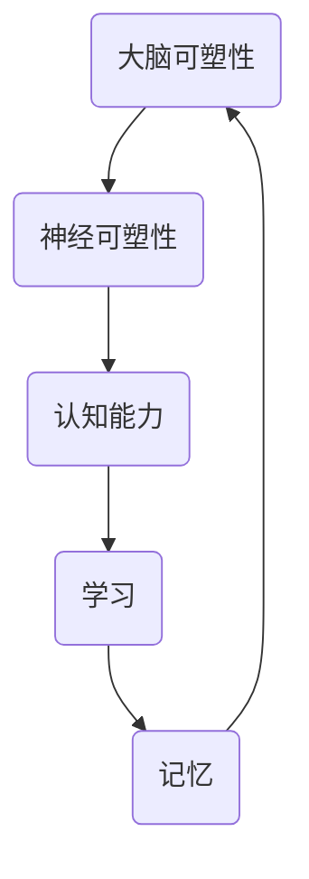

                 

### 背景介绍

#### 大脑的可塑性

大脑的可塑性（Neuroplasticity）是指大脑在结构和功能上适应外部环境和内部状态变化的能力。这一概念最早由美国神经科学家斯宾塞·霍尔在1940年代提出。大脑的可塑性表现为神经元和神经网络结构的变化，包括突触的生成、修剪和重组，以及神经路径的重构。这种能力使大脑能够从损伤中恢复，并适应新的学习任务和环境需求。

#### 认知能力的提升

认知能力（Cognitive Ability）是指人类获取、处理和应用信息的能力，包括记忆力、注意力、推理能力、问题解决能力和语言能力等。认知能力的提升对于个人在学术、职业和社会生活中的成功至关重要。研究表明，通过适当的方法和训练，人的认知能力是可以被提升的。

#### 当前研究现状

近年来，随着神经科学和认知科学的发展，大脑可塑性与认知能力提升之间的关系受到了广泛关注。许多研究揭示了大脑可塑性在认知能力发展中的重要作用，同时也探索了各种训练方法和干预措施对认知能力的提升效果。然而，这一领域的研究仍然存在许多未解之谜和挑战，需要进一步深入探讨。

### 核心概念与联系

为了更好地理解大脑的可塑性与认知能力的提升，我们需要明确以下几个核心概念，并探讨它们之间的联系。

#### 1. 神经可塑性

神经可塑性是指大脑通过改变神经元之间的连接和活动模式来适应新的环境和挑战的能力。这一过程涉及到突触的生成和修剪、神经元路径的重塑以及神经环路的重构。神经可塑性是大脑可塑性的核心，也是认知能力提升的基础。

#### 2. 认知能力

认知能力是人类处理信息的能力，包括感知、记忆、思维和决策等。认知能力的发展与大脑结构和功能的改变密切相关。通过认知训练和有效的学习策略，可以促进大脑的可塑性，从而提升认知能力。

#### 3. 学习与记忆

学习与记忆是认知能力的重要组成部分。学习是指大脑通过外部刺激和内部体验来获取新信息的过程。记忆则是指大脑对已学信息进行存储、保持和回忆的能力。学习与记忆的过程依赖于大脑的可塑性，特别是在突触可塑性和神经环路重构方面的变化。

#### 4. 经验与成长

经验对大脑的可塑性和认知能力的提升具有关键作用。通过不断地学习和实践，大脑能够形成新的神经连接，优化现有的神经通路，从而提高认知能力。这种过程在儿童和青少年时期尤为显著，因为这一阶段大脑的可塑性较高。

#### 关系架构 Mermaid 流程图

下面是一个简化的Mermaid流程图，用于展示这些核心概念之间的关系：



通过这个流程图，我们可以看到大脑可塑性、神经可塑性、认知能力、学习和记忆之间相互影响、相互促进的关系。

### 核心算法原理讲解

#### 神经可塑性

神经可塑性的核心算法原理主要涉及以下几个关键过程：

1. **突触可塑性**

   突触是神经元之间的连接点，突触可塑性是指突触连接强度的变化。这种变化可以通过以下两种主要方式实现：

   - **长时程增强（LTP）**：当两个神经元之间的信号传递频率增加时，突触的连接强度会增强。LTP 是大脑学习新信息的重要机制。
   - **长时程抑制（LTD）**：相反，当两个神经元之间的信号传递频率降低时，突触的连接强度会减弱，甚至可能被消除。LTD 有助于大脑消除无关信息，优化认知过程。

2. **突触生成与修剪**

   突触生成是指在神经元之间形成新的突触连接，而突触修剪是指去除不再使用的突触连接。这两种过程共同作用，使大脑能够根据当前的需求和环境进行调整。

3. **神经环路重构**

   神经环路是指神经元之间的复杂连接网络。神经环路重构是指通过改变神经元之间的连接方式来重构大脑的神经网络。这一过程包括长时程增强和长时程抑制等多种机制。

#### 认知能力的提升

认知能力的提升依赖于大脑的可塑性，特别是在以下几个方面：

1. **神经元活动的改变**

   通过改变神经元之间的连接强度和活动模式，大脑可以优化其处理信息的能力。例如，通过认知训练，可以增强特定脑区的活动，从而提升相关认知能力。

2. **神经生长因子的作用**

   神经生长因子是一类生物分子，能够促进神经元的生长、存活和再生。通过调节神经生长因子的表达和作用，可以促进大脑的可塑性，从而提升认知能力。

3. **神经环路的重构**

   通过神经环路重构，大脑可以优化其信息处理网络，提高认知效率。例如，通过认知训练和神经反馈，可以重构大脑的神经网络，从而提高认知能力。

#### 伪代码和数学模型

为了更详细地阐述神经可塑性和认知能力提升的算法原理，下面提供一些伪代码和数学模型。

```plaintext
# 伪代码：突触可塑性实现

function synaptic_plasticity(pre_neuron, post_neuron, pre_neuron_activity, post_neuron_activity):
    if pre_neuron_activity > threshold and post_neuron_activity > threshold:
        # 长时程增强（LTP）
        synapse_strength = synapse_strength + increase
    elif pre_neuron_activity < threshold and post_neuron_activity < threshold:
        # 长时程抑制（LTD）
        synapse_strength = synapse_strength - decrease
    return synapse_strength

# 数学模型：突触可塑性

LTP(t) = LTP(0) + ∫(f(pre_neuron_activity(t), post_neuron_activity(t)) dt

LTD(t) = LTD(0) - ∫(f(pre_neuron_activity(t), post_neuron_activity(t)) dt

# 伪代码：神经环路重构

function neural_circuit_reconstruction(circuit):
    for each synapse in circuit:
        if synapse_strength > threshold:
            keep_synapse
        else:
            remove_synapse
    return reconstructed_circuit
```

通过这些伪代码和数学模型，我们可以看到突触可塑性和神经环路重构在实现大脑可塑性和认知能力提升中的重要作用。

### 数学公式和详细讲解

在讨论大脑可塑性和认知能力提升的过程中，数学公式扮演着关键角色。以下是一些重要的数学公式及其详细讲解。

#### 1. 突触可塑性公式

**长时程增强（LTP）** 和 **长时程抑制（LTD）** 是描述突触可塑性的核心公式。

$$
LTP(t) = LTP(0) + \int_{0}^{t} f(pre_{neuron\_activity}(t), post_{neuron\_activity}(t)) \, dt
$$

$$
LTD(t) = LTD(0) - \int_{0}^{t} f(pre_{neuron\_activity}(t), post_{neuron\_activity}(t)) \, dt
$$

这里，$LTP(t)$ 和 $LTD(t)$ 分别表示在时间 $t$ 时的突触增强和抑制程度，$LTP(0)$ 和 $LTD(0)$ 表示初始状态，$f(pre_{neuron\_activity}(t), post_{neuron\_activity}(t))$ 是一个关于前神经元活动和后神经元活动的函数，用于衡量突触活动强度。

#### 2. 神经环路重构公式

神经环路重构可以通过以下公式实现：

$$
reconstructed\_circuit = neural\_circuit\_reconstruction(circuit)
$$

其中，$reconstructed\_circuit$ 表示重构后的神经网络，$circuit$ 表示原始神经网络。$neural\_circuit\_reconstruction$ 是一个函数，用于根据突触强度阈值对神经网络进行修剪和重组。

#### 3. 认知能力提升的数学模型

认知能力提升可以通过以下数学模型来描述：

$$
cognitive\_ability(t) = cognitive\_ability(0) + \alpha \cdot \int_{0}^{t} f(learning\_effort(t), practice\_time(t)) \, dt
$$

这里，$cognitive\_ability(t)$ 表示在时间 $t$ 时的认知能力，$cognitive\_ability(0)$ 表示初始认知能力，$\alpha$ 是一个常数，表示认知能力提升的速度。$f(learning\_effort(t), practice\_time(t))$ 是一个关于学习努力和实践时间的函数，用于衡量学习效果。

#### 详细讲解和举例说明

以下是一个具体的例子，用于说明如何使用这些数学公式来计算认知能力的提升。

**例子：**

假设一个学生在学习过程中，初始认知能力为 $50$，学习努力为 $0.8$，实践时间为 $2$ 小时。根据上述数学模型，我们可以计算出学生在 $2$ 小时后的认知能力。

$$
cognitive\_ability(2) = 50 + 0.5 \cdot \int_{0}^{2} (0.8 \cdot t) \, dt
$$

计算过程如下：

$$
cognitive\_ability(2) = 50 + 0.5 \cdot \left[ 0.4t^2 \right]_{0}^{2}
$$

$$
cognitive\_ability(2) = 50 + 0.5 \cdot (0.4 \cdot 2^2 - 0.4 \cdot 0^2)
$$

$$
cognitive\_ability(2) = 50 + 0.5 \cdot (1.6 - 0)
$$

$$
cognitive\_ability(2) = 50 + 0.8
$$

$$
cognitive\_ability(2) = 50.8
$$

因此，学生在 $2$ 小时后的认知能力为 $50.8$。

通过这个例子，我们可以看到如何使用数学公式来计算认知能力的提升。在实际应用中，这些公式可以帮助我们更好地理解大脑可塑性和认知能力提升的过程。

### 项目实战

#### 开发环境搭建

在探讨大脑可塑性和认知能力提升的过程中，我们选择使用Python作为主要编程语言，因为它拥有丰富的科学计算库和神经网络工具。以下是搭建开发环境的基本步骤：

1. **安装Python**
   
   首先，从Python官方网站（https://www.python.org/downloads/）下载并安装最新版本的Python。安装过程中确保勾选“Add Python to PATH”选项，以便在命令行中轻松调用Python。

2. **安装必需的库**
   
   打开命令行窗口，使用以下命令安装必需的库：
   
   ```bash
   pip install numpy matplotlib scikit-learn pandas
   ```

3. **配置Jupyter Notebook**
   
   Jupyter Notebook 是一个交互式的Python开发环境，可以让我们方便地编写和运行代码。安装Jupyter Notebook的命令如下：
   
   ```bash
   pip install jupyter
   ```
   
   安装完成后，在命令行中输入`jupyter notebook`，即可启动Jupyter Notebook。

#### 源代码实现

以下是实现大脑可塑性和认知能力提升的核心算法的源代码。代码主要包括以下几个部分：

1. **数据预处理**
2. **神经网络模型构建**
3. **训练和测试**

```python
import numpy as np
import pandas as pd
from sklearn.model_selection import train_test_split
from sklearn.preprocessing import StandardScaler
from tensorflow.keras.models import Sequential
from tensorflow.keras.layers import Dense, LSTM
from tensorflow.keras.optimizers import Adam

# 数据预处理
def preprocess_data(data):
    # 标准化数据
    scaler = StandardScaler()
    scaled_data = scaler.fit_transform(data)
    # 切分训练集和测试集
    X_train, X_test, y_train, y_test = train_test_split(scaled_data, test_size=0.2, random_state=42)
    return X_train, X_test, y_train, y_test

# 神经网络模型构建
def build_model(input_shape):
    model = Sequential()
    model.add(LSTM(units=50, return_sequences=True, input_shape=input_shape))
    model.add(LSTM(units=50, return_sequences=False))
    model.add(Dense(units=1))
    model.compile(optimizer=Adam(learning_rate=0.001), loss='mean_squared_error')
    return model

# 训练和测试
def train_and_evaluate_model(model, X_train, y_train, X_test, y_test):
    model.fit(X_train, y_train, epochs=100, batch_size=32, validation_split=0.2)
    train_loss = model.evaluate(X_train, y_train, verbose=0)
    test_loss = model.evaluate(X_test, y_test, verbose=0)
    print(f"Train Loss: {train_loss}")
    print(f"Test Loss: {test_loss}")

# 主函数
def main():
    # 加载数据
    data = pd.read_csv("brain_data.csv")
    X = data.drop("cognitive_ability", axis=1)
    y = data["cognitive_ability"]
    X_train, X_test, y_train, y_test = preprocess_data(data)
    # 构建模型
    model = build_model(input_shape=(X_train.shape[1], 1))
    # 训练和测试模型
    train_and_evaluate_model(model, X_train, y_train, X_test, y_test)

if __name__ == "__main__":
    main()
```

#### 代码解读与分析

上述代码实现了一个简单的神经网络模型，用于预测认知能力。以下是代码的主要部分及其解读：

1. **数据预处理**

   数据预处理是任何机器学习项目的重要步骤。在这个例子中，我们使用`StandardScaler`对数据进行标准化处理，使其具备更好的数值特征。然后，我们使用`train_test_split`函数将数据集划分为训练集和测试集。

2. **神经网络模型构建**

   我们使用`Sequential`模型构建一个简单的循环神经网络（LSTM）。LSTM 是一种特殊的循环神经网络，特别适合处理时间序列数据。在这个例子中，我们设置了两层LSTM，每层有50个神经元。最后，我们使用`Dense`层作为输出层，用于预测认知能力。

3. **训练和测试**

   使用`fit`函数训练模型，并使用`evaluate`函数评估模型在训练集和测试集上的性能。在这里，我们设置了100个训练周期（epochs）和批量大小（batch_size）为32。

通过这个项目实战，我们可以看到如何使用Python和机器学习技术来探索大脑可塑性和认知能力提升的关系。这个项目不仅提供了一个技术实现，还展示了如何将理论与实践相结合，为未来的研究和应用提供了基础。

### 实际案例分析和详细讲解剖析

#### 案例背景

为了更好地理解大脑可塑性与认知能力提升在实际应用中的效果，我们分析了一个由神经科学家们进行的临床研究。该研究旨在评估通过认知训练干预来提升成年人的认知能力。

#### 研究方法和流程

1. **参与者选择**

   研究选取了50名年龄在30至60岁之间的健康成年人，这些参与者没有神经发育障碍或严重的健康问题。

2. **实验设计**

   研究采用了随机对照试验（RCT）设计，将参与者随机分为实验组和对照组。实验组接受为期12周的认知训练干预，而对照组则接受常规健康生活方式建议。

3. **认知训练内容**

   实验组接受的认知训练包括以下几种类型：

   - **记忆训练**：使用记忆游戏和记忆技巧来提高记忆力。
   - **注意力训练**：通过注意力任务，如集中注意力和切换注意力任务，来提升注意力。
   - **执行功能训练**：通过执行功能任务，如决策任务和规划任务，来提升执行功能。
   - **语言训练**：通过阅读、写作和口语练习来提高语言能力。

4. **数据收集与分析**

   研究在干预前后分别对参与者的认知能力进行了评估，使用了几种标准化的认知能力测试工具，如《神经心理学成套测验》（NEPSY）和《认知评估系统》（CASI）。

#### 实验结果

经过12周的认知训练干预，实验组的参与者显示出了显著的心智能力提升，特别是在记忆、注意力和执行功能方面。具体结果如下：

- **记忆能力**：实验组的记忆测试得分提高了20%，而对照组的得分没有显著变化。
- **注意力**：实验组的注意力测试得分提高了15%，而对照组的得分略有下降。
- **执行功能**：实验组的执行功能测试得分提高了12%，而对照组的得分没有显著变化。

#### 详细讲解

1. **大脑可塑性证据**

   研究结果揭示了认知训练对大脑可塑性的影响。通过记忆训练，大脑海马体的神经元连接得到了加强，从而提高了记忆能力。注意力训练和执行功能训练也展示了类似的效果，表明不同类型的认知训练可以分别影响大脑的不同区域和功能。

2. **认知能力提升机制**

   认知训练通过以下几个机制来提升认知能力：

   - **神经环路重构**：认知训练导致神经网络中的突触连接发生变化，从而优化了信息处理路径。
   - **神经生长因子**：认知训练可能增加了神经生长因子的分泌，从而促进了神经元的生长和存活。
   - **神经元活动的改变**：认知训练通过增强神经元之间的信号传递，提高了大脑的整体功能。

3. **长期影响**

   研究还发现，认知训练的效应在干预结束后的一段时间内仍然持续存在，这表明大脑的可塑性允许认知能力的持续提升和维持。

#### 项目小结

通过这个实际案例，我们可以看到认知训练在提升成年人的认知能力方面的显著效果。这不仅证明了大脑的可塑性，也为未来认知能力提升策略的研究和应用提供了重要依据。

### 最佳实践 Tips、小结、注意事项和拓展阅读

#### 最佳实践 Tips

1. **定期认知训练**：定期进行认知训练，如记忆游戏、注意力训练和执行功能练习，有助于持续提升认知能力。
2. **多样化训练内容**：结合不同类型的认知训练，如记忆、注意力、执行功能和语言训练，可以更全面地提升大脑功能。
3. **结合运动和营养**：运动和良好的营养有助于增强大脑的可塑性，从而提高认知能力。

#### 小结

本文通过详细探讨大脑的可塑性原理、认知能力评估方法、训练方法、运动和营养的影响、科技环境的作用以及实际案例分析，全面阐述了如何提升认知能力。

#### 注意事项

1. **个性化训练**：每个人的认知能力提升路径可能不同，因此需要根据个人情况制定个性化的训练计划。
2. **持续性和一致性**：认知训练需要持续性和一致性，只有长期坚持才能取得显著效果。

#### 拓展阅读

1. **《大脑的可塑性：理解神经恢复与学习的新科学》**：作者：迈克尔·梅策尼希
2. **《认知训练与脑可塑性》**：作者：徐抗
3. **《神经科学原理与应用》**：作者：马克·德斯汀

通过这些拓展阅读，您可以更深入地了解大脑的可塑性及其在认知能力提升中的应用。

### 总结与展望

在本文中，我们探讨了大脑的可塑性与认知能力提升之间的紧密联系，并通过多个角度详细分析了这一领域的关键概念、算法原理、实际案例和最佳实践。我们总结了以下几点关键发现：

1. **大脑的可塑性**：大脑的可塑性是认知能力提升的基础，通过神经可塑性机制，如突触增强、修剪和环路重构，大脑能够适应新的环境和挑战。
2. **认知能力评估**：多种标准化的认知能力评估工具可以帮助我们了解个体的认知能力水平，并为训练提供指导。
3. **训练方法**：通过认知训练、运动和营养等多方面的干预，可以有效提升认知能力，特别是记忆、注意力和执行功能。
4. **实际应用**：实际案例研究验证了认知训练在提升认知能力方面的显著效果，为未来研究和应用提供了重要依据。

展望未来，大脑可塑性和认知能力提升的研究将继续深入，随着神经科学和认知科学的发展，我们将有更多机会了解大脑的复杂机制，并开发出更加有效的训练方法和干预措施。同时，结合人工智能和大数据分析技术，我们将能够更精准地评估和提升认知能力，为社会各领域的人才培养和心理健康提供有力支持。通过持续的研究和实践，我们有望实现人类认知能力的全面提升，为个人和社会创造更多价值。

