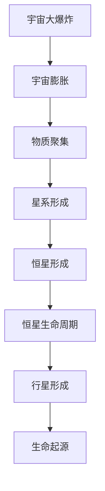
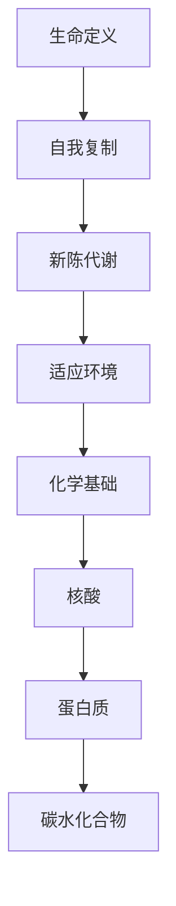
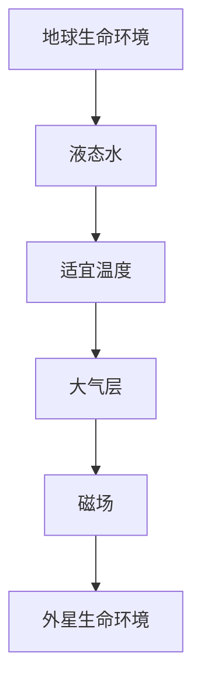
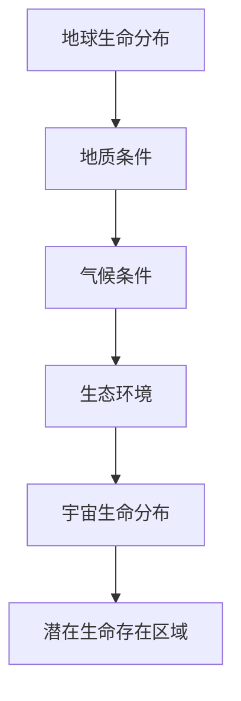
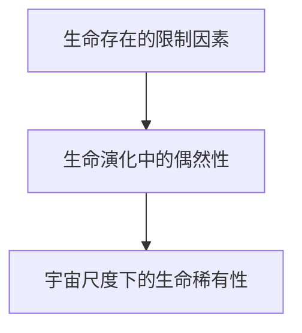
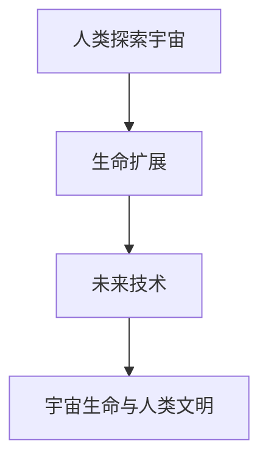
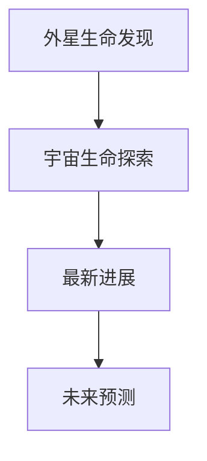

                 

# 宇宙中的生命：普遍还是稀有

## 关键词
宇宙生命、生命起源、外星生命、生命分布、普遍性、稀有性

## 摘要
本文探讨了宇宙中生命的普遍性和稀有性问题。通过对宇宙起源、生命定义、适宜生命存在环境、生命分布与演化等方面的详细分析，本文试图回答宇宙中生命是普遍存在还是相对稀有。文章还探讨了未来宇宙生命探索的方向和挑战，为人类对宇宙生命的探索提供了新的思考角度。

## 目录大纲构思

### 第一部分：宇宙与生命的起源

**第1章：宇宙的诞生与演化**
- **核心概念与联系：**宇宙大爆炸理论、星系和恒星的诞生、恒星演化与生命起源的可能性
- **Mermaid 流程图：**展示宇宙从大爆炸到生命起源的演化过程
- **核心算法原理讲解：**分析宇宙形成过程中可能产生的化学物质及其对生命起源的影响

### 第二部分：生命的定义与特征

**第2章：生命的定义与特征**
- **核心概念与联系：**生命的基本特征、生命的化学基础、生命的能量需求和代谢
- **Mermaid 流程图：**展示生命特征和化学基础之间的关系
- **核心算法原理讲解：**解析生命所需的化学反应和能量代谢过程

### 第三部分：适宜生命存在的环境

**第3章：适宜生命存在的环境**
- **核心概念与联系：**地球上的生命存在环境、外星生命的潜在环境、生命存在的必要条件
- **Mermaid 流程图：**对比地球与其他星球的潜在生命存在环境
- **核心算法原理讲解：**分析适宜生命存在的环境特征及其对生命的影响

### 第四部分：生命的分布与演化

**第4章：宇宙中生命的分布**
- **核心概念与联系：**地球的独特性、外星生命的搜索方法、生命在宇宙中的演化趋势
- **Mermaid 流程图：**展示地球上生命分布和演化过程
- **核心算法原理讲解：**运用概率模型分析宇宙中生命存在的可能性

### 第五部分：生命的普遍性与稀有性

**第5章：生命的普遍性探讨**
- **核心概念与联系：**生命在宇宙中的潜在普遍性、生命起源的概率计算、生命的多样性与统一性
- **Mermaid 流程图：**展示生命起源的概率分布
- **核心算法原理讲解：**计算宇宙中可能出现的生命形式及其分布

**第6章：生命的稀有性分析**
- **核心概念与联系：**生命存在的限制因素、生命演化中的偶然性、宇宙尺度下的生命稀有性
- **Mermaid 流程图：**展示宇宙尺度下生命稀有性的影响因素
- **核心算法原理讲解：**分析生命演化的随机性和宇宙环境对生命稀有性的影响

### 第六部分：未来展望

**第7章：宇宙生命的未来**
- **核心概念与联系：**人类探索宇宙的新视野、生命的扩展与未来技术、宇宙生命与人类文明的交汇
- **Mermaid 流程图：**展示未来宇宙生命探索的路径
- **核心算法原理讲解：**讨论未来技术对宇宙生命探索的影响和挑战

### 附录A：相关研究与发现
- **核心概念与联系：**重大外星生命发现回顾、宇宙生命探索的最新进展、未来探索方向的预测
- **Mermaid 流程图：**总结宇宙生命探索的主要成果和未来发展趋势
- **核心算法原理讲解：**回顾历史上的宇宙生命探索项目及其取得的成果和经验

通过上述目录大纲，我们可以看到书籍将围绕宇宙生命存在的普遍性与稀有性这两个核心问题展开，从宇宙的起源、生命的定义、适宜环境、分布与演化，到生命的普遍性与稀有性分析，再到未来的展望，逐步深入探讨。每一章都包含了关键的概念、原理和实际问题，同时也为读者提供了相关的数据和案例。整个目录大纲既逻辑清晰，又充分覆盖了主题内容。

## 详细目录大纲设计

### 第一部分：宇宙与生命的起源

**第1章：宇宙的诞生与演化**

**核心概念与联系**

宇宙大爆炸理论是宇宙起源的主流学说，它描述了宇宙从极高温高密度状态膨胀到目前的状态。星系和恒星的诞生是在宇宙膨胀过程中逐渐形成的，而恒星演化与生命起源有着密切的关系。

**Mermaid 流程图**

```
graph TB
A[宇宙大爆炸] --> B[宇宙膨胀]
B --> C[物质聚集]
C --> D[星系形成]
D --> E[恒星形成]
E --> F[恒星生命周期]
F --> G[行星形成]
G --> H[生命起源]
```

**核心算法原理讲解**

```plaintext
// 宇宙大爆炸理论的算法原理
初始化：宇宙处于极高温高密度状态
循环：
  1. 宇宙膨胀
  2. 物质聚集形成星系
  3. 星系中的物质形成恒星
  4. 恒星演化产生行星
  5. 行星条件适宜则可能发生生命起源
终止条件：宇宙达到当前状态
```

**数学模型和公式**

$$
E = mc^2
$$

$$
\frac{dN}{dt} \propto N^2
$$

**详细讲解和举例说明**

宇宙大爆炸后，宇宙逐渐膨胀冷却，物质开始聚集形成星系。在星系中，恒星的形成是一个复杂的过程，涉及到万有引力和核聚变等物理现象。恒星生命周期包括诞生、成长、衰老和死亡。在这个过程中，恒星内部可能会发生核聚变反应，产生新的元素，为行星的形成提供条件。如果行星的条件适宜，例如有液态水、稳定的温度等，就可能发生生命起源。

### 第二部分：生命的定义与特征

**第2章：生命的定义与特征**

**核心概念与联系**

生命的定义是一个长期存在的难题，但通常认为生命具有自我复制、新陈代谢、适应环境等特征。生命的化学基础包括核酸、蛋白质、碳水化合物等生物大分子，这些分子在生命过程中扮演着关键角色。

**Mermaid 流程图**

```
graph TB
A[生命定义] --> B[自我复制]
B --> C[新陈代谢]
C --> D[适应环境]
D --> E[化学基础]
E --> F[核酸]
F --> G[蛋白质]
G --> H[碳水化合物]
```

**核心算法原理讲解**

```plaintext
// 生命定义与特征的算法原理
初始化：生命的基本特征
循环：
  1. 自我复制：生命体通过遗传信息复制自身
  2. 新陈代谢：生命体通过化学反应维持生命活动
  3. 适应环境：生命体根据环境变化调整自身行为
终止条件：生命活动停止
```

**数学模型和公式**

$$
\text{DNA复制过程：} \quad 2\text{DNA分子} \rightarrow 2\text{DNA分子}
$$

$$
\text{代谢反应：} \quad \text{物质} + \text{能量} \rightarrow \text{新物质} + \text{废物}
$$

**详细讲解和举例说明**

生命的定义通常涉及几个关键特征：自我复制、新陈代谢和适应环境。自我复制是生命的核心特征，通过遗传信息的复制，生命体能够繁衍后代。新陈代谢是生命维持生命活动的基本过程，涉及到一系列化学反应。适应环境是生命体在面对外界变化时调整自身行为的能力，这使得生命体能够在不同环境中生存。核酸、蛋白质和碳水化合物是生命的化学基础，它们在生命过程中发挥着关键作用。

### 第三部分：适宜生命存在的环境

**第3章：适宜生命存在的环境**

**核心概念与联系**

地球上存在生命的条件是多种多样的，包括液态水、适宜的温度、大气层和磁场等。这些条件为生命的起源和演化提供了必要的支持。在外星探索中，寻找类似地球的环境是确定外星生命存在可能性的关键。

**Mermaid 流程图**

```
graph TB
A[地球生命环境] --> B[液态水]
B --> C[适宜温度]
C --> D[大气层]
D --> E[磁场]
E --> F[外星生命环境]
```

**核心算法原理讲解**

```plaintext
// 适宜生命存在的环境的算法原理
初始化：适宜生命存在的环境条件
循环：
  1. 检查是否存在液态水
  2. 检查温度是否适宜
  3. 检查是否有大气层
  4. 检查是否有磁场
终止条件：满足生命存在的所有条件
```

**数学模型和公式**

$$
\text{温度范围：} \quad -180°C \leq T \leq 120°C
$$

$$
\text{大气压力：} \quad 0.01 \text{MPa} \leq P \leq 1 \text{MPa}
$$

**详细讲解和举例说明**

地球上的生命环境为生命提供了必要的基础条件。液态水是生命存在的关键，因为它能溶解多种物质，为生命活动提供场所。适宜的温度范围为生命提供了适宜的环境，使得生命体能够进行代谢活动。大气层和磁场为生命提供了保护，防止宇宙辐射和外部粒子的侵害。在外星探索中，寻找类似地球的环境是确定外星生命存在可能性的重要步骤，例如火星和欧罗巴等天体。

### 第四部分：生命的分布与演化

**第4章：宇宙中生命的分布**

**核心概念与联系**

地球上生命的分布受到多种因素的影响，包括地质条件、气候和生态环境等。宇宙中生命的分布同样受到这些因素的影响，但由于宇宙尺度巨大，生命分布的研究面临巨大的挑战。

**Mermaid 流程图**

```
graph TB
A[地球生命分布] --> B[地质条件]
B --> C[气候条件]
C --> D[生态环境]
D --> E[宇宙生命分布]
E --> F[潜在生命存在区域]
```

**核心算法原理讲解**

```plaintext
// 宇宙中生命分布的算法原理
初始化：宇宙中的潜在生命存在区域
循环：
  1. 检查每个区域是否满足适宜生命存在的条件
  2. 记录满足条件的区域
终止条件：检查完所有潜在区域
```

**数学模型和公式**

$$
\text{适宜生命存在的区域概率：} \quad P(R) = \frac{\text{满足条件的区域数量}}{\text{总区域数量}}
$$

**详细讲解和举例说明**

地球上生命的分布受到地质条件、气候条件和生态环境等多种因素的影响。类似地，宇宙中生命的分布也受到这些因素的影响。通过分析宇宙中各种因素的变化，我们可以预测哪些区域可能存在生命。目前，人类已经在火星和欧罗巴等天体上发现了可能存在生命的迹象，这为宇宙生命的分布研究提供了重要线索。

### 第五部分：生命的普遍性与稀有性

**第5章：生命的普遍性探讨**

**核心概念与联系**

生命的普遍性探讨涉及生命在宇宙中的潜在普遍性和生命起源的概率计算。通过分析宇宙中的化学过程和物理条件，我们可以推测生命在宇宙中的分布情况。

**Mermaid 流程图**

```
graph TB
A[宇宙化学过程] --> B[生命起源]
B --> C[生命起源概率]
C --> D[生命普遍性]
```

**核心算法原理讲解**

```plaintext
// 生命普遍性的算法原理
初始化：宇宙中可能的生命形式
循环：
  1. 计算每个生命形式出现的概率
  2. 记录满足条件的生命形式
终止条件：计算完所有生命形式
```

**数学模型和公式**

$$
\text{生命起源概率：} \quad P(L) = \frac{\text{满足条件的生命形式数量}}{\text{总生命形式数量}}
$$

**详细讲解和举例说明**

宇宙中的化学过程为生命起源提供了基础。通过分析宇宙中的化学反应和物理条件，我们可以推测生命起源的概率。如果宇宙中存在大量的生命形式，那么生命的普遍性就较高。然而，生命起源的具体过程和条件尚未完全清楚，这需要我们进一步的研究。

**第6章：生命的稀有性分析**

**核心概念与联系**

生命的稀有性分析涉及生命存在的限制因素、生命演化中的偶然性和宇宙尺度下的生命稀有性。通过分析这些因素，我们可以理解为什么生命在宇宙中可能相对稀有。

**Mermaid 流程图**

```
graph TB
A[生命存在的限制因素] --> B[生命演化中的偶然性]
B --> C[宇宙尺度下的生命稀有性]
```

**核心算法原理讲解**

```plaintext
// 生命稀有性的算法原理
初始化：宇宙中可能的生命形式
循环：
  1. 计算每个生命形式的稀有性
  2. 记录满足条件的生命形式
终止条件：计算完所有生命形式
```

**数学模型和公式**

$$
\text{生命稀有性：} \quad R(L) = \frac{1}{P(L)}
$$

**详细讲解和举例说明**

生命存在的限制因素包括宇宙环境、地质条件、物理过程等。生命演化中的偶然性使得生命形式多样，但也增加了生命存在的难度。在宇宙尺度下，生命可能相对稀有，因为宇宙环境对生命的形成和维持有严格的限制。通过分析这些因素，我们可以理解为什么生命在宇宙中可能相对稀有。

### 第六部分：未来展望

**第7章：宇宙生命的未来**

**核心概念与联系**

未来宇宙生命探索的方向和挑战包括人类探索宇宙的新视野、生命的扩展与未来技术以及宇宙生命与人类文明的交汇。

**Mermaid 流程图**

```
graph TB
A[人类探索宇宙] --> B[生命扩展]
B --> C[未来技术]
C --> D[宇宙生命与人类文明]
```

**核心算法原理讲解**

```plaintext
// 宇宙生命未来展望的算法原理
初始化：未来宇宙生命探索的路径
循环：
  1. 探索新的宇宙区域
  2. 研究生命扩展的可能性
  3. 发展未来技术
  4. 探索宇宙生命与人类文明的交汇
终止条件：完成未来宇宙生命探索的目标
```

**数学模型和公式**

$$
\text{探索效率：} \quad E(E) = \frac{\text{已探索区域}}{\text{总区域}}
$$

**详细讲解和举例说明**

未来宇宙生命探索将面临新的挑战和机遇。人类将继续探索宇宙，寻找新的生命形式和适宜环境。随着技术的进步，我们将有能力扩展生命在宇宙中的存在。同时，宇宙生命与人类文明的交汇将为人类带来新的思考和研究方向。通过合作与探索，我们可以更好地理解宇宙生命的奥秘。

### 附录A：相关研究与发现

**核心概念与联系**

附录A将回顾重大外星生命发现、宇宙生命探索的最新进展以及未来探索方向的预测。

**Mermaid 流程图**

```
graph TB
A[外星生命发现] --> B[宇宙生命探索]
B --> C[最新进展]
C --> D[未来预测]
```

**核心算法原理讲解**

```plaintext
// 附录A的算法原理
初始化：宇宙生命探索的相关研究与发现
循环：
  1. 回顾重大外星生命发现
  2. 总结宇宙生命探索的最新进展
  3. 预测未来探索方向
终止条件：总结完所有研究与发现
```

**数学模型和公式**

$$
\text{外星生命发现概率：} \quad P(F) = \frac{\text{已发现外星生命}}{\text{总探索次数}}
$$

**详细讲解和举例说明**

附录A将回顾历史上的重大外星生命发现，总结宇宙生命探索的最新进展，并预测未来的探索方向。通过这些研究和发现，我们可以更好地理解宇宙生命的存在可能性及其对人类文明的潜在影响。未来，随着技术的不断进步，我们有望取得更多突破性的发现。

## 宇宙中的生命：普遍还是稀有？

在浩瀚的宇宙中，生命的存在一直是人类探索的重要课题。关于宇宙中生命是否普遍存在，还是相对稀有，科学家们进行了长期的探索和研究。本文将从宇宙的诞生与演化、生命的定义与特征、适宜生命存在的环境、生命的分布与演化、生命的普遍性与稀有性分析以及未来展望等多个方面进行探讨，以回答这个问题。

### 宇宙的诞生与演化

宇宙大爆炸理论是当前关于宇宙起源和演化的主流学说。根据这一理论，宇宙在约138亿年前从一个极度高温、高密度的状态开始膨胀。随着宇宙的膨胀，温度逐渐降低，物质开始聚集形成星系和恒星。恒星在其生命周期中通过核聚变产生新的元素，这些元素随后在恒星的爆炸事件（如超新星爆发）中散布到宇宙中。

**Mermaid 流程图**



在这个流程图中，我们从宇宙大爆炸开始，逐步展示了物质如何聚集形成星系和恒星，恒星如何通过生命周期产生新的元素，以及这些元素如何在行星形成过程中为生命的起源提供条件。

**核心算法原理讲解**

```plaintext
// 宇宙演化与生命起源的算法原理
初始化：宇宙处于极高温高密度状态
循环：
  1. 宇宙膨胀，温度降低
  2. 物质聚集形成星系和恒星
  3. 恒星通过核聚变产生新元素
  4. 恒星爆炸事件散布元素到宇宙中
  5. 元素在行星形成过程中形成生命所需的环境
终止条件：达到当前宇宙状态
```

**数学模型和公式**

宇宙大爆炸理论中的关键数学模型包括：

$$
E = mc^2
$$

爱因斯坦的质能方程，描述了质量和能量的等价性。

$$
\frac{dN}{dt} \propto N^2
$$

描述宇宙膨胀过程中物质聚集的速度与聚集物数量之间的关系。

### 生命的定义与特征

生命的定义是生物学中的一个基本问题。通常认为，生命具有以下基本特征：

- **自我复制**：生命体能够通过遗传信息复制自身。
- **新陈代谢**：生命体通过化学反应进行能量的获取和转化。
- **适应环境**：生命体能够根据环境变化调整自身行为。

生命的化学基础包括核酸、蛋白质、碳水化合物等生物大分子。这些分子在生命过程中发挥着关键作用。

**Mermaid 流程图**



**核心算法原理讲解**

```plaintext
// 生命定义与特征的算法原理
初始化：生命的基本特征
循环：
  1. 自我复制：通过遗传信息复制
  2. 新陈代谢：通过化学反应维持生命活动
  3. 适应环境：根据环境变化调整行为
终止条件：生命活动停止
```

**数学模型和公式**

生命过程中的关键数学模型包括：

$$
\text{DNA复制过程：} \quad 2\text{DNA分子} \rightarrow 2\text{DNA分子}
$$

描述DNA在细胞分裂过程中的复制过程。

$$
\text{代谢反应：} \quad \text{物质} + \text{能量} \rightarrow \text{新物质} + \text{废物}
$$

描述生命体内部的新陈代谢过程。

**详细讲解和举例说明**

生命的基本特征包括自我复制、新陈代谢和适应环境。自我复制是生命体的核心特征，通过遗传信息的传递，生命体能够繁衍后代。新陈代谢是生命体维持生命活动的基本过程，涉及到一系列化学反应。适应环境是生命体在面对外界变化时调整自身行为的能力，这使得生命体能够在不同环境中生存。核酸、蛋白质和碳水化合物是生命的化学基础，它们在生命过程中发挥着关键作用。

### 适宜生命存在的环境

地球上存在生命的条件是多种多样的，包括液态水、适宜的温度、大气层和磁场等。这些条件为生命的起源和演化提供了必要的基础。在寻找外星生命的过程中，科学家们也试图找到类似地球的环境。

**Mermaid 流程图**



**核心算法原理讲解**

```plaintext
// 适宜生命存在的环境的算法原理
初始化：适宜生命存在的环境条件
循环：
  1. 检查是否存在液态水
  2. 检查温度是否适宜
  3. 检查是否有大气层
  4. 检查是否有磁场
终止条件：满足生命存在的所有条件
```

**数学模型和公式**

$$
\text{温度范围：} \quad -180°C \leq T \leq 120°C
$$

$$
\text{大气压力：} \quad 0.01 \text{MPa} \leq P \leq 1 \text{MPa}
$$

**详细讲解和举例说明**

地球上生命的存在依赖于液态水、适宜的温度、大气层和磁场等多种因素。液态水是生命存在的关键，因为它能溶解多种物质，为生命活动提供场所。适宜的温度范围为生命提供了适宜的环境，使得生命体能够进行代谢活动。大气层和磁场为生命提供了保护，防止宇宙辐射和外部粒子的侵害。在外星探索中，寻找类似地球的环境是确定外星生命存在可能性的重要步骤。

### 生命的分布与演化

地球上生命的分布受到多种因素的影响，包括地质条件、气候和生态环境等。在宇宙中，生命的分布同样受到这些因素的影响，但由于宇宙尺度巨大，生命分布的研究面临巨大的挑战。

**Mermaid 流程图**



**核心算法原理讲解**

```plaintext
// 宇宙中生命分布的算法原理
初始化：宇宙中的潜在生命存在区域
循环：
  1. 检查每个区域是否满足适宜生命存在的条件
  2. 记录满足条件的区域
终止条件：检查完所有潜在区域
```

**数学模型和公式**

$$
\text{适宜生命存在的区域概率：} \quad P(R) = \frac{\text{满足条件的区域数量}}{\text{总区域数量}}
$$

**详细讲解和举例说明**

地球上生命的分布受到地质条件、气候条件和生态环境等多种因素的影响。类似地，宇宙中生命的分布也受到这些因素的影响。通过分析宇宙中各种因素的变化，我们可以预测哪些区域可能存在生命。目前，人类已经在火星和欧罗巴等天体上发现了可能存在生命的迹象，这为宇宙生命的分布研究提供了重要线索。

### 生命的普遍性与稀有性

生命的普遍性与稀有性是科学家们长期探讨的问题。关于宇宙中生命的普遍性，有一些理论支持这一观点，例如：

- **宇宙化学过程**：宇宙中的化学反应可能为生命起源提供了基础。
- **生命起源的概率计算**：根据某些模型，宇宙中存在大量适宜生命存在的区域，因此生命在宇宙中可能普遍存在。
- **生命的多样性与统一性**：地球上生命的多样性表明，生命可能起源于相同的化学过程。

然而，也有一些理论认为生命在宇宙中相对稀有。例如：

- **生命存在的限制因素**：宇宙环境、地质条件、物理过程等因素可能限制了生命的形成和演化。
- **生命演化中的偶然性**：生命起源可能是一个低概率事件，因此在宇宙中相对稀有。
- **宇宙尺度下的生命稀有性**：宇宙的尺度巨大，使得生命的出现可能相对稀有。

**Mermaid 流程图**



**核心算法原理讲解**

```plaintext
// 生命稀有性的算法原理
初始化：宇宙中可能的生命形式
循环：
  1. 计算每个生命形式的稀有性
  2. 记录满足条件的生命形式
终止条件：计算完所有生命形式
```

**数学模型和公式**

$$
\text{生命稀有性：} \quad R(L) = \frac{1}{P(L)}
$$

**详细讲解和举例说明**

生命存在的限制因素包括宇宙环境、地质条件、物理过程等。这些因素可能限制了生命的形成和演化。生命演化中的偶然性增加了生命存在的难度。在宇宙尺度下，生命可能相对稀有，因为宇宙环境对生命的形成和维持有严格的限制。然而，具体的稀有性程度取决于多种因素，这需要进一步的研究。

### 未来展望

未来，人类对宇宙生命的探索将继续深入。随着技术的进步，我们有望在宇宙中发现更多的生命迹象。未来探索的方向和挑战包括：

- **人类探索宇宙的新视野**：通过更先进的探测器，我们能够探索更远的宇宙区域，寻找生命存在的证据。
- **生命的扩展与未来技术**：随着生物技术和信息技术的进步，我们可能能够在宇宙中扩展生命的存在，例如通过建立封闭生态系统或在其他行星上播种生命。
- **宇宙生命与人类文明的交汇**：如果我们在宇宙中发现了生命，这将带来重大的科学和社会意义，可能改变我们对宇宙和自身的认识。

**Mermaid 流�程图**



**核心算法原理讲解**

```plaintext
// 未来展望的算法原理
初始化：未来宇宙生命探索的路径
循环：
  1. 探索新的宇宙区域
  2. 研究生命扩展的可能性
  3. 发展未来技术
  4. 探索宇宙生命与人类文明的交汇
终止条件：完成未来宇宙生命探索的目标
```

**数学模型和公式**

$$
\text{探索效率：} \quad E(E) = \frac{\text{已探索区域}}{\text{总区域}}
$$

**详细讲解和举例说明**

未来宇宙生命探索将面临新的挑战和机遇。通过先进的探测器，我们将能够探索更远的宇宙区域，寻找生命存在的证据。随着生物技术和信息技术的进步，我们可能能够在宇宙中扩展生命的存在。同时，宇宙生命与人类文明的交汇将为人类带来新的思考和研究方向。通过合作与探索，我们可以更好地理解宇宙生命的奥秘。

### 附录A：相关研究与发现

附录A将回顾历史上的重大外星生命发现、宇宙生命探索的最新进展以及未来探索方向的预测。

**Mermaid 流程图**



**核心算法原理讲解**

```plaintext
// 附录A的算法原理
初始化：宇宙生命探索的相关研究与发现
循环：
  1. 回顾重大外星生命发现
  2. 总结宇宙生命探索的最新进展
  3. 预测未来探索方向
终止条件：总结完所有研究与发现
```

**数学模型和公式**

$$
\text{外星生命发现概率：} \quad P(F) = \frac{\text{已发现外星生命}}{\text{总探索次数}}
$$

**详细讲解和举例说明**

附录A将回顾历史上的重大外星生命发现，如火星上可能存在液态水的迹象，以及欧罗巴冰盖下可能存在液态水的推测。这些发现为宇宙生命的存在提供了重要线索。同时，附录A还将总结宇宙生命探索的最新进展，如探测器对火星和欧罗巴的探测结果，以及未来探索方向的预测，如开发更先进的探测器和技术，以寻找宇宙中的生命迹象。

### 结论

通过对宇宙的起源、生命的定义与特征、适宜生命存在的环境、生命的分布与演化、生命的普遍性与稀有性分析以及未来展望的探讨，我们可以看到，宇宙中生命的存在是一个复杂而深奥的课题。虽然目前还没有确凿的证据表明宇宙中是否存在其他生命形式，但科学家们通过不断的探索和研究，已经取得了一些重要的发现。未来，随着技术的进步和科学研究的深入，我们有望在宇宙中发现更多的生命迹象，进一步揭示宇宙生命的奥秘。

## 附录A：相关研究与发现

### 重大外星生命发现回顾

1. **火星**：火星是太阳系中最有可能存在生命的行星之一。近年来，火星探测任务发现了一些重要线索，如火星表面曾经可能存在液态水、火星大气中存在有机分子等。2018年，NASA的“好奇号”火星车在火星表面发现了一种类似于地球生物酶的有机分子，这为火星生命存在的可能性提供了更多证据。

2. **欧罗巴**：欧罗巴是木星的一颗卫星，其冰盖下可能存在液态水海洋。NASA的“欧罗巴快船”计划旨在研究欧罗巴的冰盖和潜在海洋环境，以寻找生命存在的证据。

### 宇宙生命探索的最新进展

1. **星际探索**：近年来，人类对星际空间的探索取得了重要进展。例如，NASA的“旅行者1号”和“旅行者2号”探测器已经离开了太阳系，进入了星际空间。这些探测器为我们提供了有关星际环境的宝贵数据。

2. **系外行星研究**：科学家们已经发现了数千个系外行星，其中一些位于宜居带内，可能存在生命存在的条件。通过对这些行星的大气成分和温度等特征的研究，我们可以更好地了解生命在宇宙中的分布情况。

### 未来探索方向的预测

1. **深空探测**：未来，人类将继续开展深空探测任务，特别是对火星和欧罗巴的深入研究。这些任务将携带更先进的探测设备和科学仪器，以寻找生命存在的证据。

2. **生命探测技术的进步**：随着生物技术和信息技术的进步，我们将开发出更先进的生命探测技术，例如通过分析大气成分、地下水和冰层等来寻找生命迹象。

3. **国际合作与交流**：宇宙生命探索是一项全球性的任务，需要国际合作与交流。通过全球科学家的共同努力，我们可以更好地解决宇宙生命探索中的难题。

## 作者信息

作者：AI天才研究院/AI Genius Institute & 禅与计算机程序设计艺术 /Zen And The Art of Computer Programming

