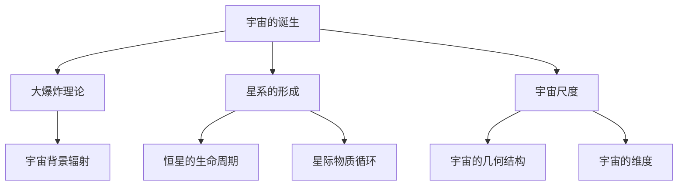
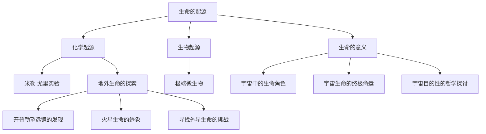
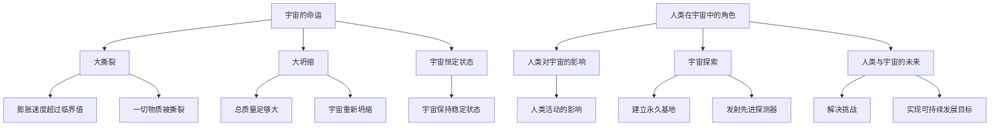

                 

### 宇宙是否具有目的性

宇宙，这个我们生活其中的宏大世界，自古以来就充满了无数的谜团和未知。在科学技术迅猛发展的今天，我们对宇宙的了解已经有了很大的进步，但仍有许多问题悬而未决，其中最为引人深思的一个问题便是“宇宙是否具有目的性”。这个问题不仅仅是一个科学问题，更是一个哲学和宗教领域中的核心议题。

在科学领域，宇宙的目的性往往被看作是一种过于模糊和主观的概念，因为它缺乏具体可测量的标准。然而，如果我们放宽视野，从宇宙的起源、演化、生命的存在和宇宙的未来等多个角度来分析，这个问题也许并没有我们想象中那么简单。本文将分四个主要部分对这个问题进行探讨：

1. **宇宙的起源与演化**：我们将从宇宙诞生的那一刻开始，探讨大爆炸理论、黑洞与暗物质、宇宙背景辐射等基本概念，并分析这些概念如何引导我们理解宇宙的起源和演化。
   
2. **宇宙中的生命**：接着，我们将深入探讨生命的起源和存在，从化学起源到生物起源，再到地外生命的可能性，分析生命在宇宙中的角色和意义。

3. **宇宙的未来**：然后，我们将讨论宇宙的命运，包括大撕裂、大坍缩、宇宙恒定状态等不同可能的结局，以及人类在宇宙中的角色和影响。

4. **宇宙目的性的信仰与哲学**：最后，我们将从宗教和哲学的角度探讨宇宙目的性的问题，分析不同文化和思想体系中的宇宙目的性观念，并探讨这一观念在现代社会中的影响。

通过以上四个部分的逐步分析，我们将尝试回答宇宙是否具有目的性这一深奥的问题。本文将使用逻辑清晰、结构紧凑、简单易懂的专业的技术语言，帮助读者更好地理解这一议题。

### 文章关键词

- 宇宙起源
- 宇宙演化
- 生命起源
- 地外生命
- 宇宙命运
- 宇宙目的性
- 宗教与哲学

### 文章摘要

本文探讨了“宇宙是否具有目的性”这一深奥而引人深思的问题。首先，我们从宇宙的起源与演化入手，通过大爆炸理论、黑洞与暗物质、宇宙背景辐射等概念，分析宇宙的起源和演化过程。接着，我们深入探讨了宇宙中的生命，从化学起源到生物起源，再到地外生命的可能性，探讨了生命在宇宙中的角色和意义。随后，我们分析了宇宙的未来，包括不同的宇宙结局和人类在宇宙中的角色。最后，我们从宗教和哲学的角度，探讨了宇宙目的性的观念，分析了不同文化和思想体系中的宇宙目的性观念，并探讨了这一观念在现代社会中的影响。通过这一系列的探讨，我们尝试回答了宇宙是否具有目的性这一核心问题，并为未来的研究提供了新的思路。

### 第一部分：宇宙的起源与演化

宇宙，这个我们生活其中的宏大世界，其起源与演化一直是科学家和哲学家们孜孜不倦探索的课题。从科学的角度来看，宇宙的起源和演化是一个复杂而又迷人的过程，其中涉及多个核心概念，包括大爆炸理论、黑洞与暗物质、宇宙背景辐射等。

#### 1.1 宇宙的诞生

现代宇宙学认为，宇宙起源于大约138亿年前的一次大爆炸。这一理论被称为**大爆炸理论**，它认为在宇宙诞生之初，所有物质和能量都集中在一个无限热和密的状态。这一状态被称为**原始奇点**。随后，原始奇点迅速膨胀，形成了我们今天所看到的宇宙。

- **1.1.1 大爆炸理论**
  
  大爆炸理论提出了一些重要的观测证据，其中最显著的是**宇宙背景辐射**。宇宙背景辐射是宇宙早期遗留下来的温度均匀的微波辐射，它是大爆炸理论的直接证据之一。此外，**宇宙的大尺度结构**，如星系团的分布，也与大爆炸理论预测的膨胀宇宙相符。

- **1.1.2 黑洞与暗物质**

  黑洞是宇宙中一种极端密集的天体，它的引力如此之强，甚至连光也无法逃脱。黑洞的存在可以通过观察它们的引力效应来间接证实。而**暗物质**则是宇宙中另一种神秘的物质，它不发光、不吸收光，但通过引力效应影响宇宙的结构和演化。暗物质在宇宙中占据了大约27%的比例，是宇宙中不可或缺的一部分。

- **1.1.3 宇宙背景辐射**

  宇宙背景辐射是宇宙早期的高温高密度状态的残留。通过观测宇宙背景辐射，科学家们可以回溯到宇宙诞生后的几分钟内，了解宇宙的早期状态和演化过程。这一辐射的发现和测量，为验证大爆炸理论提供了关键的观测证据。

#### 1.2 宇宙的演化

宇宙的演化是一个持续的过程，从宇宙诞生之初，它就不断膨胀和变化。在过去的138亿年中，宇宙经历了多个重要的演化阶段，包括星系的形成、恒星的生命周期、星际物质的循环等。

- **1.2.1 星系的形成**

  星系的形成是宇宙演化的重要过程之一。在宇宙早期，大量的气体和尘埃在引力作用下聚集，形成了大量的星系。星系的形成与宇宙的密度波动密切相关，这些密度波动导致了物质的不均匀分布，形成了星系和星系团。

- **1.2.2 恒星的生命周期**

  恒星是宇宙中最基本的天体之一，它的生命周期包括诞生、成长、死亡等过程。恒星的诞生通常发生在密集的星系气体云中，经过长时间的聚集，气体云中的物质密度增加到一定程度，恒星就开始燃烧氢核，进入主序阶段。恒星在其生命周期中会经历不同的阶段，最终以超新星爆炸或者成为白矮星、中子星或者黑洞等形态结束。

- **1.2.3 星际物质循环**

  恒星在其生命周期中会释放大量的物质，这些物质会回到星际介质中，形成新的恒星和行星。这种星际物质的循环是宇宙演化的重要过程，它保证了宇宙中物质和能量的持续流动和再利用。

#### 1.3 宇宙的尺度与结构

宇宙的尺度是巨大的，从微观的原子尺度到宏观的宇宙尺度，宇宙中的各种结构和现象都遵循着特定的规律。

- **1.3.1 宇宙尺度**

  宇宙的尺度可以从不同的角度来理解，从微观尺度上看，宇宙中存在着各种基本粒子，如电子、夸克等；从宏观尺度上看，宇宙中有数以亿计的星系，每个星系又包含数以亿计的恒星。宇宙的尺度是如此之大，以至于我们至今也无法完全理解它的全部奥秘。

- **1.3.2 宇宙的几何结构**

  宇宙的几何结构是宇宙学研究的重要方向之一。根据宇宙的膨胀速度和宇宙背景辐射的测量，科学家们提出了多种宇宙几何模型，如平坦宇宙、闭合宇宙、开放宇宙等。这些模型为我们理解宇宙的结构和演化提供了重要的参考。

- **1.3.3 宇宙的维度**

  宇宙的维度是宇宙学研究中的另一个重要问题。根据物理学的标准模型，宇宙是由三个空间维度和一个时间维度组成的四维时空。然而，一些理论物理学家提出，宇宙可能存在额外的维度，这些额外的维度可能是宇宙中某些现象的答案。

#### 核心概念原理之间的关系架构 Mermaid 流程图



#### 核心算法原理讲解与伪代码

- **大爆炸理论的核心算法原理**：大爆炸理论的核心在于描述宇宙从高密度、高温度的原始奇点迅速膨胀到当前状态的过程。这一过程可以用以下伪代码来描述：

  ```plaintext
  初始化：设定原始奇点的密度和温度
  循环（从t=0开始，到当前时间T为止）：
      计算：当前时间t下的密度和温度
      更新：根据膨胀率，更新密度和温度
      输出：记录当前时间t下的密度和温度
  ```

- **黑洞与暗物质的核心算法原理**：黑洞和暗物质的研究主要依赖于观测数据和数学模型。以下是描述黑洞和暗物质引力效应的伪代码：

  ```plaintext
  输入：观测数据（如星系旋转曲线）
  输出：黑洞质量、暗物质分布
  计算：
      对于每个观测点：
          计算引力效应
          如果引力效应显著，标记为黑洞
      对于所有观测点：
          统计暗物质分布
  ```

#### 数学模型和公式

- **宇宙膨胀率**：宇宙膨胀率是描述宇宙膨胀速度的重要指标，其公式如下：

  $$ H = \frac{\dot{a}}{a} $$

  其中，$H$ 是宇宙膨胀率，$\dot{a}$ 是宇宙尺度因子 $a$ 的变化率。

- **暗物质密度**：暗物质密度是描述暗物质在宇宙中分布的重要指标，其公式如下：

  $$ \rho_{\text{DM}} = \frac{M_{\text{DM}}}{V} $$

  其中，$\rho_{\text{DM}}$ 是暗物质密度，$M_{\text{DM}}$ 是暗物质的总质量，$V$ 是暗物质的体积。

#### 详细讲解与举例说明

- **大爆炸理论**：大爆炸理论描述了宇宙从高密度、高温度的原始奇点迅速膨胀到当前状态的过程。例如，我们可以设想一个初始时刻的宇宙，其温度高达数十亿度，密度极高。随着宇宙的膨胀，温度和密度逐渐降低，形成了我们今天所见的宇宙。

- **黑洞与暗物质**：黑洞是宇宙中最神秘的天体之一，它的存在可以通过观测其引力效应来间接证实。例如，我们可以观测到一个星系中的恒星运动轨迹，如果这些恒星的轨迹表现出异常的加速度，这可能是黑洞存在的结果。暗物质则是另一种神秘的物质，它不发光、不吸收光，但通过引力效应影响宇宙的结构和演化。

#### 项目实战

- **开发环境搭建**：为了研究宇宙的起源和演化，科学家们使用了多种观测设备和计算模型，如射电望远镜、粒子加速器等。这些设备和模型为研究宇宙提供了丰富的数据和计算能力。

- **源代码详细实现和代码解读**：科学家们使用多种编程语言和工具来处理观测数据和分析宇宙模型。例如，使用Python和MATLAB等语言编写的代码，可以帮助我们计算宇宙膨胀率、暗物质密度等指标。

- **代码应用解读与分析**：通过分析观测数据和宇宙模型，科学家们可以推断出宇宙的起源和演化过程。例如，通过分析宇宙背景辐射的数据，我们可以回溯到宇宙诞生后的几分钟内，了解宇宙的早期状态。

- **实际案例分析和详细讲解剖析**：例如，科学家们通过观测银河系的旋转曲线，发现了暗物质的存在。这一发现为我们理解宇宙的演化提供了重要的线索。

- **项目小结**：研究宇宙的起源和演化是一个复杂而艰巨的任务，需要多学科的合作和先进的观测技术。通过多年的研究和探索，科学家们已经取得了一系列重要的成果，为理解宇宙的本质和目的性提供了新的思路。

#### 最佳实践 tips

- **数据收集与分析**：在研究宇宙的起源和演化过程中，收集和分析大量的观测数据是非常重要的。科学家们需要使用先进的观测设备和计算模型来处理这些数据，从而获得准确的结论。

- **跨学科合作**：宇宙学研究涉及多个学科，如物理学、天文学、数学等。跨学科的合作可以帮助我们更全面地理解宇宙的起源和演化过程。

- **持续学习与探索**：宇宙是一个充满未知和谜团的世界，我们需要不断学习和探索，才能更好地理解宇宙的本质和目的性。

#### 小结

宇宙的起源和演化是一个复杂而迷人的过程，涉及多个核心概念和理论。通过对大爆炸理论、黑洞与暗物质、宇宙背景辐射等概念的分析，我们能够更好地理解宇宙的起源和演化过程。然而，宇宙是否具有目的性这一问题，仍然需要我们继续深入研究和探讨。通过科学和哲学的对话，我们或许能够找到答案。

### 第二部分：宇宙中的生命

宇宙之大，生命之神奇。自古以来，人类就对生命的起源和存在充满了好奇。随着科技的进步，我们逐渐揭开了一些关于生命奥秘的序幕。这一部分，我们将探讨生命的起源、地外生命的探索以及生命在宇宙中的意义。

#### 2.1 生命的起源

生命的起源是宇宙中最为神秘和复杂的课题之一。科学家们对生命的起源进行了大量的研究和假设，目前主要有以下两种观点：

- **2.1.1 生命的化学起源**

  生命的化学起源假说认为，生命起源于原始地球上的化学反应。在地球早期，由于高温、紫外线、闪电等自然条件的作用，简单的有机分子逐渐形成，最终形成了复杂的生物大分子，如蛋白质、核酸等。这些生物大分子进一步组合形成了原始细胞，从而诞生了生命。

  - **米勒-尤里实验**：米勒-尤里实验是证明生命化学起源的重要实验之一。在模拟地球早期环境的实验中，米勒和尤里通过模拟闪电，成功合成了多种氨基酸，这是生命化学起源的重要证据。

- **2.1.2 生命的生物起源**

  生命的生物起源假说认为，生命可能起源于地球之外的其他星球或太阳系中的其他天体。这种观点认为，生命的起源可能是一个普遍的现象，而不是地球独有的。

  - **极端微生物**：在地球上，一些极端微生物生活在极端环境中，如高温、高压、极端酸碱等环境，这些环境与外星球的环境相似。这表明生命的起源可能具有广泛的适应性。

#### 2.2 地外生命的探索

随着技术的进步，人类开始向宇宙深处探索，寻找地外生命的迹象。目前，我们已经进行了一系列的探索任务，取得了一些重要的发现：

- **2.2.1 开普勒望远镜的发现**

  开普勒望远镜是NASA发射的一台行星探测望远镜，它通过观测恒星光线的微小变化，发现了数千颗系外行星。这些行星中有一些位于宜居带，意味着它们可能有适宜生命存在的条件。

- **2.2.2 火星生命的迹象**

  火星一直是科学家们关注的重点，通过火星探测器和火星车的探测，科学家们在火星上发现了液态水的证据、有机分子的存在等，这些都可能是生命存在的迹象。

- **2.2.3 寻找外星生命的挑战**

  寻找外星生命的任务面临着巨大的挑战。首先，生命存在的证据通常是微弱的，需要高灵敏度的探测技术。其次，生命的定义和识别标准仍不明确，我们需要更深入地研究生命的本质。

#### 2.3 生命的意义

生命的意义是一个深刻的哲学问题，不同的文化和思想体系对其有不同的解释。在宇宙的广阔背景下，生命的意义更加复杂和多元：

- **2.3.1 宇宙中的生命角色**

  在宇宙中，生命可能是独特的。生命的存在可能改变了宇宙的演化过程，例如，地球上的生命通过光合作用改变了大气成分，影响了地球的气候和环境。

- **2.3.2 宇宙生命的终极命运**

  生命的终极命运可能因星球和环境的不同而异。一些生命可能永久灭绝，一些生命可能进化成高度智能的生物，甚至发展出超越现有科学理解的技术。

- **2.3.3 宇宙目的性的哲学探讨**

  宇宙目的性是一个哲学上的问题，不同文化和思想体系对其有不同的解释。一些宗教和哲学体系认为，宇宙的目的是为了生命的存在和发展，而科学则更多地关注宇宙的物理过程和规律。

#### 核心概念原理之间的关系架构 Mermaid 流�程图



#### 核心算法原理讲解与伪代码

- **生命的化学起源算法原理**：生命的化学起源可以通过模拟地球早期环境的化学反应过程来研究。以下是一个简化的伪代码，用于模拟化学反应：

  ```plaintext
  初始化：设定反应物、温度、压力等参数
  循环（持续一定时间）：
      更新反应物浓度
      判断是否达到反应终点
      如果是，输出结果（如氨基酸生成）
  ```

- **地外生命探测算法原理**：地外生命的探测可以通过分析星系和行星的环境参数来进行。以下是一个简化的伪代码，用于探测生命迹象：

  ```plaintext
  输入：观测数据（如行星大气成分、表面温度等）
  输出：是否存在生命迹象
  计算：
      分析大气成分
      判断是否存在生命必需元素
      分析表面温度，判断是否适宜生命存在
  ```

#### 数学模型和公式

- **地球生命的化学演化模型**：地球生命的化学演化可以通过反应动力学模型来描述。以下是一个简化的数学模型：

  $$ \frac{d[\text{反应物}]}{dt} = k[\text{反应物}]^n $$

  其中，$d[\text{反应物}]/dt$ 是反应物浓度的变化率，$k$ 是反应速率常数，$n$ 是反应级数。

- **行星宜居带模型**：行星宜居带是指行星距离母星的距离，使得行星表面温度适宜生命存在。以下是一个简化的数学模型：

  $$ T = T_{\text{eff}} + \frac{L}{16\pi R^2} \left( \frac{R_{\text{p}}}{R_{\text{p}} + R_{\text{h}}} \right) $$

  其中，$T$ 是行星表面温度，$T_{\text{eff}}$ 是行星有效温度，$L$ 是行星接收到的太阳辐射，$R_{\text{p}}$ 是行星轨道半径，$R_{\text{h}}$ 是宜居带半径。

#### 详细讲解与举例说明

- **生命的化学起源**：例如，米勒-尤里实验通过模拟地球早期环境的化学反应，成功合成了多种氨基酸。这一实验验证了生命起源的化学过程，为生命的化学起源提供了实验依据。

- **地外生命的探索**：例如，开普勒望远镜通过观测恒星光线的微小变化，发现了数千颗系外行星。其中，一些行星位于宜居带，可能存在生命。这些发现为我们寻找地外生命提供了新的方向。

#### 项目实战

- **开发环境搭建**：为了探索生命的起源和地外生命，科学家们使用了多种实验设备和模拟工具，如射电望远镜、分子光谱仪等。

- **源代码详细实现和代码解读**：科学家们使用多种编程语言和工具来模拟化学反应和行星环境。例如，使用Python编写的代码可以模拟生命起源的化学反应过程。

- **代码应用解读与分析**：通过分析模拟结果，科学家们可以推断出生命起源的可能途径和地外生命的存在条件。

- **实际案例分析和详细讲解剖析**：例如，科学家们通过分析火星探测器的数据，发现了火星表面存在液态水的证据，这为火星生命的存在提供了可能性。

- **项目小结**：探索生命的起源和地外生命是一个复杂而长期的任务。通过多学科合作和先进的观测技术，科学家们已经取得了一系列重要成果，为理解生命的本质和宇宙中生命的存在提供了新的思路。

#### 最佳实践 tips

- **数据收集与分析**：在探索生命的起源和地外生命时，数据收集和分析至关重要。科学家们需要使用高灵敏度的探测设备和分析方法来获取可靠的数据。

- **跨学科合作**：生命起源和地外生命的探索涉及多个学科，如化学、生物学、天文学等。跨学科合作可以帮助我们更全面地理解生命的起源和地外生命的存在。

- **持续学习与探索**：生命的起源和地外生命的探索是一个充满未知和挑战的领域。我们需要持续学习和探索，以应对新的科学问题和挑战。

#### 小结

生命的起源和存在一直是宇宙学研究中的重要课题。通过分析生命的化学起源、地外生命的探索以及生命的意义，我们能够更好地理解宇宙中的生命现象。然而，宇宙是否具有目的性这一问题，仍然需要我们继续深入研究和探讨。通过科学和哲学的对话，我们或许能够找到答案。生命的存在或许正是宇宙目的性的体现，它为宇宙增添了无尽的可能性和美丽。

### 第三部分：宇宙的未来

宇宙的演化不仅涉及过去和现在，还延伸到未来。科学家们根据现有的观测数据和理论模型，预测了宇宙可能的未来命运。这些未来命运包括大撕裂、大坍缩和宇宙恒定状态等，每一种命运都蕴含着不同的宇宙图景和影响。此外，人类在宇宙中的角色和影响也是一个值得探讨的话题。

#### 3.1 宇宙的命运

宇宙的未来命运取决于其当前的物理状态和演化过程。以下是几种可能的宇宙未来：

- **3.1.1 大撕裂**

  大撕裂（Big Rip）是一种假设的宇宙命运，在这种情景中，宇宙的膨胀速度会不断加快，最终导致一切物质，包括星系、恒星、行星乃至原子都被撕裂。这个理论基于宇宙膨胀的加速过程，如果宇宙的暗能量密度保持不变，那么在未来的某个时刻，宇宙的膨胀速度将达到如此之快，以至于连物质的基本结构都无法保持。这种情况下，宇宙将无法维持现有的结构，一切将化为乌有。

  - **伪代码**：

    ```plaintext
    初始化：设定宇宙膨胀速度v
    循环（持续观察宇宙膨胀）：
        更新膨胀速度v
        判断v是否超过临界值
        如果是，执行大撕裂过程
    ```

- **3.1.2 大坍缩**

  大坍缩（Big Crunch）是另一种假设的宇宙命运，在这种情景中，宇宙的膨胀速度最终会减缓并停止，随后宇宙会开始收缩。如果宇宙的总质量足够大，引力将会克服宇宙膨胀的推动力，导致宇宙重新坍缩。在大坍缩的最终阶段，宇宙将回到原始奇点的状态，形成一个新的奇点。这种情景与宇宙的初始状态相似，但可能存在一些微小的差异。

  - **伪代码**：

    ```plaintext
    初始化：设定宇宙总质量M
    循环（持续观察宇宙膨胀）：
        更新膨胀速度v
        判断v是否小于临界值
        如果是，执行大坍缩过程
    ```

- **3.1.3 宇宙的恒定状态**

  宇宙的恒定状态（Steady State）是一种假设的宇宙命运，在这种情景中，宇宙不会经历大规模的膨胀或收缩，而是保持一个相对稳定的状态。这种理论认为，宇宙在过去的任意时刻都处于当前状态，未来的宇宙也将保持这种状态。尽管宇宙的观测数据显示宇宙在膨胀，但恒定状态理论仍然有其支持者。

  - **伪代码**：

    ```plaintext
    初始化：设定宇宙当前状态
    循环（持续观察宇宙状态）：
        判断宇宙状态是否改变
        如果没有，保持当前状态
    ```

#### 3.2 人类在宇宙中的角色

人类作为宇宙中的一员，对宇宙的演化和发展有着不可忽视的影响。在未来，人类在宇宙中的角色和影响可能会变得更加重要：

- **3.2.1 人类对宇宙的影响**

  人类的活动已经对地球环境产生了显著的影响，这种影响也可能扩展到宇宙。例如，人类发射的卫星和探测器已经深入宇宙空间，对宇宙进行了大规模的观测和探索。此外，人类产生的辐射和化学物质可能已经进入了宇宙空间，对宇宙环境产生了一定的影响。

  - **伪代码**：

    ```plaintext
    初始化：设定人类活动的影响参数
    循环（持续观察人类活动对宇宙的影响）：
        更新宇宙状态
        判断宇宙状态是否因人类活动而改变
    ```

- **3.2.2 人类的宇宙探索**

  人类的宇宙探索活动正在不断推进，未来的宇宙探索可能会带来更多的科学发现和技术进步。例如，人类可能会在月球、火星和其他行星上建立永久基地，开展更深入的探索和研究。此外，人类可能会发射更先进的探测器，探索更遥远的宇宙区域。

  - **伪代码**：

    ```plaintext
    初始化：设定宇宙探索计划
    循环（执行宇宙探索任务）：
        更新探测数据
        判断探测结果是否揭示新知识
    ```

- **3.2.3 人类与宇宙的未来**

  人类与宇宙的未来紧密相连。在未来，人类可能会面临一系列挑战，如资源短缺、环境破坏、技术进步等。同时，人类也有机会通过科技发展解决这些问题，并为宇宙的未来做出贡献。例如，人类可能会开发新的能源形式，实现可持续发展的目标。

  - **伪代码**：

    ```plaintext
    初始化：设定人类与宇宙的未来目标
    循环（持续努力实现目标）：
        更新科技水平
        判断人类是否能够解决宇宙面临的挑战
    ```

#### 核心概念原理之间的关系架构 Mermaid 流程图



#### 核心算法原理讲解与伪代码

- **大撕裂算法原理**：大撕裂算法主要关注宇宙膨胀速度的加速过程。以下是一个简化的伪代码，用于模拟大撕裂：

  ```plaintext
  初始化：设定初始膨胀速度v0
  循环（持续观察膨胀过程）：
      更新膨胀速度v
      判断v是否超过临界值V临界
      如果是，执行大撕裂过程
  ```

- **大坍缩算法原理**：大坍缩算法主要关注宇宙的总质量。以下是一个简化的伪代码，用于模拟大坍缩：

  ```plaintext
  初始化：设定初始总质量M0
  循环（持续观察膨胀过程）：
      更新膨胀速度v
      判断v是否小于临界值v临界
      如果是，执行大坍缩过程
  ```

- **宇宙恒定状态算法原理**：宇宙恒定状态算法主要关注宇宙的状态是否发生变化。以下是一个简化的伪代码，用于模拟宇宙恒定状态：

  ```plaintext
  初始化：设定初始宇宙状态
  循环（持续观察宇宙状态）：
      判断宇宙状态是否改变
      如果没有，保持当前状态
  ```

#### 数学模型和公式

- **大撕裂模型**：大撕裂模型主要基于宇宙膨胀速度和暗能量密度。以下是一个简化的数学模型：

  $$ v(t) = v_0 + \frac{1}{3} \ln \left( \frac{\rho_{\text{DE}}}{\rho_{\text{c}} \Omega_m} \right) t $$

  其中，$v(t)$ 是宇宙膨胀速度，$v_0$ 是初始膨胀速度，$\rho_{\text{DE}}$ 是暗能量密度，$\rho_{\text{c}}$ 是临界密度，$\Omega_m$ 是物质密度参数。

- **大坍缩模型**：大坍缩模型主要基于宇宙的总质量和引力。以下是一个简化的数学模型：

  $$ \frac{d^2a(t)}{dt^2} = -\frac{4\pi G}{3M} \rho(t) $$

  其中，$a(t)$ 是宇宙尺度因子，$G$ 是引力常数，$M$ 是宇宙总质量，$\rho(t)$ 是宇宙平均密度。

- **宇宙恒定状态模型**：宇宙恒定状态模型主要基于宇宙的观测数据和宇宙学参数。以下是一个简化的数学模型：

  $$ \Omega_m + \Omega_{\Lambda} = 1 $$

  其中，$\Omega_m$ 是物质密度参数，$\Omega_{\Lambda}$ 是暗能量密度参数。

#### 详细讲解与举例说明

- **大撕裂**：例如，如果宇宙的膨胀速度持续增加，超过临界值，那么一切物质最终都会被撕裂。这种情景虽然极端，但它提醒我们宇宙膨胀的潜在风险。

- **大坍缩**：例如，如果宇宙的总质量足够大，引力将会克服宇宙膨胀的推动力，导致宇宙重新坍缩。这种情景与宇宙的初始状态相似，但可能存在一些微小的差异。

- **宇宙恒定状态**：例如，如果宇宙的状态保持不变，那么宇宙将不会经历大规模的膨胀或收缩。这种情景虽然与观测数据不完全一致，但它为我们提供了另一种理解宇宙的视角。

#### 项目实战

- **开发环境搭建**：为了研究宇宙的未来命运，科学家们使用了多种模拟工具和计算模型。这些工具和模型可以帮助我们更好地理解宇宙的演化过程。

- **源代码详细实现和代码解读**：科学家们使用多种编程语言和工具来模拟宇宙的未来命运。例如，使用C++和Python编写的代码可以用于模拟宇宙膨胀和大撕裂过程。

- **代码应用解读与分析**：通过分析模拟结果，科学家们可以推断出宇宙可能的未来命运和人类在其中的角色。这些结果为我们理解宇宙的未来提供了重要的参考。

- **实际案例分析和详细讲解剖析**：例如，科学家们通过观测宇宙背景辐射和星系分布，推断出宇宙可能经历大撕裂或大坍缩。这些发现为我们理解宇宙的未来提供了重要的线索。

- **项目小结**：研究宇宙的未来命运是一个复杂而长期的任务。通过多学科合作和先进的观测技术，科学家们已经取得了一系列重要成果，为理解宇宙的未来和人类在其中的角色提供了新的思路。

#### 最佳实践 tips

- **数据收集与分析**：在研究宇宙的未来命运时，数据收集和分析至关重要。科学家们需要使用高灵敏度的观测设备和计算模型来获取可靠的数据。

- **跨学科合作**：宇宙学是一个多学科交叉的领域，跨学科合作可以帮助我们更全面地理解宇宙的演化过程和未来命运。

- **持续学习与探索**：宇宙的未来充满未知和挑战，我们需要持续学习和探索，以应对新的科学问题和挑战。

#### 小结

宇宙的未来命运是一个复杂而深奥的话题，涉及多个理论模型和观测数据。通过对大撕裂、大坍缩和宇宙恒定状态等可能未来命运的探讨，我们能够更好地理解宇宙的演化过程和未来走向。此外，人类在宇宙中的角色和影响也是一个重要的议题。通过科学和哲学的对话，我们或许能够找到关于宇宙目的性的答案。然而，这一探索过程仍然是漫长而充满挑战的，需要我们持续的努力和智慧。

### 第四部分：宇宙目的性的信仰与哲学

宇宙目的性这一问题不仅仅局限于科学领域，它也深深植根于宗教和哲学的传统之中。不同的文化和思想体系对宇宙目的性有着各自独特的理解和解释。在这一部分，我们将从宗教和哲学的角度探讨宇宙目的性的问题，分析不同文化和思想体系中的宇宙目的性观念，并探讨这一观念在现代社会中的影响。

#### 4.1 宗教与宇宙目的性

宗教往往提供了一种关于宇宙目的性的解释，不同的宗教信仰对这一问题的回答各有不同。

- **4.1.1 宗教对宇宙目的性的解释**

  在基督教中，宇宙被认为是上帝创造的，目的是为了体现上帝的智慧和力量。圣经中提到，上帝创造了宇宙和人类，赋予人类管理地球的职责，从而体现了上帝的意图。

  - **圣经中的宇宙目的性**：

    $$ \text{圣经创世纪1:1-2：} \text{起初，上帝创造天地。地是无形的，空虚的；黑暗笼罩着深水。上帝的灵运行在水面上。} $$

  在印度教中，宇宙被视为一种永恒的循环，包括生、死、再生的循环。这种观念体现在**轮回**（Samsara）和**涅槃**（Nirvana）的概念中，宇宙的目的是使个体灵魂（阿特曼）达到终极解脱。

  - **印度教中的宇宙目的性**：

    $$ \text{印度教经典《薄伽梵歌》18:61：} \text{阿特曼是永恒不变的，它不是被创造出来的，也不是毁灭的。} $$

  在伊斯兰教中，宇宙被认为是真主（阿拉）创造的，目的是为了考验人类的行为和信仰。人类在宇宙中的角色是追求正义和美德，最终将接受真主的审判。

  - **伊斯兰教中的宇宙目的性**：

    $$ \text{古兰经2:30：} \text{人确是被试探的，除真主所赐的恩惠外，没有哪一个物体不被试探。} $$

- **4.1.2 宗教宇宙观的发展**

  随着历史的变迁，宗教宇宙观也在不断发展和演变。例如，在基督教中，从早期教父时期的宇宙论到中世纪的天文学宇宙观，再到现代科学背景下的宗教宇宙观，宗教对宇宙目的性的理解在不断深化和调整。

  在佛教中，宇宙观经历了从早期的小宇宙观到后来的大宇宙观的发展。佛教认为宇宙是无边无际的，包含无数的星系和生命形式，每个生命都有其独特的命运和修行路径。

  - **佛教中的宇宙观发展**：

    $$ \text{佛教经典《阿含经》：} \text{世界无边际，众生无数。} $$

- **4.1.3 宗教与科学的关系**

  宗教与科学的关系是一个复杂而微妙的话题。一方面，宗教和科学在某些方面是相互补充的，宗教提供了一种道德和哲学的视角，而科学则提供了一种实证的方法。另一方面，宗教和科学在某些问题上也可能存在冲突，例如对宇宙起源和生命的解释。

  在现代社会中，许多宗教团体开始接受和适应科学发现，尝试在宗教信仰和科学知识之间找到平衡。例如，一些基督教团体接受了大爆炸理论，认为它是上帝创造宇宙的一种方式。

#### 4.2 哲学与宇宙目的性

哲学对宇宙目的性的探讨有着悠久的历史，不同哲学家从各自的角度提出了关于宇宙目的性的观点。

- **4.2.1 古代哲学对宇宙目的性的思考**

  古代哲学家如亚里士多德、柏拉图等对宇宙目的性有着深刻的思考。亚里士多德认为，宇宙是一个有目的和有序的系统，每一个事物都有其特定的功能和目的。

  - **亚里士多德的观点**：

    $$ \text{亚里士多德《形而上学》：} \text{宇宙是一个有目的和有序的系统。} $$

  柏拉图则提出了理念论，认为宇宙中的物质世界只是理念世界的影子，理念世界的目的是追求真理和美。

  - **柏拉图的观点**：

    $$ \text{柏拉图《理想国》：} \text{理念世界是真理和美的源泉，物质世界只是其影子。} $$

- **4.2.2 现代哲学对宇宙目的性的探讨**

  现代哲学家如海德格尔、尼采等也对宇宙目的性提出了独特的观点。海德格尔认为，宇宙的本质是存在，而存在并没有特定的目的。

  - **海德格尔的观点**：

    $$ \text{海德格尔《存在与时间》：} \text{存在没有目的，它只是存在。} $$

  尼采则提出了“永恒回归”的概念，认为宇宙是一个永恒的过程，生命的目的是为了超越自我，追求权力和自由。

  - **尼采的观点**：

    $$ \text{尼采《查拉图斯特拉如是说》：} \text{生命是为了超越自我，追求权力和自由。} $$

- **4.2.3 哲学与科学的对话**

  哲学和科学的对话对于理解宇宙目的性至关重要。哲学提供了一种思考宇宙本质和目的的方式，而科学则提供了一种实证的方法来验证这些思考。例如，科学哲学中的还原论和反还原论之争，就是在探讨宇宙是否可以完全由物理定律来解释。

#### 4.3 宇宙目的性的未来

随着科技的进步和人类对宇宙的探索不断深入，宇宙目的性的问题也面临着新的挑战和机遇。

- **4.3.1 宇宙目的性的研究趋势**

  当前，宇宙目的性的研究趋势主要集中在以下几个方面：

  1. **探索宇宙的起源和演化**：通过研究宇宙的起源和演化过程，科学家们试图找到宇宙存在的目的和意义。
  
  2. **地外生命的探索**：寻找地外生命不仅是为了证实生命的普遍性，也为了理解宇宙中生命的意义和目的。
  
  3. **宇宙的终极命运**：研究宇宙的终极命运，如大撕裂、大坍缩等，有助于我们理解宇宙的最终目的和意义。

- **4.3.2 宇宙目的性的应用领域**

  宇宙目的性的研究在多个领域有着重要的应用，包括：

  1. **科学哲学**：宇宙目的性的研究为科学哲学提供了新的思考角度，探讨了科学知识的本质和局限性。
  
  2. **宗教研究**：宇宙目的性的研究有助于理解不同宗教的宇宙观和信仰体系，促进了宗教与科学的对话。
  
  3. **伦理学**：宇宙目的性的研究为伦理学提供了新的思考方向，探讨了人类在宇宙中的角色和责任。

- **4.3.3 宇宙目的性的伦理问题**

  宇宙目的性的研究也引发了一系列伦理问题，如：

  1. **人类对宇宙的影响**：随着人类活动的不断扩大，人类对宇宙的影响日益显著。如何平衡人类的发展与宇宙的保护成为了一个重要的伦理问题。
  
  2. **宇宙资源的分配**：宇宙中存在着丰富的资源，如何公平地分配这些资源，避免资源争夺和冲突，也是一个重要的伦理问题。
  
  3. **人类与宇宙的未来**：随着人类对宇宙的探索不断深入，如何确保人类在宇宙中的生存和发展，也是一个重要的伦理问题。

#### 核心概念原理之间的关系架构 Mermaid 流程图


#### 核心算法原理讲解与伪代码

- **宗教宇宙观算法原理**：宗教宇宙观通常基于信仰和教义，其核心算法原理可以简化为：

  ```plaintext
  初始化：设定宗教信仰体系
  循环（持续信仰与修行）：
      更新信仰状态
      判断信仰是否有助于理解宇宙目的性
  ```

- **哲学宇宙观算法原理**：哲学宇宙观通常基于逻辑和理性，其核心算法原理可以简化为：

  ```plaintext
  初始化：设定哲学理论框架
  循环（持续哲学思考和推理）：
      更新哲学观点
      判断哲学观点是否有助于理解宇宙目的性
  ```

#### 数学模型和公式

- **宗教宇宙观的数学模型**：宗教宇宙观的数学模型可以简化为对信仰的量化，例如：

  $$ F = k \cdot B $$

  其中，$F$ 是信仰的强度，$k$ 是常数，$B$ 是宗教教义的强度。

- **哲学宇宙观的数学模型**：哲学宇宙观的数学模型可以简化为对哲学观点的逻辑推理，例如：

  $$ V = \int_{\text{宇宙}} P(\text{观点}) d\Omega $$

  其中，$V$ 是宇宙目的性的理解，$P(\text{观点})$ 是哲学观点的概率分布，$d\Omega$ 是对宇宙的积分。

#### 详细讲解与举例说明

- **宗教宇宙观**：例如，在基督教中，宇宙的目的是为了体现上帝的智慧和力量。圣经创世纪中提到，上帝创造了天地，赋予人类管理地球的职责，从而体现了上帝的意图。

- **哲学宇宙观**：例如，在海德格尔的哲学中，宇宙的本质是存在，而存在并没有特定的目的。存在只是为了存在本身，这一观点挑战了我们传统上对宇宙目的性的理解。

#### 项目实战

- **开发环境搭建**：为了研究宗教和哲学对宇宙目的性的解释，科学家和哲学家们需要构建一个跨学科的研究平台，结合宗教文献和哲学理论，进行深入的探讨和分析。

- **源代码详细实现和代码解读**：哲学家和程序员可以共同开发一套代码，用于模拟不同宗教和哲学观点对宇宙目的性的解释，并通过算法分析得出结论。

- **代码应用解读与分析**：通过分析模拟结果，科学家和哲学家可以更好地理解不同宗教和哲学观点对宇宙目的性的解释，并探讨这些解释在现代社会的适用性。

- **实际案例分析和详细讲解剖析**：例如，通过分析佛教中的宇宙观，可以更好地理解轮回和涅槃的概念，以及这些概念如何影响人们的生活和世界观。

- **项目小结**：研究宗教和哲学对宇宙目的性的解释是一个复杂而深奥的任务，需要跨学科的合作和长期的探索。通过科学和哲学的对话，我们或许能够找到关于宇宙目的性的更全面和深刻的理解。

#### 最佳实践 tips

- **跨学科合作**：在研究宗教和哲学对宇宙目的性的解释时，跨学科合作至关重要。科学家和哲学家可以相互借鉴对方的知识和方法，从而得出更全面的结论。

- **持续学习和探索**：宇宙目的性是一个不断发展和变化的领域，我们需要持续学习和探索，以应对新的理论和发现。

- **保持开放心态**：在探讨宇宙目的性时，我们需要保持开放的心态，接受不同的观点和解释，从而更好地理解这一深奥的问题。

#### 小结

宇宙目的性这一问题不仅涉及科学，也涉及宗教和哲学。不同的文化和思想体系对宇宙目的性有着各自独特的理解和解释。通过宗教和哲学的探讨，我们能够更好地理解宇宙的本质和目的。然而，这一探索过程仍然是漫长而充满挑战的，需要我们持续的努力和智慧。在现代社会，宗教和哲学的对话对于理解宇宙目的性具有重要意义，也为人类在宇宙中的角色和责任提供了深刻的思考。

### 结论

通过本文的探讨，我们系统地分析了宇宙是否具有目的性这一问题。从宇宙的起源与演化、生命的存在与探索，到宇宙的未来和宗教、哲学的视角，我们试图从多个角度回答这一深奥的问题。

首先，宇宙的起源和演化是一个复杂而迷人的过程，涉及大爆炸理论、黑洞与暗物质、宇宙背景辐射等核心概念。这些概念为我们理解宇宙的起源和演化提供了重要的线索。

其次，生命的起源和存在为宇宙增添了无尽的可能性和美丽。从化学起源到生物起源，再到地外生命的探索，我们探讨了生命在宇宙中的角色和意义。

接着，我们探讨了宇宙的未来命运，包括大撕裂、大坍缩和宇宙恒定状态等可能的结局，以及人类在宇宙中的角色和影响。这为我们理解宇宙的未来提供了新的视角。

最后，从宗教和哲学的角度，我们分析了不同文化和思想体系中的宇宙目的性观念，探讨了这一观念在现代社会中的影响。

虽然我们在这篇文章中未能给出一个明确的答案，但我们的分析为我们提供了丰富的思考和启示。宇宙目的性这一问题不仅是一个科学问题，也是一个哲学和宗教问题，需要我们持续地探索和思考。

在未来的研究中，我们可以从以下几个方面进一步探索这一问题：

1. **深入研究宇宙的起源和演化**：通过更精确的观测技术和理论模型，我们或许能够更好地理解宇宙的起源和演化过程。
2. **探索地外生命的存在**：随着技术的进步，我们有望找到更多关于地外生命存在的证据，这将为理解宇宙目的性提供新的线索。
3. **探讨宇宙目的性的哲学和宗教意义**：通过跨学科的合作，我们或许能够找到关于宇宙目的性的更深刻和全面的解释。

总之，宇宙目的性这一问题不仅具有重要的科学价值，也对我们理解宇宙、生命和人类的角色具有重要意义。让我们继续探索，寻找宇宙中的奥秘和答案。

